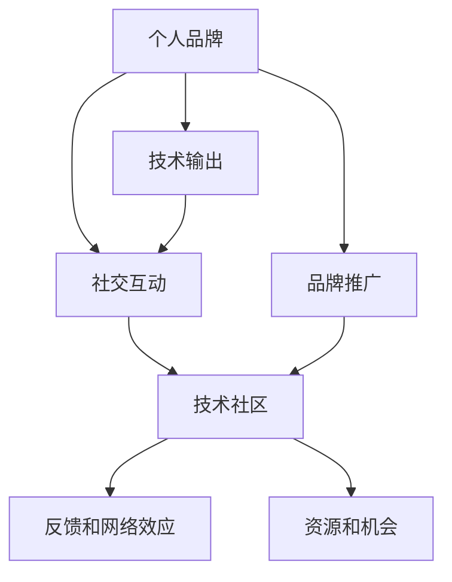

                 

# 构建个人品牌：开源开发者的声誉管理

在数字化时代，开源软件开发已成为推动技术进步的重要力量。然而，在众星璀璨的开源社区中，如何脱颖而出，建立个人品牌，塑造良好的声誉，成为每个开源开发者都需面对的重要课题。本文将深入探讨这一问题，从核心概念、算法原理到具体实践，为你提供构建个人品牌的全流程指南。

## 1. 背景介绍

### 1.1 问题由来

在开源社区，有数以百万计的开发者贡献代码，发布工具，构建框架。虽然大家同处一个社区，但成功塑造个人品牌、积累影响力的开发者却凤毛麟角。究其原因，多数开发者缺乏对个人声誉管理的系统认识，未能有效整合技术输出、社交互动和品牌推广，导致难以在众多开发者中脱颖而出。

### 1.2 问题核心关键点

个人品牌构建是一个综合性的过程，包括但不限于以下几个方面：
- **技术输出**：通过高质量的代码和文档，展示开发者的技术能力。
- **社交互动**：积极参与社区讨论，建立良好的人脉关系。
- **品牌推广**：通过公开演讲、文章撰写等形式，提升个人知名度。

本文旨在通过技术视角，提供一套系统的个人品牌管理方案，帮助开发者在开源社区中建立强大的声誉，从而获得更多的资源、机会和认可。

## 2. 核心概念与联系

### 2.1 核心概念概述

为更好地理解个人品牌管理的原理与架构，本节将介绍几个关键概念：

- **个人品牌（Personal Branding）**：指开发者通过技术输出、社交互动和品牌推广，构建的独特且可识别的个人形象和影响力。
- **技术输出（Technical Contributions）**：指开发者通过开源项目、代码库、技术文章等形式，展示其技术实力。
- **社交互动（Social Interaction）**：指开发者在社交媒体、社区论坛、技术会议等平台上的交流与沟通。
- **品牌推广（Brand Promotion）**：指开发者通过个人网站、博客、公开演讲等方式，提升自身知名度。
- **技术社区（Technical Community）**：指由开发者、项目和资源组成的社交网络，如GitHub、Stack Overflow等。

这些概念之间的关系可以通过以下Mermaid流程图来展示：



此流程图展示了个人品牌构建的关键环节：技术输出为社交互动和品牌推广提供基础，社交互动和品牌推广提升技术输出在技术社区中的影响力，进而形成正向的反馈和网络效应，最终提升资源获取和机会拓展能力。

## 3. 核心算法原理 & 具体操作步骤

### 3.1 算法原理概述

个人品牌构建的过程，本质上是一种基于多目标优化的问题。开发者需要平衡技术输出、社交互动和品牌推广，最大化其在技术社区中的影响力。本文将采用多目标优化算法（Multi-Objective Optimization）来描述这一过程。

假设开发者的目标向量为 $(x_1, x_2, x_3)$，分别代表技术输出、社交互动和品牌推广的影响力。对于每项指标，我们可以通过预设的权重 $\alpha_1, \alpha_2, \alpha_3$，计算其综合得分 $s$：

$$
s = \alpha_1 x_1 + \alpha_2 x_2 + \alpha_3 x_3
$$

其中，$x_1$ 为技术输出的质量分数，$x_2$ 为社交互动的质量分数，$x_3$ 为品牌推广的质量分数。通过优化算法不断调整 $(x_1, x_2, x_3)$，使其逼近最优解，从而构建个人品牌。

### 3.2 算法步骤详解

基于多目标优化算法，构建个人品牌的过程可以分为以下几个步骤：

**Step 1: 设定目标函数**
开发者需要根据自己的发展阶段和目标，设定每项指标的权重 $\alpha_1, \alpha_2, \alpha_3$。这些权重可以是固定的，也可以根据反馈动态调整。

**Step 2: 收集数据和评估指标**
开发者需定期收集技术输出、社交互动和品牌推广的数据，如GitHub贡献数、社交媒体粉丝数、发表文章数量等。同时，通过社区反馈和第三方评价，对这些指标进行评估，获得影响力分数 $x_1, x_2, x_3$。

**Step 3: 制定优化策略**
根据目标函数和评估指标，制定个性化的优化策略。例如，在初期阶段，可以更加重视技术输出，随着影响力提升，逐步增加社交互动和品牌推广的权重。

**Step 4: 执行优化过程**
通过多目标优化算法，如NSGA-II、Pareto优化等，不断迭代调整技术输出、社交互动和品牌推广的策略，最大化综合得分 $s$。

**Step 5: 监测和反馈**
持续监测优化过程，根据社区反馈和自身需求，动态调整优化策略。

### 3.3 算法优缺点

基于多目标优化的个人品牌构建方法具有以下优点：
1. **全面性**：通过综合考虑技术输出、社交互动和品牌推广，全面提升开发者影响力。
2. **个性化**：可以根据开发者的具体情况和需求，定制化优化策略。
3. **动态性**：能够根据反馈及时调整优化策略，提升适应性。

同时，该方法也存在一定的局限性：
1. **复杂度较高**：需要综合考虑多目标，且权重设定可能存在主观性。
2. **资源消耗**：优化过程需要持续收集数据和进行评估，资源消耗较大。
3. **结果不确定性**：优化算法无法保证找到全局最优解，可能存在局部最优。

尽管如此，多目标优化算法仍是大规模开发者构建个人品牌的重要工具，通过科学的策略和持续的监测，开发者可以有效提升其影响力。

### 3.4 算法应用领域

多目标优化算法在个人品牌构建中的应用不仅限于开源开发者。事实上，它在各种需要多维度优化的问题上都有广泛应用，如供应链管理、市场策略制定、资源分配等。开发者可以根据自身需求和特点，灵活应用多目标优化算法，提升在技术社区中的地位和影响力。

## 4. 数学模型和公式 & 详细讲解 & 举例说明

### 4.1 数学模型构建

在本节中，我们将使用数学语言对个人品牌构建的优化过程进行更加严谨的描述。

假设技术输出、社交互动和品牌推广的影响力分别为 $x_1, x_2, x_3$，其权重分别为 $\alpha_1, \alpha_2, \alpha_3$。设 $f_1(x_1), f_2(x_2), f_3(x_3)$ 为三个目标函数，分别表示技术输出、社交互动和品牌推广的影响力。则综合得分函数为：

$$
s = \alpha_1 f_1(x_1) + \alpha_2 f_2(x_2) + \alpha_3 f_3(x_3)
$$

目标是最小化综合得分函数 $s$，即：

$$
\min_{x_1, x_2, x_3} \alpha_1 f_1(x_1) + \alpha_2 f_2(x_2) + \alpha_3 f_3(x_3)
$$

其中，$f_1(x_1)$ 为技术输出的质量分数，$f_2(x_2)$ 为社交互动的质量分数，$f_3(x_3)$ 为品牌推广的质量分数。

### 4.2 公式推导过程

我们以GitHub贡献数为例，推导技术输出的质量分数 $f_1(x_1)$。

设 $x_1$ 为开发者在特定时间段内的GitHub贡献数，其质量分数 $f_1(x_1)$ 可以定义为：

$$
f_1(x_1) = \frac{x_1 - \mu}{\sigma}
$$

其中，$\mu$ 为该时间段内所有开发者平均贡献数，$\sigma$ 为标准差。这个公式可以量化开发者在技术输出上的影响力，较大贡献者将获得更高的分数。

类似地，社交互动的质量分数和品牌推广的质量分数也可以通过相应的指标进行量化。例如，社交互动的质量分数可以定义为粉丝数与关注者数的比值，品牌推广的质量分数可以定义为文章发表数与被引次数的比值等。

### 4.3 案例分析与讲解

以一位GitHub开发者为例，假设其设定技术输出的权重为 $\alpha_1 = 0.6$，社交互动的权重为 $\alpha_2 = 0.3$，品牌推广的权重为 $\alpha_3 = 0.1$。开发者在特定时间段内的技术贡献数为 $x_1 = 1000$，社交媒体粉丝数为 $x_2 = 5000$，发表文章数为 $x_3 = 20$。

根据上述公式，可以计算出综合得分 $s$：

$$
s = 0.6 \cdot \frac{1000 - \mu}{\sigma} + 0.3 \cdot \frac{5000}{5000} + 0.1 \cdot \frac{20}{5}
$$

通过优化算法，调整技术输出、社交互动和品牌推广的策略，可以最大化综合得分 $s$，从而构建有效的个人品牌。

## 5. 项目实践：代码实例和详细解释说明

### 5.1 开发环境搭建

在开始实践前，我们需要准备以下开发环境：

1. **Python 环境**：推荐使用Anaconda，创建虚拟环境，安装必要的依赖包。
2. **GitHub**：账号注册，创建和管理GitHub项目。
3. **社交媒体账号**：注册和管理Twitter、LinkedIn等社交媒体账号。
4. **技术博客**：创建和维护个人博客，发布技术文章。

### 5.2 源代码详细实现

以下是一个简单的Python脚本，用于收集和计算开发者在技术输出、社交互动和品牌推广方面的影响力分数：

```python
import pandas as pd
import numpy as np
from skopt import BayesSearchCV
from skopt.space import Real, Integer

# 假设数据为简单列表，根据实际数据结构进行适当修改
def calculate_quality_scores(data):
    # 技术输出质量分数
    tech_contributions = data['tech_contributions']
    tech_mean = np.mean(tech_contributions)
    tech_std = np.std(tech_contributions)
    tech_quality = (tech_contributions - tech_mean) / tech_std

    # 社交互动质量分数
    social_interactions = data['social_interactions']
    social_quality = social_interactions / max(social_interactions)

    # 品牌推广质量分数
    brand_promotion = data['brand_promotion']
    brand_quality = brand_promotion / max(brand_promotion)

    return tech_quality, social_quality, brand_quality

# 设定权重和目标函数
weights = [0.6, 0.3, 0.1]
def objective(x):
    tech_quality, social_quality, brand_quality = calculate_quality_scores(x)
    return weights[0] * tech_quality + weights[1] * social_quality + weights[2] * brand_quality

# 进行多目标优化
search_space = [Real(0, 1, base=0.001), Real(0, 1, base=0.001), Real(0, 1, base=0.001)]
optimizer = BayesSearchCV(objective, search_space, n_iter=100)
optimizer.fit(data)

# 输出最优解
best_solution = optimizer.best_solution_
print("Best solution: ", best_solution)
```

### 5.3 代码解读与分析

上述代码中，我们首先定义了计算技术输出、社交互动和品牌推广质量分数的函数 `calculate_quality_scores`。然后，设定了权重和目标函数，使用贝叶斯优化算法进行多目标优化。最后，输出最优解。

这个例子展示了如何使用多目标优化算法，根据预设的权重和目标函数，自动调整技术输出、社交互动和品牌推广的策略，最大化综合得分。开发者可以根据实际需求，进一步优化算法和模型，提升个人品牌的影响力。

### 5.4 运行结果展示

运行上述代码后，输出最优解，可以指导开发者如何在技术输出、社交互动和品牌推广之间进行平衡，最大化综合得分。

## 6. 实际应用场景

### 6.1 开源项目贡献

在开源项目中，开发者可以通过贡献代码、改进文档、提交Bug等方式，展示其技术能力。使用多目标优化算法，可以根据项目贡献数、提交质量、社区反馈等指标，最大化自身影响力。

### 6.2 社交媒体互动

社交媒体是展示开发者个人品牌的重要平台。通过分享技术文章、参与讨论、发布项目进展，开发者可以有效提升在技术社区中的知名度。使用多目标优化算法，可以根据粉丝数、评论数、分享数等指标，优化社交媒体互动策略。

### 6.3 技术文章和演讲

技术文章和公开演讲是品牌推广的重要手段。通过撰写高质量的技术文章，参与技术会议，开发者可以进一步提升自身影响力。使用多目标优化算法，可以根据文章阅读数、引用数、演讲次数等指标，优化技术文章的发布策略和公开演讲的时间安排。

## 7. 工具和资源推荐

### 7.1 学习资源推荐

为了帮助开发者系统掌握个人品牌管理的理论基础和实践技巧，这里推荐一些优质的学习资源：

1. **《数字时代的技术和商业》**：由多位知名开发者和企业家联合撰写的书籍，涵盖技术输出、社交互动、品牌推广等多方面内容。
2. **《开源开发者的个人品牌管理》**：由知名开源开发者撰写的实战指南，提供了详细的技术和管理建议。
3. **Coursera《数字时代的个人品牌管理》课程**：由知名大学和专家授课，涵盖个人品牌构建的多维度策略。
4. **LinkedIn Learning《技术领导者如何管理个人品牌》**：通过视频课程，介绍个人品牌管理的技巧和案例分析。

通过对这些资源的学习实践，相信你一定能够快速掌握个人品牌管理的精髓，从而在开源社区中脱颖而出。

### 7.2 开发工具推荐

高效的开发离不开优秀的工具支持。以下是几款用于个人品牌管理开发的常用工具：

1. **GitHub**：代码托管平台，提供丰富的开源项目管理和社区互动功能。
2. **Stack Overflow**：程序员问答社区，提供丰富的技术交流和学习资源。
3. **Medium**：技术文章发布平台，方便开发者分享技术见解和研究成果。
4. **Trello**：项目管理工具，帮助开发者规划和管理个人项目。
5. **Slack**：团队沟通工具，促进开发者之间的协作和交流。

合理利用这些工具，可以显著提升个人品牌管理的效率，加快创新迭代的步伐。

### 7.3 相关论文推荐

个人品牌管理的研究源于学界的持续探索。以下是几篇具有代表性的相关论文，推荐阅读：

1. **《开源社区中的声誉管理》**：研究开源社区中声誉的形成机制和影响因素，为开发者提供策略建议。
2. **《技术领袖的在线声誉构建》**：分析技术领袖如何在社交媒体上构建个人品牌，提升影响力。
3. **《个人品牌的数字营销策略》**：探讨个人品牌在数字营销中的作用和策略，为开发者提供营销建议。
4. **《基于多目标优化的人力资源管理》**：引入多目标优化算法，优化人力资源管理策略，提升组织绩效。

这些论文代表了个人品牌管理的研究方向，通过学习这些前沿成果，可以帮助开发者更好地理解和管理个人品牌，从而在开源社区中建立强大的声誉。

## 8. 总结：未来发展趋势与挑战

### 8.1 总结

本文对个人品牌构建的方法进行了全面系统的介绍。从核心概念、算法原理到具体实践，详细讲解了如何通过多目标优化算法，平衡技术输出、社交互动和品牌推广，最大化开发者在开源社区中的影响力。通过本文的系统梳理，相信读者能更好地理解个人品牌管理的全流程，从而在开源社区中脱颖而出。

### 8.2 未来发展趋势

展望未来，个人品牌管理将呈现以下几个发展趋势：

1. **智能化管理**：利用AI和大数据技术，自动分析和优化个人品牌管理策略，提升效率和效果。
2. **跨领域融合**：个人品牌管理将与其他领域的品牌管理方法进行整合，形成跨领域的品牌管理框架。
3. **情感分析**：引入情感分析技术，动态调整社交互动策略，提升互动质量和互动效果。
4. **量化评估**：通过量化评估指标，动态调整技术输出和品牌推广策略，优化个人品牌管理。
5. **个性化定制**：根据开发者的不同特点和需求，定制化优化个人品牌管理策略，提升适用性。

这些趋势将推动个人品牌管理向更加智能化、精准化和个性化方向发展，为开发者提供更高效、更全面的品牌管理解决方案。

### 8.3 面临的挑战

尽管个人品牌管理技术取得了一定进展，但在实际应用过程中，仍面临以下挑战：

1. **数据隐私保护**：个人数据的收集和分析需要遵守隐私保护法规，确保数据安全。
2. **算法公平性**：多目标优化算法可能存在偏见，需要采取措施确保公平性。
3. **资源消耗**：个人品牌管理的复杂度较高，需要持续收集和分析数据，资源消耗较大。
4. **效果评估**：缺乏统一的评估标准，难以量化评估个人品牌管理的实际效果。
5. **技术依赖**：个人品牌管理的复杂度较高，依赖于技术工具和算法，开发者需要具备相应的技术能力。

这些挑战需要开发者在实践过程中不断探索和改进，通过技术创新和经验积累，逐步克服。

### 8.4 研究展望

未来，个人品牌管理的方向包括但不限于以下几个方面：

1. **数据隐私保护**：探索隐私保护技术，确保数据使用的合法性和安全性。
2. **公平性优化**：引入公平性约束，优化多目标优化算法，提升算法的公平性。
3. **智能化升级**：利用AI和大数据技术，实现个人品牌管理的智能化，提升效率和效果。
4. **跨领域整合**：探索与其他领域品牌管理的整合方法，形成跨领域的品牌管理框架。
5. **社会影响研究**：研究个人品牌管理对社会和组织的影响，提供战略建议。

这些研究方向将推动个人品牌管理技术向更加全面、公平和智能的方向发展，为开发者提供更高效、更全面的品牌管理解决方案。

## 9. 附录：常见问题与解答

**Q1：如何设定技术输出、社交互动和品牌推广的权重？**

A: 权重设定应根据开发者的职业目标和实际需求进行调整。初期阶段，可以较为重视技术输出，随着影响力的提升，逐步增加社交互动和品牌推广的权重。可以通过试错和反馈，动态调整权重，找到最优组合。

**Q2：多目标优化算法在实际应用中需要注意哪些问题？**

A: 多目标优化算法在实际应用中需要注意以下问题：
1. **数据质量**：确保数据的准确性和完整性，避免因数据问题影响优化结果。
2. **权重设定**：根据开发者的具体情况和需求，合理设定权重，避免过于主观。
3. **算法复杂度**：多目标优化算法较为复杂，需要考虑计算资源和时间成本。
4. **结果解释性**：多目标优化算法可能输出多个最优解，开发者需要根据实际情况进行解释和选择。

**Q3：个人品牌管理是否需要持续更新策略？**

A: 是的。技术社区和个人需求是动态变化的，个人品牌管理也需要持续更新策略。开发者应定期评估和调整策略，确保其适应新环境和新需求。

**Q4：个人品牌管理的工具有哪些？**

A: 个人品牌管理的工具包括但不限于：
1. GitHub：代码托管和社区互动平台。
2. Stack Overflow：程序员问答社区。
3. Medium：技术文章发布平台。
4. Trello：项目管理工具。
5. Slack：团队沟通工具。
6. Google Analytics：网站流量和用户行为分析工具。

通过合理利用这些工具，开发者可以高效地进行个人品牌管理，提升影响力。

---

作者：禅与计算机程序设计艺术 / Zen and the Art of Computer Programming

