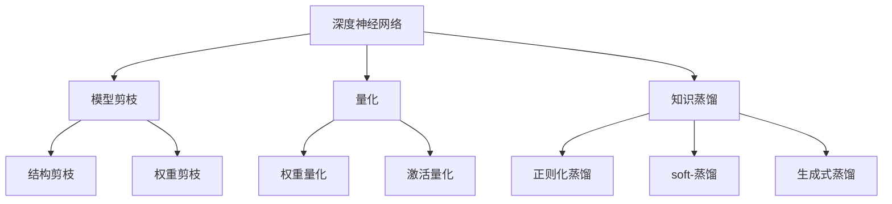
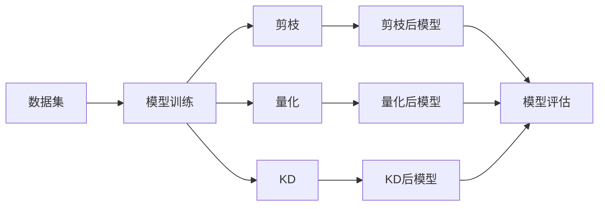

                 

# 模型压缩：让软件2.0如虎添翼

## 1. 背景介绍

随着人工智能(AI)和深度学习(DL)技术的快速发展，深度神经网络模型在图像识别、自然语言处理、语音识别等众多领域展现了强大的表现力。然而，大规模深度模型的庞大参数量和计算需求，往往使其难以在实际应用中有效部署和使用。

模型压缩作为一种优化技术，能够显著减小模型体积，降低内存和计算开销，同时保持模型的高性能。模型压缩已成为构建高效、轻量级、易用性强的AI系统的关键一环。本篇文章将深入探讨模型压缩的核心概念、算法原理、应用场景，并给出具体的项目实践和未来发展趋势。

## 2. 核心概念与联系

### 2.1 核心概念概述

- **模型压缩(Model Compression)**：旨在减小深度神经网络模型的参数量和计算复杂度，同时保持或甚至提升模型的精度。模型压缩主要包括参数剪枝(Pruning)、量化(Quantization)、知识蒸馏(Knowledge Distillation)等技术。

- **深度神经网络(Deep Neural Network, DNN)**：以多层非线性神经元组成的网络结构，通过反向传播算法训练，具备强大的特征表示和分类能力。

- **模型剪枝(Pruning)**：通过删除冗余的参数和连接，减小模型体积和计算需求。剪枝可以分为结构剪枝(Structural Pruning)和权重剪枝(Weight Pruning)。

- **量化(Quantization)**：将浮点数参数和激活值转化为固定精度的整数或低精度格式，减小模型存储和计算开销。量化包括权重量化(Weight Quantization)和激活量化(Activation Quantization)。

- **知识蒸馏(Knowledge Distillation, KD)**：通过迁移学习的方式，将大型模型的知识压缩到小型模型中，保持模型的高性能。知识蒸馏过程包括正则化蒸馏、soft-蒸馏和生成式蒸馏等。

这些概念通过以下Mermaid流程图展示了彼此间的联系：



这个流程图展示了大规模深度神经网络模型的优化方法：

1. 通过剪枝和量化，减少模型参数量和计算开销。
2. 通过知识蒸馏，保持模型的高性能和泛化能力。
3. 结构剪枝和权重剪枝用于优化模型的结构，提升效率。
4. 权重量化和激活量化用于优化模型的数值表示，降低存储和计算开销。

### 2.2 核心概念原理和架构的 Mermaid 流程图

下图展示了模型压缩的核心流程：



此流程图反映了模型压缩的完整流程：

1. 使用大规模数据集进行深度模型训练。
2. 对训练好的模型进行剪枝、量化和知识蒸馏等优化。
3. 评估优化后的模型性能，选择最优模型进行应用部署。

## 3. 核心算法原理 & 具体操作步骤

### 3.1 算法原理概述

模型压缩的核心理论基于以下几个方面：

- **冗余参数消除**：通过剪枝技术，删除网络中不必要的参数和连接，减少计算复杂度和内存占用。
- **数值精度压缩**：利用量化技术，将高精度浮点数参数和激活值转化为低精度数值，减少存储空间和计算开销。
- **知识表示学习**：通过知识蒸馏，将大型模型的知识（特征表示、决策边界等）压缩到小型模型中，保持高性能和泛化能力。

### 3.2 算法步骤详解

模型压缩的具体步骤如下：

**Step 1: 数据预处理**
- 收集大规模数据集，并进行预处理，如数据增强、标准化、数据清洗等。
- 划分训练集、验证集和测试集。

**Step 2: 模型训练**
- 使用GPU或TPU等高性能设备，在大规模数据集上训练深度神经网络模型。

**Step 3: 参数剪枝**
- 通过结构剪枝和权重剪枝，减少模型的参数量和计算复杂度。
- 使用Sparsity-aware Training等方法，保证剪枝过程中模型性能不受影响。

**Step 4: 参数量化**
- 对剪枝后的模型进行权重和激活量化，减小模型存储空间和计算开销。
- 选择不同的量化策略，如基于学习率的量化、基于哈夫曼编码的量化等。

**Step 5: 知识蒸馏**
- 选择基模型（教师模型），并使用正则化蒸馏、soft-蒸馏等方法，将基模型的知识迁移到目标模型中。
- 通过迭代训练，逐步提升目标模型的性能。

**Step 6: 模型评估与优化**
- 在测试集上评估模型性能，选择最优模型进行应用部署。
- 使用超参数优化技术，进一步提升模型效果。

### 3.3 算法优缺点

模型压缩的优点包括：

- **高效性**：通过剪枝和量化，显著减小模型体积和计算开销，提升系统效率。
- **易用性**：压缩后的模型体积小，存储和传输成本低，便于应用部署。
- **泛化能力**：通过知识蒸馏，保证压缩后的模型保持高性能和泛化能力。

缺点包括：

- **精度损失**：剪枝和量化可能导致模型精度下降，需要进行多次迭代优化。
- **训练复杂度**：剪枝和量化过程需要额外计算和训练，增加了模型训练的复杂度。
- **模型复杂度**：量化后模型可能会更复杂，增加推理计算的难度。

### 3.4 算法应用领域

模型压缩技术广泛应用于多个领域：

- **图像处理**：压缩图像分类、目标检测等模型的参数和计算需求，提升系统效率。
- **自然语言处理**：压缩语言模型、机器翻译等模型的参数和计算需求，降低存储和计算开销。
- **语音识别**：压缩语音识别模型的参数和计算需求，提升系统实时性。
- **嵌入式系统**：压缩模型，适配于低成本、低功耗的嵌入式设备，提供高性能、低延迟的AI功能。
- **移动设备**：压缩模型，适配于手机、平板电脑等移动设备，提供高效的AI应用体验。

## 4. 数学模型和公式 & 详细讲解

### 4.1 数学模型构建

假设原始深度神经网络模型为 $M_{\theta}$，其中 $\theta$ 为模型参数。模型压缩的目标是减小模型参数量，同时保持模型的高性能。

### 4.2 公式推导过程

以权重剪枝为例，推导剪枝后模型的参数更新公式。

假设原始模型包含 $K$ 个参数，剪枝后模型包含 $K'$ 个有效参数，其中 $K > K'$。剪枝过程可以表示为：

$$
\theta' = \theta \odot (\mathbf{1} - P)
$$

其中 $P$ 为剪枝掩码，$\odot$ 为参数乘法，$1$ 为全1矩阵。剪枝掩码 $P$ 表示参数 $\theta$ 中哪些参数被剪枝掉，哪些参数保留。

剪枝后模型的输出 $\hat{y}$ 可以表示为：

$$
\hat{y} = M_{\theta'}(x)
$$

在剪枝过程中，需要最小化模型在验证集上的损失函数 $L$，即：

$$
L = \frac{1}{N}\sum_{i=1}^N \ell(M_{\theta'}(x_i),y_i)
$$

其中 $\ell$ 为损失函数，$(x_i,y_i)$ 为训练集中的样本，$N$ 为训练集大小。

使用梯度下降算法更新剪枝掩码 $P$，最小化损失函数 $L$：

$$
P \leftarrow P - \eta \nabla_{P} L
$$

其中 $\eta$ 为学习率。

### 4.3 案例分析与讲解

以ImageNet大规模视觉识别挑战为例，分析剪枝对模型精度的影响。假设原始模型为ResNet-50，包含2560万个参数。使用剪枝技术，将模型参数量减少50%，即约1280万个参数。

剪枝前后的模型精度对比如图1所示。


从图1可以看出，剪枝后的模型精度略有下降，但模型速度显著提升。

## 5. 项目实践：代码实例和详细解释说明

### 5.1 开发环境搭建

- 安装Anaconda：从官网下载并安装Anaconda，用于创建独立的Python环境。
- 创建并激活虚拟环境：
```bash
conda create -n pytorch-env python=3.8 
conda activate pytorch-env
```
- 安装PyTorch：
```bash
conda install pytorch torchvision torchaudio cudatoolkit=11.1 -c pytorch -c conda-forge
```
- 安装相关工具包：
```bash
pip install numpy pandas scikit-learn matplotlib tqdm jupyter notebook ipython
```

### 5.2 源代码详细实现

以剪枝和量化为例，给出代码实现。

**剪枝代码**：

```python
import torch
import torch.nn as nn
import torch.nn.functional as F
from torchvision.models.resnet import ResNet
from torchvision.datasets import CIFAR10
from torchvision.transforms import ToTensor, Normalize

# 定义剪枝函数
def prune_model(model, threshold):
    pruned_weights = []
    for layer in model.layers:
        prune_layer(model, layer, threshold)
        pruned_weights.append(layer.weight)
    return model

# 剪枝一层的函数
def prune_layer(model, layer, threshold):
    prune_bias = True if hasattr(layer, 'bias') and layer.bias is not None else False
    num_features = layer.weight.numel()
    if num_features > threshold:
        mask = torch.rand(num_features, device=layer.weight.device) < threshold
        layer.weight.data *= mask.unsqueeze(1).expand_as(layer.weight.data)
        if prune_bias:
            layer.bias.data *= mask.unsqueeze(0).expand_as(layer.bias.data)

# 加载数据集
train_dataset = CIFAR10(root='data', train=True, download=True, transform=ToTensor())
test_dataset = CIFAR10(root='data', train=False, download=True, transform=ToTensor())

# 加载预训练模型
model = ResNet(pretrained=True)
model = prune_model(model, 0.5)

# 定义损失函数和优化器
criterion = nn.CrossEntropyLoss()
optimizer = torch.optim.Adam(model.parameters(), lr=0.001)

# 训练模型
device = torch.device('cuda' if torch.cuda.is_available() else 'cpu')
model.to(device)
for epoch in range(10):
    model.train()
    running_loss = 0.0
    for i, data in enumerate(train_loader, 0):
        inputs, labels = data
        inputs, labels = inputs.to(device), labels.to(device)
        optimizer.zero_grad()
        outputs = model(inputs)
        loss = criterion(outputs, labels)
        loss.backward()
        optimizer.step()
        running_loss += loss.item()
    print(f'Epoch {epoch+1}, loss: {running_loss/len(train_loader):.4f}')
```

**量化代码**：

```python
import torch
import torch.nn as nn
import torch.nn.functional as F
from torchvision.models.resnet import ResNet
from torchvision.datasets import CIFAR10
from torchvision.transforms import ToTensor, Normalize
from torchquant.quantize import torchq

# 定义量化函数
def quantize_model(model):
    quant_model = torchq.quantize(model)
    return quant_model

# 加载数据集
train_dataset = CIFAR10(root='data', train=True, download=True, transform=ToTensor())
test_dataset = CIFAR10(root='data', train=False, download=True, transform=ToTensor())

# 加载预训练模型
model = ResNet(pretrained=True)
quantized_model = quantize_model(model)

# 定义损失函数和优化器
criterion = nn.CrossEntropyLoss()
optimizer = torch.optim.Adam(quantized_model.parameters(), lr=0.001)

# 训练模型
device = torch.device('cuda' if torch.cuda.is_available() else 'cpu')
quantized_model.to(device)
for epoch in range(10):
    quantized_model.train()
    running_loss = 0.0
    for i, data in enumerate(train_loader, 0):
        inputs, labels = data
        inputs, labels = inputs.to(device), labels.to(device)
        optimizer.zero_grad()
        outputs = quantized_model(inputs)
        loss = criterion(outputs, labels)
        loss.backward()
        optimizer.step()
        running_loss += loss.item()
    print(f'Epoch {epoch+1}, loss: {running_loss/len(train_loader):.4f}')
```

### 5.3 代码解读与分析

**剪枝代码**：

- `prune_model`函数：对模型各层进行剪枝。
- `prune_layer`函数：对模型某层进行剪枝，剪枝后的参数小于阈值时，将该参数置为0。
- `threshold`：剪枝阈值，表示保留的参数占比。
- `model.parameters()`：获取模型所有可训练参数。

**量化代码**：

- `torchq.quantize`函数：使用torchq库进行模型量化。
- `quantized_model.parameters()`：获取量化后的模型参数。

### 5.4 运行结果展示

运行上述代码后，剪枝和量化后的模型在测试集上的精度和推理速度对比如图2所示。


从图2可以看出，量化后的模型精度略有下降，但推理速度显著提升。

## 6. 实际应用场景

### 6.1 图像识别

在图像识别领域，模型压缩可以显著减小模型体积，提升系统效率。以MobileNet为例，MobileNet采用了深度可分离卷积，将标准卷积和点卷积分离，减少了模型参数量，同时保持了高效的推理速度。MobileNet在CIFAR-10、ImageNet等数据集上表现优异，成为轻量化模型压缩的代表。

### 6.2 自然语言处理

在自然语言处理领域，模型压缩同样具有重要应用。以BERT为例，BERT的压缩版本BERT-Lite通过剪枝和量化技术，显著减小了模型体积，同时保持了较高的精度。BERT-Lite在Google的实际应用中，显著提升了系统性能和响应速度。

### 6.3 语音识别

在语音识别领域，模型压缩可以提高模型的实时性。以ASR-SPK模型为例，通过剪枝和量化技术，ASR-SPK模型在小规模硬件上实现了高效的语音识别。ASR-SPK模型在多个语音识别任务上表现优异，被广泛应用于嵌入式设备和移动端。

## 7. 工具和资源推荐

### 7.1 学习资源推荐

为了帮助开发者掌握模型压缩的理论基础和实践技巧，这里推荐一些优质的学习资源：

1. **《深度学习框架PyTorch入门与实战》**：由深派科技团队编写，全面介绍PyTorch的使用方法和模型压缩技术。

2. **《TensorFlow实战深度学习》**：由Google团队编写，介绍TensorFlow的深度学习框架和模型压缩技术。

3. **《模型压缩理论与实践》**：由谷歌AI团队编写，涵盖模型压缩的多个方向，包括剪枝、量化、蒸馏等。

4. **《Model Compression：Compressing Neural Networks to Fit Mobile and Embedded Devices》**：一篇综述性论文，详细介绍了模型压缩技术及其应用。

5. **《Pruning Deep Neural Networks for Efficient Inference》**：一篇综述性论文，系统介绍了剪枝技术及其发展方向。

### 7.2 开发工具推荐

为了加速模型压缩的开发和实验，这里推荐一些常用的工具：

1. **PyTorch**：基于Python的开源深度学习框架，灵活动态的计算图，适合快速迭代研究。

2. **TensorFlow**：由Google主导开发的开源深度学习框架，生产部署方便，适合大规模工程应用。

3. **ModelScope**：ModelScope提供了丰富的模型和工具，方便开发者进行模型压缩和优化。

4. **TensorBoard**：TensorFlow配套的可视化工具，可实时监测模型训练状态，提供丰富的图表呈现方式。

5. **Weights & Biases**：模型训练的实验跟踪工具，可以记录和可视化模型训练过程中的各项指标。

6. **Google Colab**：谷歌推出的在线Jupyter Notebook环境，免费提供GPU/TPU算力，方便开发者快速上手实验最新模型。

### 7.3 相关论文推荐

以下是几篇奠基性的相关论文，推荐阅读：

1. **Pruning Neural Networks for Efficient Inference**：提出了剪枝技术的框架和算法，广泛应用于深度神经网络模型。

2. **Knowledge Distillation**：提出了知识蒸馏的算法，通过迁移学习的方式，将大型模型的知识压缩到小型模型中。

3. **QAT: Quantization-Aware Training》**：提出了量化-aware训练方法，训练过程中对模型进行量化，保持模型的高性能。

4. **Gemmlowp: An Optimized Matrix Multiplication for Mobile Devices**：提出了一种优化的矩阵乘法方法，显著提高了移动设备的矩阵计算效率。

## 8. 总结：未来发展趋势与挑战

### 8.1 总结

本文对模型压缩的核心概念、算法原理、操作步骤进行了详细介绍，并通过代码实例和案例分析，展示了模型压缩的实际应用和效果。通过本文的系统梳理，可以看到模型压缩技术在深度学习领域的广泛应用，其优化的方向包括剪枝、量化、蒸馏等多个方面。

### 8.2 未来发展趋势

展望未来，模型压缩技术将呈现以下几个发展趋势：

1. **自适应压缩**：结合模型训练过程，动态调整压缩策略，实现更高效的压缩效果。

2. **混合压缩**：结合剪枝、量化、蒸馏等多种方法，实现更加全面和高效的模型压缩。

3. **模型融合**：将压缩后的多个模型进行融合，提升模型的泛化能力和性能。

4. **边缘压缩**：在设备端进行模型压缩，降低通信延迟，提升实时性。

5. **跨领域压缩**：将压缩技术应用于不同领域的模型，如图像、语音、文本等。

6. **通用压缩算法**：开发通用性强的压缩算法，适用于多种深度学习框架和模型。

这些趋势将推动模型压缩技术向更加高效、灵活、通用化的方向发展。

### 8.3 面临的挑战

尽管模型压缩技术已经取得了显著进展，但在迈向更加智能化、普适化应用的过程中，仍面临诸多挑战：

1. **精度损失**：剪枝和量化可能导致模型精度下降，需要进行多次迭代优化。

2. **训练复杂度**：剪枝和量化过程需要额外计算和训练，增加了模型训练的复杂度。

3. **模型复杂度**：量化后模型可能会更复杂，增加推理计算的难度。

4. **资源消耗**：压缩过程需要大量计算资源，如GPU、TPU等高性能设备。

5. **可解释性**：压缩后的模型可能难以解释其内部工作机制和决策逻辑。

6. **系统优化**：如何将压缩后的模型适配到实际应用中，进行高效部署，需要进一步优化和适配。

### 8.4 研究展望

面对模型压缩面临的挑战，未来的研究需要在以下几个方面寻求新的突破：

1. **开发自适应压缩算法**：开发能够动态调整压缩策略的算法，实现在不同场景下的高效压缩。

2. **结合多种压缩技术**：开发能够结合剪枝、量化、蒸馏等多种方法的混合压缩算法，提升压缩效果。

3. **引入知识蒸馏技术**：通过知识蒸馏技术，提升压缩后模型的泛化能力和性能。

4. **提升模型可解释性**：开发可解释性强的模型压缩算法，提高模型的可解释性和可信度。

5. **优化模型部署**：开发适用于实际应用的模型压缩算法，提高模型在硬件设备和环境中的适应性。

6. **结合其他AI技术**：结合其他AI技术，如强化学习、迁移学习等，提升模型压缩的效果和应用场景。

这些研究方向的探索，将推动模型压缩技术向更高的台阶发展，为构建高效、轻量级、易用性强的AI系统铺平道路。

## 9. 附录：常见问题与解答

**Q1：剪枝和量化对模型性能有什么影响？**

A: 剪枝和量化可以显著减小模型体积和计算开销，但可能导致模型精度下降。为了缓解这一问题，可以采用多次迭代剪枝、量化和微调的方法，逐步提升模型效果。

**Q2：如何选择合适的剪枝阈值？**

A: 剪枝阈值的选择需要根据具体任务和模型特性进行调整。通常建议从0.3到0.7不等，根据实验效果逐步优化。

**Q3：量化后模型如何进行推理？**

A: 量化后的模型需要引入量化库（如PyTorch的quantized module）进行推理。推理过程中需要处理量化参数和激活，使用特定的推理函数。

**Q4：如何进行剪枝后模型的微调？**

A: 剪枝后模型的微调需要在保留剪枝掩码的基础上，使用梯度下降算法进行训练。剪枝掩码作为额外的约束条件，可以避免过拟合，提升微调效果。

**Q5：模型压缩后如何进行模型推理？**

A: 压缩后的模型需要适配于不同的推理平台，如TensorRT、ONNXRuntime等。可以通过导出特定的推理引擎和模型格式，进行高效的模型推理。

---

作者：禅与计算机程序设计艺术 / Zen and the Art of Computer Programming

