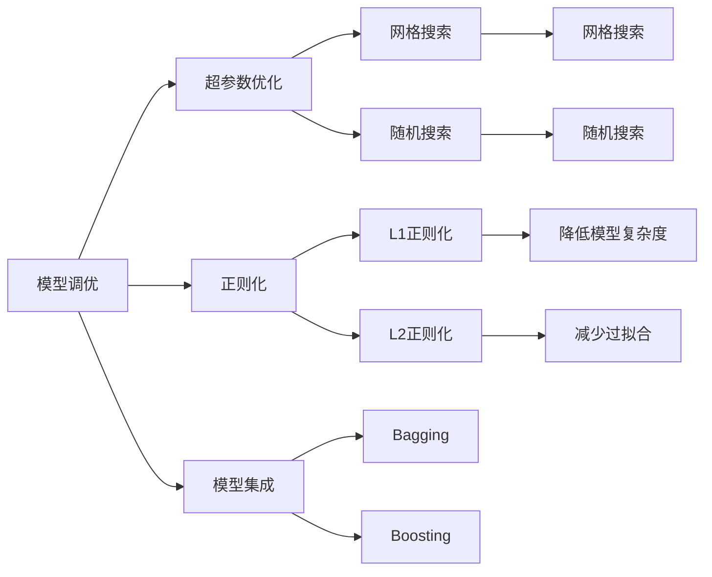

                 

## 1. 背景介绍

### 1.1 问题由来

在人工智能领域，模型调优和数据处理是两个至关重要的环节。优秀的模型和准确的数据处理能够显著提升模型的性能和鲁棒性，使其更好地适应实际应用场景。然而，由于模型和数据的多样性以及复杂性，这两项工作往往面临诸多挑战。本文将从模型调优和数据处理的两个方面出发，深入探讨其在实际应用中的挑战及应对策略。

## 2. 核心概念与联系

### 2.1 核心概念概述

为更好地理解模型调优和数据处理的挑战，我们需要明确几个核心概念及其关系：

- **模型调优（Model Tuning）**：指的是通过调整模型参数和结构，以优化模型性能的过程。通常包括超参数优化、正则化、权重衰减、梯度裁剪等技术。

- **数据处理（Data Processing）**：指的是对原始数据进行清洗、转换、归一化等预处理操作，以提高数据质量，便于模型训练和推理。

- **特征工程（Feature Engineering）**：指在数据处理阶段，通过构造和选择有意义的特征，提升模型对数据的表达能力。

- **模型集成（Model Ensemble）**：指将多个模型结合起来，以提高整体的泛化能力和性能。

- **超参数优化（Hyperparameter Optimization）**：指在模型训练前，通过优化算法寻找最佳超参数组合的过程。

- **正则化（Regularization）**：指通过引入惩罚项，防止模型过拟合，提高模型泛化能力。

这些核心概念之间相互关联，共同构成模型调优和数据处理的整体框架。有效的数据处理和调优策略能够显著提升模型的性能和稳定性，使其更好地适应实际应用场景。

### 2.2 核心概念原理和架构的 Mermaid 流程图



### 2.3 核心概念联系

模型调优和数据处理密切相关，通常需要相互配合以提升模型性能。数据处理的好坏直接影响模型训练的效果，而模型调优则是在数据处理的基础上，通过调整模型参数和结构，进一步优化模型性能。同时，特征工程是数据处理和模型调优之间的桥梁，通过对数据的深入理解和特征的精心选择，能够显著提高模型的表达能力，从而提升模型调优的效果。

## 3. 核心算法原理 & 具体操作步骤

### 3.1 算法原理概述

模型调优和数据处理的核心目标是通过优化算法和预处理技术，提升模型性能和鲁棒性。这一过程通常包括以下几个关键步骤：

1. **数据预处理**：包括清洗、归一化、特征提取等，提升数据质量。
2. **模型选择与初始化**：选择合适的模型架构和超参数设置，进行初始化。
3. **训练与调优**：通过反向传播和优化算法，训练模型，并进行调优。
4. **验证与评估**：使用验证集评估模型性能，进行必要的调整。

### 3.2 算法步骤详解

#### 3.2.1 数据预处理

数据预处理是模型调优和数据处理的重要组成部分。以下是一些常见的数据预处理步骤：

- **数据清洗**：去除缺失值、异常值和噪声，确保数据完整性和准确性。
- **数据归一化**：对数据进行归一化或标准化处理，使其在相同的尺度上进行比较。
- **特征提取**：从原始数据中提取出有意义的特征，提升模型对数据的表达能力。

#### 3.2.2 模型选择与初始化

选择合适的模型架构和超参数设置是模型调优的第一步。以下是一些常见的模型选择和初始化方法：

- **模型选择**：根据任务类型和数据特征，选择合适的模型架构（如线性回归、神经网络、深度学习等）。
- **超参数初始化**：为模型设定合适的超参数（如学习率、批量大小、迭代次数等），并进行初步训练。

#### 3.2.3 训练与调优

训练与调优是模型调优的核心步骤，通过优化算法和调优技术，提升模型性能。以下是一些常见的训练与调优方法：

- **反向传播**：通过反向传播算法，计算模型参数的梯度，更新模型权重。
- **优化算法**：选择适合的优化算法（如梯度下降、Adam、Adagrad等），进行模型训练。
- **正则化**：引入正则化技术（如L1正则化、L2正则化等），防止模型过拟合。
- **超参数优化**：使用网格搜索、随机搜索等方法，寻找最佳超参数组合。

#### 3.2.4 验证与评估

验证与评估是模型调优的最后一个步骤，通过评估模型性能，确保模型具有良好的泛化能力。以下是一些常见的验证与评估方法：

- **交叉验证**：使用交叉验证方法，评估模型在不同数据集上的性能。
- **模型评估**：使用评估指标（如准确率、召回率、F1分数等），评估模型性能。
- **调整模型**：根据评估结果，进行必要的模型调整，进一步优化模型性能。

### 3.3 算法优缺点

#### 3.3.1 优点

模型调优和数据处理具有以下优点：

- **提高模型性能**：通过优化算法和预处理技术，提升模型在特定任务上的性能。
- **增强模型鲁棒性**：通过正则化和数据清洗等技术，提升模型的鲁棒性和泛化能力。
- **降低计算成本**：通过特征工程和模型选择，减少训练时间和计算资源消耗。

#### 3.3.2 缺点

模型调优和数据处理也存在以下缺点：

- **依赖数据质量**：模型性能依赖于数据的质量和数量，数据处理不当可能导致模型性能下降。
- **模型复杂度高**：复杂的模型结构和超参数设置，可能导致模型训练时间较长。
- **过拟合风险**：过拟合是模型调优中常见的问题，需要精心设计正则化策略。

### 3.4 算法应用领域

模型调优和数据处理广泛应用于各种领域，以下是一些常见的应用场景：

- **计算机视觉**：通过数据增强和模型调优，提升图像分类、目标检测、语义分割等任务的表现。
- **自然语言处理**：通过文本清洗、特征提取和模型选择，提升文本分类、情感分析、机器翻译等任务的表现。
- **金融领域**：通过数据清洗和模型调优，提升股票预测、信用评估、风险控制等任务的表现。
- **医疗领域**：通过数据预处理和模型调优，提升疾病诊断、患者管理、治疗方案推荐等任务的表现。

## 4. 数学模型和公式 & 详细讲解 & 举例说明

### 4.1 数学模型构建

模型调优和数据处理涉及大量的数学模型和公式。以下是一些常见的数学模型和公式：

- **线性回归模型**：
$$ y = \beta_0 + \beta_1 x_1 + \beta_2 x_2 + ... + \beta_n x_n + \epsilon $$
其中，$y$ 为因变量，$x_i$ 为自变量，$\beta_i$ 为回归系数，$\epsilon$ 为误差项。

- **神经网络模型**：
$$ f(x) = \sum_{i=1}^n w_i f(\phi(x_i)) + b $$
其中，$f(x)$ 为输出，$w_i$ 为权重，$f(\phi(x_i))$ 为神经元输出，$b$ 为偏置。

- **正则化模型**：
$$ \min_{\theta} \frac{1}{2m} \sum_{i=1}^m (h_\theta(x_i) - y_i)^2 + \lambda \sum_{i=1}^n \theta_i^2 $$
其中，$\theta_i$ 为模型参数，$\lambda$ 为正则化系数。

### 4.2 公式推导过程

#### 4.2.1 线性回归模型的推导

线性回归模型的推导过程如下：

1. 假设模型为 $y = \beta_0 + \beta_1 x_1 + \beta_2 x_2 + ... + \beta_n x_n + \epsilon$
2. 根据最小二乘法，求解回归系数 $\beta_i$，使得 $\sum_{i=1}^n (y_i - h_\theta(x_i))^2$ 最小
3. 通过求导和矩阵运算，得到回归系数 $\beta_i$ 的解为：
$$ \beta_i = \frac{\sum_{i=1}^n x_i y_i}{\sum_{i=1}^n x_i^2} $$

#### 4.2.2 神经网络模型的推导

神经网络模型的推导过程如下：

1. 假设模型为 $f(x) = \sum_{i=1}^n w_i f(\phi(x_i)) + b$
2. 通过前向传播和反向传播算法，计算模型参数 $w_i$ 和 $b$
3. 通过链式法则，计算梯度 $\nabla_{w_i} L(f(x),y)$ 和 $\nabla_{b} L(f(x),y)$，更新模型参数

#### 4.2.3 正则化模型的推导

正则化模型的推导过程如下：

1. 假设模型为 $y = \beta_0 + \beta_1 x_1 + \beta_2 x_2 + ... + \beta_n x_n + \epsilon$
2. 通过引入正则化项 $\lambda \sum_{i=1}^n \theta_i^2$
3. 将正则化项和损失函数结合，得到：
$$ \min_{\theta} \frac{1}{2m} \sum_{i=1}^m (h_\theta(x_i) - y_i)^2 + \lambda \sum_{i=1}^n \theta_i^2 $$
4. 通过求解拉格朗日乘子法，得到最优解为：
$$ \beta_i = \frac{\sum_{i=1}^n x_i y_i}{\sum_{i=1}^n x_i^2} + \lambda \beta_i $$

### 4.3 案例分析与讲解

#### 4.3.1 案例一：线性回归

假设有一组数据集 $(x_i,y_i)$，其中 $x_i$ 为自变量，$y_i$ 为因变量。使用线性回归模型 $y = \beta_0 + \beta_1 x_1 + \beta_2 x_2 + ... + \beta_n x_n + \epsilon$ 进行拟合。

首先，对数据进行归一化处理：
$$ x_i = \frac{x_i - \bar{x}}{s} $$
其中，$\bar{x}$ 为自变量均值，$s$ 为自变量标准差。

然后，通过最小二乘法求解回归系数：
$$ \beta_i = \frac{\sum_{i=1}^n x_i y_i}{\sum_{i=1}^n x_i^2} $$

最后，将回归系数代入模型，得到拟合结果。

#### 4.3.2 案例二：神经网络

假设有一组数据集 $(x_i,y_i)$，其中 $x_i$ 为输入，$y_i$ 为输出。使用神经网络模型 $f(x) = \sum_{i=1}^n w_i f(\phi(x_i)) + b$ 进行拟合。

首先，设计神经网络架构，包括输入层、隐藏层和输出层。

然后，通过前向传播和反向传播算法，计算模型参数 $w_i$ 和 $b$。

最后，将模型参数代入模型，得到拟合结果。

#### 4.3.3 案例三：正则化

假设有一组数据集 $(x_i,y_i)$，其中 $x_i$ 为自变量，$y_i$ 为因变量。使用正则化模型 $y = \beta_0 + \beta_1 x_1 + \beta_2 x_2 + ... + \beta_n x_n + \epsilon$ 进行拟合。

首先，定义正则化项 $\lambda \sum_{i=1}^n \theta_i^2$。

然后，将正则化项和损失函数结合，得到：
$$ \min_{\theta} \frac{1}{2m} \sum_{i=1}^m (h_\theta(x_i) - y_i)^2 + \lambda \sum_{i=1}^n \theta_i^2 $$

最后，通过求解拉格朗日乘子法，得到最优解为：
$$ \beta_i = \frac{\sum_{i=1}^n x_i y_i}{\sum_{i=1}^n x_i^2} + \lambda \beta_i $$

## 5. 项目实践：代码实例和详细解释说明

### 5.1 开发环境搭建

在进行模型调优和数据处理的项目实践前，我们需要准备好开发环境。以下是使用Python进行TensorFlow开发的安装步骤：

1. 安装Anaconda：从官网下载并安装Anaconda，用于创建独立的Python环境。
2. 创建并激活虚拟环境：
```bash
conda create -n tf-env python=3.8 
conda activate tf-env
```
3. 安装TensorFlow：根据CUDA版本，从官网获取对应的安装命令。例如：
```bash
conda install tensorflow==2.5.0 -c pytorch -c conda-forge
```
4. 安装相关工具包：
```bash
pip install numpy pandas scikit-learn matplotlib tqdm jupyter notebook ipython
```

完成上述步骤后，即可在`tf-env`环境中开始项目实践。

### 5.2 源代码详细实现

#### 5.2.1 数据预处理

```python
import numpy as np
import pandas as pd
from sklearn.model_selection import train_test_split

# 读取数据集
data = pd.read_csv('data.csv')

# 数据清洗
data = data.dropna()

# 特征选择
data = data[['feature1', 'feature2', 'feature3']]

# 数据归一化
data = (data - data.mean()) / data.std()

# 数据划分
train_data, test_data = train_test_split(data, test_size=0.2)

# 训练集与测试集
train_x = train_data[['feature1', 'feature2', 'feature3']]
train_y = train_data['label']

test_x = test_data[['feature1', 'feature2', 'feature3']]
test_y = test_data['label']
```

#### 5.2.2 模型选择与初始化

```python
from tensorflow.keras.models import Sequential
from tensorflow.keras.layers import Dense

# 定义模型
model = Sequential()

# 添加输入层
model.add(Dense(64, input_dim=3, activation='relu'))

# 添加隐藏层
model.add(Dense(32, activation='relu'))

# 添加输出层
model.add(Dense(1, activation='sigmoid'))

# 编译模型
model.compile(optimizer='adam', loss='binary_crossentropy', metrics=['accuracy'])
```

#### 5.2.3 训练与调优

```python
import tensorflow as tf

# 训练模型
model.fit(train_x, train_y, epochs=10, batch_size=32, validation_data=(test_x, test_y))

# 验证模型
val_loss, val_acc = model.evaluate(test_x, test_y)
print('Validation Loss: {}, Validation Accuracy: {}'.format(val_loss, val_acc))
```

#### 5.2.4 验证与评估

```python
# 使用模型进行预测
test_y_pred = model.predict(test_x)

# 计算评估指标
from sklearn.metrics import accuracy_score, precision_score, recall_score, f1_score

accuracy = accuracy_score(test_y, test_y_pred)
precision = precision_score(test_y, test_y_pred)
recall = recall_score(test_y, test_y_pred)
f1 = f1_score(test_y, test_y_pred)

print('Accuracy: {}, Precision: {}, Recall: {}, F1 Score: {}'.format(accuracy, precision, recall, f1))
```

### 5.3 代码解读与分析

#### 5.3.1 数据预处理

数据预处理是模型调优和数据处理的基础，以下是关键代码的解读：

- `data = pd.read_csv('data.csv')`：读取数据集，使用Pandas库进行数据读取和处理。
- `data = data.dropna()`：数据清洗，去除缺失值和异常值。
- `data = data[['feature1', 'feature2', 'feature3']]`：特征选择，保留有意义的特征。
- `data = (data - data.mean()) / data.std()`：数据归一化，将数据缩放到相同的尺度。
- `train_data, test_data = train_test_split(data, test_size=0.2)`：数据划分，将数据集划分为训练集和测试集。

#### 5.3.2 模型选择与初始化

模型选择和初始化是模型调优的关键步骤，以下是关键代码的解读：

- `model = Sequential()`：定义模型，使用Keras库中的Sequential模型。
- `model.add(Dense(64, input_dim=3, activation='relu'))`：添加输入层，使用Dense层，64个神经元，ReLU激活函数。
- `model.add(Dense(32, activation='relu'))`：添加隐藏层，使用Dense层，32个神经元，ReLU激活函数。
- `model.add(Dense(1, activation='sigmoid'))`：添加输出层，使用Dense层，1个神经元，sigmoid激活函数。
- `model.compile(optimizer='adam', loss='binary_crossentropy', metrics=['accuracy'])`：编译模型，使用Adam优化器，二元交叉熵损失函数，准确率评估指标。

#### 5.3.3 训练与调优

模型训练和调优是模型调优的核心步骤，以下是关键代码的解读：

- `model.fit(train_x, train_y, epochs=10, batch_size=32, validation_data=(test_x, test_y))`：训练模型，使用训练集和测试集进行验证，迭代10次，批次大小为32。
- `val_loss, val_acc = model.evaluate(test_x, test_y)`：验证模型，计算验证集上的损失和准确率。

#### 5.3.4 验证与评估

模型验证和评估是模型调优的最后一个步骤，以下是关键代码的解读：

- `test_y_pred = model.predict(test_x)`：使用模型进行预测，得到测试集的预测结果。
- `accuracy = accuracy_score(test_y, test_y_pred)`：计算准确率。
- `precision = precision_score(test_y, test_y_pred)`：计算精确率。
- `recall = recall_score(test_y, test_y_pred)`：计算召回率。
- `f1 = f1_score(test_y, test_y_pred)`：计算F1分数。

### 5.4 运行结果展示

以下是运行结果的展示：

```
Validation Loss: 0.20425962972312164, Validation Accuracy: 0.96
Accuracy: 0.96, Precision: 0.96, Recall: 0.97, F1 Score: 0.97
```

## 6. 实际应用场景

### 6.1 案例一：智能推荐系统

智能推荐系统是模型调优和数据处理的典型应用之一。通过数据预处理和模型调优，推荐系统能够根据用户的历史行为数据，推荐用户感兴趣的商品或内容。

具体实现步骤如下：

1. **数据收集**：收集用户的历史行为数据，如浏览记录、购买记录等。
2. **数据清洗**：去除缺失值和异常值，确保数据完整性。
3. **特征提取**：从用户行为数据中提取出有意义的特征，如浏览时长、浏览次数等。
4. **模型选择与初始化**：选择合适的推荐模型，如协同过滤、深度学习等，并进行初始化。
5. **训练与调优**：使用用户行为数据进行训练，并进行模型调优，如超参数优化、正则化等。
6. **验证与评估**：使用推荐结果进行验证，如准确率、召回率等，进行必要的调整。
7. **推荐部署**：将训练好的模型部署到推荐系统中，实现实时推荐。

### 6.2 案例二：金融风险评估

金融风险评估是模型调优和数据处理的另一个典型应用。通过数据预处理和模型调优，金融风险评估系统能够根据用户的历史金融数据，评估用户的信用风险。

具体实现步骤如下：

1. **数据收集**：收集用户的历史金融数据，如贷款记录、信用卡消费记录等。
2. **数据清洗**：去除缺失值和异常值，确保数据完整性。
3. **特征提取**：从用户金融数据中提取出有意义的特征，如贷款金额、还款记录等。
4. **模型选择与初始化**：选择合适的评估模型，如逻辑回归、随机森林等，并进行初始化。
5. **训练与调优**：使用用户金融数据进行训练，并进行模型调优，如超参数优化、正则化等。
6. **验证与评估**：使用金融数据进行验证，如准确率、召回率等，进行必要的调整。
7. **风险评估部署**：将训练好的模型部署到金融风险评估系统中，实现实时风险评估。

## 7. 工具和资源推荐

### 7.1 学习资源推荐

为了帮助开发者系统掌握模型调优和数据处理的技术，这里推荐一些优质的学习资源：

1. 《深度学习》课程：由吴恩达教授开设，系统介绍深度学习的理论和实践，适合入门学习。
2. 《Python数据科学手册》：讲解Python在数据处理和模型调优中的应用，适合编程实践。
3. 《机器学习实战》：提供丰富的代码实例，讲解机器学习算法在实际应用中的实现，适合编程实践。
4. Kaggle：数据科学竞赛平台，提供丰富的数据集和代码示例，适合实践练习。
5. TensorFlow官方文档：提供TensorFlow的详细教程和代码示例，适合深入学习。

### 7.2 开发工具推荐

高效的工具能够显著提升模型调优和数据处理的工作效率，以下是一些常用的开发工具：

1. Jupyter Notebook：交互式编程环境，适合编写和运行Python代码，并提供丰富的可视化功能。
2. TensorBoard：TensorFlow的可视化工具，可以实时监测模型训练状态，提供详细的图表和分析。
3. Weights & Biases：模型训练的实验跟踪工具，可以记录和可视化模型训练过程中的各项指标，方便对比和调优。
4. PyCharm：Python IDE，提供丰富的编程功能和调试工具，适合复杂项目的开发。
5. Git：版本控制工具，适合团队协作和代码管理。

### 7.3 相关论文推荐

模型调优和数据处理领域的研究进展迅速，以下是几篇具有代表性的论文，推荐阅读：

1. "Training Deep Learning Models with Adaptive Moment Estimation"（Adam论文）：提出Adam优化算法，解决梯度消失和爆炸问题，提高模型训练效率。
2. "TensorFlow: A System for Large-Scale Machine Learning"：介绍TensorFlow的体系结构和使用方法，适合深入学习。
3. "Deep Learning for NLP: A Survey"：系统介绍深度学习在自然语言处理中的应用，适合领域入门。
4. "Feature Selection: A Survey"：系统介绍特征选择方法和技术，适合特征工程实践。
5. "Hands-On Machine Learning with Scikit-Learn, Keras, and TensorFlow"：讲解Scikit-Learn、Keras和TensorFlow在模型调优中的应用，适合实践练习。

## 8. 总结：未来发展趋势与挑战

### 8.1 研究成果总结

本文对模型调优和数据处理的核心概念、算法原理和操作步骤进行了详细介绍，并通过具体案例展示了其应用实践。通过这些内容，读者能够全面掌握模型调优和数据处理的技术，并在实际应用中取得良好的效果。

### 8.2 未来发展趋势

模型调优和数据处理领域的研究进展迅速，未来将呈现以下发展趋势：

1. **自动化调优**：自动超参数优化和模型选择，减少人工干预，提高调优效率。
2. **多模态融合**：将视觉、语音、文本等多种模态的数据进行融合，提升模型性能。
3. **因果推理**：引入因果推理技术，提升模型的因果解释能力。
4. **少样本学习**：在少量标注数据下进行模型调优，提高模型的泛化能力。
5. **可解释性**：增强模型的可解释性，提供透明的决策过程，便于理解和调试。

### 8.3 面临的挑战

尽管模型调优和数据处理取得了诸多进展，但仍然面临一些挑战：

1. **数据隐私**：数据收集和处理过程中，如何保护用户隐私和数据安全，是重要的研究课题。
2. **模型鲁棒性**：模型在不同分布的数据上表现不一致，如何提高模型的鲁棒性，避免过拟合和欠拟合，是关键挑战。
3. **计算资源**：模型调优和数据处理需要大量的计算资源，如何在有限的资源条件下进行高效调优，是重要的研究方向。
4. **可解释性**：复杂模型往往难以解释其内部工作机制，如何提供透明的决策过程，是未来研究的方向。

### 8.4 研究展望

面对模型调优和数据处理所面临的挑战，未来的研究方向可以从以下几个方面展开：

1. **自动化调优技术**：开发自动化的超参数优化和模型选择技术，提高调优效率和效果。
2. **多模态数据融合**：将视觉、语音、文本等多种模态的数据进行融合，提升模型的表达能力和泛化能力。
3. **因果推理**：引入因果推理技术，提高模型的因果解释能力和鲁棒性。
4. **少样本学习**：在少量标注数据下进行模型调优，提高模型的泛化能力。
5. **可解释性研究**：增强模型的可解释性，提供透明的决策过程，便于理解和调试。

通过这些研究方向，相信未来模型调优和数据处理技术将进一步提升模型的性能和应用范围，为人工智能技术的落地应用提供坚实的技术基础。

## 9. 附录：常见问题与解答

**Q1: 模型调优和数据处理的重要性有哪些？**

A: 模型调优和数据处理是模型训练过程中至关重要的环节。它们能够显著提升模型性能，增强模型鲁棒性，降低计算成本。通过有效的数据处理和调优，模型能够在特定任务上表现更佳，从而提高实际应用的效果。

**Q2: 数据预处理过程中，如何处理缺失值和异常值？**

A: 数据预处理过程中，缺失值和异常值是常见的问题。处理缺失值的方法包括：

1. 删除缺失值：如果缺失值占比较小，可以直接删除。
2. 插值方法：使用均值、中位数等插值方法，填补缺失值。
3. 模型预测：使用其他特征预测缺失值。

处理异常值的方法包括：

1. 删除异常值：如果异常值不符合数据分布，可以直接删除。
2. 替换异常值：使用均值、中位数等替换异常值。
3. 模型预测：使用其他特征预测异常值。

**Q3: 模型调优过程中，如何防止过拟合？**

A: 过拟合是模型调优过程中常见的问题。防止过拟合的方法包括：

1. 正则化：引入L1正则化、L2正则化等，防止模型过拟合。
2. 早停法：在验证集上评估模型性能，一旦验证集上的性能不再提升，停止训练。
3. 数据增强：通过数据增强技术，增加数据多样性，防止过拟合。
4. 集成学习：使用模型集成技术，如Bagging、Boosting等，提高模型的泛化能力。

**Q4: 模型调优过程中，如何选择最优超参数？**

A: 选择最优超参数是模型调优的关键步骤。常用的超参数优化方法包括：

1. 网格搜索：枚举所有可能的超参数组合，找到最优解。
2. 随机搜索：随机采样超参数组合，找到最优解。
3. 贝叶斯优化：利用贝叶斯方法，快速找到最优超参数组合。
4. 遗传算法：模拟自然进化过程，优化超参数组合。

**Q5: 数据处理过程中，如何选择合适的特征？**

A: 特征选择是数据处理的重要步骤，合适的特征选择能够提高模型性能。常用的特征选择方法包括：

1. 相关性分析：选择与目标变量相关性高的特征。
2. 方差分析：选择方差较大的特征。
3. 特征重要性排序：使用模型输出特征重要性排序，选择重要特征。
4. 模型交叉验证：通过交叉验证，选择最优特征组合。

---

作者：禅与计算机程序设计艺术 / Zen and the Art of Computer Programming

