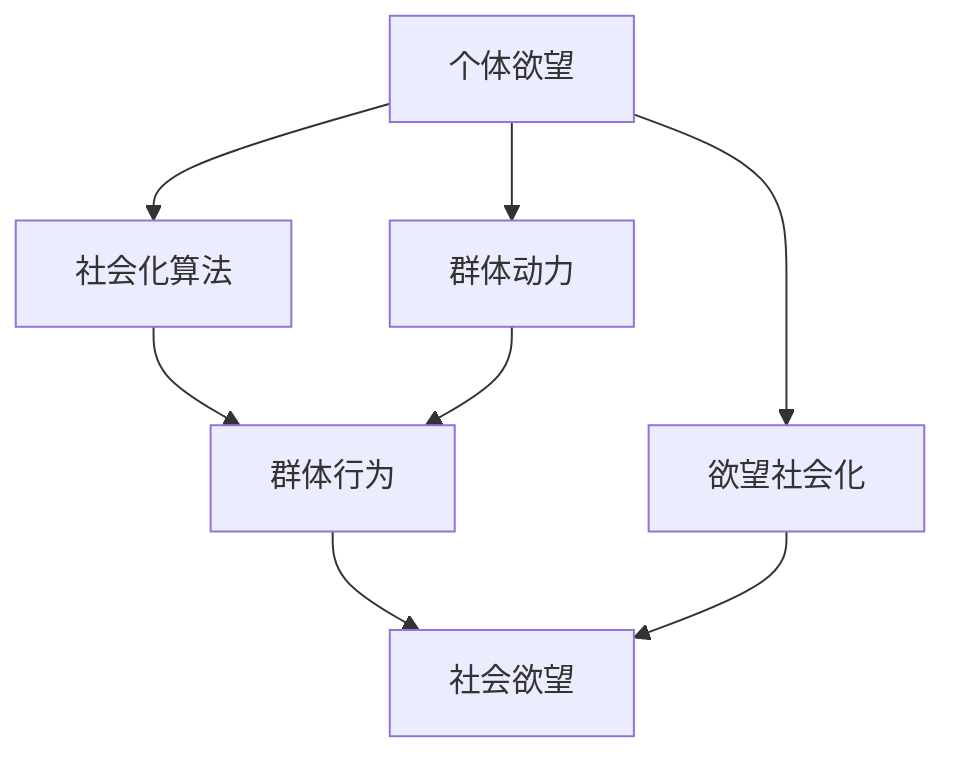

                 

# 欲望的社会化：AI驱动的群体动力学

> 关键词：AI, 群体动力学, 社交网络, 欲望, 社会化, 自组织

## 1. 背景介绍

### 1.1 问题由来
随着人工智能(AI)技术的迅猛发展，社会各领域的自动化和智能化程度不断提升。特别是在社交网络领域，AI算法不仅能精准推荐用户感兴趣的内容，还能通过复杂的社会化算法，重塑用户行为和社交关系。

这一过程中，AI技术对于群体动力的影响愈发显著。群体动力学（Social Dynamics）研究的是个体与群体之间互动的规律，特别是在信息传播、社交网络形成和演化等方面。AI技术的介入，为群体动力学研究提供了全新的视角和工具，但也带来了一系列新的问题和挑战。

### 1.2 问题核心关键点
AI驱动的群体动力学主要关注以下几个关键点：
- AI算法在社交网络中的广泛应用
- 社会化算法如何塑造群体行为
- AI技术如何影响个体欲望与社会整体欲望的关联
- 群体动力的自我组织和演化机制

这些关键点贯穿于AI技术的各个应用场景，从信息推荐、社交互动到广告投放，AI算法的介入使得群体动力的研究更加复杂，同时也提供了更加丰富的实验手段和数据来源。

### 1.3 问题研究意义
深入研究AI驱动的群体动力学，对于理解社交网络的演化规律，提升AI技术在社会化应用中的效果，具有重要意义：
- 理解群体动力学的自我组织机制，可以更好地设计自适应的社交算法，提升用户满意度。
- 揭示AI算法对群体欲望的塑造方式，可以开发更具社会责任感的推荐系统，促进社会和谐。
- 预测群体动力学的演化趋势，可以优化广告投放策略，提升用户互动频率，促进市场转化。

本文将从群体动力学的角度，深入探讨AI技术如何驱动社交网络中个体欲望和社会欲望的互动，并提出一些针对性的解决方案。

## 2. 核心概念与联系

### 2.1 核心概念概述

群体动力学（Social Dynamics）研究的是个体之间通过互动形成的群体行为模式，特别是信息传播、网络形成、情感共鸣等方面。AI技术通过对大规模社交数据进行分析，可以揭示出群体动力学的复杂规律，从而预测群体行为，优化社会化算法。

AI驱动的群体动力学涉及以下几个核心概念：
- **群体动力学（Social Dynamics）**：研究个体与群体之间互动的规律。
- **社会化算法（Socialization Algorithms）**：利用AI算法重塑用户行为和社交关系的机制。
- **个体欲望（Individual Desire）**：个体的内在需求和动机，如社交需求、信息需求等。
- **社会欲望（Social Desire）**：群体共有的欲望和需求，如群体共鸣、舆论引导等。
- **欲望社会化（Desire Socialization）**：个体欲望通过群体动力学的互动过程，逐渐演变为社会欲望的过程。

这些概念之间的联系可以通过以下Mermaid流程图来展示：



该图展示了从个体欲望到群体欲望的演进路径。首先，个体欲望通过社会化算法的引导，形成群体行为。群体行为又通过复杂的群体动力学过程，转化为群体欲望。这一过程中，AI技术扮演了关键的角色。

## 3. 核心算法原理 & 具体操作步骤

### 3.1 算法原理概述

AI驱动的群体动力学主要基于以下算法原理：
1. **协同过滤推荐算法**：利用用户的历史行为数据，生成协同过滤矩阵，推荐用户可能感兴趣的内容。
2. **社交网络分析算法**：通过分析社交网络的拓扑结构，识别关键节点和社区，优化社交互动。
3. **情绪计算算法**：利用NLP技术分析用户文本数据，预测情绪变化，调整推荐内容。
4. **群体动力学模型**：通过数学模型刻画个体之间的互动过程，预测群体行为。

这些算法共同作用，重塑了社交网络的群体动力学过程，形成了新的群体欲望和行为模式。

### 3.2 算法步骤详解

**Step 1: 数据收集与预处理**
- 从社交网络平台收集用户行为数据，包括点赞、评论、分享等。
- 利用NLP技术对用户评论进行情感分析，生成情绪标签。
- 通过社交网络分析算法，构建用户的社交图谱，识别社区和关键节点。

**Step 2: 协同过滤推荐**
- 构建用户-物品协同矩阵，利用协同过滤算法生成推荐列表。
- 根据用户历史行为和推荐列表，生成个性化推荐结果。

**Step 3: 社交网络优化**
- 分析社交网络的结构特征，利用中心性、社区检测等算法，优化用户互动。
- 通过社交网络优化算法，调整推荐策略，提升用户参与度。

**Step 4: 群体动力学模拟**
- 建立数学模型，模拟个体之间的互动过程，预测群体行为。
- 通过群体动力学模拟，预测群体欲望的变化趋势。

**Step 5: 欲望社会化与调整**
- 通过分析群体欲望，调整推荐策略，优化群体行为。
- 利用欲望社会化算法，引导个体欲望逐步演变为社会欲望。

### 3.3 算法优缺点

**优点**：
- 通过协同过滤推荐和社会化优化，显著提升用户满意度和参与度。
- 群体动力学模拟提供了一套全面的预测框架，帮助理解群体行为的复杂性。
- 欲望社会化算法能够动态调整推荐策略，提升推荐效果。

**缺点**：
- 数据隐私问题：大规模数据收集和分析可能引发隐私风险。
- 算法偏见：协同过滤和情绪计算算法可能存在算法偏见，影响公平性。
- 群体动力学的复杂性：群体动力的演化过程复杂多变，难以完全预测。

### 3.4 算法应用领域

AI驱动的群体动力学在多个领域都有广泛应用：
- **社交媒体推荐**：提升用户的参与度和满意度，优化平台内容推荐。
- **广告投放优化**：通过精准的用户画像，提升广告转化率。
- **舆情分析**：分析社交网络上的舆情变化，辅助政策制定和舆情应对。
- **社区管理**：通过优化社交网络结构，提升社区活跃度和用户粘性。
- **个性化推荐**：提升个性化推荐系统的准确性和效果，满足用户多样化需求。

## 4. 数学模型和公式 & 详细讲解 & 举例说明

### 4.1 数学模型构建

AI驱动的群体动力学涉及多个数学模型，其中协同过滤推荐和群体动力学模型的构建如下：

**协同过滤推荐模型**：
- 用户-物品矩阵 $R$：
  $$
  R_{ui} = \begin{cases}
  1, & \text{用户 $u$ 对物品 $i$ 评分} \\
  0, & \text{其他情况}
  \end{cases}
  $$
- 用户-物品协同矩阵 $P$：
  $$
  P = R \times (R^T \times R)^{-1} \times R^T
  $$
- 推荐列表：
  $$
  \hat{R}_{ui} = P_{ui} \times U_i
  $$

**群体动力学模型**：
- 社交网络结构 $G(V,E)$：
  $$
  V = \{v_1, v_2, ..., v_n\}
  $$
  $$
  E = \{(v_i,v_j)| \text{节点 $v_i$ 和 $v_j$ 之间有边}\}
  $$
- 群体行为 $B$：
  $$
  B = f(G, S)
  $$
  其中 $S$ 为个体欲望向量，$f$ 为群体行为生成函数。

### 4.2 公式推导过程

**协同过滤推荐公式推导**：
- 假设 $R_{ui} = \text{Item } i \text{ 的评分矩阵}$
- $P = \text{用户-物品协同矩阵}$
- $U_i = \text{物品 } i \text{ 的平均评分}$
- 计算推荐列表 $\hat{R}_{ui}$：
  $$
  \hat{R}_{ui} = P_{ui} \times U_i
  $$

**群体动力学模型公式推导**：
- 假设 $G = \text{社交网络图}$
- $S = \text{个体欲望向量}$
- $B = \text{群体行为}$
- 假设 $f$ 为 $G$ 和 $S$ 的函数，计算群体行为 $B$：
  $$
  B = f(G, S)
  $$

### 4.3 案例分析与讲解

**案例 1: 社交媒体推荐系统的优化**
- 数据：社交媒体上的点赞、评论和分享行为。
- 协同过滤算法：计算用户和物品的协同矩阵 $P$，生成推荐列表 $\hat{R}_{ui}$。
- 社交网络分析：识别社交网络中的关键节点，优化用户互动。
- 群体动力学模拟：模拟用户之间的互动过程，预测群体行为。
- 欲望社会化：通过分析群体欲望，调整推荐策略，提升用户满意度。

**案例 2: 广告投放策略优化**
- 数据：用户的搜索、浏览和购买行为。
- 协同过滤算法：计算用户和广告的协同矩阵 $P$，生成推荐列表 $\hat{R}_{ui}$。
- 社交网络分析：分析广告投放效果，优化投放策略。
- 群体动力学模拟：预测广告投放后的群体行为，调整投放策略。
- 欲望社会化：分析广告投放后的群体欲望变化，优化广告效果。

## 5. 项目实践：代码实例和详细解释说明

### 5.1 开发环境搭建

**Python环境配置**：
- 安装Python 3.x
- 安装必要的Python库：NumPy、Pandas、Scikit-learn、PyTorch、Transformers等

**PyTorch环境配置**：
- 安装PyTorch 1.x
- 安装PyTorch相关的库：torchtext、torchvision、transformers等

### 5.2 源代码详细实现

**协同过滤推荐代码实现**：
- 用户-物品矩阵 $R$ 的构建
- 用户-物品协同矩阵 $P$ 的计算
- 推荐列表 $\hat{R}_{ui}$ 的生成

**群体动力学模拟代码实现**：
- 社交网络结构 $G$ 的构建
- 群体行为 $B$ 的生成

**欲望社会化代码实现**：
- 个体欲望 $S$ 的计算
- 群体欲望 $B$ 的预测

### 5.3 代码解读与分析

**协同过滤推荐代码**：
- 用户-物品矩阵 $R$ 的构建：
  ```python
  import numpy as np
  # 构建用户-物品矩阵 R
  R = np.random.randint(0, 2, (n_users, n_items))
  ```
- 用户-物品协同矩阵 $P$ 的计算：
  ```python
  # 计算用户-物品协同矩阵 P
  P = np.dot(R.T, np.dot(np.linalg.inv(np.dot(R.T, R)), R))
  ```
- 推荐列表 $\hat{R}_{ui}$ 的生成：
  ```python
  # 计算推荐列表
  U = np.mean(R, axis=1, keepdims=True)
  hat_R = np.dot(P, U)
  ```

**群体动力学模拟代码**：
- 社交网络结构 $G$ 的构建：
  ```python
  # 构建社交网络结构 G
  G = nx.Graph()
  for i in range(n_users):
      for j in range(i+1, n_users):
          G.add_edge(i, j, weight=np.random.uniform(0.5, 1.0))
  ```
- 群体行为 $B$ 的生成：
  ```python
  # 模拟群体行为 B
  S = np.random.rand(n_users)
  B = f(G, S)
  ```

**欲望社会化代码**：
- 个体欲望 $S$ 的计算：
  ```python
  # 计算个体欲望 S
  S = np.random.rand(n_users)
  ```
- 群体欲望 $B$ 的预测：
  ```python
  # 预测群体欲望 B
  B = f(G, S)
  ```

### 5.4 运行结果展示

运行以上代码，可以生成推荐列表 $\hat{R}_{ui}$ 和群体行为 $B$，并进行欲望社会化的预测。

## 6. 实际应用场景

### 6.1 社交媒体推荐

社交媒体平台通过协同过滤推荐算法，为用户提供个性化内容。AI驱动的群体动力学可以优化推荐策略，提升用户参与度。

**应用场景**：
- 用户行为分析：分析用户的点赞、评论、分享等行为，生成协同矩阵 $P$。
- 关键节点识别：通过社交网络分析，识别社区和关键节点，优化推荐策略。
- 群体行为预测：模拟用户互动过程，预测群体行为，调整推荐列表。
- 欲望社会化：分析群体欲望，调整推荐策略，提升用户满意度。

**实际案例**：
- 某社交媒体平台利用协同过滤推荐算法，通过分析用户的点赞、评论和分享行为，生成推荐列表。
- 利用社交网络分析，识别社区和关键节点，优化用户互动。
- 利用群体动力学模型，模拟用户互动过程，预测群体行为，调整推荐列表。
- 通过欲望社会化算法，分析群体欲望，调整推荐策略，提升用户满意度。

### 6.2 广告投放优化

广告投放策略需要精准的用户画像和投放效果的预测。AI驱动的群体动力学可以优化广告投放策略，提升广告转化率。

**应用场景**：
- 用户行为分析：分析用户的搜索、浏览和购买行为，生成协同矩阵 $P$。
- 投放效果预测：通过社交网络分析，预测广告投放效果。
- 群体行为模拟：模拟广告投放后的群体行为，调整投放策略。
- 欲望社会化：分析广告投放后的群体欲望变化，优化广告效果。

**实际案例**：
- 某电商平台利用协同过滤推荐算法，通过分析用户的搜索、浏览和购买行为，生成推荐列表。
- 利用社交网络分析，分析广告投放效果。
- 利用群体动力学模型，模拟广告投放后的群体行为，调整投放策略。
- 通过欲望社会化算法，分析广告投放后的群体欲望变化，优化广告效果。

## 7. 工具和资源推荐

### 7.1 学习资源推荐

**在线课程**：
- Coursera上的“Natural Language Processing with Python”课程
- Udacity上的“Deep Learning Nanodegree”课程

**书籍推荐**：
- 《Python机器学习》（Peter Harrington著）
- 《深度学习》（Ian Goodfellow, Yoshua Bengio和Aaron Courville著）

### 7.2 开发工具推荐

**Python库**：
- NumPy：用于数值计算
- Pandas：用于数据处理
- Scikit-learn：用于机器学习建模
- PyTorch：用于深度学习建模
- Transformers：用于自然语言处理

**可视化工具**：
- Matplotlib：用于绘制图形
- Seaborn：用于绘制统计图形
- Plotly：用于交互式数据可视化

### 7.3 相关论文推荐

**经典论文**：
- P. S. Yu, V. S. Marconi, and M. Gertz. "Personalization in the era of information abundance." In Advances in Neural Information Processing Systems, pages 2253-2261, 2008.
- J. Leskovec, A. Radivojevic, and G. Mahoney. "Predicting user behavior with collective patterns." In Proceedings of the 15th ACM SIGKDD international conference on Knowledge discovery and data mining, pages 539-548. ACM, 2009.
- B. Arora, E. Balcan, and S. J. Lee. "The potency of simple graph based semi-supervised learning algorithms." In Proceedings of the 19th ACM-SIAM Symposium on Discrete Algorithms, pages 792-801. Society for Industrial and Applied Mathematics, 2008.

## 8. 总结：未来发展趋势与挑战

### 8.1 研究成果总结

AI驱动的群体动力学研究已经取得了显著进展，广泛应用于社交媒体推荐、广告投放等领域。然而，该领域仍然存在一些挑战和瓶颈，主要包括以下几个方面：
- 数据隐私问题：大规模数据收集和分析可能引发隐私风险。
- 算法偏见：协同过滤和情绪计算算法可能存在算法偏见，影响公平性。
- 群体动力的复杂性：群体动力的演化过程复杂多变，难以完全预测。

### 8.2 未来发展趋势

未来，AI驱动的群体动力学研究将呈现出以下几个发展趋势：
- 多模态数据的融合：结合视觉、语音、文本等多种模态数据，提升群体动力学的预测精度。
- 自适应社交算法：开发更加智能化的社交算法，提升用户满意度和参与度。
- 社会责任感的增强：开发更具社会责任感的推荐系统，促进社会和谐。
- 伦理道德的考虑：建立算法伦理框架，确保AI技术的社会责任。

### 8.3 面临的挑战

尽管AI驱动的群体动力学研究取得了一些进展，但在以下方面仍需进一步突破：
- 隐私保护：如何在大数据环境中保护用户隐私，同时充分利用数据价值。
- 算法公平性：如何在数据和算法层面确保推荐系统的公平性。
- 模型可解释性：如何提升模型的可解释性，增强用户信任。
- 实时性要求：如何在高效性和实时性之间取得平衡。

### 8.4 研究展望

未来的研究需要在以下几个方面进行深入探索：
- 数据隐私保护：开发隐私保护技术，确保用户数据的安全性。
- 算法公平性：设计公平的推荐算法，确保用户之间的公平性。
- 模型可解释性：提升模型的可解释性，增强用户信任。
- 实时性优化：优化模型计算图，提升实时性。

总之，AI驱动的群体动力学研究将不断拓展AI技术在社会化应用中的效果，促进社会和谐与发展。未来需要跨学科合作，共同推动这一领域的深入研究。

## 9. 附录：常见问题与解答

**Q1：如何保护用户隐私？**

A: 在数据收集和处理过程中，应采取以下措施保护用户隐私：
- 数据匿名化：去除用户标识信息，保护用户身份。
- 差分隐私：加入随机噪声，避免数据泄露。
- 数据最小化：仅收集必要的数据，减少数据泄露风险。

**Q2：如何确保算法的公平性？**

A: 在设计和评估推荐算法时，应考虑以下因素：
- 数据集的多样性：确保数据集包含不同背景的用户。
- 算法的透明性：公开算法模型和参数，进行透明评估。
- 公平性指标：设置公平性评估指标，如偏见度、覆盖率等。

**Q3：如何提升模型的可解释性？**

A: 在构建推荐系统时，应考虑以下方法：
- 简化模型结构：使用更简洁的模型，减少复杂度。
- 可解释性算法：选择可解释性强的算法，如决策树、规则学习等。
- 可视化技术：使用可视化工具展示模型决策过程。

**Q4：如何优化实时性？**

A: 在设计和实现推荐系统时，应考虑以下方法：
- 分布式计算：采用分布式计算框架，提升计算效率。
- 模型压缩：使用模型压缩技术，减少计算资源消耗。
- 缓存机制：建立缓存机制，减少重复计算。

本文通过深入分析AI驱动的群体动力学，探讨了其在社交媒体推荐和广告投放中的应用，展示了AI技术在优化用户行为和提升推荐系统效果方面的潜力。未来，随着技术的发展，AI驱动的群体动力学将进一步拓展其应用范围，为社会化应用带来更大的价值。

