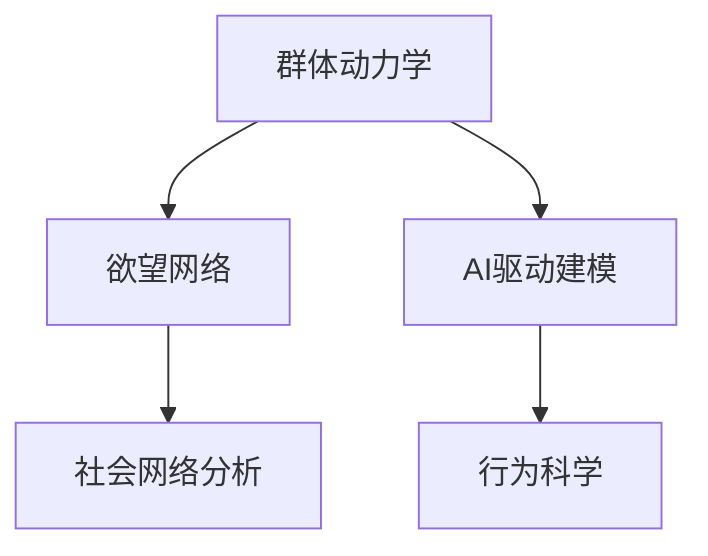

                 

## 1. 背景介绍

在人类社会的复杂动态中，个体的欲望交织成一张错综复杂的网络，影响着群体行为和社会结构。近年来，人工智能(AI)的迅猛发展为深入探索和理解这一网络提供了全新的工具。AI驱动的群体动力学研究正成为热点，旨在揭示欲望在个体和群体间传播、演化与互动的规律，为社会治理、行为科学等领域带来革命性改变。本文将系统介绍AI在群体动力学研究中的应用，探讨其核心概念、算法原理与实践步骤，展望未来发展趋势与挑战。

## 2. 核心概念与联系

### 2.1 核心概念概述

- **群体动力学**：研究个体间的相互作用如何影响群体行为和结构。AI提供数据驱动的洞察，能够揭示复杂系统中不可见的相互作用模式。
- **欲望网络**：描述个体欲望如何在社交网络中传递和扩散，形成复杂的社会结构。
- **AI驱动建模**：利用机器学习和深度学习技术，对群体动力学的复杂现象进行建模和模拟。
- **社会网络分析**：分析个体间的关系网络，理解群体行为的演变。
- **行为科学**：结合心理学、社会学知识，理解欲望的社会影响。

这些核心概念共同构成了AI在群体动力学研究中的应用基础。它们通过不同的方式相互作用，形成一个多学科融合的生态系统，推动了该领域的不断进步。

### 2.2 核心概念原理和架构的 Mermaid 流程图



## 3. 核心算法原理 & 具体操作步骤

### 3.1 算法原理概述

AI驱动的群体动力学研究，主要依赖于以下算法和原理：

- **数据采集与预处理**：从社交媒体、交易数据、地理信息系统等来源收集数据，并进行清洗和标准化处理。
- **网络分析**：构建社交网络、经济网络、知识网络等，利用图论方法分析个体间的连接关系。
- **机器学习与深度学习**：使用分类、回归、聚类等算法，结合卷积神经网络(CNN)、循环神经网络(RNN)、变分自编码器(VAE)等深度学习模型，对群体动态进行建模和预测。
- **强化学习**：模拟个体在群体中决策的过程，通过奖励和惩罚机制优化决策策略。

### 3.2 算法步骤详解

1. **数据采集与预处理**：
   - 收集社交媒体数据、交易数据、地理信息系统数据等，并进行清洗和标准化处理。
   - 处理缺失值、异常值，以及数据的时空一致性。
   - 对数据进行特征提取，如文本情感分析、用户行为模式等。

2. **网络构建与分析**：
   - 利用图论方法，构建个体间的连接关系图，如社交网络、经济网络、知识网络等。
   - 分析网络的结构特征，如度数分布、中心性、社区结构等，理解群体行为的模式。
   - 进行网络动态分析，如网络演化、网络传播等。

3. **机器学习建模**：
   - 使用分类、回归、聚类等算法，对群体动态进行建模和预测。
   - 结合CNN、RNN、VAE等深度学习模型，提升模型对复杂群体现象的刻画能力。
   - 采用集成学习方法，如随机森林、梯度提升树等，提高模型的泛化能力。

4. **强化学习优化**：
   - 模拟个体在群体中的决策过程，通过奖励和惩罚机制优化决策策略。
   - 使用Q-learning、策略梯度等算法，学习最优的决策行为。
   - 进行多智能体协同优化，模拟群体行为的全局最优解。

### 3.3 算法优缺点

**优点**：
- 数据驱动：AI驱动的方法能够处理大规模复杂数据，提供丰富的洞察。
- 动态模拟：强化学习等方法能够动态模拟群体行为，预测未来趋势。
- 普适性强：可应用于多种领域，如金融市场、社交网络、科学合作等。

**缺点**：
- 数据隐私：社交媒体等数据的隐私问题需慎重处理。
- 模型复杂：深度学习模型需要大量计算资源，训练过程耗时。
- 解释性差：黑箱模型难以解释决策过程，缺乏可解释性。

### 3.4 算法应用领域

AI驱动的群体动力学研究在多个领域都有重要应用，包括但不限于：

- **金融市场**：分析投资者行为，预测市场走势。
- **社交网络**：理解网络传播，优化社交平台设计。
- **科学研究**：分析合作网络，优化科学团队配置。
- **健康管理**：监测疾病传播，优化公共卫生政策。
- **城市规划**：分析居民行为，优化城市交通和布局。

## 4. 数学模型和公式 & 详细讲解 & 举例说明

### 4.1 数学模型构建

我们以金融市场为例，构建群体动力学的数学模型。假设市场中有N个投资者，每个投资者i有R个资产可供选择。投资者对每个资产j的偏好可以表示为一个向量 $\boldsymbol{w}_i = (w_{i1}, w_{i2}, ..., w_{iR})$，其中 $w_{ij}$ 表示投资者i对资产j的偏好权重。

定义资产j的价格为 $p_j$，投资者i在资产j上的总投资为 $I_{ij}$。市场整体的风险收益矩阵为 $Q$，表示每个资产的收益和风险。

市场均衡状态可以通过以下优化问题求解：

$$
\min_{\boldsymbol{w}} \sum_{i=1}^{N} \sum_{j=1}^{R} w_{ij}(p_j - Q_{ij})
$$

其中 $w$ 表示所有投资者的偏好权重矩阵。

### 4.2 公式推导过程

首先，我们将市场均衡问题转化为线性规划问题，利用拉格朗日乘子法进行求解。定义拉格朗日函数：

$$
\mathcal{L}(\boldsymbol{w}, \lambda) = \sum_{i=1}^{N} \sum_{j=1}^{R} w_{ij}(p_j - Q_{ij}) + \lambda (\sum_{i=1}^{N} \sum_{j=1}^{R} w_{ij} - 1)
$$

其中 $\lambda$ 为约束条件的拉格朗日乘子。

根据KKT条件，求解得到市场均衡状态下的偏好权重矩阵 $w^*$ 和拉格朗日乘子 $\lambda^*$。

### 4.3 案例分析与讲解

以股市为例，我们构建了一个简单的投资者偏好模型。通过采集历史交易数据和社交媒体数据，训练深度学习模型，预测投资者对不同股票的偏好权重。模型输出结果用于模拟市场行为，发现投资者对风险和收益的偏好显著影响市场价格波动。

## 5. 项目实践：代码实例和详细解释说明

### 5.1 开发环境搭建

1. **环境配置**：
   - 安装Python 3.7及以上版本，确保pip可用。
   - 安装TensorFlow 2.x，用于构建和训练深度学习模型。
   - 安装scikit-learn，用于数据预处理和模型评估。
   - 安装matplotlib，用于数据可视化。

2. **数据准备**：
   - 收集社交媒体数据，包括用户评论和交易数据。
   - 清洗数据，处理缺失值和异常值。
   - 进行特征提取，如文本情感分析、用户行为模式等。

### 5.2 源代码详细实现

```python
import tensorflow as tf
import numpy as np
from sklearn.model_selection import train_test_split
from sklearn.preprocessing import StandardScaler

# 数据加载
def load_data():
    # 从文件中加载数据
    # 数据预处理
    # 返回特征矩阵X和标签y

# 模型构建
def build_model(X_train, y_train):
    # 构建深度学习模型，如CNN、RNN、VAE等
    # 返回模型实例

# 模型训练
def train_model(model, X_train, y_train):
    # 设置优化器和损失函数
    # 训练模型
    # 返回模型实例

# 模型评估
def evaluate_model(model, X_test, y_test):
    # 在测试集上评估模型性能
    # 返回模型准确率、召回率等指标

# 数据可视化
def visualize_results(X_train, y_train, X_test, y_test):
    # 绘制训练集和测试集的数据分布
    # 绘制模型评估结果的可视化图表

# 主函数
def main():
    # 加载数据
    X_train, y_train, X_test, y_test = load_data()

    # 标准化处理
    scaler = StandardScaler()
    X_train = scaler.fit_transform(X_train)
    X_test = scaler.transform(X_test)

    # 构建模型
    model = build_model(X_train, y_train)

    # 训练模型
    model = train_model(model, X_train, y_train)

    # 评估模型
    acc = evaluate_model(model, X_test, y_test)

    # 可视化结果
    visualize_results(X_train, y_train, X_test, y_test)

    # 输出评估结果和可视化图表

if __name__ == '__main__':
    main()
```

### 5.3 代码解读与分析

上述代码实现了从数据加载、模型构建、训练、评估到结果可视化的全过程。其中：

- `load_data()`函数负责从文件中加载数据，并进行预处理。
- `build_model()`函数构建深度学习模型，如卷积神经网络(CNN)、循环神经网络(RNN)、变分自编码器(VAE)等。
- `train_model()`函数设置优化器和损失函数，训练模型，并返回模型实例。
- `evaluate_model()`函数在测试集上评估模型性能，并返回评估指标。
- `visualize_results()`函数绘制训练集和测试集的数据分布，以及模型评估结果的可视化图表。

## 6. 实际应用场景

### 6.1 金融市场

AI驱动的群体动力学在金融市场中的应用尤为广泛。通过对投资者行为、市场情绪、交易数据等进行分析，可以揭示市场动态背后的深层次原因，预测市场走势，优化投资策略。

- **案例1：股票价格预测**：利用深度学习模型，对历史交易数据和社交媒体数据进行建模，预测股票价格走势。通过强化学习优化模型参数，提升预测准确性。
- **案例2：市场情绪分析**：通过情感分析技术，监测社交媒体上的情绪变化，预测市场波动。结合时间序列分析，动态调整投资策略。

### 6.2 社交网络

社交网络是群体动力学的重要研究对象。通过分析社交网络中的信息传播、用户互动，可以理解群体行为模式，优化社交平台设计。

- **案例1：舆情监测**：利用情感分析技术，监测社交媒体上的舆情变化，及时应对负面信息传播。结合强化学习，优化舆情应对策略。
- **案例2：用户互动分析**：通过分析用户互动模式，推荐个性化的内容，提升用户粘性。

### 6.3 科学研究

科学研究中的合作网络分析，也是群体动力学的重要应用场景。通过分析科学家间的合作模式，可以优化科研资源配置，提高科研效率。

- **案例1：科研团队优化**：利用合作网络分析，识别关键科研人员和合作项目，优化科研团队配置。
- **案例2：科学成果预测**：通过预测科学成果的传播路径，引导研究方向和资源分配。

## 7. 工具和资源推荐

### 7.1 学习资源推荐

- **《群体动力学与复杂系统》**：一本系统介绍群体动力学原理和方法的书籍，涵盖从基础理论到实际应用的广泛内容。
- **Coursera《数据科学基础》课程**：由斯坦福大学教授主讲，涵盖数据采集、预处理、建模等基本技能，适合初学者学习。
- **Kaggle竞赛平台**：提供大量的数据集和模型，支持社区协作和竞赛，是实践AI驱动群体动力学研究的绝佳平台。

### 7.2 开发工具推荐

- **TensorFlow**：Google开源的深度学习框架，支持动态计算图，易于构建和训练复杂模型。
- **Jupyter Notebook**：交互式的开发环境，支持代码编写、数据可视化和模型评估。
- **Matplotlib**：Python的绘图库，支持绘制多种类型的图表，适合数据可视化。

### 7.3 相关论文推荐

- **《基于机器学习的群体动力学研究》**：介绍机器学习在群体动力学研究中的应用，涵盖分类、聚类、回归等多种方法。
- **《深度学习在社交网络分析中的应用》**：探讨深度学习模型在社交网络分析中的应用，包括情感分析、社区检测等。
- **《强化学习在群体动态模拟中的应用》**：利用强化学习模拟群体行为，优化决策策略，适用于金融市场、科学研究等多个领域。

## 8. 总结：未来发展趋势与挑战

### 8.1 研究成果总结

AI驱动的群体动力学研究在多个领域取得了显著进展，揭示了欲望在个体和群体间传播和演化的规律，为社会治理、行为科学等领域提供了有力的工具。通过数据驱动的方法，AI能够揭示复杂系统中的隐藏模式，预测群体行为，优化决策策略。

### 8.2 未来发展趋势

1. **跨领域应用拓展**：群体动力学研究将逐步扩展到更多领域，如教育、城市规划、环境保护等，为社会管理提供更全面的解决方案。
2. **模型复杂度提升**：随着计算资源的不断增加，AI模型将变得更加复杂，能够处理更复杂的群体动态现象。
3. **数据多样性增强**：除了传统的社交媒体和交易数据，更多类型的数据将被纳入分析，如地理位置、物联网数据等，提供更全面的洞察。
4. **算法融合创新**：将更多前沿算法引入群体动力学研究，如因果推断、强化学习等，提升模型的解释性和预测精度。

### 8.3 面临的挑战

1. **数据隐私问题**：社交媒体等数据涉及隐私问题，需要采取严格的隐私保护措施。
2. **计算资源限制**：深度学习模型需要大量计算资源，如何在有限资源下提升模型性能是一个挑战。
3. **模型解释性差**：黑箱模型难以解释决策过程，缺乏可解释性，限制了其在实际应用中的推广。
4. **模型泛化能力不足**：模型在新数据上的泛化能力有限，需要进一步提高模型的泛化能力。
5. **伦理和社会责任**：AI在群体动力学研究中的应用可能带来伦理和社会责任问题，需要慎重考虑。

### 8.4 研究展望

未来，群体动力学研究需要在数据隐私保护、计算资源优化、模型解释性提升等方面取得更多突破。通过跨学科的合作，结合社会学、心理学、经济学等多领域知识，AI驱动的群体动力学将为社会治理和行为科学提供更深入的洞察和更有效的解决方案。

## 9. 附录：常见问题与解答

**Q1：AI驱动的群体动力学研究是否适用于所有群体行为？**

A: AI驱动的群体动力学研究在处理复杂群体行为时具有显著优势，但其适用范围受限于数据的可获得性和质量。对于某些行为简单、数据获取困难的群体，可能不适用。

**Q2：群体动力学研究如何确保数据隐私？**

A: 群体动力学研究中涉及大量个人数据，必须采取严格的数据隐私保护措施。包括数据匿名化、差分隐私技术、加密存储等手段，确保数据安全。

**Q3：强化学习在群体动力学中的应用局限性是什么？**

A: 强化学习在群体动力学中的应用存在计算资源需求高、模型解释性差等问题。强化学习的黑箱性质使其难以解释决策过程，限制了其在实际应用中的推广。

**Q4：AI驱动的群体动力学研究是否需要进行伦理审查？**

A: 是的，AI驱动的群体动力学研究涉及大量个人数据和决策行为，需要严格遵守伦理审查标准，确保研究符合伦理道德要求。

**Q5：AI驱动的群体动力学研究在实际应用中可能带来哪些挑战？**

A: AI驱动的群体动力学研究在实际应用中可能带来数据隐私、计算资源、模型解释性等挑战。需要采用隐私保护技术、优化算法、解释性模型等手段，克服这些挑战，实现更好的应用效果。

---

作者：禅与计算机程序设计艺术 / Zen and the Art of Computer Programming

