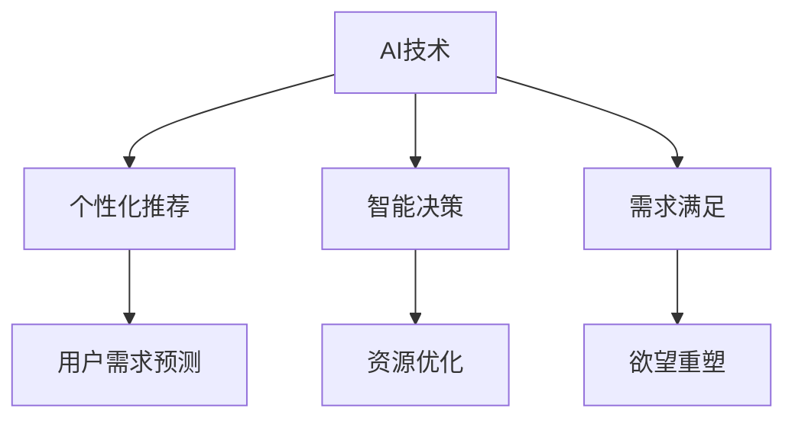

                 

# 欲望的重新定义：AI如何改变人类需求

## 1. 背景介绍

在数字化和智能化的浪潮中，人工智能（AI）正以前所未有的速度和深度改变着我们的生活。从智能手机到自动驾驶，从智能家居到工业自动化，AI技术的渗透无处不在。但鲜为人知的是，AI不仅仅改变着物质世界，也在悄然改变着人类的欲望。

### 1.1 问题的由来

欲望是人类行为的根本驱动力之一，它指导我们的选择，决定我们的幸福感和满足感。传统的欲望定义往往基于个人的感性体验，如需求、欲望、满足感等。然而，随着AI技术的介入，人类的欲望逐渐被重新定义和塑造，形成了新的欲望形式和满足途径。

### 1.2 问题核心关键点

AI如何重新定义人类欲望？AI技术对人类欲望的影响有哪些？

- AI技术能够预测和分析人类的行为模式，通过个性化推荐和智能决策，改变我们对欲望的认知和追求。
- AI技术可以提供个性化服务，满足人类多样化的需求，从而改变我们对欲望的实现方式。
- AI技术能够创造新的需求，通过技术创新和应用，拓展人类的欲望空间。
- AI技术可能会带来新的道德伦理问题，影响我们对欲望的追求和满足。

## 2. 核心概念与联系

### 2.1 核心概念概述

要理解AI如何重新定义人类欲望，首先需要明确几个核心概念：

- **AI技术**：包括机器学习、深度学习、自然语言处理、计算机视觉等技术，能够模拟和优化人类认知和决策过程。
- **人类欲望**：指个体或群体对物质或精神的需求和期望，包括生存、安全、社交、尊重和自我实现等基本需求，以及更高层次的追求如创造性、美感、自由等。
- **个性化推荐**：利用AI技术，根据用户的历史行为和偏好，预测其未来需求，提供定制化的产品和服务。
- **智能决策**：利用AI技术，辅助人类进行决策，优化资源分配，提升决策效率和效果。

### 2.2 核心概念原理和架构的 Mermaid 流程图



这个流程图展示了AI技术与人类欲望之间的关系。AI技术通过个性化推荐和智能决策，改变了人类需求的预测、满足和实现方式，最终重塑了我们的欲望。

## 3. 核心算法原理 & 具体操作步骤

### 3.1 算法原理概述

AI技术通过数据分析、模型训练和优化算法，实现了对人类欲望的重新定义和满足。其核心原理可以概括为：

1. **数据收集与分析**：收集用户的历史行为数据，如浏览记录、购买历史、社交互动等，进行分析，识别出用户的兴趣和偏好。
2. **模型训练**：基于收集到的数据，使用机器学习或深度学习算法，构建个性化推荐和智能决策模型，预测用户需求。
3. **优化算法**：通过优化算法（如梯度下降、粒子群优化等），不断调整模型参数，提高预测准确性和用户满意度。
4. **需求满足**：将模型预测结果转化为个性化服务和智能决策，满足用户需求，重塑其欲望。

### 3.2 算法步骤详解

以下是基于AI技术重新定义和满足人类欲望的具体操作步骤：

**Step 1: 数据收集与预处理**

1. **数据收集**：通过各种渠道（如App、网站、社交媒体等）收集用户行为数据，如浏览记录、搜索历史、购买记录等。
2. **数据清洗**：对收集到的数据进行清洗，去除噪音和异常值，确保数据质量。
3. **特征提取**：从清洗后的数据中提取有意义的特征，如浏览时间、点击率、购买频率等。

**Step 2: 模型训练与优化**

1. **模型选择**：根据问题特点选择适当的模型，如协同过滤、深度神经网络、图神经网络等。
2. **模型训练**：使用历史数据对模型进行训练，调整模型参数，提高预测准确性。
3. **模型优化**：使用优化算法（如随机梯度下降、Adam等）不断优化模型，避免过拟合。

**Step 3: 需求预测与个性化服务**

1. **需求预测**：将模型应用于新数据，预测用户需求。
2. **个性化推荐**：根据预测结果，向用户推荐个性化的产品和服务。
3. **智能决策**：根据用户需求，智能地分配资源，优化决策。

**Step 4: 欲望重塑与反馈调整**

1. **欲望重塑**：通过个性化推荐和智能决策，满足用户需求，重塑其欲望。
2. **反馈调整**：根据用户反馈，不断调整模型和算法，提升服务质量。

### 3.3 算法优缺点

AI技术在重新定义和满足人类欲望方面具有以下优点：

- **高效性**：AI技术能够快速处理大量数据，提供实时推荐和服务，满足用户多样化的需求。
- **个性化**：通过数据分析和模型训练，AI技术能够提供高度个性化的服务，满足用户的独特需求。
- **动态调整**：AI技术能够根据用户反馈，动态调整推荐和服务，不断优化用户体验。

然而，AI技术在重新定义人类欲望的过程中也存在以下缺点：

- **隐私问题**：收集和使用用户数据可能带来隐私风险，侵犯用户隐私。
- **偏见和歧视**：模型可能存在偏见，导致不公平的推荐和服务。
- **依赖性**：用户可能过度依赖AI推荐，忽视自身需求和判断，影响自主决策能力。

### 3.4 算法应用领域

AI技术在重新定义人类欲望方面有广泛的应用，涵盖了多个领域：

- **电商推荐**：通过分析用户的购买历史和浏览行为，提供个性化的商品推荐，提升购物体验。
- **内容分发**：根据用户的历史阅读和观看记录，推荐个性化的新闻、视频和文章，丰富信息获取方式。
- **智能医疗**：通过分析患者的健康数据，推荐个性化的健康方案和治疗方案，提高医疗效果。
- **金融服务**：根据用户的交易记录和风险偏好，提供个性化的投资建议和理财服务，提升金融体验。
- **教育培训**：根据学生的学习记录和表现，推荐个性化的学习资源和教学方法，提高学习效果。

## 4. 数学模型和公式 & 详细讲解 & 举例说明

### 4.1 数学模型构建

AI技术在重新定义人类欲望方面，通常使用以下数学模型：

- **协同过滤模型**：利用用户之间的相似度，预测用户对未评分物品的评分。
- **深度神经网络模型**：通过多层神经网络，学习和提取高层次的特征表示，提高预测准确性。
- **图神经网络模型**：利用图结构，模拟物品和用户之间的关系，提升推荐效果。

### 4.2 公式推导过程

以协同过滤模型为例，其数学公式如下：

1. **用户-物品矩阵**：构建用户-物品的评分矩阵 $R$，其中 $R_{ui}=r_{ui}$ 表示用户 $u$ 对物品 $i$ 的评分。
2. **用户相似度计算**：计算用户之间的相似度 $S_{uv}$，常用余弦相似度或皮尔逊相关系数。
3. **物品相似度计算**：计算物品之间的相似度 $S_{ij}$，常用欧几里得距离或余弦相似度。
4. **预测评分**：利用用户和物品的相似度，预测用户对物品的评分 $r_{ui}^{\prime}$，公式如下：

$$
r_{ui}^{\prime} = \hat{r}_{ui} = \sum_{v \in N(u)} (r_{vi} * S_{uv}) / \sum_{v \in N(u)} S_{uv}
$$

其中，$N(u)$ 表示用户 $u$ 的邻居集合。

### 4.3 案例分析与讲解

以电商平台个性化推荐为例，分析AI技术如何重塑用户的购物欲望。

1. **数据收集**：电商平台收集用户的浏览记录、购买历史、评价反馈等数据。
2. **模型训练**：使用协同过滤模型对用户和物品进行训练，计算用户相似度和物品相似度。
3. **需求预测**：根据用户的历史行为和偏好，预测其对新物品的评分。
4. **个性化推荐**：将预测评分转化为个性化推荐列表，展示给用户。
5. **欲望重塑**：用户通过个性化推荐发现新商品，满足其新的购物需求，重新定义购物欲望。

## 5. 项目实践：代码实例和详细解释说明

### 5.1 开发环境搭建

为了实现AI技术的个性化推荐和智能决策，需要以下开发环境：

1. **Python环境**：安装Python 3.8及以上版本，并配置虚拟环境。
2. **数据工具**：安装Pandas、NumPy、Scikit-learn等数据处理和分析工具。
3. **机器学习库**：安装Scikit-learn、TensorFlow、Keras等机器学习库。
4. **推荐系统框架**：安装Surprise、LightFM等推荐系统框架。

### 5.2 源代码详细实现

以下是使用Python实现协同过滤推荐系统的示例代码：

```python
import pandas as pd
from surprise import SVD
from surprise import Dataset

# 数据准备
data = pd.read_csv('data.csv')
data = data.dropna()

# 数据预处理
data = data.drop(['item_id', 'timestamp'], axis=1)
data.columns = ['user_id', 'rating', 'item_id']

# 构建数据集
dataset = Dataset.load_from_df(data[['user_id', 'item_id', 'rating']], column_info={'user_id': 'userId', 'item_id': 'itemId', 'rating': 'rating'})

# 模型训练
algo = SVD()
trainset = dataset.build_full_trainset()
algo.fit(trainset)

# 需求预测
test_data = pd.read_csv('test_data.csv')
test_data = test_data.dropna()
test_data.columns = ['user_id', 'item_id']

predictions = algo.test(test_data)

# 输出结果
for user_id, item_id in test_data.itertuples():
    rating = algo.test(user_id, item_id)
    print(f"预测用户 {user_id} 对物品 {item_id} 的评分：{rating}")
```

### 5.3 代码解读与分析

以上代码展示了如何使用Python实现基于协同过滤的推荐系统。具体步骤如下：

1. **数据准备**：读取原始数据，并处理缺失值和列名。
2. **数据预处理**：将数据转化为推荐系统所需格式，包括用户ID、物品ID和评分。
3. **构建数据集**：使用Surprise库构建数据集，供模型训练使用。
4. **模型训练**：使用SVD算法对数据集进行训练，得到模型参数。
5. **需求预测**：读取测试数据，进行预测，输出用户对物品的评分。

## 6. 实际应用场景

### 6.1 电商平台

在电商平台上，AI技术通过个性化推荐重塑用户的购物欲望，提升了用户满意度和购物体验。例如，淘宝通过个性化推荐系统，根据用户的历史浏览和购买记录，推荐其可能感兴趣的商品，满足用户的独特需求，提升用户转化率和复购率。

### 6.2 内容分发平台

内容分发平台如Netflix、YouTube等，通过AI技术推荐用户感兴趣的视频和文章，丰富信息获取方式，提升用户体验。Netflix根据用户的观看历史，推荐个性化电影和电视剧，满足用户的娱乐需求。

### 6.3 智能医疗

智能医疗系统通过AI技术分析患者的健康数据，推荐个性化的治疗方案和健康建议，提升医疗效果和患者满意度。例如，IBM Watson Health通过分析患者的病历和检查结果，推荐个性化的治疗方案，提高治疗效果和患者满意度。

### 6.4 未来应用展望

未来，AI技术在重新定义人类欲望方面的应用将更加广泛和深入：

- **智能家居**：通过智能设备和学习用户行为，提供个性化的家居服务和解决方案，提升生活质量。
- **教育培训**：根据学生的学习记录和表现，推荐个性化的学习资源和教学方法，提高学习效果。
- **智能交通**：通过AI技术优化交通流量，推荐个性化的出行方案，提升出行体验。

## 7. 工具和资源推荐

### 7.1 学习资源推荐

为了深入理解AI技术在重新定义人类欲望方面的应用，推荐以下学习资源：

1. **《人工智能基础》**：介绍了人工智能的基本概念、原理和应用，适合初学者入门。
2. **《深度学习入门：基于Python的理论与实现》**：详细讲解了深度学习的基本理论和实现，适合进阶学习。
3. **《推荐系统实战》**：介绍了推荐系统的原理和应用，包括协同过滤、深度学习等技术。
4. **《自然语言处理综论》**：介绍了自然语言处理的基本概念和前沿技术，适合NLP领域的深入学习。

### 7.2 开发工具推荐

以下是常用的AI开发工具，推荐用于实现个性化推荐和智能决策：

1. **PyTorch**：基于Python的深度学习框架，适合构建复杂的神经网络模型。
2. **TensorFlow**：由Google开发的深度学习框架，适合大规模分布式训练。
3. **Scikit-learn**：Python的机器学习库，适合构建常用的机器学习模型。
4. **Keras**：基于TensorFlow的高级神经网络库，适合快速构建和调试模型。
5. **Surprise**：Python的推荐系统框架，适合构建协同过滤等推荐模型。

### 7.3 相关论文推荐

以下是几篇关于AI技术在重新定义人类欲望方面的经典论文，推荐深入阅读：

1. **《推荐系统中的协同过滤》**：介绍了协同过滤的原理和应用，适合理解个性化推荐的基础。
2. **《深度学习在自然语言处理中的应用》**：介绍了深度学习在NLP中的应用，适合了解AI技术在NLP中的应用。
3. **《智能推荐系统：数据驱动与算法创新》**：介绍了推荐系统的最新进展和应用，适合了解前沿推荐技术。

## 8. 总结：未来发展趋势与挑战

### 8.1 总结

AI技术在重新定义人类欲望方面取得了显著进展，通过个性化推荐和智能决策，提升了用户满意度和体验。但同时也带来了隐私、偏见、依赖等问题，需要进一步解决和优化。

### 8.2 未来发展趋势

未来，AI技术在重新定义人类欲望方面将呈现以下发展趋势：

1. **多模态融合**：将视觉、听觉等多种模态的信息融合到推荐系统中，提供更丰富和全面的个性化服务。
2. **自适应学习**：通过动态调整模型参数，提升推荐系统的实时性和个性化程度。
3. **联邦学习**：在保护用户隐私的前提下，利用分布式数据进行模型训练，提高推荐系统的性能和公平性。
4. **混合推荐**：结合协同过滤和深度学习等多种推荐方法，提高推荐系统的多样性和效果。
5. **实时推荐**：通过流式数据处理和实时计算，提供实时推荐服务，提升用户体验。

### 8.3 面临的挑战

尽管AI技术在重新定义人类欲望方面取得了显著进展，但仍面临以下挑战：

1. **隐私保护**：如何在保护用户隐私的前提下，进行数据收集和处理，是AI技术面临的重要挑战。
2. **偏见和歧视**：AI模型可能存在偏见，导致不公平的推荐和服务，需要进一步优化和消除。
3. **模型解释性**：如何增强AI模型的可解释性，提高其透明度和可信度，是AI技术发展的重要方向。
4. **用户依赖**：AI推荐可能导致用户过度依赖，忽视自身需求和判断，需要平衡自主决策和个性化服务的关系。

### 8.4 研究展望

未来，需要在以下方面进行深入研究：

1. **隐私保护技术**：发展隐私保护技术，保护用户隐私，增强用户信任。
2. **公平性优化**：通过优化模型参数和算法，减少偏见和歧视，提高公平性。
3. **可解释性增强**：开发可解释性技术，增强AI模型的透明度和可信度，提高用户满意度。
4. **混合推荐方法**：结合多种推荐方法，提高推荐系统的多样性和效果，满足用户的多样化需求。

## 9. 附录：常见问题与解答

**Q1: AI技术在重新定义人类欲望方面有哪些应用？**

A: AI技术在电商推荐、内容分发、智能医疗、金融服务、教育培训等多个领域中，通过个性化推荐和智能决策，重新定义和满足了人类的欲望。

**Q2: AI技术在重新定义人类欲望过程中有哪些优点和缺点？**

A: AI技术的优点包括高效性、个性化和动态调整，但缺点包括隐私问题、偏见和歧视、依赖性等，需要进一步优化和解决。

**Q3: 如何保护用户隐私？**

A: 在数据收集和使用过程中，采用数据匿名化、加密传输等技术，保护用户隐私。

**Q4: 如何减少AI模型的偏见和歧视？**

A: 通过数据清洗和模型优化，减少模型的偏见和歧视，提高公平性。

**Q5: 如何增强AI模型的可解释性？**

A: 开发可解释性技术，如因果分析、模型可视化等，增强AI模型的透明度和可信度。

作者：禅与计算机程序设计艺术 / Zen and the Art of Computer Programming

