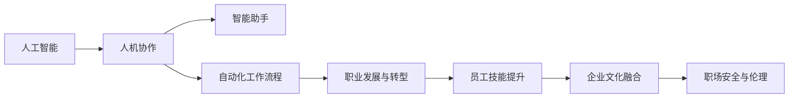

                 

## 1. 背景介绍

### 1.1 问题由来

随着人工智能技术的飞速发展，我们生活的方方面面正在发生翻天覆地的变化。智能助手、智能推荐、自然语言处理等AI技术已经渗透到我们的工作、学习、娱乐等各个领域，大大提升了我们的工作效率和生活质量。然而，我们真的准备好迎接这一场AI革命了吗？

### 1.2 问题核心关键点

1. **AI技术的应用与挑战**：如何在保证技术先进性的同时，确保使用AI的职场安全与伦理？
2. **人机协作模式**：AI如何协助人类工作，而不是取代人类？
3. **AI与企业文化的融合**：如何构建基于AI技术的企业文化，让员工更好地适应与AI共存的职场环境？
4. **员工技能提升**：员工需要具备什么样的技能才能在AI重构的职场中立足？
5. **未来职业规划**：在AI技术逐步普及的背景下，未来职场将呈现怎样的趋势？

这些问题的回答，将是未来AI技术重构职场体验的关键。

## 2. 核心概念与联系

### 2.1 核心概念概述

- **人工智能**：利用计算机算法和数据处理技术，实现机器对人类智能行为的模拟和模仿。
- **人机协作**：人与AI系统共同完成工作任务，充分发挥各自优势，实现高效协同。
- **智能助手**：具有语音识别、自然语言处理和推理能力的AI系统，用于辅助人类进行信息处理和决策。
- **自动化工作流程**：通过AI技术自动化执行重复性高、决策性低的工作任务，提升工作效率。
- **职业发展与转型**：在AI技术普及的背景下，员工需要不断学习和适应，以应对职业发展的变化和挑战。

### 2.2 核心概念原理和架构的 Mermaid 流程图



这个流程图展示了核心概念之间的联系：人工智能通过人机协作和智能助手，实现自动化工作流程的优化，进而推动职业发展与转型，并通过员工技能提升和企业文化融合，确保职场的安全与伦理。

## 3. 核心算法原理 & 具体操作步骤

### 3.1 算法原理概述

AI重构职场体验的核心在于通过智能助手和自动化工作流程，提升员工的工作效率，同时通过职业发展与转型，帮助员工适应新的职场环境。这涉及到以下几个关键步骤：

1. **需求分析**：识别员工在工作中遇到的具体问题和需求。
2. **技术匹配**：根据需求，选择合适的AI技术和工具。
3. **培训与支持**：对员工进行必要的AI技术和工具培训，并提供技术支持。
4. **应用部署**：将AI技术应用于实际工作中，优化工作流程。
5. **效果评估与迭代**：评估AI应用效果，根据反馈不断优化和迭代。

### 3.2 算法步骤详解

#### 步骤1：需求分析

需求分析是AI重构职场体验的第一步。通过调查问卷、访谈、观察等方式，了解员工在工作中遇到的具体问题和需求。

- **问卷设计**：设计包含多种问题的问卷，涵盖工作中的常见问题和挑战。
- **访谈与观察**：与员工进行一对一的访谈，了解他们的具体需求和期望。同时，通过观察员工的工作流程，发现潜在的问题和改进点。

#### 步骤2：技术匹配

根据需求分析的结果，选择合适的AI技术和工具。

- **智能助手选择**：如语音助手、智能文档助手等。
- **自动化工具选择**：如自动化数据处理、自动化报表生成等。
- **自然语言处理工具选择**：如自然语言理解、自然语言生成等。

#### 步骤3：培训与支持

对员工进行必要的AI技术和工具培训，并提供技术支持。

- **培训内容**：基础AI技术原理、工具使用方法、实际应用案例等。
- **技术支持**：建立技术支持团队，随时解答员工在使用过程中遇到的问题。

#### 步骤4：应用部署

将AI技术应用于实际工作中，优化工作流程。

- **系统集成**：将AI技术集成到现有的工作系统中，确保与现有系统的兼容性和稳定性。
- **流程优化**：根据AI技术的特点，重新设计工作流程，提升工作效率。

#### 步骤5：效果评估与迭代

评估AI应用效果，根据反馈不断优化和迭代。

- **效果评估**：通过问卷调查、访谈等方式，收集员工对AI应用效果的反馈。
- **优化与迭代**：根据反馈结果，对AI应用进行优化和迭代，确保其持续发挥最大效益。

### 3.3 算法优缺点

#### 优点

1. **提升工作效率**：通过AI技术自动化执行重复性高、决策性低的工作任务，显著提升工作效率。
2. **减少人为错误**：AI系统的精准性和一致性，减少了人为错误的发生。
3. **支持个性化需求**：根据员工的具体需求，量身定制AI解决方案，满足个性化需求。

#### 缺点

1. **技术门槛高**：AI技术的应用需要一定的技术基础和操作经验，部分员工可能难以适应。
2. **依赖技术稳定性**：AI系统的稳定性直接影响工作效率和效果。
3. **数据隐私与安全**：AI技术的应用需要大量数据支持，数据隐私和安全问题不容忽视。

### 3.4 算法应用领域

AI重构职场体验的应用领域非常广泛，包括但不限于：

- **客户服务**：通过智能助手和自动化流程，提升客户服务质量。
- **市场营销**：利用自然语言处理和自动化工具，分析市场数据，制定营销策略。
- **人力资源**：通过自动化招聘和人才管理，提升人力资源管理效率。
- **财务管理**：自动化处理财务报表和数据分析，提升财务管理效率。

## 4. 数学模型和公式 & 详细讲解 & 举例说明

### 4.1 数学模型构建

AI技术在职场应用中的数学模型通常包括以下几个关键部分：

1. **数据预处理**：通过数据清洗、特征提取等技术，将原始数据转化为模型可用的输入。
2. **模型训练**：通过机器学习算法，训练模型参数，使其能够准确预测和分类。
3. **模型评估**：通过交叉验证、ROC曲线等方法，评估模型效果。
4. **模型应用**：将训练好的模型应用于实际场景，优化工作流程。

### 4.2 公式推导过程

以自然语言处理为例，推导自然语言生成模型的公式：

1. **输入表示**：将输入文本转化为向量表示，通常使用词嵌入向量或上下文向量。
2. **解码过程**：通过解码器生成预测输出，公式为：
   $$
   \hat{y} = softmax(W^\top x + b)
   $$
   其中 $W$ 为权重矩阵，$b$ 为偏置向量，$x$ 为输入向量，$softmax$ 函数用于输出概率分布。
3. **损失函数**：通过交叉熵损失函数评估预测输出与真实标签之间的差异，公式为：
   $$
   L(y, \hat{y}) = -\sum_{i=1}^N y_i \log \hat{y}_i
   $$
   其中 $y$ 为真实标签，$\hat{y}$ 为预测输出。
4. **模型优化**：通过反向传播算法，最小化损失函数，更新模型参数，公式为：
   $$
   \theta = \mathop{\arg\min}_{\theta} \mathcal{L}(\theta)
   $$
   其中 $\theta$ 为模型参数。

### 4.3 案例分析与讲解

以客户服务为例，分析AI技术的应用：

1. **需求分析**：发现客服团队面临大量重复性咨询，且响应速度较慢。
2. **技术匹配**：引入智能客服系统，通过自然语言处理和自动化流程，自动处理常见咨询。
3. **培训与支持**：对客服人员进行系统培训，使其能够使用和维护智能客服系统。
4. **应用部署**：将智能客服系统集成到客服系统中，优化工作流程。
5. **效果评估与迭代**：通过问卷调查，收集客服人员对智能客服系统的反馈，不断优化和迭代。

## 5. 项目实践：代码实例和详细解释说明

### 5.1 开发环境搭建

#### 5.1.1 安装Python

- 下载并安装Python 3.x版本，推荐使用Anaconda发行版。
- 安装相关依赖库，如NumPy、Pandas、scikit-learn、TensorFlow等。

#### 5.1.2 安装Jupyter Notebook

- 通过conda安装Jupyter Notebook，命令为：
  ```
  conda install jupyterlab
  ```

### 5.2 源代码详细实现

以下是一个简单的智能客服系统示例，使用TensorFlow实现：

```python
import tensorflow as tf
import numpy as np

# 定义模型
class SmartCustomerService(tf.keras.Model):
    def __init__(self, input_dim, output_dim):
        super(SmartCustomerService, self).__init__()
        self.dense1 = tf.keras.layers.Dense(128, activation='relu')
        self.dense2 = tf.keras.layers.Dense(output_dim, activation='softmax')
    
    def call(self, inputs):
        x = self.dense1(inputs)
        return self.dense2(x)

# 加载数据
input_data = np.random.rand(100, input_dim)
output_data = np.random.randint(output_dim, size=(100, 1))

# 定义模型
model = SmartCustomerService(input_dim, output_dim)

# 编译模型
model.compile(optimizer='adam', loss='categorical_crossentropy', metrics=['accuracy'])

# 训练模型
model.fit(input_data, output_data, epochs=10, batch_size=32)

# 预测新数据
new_data = np.random.rand(1, input_dim)
predictions = model.predict(new_data)
```

### 5.3 代码解读与分析

1. **模型定义**：使用TensorFlow定义一个简单的神经网络模型，包含两个全连接层。
2. **数据加载**：使用随机生成的数据进行训练和测试。
3. **模型编译**：使用Adam优化器和交叉熵损失函数编译模型。
4. **模型训练**：使用fit方法训练模型，并进行10个epoch的训练。
5. **模型预测**：使用训练好的模型进行新数据的预测。

## 6. 实际应用场景

### 6.1 智能客服系统

智能客服系统通过AI技术，能够快速响应客户咨询，提供24/7不间断服务，显著提升客户满意度和工作效率。具体应用包括：

1. **自动回复**：智能客服系统能够自动回复常见问题，减少人工客服的工作量。
2. **智能路由**：根据客户咨询的内容，智能路由到相应的客服团队或知识库，提高问题解决的效率。
3. **情感分析**：通过自然语言处理技术，识别客户的情感倾向，提供更加个性化的服务。

### 6.2 市场营销

市场营销团队可以通过AI技术，快速分析市场数据，制定更精准的营销策略。具体应用包括：

1. **数据分析**：利用机器学习算法，分析客户行为数据，识别潜在客户。
2. **内容生成**：使用自然语言生成技术，生成广告文案和营销邮件。
3. **预测分析**：通过预测模型，预测市场趋势和产品需求，优化营销策略。

### 6.3 人力资源

人力资源管理可以通过AI技术，提高招聘和人才管理的效率。具体应用包括：

1. **自动化招聘**：通过自然语言处理技术，筛选简历和候选人。
2. **员工分析**：利用机器学习算法，分析员工绩效和满意度，提供优化建议。
3. **培训管理**：通过智能推荐系统，为员工推荐培训课程，提升技能。

### 6.4 未来应用展望

未来，AI技术将进一步深入到各个行业，重构职场体验。展望未来，AI技术在职场中的应用将呈现以下几个趋势：

1. **多模态融合**：AI技术将不仅限于文本处理，还将扩展到图像、语音等多模态数据。
2. **个性化推荐**：通过个性化推荐系统，满足员工的个性化需求。
3. **智能协作**：利用AI技术，实现更智能的人机协作。
4. **实时反馈**：通过实时反馈机制，不断优化AI系统，提升其性能。

## 7. 工具和资源推荐

### 7.1 学习资源推荐

1. **《深度学习》书籍**：Ian Goodfellow等著，详细介绍了深度学习的基本原理和应用。
2. **《自然语言处理综论》书籍**：Daniel Jurafsky和James H. Martin著，涵盖了自然语言处理的基本概念和算法。
3. **Coursera《机器学习》课程**：由Andrew Ng讲授，涵盖机器学习的基本理论和算法。
4. **Kaggle竞赛平台**：通过参与Kaggle竞赛，提升数据处理和模型训练能力。

### 7.2 开发工具推荐

1. **PyTorch**：开源深度学习框架，具有灵活的动态图和易于使用的API。
2. **TensorFlow**：由Google开发的深度学习框架，适用于大规模工程应用。
3. **Keras**：高层次的深度学习API，易于使用和上手。
4. **Jupyter Notebook**：交互式的Python编程环境，支持丰富的数据可视化工具。

### 7.3 相关论文推荐

1. **Attention is All You Need**：谷歌大脑团队提出的Transformer模型，开创了NLP领域的预训练大模型时代。
2. **BERT: Pre-training of Deep Bidirectional Transformers for Language Understanding**：Google提出BERT模型，通过大规模预训练和微调，刷新了多项NLP任务SOTA。
3. **GPT-3: Language Models are Unsupervised Multitask Learners**：OpenAI提出GPT-3模型，展示了大模型在零样本学习和多任务学习方面的强大能力。
4. **ALBERT: A Lite BERT for Self-supervised Learning of Language Representations**：Google提出ALBERT模型，通过轻量级结构，提升了训练和推理效率。
5. **Prompt-based Transfer Learning for AI Conversations**：LumenAI提出Prompt-based Transfer Learning，通过精心设计的提示模板，引导模型进行特定任务的推理和生成。

## 8. 总结：未来发展趋势与挑战

### 8.1 研究成果总结

AI技术已经逐步渗透到各个行业，重构职场体验。通过智能助手和自动化工作流程，显著提升了员工的工作效率和生产力。然而，AI技术的应用也面临着数据隐私、技术门槛、伦理安全等问题，需要在实践中不断优化和改进。

### 8.2 未来发展趋势

1. **技术进步**：AI技术将继续进步，逐步实现通用智能。
2. **人机协作**：人机协作模式将更加智能和高效。
3. **职业发展**：员工需要不断学习和适应，提升技能以应对新的职场挑战。
4. **企业文化**：企业需要构建基于AI技术的企业文化，促进员工与AI的共生共荣。

### 8.3 面临的挑战

1. **技术门槛**：部分员工可能难以适应AI技术的应用。
2. **数据隐私**：AI技术的应用需要大量数据支持，数据隐私和安全问题不容忽视。
3. **伦理安全**：AI系统的偏见和安全性问题需要认真对待。
4. **资源优化**：如何优化AI系统，提升其性能和资源利用效率。

### 8.4 研究展望

未来，AI技术将在职场中发挥更大的作用，带来更多的变革和机遇。研究者需要关注以下几个方向：

1. **跨领域融合**：AI技术与其他技术领域的融合，如云计算、物联网等。
2. **人机协作**：实现更智能、更高效的人机协作模式。
3. **伦理安全**：AI系统的伦理和安全性问题。
4. **员工技能提升**：员工需要不断学习和适应新的技术工具和应用场景。

## 9. 附录：常见问题与解答

### 9.1 常见问题

1. **如何选择合适的AI技术？**
   - 根据具体需求和应用场景，选择合适的AI技术和工具。

2. **员工如何适应AI技术？**
   - 对员工进行必要的培训和支持，帮助其掌握AI技术的使用方法和应用场景。

3. **如何评估AI应用的效果？**
   - 通过问卷调查、访谈等方式，收集员工对AI应用效果的反馈，根据反馈进行优化和迭代。

4. **如何保障数据隐私和安全？**
   - 建立严格的数据隐私和安全保护机制，确保数据安全和用户隐私。

### 9.2 解答

1. **如何选择合适的AI技术？**
   - 需求分析：识别员工在工作中遇到的具体问题和需求。
   - 技术匹配：根据需求，选择合适的AI技术和工具。
   - 培训与支持：对员工进行必要的AI技术和工具培训，并提供技术支持。

2. **员工如何适应AI技术？**
   - 培训与支持：对员工进行必要的AI技术和工具培训，并提供技术支持。
   - 渐进实施：逐步引入AI技术，让员工有足够的时间适应和掌握。
   - 反馈机制：建立反馈机制，及时了解员工在使用过程中的困难和需求，进行针对性的优化和改进。

3. **如何评估AI应用的效果？**
   - 效果评估：通过问卷调查、访谈等方式，收集员工对AI应用效果的反馈。
   - 优化与迭代：根据反馈结果，对AI应用进行优化和迭代，确保其持续发挥最大效益。
   - 持续改进：不断收集和分析数据，优化AI应用，提升其效果和稳定性。

4. **如何保障数据隐私和安全？**
   - 数据匿名化：在处理数据时，进行匿名化处理，避免泄露个人隐私。
   - 安全机制：建立严格的数据安全保护机制，防止数据泄露和滥用。
   - 合规审查：确保数据处理和应用符合相关法律法规和行业标准。

---

作者：禅与计算机程序设计艺术 / Zen and the Art of Computer Programming

