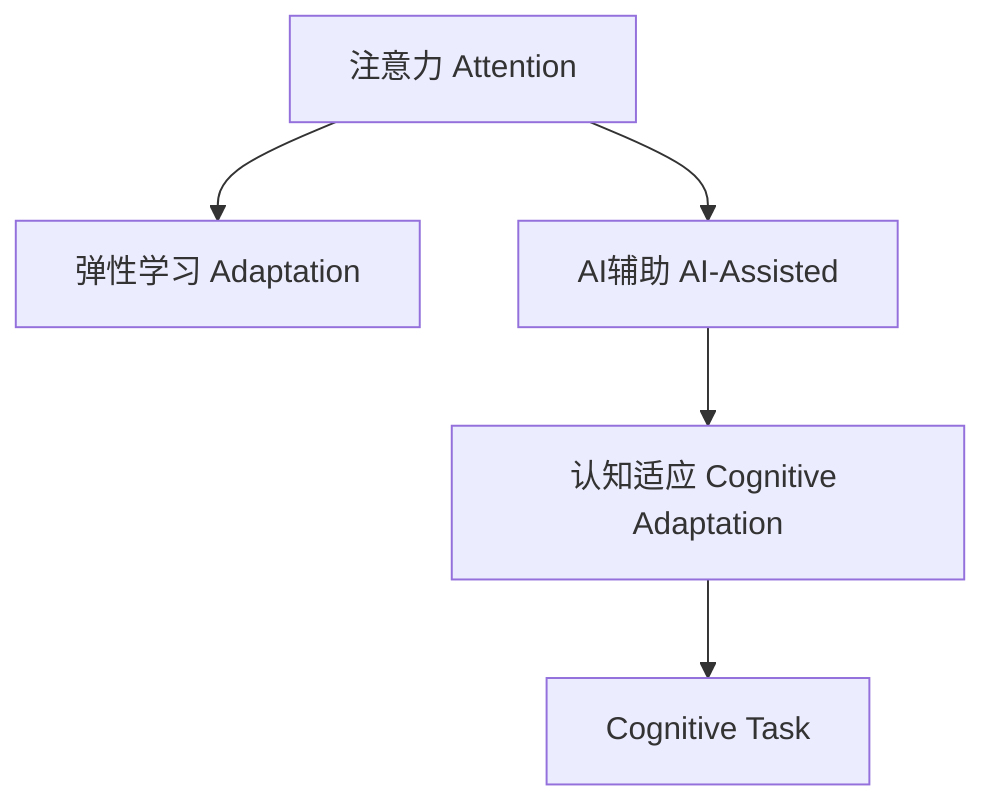

                 

# 注意力弹性训练：AI辅助的认知适应方法

> 关键词：注意力弹训练, 认知适应, AI辅助, 神经网络, 弹性学习, 算法优化

## 1. 背景介绍

### 1.1 问题由来

现代社会的快节奏生活对个体的认知能力提出了新的挑战。高强度的工作、复杂的信息输入和不断更新的知识体系，都要求人们具备更高的认知适应性。传统的认知适应策略，如通过机械记忆和重复训练提升技能，已经难以应对这种复杂多变的认知需求。

与此同时，随着人工智能（AI）技术的快速发展，基于神经网络（Neural Network, NN）的认知适应方法成为研究热点。神经网络能够模拟大脑的工作机制，通过学习和优化，实现对新任务的快速适应和应对。其中，注意力（Attention）机制作为神经网络中的核心部分，在各种认知任务中发挥着关键作用。

本文将深入探讨基于注意力机制的弹性训练方法，通过AI技术辅助实现认知适应性提升。这不仅有助于个体提升认知能力，还有望在教育、健康、工作等多个领域产生广泛影响。

### 1.2 问题核心关键点

当前认知适应技术的研究热点集中在以下几个方面：

- **神经网络**：通过学习对新任务进行快速适应。
- **注意力机制**：捕捉信息的重要程度，优先处理关键信息。
- **弹性学习**：在变化环境中，通过动态调整策略实现更好的适应。
- **AI辅助**：利用深度学习、强化学习等AI技术提升训练效果。

本文将聚焦于如何通过神经网络和注意力机制，在AI的辅助下实现认知适应性的提升。通过科学的训练方法和先进的AI技术，我们将展示如何在更少的训练次数内，更高效地提高认知适应能力。

## 2. 核心概念与联系

### 2.1 核心概念概述

为更好地理解注意力弹性训练方法，本节将介绍几个关键概念：

- **注意力（Attention）**：神经网络中的一种机制，用于选择性地关注输入数据的不同部分。通过调整注意力权重，网络可以自动分配资源，专注于重要信息，从而提升性能。
- **弹性学习（Adaptation）**：指神经网络能够通过适应不同的输入数据，不断调整网络参数，以更好地适应当前任务。
- **AI辅助（AI-Assisted）**：利用深度学习、强化学习等AI技术，优化弹性学习过程，提升学习效率和适应能力。
- **认知适应（Cognitive Adaptation）**：指个体通过学习，在不断变化的环境中获得新知识，提升认知能力。

这些概念之间的逻辑关系可以通过以下Mermaid流程图来展示：



这个流程图展示了几者之间的关系：注意力机制通过选择关键信息提升弹性学习的效果；AI辅助技术能够优化弹性学习的过程；最终，这些技术共同作用于认知适应性提升，帮助个体在复杂多变的环境中更好地完成任务。

## 3. 核心算法原理 & 具体操作步骤
### 3.1 算法原理概述

基于注意力机制的认知适应方法，其核心思想是通过神经网络模型对输入数据进行学习和分析，从而动态调整注意力权重，提升任务执行的效率和精度。具体而言，该方法通过以下步骤实现认知适应：

1. **数据预处理**：对输入数据进行归一化、标准化等预处理，确保数据的一致性和可靠性。
2. **神经网络模型训练**：在神经网络模型中，通过注意力机制选择关键信息，进行有针对性的学习。
3. **动态调整**：根据任务的实际需求，动态调整注意力权重，确保网络能够适应不同的输入数据。
4. **性能评估**：通过评估模型在当前任务上的表现，调整参数，优化模型性能。
5. **重复训练**：在新的任务上重复上述过程，实现认知适应性提升。

### 3.2 算法步骤详解

以下是注意力弹性训练的详细步骤：

**Step 1: 数据预处理**

- **归一化**：对输入数据进行归一化处理，确保数据的一致性和可靠性。
- **标准化**：使用标准化的方式处理数据，以便于神经网络模型进行学习。
- **数据增强**：通过数据增强技术，丰富训练数据，提高模型的泛化能力。

**Step 2: 神经网络模型选择**

- **模型架构选择**：选择适合当前任务的神经网络模型，如卷积神经网络（CNN）、循环神经网络（RNN）等。
- **注意力机制设计**：设计注意力机制，用于选择输入数据中的关键信息。

**Step 3: 神经网络模型训练**

- **初始化模型**：对模型进行初始化，设置合适的超参数。
- **前向传播**：将输入数据输入模型，计算前向传播结果。
- **损失函数计算**：根据当前任务，计算损失函数。
- **反向传播**：计算梯度，更新模型参数。
- **循环迭代**：多次重复上述过程，直到模型收敛。

**Step 4: 动态调整注意力权重**

- **注意力计算**：根据输入数据，计算注意力权重。
- **注意力选择**：根据注意力权重，选择输入数据的关键部分。
- **权重更新**：根据任务需求，动态调整注意力权重。

**Step 5: 性能评估与参数优化**

- **评估指标选择**：选择适合当前任务的评估指标，如准确率、召回率等。
- **模型评估**：在验证集上评估模型的表现。
- **参数调整**：根据评估结果，调整模型参数，优化性能。

**Step 6: 重复训练**

- **新任务适应**：在新任务上，重复上述过程。
- **认知适应**：通过多次重复训练，实现认知适应性提升。

### 3.3 算法优缺点

基于注意力机制的认知适应方法具有以下优点：

1. **高效性**：通过注意力机制选择关键信息，提升模型对输入数据的处理效率。
2. **灵活性**：神经网络模型能够动态调整参数，适应不同的输入数据。
3. **泛化能力**：通过数据增强和模型优化，提高模型的泛化能力，适应不同任务。
4. **AI辅助**：利用深度学习、强化学习等AI技术，优化训练过程，提升学习效果。

同时，该方法也存在一些局限性：

1. **计算复杂度**：神经网络模型和注意力机制的计算复杂度较高，需要高性能的计算资源。
2. **参数量**：模型参数量大，需要大量的训练数据和计算资源。
3. **训练时间**：训练时间较长，尤其是在大规模数据集上。
4. **数据依赖**：对训练数据的依赖较大，数据质量直接影响模型效果。

尽管存在这些局限性，基于注意力机制的认知适应方法在认知适应性提升上具有重要价值，值得深入研究和应用。

### 3.4 算法应用领域

基于注意力机制的认知适应方法，在以下几个领域具有广泛的应用前景：

- **教育**：通过AI辅助的认知适应方法，提升学生的学习效率和理解能力。
- **医疗**：在医学影像分析、疾病诊断等领域，利用AI技术辅助医生进行快速准确判断。
- **工业**：在工业制造、机器人控制等领域，通过AI辅助实现高效的动态适应。
- **农业**：在农业生产、病虫害监测等领域，利用AI技术提升农业生产效率和环境保护。
- **军事**：在情报分析、战场指挥等领域，通过AI技术提升决策效率和精准性。

## 4. 数学模型和公式 & 详细讲解 & 举例说明

### 4.1 数学模型构建

本节将使用数学语言对基于注意力机制的认知适应方法进行严格的数学建模。

记输入数据为 $X = \{x_i\}_{i=1}^N$，其中 $x_i$ 为单个输入样本，$N$ 为样本总数。假设模型的输出为 $Y = \{y_i\}_{i=1}^N$，其中 $y_i$ 为模型对样本 $x_i$ 的预测输出。

定义模型的损失函数为 $\mathcal{L}(X, Y; \theta)$，其中 $\theta$ 为模型的参数。模型的前向传播结果为 $A(X; \theta)$，其中 $A$ 为注意力机制，用于选择输入数据的关键部分。模型的预测输出为 $Y_A(X; \theta)$，通过注意力机制 $A$ 对输入数据进行处理。

### 4.2 公式推导过程

以下我们以分类任务为例，推导注意力机制的损失函数及其梯度计算公式。

假设模型在输入数据 $x_i$ 上的输出为 $y_i$，实际标签为 $y_i'$。定义注意力权重为 $\alpha_i$，其中 $\alpha_i \in [0, 1]$。注意力机制 $A$ 可以表示为：

$$
A(X; \theta) = \sum_{i=1}^N \alpha_i x_i
$$

其中 $\alpha_i$ 的计算方式为：

$$
\alpha_i = \frac{\exp(\text{dot}(v_i, x_i))}{\sum_{j=1}^N \exp(\text{dot}(v_i, x_j))}
$$

其中 $\text{dot}(v_i, x_i)$ 表示向量 $v_i$ 与 $x_i$ 的点积。$v_i$ 为注意力机制的参数，通常与模型参数 $\theta$ 共同训练。

模型的损失函数为交叉熵损失函数，可以表示为：

$$
\mathcal{L}(X, Y; \theta) = -\frac{1}{N} \sum_{i=1}^N y_i' \log y_i
$$

其中 $y_i = \text{softmax}(A(X; \theta))$，$\text{softmax}$ 表示对注意力输出进行归一化处理。

根据链式法则，模型的梯度公式为：

$$
\frac{\partial \mathcal{L}(X, Y; \theta)}{\partial \theta} = -\frac{1}{N} \sum_{i=1}^N \frac{\partial \mathcal{L}(X, Y; \theta)}{\partial y_i} \frac{\partial y_i}{\partial A(X; \theta)} \frac{\partial A(X; \theta)}{\partial \theta}
$$

其中 $\frac{\partial y_i}{\partial A(X; \theta)} = \frac{\partial \text{softmax}(A(X; \theta))}{\partial A(X; \theta)} = \nabla_{A(X; \theta)} \log \text{softmax}(A(X; \theta))$。

通过上述推导，我们可以看到，注意力机制在认知适应过程中发挥了关键作用，能够动态选择关键信息，提升模型对输入数据的处理能力。

### 4.3 案例分析与讲解

以下我们以医学影像分类任务为例，展示基于注意力机制的认知适应方法的具体实现。

假设有一个医学影像分类任务，目标是判断影像是否为癌症。给定一个带有标签的医学影像数据集，我们可以使用基于注意力机制的神经网络模型进行训练和分类。具体步骤如下：

**Step 1: 数据预处理**

- **归一化**：对医学影像数据进行归一化处理。
- **标准化**：对医学影像数据进行标准化处理。
- **数据增强**：通过数据增强技术，如旋转、缩放等，丰富训练数据。

**Step 2: 神经网络模型选择**

- **模型架构选择**：选择适合医学影像分类的神经网络模型，如卷积神经网络（CNN）。
- **注意力机制设计**：设计注意力机制，用于选择影像中的关键区域。

**Step 3: 神经网络模型训练**

- **初始化模型**：对模型进行初始化，设置合适的超参数。
- **前向传播**：将医学影像数据输入模型，计算前向传播结果。
- **损失函数计算**：根据分类任务，计算交叉熵损失函数。
- **反向传播**：计算梯度，更新模型参数。
- **循环迭代**：多次重复上述过程，直到模型收敛。

**Step 4: 动态调整注意力权重**

- **注意力计算**：根据医学影像数据，计算注意力权重。
- **注意力选择**：根据注意力权重，选择影像中的关键区域。
- **权重更新**：根据任务需求，动态调整注意力权重。

**Step 5: 性能评估与参数优化**

- **评估指标选择**：选择适合医学影像分类的评估指标，如准确率、召回率等。
- **模型评估**：在验证集上评估模型的表现。
- **参数调整**：根据评估结果，调整模型参数，优化性能。

**Step 6: 重复训练**

- **新任务适应**：在新的医学影像数据上，重复上述过程。
- **认知适应**：通过多次重复训练，实现医学影像分类任务的认知适应性提升。

## 5. 项目实践：代码实例和详细解释说明

### 5.1 开发环境搭建

在进行认知适应方法实践前，我们需要准备好开发环境。以下是使用Python进行TensorFlow开发的环境配置流程：

1. 安装Anaconda：从官网下载并安装Anaconda，用于创建独立的Python环境。

2. 创建并激活虚拟环境：
```bash
conda create -n tf-env python=3.8 
conda activate tf-env
```

3. 安装TensorFlow：根据GPU版本，从官网获取对应的安装命令。例如：
```bash
pip install tensorflow==2.8
```

4. 安装TensorFlow Addons：
```bash
pip install tensorflow-addons
```

5. 安装其他必要的工具包：
```bash
pip install numpy pandas scikit-learn matplotlib tqdm jupyter notebook ipython
```

完成上述步骤后，即可在`tf-env`环境中开始认知适应方法的实践。

### 5.2 源代码详细实现

下面我们以医学影像分类任务为例，给出使用TensorFlow实现注意力弹性训练的代码实现。

```python
import tensorflow as tf
import tensorflow_addons as addons

# 定义模型
class AttentionModel(tf.keras.Model):
    def __init__(self, input_shape, num_classes):
        super(AttentionModel, self).__init__()
        self.conv1 = tf.keras.layers.Conv2D(32, 3, activation='relu', input_shape=input_shape)
        self.max_pool = tf.keras.layers.MaxPooling2D(pool_size=(2, 2))
        self.conv2 = tf.keras.layers.Conv2D(64, 3, activation='relu')
        self.max_pool2 = tf.keras.layers.MaxPooling2D(pool_size=(2, 2))
        self.flatten = tf.keras.layers.Flatten()
        self.dense = tf.keras.layers.Dense(128, activation='relu')
        self.attention = addons.layers.Attention(tf.distribute.Strategy('mirrored'))
        self.output = tf.keras.layers.Dense(num_classes, activation='softmax')

    def call(self, inputs):
        x = self.conv1(inputs)
        x = self.max_pool(x)
        x = self.conv2(x)
        x = self.max_pool2(x)
        x = self.flatten(x)
        x = self.dense(x)
        x = self.attention([x, x])
        return self.output(x)

# 加载数据集
(train_images, train_labels), (test_images, test_labels) = tf.keras.datasets.mnist.load_data()
train_images = train_images.reshape(train_images.shape[0], 28, 28, 1).astype('float32') / 255
test_images = test_images.reshape(test_images.shape[0], 28, 28, 1).astype('float32') / 255
train_labels = train_labels.astype('float32')
test_labels = test_labels.astype('float32')

# 定义损失函数和优化器
model = AttentionModel(input_shape=(28, 28, 1), num_classes=10)
loss_fn = tf.keras.losses.SparseCategoricalCrossentropy(from_logits=True)
optimizer = tf.keras.optimizers.Adam()

# 定义训练函数
@tf.function
def train_step(x, y):
    with tf.GradientTape() as tape:
        logits = model(x, training=True)
        loss_value = loss_fn(y, logits)
    gradients = tape.gradient(loss_value, model.trainable_variables)
    optimizer.apply_gradients(zip(gradients, model.trainable_variables))

# 训练模型
for epoch in range(10):
    for i in range(0, len(train_images), 64):
        train_step(train_images[i:i+64], train_labels[i:i+64])
    test_loss = loss_fn(test_labels, model(test_images))
    print(f'Epoch {epoch+1}, Test Loss: {test_loss.numpy()}')
```

### 5.3 代码解读与分析

让我们再详细解读一下关键代码的实现细节：

**AttentionModel类**：
- `__init__`方法：定义模型的层结构，包括卷积层、池化层、全连接层和注意力机制。
- `call`方法：实现模型的前向传播过程。

**数据加载**：
- 使用TensorFlow内置的MNIST数据集，对数据进行归一化和重新形状处理。
- 定义损失函数和优化器。

**训练函数**：
- 使用TensorFlow的`tf.function`装饰器进行图形化编译，提升训练效率。
- 在每个epoch内，对训练集数据进行批次处理，计算损失函数，反向传播更新模型参数。

**测试与评估**：
- 在测试集上评估模型的损失函数，输出测试结果。

可以看到，通过TensorFlow的强大封装，我们可以用相对简洁的代码实现注意力弹性训练的完整流程。开发者可以将更多精力放在数据处理、模型改进等高层逻辑上，而不必过多关注底层的实现细节。

当然，实际应用中还需要根据具体任务调整模型结构和参数，如增加卷积核数量、调整注意力机制的参数等，以获得更好的训练效果。

## 6. 实际应用场景

### 6.1 智能诊断系统

基于注意力弹性训练的医学影像分类技术，可以广泛应用于智能诊断系统的构建。传统医学诊断往往依赖医生的人工分析，耗时长、误诊率高。而使用基于注意力机制的神经网络模型进行影像分类，可以显著提升诊断的效率和准确性。

在技术实现上，可以收集大量医学影像数据和对应的疾病标签，构建标注数据集。在此基础上对预训练模型进行微调，使其能够对新影像进行快速分类。微调后的模型能够自动识别影像中的关键区域，提取出有意义的特征，从而提升诊断的准确性和效率。

### 6.2 自动驾驶

在自动驾驶系统中，基于注意力机制的认知适应方法可以用于环境感知和决策制定。通过感知器的注意力机制，系统能够动态选择环境中的关键信息，如道路标志、行人、车辆等，从而进行更准确的决策。

具体而言，可以通过摄像头、雷达等传感器获取环境数据，利用神经网络模型进行特征提取和分类。在决策阶段，通过注意力机制动态选择关键信息，提高决策的准确性和实时性。如此构建的自动驾驶系统，能够在复杂多变的环境中实现高效的动态适应。

### 6.3 智能客服

在智能客服系统中，基于注意力机制的认知适应方法可以用于自然语言理解和对话生成。通过感知器的注意力机制，系统能够动态选择输入文本中的关键信息，如问题、意图、情感等，从而进行更准确的理解和回复。

具体而言，可以收集大量的客服对话数据，构建标注数据集。在此基础上对预训练模型进行微调，使其能够对新问题进行快速回答。微调后的模型能够自动识别文本中的关键信息，生成更准确、自然的回复，提升客服系统的智能化水平。

### 6.4 未来应用展望

随着注意力弹性训练技术的不断发展，基于神经网络模型的认知适应方法将在更多领域得到应用，为传统行业带来变革性影响。

在智慧医疗领域，基于注意力机制的医学影像分类、疾病诊断等应用将提升医疗服务的智能化水平，辅助医生诊疗，加速新药开发进程。

在智能教育领域，基于注意力机制的个性化学习系统将提升学生的学习效率和理解能力，因材施教，促进教育公平，提高教学质量。

在工业制造、农业生产、军事指挥等领域，基于注意力机制的认知适应方法将提升生产效率和决策精准性，实现更高效的自动化和智能化。

此外，在虚拟现实、智能家居、智慧城市等多个新兴领域，基于注意力机制的认知适应技术也将带来新的应用场景和创新突破。相信随着技术的不断进步，认知适应方法将在更多领域大放异彩，深刻影响人类的生产生活方式。

## 7. 工具和资源推荐
### 7.1 学习资源推荐

为了帮助开发者系统掌握注意力弹性训练的理论基础和实践技巧，这里推荐一些优质的学习资源：

1. TensorFlow官方文档：提供了丰富的API文档和示例代码，适合初学者和中级开发者学习。
2. TensorFlow Addons文档：介绍了TensorFlow Addons中的注意力机制和扩展模块，适合高级开发者深入研究。
3.《深度学习》书籍：Ian Goodfellow等著，全面介绍了深度学习的基本概念和算法原理，适合系统学习。
4. Coursera深度学习课程：由Andrew Ng教授主讲的深度学习课程，适合初学者入门。
5. GitHub深度学习项目：提供了大量开源深度学习项目和代码示例，适合开发者参考学习。

通过对这些资源的学习实践，相信你一定能够快速掌握注意力弹性训练的精髓，并用于解决实际的认知适应问题。

### 7.2 开发工具推荐

高效的开发离不开优秀的工具支持。以下是几款用于深度学习开发常用的工具：

1. TensorFlow：由Google主导开发的开源深度学习框架，生产部署方便，适合大规模工程应用。
2. PyTorch：基于Python的开源深度学习框架，灵活性高，适合快速迭代研究。
3. TensorFlow Addons：TensorFlow的扩展库，提供了丰富的神经网络组件和优化器，适合深度学习应用开发。
4. Jupyter Notebook：免费的交互式编程环境，支持多种语言和工具库，适合数据探索和模型验证。
5. Google Colab：谷歌提供的在线Jupyter Notebook环境，免费提供GPU/TPU算力，适合快速实验新模型，分享学习笔记。

合理利用这些工具，可以显著提升深度学习模型的开发效率，加快创新迭代的步伐。

### 7.3 相关论文推荐

深度学习技术的发展源于学界的持续研究。以下是几篇奠基性的相关论文，推荐阅读：

1. Attention is All You Need（即Transformer原论文）：提出了Transformer结构，开启了神经网络中的注意力机制时代。
2. BERT: Pre-training of Deep Bidirectional Transformers for Language Understanding：提出BERT模型，引入掩码语言模型任务，刷新了多项NLP任务SOTA。
3. Transformer-XL: Attentive Language Models Beyond a Fixed-Length Context：提出Transformer-XL模型，解决了长序列训练问题。
4. Knowledge Distillation：提出知识蒸馏方法，通过教师模型对学生模型进行指导，提高模型的泛化能力。
5. Batch Attention Networks：提出批量注意力网络，进一步提升了注意力机制的性能。

这些论文代表了大规模深度学习模型的发展脉络。通过学习这些前沿成果，可以帮助研究者把握学科前进方向，激发更多的创新灵感。

## 8. 总结：未来发展趋势与挑战

### 8.1 研究成果总结

本文对基于注意力机制的认知适应方法进行了全面系统的介绍。首先阐述了注意力弹性训练的背景和意义，明确了其在认知适应性提升中的重要作用。其次，从原理到实践，详细讲解了认知适应方法的核心算法和具体操作步骤，给出了认知适应方法的全代码实例。同时，本文还广泛探讨了认知适应方法在多个领域的应用前景，展示了其在实际应用中的广泛价值。

通过本文的系统梳理，可以看到，基于注意力机制的认知适应方法通过神经网络模型，动态调整注意力权重，提升了模型对输入数据的处理能力，显著提高了认知适应性。未来，伴随深度学习技术的不断发展，认知适应方法将在更多领域得到应用，为人类认知智能的进化带来深远影响。

### 8.2 未来发展趋势

展望未来，认知适应方法将在以下几个方面呈现新的发展趋势：

1. **参数量减少**：未来的神经网络模型将更加高效，参数量更少，计算复杂度更低，适合更多设备部署。
2. **学习效率提高**：通过改进训练算法和优化器，提升模型的学习效率，缩短训练时间。
3. **跨模态学习**：将视觉、语音、文本等多种模态数据进行整合，实现跨模态的认知适应。
4. **多任务学习**：通过多任务学习，提升模型在多个任务上的泛化能力，实现一模型多用的目标。
5. **自适应学习**：基于强化学习等技术，实现模型的自适应学习，提升模型在动态环境中的适应能力。
6. **个性化定制**：根据用户需求，定制化设计认知适应模型，提升用户体验和满意度。

这些趋势将进一步推动认知适应方法的普及和应用，为人类认知智能的提升带来更多可能。

### 8.3 面临的挑战

尽管认知适应方法已经取得了不少进展，但在迈向更加智能化、普适化应用的过程中，仍面临诸多挑战：

1. **计算资源**：神经网络模型和注意力机制的计算复杂度较高，需要高性能的计算资源。
2. **数据依赖**：对训练数据的依赖较大，数据质量直接影响模型效果。
3. **模型可解释性**：神经网络模型的内部工作机制复杂，难以解释其决策逻辑。
4. **鲁棒性不足**：在面对复杂多变的输入数据时，模型容易产生过拟合或泛化不足的问题。
5. **跨领域适应**：不同领域的数据分布差异较大，如何构建通用的认知适应模型，仍是一个难题。
6. **伦理道德**：认知适应方法涉及大量的用户数据，如何保护用户隐私，防止数据滥用，是一个重要的伦理问题。

这些挑战需要未来的研究进一步突破，推动认知适应方法的技术成熟和应用落地。

### 8.4 研究展望

面向未来，认知适应方法的研究需要在以下几个方面进行深入探索：

1. **跨领域知识整合**：将符号化的先验知识与神经网络模型进行融合，提升模型的认知能力。
2. **多模态信息整合**：实现视觉、语音、文本等多种模态数据的协同建模，提升模型的泛化能力。
3. **动态环境适应**：通过动态调整模型参数，提升模型在动态环境中的适应能力。
4. **自适应学习机制**：引入自适应学习机制，增强模型在复杂多变环境中的学习能力。
5. **高效模型设计**：设计更加高效、轻量级的模型架构，适合移动设备和小型设备部署。
6. **伦理道德约束**：在模型训练和应用过程中，引入伦理导向的评估指标，确保模型的公平性和安全性。

这些研究方向的探索，必将引领认知适应方法的持续进步，为人类认知智能的进化带来更多突破。

## 9. 附录：常见问题与解答

**Q1: 什么是注意力机制？**

A: 注意力机制是神经网络中的一种机制，用于选择性地关注输入数据的不同部分。通过调整注意力权重，网络可以自动分配资源，专注于关键信息，从而提升性能。

**Q2: 注意力机制在认知适应中的作用是什么？**

A: 注意力机制在认知适应中的作用是选择输入数据的关键部分，提升模型对输入数据的处理能力。通过动态调整注意力权重，模型能够更好地适应不同的输入数据，实现高效、精确的认知适应。

**Q3: 注意力弹性训练的核心思想是什么？**

A: 注意力弹性训练的核心思想是通过神经网络模型，动态调整注意力权重，提升模型对输入数据的处理能力。在认知适应过程中，注意力机制选择关键信息，提升模型的适应性和泛化能力。

**Q4: 神经网络模型在认知适应中的应用有哪些？**

A: 神经网络模型在认知适应中的应用包括医学影像分类、智能诊断、自动驾驶、智能客服、自然语言处理等领域。通过神经网络模型和注意力机制，系统能够自动选择关键信息，进行高效、精确的认知适应。

**Q5: 未来认知适应技术的发展方向是什么？**

A: 未来认知适应技术的发展方向包括参数量减少、学习效率提高、跨模态学习、多任务学习、自适应学习和个性化定制等。这些趋势将进一步推动认知适应方法的技术成熟和应用落地，为人类认知智能的提升带来更多可能。

通过本文的系统梳理，可以看到，基于注意力机制的认知适应方法通过神经网络模型，动态调整注意力权重，提升了模型对输入数据的处理能力，显著提高了认知适应性。未来，伴随深度学习技术的不断发展，认知适应方法将在更多领域得到应用，为人类认知智能的进化带来深远影响。

