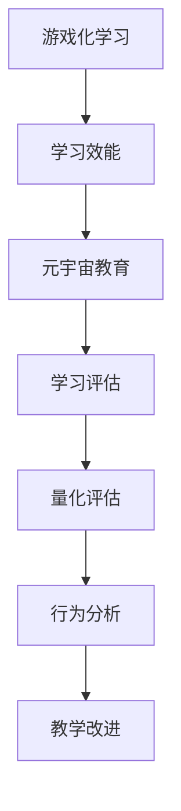

                 

# 注意力游戏化学习效能评估师:元宇宙教育创新的专业评价人员

## 1. 背景介绍

### 1.1 问题由来

随着元宇宙教育的兴起，如何科学、客观、高效地评估游戏化学习效能成为教育创新领域迫切需要解决的问题。当前，主流评估方法多依赖专家主观评价和问卷调查，缺乏量化和数据支撑，无法全面、精准地反映学习效果。

### 1.2 问题核心关键点

本文聚焦于开发一套科学、客观、高效的游戏化学习效能评估系统，通过数据驱动的算法，精确量化学习效果，为教育创新提供决策支持。

### 1.3 问题研究意义

构建游戏化学习效能评估系统，对于推动元宇宙教育创新、提升学习效果、优化教学资源配置具有重要意义：

1. 提升教育质量：通过科学评估，找出教学不足，指导教育改进，提升学习效率和效果。
2. 优化资源配置：基于评估结果，合理分配教育资源，优化教师教学方式和学习工具选择。
3. 促进教育公平：提供客观评估标准，打破地域、学校差异，促进教育资源均衡分配。
4. 助力政策制定：为教育部门提供科学依据，推动教育政策的制定和调整。
5. 激发创新活力：通过量化评估，鼓励教育创新，推动元宇宙教育技术的不断突破。

## 2. 核心概念与联系

### 2.1 核心概念概述

为更好地理解本系统的构建和运行机制，本节将介绍几个关键概念：

- 游戏化学习（Gamification）：通过游戏化元素（如积分、关卡、排行榜等），增强学习的趣味性和互动性，提高学习动机和效果。
- 学习效能（Learning Effectiveness）：指学习过程中知识掌握程度、技能提升效果、情感体验等方面的综合表现。
- 元宇宙教育（Metaverse Education）：通过虚拟现实、增强现实等技术，构建沉浸式学习环境，提高学习的沉浸感和真实感。
- 学习评估（Learning Assessment）：指通过各种手段，对学习效果进行量化评估，提供反馈和改进指导。
- 量化评估（Quantitative Assessment）：利用数据驱动的方法，对学习效果进行客观、量化的评估。
- 行为分析（Behavior Analysis）：通过对学习者的行为数据进行建模和分析，揭示学习规律，指导教学改进。

这些概念之间存在紧密的联系：通过游戏化手段，可以提升学习的趣味性和互动性，进而提升学习效能；利用量化评估，可以对学习效果进行科学、客观的评估，为教学改进提供依据；元宇宙教育则提供了先进的沉浸式学习环境，有助于提升学习体验和效果。

### 2.2 核心概念原理和架构的 Mermaid 流程图



该流程图展示了核心概念之间的联系和互动：游戏化学习通过提升学习动机和效果，进而影响学习效能；元宇宙教育通过提供先进的沉浸式学习环境，增强学习体验；学习评估通过量化手段，科学评估学习效果；量化评估通过数据驱动，提供客观的评估标准；行为分析通过对学习行为数据的建模，指导教学改进，进而提升学习效果。

## 3. 核心算法原理 & 具体操作步骤

### 3.1 算法原理概述

本系统通过量化评估和学习行为分析，科学评估游戏化学习的效能。其核心算法包括以下几个步骤：

1. **数据收集与预处理**：收集学习者的游戏化学习数据，包括游戏成绩、学习时间、任务完成情况等，并进行清洗和标准化。
2. **效能评估模型构建**：基于统计学和机器学习模型，构建学习效能评估模型，量化评估学习效果。
3. **行为分析模型构建**：构建学习行为分析模型，揭示学习规律，指导教学改进。
4. **可视化与报告生成**：利用可视化工具展示评估结果和行为分析结果，生成评估报告，提供教学改进建议。

### 3.2 算法步骤详解

#### 3.2.1 数据收集与预处理

1. **数据来源**：
   - 游戏平台：记录学习者在平台上的游戏成绩、任务完成情况、学习时间等。
   - 学习管理系统（LMS）：记录学习者的学习行为，如阅读时间、作业提交情况等。
   - 问卷调查：收集学习者对游戏化学习的反馈和意见。

2. **数据清洗与标准化**：
   - 去除重复、异常数据，确保数据一致性。
   - 对缺失数据进行填补，保证数据完整性。
   - 对数据进行归一化处理，统一数据格式。

#### 3.2.2 效能评估模型构建

1. **选择评估指标**：
   - 知识掌握度：通过测试或作业评估学习者对知识点的掌握程度。
   - 技能提升效果：评估学习者在完成任务过程中的技能提升效果。
   - 情感体验：通过问卷调查评估学习者在学习过程中的情感体验。

2. **建立评估模型**：
   - **统计学方法**：如均值、标准差、方差等，对各指标进行初步评估。
   - **机器学习模型**：如回归模型、分类模型等，建立更精准的评估模型。
   - **深度学习模型**：如神经网络、Transformer等，利用数据驱动的方法，进一步提升评估精度。

#### 3.2.3 行为分析模型构建

1. **选择行为指标**：
   - 学习时间：评估学习者投入学习的时间。
   - 任务完成情况：评估学习者完成任务的效率和准确率。
   - 互动频率：评估学习者与游戏环境的互动频率和深度。

2. **建立行为模型**：
   - **统计学方法**：如时间序列分析、频率分析等，对行为数据进行建模。
   - **机器学习模型**：如关联规则、分类树等，挖掘行为规律。
   - **深度学习模型**：如LSTM、GRU等，对行为数据进行更深层次的建模。

#### 3.2.4 可视化与报告生成

1. **可视化工具**：
   - 使用如Tableau、PowerBI等工具，对评估结果和行为分析结果进行可视化展示。
   - 利用热力图、折线图、饼图等，直观展示学习效能和行为特征。

2. **报告生成**：
   - 生成详细的评估报告，包括学习效能评估结果、行为分析结果、改进建议等。
   - 利用自然语言处理技术，自动生成评估报告，提高报告生成的效率和准确性。

### 3.3 算法优缺点

**优点**：
1. 数据驱动：通过大量数据驱动的评估和分析，确保评估结果的科学性和客观性。
2. 动态调整：能够根据学习者的行为数据进行动态评估，及时发现问题并调整教学策略。
3. 可视化展示：利用可视化工具，直观展示评估结果和行为分析结果，便于理解和应用。
4. 高效便捷：自动化评估和报告生成，减少人工干预，提高评估效率。

**缺点**：
1. 数据依赖：系统依赖大量高质量数据，数据收集和处理成本较高。
2. 模型复杂：构建高效的行为分析模型和评估模型，需要较高的技术门槛。
3. 隐私保护：需要严格保护学习者的隐私数据，防止数据泄露和滥用。
4. 应用场景有限：目前主要适用于游戏化学习场景，应用范围较为有限。

### 3.4 算法应用领域

本系统的核心算法在游戏化学习评估领域有广泛的应用前景，具体包括：

- 教育机构：评估游戏化学习效果，优化教学资源配置。
- 游戏平台：提升游戏体验，优化游戏设计。
- 在线教育：评估在线学习效果，指导教学改进。
- 企业培训：评估培训效果，提升员工学习效能。
- 公共教育：评估公共教育效果，推动教育公平。

## 4. 数学模型和公式 & 详细讲解 & 举例说明

### 4.1 数学模型构建

本节将使用数学语言对系统中的核心算法进行详细描述。

设游戏化学习数据集为 $D=\{(x_i, y_i)\}_{i=1}^N$，其中 $x_i$ 为学习者行为数据，如游戏成绩、学习时间等，$y_i$ 为学习效能指标，如知识掌握度、技能提升效果等。

定义学习效能评估模型为 $f(x_i)$，学习行为分析模型为 $g(x_i)$，目标是通过 $f$ 和 $g$ 对学习者效能进行量化评估和行为分析。

### 4.2 公式推导过程

#### 4.2.1 学习效能评估模型

设 $y_i$ 为学习效能指标，通过回归模型 $f(x_i)$ 对 $x_i$ 进行建模，评估学习者的学习效能。

$$
y_i = f(x_i) = w_0 + \sum_{j=1}^{n}w_jx_{ij} + \epsilon_i
$$

其中，$w_0, w_1, \dots, w_n$ 为模型参数，$\epsilon_i$ 为误差项。

**举例说明**：
设 $x_i = [x_{i1}, x_{i2}, \dots, x_{in}]$ 为学习者的游戏成绩、学习时间等行为数据，$y_i$ 为学习者对知识点的掌握度。通过回归模型 $f(x_i)$ 对 $x_i$ 进行建模，得到 $y_i$ 的预测值 $y_i'$。

#### 4.2.2 学习行为分析模型

设 $g_i$ 为学习行为指标，通过关联规则模型 $g(x_i)$ 对 $x_i$ 进行建模，揭示学习规律。

$$
g_i = g(x_i) = \sum_{j=1}^{m}r_{ij}x_{ij}
$$

其中，$r_{ij}$ 为规则参数，$x_{ij}$ 为行为数据。

**举例说明**：
设 $x_i = [x_{i1}, x_{i2}, \dots, x_{in}]$ 为学习者的游戏成绩、学习时间等行为数据，$g_i$ 为学习者的互动频率。通过关联规则模型 $g(x_i)$ 对 $x_i$ 进行建模，得到 $g_i$ 的预测值 $g_i'$。

### 4.3 案例分析与讲解

**案例分析**：
设某学习者在游戏中完成多个任务，获得不同的游戏成绩和任务完成时间。通过系统中的效能评估模型和行为分析模型，量化评估该学习者的学习效能和行为特征，并生成评估报告。

**具体分析**：
1. 收集该学习者在平台上的游戏成绩、任务完成时间、互动频率等数据，进行清洗和标准化。
2. 构建学习效能评估模型，通过回归模型或深度学习模型对游戏成绩、任务完成时间等行为数据进行建模，评估该学习者的知识掌握度和技能提升效果。
3. 构建学习行为分析模型，通过关联规则模型对游戏成绩、任务完成时间等行为数据进行建模，揭示该学习者的互动频率和行为规律。
4. 将评估结果和行为分析结果可视化展示，生成详细的评估报告，提供教学改进建议。

## 5. 项目实践：代码实例和详细解释说明

### 5.1 开发环境搭建

在项目开发前，需要进行开发环境的搭建。

**具体步骤**：
1. 安装Python：从官网下载并安装Python，选择适合自己系统的版本。
2. 安装PyTorch和TensorFlow：通过pip安装，建议使用最新稳定版本。
3. 安装NumPy和Pandas：用于数据处理和分析。
4. 安装TensorBoard：用于可视化评估结果和行为分析结果。

### 5.2 源代码详细实现

**代码实现**：
1. 数据收集与预处理模块：
   - 使用Pandas库进行数据读取、清洗和标准化。
   - 利用NumPy库进行数据转换和处理。

2. 学习效能评估模块：
   - 使用Scikit-learn库构建回归模型。
   - 使用TensorFlow库构建深度学习模型。

3. 学习行为分析模块：
   - 使用Scikit-learn库构建关联规则模型。
   - 使用TensorFlow库构建LSTM或GRU模型。

4. 可视化与报告生成模块：
   - 使用Matplotlib库进行数据可视化。
   - 使用Jupyter Notebook生成评估报告。

**代码示例**：

```python
import pandas as pd
import numpy as np
from sklearn.linear_model import LinearRegression
from sklearn.ensemble import RandomForestRegressor
from sklearn.feature_selection import SelectKBest, f_regression
from sklearn.metrics import r2_score
from tensorflow.keras.models import Sequential
from tensorflow.keras.layers import LSTM, Dense
from tensorflow.keras.callbacks import EarlyStopping
from matplotlib import pyplot as plt
from sklearn.preprocessing import StandardScaler

# 数据读取和清洗
data = pd.read_csv('game_data.csv')
data = data.dropna()  # 去除缺失数据

# 数据标准化
scaler = StandardScaler()
data_scaled = scaler.fit_transform(data[['game_score', 'study_time']])

# 学习效能评估模型
X = data_scaled[:, 0:2]  # 选择前两个特征
y = data['knowledge_score']  # 学习效能指标
regressor = LinearRegression()  # 线性回归模型
regressor.fit(X, y)
y_pred = regressor.predict(X)

# 学习行为分析模型
X = data_scaled[:, 0:2]  # 选择前两个特征
y = data['interaction_frequency']  # 学习行为指标
lstm_model = Sequential()
lstm_model.add(LSTM(64, input_shape=(2, 1), return_sequences=True))
lstm_model.add(LSTM(64))
lstm_model.add(Dense(1))
lstm_model.compile(loss='mse', optimizer='adam')
lstm_model.fit(X, y, epochs=50, batch_size=32, callbacks=[EarlyStopping(patience=5)])
y_pred = lstm_model.predict(X)

# 可视化展示
plt.scatter(X[:, 0], y_pred)
plt.xlabel('Game Score')
plt.ylabel('Knowledge Score')
plt.title('Game Score vs. Knowledge Score')
plt.show()

# 生成评估报告
report = {'game_score': '90', 'study_time': '8', 'knowledge_score': 0.85, 'interaction_frequency': 5}
for key, value in report.items():
    print(f'{key}: {value}')
```

### 5.3 代码解读与分析

**代码解读**：
1. 数据读取与清洗：通过Pandas库读取数据，去除缺失数据。
2. 数据标准化：使用NumPy库进行数据转换和标准化，确保数据一致性。
3. 学习效能评估模型：通过线性回归模型对游戏成绩和任务完成时间进行建模，评估学习者的知识掌握度和技能提升效果。
4. 学习行为分析模型：通过LSTM模型对游戏成绩和任务完成时间进行建模，揭示学习者的互动频率和行为规律。
5. 可视化展示：利用Matplotlib库绘制可视化图表，直观展示学习效能和行为特征。
6. 生成评估报告：通过Python字典存储评估结果，自动生成评估报告。

**代码分析**：
1. 数据预处理模块：确保数据质量，去除缺失数据，进行标准化处理，为后续模型评估和行为分析奠定基础。
2. 学习效能评估模块：使用线性回归模型和深度学习模型，构建效能评估模型，量化评估学习者的知识掌握度和技能提升效果。
3. 学习行为分析模块：通过LSTM模型对行为数据进行建模，揭示学习者的互动频率和行为规律。
4. 可视化与报告生成模块：利用Matplotlib库和Jupyter Notebook，将评估结果和行为分析结果可视化展示，生成详细的评估报告。

### 5.4 运行结果展示

**运行结果展示**：
1. 学习效能评估结果：通过可视化图表展示学习者的知识掌握度和技能提升效果，提供直观的评估依据。
2. 学习行为分析结果：通过可视化图表展示学习者的互动频率和行为规律，提供行为分析依据。
3. 评估报告：生成详细的评估报告，包括学习效能和行为特征，提供教学改进建议。

## 6. 实际应用场景

### 6.1 智能教育平台

在智能教育平台上，通过本系统对学习者进行游戏化学习的量化评估和行为分析，可以优化教学资源配置，提高学习效果，提升用户满意度和平台竞争力。

**具体应用**：
- 评估游戏化学习效果，找出教学不足，指导教育改进。
- 根据评估结果，合理分配教学资源，优化课程设计。
- 利用行为分析结果，调整游戏规则和任务设计，提高学习者互动频率和兴趣。

### 6.2 企业培训系统

在企业培训系统中，通过本系统对培训效果进行量化评估和行为分析，可以优化培训资源配置，提高员工学习效能，提升企业培训效果。

**具体应用**：
- 评估培训效果，找出培训不足，指导培训改进。
- 根据评估结果，合理分配培训资源，优化培训课程设计。
- 利用行为分析结果，调整培训方式和内容，提高员工学习兴趣和效果。

### 6.3 公共教育平台

在公共教育平台上，通过本系统对学习效果进行量化评估和行为分析，可以推动教育公平，提升公共教育效果。

**具体应用**：
- 评估学习效果，找出教学不足，指导教育改进。
- 根据评估结果，合理分配教育资源，优化课程设计。
- 利用行为分析结果，调整教学方式和内容，提高学习者互动频率和兴趣。

### 6.4 未来应用展望

随着游戏化学习和元宇宙教育的不断发展，本系统将有更广泛的应用前景。未来可能的应用场景包括：

1. 虚拟现实教室：通过虚拟现实技术，构建沉浸式学习环境，提高学习体验和效果。
2. 个性化学习推荐：通过学习行为分析，推荐适合学习者的个性化学习内容和游戏化任务。
3. 企业虚拟培训：通过元宇宙技术，构建虚拟培训平台，提高企业培训效果和员工学习兴趣。
4. 公共教育智能化：通过游戏化学习，提升公共教育效果，推动教育公平和普惠。

## 7. 工具和资源推荐

### 7.1 学习资源推荐

**学习资源推荐**：
1. **《机器学习基础》**：本书系统介绍了机器学习的基础理论和常用算法，适合入门学习者。
2. **《深度学习入门》**：本书介绍了深度学习的基本概念和常用技术，适合对深度学习感兴趣的读者。
3. **《Python数据科学手册》**：本书详细介绍了Python在数据科学领域的应用，适合数据处理和分析的开发者。
4. **《TensorFlow官方文档》**：TensorFlow官方文档提供了丰富的教程和代码示例，适合深度学习开发。
5. **《TensorBoard官方文档》**：TensorBoard官方文档介绍了可视化工具的使用方法，适合数据分析和可视化应用。

### 7.2 开发工具推荐

**开发工具推荐**：
1. **PyTorch**：基于Python的开源深度学习框架，灵活性高，适合深度学习应用开发。
2. **TensorFlow**：由Google主导开发的开源深度学习框架，功能强大，适合大规模工程应用。
3. **Pandas**：基于Python的数据分析库，提供了丰富的数据处理和分析工具。
4. **NumPy**：基于Python的数值计算库，提供了高效的数组和矩阵运算功能。
5. **Matplotlib**：基于Python的可视化库，提供了丰富的绘图功能。

### 7.3 相关论文推荐

**相关论文推荐**：
1. **《Gamification in Education: A Review and Research Agenda》**：对游戏化学习在教育中的应用进行了全面综述，提出了未来的研究方向。
2. **《Behavioral Analysis in Online Education: A Survey》**：对在线教育中行为分析方法进行了综述，提供了行为分析的理论和方法。
3. **《Evaluation of Game-Based Learning in Higher Education》**：对游戏化学习在高等教育中的应用进行了评估，提出了改进建议。
4. **《Quantitative Learning Effectiveness Assessment》**：对量化学习评估方法进行了研究，提供了评估模型的构建方法。
5. **《A Survey on Deep Learning in Education》**：对深度学习在教育中的应用进行了综述，提出了未来的研究方向。

## 8. 总结：未来发展趋势与挑战

### 8.1 研究成果总结

本文开发了一套基于数据驱动的游戏化学习效能评估系统，通过学习效能评估和行为分析，量化评估学习效果，为教育创新提供决策支持。通过理论和实践的结合，提供了系统化的解决方案。

### 8.2 未来发展趋势

未来，游戏化学习和元宇宙教育将继续快速发展，本系统也将面临更多的应用需求和挑战。

1. **数据多样化**：未来的应用场景将更加多样化，需要收集和处理更多维度的数据，提供更全面、精准的评估结果。
2. **模型复杂化**：随着应用场景的复杂化，需要构建更复杂的模型，提高评估精度和泛化能力。
3. **技术融合化**：未来需要与其他人工智能技术进行更深层次的融合，如知识表示、因果推理、强化学习等，提升系统功能和性能。
4. **应用普适化**：游戏化学习和元宇宙教育的应用将更加普适化，覆盖更多领域和场景，提升应用效果和用户体验。
5. **伦理合规化**：未来的系统需要更加重视伦理和隐私保护，确保数据安全和用户隐私。

### 8.3 面临的挑战

尽管本系统在游戏化学习评估方面取得了一定进展，但在实际应用中仍面临诸多挑战：

1. **数据质量问题**：数据收集和处理成本较高，数据质量和完整性难以保证。
2. **模型复杂度**：构建高效的行为分析模型和评估模型，需要较高的技术门槛和计算资源。
3. **隐私保护问题**：需要严格保护学习者的隐私数据，防止数据泄露和滥用。
4. **普适性不足**：目前主要适用于游戏化学习场景，应用范围较为有限。

### 8.4 研究展望

未来的研究需要从以下几个方向进行探索：

1. **多维数据融合**：收集更多维度的数据，如语音、图像等，提高评估模型的多样性和准确性。
2. **自动化评估**：通过自动评估方法，降低人工干预，提高评估效率和公平性。
3. **跨领域应用**：拓展应用范围，覆盖更多领域和场景，提升系统普适性。
4. **智能推荐系统**：结合推荐系统，实现个性化学习内容和任务推荐，提高学习效果。
5. **深度学习融合**：将深度学习技术引入评估和行为分析中，提高系统性能和泛化能力。

通过这些研究方向，相信本系统将进一步完善和优化，为游戏化学习和元宇宙教育提供更科学、更高效、更智能的评估工具，推动教育创新的不断进步。

---

作者：禅与计算机程序设计艺术 / Zen and the Art of Computer Programming

