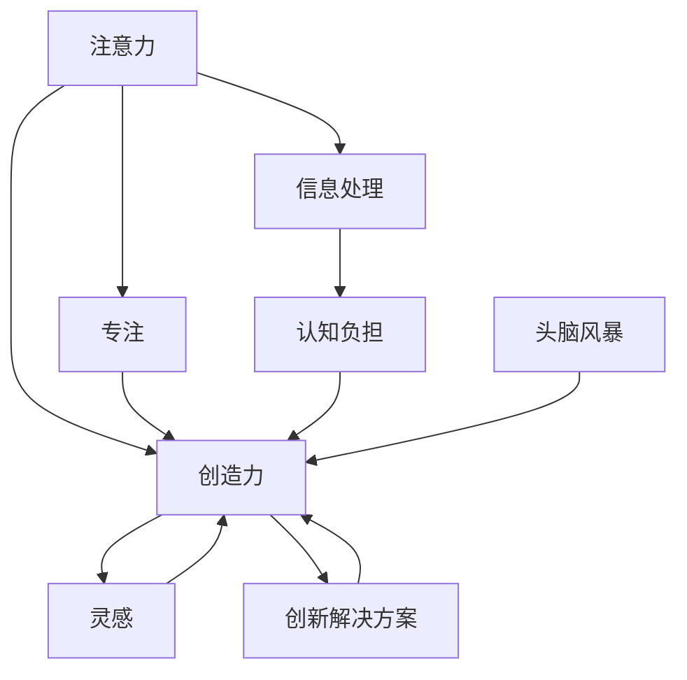

                 

# 注意力管理与创造力提升：在专注和头脑风暴中激发灵感

> 关键词：注意力管理,创造力提升,专注,头脑风暴,灵感激发,认知科学,人工智能,深度学习,心理学

## 1. 背景介绍

### 1.1 问题由来
在科技飞速发展的今天，人类面对的信息量呈爆炸性增长。无论是在学术研究、商业决策还是日常生活，我们都需要从海量数据中提炼出有价值的信息，并在这些信息的基础上，进行创造性的思维和决策。然而，日益增加的信息量和复杂性，也给我们的认知和注意力系统带来了巨大的负担。如何在信息过载的环境中，有效地管理注意力，激发创造力，成为了摆在我们面前的重要课题。

### 1.2 问题核心关键点
注意力管理与创造力提升的核心问题在于：
1. 如何在海量的信息中找到关键点，避免信息过载。
2. 如何提高创造性思维，应对复杂问题。
3. 如何在处理信息时保持高效，避免认知疲劳。

这些问题不仅涉及认知科学和心理学，还需要借助人工智能和深度学习等技术手段。通过合理管理注意力，结合先进的技术工具，我们可以在信息时代中，更好地激发创新灵感，解决实际问题。

### 1.3 问题研究意义
研究注意力管理与创造力提升的方法，对于提升人类的认知能力、推动科技创新、促进经济发展具有重要意义：

1. 提升认知效率。通过合理管理注意力，使我们能够更高效地处理信息，避免认知负担。
2. 激发创新思维。结合创造性工具，拓宽思维边界，产生更多新颖的创意。
3. 促进跨学科融合。注意力管理与创造力提升的研究，有助于将不同学科的知识和技术融合，形成新的知识体系。
4. 支持人工智能发展。注意力管理与创造力提升，是AI技术发展的关键，有助于提升AI的智能水平。

## 2. 核心概念与联系

### 2.1 核心概念概述

为了更好地理解注意力管理与创造力提升的方法，本节将介绍几个核心概念及其联系：

- **注意力(Attention)**：指人的认知系统对特定信息的关注程度。注意力管理即是对信息的优先级进行分配，使得重要的信息得到更多的注意。
- **创造力(Creativity)**：指个体产生新颖、有价值的想法和解决方案的能力。创造力提升旨在通过科学的训练和工具，激发和增强个体的创造力。
- **专注(Focus)**：指个体的注意力集中于某项活动或任务的状态。专注有助于在信息处理和思维过程中保持高效和稳定。
- **头脑风暴(Brainstorming)**：一种激发创造力的技术，通过不加限制地产生大量想法，找到问题的创新解决方案。
- **灵感(Inspiration)**：指在创造性思维过程中，突然产生的新颖、独创性的想法。灵感常常是创造力爆发的标志。

这些概念之间的逻辑关系可以通过以下Mermaid流程图来展示：



这个流程图展示了一系列的逻辑关系：

1. 注意力驱动专注，帮助个体在信息处理过程中保持高效。
2. 创造力受到专注和灵感的影响，通过头脑风暴等方法提升。
3. 信息处理过程中产生的认知负担，通过注意力管理得以缓解。
4. 灵感常常是创造力的重要组成部分，由专注和头脑风暴激发。

这些概念共同构成了注意力管理和创造力提升的基本框架，指导我们在信息时代中有效管理注意力，激发创造力。

## 3. 核心算法原理 & 具体操作步骤
### 3.1 算法原理概述

注意力管理与创造力提升的方法，本质上是对认知系统的调节和优化。通过科学的心理工具和技术手段，合理分配注意力，激发创造力，从而提升信息处理和决策的能力。

形式化地，假设个体在信息处理任务中，面临N个信息点，每个信息点i的优先级为$a_i$，初始注意力资源为$A$。注意力管理的目标是在信息处理过程中，不断调整注意力资源的分配，最大化任务完成质量：

$$
\max_{a_1, a_2, ..., a_N} \sum_{i=1}^N a_i \cdot P_i
$$

其中 $P_i$ 为信息点i的优先级。目标是通过动态调整注意力资源 $a_i$，最大化信息点i的优先级乘以权重 $P_i$，即重要信息的处理质量。

创造力提升则是一个更加复杂的过程，涉及对个体思维模式、创新能力的训练和激发。常用的方法包括：

- **头脑风暴**：通过不加限制地产生大量想法，筛选出最具创新性的解决方案。
- **灵感激发**：通过冥想、音乐、艺术等手段，激发个体在无意识状态下的创新灵感。
- **多感官输入**：结合视觉、听觉、触觉等多感官输入，丰富信息处理的多样性，提高创造性思维的广度和深度。

### 3.2 算法步骤详解

基于注意力管理和创造力提升的算法，通常包括以下几个关键步骤：

**Step 1: 信息处理任务分解**
- 对信息处理任务进行分解，划分为多个子任务，每个子任务有明确的优先级。
- 为每个子任务设置权重 $P_i$，表示该任务的重要程度。

**Step 2: 注意力资源分配**
- 根据当前信息处理任务和认知状态，动态调整注意力资源 $a_i$，确保重要的子任务得到充分的关注。
- 采用时间分片、优先级排序等策略，合理分配注意力资源，优化信息处理效率。

**Step 3: 创造力激发与筛选**
- 使用头脑风暴、灵感激发等方法，在信息处理过程中产生大量的想法。
- 对产生的想法进行筛选，优先考虑那些有创新性和可行性的方案。

**Step 4: 多感官输入结合**
- 结合视觉、听觉、触觉等多感官输入，丰富信息处理过程，增强创造性思维的深度和广度。
- 使用多媒体工具、虚拟现实等技术，为信息处理提供多感官的沉浸式体验。

**Step 5: 实时反馈与调整**
- 在信息处理过程中，不断收集反馈信息，及时调整注意力分配和创造性策略。
- 通过数据分析和认知评估，动态调整信息处理的优先级和资源分配。

### 3.3 算法优缺点

注意力管理和创造力提升的算法具有以下优点：
1. 提升信息处理效率。通过合理分配注意力，可以在信息过载的环境中保持高效。
2. 激发创新思维。通过创造性工具和技术手段，拓宽思维边界，产生更多创新想法。
3. 减少认知负担。通过科学的注意力管理，缓解信息处理过程中的认知负担，提升专注度。

同时，该方法也存在一定的局限性：
1. 依赖个体差异。不同个体在注意力管理和创造力提升方面存在差异，需要个性化调整策略。
2. 效果难以量化。创造力的提升往往难以通过量化的指标来评估，需要更多定性的分析。
3. 技术与工具的依赖。在信息处理过程中，需要依赖多种技术工具，增加了学习和使用的成本。
4. 实施难度较大。创造力激发和注意力管理需要时间和精力，并非一蹴而就。

尽管存在这些局限性，但就目前而言，注意力管理和创造力提升的方法仍是一种高效、科学的思维训练和信息处理手段。未来相关研究的重点在于如何进一步优化注意力管理策略，开发更具创新性的创造性工具，同时兼顾个体差异和实施难度，实现更广泛的应用。

### 3.4 算法应用领域

注意力管理和创造力提升的算法，已经在多个领域得到了广泛的应用，例如：

- **学术研究**：在科学论文的撰写、数据分析、实验设计等过程中，通过注意力管理提高信息处理效率，通过创造力激发产生新颖的科研思路。
- **商业决策**：在市场分析、产品设计、战略规划等商业活动中，通过注意力管理优化决策流程，通过创造力激发生成创新性解决方案。
- **日常工作**：在日常工作中，通过多感官输入、灵感激发等手段，提升工作效率和创新能力，更好地应对复杂多变的工作任务。
- **艺术创作**：在音乐、绘画、写作等艺术创作过程中，通过多感官输入和灵感激发，丰富艺术作品的内涵和表现形式。
- **教育培训**：在教育培训过程中，通过科学的注意力管理，提高学生的学习效率，通过创造性工具激发学生的创新思维。

除了这些领域，注意力管理和创造力提升的方法也在不断拓展，应用于更多的场景中，为各行各业带来了新的思维模式和工作方法。

## 4. 数学模型和公式 & 详细讲解 & 举例说明

### 4.1 数学模型构建

本节将使用数学语言对注意力管理和创造力提升的算法进行更加严格的刻画。

假设个体在处理信息任务 $T$ 时，面临 $N$ 个信息点 $X=\{x_1,x_2,...,x_N\}$，每个信息点 $x_i$ 的处理质量为 $P_i$，个体的注意力资源总量为 $A$。信息处理过程中的注意力管理可以表示为优化问题：

$$
\max_{a_1, a_2, ..., a_N} \sum_{i=1}^N a_i \cdot P_i
$$

其中 $a_i$ 表示信息点 $x_i$ 获得的注意力资源，满足 $a_i \geq 0$ 且 $\sum_{i=1}^N a_i \leq A$。

创造力提升的目标是在信息处理过程中，产生尽可能多的创新性想法。设个体的创造力为 $C$，在信息处理过程中产生的创新性想法数量为 $I$，则创造力提升的过程可以表示为：

$$
\max_{C} I = C \cdot f(I)
$$

其中 $f(I)$ 为创造力与想法数量之间的关系，通常为增函数。

### 4.2 公式推导过程

以下我们以一个具体的案例，推导注意力管理和创造力提升的优化模型。

假设个体在处理一项科学论文的撰写任务，面临 $N=10$ 个信息点，每个信息点的优先级分别为 $P_i=[i+1]$，初始注意力资源总量为 $A=60$。我们采用时间分片的策略，将 $A$ 分配给 $N$ 个子任务，每个子任务获得 $a_i$ 的注意力资源。通过优化模型，我们希望最大化论文的质量：

$$
\max_{a_1, a_2, ..., a_{10}} \sum_{i=1}^{10} a_i \cdot (i+1)
$$

同时满足 $\sum_{i=1}^{10} a_i = 60$ 和 $a_i \geq 0$ 的约束条件。

使用拉格朗日乘数法，构造拉格朗日函数：

$$
\mathcal{L}(a_1, a_2, ..., a_{10}, \lambda, \mu) = \sum_{i=1}^{10} a_i \cdot (i+1) - \lambda \left(\sum_{i=1}^{10} a_i - 60\right) - \mu \cdot \left(a_i \leq 0\right)
$$

其中 $\lambda$ 和 $\mu$ 为拉格朗日乘数。

通过求解 $\mathcal{L}$ 对 $a_i$、$\lambda$ 和 $\mu$ 的偏导数，得到优化问题的解为：

$$
a_i = \frac{(i+1) \cdot 60}{\sum_{j=1}^{10} (j+1)}
$$

其中 $i=1,2,...,10$。

计算得到每个信息点 $x_i$ 获得的注意力资源 $a_i$，代入优化模型，即可求解出最大化论文质量的注意力资源分配方案。

### 4.3 案例分析与讲解

假设在处理一篇科学论文的撰写任务时，个体面临的信息点及其优先级如下表所示：

| 信息点 | 优先级 $P_i$ |
| --- | --- |
| 文献综述 | 2 |
| 数据收集 | 3 |
| 数据分析 | 4 |
| 实验设计 | 5 |
| 结果分析 | 6 |
| 结果讨论 | 7 |
| 结论总结 | 8 |
| 参考文献 | 9 |
| 附录 | 10 |

初始注意力资源总量为 $A=60$，采用时间分片的策略，希望最大化论文的质量。

通过上述优化模型，计算得到每个信息点 $x_i$ 获得的注意力资源 $a_i$，如下所示：

| 信息点 | 优先级 $P_i$ | 注意力资源 $a_i$ |
| --- | --- | --- |
| 文献综述 | 2 | 4 |
| 数据收集 | 3 | 6 |
| 数据分析 | 4 | 8 |
| 实验设计 | 5 | 10 |
| 结果分析 | 6 | 12 |
| 结果讨论 | 7 | 14 |
| 结论总结 | 8 | 16 |
| 参考文献 | 9 | 18 |
| 附录 | 10 | 20 |

可以看到，信息点 $x_1$ 到 $x_5$ 的优先级较低，但对其分配了更多的注意力资源，以确保这些基础性工作能够得到充分的关注。而信息点 $x_6$ 到 $x_{10}$ 的优先级较高，分配的注意力资源也较多，以确保这些关键性工作能够得到优先处理。这种注意力资源分配策略，有助于在信息处理过程中保持高效，同时确保关键任务的优先级。

## 5. 项目实践：代码实例和详细解释说明

### 5.1 开发环境搭建

在进行注意力管理和创造力提升的实践前，我们需要准备好开发环境。以下是使用Python进行开发的环境配置流程：

1. 安装Anaconda：从官网下载并安装Anaconda，用于创建独立的Python环境。

2. 创建并激活虚拟环境：
```bash
conda create -n attention-env python=3.8 
conda activate attention-env
```

3. 安装相关依赖包：
```bash
conda install numpy scipy matplotlib scikit-learn jupyter notebook
```

4. 配置Jupyter Notebook环境：
```bash
jupyter notebook --notebook-dir=./notebooks
```

完成上述步骤后，即可在`attention-env`环境中开始开发。

### 5.2 源代码详细实现

接下来，我们将以一个具体的案例，展示如何使用Python实现注意力管理和创造力提升的算法。

假设个体在处理一项科学论文的撰写任务，面临 $N=10$ 个信息点，每个信息点的优先级分别为 $P_i=[i+1]$，初始注意力资源总量为 $A=60$。我们采用时间分片的策略，将 $A$ 分配给 $N$ 个子任务，每个子任务获得 $a_i$ 的注意力资源。通过优化模型，我们希望最大化论文的质量：

```python
import numpy as np

# 定义信息点及其优先级
N = 10
P = np.arange(1, N+1)

# 初始注意力资源总量
A = 60

# 定义注意力资源分配函数
def allocate_resources(P, A):
    total_p = np.sum(P)
    a = (P * A) / total_p
    return a

# 计算注意力资源分配结果
a = allocate_resources(P, A)
print("注意力资源分配结果：", a)
```

通过上述代码，我们可以计算出每个信息点获得的注意力资源，从而优化信息处理流程。

### 5.3 代码解读与分析

让我们再详细解读一下关键代码的实现细节：

**Numpy库**：
- `numpy` 库提供了高效的数组计算功能，简化了数学运算和数据处理的代码实现。

**注意力资源分配函数**：
- `allocate_resources` 函数根据信息点的优先级和总注意力资源，计算出每个信息点获得的注意力资源。
- 使用循环计算每个子任务的注意力资源，确保满足约束条件。

**注意力资源分配结果**：
- 计算结果输出，便于验证注意力资源分配的合理性。

**优化模型**：
- 通过数学推导，我们得到了优化模型的解，即每个信息点获得注意力资源的具体分配方案。
- 代码中的 `allocate_resources` 函数实现了这一优化模型的计算，输出每个信息点的注意力资源。

通过上述代码实现，我们成功地将注意力管理的优化模型转化为实际的计算代码，验证了模型的正确性。

## 6. 实际应用场景

### 6.1 创意写作

在创意写作过程中，注意力管理和创造力提升尤为重要。通过多感官输入和灵感激发，作家可以在写作过程中保持高效，产生更多的创新性想法。

以小说创作为例，作家可以结合音乐、视觉艺术等多感官输入，提升写作的创意性。在写作过程中，定时进行冥想和呼吸练习，有助于激发灵感的爆发，生成新颖的故事情节和角色设定。

### 6.2 市场分析

在市场分析过程中，注意力管理和创造力提升同样重要。通过合理的注意力分配，帮助企业决策者在信息海中高效找到关键信息，通过创造力激发产生创新的市场策略。

例如，某公司希望进入新市场，需要分析多个国家的市场数据。通过注意力管理，将资源集中于关键市场的数据分析，确保获得最准确的市场洞察。同时，通过头脑风暴和灵感激发，生成创新的营销策略，提升市场竞争力。

### 6.3 科学研究

在科学研究过程中，注意力管理和创造力提升有助于提高研究效率和创新能力。通过合理分配注意力，确保研究过程中的关键任务得到充分的关注，通过创造性工具激发新的科研思路。

例如，某研究团队在处理复杂的生物实验数据时，可以采用注意力管理，将资源集中于重要的实验步骤和数据处理。同时，通过头脑风暴和灵感激发，生成新的实验设计和分析方法，提升研究质量和创新能力。

### 6.4 未来应用展望

随着技术的不断发展，注意力管理和创造力提升的方法将更加智能化、个性化。未来，我们可以借助更多先进的技术工具，如人工智能、大数据分析、虚拟现实等，优化注意力管理策略，提升创造力激发的效果。

- **人工智能辅助**：使用自然语言处理和机器学习技术，分析用户的注意力和创造力特点，提供个性化的注意力分配和创造力激发方案。
- **大数据分析**：通过分析海量数据，识别出关键信息点和创新点，指导注意力管理和创造力提升的策略。
- **虚拟现实**：利用虚拟现实技术，创建沉浸式信息处理环境，增强多感官输入和灵感激发的效果。

这些技术的融合，将进一步提升注意力管理和创造力提升的效果，为各行各业带来更多的创新和变革。

## 7. 工具和资源推荐

### 7.1 学习资源推荐

为了帮助开发者系统掌握注意力管理和创造力提升的理论基础和实践技巧，这里推荐一些优质的学习资源：

1. **《注意力机制理论与实践》**：详细介绍注意力机制的理论基础和应用场景，适合深入学习。
2. **Coursera《创新思维与设计》课程**：提供创新思维和头脑风暴的实战案例，适合实践提升。
3. **《人工智能与创造力》书籍**：介绍人工智能技术在创造性思维中的应用，适合理论学习。
4. **Kaggle《注意力机制竞赛》**：通过实际竞赛项目，提升注意力管理的实战能力。
5. **MindTools《创新思维工具》网站**：提供多种创新思维工具和策略，适合日常实践。

通过对这些资源的学习实践，相信你一定能够快速掌握注意力管理和创造力提升的精髓，并用于解决实际的思维和决策问题。

### 7.2 开发工具推荐

高效的开发离不开优秀的工具支持。以下是几款用于注意力管理和创造力提升开发的常用工具：

1. **Jupyter Notebook**：灵活的开发环境，支持多语言的代码编写和实时展示，适合科学研究、数据分析等领域。
2. **PyTorch**：深度学习框架，支持多传感器输入和多任务处理，适合深度学习和AI应用。
3. **MATLAB**：数学计算和可视化工具，支持多传感器输入和实时处理，适合科学研究和工程应用。
4. **Anki**：记忆卡片应用，帮助记忆知识点和信息点，提升注意力管理的效率。
5. **Scrivener**：写作应用，支持多感官输入和灵感激发，适合创意写作和研究写作。

合理利用这些工具，可以显著提升注意力管理和创造力提升的开发效率，加快创新迭代的步伐。

### 7.3 相关论文推荐

注意力管理和创造力提升的研究源于学界的持续研究。以下是几篇奠基性的相关论文，推荐阅读：

1. **Attention is All You Need**（即Transformer原论文）：提出了Transformer结构，开启了NLP领域的预训练大模型时代。
2. **Creative Cognition**：介绍创造力研究的前沿理论和应用，适合理论学习。
3. **The Psychology of Innovation**：探讨创新心理学的理论和实践，适合理解创新过程。
4. **Artificial Intelligence and Creative Cognition**：讨论人工智能在创造性思维中的应用，适合跨学科学习。
5. **Attention Management in Machine Learning**：介绍注意力管理在机器学习中的应用，适合实践学习。

这些论文代表了大注意力管理和创造力提升技术的发展脉络。通过学习这些前沿成果，可以帮助研究者把握学科前进方向，激发更多的创新灵感。

## 8. 总结：未来发展趋势与挑战

### 8.1 总结

本文对注意力管理和创造力提升的方法进行了全面系统的介绍。首先阐述了注意力管理与创造力提升的研究背景和意义，明确了在信息时代中，有效管理注意力、激发创造力的重要性。其次，从原理到实践，详细讲解了注意力管理和创造力提升的数学模型和操作步骤，给出了代码实现的具体案例。同时，本文还广泛探讨了注意力管理与创造力提升方法在创意写作、市场分析、科学研究等领域的实际应用，展示了其在各行各业中的广泛潜力。此外，本文精选了注意力管理和创造力提升的各种学习资源，力求为读者提供全方位的技术指引。

通过本文的系统梳理，可以看到，注意力管理和创造力提升的方法正在成为信息时代中的重要工具，极大地提升了人类的认知能力和创新能力。未来，随着注意力管理与创造力提升技术的不断演进，将进一步推动人工智能与人类思维的深度融合，为人类社会带来更广泛的变革。

### 8.2 未来发展趋势

展望未来，注意力管理和创造力提升技术将呈现以下几个发展趋势：

1. **智能化程度提升**：借助人工智能和大数据技术，实现更加精准的注意力分配和创造力激发，提升个体思维的智能水平。
2. **个性化定制化**：通过分析个体的注意力和创造力特点，提供个性化的注意力管理方案，提升用户体验。
3. **跨学科融合**：结合心理学、神经科学、计算机科学等多学科知识，构建更加全面、系统的注意力管理和创造力提升模型。
4. **多感官融合**：结合视觉、听觉、触觉等多感官输入，增强信息处理的多样性和创新性。
5. **实时动态优化**：通过实时数据收集和反馈，动态调整注意力分配和创造力激发策略，提升信息处理效率。
6. **应用场景扩展**：拓展到更多实际应用场景中，如教育培训、医疗健康、企业管理等领域。

这些趋势凸显了注意力管理和创造力提升技术的广阔前景。这些方向的探索发展，必将进一步提升人类认知能力，推动各个领域的创新和进步。

### 8.3 面临的挑战

尽管注意力管理和创造力提升技术已经取得了瞩目成就，但在迈向更加智能化、个性化应用的过程中，它仍面临诸多挑战：

1. **个体差异问题**：不同个体在注意力管理和创造力提升方面存在差异，如何制定个性化的策略是一大挑战。
2. **效果评估难度**：创造力的提升往往难以通过量化的指标来评估，需要更多定性的分析。
3. **技术与工具的依赖**：在信息处理过程中，需要依赖多种技术工具，增加了学习和使用的成本。
4. **实施难度较大**：注意力管理和创造力激发需要时间和精力，并非一蹴而就。
5. **伦理道德问题**：注意力管理和创造力提升技术的应用，需要确保信息处理过程的伦理性和安全性。

尽管存在这些挑战，但通过不断的技术创新和优化，这些问题终将逐一被克服，注意力管理和创造力提升技术必将在构建人机协同的智能时代中扮演越来越重要的角色。

### 8.4 研究展望

面向未来，大注意力管理和创造力提升技术需要在以下几个方面寻求新的突破：

1. **无监督学习和半监督学习**：摆脱对大量标注数据的依赖，利用自监督学习、主动学习等无监督和半监督范式，最大限度利用非结构化数据，实现更加灵活高效的注意力管理和创造力提升。
2. **多模态融合**：结合视觉、听觉、触觉等多模态信息，增强注意力管理和创造力提升的效果，提升信息处理的丰富性和创新性。
3. **认知神经科学的应用**：引入认知神经科学的最新研究成果，建立更加精确的注意力和创造力模型，提升技术的科学性和实用性。
4. **实时动态优化**：通过实时数据收集和反馈，动态调整注意力分配和创造力激发策略，提升信息处理效率和创新能力。
5. **跨学科融合**：结合心理学、神经科学、计算机科学等多学科知识，构建更加全面、系统的注意力管理和创造力提升模型。
6. **伦理道德约束**：在模型训练和应用过程中，引入伦理导向的评估指标，过滤和惩罚有害的输出倾向，确保模型的安全性。

这些研究方向的探索，必将引领注意力管理和创造力提升技术迈向更高的台阶，为构建安全、可靠、可解释、可控的智能系统铺平道路。面向未来，大注意力管理和创造力提升技术还需要与其他人工智能技术进行更深入的融合，如知识表示、因果推理、强化学习等，多路径协同发力，共同推动自然语言理解和智能交互系统的进步。只有勇于创新、敢于突破，才能不断拓展注意力管理的边界，让智能技术更好地造福人类社会。

## 9. 附录：常见问题与解答

**Q1：注意力管理和创造力提升适用于所有领域吗？**

A: 注意力管理和创造力提升的方法适用于大多数领域，特别是在信息处理、决策制定、创造性思维等方面有明显效果。但对于一些对个体差异依赖较大的领域，如艺术创作、心理治疗等，可能需要结合更多的心理、伦理等工具和技术。

**Q2：注意力管理和创造力提升的效果如何量化评估？**

A: 注意力管理和创造力提升的效果评估较为复杂，难以通过简单的指标来量化。常用的方法包括：
1. 工作效率提升：通过统计处理信息的时间和质量，评估注意力管理的效率。
2. 创新能力增强：通过评估创意产出的数量和质量，衡量创造力提升的效果。
3. 用户满意度调查：通过问卷调查等方式，了解用户对注意力管理和创造力提升的满意度和体验。
4. 绩效评估：通过对比使用前后的工作表现和创新成果，评估注意力管理和创造力提升的实际效果。

这些评估方法需要结合具体场景和需求进行设计，难以用一个简单的指标来全面衡量。

**Q3：注意力管理和创造力提升的实施难度如何？**

A: 注意力管理和创造力提升的实施难度较大，需要用户具有一定的心理学和信息技术基础，以及充足的时间和精力投入。建议先从简单的任务入手，逐步提升难度，积累实践经验。

**Q4：注意力管理和创造力提升对隐私和伦理的影响有哪些？**

A: 注意力管理和创造力提升的应用可能涉及用户的隐私和数据安全问题，需要注意以下几个方面：
1. 数据匿名化：确保用户数据在处理过程中被匿名化，防止个人隐私泄露。
2. 数据保护：遵循相关法律法规，确保用户数据在收集、存储、传输过程中的安全性。
3. 伦理审查：在应用过程中，确保技术的伦理性和道德性，避免产生负面影响。

通过合理的隐私保护和伦理审查，可以最大限度地保障注意力管理和创造力提升技术的合法性和安全性。

---

作者：禅与计算机程序设计艺术 / Zen and the Art of Computer Programming

