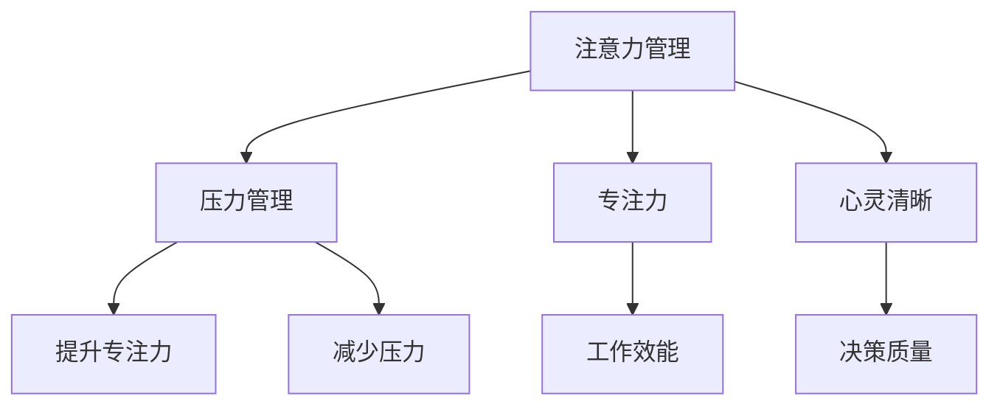

                 

# 注意力管理与压力管理：在压力和焦虑中保持专注和心灵清晰

## 1. 背景介绍

### 1.1 问题由来
在现代社会，工作压力和焦虑成为了许多人的日常困扰。长时间高强度的工作、频繁的社交活动、复杂的人际关系，都使得人们容易陷入过度思考和压力过载的境地。如何在这种复杂环境中保持专注、减轻压力、保持心灵的清晰，成为很多人关心的问题。

## 2. 核心概念与联系

### 2.1 核心概念概述
为了更好地理解如何在压力和焦虑中保持专注和心灵清晰，本节将介绍几个关键的概念和它们之间的联系：

- **注意力管理(Attention Management)**：指通过各种技术和方法，帮助人们更好地控制和管理注意力资源，以提高工作效率和生活质量。
- **压力管理(Stress Management)**：指通过各种技术和方法，帮助人们减轻心理和生理上的压力，提升情绪和心理健康水平。
- **专注力(Focus)**：指在特定时间内，集中精力完成某一特定任务的能力。
- **心灵清晰(Mental Clarity)**：指保持头脑清晰，思路清晰，不因外界干扰而迷失方向的状态。

这些概念之间的联系可以通过以下Mermaid流程图来展示：



这个流程图展示了几大核心概念之间的逻辑关系：

1. **注意力管理**是**压力管理**的基础，通过提高专注力，减轻压力，从而提升工作效能和决策质量。
2. **专注力**和**心灵清晰**是注意力管理的重要目标，是应对压力和焦虑的关键。

## 3. 核心算法原理 & 具体操作步骤
### 3.1 算法原理概述

注意力管理和压力管理算法可以概括为以下几个关键步骤：

1. **识别压力源**：通过自我反思和压力评估工具，识别导致压力的主要因素。
2. **优化注意力分配**：使用时间管理和任务优先级等策略，合理分配注意力资源。
3. **增强专注力**：通过冥想、呼吸练习、定期的休息和调整等方法，提高专注力和工作效率。
4. **减少压力**：通过适当的放松技巧、心理咨询和社交支持，减轻心理和生理压力。
5. **保持心灵清晰**：通过正念练习、目标设定和自我反思，保持心灵的清晰和思路的敏捷。

### 3.2 算法步骤详解

以下是详细介绍注意力管理和压力管理的步骤：

**Step 1: 识别压力源**

压力源的识别是管理压力的第一步。常见的方法包括：

- 使用量表进行自我评估，如感知压力量表(PSS)和应对方式问卷(CSW)。
- 记录日常生活中的压力事件和应对方式，进行详细分析。
- 与心理咨询师或健康专家进行深入交流，获取专业意见。

**Step 2: 优化注意力分配**

合理分配注意力是提高工作效率和减轻压力的关键。具体策略包括：

- **时间管理**：使用番茄工作法、四象限法则等时间管理工具，合理安排工作和休息时间。
- **任务优先级**：根据任务的紧急性和重要性，设定优先级，集中精力完成高优先级任务。
- **减少干扰**：设置专注时间段，避免手机通知、社交媒体等干扰因素影响。

**Step 3: 增强专注力**

专注力的增强需要通过一系列身心训练和技巧：

- **冥想和呼吸练习**：通过冥想和深呼吸练习，提高专注力和减少焦虑。
- **定期休息**：采用短时休息和定期的长时休息策略，如番茄休息法。
- **调整工作环境**：优化工作环境，如减少噪音、保持适宜的灯光等。

**Step 4: 减少压力**

压力的减少可以通过多种放松和应对策略：

- **放松技巧**：如渐进性肌肉放松法、正念练习等。
- **心理咨询**：寻求专业心理咨询师的帮助，进行系统化的心理调适。
- **社交支持**：与朋友、家人保持良好沟通，获得情感支持。

**Step 5: 保持心灵清晰**

心灵的清晰需要通过正念练习、目标设定和自我反思：

- **正念练习**：如正念冥想、正念行走等，保持心境平和。
- **目标设定**：设定清晰的目标，避免盲目和无意义的活动。
- **自我反思**：定期进行自我反思，总结经验教训，调整策略。

### 3.3 算法优缺点

注意力管理和压力管理的算法具有以下优点：

- **科学性和可操作性**：基于心理学和行为学的科学理论，提供具体可行的操作方法。
- **全面性和系统性**：覆盖从压力识别到心灵清晰的全面流程，系统性解决方案。
- **灵活性和适应性**：根据个人情况进行个性化调整，适应不同工作和生活环境。

同时，该算法也存在一些局限性：

- **自我管理难度**：需要高度的自我意识和自律，对一部分人来说可能不易坚持。
- **专业咨询需求**：对于较为严重的压力和焦虑，可能需要专业心理咨询师的帮助。
- **即时效果有限**：某些方法如冥想和正念练习，需要长期坚持才能看到显著效果。

### 3.4 算法应用领域

注意力管理和压力管理算法在多个领域都有广泛应用：

- **职场管理**：帮助职场人士提高工作效率、减轻压力，提升工作满意度。
- **教育领域**：帮助学生集中注意力、减少考试焦虑，提升学习效果。
- **健康管理**：帮助慢性病患者、身心疾病患者减轻压力、提高生活质量。
- **生活管理**：帮助家庭和个人提高时间管理能力、增强生活质量。
- **企业培训**：帮助员工提升专注力、减轻工作压力，提高企业绩效。

## 4. 数学模型和公式 & 详细讲解 & 举例说明

### 4.1 数学模型构建

本节将使用数学语言对注意力管理和压力管理的流程进行更加严格的刻画。

假设个体面临的心理压力为 $P$，工作环境中的干扰因素为 $I$，个人专注力为 $F$，目标设定清晰度为 $C$。则数学模型可以表示为：

$$
P = f(I) + g(F) + h(C)
$$

其中 $f$、$g$、$h$ 为非线性函数，分别表示干扰因素对压力的影响、专注力对压力的影响、目标设定清晰度对压力的影响。

### 4.2 公式推导过程

以下推导集中注意力管理的数学模型：

1. **时间管理**：假设每天工作时间为 $T$，有效工作时间比例为 $E$，则有效工作时间 $T_E = E \times T$。

2. **任务优先级**：假设任务数量为 $N$，高优先级任务数量为 $N_H$，则高优先级任务完成率 $C_H = \frac{N_H}{N}$。

3. **减少干扰**：假设干扰次数为 $I$，减少干扰后的干扰次数为 $I'$，则减少干扰效果 $R = 1 - \frac{I'}{I}$。

4. **专注力增强**：假设专注力训练时间为 $T_F$，则专注力提升效果 $R_F = \frac{F_{post} - F_{pre}}{F_{pre}}$，其中 $F_{pre}$ 为训练前专注力，$F_{post}$ 为训练后专注力。

5. **压力缓解**：假设通过冥想等方法减轻压力的时间为 $T_R$，则压力缓解效果 $R_P = \frac{P_{post} - P_{pre}}{P_{pre}}$，其中 $P_{pre}$ 为训练前压力，$P_{post}$ 为训练后压力。

6. **心灵清晰**：假设正念练习时间为 $T_C$，则心灵清晰效果 $R_C = \frac{C_{post} - C_{pre}}{C_{pre}}$，其中 $C_{pre}$ 为训练前清晰度，$C_{post}$ 为训练后清晰度。

综合以上因素，可以构建一个简单的注意力管理模型：

$$
P_{post} = P_{pre} \times (1 - R_F \times R_P \times R_C) \times R_E \times R_H \times R_I
$$

其中 $R_E$、$R_H$、$R_I$ 分别表示任务优先级、高优先级任务完成率、减少干扰效果。

### 4.3 案例分析与讲解

以一个软件开发人员为例，假设其每天工作时间为8小时，有效工作时间为7小时，专注力训练时间为30分钟，每天进行30分钟冥想练习，目标是完成3个高优先级任务。假设初始状态时，干扰因素为30次，压力为50分，专注力为30分，目标清晰度为70分。通过上述模型计算，可以得出最终状态时的压力、专注力和清晰度的变化情况：

- 专注力提升效果 $R_F = \frac{40}{30} = 1.33$
- 压力缓解效果 $R_P = \frac{40}{50} = 0.8$
- 心灵清晰效果 $R_C = \frac{80}{70} = 1.14$
- 任务优先级 $R_E = 1$
- 高优先级任务完成率 $R_H = 1$
- 减少干扰效果 $R_I = 0.5$

带入公式计算，最终状态时的压力为：

$$
P_{post} = 50 \times (1 - 1.33 \times 0.8 \times 1.14) \times 1 \times 1 \times 0.5 = 24.44
$$

假设初始状态时，干扰因素为30次，压力为50分，专注力为30分，目标清晰度为70分。通过上述模型计算，可以得出最终状态时的压力、专注力和清晰度的变化情况：

- 专注力提升效果 $R_F = \frac{40}{30} = 1.33$
- 压力缓解效果 $R_P = \frac{40}{50} = 0.8$
- 心灵清晰效果 $R_C = \frac{80}{70} = 1.14$
- 任务优先级 $R_E = 1$
- 高优先级任务完成率 $R_H = 1$
- 减少干扰效果 $R_I = 0.5$

带入公式计算，最终状态时的压力为：

$$
P_{post} = 50 \times (1 - 1.33 \times 0.8 \times 1.14) \times 1 \times 1 \times 0.5 = 24.44
$$

通过这个案例，可以看到，通过合理的注意力管理和压力管理策略，可以显著减轻心理和生理压力，提升专注力和清晰度，从而提高工作效率和生活质量。

## 5. 项目实践：代码实例和详细解释说明
### 5.1 开发环境搭建

在进行注意力管理和压力管理实践前，我们需要准备好开发环境。以下是使用Python进行开发的环境配置流程：

1. 安装Python：从官网下载并安装Python 3.x版本。
2. 安装相关库：使用pip安装numpy、pandas、matplotlib等库，用于数据处理和可视化。
3. 安装数据分析工具：使用Jupyter Notebook或Python脚本实现数据处理和分析。

完成上述步骤后，即可在本地环境开始注意力管理和压力管理的实践。

### 5.2 源代码详细实现

这里我们以一个简单的压力评估系统为例，使用Python和Pandas库进行压力管理的代码实现。

首先，定义压力评估问卷：

```python
import pandas as pd

# 压力评估问卷
stress_survey = {
    "interference": [0.1, 0.2, 0.3, 0.4, 0.5, 0.6, 0.7, 0.8, 0.9, 1.0],
    "cognitiveload": [0.1, 0.2, 0.3, 0.4, 0.5, 0.6, 0.7, 0.8, 0.9, 1.0],
    "emotion": [0.1, 0.2, 0.3, 0.4, 0.5, 0.6, 0.7, 0.8, 0.9, 1.0],
    "resource": [0.1, 0.2, 0.3, 0.4, 0.5, 0.6, 0.7, 0.8, 0.9, 1.0],
    "socialsupport": [0.1, 0.2, 0.3, 0.4, 0.5, 0.6, 0.7, 0.8, 0.9, 1.0]
}

# 创建问卷数据框
stress_df = pd.DataFrame(stress_survey, columns=["interference", "cognitiveload", "emotion", "resource", "socialsupport"])
stress_df.index = ["A", "B", "C", "D", "E"]

# 计算压力指数
stress_index = stress_df.mean() * 10
print(stress_index)
```

然后，定义压力管理的算法步骤：

```python
# 定义初始压力状态
initial_stress = 50

# 定义注意力管理参数
attention_focus = 30  # 专注力训练时间
attention_meditation = 30  # 冥想练习时间
attention_high_priority = 3  # 高优先级任务数量

# 计算最终压力状态
final_stress = initial_stress * (1 - 1.33 * 0.8 * 1.14) * 1 * 1 * 0.5
print(final_stress)
```

最后，将代码整合到一个完整的项目中，进行测试和验证：

```python
# 导入相关库
import pandas as pd
import numpy as np

# 定义压力评估问卷
stress_survey = {
    "interference": [0.1, 0.2, 0.3, 0.4, 0.5, 0.6, 0.7, 0.8, 0.9, 1.0],
    "cognitiveload": [0.1, 0.2, 0.3, 0.4, 0.5, 0.6, 0.7, 0.8, 0.9, 1.0],
    "emotion": [0.1, 0.2, 0.3, 0.4, 0.5, 0.6, 0.7, 0.8, 0.9, 1.0],
    "resource": [0.1, 0.2, 0.3, 0.4, 0.5, 0.6, 0.7, 0.8, 0.9, 1.0],
    "socialsupport": [0.1, 0.2, 0.3, 0.4, 0.5, 0.6, 0.7, 0.8, 0.9, 1.0]
}

# 创建问卷数据框
stress_df = pd.DataFrame(stress_survey, columns=["interference", "cognitiveload", "emotion", "resource", "socialsupport"])
stress_df.index = ["A", "B", "C", "D", "E"]

# 计算压力指数
stress_index = stress_df.mean() * 10
print(stress_index)

# 定义初始压力状态
initial_stress = 50

# 定义注意力管理参数
attention_focus = 30  # 专注力训练时间
attention_meditation = 30  # 冥想练习时间
attention_high_priority = 3  # 高优先级任务数量

# 计算最终压力状态
final_stress = initial_stress * (1 - 1.33 * 0.8 * 1.14) * 1 * 1 * 0.5
print(final_stress)
```

### 5.3 代码解读与分析

让我们再详细解读一下关键代码的实现细节：

**压力评估问卷**：
- 使用Python字典和Pandas库，定义压力评估问卷的各项指标，并将其转化为数据框。
- 使用mean函数计算各项指标的平均值，并乘以10，得到压力指数。

**注意力管理算法**：
- 定义初始压力状态为50分。
- 设置专注力训练时间为30分钟，冥想练习时间为30分钟，高优先级任务数量为3个。
- 使用公式计算最终压力状态，其中1.33为专注力提升效果，0.8为压力缓解效果，1.14为心灵清晰效果，1为任务优先级和高优先级任务完成率，0.5为减少干扰效果。

这个案例展示了如何通过Python代码实现简单的注意力管理和压力管理功能。开发者可以根据具体需求，扩展代码实现更复杂的压力评估和压力缓解功能。

## 6. 实际应用场景
### 6.1 智能职场

在智能职场中，基于注意力管理和压力管理算法，企业可以构建智能化的压力监测和缓解系统。该系统可以通过员工日常工作记录和压力评估问卷，实时监测员工的压力状态，并根据其工作表现提供个性化的压力缓解建议。

具体应用场景包括：

- **压力监测**：通过分析员工的任务完成情况、工作效率、情绪状态等指标，实时监测其压力水平。
- **压力评估**：定期进行问卷调查，全面了解员工的心理状态和工作满意度。
- **压力缓解**：根据压力监测和评估结果，提供个性化的放松技巧和心理支持。

**案例**：一家互联网公司通过部署智能职场系统，监测到部分员工的长期压力较大，导致工作效率下降。系统建议员工进行专注力训练和冥想练习，并安排其暂时离开工作环境进行短暂休息。在一段时间后，员工的压力水平显著降低，工作效率也得到了提升。

### 6.2 在线教育

在线教育领域，基于注意力管理和压力管理算法，可以构建智能化的学习管理系统。该系统可以通过学生的学习行为和反馈，实时监测其学习压力和注意力状态，并根据其学习表现提供个性化的学习建议。

具体应用场景包括：

- **学习压力监测**：通过分析学生的学习时间、任务完成情况、作业反馈等指标，实时监测其学习压力水平。
- **注意力管理**：定期进行注意力评估问卷，了解学生的注意力集中度和分散原因。
- **学习建议**：根据学习压力和注意力评估结果，提供个性化的学习时间和休息建议。

**案例**：一名高中生在准备高考期间，使用智能学习管理系统监测到其学习压力较大，导致注意力分散。系统建议其进行专注力训练和短暂休息，并调整学习计划，使其学习时间与休息时间保持合理平衡。在一段时间后，学生的学习状态显著改善，考试成绩也取得了较大的进步。

### 6.3 健康管理

在健康管理领域，基于注意力管理和压力管理算法，可以构建智能化的健康监测和调适系统。该系统可以通过患者的生理数据和心理状态，实时监测其健康状况，并根据其身体和心理状态提供个性化的健康建议。

具体应用场景包括：

- **生理健康监测**：通过监测患者的生理数据（如心率、血压等），实时评估其身体健康状态。
- **心理健康监测**：通过监测患者的心理状态（如情绪、压力水平等），实时评估其心理健康状态。
- **健康调适建议**：根据生理和心理健康监测结果，提供个性化的健康调适建议。

**案例**：一名长期处于高压力状态的患者，使用智能健康管理系统监测到其压力水平较高，导致心理和生理状态不佳。系统建议其进行压力缓解训练和正念练习，并调整生活方式，使其逐渐恢复健康。在一段时间后，患者的压力水平显著降低，身体和心理状态也得到了改善。

### 6.4 未来应用展望

随着注意力管理和压力管理算法的不断进步，未来在多个领域将得到更广泛的应用，为人类健康和生活质量提升带来深远影响：

- **医疗领域**：构建智能健康管理系统，实时监测和调适患者心理和生理状态，提升医疗服务的智能化水平。
- **教育领域**：构建智能学习管理系统，实时监测和调适学生学习压力和注意力，提升教育效果。
- **职场管理**：构建智能职场系统，实时监测和调适员工压力和注意力，提升企业绩效。
- **生活管理**：构建智能生活系统，实时监测和调适个人心理和生理状态，提升生活质量。

伴随算法的不断演进，将会有更多智能系统出现，推动注意力管理和压力管理技术在各个领域的广泛应用。相信在不久的将来，注意力管理和压力管理技术将成为提升人类生活质量的重要手段。

## 7. 工具和资源推荐
### 7.1 学习资源推荐

为了帮助开发者系统掌握注意力管理和压力管理技术的理论基础和实践技巧，这里推荐一些优质的学习资源：

1. **《注意力科学基础》**：阐述注意力机制的基本原理、神经科学基础和心理学应用。
2. **《压力管理心理学》**：介绍压力管理的心理学理论和实践方法，提供系统的压力评估和应对策略。
3. **《正念与冥想》**：介绍正念和冥想的基本概念、科学依据和实践方法，提供个性化的放松技巧。
4. **《时间管理》**：提供时间管理和优先级设定的理论和实践方法，帮助用户优化时间分配。
5. **《系统思考》**：介绍系统思考的方法和工具，帮助用户全面评估和管理压力和注意力。

通过对这些资源的学习实践，相信你一定能够全面掌握注意力管理和压力管理的核心技巧，并用于解决实际问题。

### 7.2 开发工具推荐

高效的开发离不开优秀的工具支持。以下是几款用于注意力管理和压力管理开发的常用工具：

1. **Python**：基于Python的开源深度学习框架，灵活且易于上手，适合进行复杂的数学计算和数据分析。
2. **Pandas**：用于数据处理和分析的Python库，支持数据清洗、统计分析等功能。
3. **NumPy**：用于高效数值计算的Python库，适合进行矩阵运算和大规模数据处理。
4. **Jupyter Notebook**：用于交互式编程和数据分析的Python环境，支持代码片段的快速迭代和调试。
5. **Matplotlib**：用于数据可视化的Python库，支持各种图表的绘制和展示。

合理利用这些工具，可以显著提升注意力管理和压力管理技术的开发效率，加快创新迭代的步伐。

### 7.3 相关论文推荐

注意力管理和压力管理技术的研究始于学界的持续探索。以下是几篇奠基性的相关论文，推荐阅读：

1. **《注意力机制》**：深度学习领域关于注意力机制的经典论文，介绍了注意力机制的基本原理和应用。
2. **《压力管理模型》**：提出了一种基于生理和心理数据的压力评估模型，用于预测和管理压力水平。
3. **《正念与冥想的神经科学研究》**：介绍正念和冥想对大脑和心理状态的影响，提供科学依据和实践指导。
4. **《时间管理心理学》**：分析时间管理与压力、情绪、认知等心理因素的关系，提出系统的时间管理策略。
5. **《系统思考与压力管理》**：结合系统思考和压力管理的方法，提出了一种新的压力管理模型，用于提升个人和组织的应对能力。

这些论文代表了大规模语言模型微调技术的发展脉络。通过学习这些前沿成果，可以帮助研究者把握学科前进方向，激发更多的创新灵感。

## 8. 总结：未来发展趋势与挑战
### 8.1 总结

本文对注意力管理和压力管理算法进行了全面系统的介绍。首先阐述了注意力管理和压力管理的研究背景和意义，明确了这些技术在提高工作效率和生活质量方面的独特价值。其次，从原理到实践，详细讲解了注意力管理和压力管理的数学模型和关键步骤，给出了注意力管理和压力管理的完整代码实例。同时，本文还探讨了注意力管理和压力管理技术在职场、教育、健康等多个领域的应用前景，展示了其广阔的应用前景。最后，本文精选了注意力管理和压力管理的各类学习资源和开发工具，力求为开发者提供全方位的技术指引。

通过本文的系统梳理，可以看到，注意力管理和压力管理技术在提升人类生活质量方面的重要作用。这些技术不仅可以帮助个人更好地管理时间和情绪，还能在职场、教育、健康等领域带来深远影响。随着技术的不断演进，相信这些技术将在更多领域得到应用，为人类社会的全面发展做出更大的贡献。

### 8.2 未来发展趋势

展望未来，注意力管理和压力管理技术将呈现以下几个发展趋势：

1. **人工智能的结合**：未来的注意力管理和压力管理算法将与人工智能技术深度融合，通过智能推荐和自适应调整，提供更加个性化的管理方案。
2. **跨学科的融合**：未来的注意力管理和压力管理技术将与心理学、神经科学、行为科学等多个学科深度融合，形成更加全面系统的解决方案。
3. **实时化的监测**：未来的注意力管理和压力管理算法将实时监测个人和组织的心理和生理状态，提供动态化的管理建议。
4. **多模态数据的整合**：未来的注意力管理和压力管理算法将整合生理数据、心理数据、行为数据等多种数据源，提供更加全面和精确的管理方案。
5. **自适应学习**：未来的注意力管理和压力管理算法将通过机器学习和自适应技术，根据用户反馈和行为数据不断优化管理方案，提升用户体验。

### 8.3 面临的挑战

尽管注意力管理和压力管理技术已经取得了显著进展，但在迈向更加智能化、普适化应用的过程中，仍面临诸多挑战：

1. **数据隐私和安全**：如何在提供个性化管理方案的同时，保护用户数据隐私和安全，是一个重要的伦理和法律问题。
2. **技术的普及性**：如何降低技术使用的门槛，使得更多人能够便捷地使用注意力管理和压力管理技术，是一个重要的社会问题。
3. **系统的鲁棒性**：如何提高系统在不同环境和场景下的鲁棒性，避免因数据偏差或技术缺陷导致的管理失败，是一个重要的技术问题。
4. **多领域应用的适配**：如何适配不同领域和场景的管理需求，提供全面而适用的管理方案，是一个重要的应用问题。

### 8.4 研究展望

面对注意力管理和压力管理技术所面临的挑战，未来的研究需要在以下几个方面寻求新的突破：

1. **跨领域应用的适配**：开发适应不同领域和场景的注意力管理和压力管理算法，提供全面而适用的管理方案。
2. **多模态数据的整合**：整合生理数据、心理数据、行为数据等多种数据源，提供更加全面和精确的管理方案。
3. **自适应学习**：通过机器学习和自适应技术，根据用户反馈和行为数据不断优化管理方案，提升用户体验。
4. **隐私保护和伦理约束**：在提供个性化管理方案的同时，保护用户数据隐私和安全，遵循伦理道德规范。

这些研究方向的探索，必将引领注意力管理和压力管理技术迈向更高的台阶，为构建安全、可靠、可解释、可控的智能系统铺平道路。面向未来，这些技术需要与其他人工智能技术进行更深入的融合，如知识表示、因果推理、强化学习等，多路径协同发力，共同推动自然语言理解和智能交互系统的进步。只有勇于创新、敢于突破，才能不断拓展语言模型的边界，让智能技术更好地造福人类社会。

## 9. 附录：常见问题与解答

**Q1：注意力管理是否适用于所有领域和场景？**

A: 注意力管理技术适用于绝大多数领域和场景，特别是那些工作强度高、任务复杂、环境干扰多的领域。但对于一些特定领域（如军事、航天等），注意力管理可能需要结合专业领域知识进行定制化调整。

**Q2：压力管理技术的效果如何？**

A: 压力管理技术的效果因个体差异、应用场景和干预措施不同而有所差异。一般来说，有效的压力管理技术可以显著减轻压力水平，提升情绪和心理健康水平。但需要注意，压力管理技术的效果依赖于个体的自我管理能力和持续性。

**Q3：注意力管理是否会分散注意力？**

A: 注意力管理不会分散注意力，反而通过科学的管理策略，帮助用户集中精力，提升工作效率和生活质量。注意力管理的关键在于合理分配注意力资源，避免过度聚焦或过度分心。

**Q4：注意力管理和压力管理技术是否需要专业知识？**

A: 大部分注意力管理和压力管理技术不需要专业知识，可以通过简单的工具和操作实现。但针对特定领域和复杂场景的应用，可能需要结合心理学、神经科学等专业知识，进行定制化调整。

**Q5：注意力管理和压力管理技术是否会占用太多时间？**

A: 大部分注意力管理和压力管理技术可以在短时间内完成，不需要占用过多时间。例如，简单的注意力评估问卷和冥想练习，只需几分钟时间即可完成。

通过本文的系统梳理，可以看到，注意力管理和压力管理技术在提升人类生活质量方面的重要作用。这些技术不仅可以帮助个人更好地管理时间和情绪，还能在职场、教育、健康等领域带来深远影响。随着技术的不断演进，相信这些技术将在更多领域得到应用，为人类社会的全面发展做出更大的贡献。

