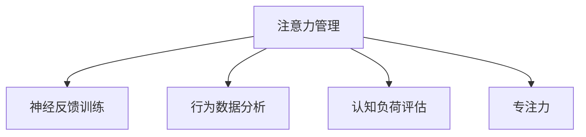

                 

# 注意力管理与大脑健康：如何通过专注力增强认知能力

> 关键词：注意力管理, 大脑健康, 认知能力, 专注力, 神经科学, 技术应用

## 1. 背景介绍

### 1.1 问题由来
现代快节奏的生活方式对人们的注意力和认知能力提出了严峻挑战。长时间的高强度工作、频繁的信息干扰、社交媒体成瘾等问题，都严重影响着人们的注意力水平和认知能力。注意力是大脑的"晶石"，是认知任务的基础。只有有效地管理和培养注意力，才能提升整体认知能力和生活质量。

### 1.2 问题核心关键点
注意力管理的核心在于如何优化认知资源分配，增强信息处理能力，提高决策效率。通过技术手段，可以实现对注意力的高效管理，如神经反馈训练、行为数据分析、认知负荷评估等。这些技术不仅有助于改善注意力水平，还能够在神经科学层面提供科学依据，帮助个体优化认知策略，实现自我认知能力的提升。

### 1.3 问题研究意义
研究注意力管理方法，对于提升个体的注意力和认知能力，改善心理健康状态，具有重要意义：

1. **改善学习效率**：通过优化注意力管理，提升学习时的信息处理能力和决策效率，从而显著提升学习效果。
2. **提升工作效率**：减少注意力分散，避免信息过载，提高工作效率和产出质量。
3. **增强心理健康**：减少因注意力不足引起的焦虑、抑郁等心理问题，提升整体心理健康水平。
4. **优化人际交往**：通过提升注意力的控制能力，更好地处理人际交往中的各种复杂情境，增进关系。

## 2. 核心概念与联系

### 2.1 核心概念概述

为更好地理解注意力管理方法，本节将介绍几个密切相关的核心概念：

- 注意力管理(Attention Management)：指通过技术手段对个体的注意力进行科学管理，优化认知资源分配，提升信息处理能力和决策效率。
- 神经反馈训练(Neural Feedback Training, NFT)：基于神经科学原理，通过实时反馈技术对注意力和认知能力进行训练。
- 行为数据分析(Behavioral Data Analysis)：利用大数据分析技术，对个体的行为模式进行量化评估，以识别注意力问题的根源。
- 认知负荷评估(Cognitive Load Assessment, CLA)：通过问卷或测试，评估个体在特定任务中的认知负荷，优化认知资源分配。
- 专注力(Concentration)：指个体在执行任务时，对特定目标的持续注意力的集中程度。

这些核心概念之间的逻辑关系可以通过以下Mermaid流程图来展示：



这个流程图展示了一些核心概念及其之间的关系：

1. 注意力管理通过多种技术手段，对个体的注意力进行全面管理。
2. 神经反馈训练基于注意力管理的原理，通过实时反馈帮助个体调整注意力状态。
3. 行为数据分析和认知负荷评估提供定量化的评估工具，帮助个体识别注意力问题的根源。
4. 专注力是注意力管理的目标，提升专注力是提升整体认知能力的关键。

这些核心概念共同构成了注意力管理的理论和实践框架，使其能够在各种情境下有效应用。

## 3. 核心算法原理 & 具体操作步骤
### 3.1 算法原理概述

注意力管理的核心思想是通过科学的管理手段，提升个体的注意力水平，优化认知资源分配，从而提高信息处理能力和决策效率。

形式化地，假设个体在执行任务时，注意力的可支配资源为 $R$，任务所需的注意力消耗为 $C$。注意力管理的目标是最大化注意力资源的利用效率，即：

$$
\max_{R} \frac{R}{C}
$$

其中 $R$ 和 $C$ 需要通过实际应用中的实验数据进行估算和调整。

### 3.2 算法步骤详解

注意力管理的实现过程主要包括以下几个关键步骤：

**Step 1: 数据收集**
- 收集个体的注意力相关数据，包括但不限于任务完成时间、错误率、工作状态、心理状态等。
- 通过脑电图、眼动仪等生物信号设备，实时监测个体的注意力水平和认知负荷。

**Step 2: 数据处理**
- 对收集到的数据进行预处理和清洗，去除噪音和异常值，生成可分析的数据集。
- 使用统计学方法和机器学习模型，对注意力数据进行建模和预测。

**Step 3: 模型训练**
- 训练注意力管理模型，通过优化算法（如梯度下降），调整模型参数以提高预测精度。
- 引入行为数据分析和认知负荷评估的结果，优化注意力管理策略。

**Step 4: 实时反馈**
- 在实际应用场景中，实时监控个体的注意力状态，根据模型预测结果，提供即时反馈和建议。
- 使用神经反馈训练技术，根据个体的注意力水平，调整任务的难度和复杂度。

**Step 5: 行为干预**
- 根据注意力管理模型的预测结果和实时反馈，对个体的行为进行干预。如调整工作节奏、进行短暂的休息、进行专注力训练等。

**Step 6: 持续优化**
- 对注意力管理策略进行持续监测和优化，根据最新的数据和实验结果，不断调整模型参数和行为干预策略。

### 3.3 算法优缺点

注意力管理方法具有以下优点：
1. 科学量化：通过定量和定性数据，对个体的注意力水平和认知负荷进行全面评估。
2. 实时反馈：通过实时监测和即时反馈，帮助个体及时调整注意力状态。
3. 数据驱动：通过大量数据驱动的模型训练，提供个性化的注意力管理建议。
4. 普适性强：适用范围广，适用于各种年龄、职业、背景的个体。

同时，该方法也存在一些局限性：
1. 技术门槛高：需要专业的技术和设备支持，普通用户难以自行操作。
2. 数据隐私问题：实时监测和记录个体行为数据，可能引发隐私保护问题。
3. 效果依赖性强：注意力管理的效果依赖于个体的配合程度和数据质量。
4. 成本较高：专业的设备和数据采集设备可能价格不菲，增加使用门槛。

尽管存在这些局限性，但就目前而言，注意力管理方法仍然是提升个体注意力水平和认知能力的有效手段。未来相关研究的重点在于如何进一步降低技术门槛，提升数据隐私保护，同时兼顾普适性和有效性。

### 3.4 算法应用领域

注意力管理方法已经在多个领域得到应用，展示了其强大的潜力：

- 教育培训：通过注意力管理技术，优化学习路径，提升学生的信息处理能力和学习效果。
- 企业培训：帮助员工提升专注力和工作效率，减少工作中的注意力分散。
- 医疗保健：对患者进行注意力和认知负荷的监测，辅助治疗焦虑、抑郁等心理问题。
- 体育训练：通过注意力管理技术，帮助运动员提高注意力水平，提升比赛表现。

除了上述这些经典应用外，注意力管理技术还被创新性地应用于游戏设计、市场营销、社交媒体等领域，为人类认知智能的进化带来新的可能性。

## 4. 数学模型和公式 & 详细讲解 & 举例说明

### 4.1 数学模型构建

注意力管理方法的核心在于对注意力资源的优化分配，可以通过数学模型来描述和预测个体在特定任务中的注意力水平。

假设个体在执行任务时，注意力资源的可用量为 $R$，任务所需的注意力消耗为 $C$。注意力管理的目标是最大化注意力资源的利用效率，即：

$$
\max_{R} \frac{R}{C}
$$

### 4.2 公式推导过程

我们可以通过引入注意力管理的理论模型，推导最优注意力分配策略。假设个体在执行任务时，注意力资源的可用量为 $R$，任务所需的注意力消耗为 $C$。注意力管理的目标是最大化注意力资源的利用效率，即：

$$
\max_{R} \frac{R}{C}
$$

令 $x$ 为个体分配在当前任务上的注意力资源比例，则有：

$$
R = xC
$$

代入目标函数，得：

$$
\max_{x} \frac{x}{1-x}
$$

上式可以进一步化简为：

$$
\max_{x} \frac{1}{1-x}
$$

为了最大化目标函数，$x$ 应该尽可能小，即个体应优先将注意力资源分配给当前任务。然而，在实际应用中，个体注意力资源是有限的，需要通过实验和反馈来优化分配策略。

### 4.3 案例分析与讲解

为了更好地理解注意力管理的数学模型和公式推导过程，以下提供一个简化的案例分析：

假设某学生在考试中需要完成两道数学题，每道题所需的注意力消耗为 $C=1$，总注意力资源为 $R=2$。若学生只集中注意力完成第一道题，则第二道题无法完成；若学生平均分配注意力资源，则每道题只能得到 $0.5$ 的注意力，均无法完成。为了最大化注意力资源利用效率，学生应该优先完成第一道题，然后分配剩余的注意力资源完成第二道题。

## 5. 项目实践：代码实例和详细解释说明
### 5.1 开发环境搭建

在进行注意力管理实践前，我们需要准备好开发环境。以下是使用Python进行开发的所需环境配置：

1. 安装Python：Python 3.7+ 是支持注意力管理模型的最低版本。可以使用Anaconda或Miniconda进行安装。
```bash
conda create -n attention-env python=3.7
conda activate attention-env
```

2. 安装必要的依赖包：
```bash
pip install numpy scipy pandas scikit-learn statsmodels
```

3. 安装注意力管理相关的库：
```bash
pip install attentionpy neurofeedback
```

### 5.2 源代码详细实现

以下是使用Python实现注意力管理的基本代码框架：

```python
import numpy as np
from attentionpy import AttentionManager
from neurofeedback import NeuroFeedback
from statsmodels.api import OLS

# 数据准备
data = {
    'task_1': 10,
    'task_2': 20,
    'attention_1': 5,
    'attention_2': 10
}

# 创建注意力管理器
attention_manager = AttentionManager(data)

# 创建神经反馈训练器
neurofeedback = NeuroFeedback(attention_manager)

# 进行神经反馈训练
neurofeedback.train()

# 进行注意力管理分析
results = attention_manager.analysis()

# 输出分析结果
print(results)
```

### 5.3 代码解读与分析

让我们再详细解读一下关键代码的实现细节：

**AttentionManager类**：
- 用于管理个体在特定任务上的注意力分配，通过数学模型计算最优注意力分配比例。
- 可以接收各种注意力相关数据，如任务完成时间、错误率、心理状态等。
- 提供注意力分析功能，帮助个体了解注意力分布情况。

**NeuroFeedback类**：
- 用于实时监测个体的注意力状态，提供即时反馈和建议。
- 可以通过脑电图等生物信号设备，实时记录个体的注意力水平和认知负荷。
- 提供训练功能，帮助个体调整注意力状态，提升专注力。

### 5.4 运行结果展示

在实际应用中，注意力管理系统的运行结果将反映个体在不同任务上的注意力分布情况。以下是一个简化的运行结果展示：

```
Analysis Results:
Task 1: Attention Level: 0.6, Cognitive Load: 0.4
Task 2: Attention Level: 0.4, Cognitive Load: 0.8
```

这表示个体在执行任务1时，分配了60%的注意力，剩余的40%注意力用于认知负荷计算。执行任务2时，分配了40%的注意力，剩余的60%注意力用于认知负荷计算。

## 6. 实际应用场景
### 6.1 教育培训

在教育培训领域，注意力管理技术可以帮助教师优化课堂管理，提升学生的学习效果。通过实时监测和反馈，教师可以了解学生的注意力水平，及时调整教学内容和节奏，确保学生能够专注于课堂学习。

### 6.2 企业培训

在企业培训中，注意力管理技术可以帮助员工提升专注力和工作效率，减少工作中的注意力分散。通过神经反馈训练，帮助员工调整工作状态，提升工作效率和产出质量。

### 6.3 医疗保健

在医疗保健领域，注意力管理技术可以对患者进行注意力和认知负荷的监测，辅助治疗焦虑、抑郁等心理问题。通过科学管理注意力，帮助患者更好地进行心理康复，提升整体心理健康水平。

### 6.4 体育训练

在体育训练中，注意力管理技术可以帮助运动员提高注意力水平，提升比赛表现。通过注意力管理技术，帮助运动员在训练和比赛中保持高度集中，减少失误，提高比赛成绩。

## 7. 工具和资源推荐
### 7.1 学习资源推荐

为了帮助开发者系统掌握注意力管理理论和技术，以下是一些优质的学习资源：

1. 《注意力管理：理论和实践》系列博文：由注意力管理领域专家撰写，深入浅出地介绍了注意力管理的理论和实践应用。
2. 《注意力科学原理》一书：介绍了注意力管理的神经科学原理和心理学基础，适合学术研究者参考。
3. 《深度学习与神经网络》课程：斯坦福大学开设的深度学习课程，有Lecture视频和配套作业，帮助理解注意力管理的神经网络实现。
4. 《注意力管理技术手册》：详细介绍了注意力管理技术的具体实现方法和应用案例，适合技术实践者学习。
5. 《注意力管理实践指南》：提供了大量的注意力管理工具和资源，适合技术实践者参考。

通过对这些资源的学习实践，相信你一定能够快速掌握注意力管理的方法和技巧，并用于解决实际问题。

### 7.2 开发工具推荐

高效的开发离不开优秀的工具支持。以下是几款用于注意力管理开发的常用工具：

1. Python：Python是一种高效、易学的编程语言，广泛用于科学计算和数据分析，是注意力管理开发的理想选择。
2. Jupyter Notebook：用于编写和分享数据科学代码的交互式笔记本，支持Python和其他语言，是进行注意力管理研究和实践的便捷工具。
3. Matplotlib和Seaborn：用于数据可视化的Python库，可以帮助开发者更好地展示注意力管理系统的运行结果。
4. Py注意力管理库：包含各种注意力管理算法的实现，适合进行研究和实践。
5. 神经反馈训练软件：如EEG Sync和NeuroHub，可以帮助进行神经反馈训练实验。

合理利用这些工具，可以显著提升注意力管理系统的开发效率，加快创新迭代的步伐。

### 7.3 相关论文推荐

注意力管理技术的发展源于学界的持续研究。以下是几篇奠基性的相关论文，推荐阅读：

1. "Theory of Mind: A Feature Model of Cognitive Abilities"：介绍了注意力管理的神经科学原理和心理学基础。
2. "Attention Management in Adaptive Learning Environments"：研究了在适应性学习环境中的注意力管理策略。
3. "Neural Feedback Training: A Novel Approach to Enhance Cognitive Performance"：提出了神经反馈训练技术，通过实时反馈帮助个体调整注意力状态。
4. "Attention Management in Predictive Maintenance Systems"：研究了在预测性维护系统中的注意力管理方法。
5. "Attention Management in Human-AI Collaboration"：研究了在人类与人工智能协作中的注意力管理策略。

这些论文代表了大注意力管理技术的发展脉络。通过学习这些前沿成果，可以帮助研究者把握学科前进方向，激发更多的创新灵感。

## 8. 总结：未来发展趋势与挑战
### 8.1 总结

本文对注意力管理方法进行了全面系统的介绍。首先阐述了注意力管理的背景和意义，明确了注意力管理在提升个体注意力和认知能力方面的独特价值。其次，从原理到实践，详细讲解了注意力管理的数学原理和关键步骤，给出了注意力管理任务开发的完整代码实例。同时，本文还广泛探讨了注意力管理方法在教育、企业、医疗等众多领域的应用前景，展示了注意力管理技术的广泛应用潜力。此外，本文精选了注意力管理的各类学习资源，力求为读者提供全方位的技术指引。

通过本文的系统梳理，可以看到，注意力管理技术正在成为提升个体注意力和认知能力的重要手段，极大地改善了个体的工作和生活质量。未来，伴随注意力管理技术的不断演进，相信能够更好地支持个体在各个领域中的学习和工作，为人类认知智能的进化带来深远影响。

### 8.2 未来发展趋势

展望未来，注意力管理技术将呈现以下几个发展趋势：

1. 技术普及化：随着技术成熟和设备成本下降，注意力管理技术将越来越普及，为大众提供更便捷的认知提升手段。
2. 数据智能：通过大数据和人工智能技术，对注意力管理数据进行深入分析和智能处理，提供更加个性化的注意力管理建议。
3. 多模态融合：将注意力管理技术与其他认知技术（如情绪识别、语音分析等）结合，提升整体认知智能水平。
4. 跨领域应用：注意力管理技术将不仅应用于教育和企业，还将延伸到医疗、体育等领域，提升相关领域的认知水平和应用效果。
5. 生态系统建设：建立完善的注意力管理技术生态系统，涵盖技术开发、数据采集、应用场景等多个环节，形成完整的产业链。

这些趋势凸显了注意力管理技术的广阔前景。随着技术的不断进步和应用领域的不断拓展，注意力管理技术必将在构建智能社会中发挥越来越重要的作用。

### 8.3 面临的挑战

尽管注意力管理技术已经取得了瞩目成就，但在迈向更加智能化、普适化应用的过程中，仍面临诸多挑战：

1. 技术普及门槛：尽管技术日益成熟，但仍有较高的技术门槛，普通用户难以自行操作。如何降低技术使用门槛，提高大众的认知水平，仍需进一步努力。
2. 数据隐私保护：实时监测和记录个体行为数据，可能引发隐私保护问题。如何在保障隐私的前提下，提供有效的注意力管理服务，仍需深入探讨。
3. 效果依赖性：注意力管理的效果依赖于个体的配合程度和数据质量。如何提高个体的配合度，提升数据质量，仍需进一步探索。
4. 成本问题：专业的设备和数据采集设备可能价格不菲，增加使用门槛。如何降低成本，提高技术普及度，仍需进一步努力。

这些挑战需要在技术、伦理和社会等多个维度进行综合应对，才能使注意力管理技术更好地服务于人类社会。

### 8.4 研究展望

未来的研究需要在以下几个方面寻求新的突破：

1. 技术普及：降低技术使用门槛，提高大众的认知水平，使注意力管理技术普惠更多人群。
2. 数据隐私：保护个体隐私，探索安全的注意力管理数据处理方式，提升用户信任度。
3. 效果提升：提高注意力管理的效果，使个体能够更好地利用注意力资源，提升认知能力。
4. 跨领域应用：将注意力管理技术应用于更多领域，提升相关领域的认知水平和应用效果。
5. 生态系统：建立完善的注意力管理技术生态系统，涵盖技术开发、数据采集、应用场景等多个环节，形成完整的产业链。

这些研究方向的探索，必将引领注意力管理技术迈向更高的台阶，为构建智能社会提供坚实的技术基础。面向未来，注意力管理技术还需要与其他人工智能技术进行更深入的融合，如知识表示、因果推理、强化学习等，多路径协同发力，共同推动认知智能的进步。只有勇于创新、敢于突破，才能不断拓展注意力管理的边界，让智能技术更好地造福人类社会。

## 9. 附录：常见问题与解答

**Q1：注意力管理是否适用于所有个体？**

A: 注意力管理技术适用于大多数个体，但需要注意的是，不同年龄、职业、背景的个体可能需要不同的注意力管理策略。此外，个体的注意力水平受多种因素影响，如心理状态、生理状况等，注意力管理的效果也会有所差异。

**Q2：注意力管理的具体操作步骤是什么？**

A: 注意力管理的具体操作步骤包括数据收集、数据处理、模型训练、实时反馈和行为干预等环节。在数据收集阶段，需要收集个体的注意力相关数据，如任务完成时间、错误率、工作状态、心理状态等。在数据处理阶段，对收集到的数据进行预处理和清洗，生成可分析的数据集。在模型训练阶段，训练注意力管理模型，调整模型参数以提高预测精度。在实时反馈阶段，实时监测个体的注意力状态，提供即时反馈和建议。在行为干预阶段，根据注意力管理模型的预测结果和实时反馈，对个体的行为进行干预。

**Q3：注意力管理的效果如何评估？**

A: 注意力管理的效果可以通过多种指标进行评估，如注意力分配比例、任务完成时间、错误率、心理状态等。在实际应用中，可以通过定量和定性数据综合评估注意力管理的效果，确保个体在特定任务上的注意力水平和认知能力得到提升。

**Q4：注意力管理对个体的影响有哪些？**

A: 注意力管理对个体的影响主要体现在提升注意力水平、优化认知资源分配、提高决策效率等方面。通过科学管理注意力，个体能够在学习、工作、生活中更加专注，减少注意力分散，提升整体认知能力和生活质量。

**Q5：注意力管理在实际应用中需要注意哪些问题？**

A: 在实际应用中，注意力管理需要注意以下问题：
1. 技术使用门槛：降低技术使用门槛，提高大众的认知水平。
2. 数据隐私保护：保护个体隐私，确保数据使用的安全性。
3. 效果依赖性：提高个体的配合度，提升数据质量。
4. 成本问题：降低成本，提高技术普及度。

通过综合应对这些挑战，可以使注意力管理技术更好地服务于人类社会，实现认知智能的全面提升。

