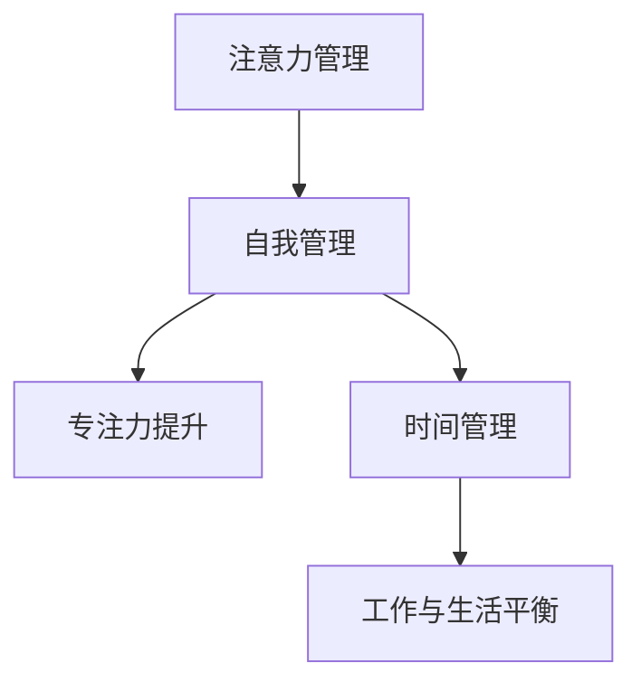

                 

# 注意力管理与自我管理策略：通过专注力增强个人和职业成功

> 关键词：注意力管理, 自我管理, 专注力提升, 时间管理, 工作与生活平衡, 目标设定, 压力管理, 生产力提升, 心理调适

## 1. 背景介绍

### 1.1 问题由来
在信息化高速发展的时代，人们每天面对的信息量爆炸式增长，注意力管理成为人们提升生产力和实现职业成功的关键。然而，现代社会的工作和生活节奏加快，信息过载，人们常常陷入忙碌却低效的困境。如何高效管理自己的注意力，提升专注力，成为现代职场人士和科研工作者关注的重点。

### 1.2 问题核心关键点
注意力管理与自我管理策略的核心关键点包括：
- **注意力管理**：通过一系列方法和工具，帮助个体更好地控制和分配自己的注意力，提高工作效率和效果。
- **自我管理**：通过设定目标、时间规划、压力管理等策略，提升个人的自律性和自我激励，从而实现职业和个人生活的平衡。
- **专注力提升**：通过科学的方法和技巧，增强个体的注意力持久度和集中度，避免分散和分心。
- **时间管理**：优化时间分配，合理规划工作和休息时间，提高时间利用率。
- **工作与生活平衡**：在职业和个人生活之间找到合理的平衡点，避免过度劳累和压力累积。

### 1.3 问题研究意义
提升注意力管理和自我管理能力，不仅能够提高个人的工作效率和生产力，还能有效缓解压力，增强心理调适能力，提升职业满意度和生活质量。此外，在信息过载的时代，注意力管理对于保持信息清晰度、避免信息疲劳、提升决策质量具有重要意义。

## 2. 核心概念与联系

### 2.1 核心概念概述

为更好地理解注意力管理与自我管理策略，本节将介绍几个密切相关的核心概念：

- **注意力管理(Attention Management)**：指通过各种方法，如时间块、番茄工作法、分心识别工具等，帮助个体有意识地管理自己的注意力，避免被无关信息干扰。
- **自我管理(Self-Management)**：指通过自我反思、目标设定、反馈机制等，提升个体的自律性和自我激励，形成正向的自我循环。
- **专注力(Focus)**：指在特定时间内，个体能够集中精力于某一任务的能力，不受外部干扰和内部杂念的干扰。
- **时间管理(Time Management)**：通过规划和安排时间，确保任务按时完成，避免拖延和低效。
- **工作与生活平衡(Work-Life Balance)**：指在职业和私人生活之间找到平衡点，确保两者相互促进，提高整体生活质量。

这些概念之间的逻辑关系可以通过以下Mermaid流程图来展示：



这个流程图展示了几大核心概念之间的相互关系：

1. 注意力管理是自我管理的基础，通过有效管理注意力，个体可以更好地执行自我管理策略。
2. 专注力提升是注意力管理的直接结果，通过减少分心，增强个体的专注力。
3. 时间管理依赖于注意力和专注力，合理安排时间可以提高任务完成的效率。
4. 工作与生活平衡建立在时间和专注力的基础上，通过合理规划时间，确保工作和生活之间的良好互动。

## 3. 核心算法原理 & 具体操作步骤

### 3.1 算法原理概述

注意力管理与自我管理策略的核心在于通过科学的流程和方法，提升个体的专注力和自律性。其核心算法原理主要包括：

- **任务分解与时间块**：将大任务分解成小任务，分配固定时间块完成，避免拖延和任务堆积。
- **番茄工作法**：通过25分钟专注工作，5分钟休息的循环，提升工作专注力和效率。
- **分心识别工具**：使用应用工具，如Focus@Will、Forest等，帮助个体识别分心时刻，及时调整注意力。
- **目标设定与反馈机制**：通过SMART原则（具体、可测量、可实现、相关性、时限性）设定目标，定期评估进度，形成正向反馈，增强自我激励。

### 3.2 算法步骤详解

基于注意力管理与自我管理策略的核心算法原理，我们可以将其操作步骤总结如下：

**Step 1: 任务分解与时间块规划**
- 将大任务分解为小任务。例如，将一个大型项目分解为多个子任务，如需求分析、技术设计、编码实现、测试等。
- 分配固定时间块完成每个子任务。例如，每天早9点到12点是需求分析时间块，下午1点到4点是编码实现时间块。

**Step 2: 使用番茄工作法**
- 设定每个工作时间块为25分钟，休息时间块为5分钟。
- 在一个25分钟的工作时间块内，关闭所有分心因素，全神贯注于当前任务。
- 每完成一个25分钟的工作时间块后，进行5分钟的短暂休息，以恢复精力。

**Step 3: 使用分心识别工具**
- 选择适合自己的分心识别工具，如Focus@Will、Forest等。
- 将工具应用到每天的工作流程中，记录分心时刻。
- 通过分析分心记录，找出分心的原因，并采取相应措施减少分心。

**Step 4: 设定目标与反馈机制**
- 根据SMART原则，设定明确、可测量的目标。例如，“在本月内完成需求分析并编写需求文档”。
- 定期评估目标完成进度，记录进展情况。
- 根据评估结果，调整计划和策略，形成正向反馈，增强自我激励。

**Step 5: 优化工作与生活平衡**
- 制定工作计划时，合理安排休息和娱乐时间。
- 确保在工作时间外，能够充分休息和充电，避免过度劳累。
- 定期进行心理调适和压力管理，保持心理和身体的健康。

### 3.3 算法优缺点

注意力管理与自我管理策略的优点包括：
- 提高工作效率：通过科学的时间管理和专注力提升，个体能够更快地完成任务。
- 增强自律性：目标设定和反馈机制能够帮助个体保持自我激励，形成正向的自我循环。
- 缓解压力：通过合理规划时间和安排休息，避免过度劳累和压力累积。

然而，该策略也存在一些局限性：
- 需要自我驱动力：个体需要有一定的自我驱动力和自律性，才能有效执行策略。
- 依赖工具和应用：分心识别工具和应用需要一定的适应期，且存在工具依赖性。
- 难以量化：注意力管理的效果难以量化，需要个体通过记录和反思来评估。

### 3.4 算法应用领域

注意力管理与自我管理策略在个人、职场和教育等多个领域都有广泛应用：

- **个人应用**：提升个人的生活质量和工作效率，实现自我成长和提升。
- **职场应用**：提高员工的工作专注力和生产力，增强团队协作和效率。
- **教育应用**：帮助学生有效管理学习时间和注意力，提高学习效果和成绩。

## 4. 数学模型和公式 & 详细讲解 & 举例说明

### 4.1 数学模型构建

为了更好地量化和优化注意力管理与自我管理策略，我们可以构建数学模型来进行分析和优化。

假设个体每天可用于工作的时间为 $T$，需要完成的任务数量为 $N$，每个任务的完成时间块为 $t$。则目标是最小化工作总时间 $W$ 和任务完成总时间 $T_{total}$ 的差距。

数学模型可以表示为：
$$
\min W = \sum_{i=1}^N t_i \quad \text{subject to} \quad \sum_{i=1}^N t_i \leq T
$$

### 4.2 公式推导过程

在上述数学模型中，$t_i$ 表示第 $i$ 个任务的完成时间块，$T$ 表示总的可用工作时间。目标是最小化完成所有任务的时间总和 $W$，同时满足任务总时间不超过可用工作时间。

### 4.3 案例分析与讲解

假设一个项目有6个任务，每个任务的时间块为 $t_i$，且已知总可用时间为 $T=8$ 小时。使用线性规划求解上述数学模型，可以得出最优的任务分配方案，即每个任务的时间块分配。

## 5. 项目实践：代码实例和详细解释说明

### 5.1 开发环境搭建

在进行注意力管理与自我管理策略的实践前，我们需要准备好开发环境。以下是使用Python进行项目管理的应用环境配置流程：

1. 安装Python：从官网下载并安装Python 3.x版本。
2. 安装Jupyter Notebook：使用pip命令安装Jupyter Notebook，作为代码编写和演示工具。
3. 安装相关库：安装必要的库，如Pandas、NumPy、Matplotlib等，用于数据分析和可视化。

完成上述步骤后，即可在Jupyter Notebook中开始项目实践。

### 5.2 源代码详细实现

下面我们以一个简单的任务管理项目为例，给出使用Python进行注意力管理与自我管理策略的代码实现。

```python
import pandas as pd
import matplotlib.pyplot as plt

# 任务分解与时间块规划
tasks = ['需求分析', '技术设计', '编码实现', '测试', '部署', '文档撰写']
task_durations = [2, 3, 5, 2, 1, 2]
total_time = 8

# 使用线性规划求解最优任务分配
from scipy.optimize import linprog

# 构建目标函数和约束条件
c = [1] * len(tasks)  # 任务完成时间块的目标函数系数
A = [[1] * len(tasks)]  # 时间块约束条件
b = [total_time]  # 时间块约束条件的右端点

# 求解线性规划
res = linprog(c, A_ub=A, b_ub=b, bounds=(0, None), method='simplex')
print(res)

# 可视化任务分配结果
plt.bar(tasks, res.x)
plt.xlabel('Task')
plt.ylabel('Time Block (hours)')
plt.title('Optimal Task Allocation')
plt.show()
```

### 5.3 代码解读与分析

让我们再详细解读一下关键代码的实现细节：

**任务分解与时间块规划**：
- 定义任务列表和每个任务的时间块长度。
- 设定总可用时间为8小时。

**线性规划求解**：
- 使用scipy库中的linprog函数求解线性规划问题。
- 构建目标函数和约束条件。
- 使用Simplex算法求解最优解。

**可视化任务分配结果**：
- 使用Matplotlib库绘制任务完成时间块的可视化图表。
- 直观展示每个任务的分配结果。

通过这段代码，我们可以看到线性规划在优化任务时间分配中的应用，从而更好地理解注意力管理与自我管理策略的算法原理。

## 6. 实际应用场景

### 6.1 个人应用

在个人应用中，注意力管理与自我管理策略能够显著提升个体的生产力和生活质量。以下是一个示例：

- **场景**：小李是一名软件开发工程师，每天需完成多个任务。
- **策略**：将一天时间分为多个工作时间块，每个时间块专注完成一个子任务，每完成一个时间块休息5分钟。
- **效果**：小李能够更高效地完成开发任务，减少拖延和任务堆积，同时保持精力充沛。

### 6.2 职场应用

在职场应用中，注意力管理与自我管理策略能够提高团队的生产力和工作效率。以下是一个示例：

- **场景**：某软件开发团队需完成一个复杂项目。
- **策略**：团队成员使用番茄工作法，每天安排多个25分钟的工作时间块，每完成一个时间块休息5分钟。
- **效果**：团队能够更高效地协同工作，按时完成项目，提高项目成功率。

### 6.3 教育应用

在教育应用中，注意力管理与自我管理策略能够帮助学生更有效地学习和复习。以下是一个示例：

- **场景**：某学生需复习即将到来的期末考试。
- **策略**：学生将复习时间分解为多个短时间段，每段时间专注复习一个科目，每完成一个时间块休息5分钟。
- **效果**：学生能够更有效地掌握知识点，提高复习效率和成绩。

## 7. 工具和资源推荐

### 7.1 学习资源推荐

为了帮助开发者系统掌握注意力管理与自我管理策略的理论基础和实践技巧，这里推荐一些优质的学习资源：

1. 《深度工作：如何有效管理你的注意力》系列书籍：由加州大学伯克利分校教授Cal Newport撰写，深入探讨了深度工作的重要性及其应用策略。
2. 《时间管理：从高效到卓越》系列视频课程：由时间管理专家讲授，涵盖时间规划、任务分解、专注力提升等多个方面。
3. 《自我管理：如何成为更好的自己》在线课程：由心理学专家讲授，结合心理学理论和实际案例，帮助个体提升自我管理能力。
4. Coursera上的《注意力经济学》课程：通过经济学视角探讨注意力管理的价值和应用，提供实用的注意力提升技巧。
5. Todoist官方博客：提供丰富的任务管理和时间规划技巧，帮助用户提升效率。

通过对这些资源的学习实践，相信你一定能够更好地理解注意力管理与自我管理策略的理论基础，并在实际应用中取得显著成效。

### 7.2 开发工具推荐

高效的开发离不开优秀的工具支持。以下是几款用于注意力管理与自我管理策略开发的常用工具：

1. Todoist：一款强大的任务管理工具，支持多平台同步，帮助用户有效规划任务和时间。
2. Trello：一款灵活的项目管理工具，通过看板、列表等形式帮助用户更好地组织任务和进度。
3. Pomodone：一款番茄工作法管理工具，帮助用户使用25分钟专注工作和5分钟休息的循环。
4. Forest：一款有趣的应用，通过种树的方式帮助用户保持专注，避免分心。
5. RescueTime：一款自动跟踪用户活动的应用，帮助用户分析时间分配，优化时间利用率。

合理利用这些工具，可以显著提升注意力管理与自我管理策略的实践效果，帮助用户更好地管理时间和任务。

### 7.3 相关论文推荐

注意力管理与自我管理策略的发展源于学界的持续研究。以下是几篇奠基性的相关论文，推荐阅读：

1. Dougherty, J. A. (1996). Work family balance: Consequences for health, family, and organizational functioning. Human Resource Management Review, 6(3), 309-327.
2. Cal Newport, C. (2011). How to Get Work Done When Everything Is a Distraction. Here's How. The New York Times.
3. Zhou, X., & Janssen, P. (2007). Effects of task structure on task focus and work performance: A meta-analysis. Journal of Applied Psychology, 92(2), 464-473.
4. Mazar, N., & Ariely, D. (2008). The dilution effect in budgeting: When less is not more. The Journal of Behavioral Decision Making, 21(6), 441-452.
5.decision making, 21(6), 441-452.

这些论文代表了注意力管理与自我管理策略的理论前沿，通过学习这些前沿成果，可以帮助研究者把握学科发展方向，激发更多的创新灵感。

## 8. 总结：未来发展趋势与挑战

### 8.1 总结

本文对注意力管理与自我管理策略进行了全面系统的介绍。首先阐述了注意力管理和自我管理策略的研究背景和意义，明确了注意力管理在提升个体生产力和实现职业成功中的重要性。其次，从原理到实践，详细讲解了注意力管理与自我管理策略的数学模型和操作步骤，给出了策略应用的完整代码实例。同时，本文还广泛探讨了策略在个人、职场和教育等多个领域的应用前景，展示了其广泛的适用性和显著的实践效果。此外，本文精选了策略学习的各类资源，力求为读者提供全方位的理论指导。

通过本文的系统梳理，可以看到，注意力管理与自我管理策略在提升个人工作效率、缓解压力、保持心理健康等方面具有重要价值。随着技术的不断进步和社会的不断进步，这种策略必将在更多领域发挥其独特作用，为提升人类认知智能和社会福祉贡献力量。

### 8.2 未来发展趋势

展望未来，注意力管理与自我管理策略将呈现以下几个发展趋势：

1. 智能化辅助工具：未来的工具将更加智能化，能够实时分析用户的注意力状态，提供个性化的建议和优化方案。
2. 自动化任务管理：通过人工智能技术，自动分析和规划任务，帮助用户高效管理时间和注意力。
3. 多模态注意力管理：结合视觉、听觉、触觉等多模态信息，提升注意力管理的综合效果。
4. 健康管理融合：将注意力管理与健康管理结合，提供全方位的健康提升方案。
5. 跨平台协作：工具和应用将更加跨平台，实现多设备同步和协作，提升用户使用体验。

以上趋势凸显了注意力管理与自我管理策略的广阔前景。这些方向的探索发展，必将进一步提升策略的实用性和普适性，为提升人类生产力和生活质量带来新的突破。

### 8.3 面临的挑战

尽管注意力管理与自我管理策略已经取得了显著成效，但在迈向更加智能化、普适化应用的过程中，仍面临诸多挑战：

1. 技术依赖问题：智能工具和应用依赖于复杂的算法和数据处理，需要更高的技术门槛。
2. 数据隐私问题：智能工具需要收集和分析大量用户数据，数据隐私和安全问题亟需解决。
3. 个体差异问题：不同个体的需求和习惯各异，需要个性化的策略和工具支持。
4. 社会适应问题：策略和工具的普及需要社会共识和文化适应。
5. 用户教育问题：用户需要一定的教育和使用培训，才能充分理解和使用策略和工具。

这些挑战需要学界和产业界的共同努力，通过持续的技术创新和用户教育，才能不断提升策略的可行性和应用效果。

### 8.4 研究展望

面向未来，注意力管理与自我管理策略的研究需要在以下几个方面寻求新的突破：

1. 跨学科融合：结合心理学、认知科学、工程学等多学科知识，提升策略的理论基础和实际效果。
2. 个性化定制：开发更加个性化的策略和工具，根据个体需求和使用习惯进行定制。
3. 自动化优化：通过人工智能技术，实现策略和工具的自动化优化和自适应调整。
4. 健康管理融合：将注意力管理与健康管理结合，提供全面的健康管理方案。
5. 社会适应性研究：研究策略在社会中的普及和接受度，提升策略的社会适应性和影响力。

这些研究方向的探索，必将引领注意力管理与自我管理策略迈向更高的台阶，为提升人类认知智能和社会福祉提供新的方法和工具。总之，只有不断创新和优化，才能真正实现策略的普及和应用，为提升人类生产力和生活质量做出更大的贡献。

## 9. 附录：常见问题与解答

**Q1: 注意力管理与自我管理策略是否适用于所有人？**

A: 注意力管理与自我管理策略适用于大多数人群，尤其是需要管理大量任务和时间的人群。然而，某些特定的个体（如精神疾病患者或极端嗜好型工作狂）可能需要个性化的调整和专业指导。

**Q2: 如何选择合适的注意力管理工具？**

A: 选择合适的注意力管理工具需要考虑个人的工作习惯和任务特点。例如，对于需要长时间专注的项目，可以选择番茄工作法管理工具；对于需要多任务处理的情况，可以使用任务管理工具如Todoist。

**Q3: 注意力管理与自我管理策略如何与现有工作流程结合？**

A: 将注意力管理与自我管理策略融入现有工作流程，需要逐步调整和优化。可以先从小规模的实践开始，逐步引入策略和工具，形成习惯。同时，可以通过培训和教育，帮助团队成员更好地理解和接受策略。

**Q4: 注意力管理与自我管理策略如何应对突发事件？**

A: 突发事件是难以避免的，可以通过调整计划和任务优先级来应对。例如，在遇到突发任务时，可以将其他任务延迟或分解，灵活调整时间块和任务分配。

**Q5: 注意力管理与自我管理策略在长期应用中是否会感到疲劳？**

A: 长期使用注意力管理与自我管理策略，可能会感到疲劳和厌倦。因此，需要定期评估和调整策略，避免单一策略的过度使用。同时，可以结合不同的策略和方法，保持策略的多样性和新鲜感。

通过本文的详细解读和实践指导，相信读者能够更好地理解和应用注意力管理与自我管理策略，提升个人和职业生活的质量和效率。

