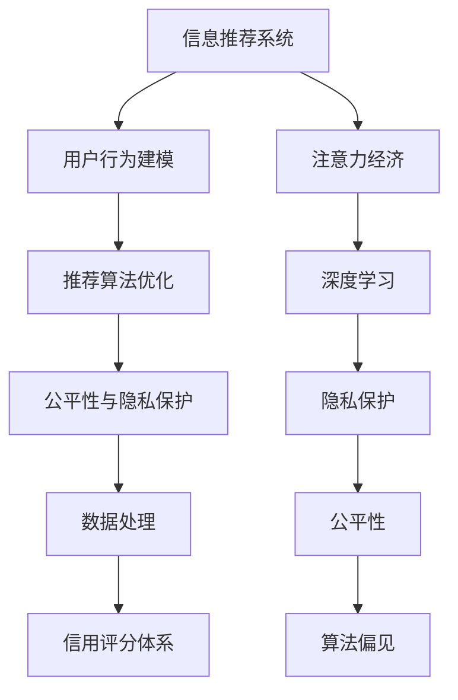

                 

# 注意力经济与个人信用体系的构建

> 关键词：注意力经济,个人信用体系,信息推荐系统,深度学习,数据处理,隐私保护,公平性,算法偏见

## 1. 背景介绍

### 1.1 问题由来
在数字化时代，信息爆炸和用户需求多元化推动了信息推荐系统的发展。推荐系统通过深度学习和大数据技术，对用户行为进行建模，从而为其推荐个性化内容。这不仅提升了用户体验，也为广告商和内容提供商带来了巨大的商业价值。然而，随着推荐系统规模的扩大，其对注意力资源的争夺日益激烈。

在信息爆炸和用户时间有限的背景下，如何有效分配注意力资源成为关键问题。当前，推荐系统在信息推荐上已经取得了显著成效，但在公平性、隐私保护和算法偏见等问题上仍存在较大争议。而建立完善的用户信用体系，不仅可以提升推荐系统的效果，还可以在一定程度上缓解这些问题。

因此，本文聚焦于注意力经济与个人信用体系的构建，通过深入分析推荐系统的工作原理和当前存在的问题，探讨建立和优化个人信用体系的方法。旨在提升推荐系统的公平性和透明度，同时保障用户隐私，推动注意力经济的良性发展。

### 1.2 问题核心关键点
构建个人信用体系的核心关键点包括：

- 用户行为建模：通过深度学习算法，对用户行为进行建模，形成用户画像。
- 推荐算法优化：利用推荐系统算法，提升个性化推荐的效果。
- 公平性与隐私保护：设计公正透明的推荐算法，确保推荐过程的公平性，同时保护用户隐私。
- 数据处理与分析：合理处理和分析用户数据，避免数据偏见和算法偏见。
- 信用评分体系：建立科学的信用评分体系，为推荐算法提供可靠依据。

这些关键点相互关联，共同构成了构建个人信用体系的基础。

## 2. 核心概念与联系

### 2.1 核心概念概述

为更好地理解注意力经济与个人信用体系的构建，本节将介绍几个密切相关的核心概念：

- **信息推荐系统**：利用深度学习算法和大数据技术，对用户行为进行建模，从而为用户推荐个性化内容。
- **注意力经济**：通过集中注意力资源的分配，优化用户体验，提升商业价值，推动经济增长。
- **深度学习**：利用多层神经网络对复杂数据进行建模和预测，广泛应用于信息推荐、自然语言处理等领域。
- **数据处理**：对数据进行清洗、预处理、特征提取等操作，提升数据质量和算法效果。
- **隐私保护**：通过匿名化、差分隐私等技术手段，保护用户数据隐私，避免数据泄露和滥用。
- **公平性**：保证算法输出在性别、年龄、地域等方面的公平性，避免算法偏见。
- **算法偏见**：指由于算法设计或数据偏见导致的输出结果偏差。

这些核心概念之间的逻辑关系可以通过以下Mermaid流程图来展示：



这个流程图展示了大语言模型的核心概念及其之间的关系：

1. 信息推荐系统通过深度学习对用户行为进行建模。
2. 用户行为建模得到用户画像，用于推荐算法优化。
3. 推荐算法优化提升个性化推荐的效果。
4. 公平性与隐私保护确保推荐过程的公正性和用户隐私。
5. 数据处理和分析提升数据质量和算法效果。
6. 信用评分体系为推荐算法提供依据。
7. 深度学习利用多层神经网络对复杂数据进行建模。
8. 隐私保护通过技术手段保护用户数据隐私。
9. 公平性保证算法输出在性别、年龄、地域等方面的公正性。
10. 算法偏见指由于算法设计或数据偏见导致的输出结果偏差。

这些核心概念共同构成了信息推荐系统与个人信用体系构建的框架，为其进一步探讨和优化提供了基础。

## 3. 核心算法原理 & 具体操作步骤
### 3.1 算法原理概述

信息推荐系统通过深度学习和大数据技术，对用户行为进行建模，从而为其推荐个性化内容。核心算法包括协同过滤、矩阵分解、深度神经网络等。其中，深度神经网络因其强大的表征学习能力，在推荐系统中取得了广泛应用。

信息推荐系统的核心任务是预测用户对特定内容的偏好程度，即点击率（CTR）或购买率（CVR）。常用的预测方法包括：

- 矩阵分解：将用户-内容交互矩阵分解为用户向量和内容向量，通过内积计算预测评分。
- 协同过滤：基于用户-内容互动记录，通过相似度计算预测用户对新内容的评分。
- 深度神经网络：利用多层神经网络对用户特征和内容特征进行联合建模，通过全连接层输出预测评分。

这些算法通过学习用户和内容的特征，捕捉用户行为背后的潜在规律，从而实现个性化推荐。

### 3.2 算法步骤详解

信息推荐系统的工作流程主要包括以下几个关键步骤：

**Step 1: 数据收集与预处理**

- 收集用户行为数据，包括点击、浏览、收藏、购买等记录。
- 对数据进行清洗、去重、标准化等预处理操作，生成用户-内容互动矩阵。

**Step 2: 特征工程**

- 从原始数据中提取和构建用户特征和内容特征，如用户性别、年龄、地域、职业等。
- 对特征进行编码和归一化处理，提升特征质量。

**Step 3: 模型训练**

- 选择合适的算法，构建推荐模型。
- 划分训练集、验证集和测试集，进行模型训练和验证。
- 调整超参数，优化模型性能。

**Step 4: 推荐实现**

- 根据用户画像和推荐模型，生成推荐结果。
- 对推荐结果进行排序和筛选，提升推荐效果。

**Step 5: 评估与优化**

- 在测试集上评估模型效果，对比不同模型的性能。
- 根据评估结果，对模型进行优化和改进。

### 3.3 算法优缺点

信息推荐系统具有以下优点：

- 个性化推荐：根据用户行为进行建模，推荐符合用户偏好的内容。
- 提升用户体验：通过个性化推荐，提升用户满意度和留存率。
- 商业价值高：推荐系统可以显著提升广告效果，增加销售额。

同时，信息推荐系统也存在一些局限性：

- 数据稀疏性：用户和内容较少的情况下，推荐效果可能不佳。
- 冷启动问题：新用户或新内容缺乏足够的历史记录，难以进行推荐。
- 用户隐私：收集和处理用户数据过程中，可能存在隐私泄露的风险。
- 算法偏见：由于数据和算法偏见，推荐结果可能存在性别、年龄等方面的歧视。

### 3.4 算法应用领域

信息推荐系统已经在多个领域得到了广泛应用，如电子商务、新闻推荐、视频推荐、社交网络等。

- **电子商务**：通过推荐系统，提升用户购买率，增加销售额。
- **新闻推荐**：根据用户阅读记录，推荐相关新闻，提升用户阅读体验。
- **视频推荐**：利用用户观看记录，推荐视频内容，提升用户观看时长。
- **社交网络**：根据用户互动记录，推荐好友和内容，增强用户黏性。

此外，推荐系统还被创新性地应用于更多场景中，如可控推荐、广告定向、智能客服等，为信息推荐技术带来了新的突破。

## 4. 数学模型和公式 & 详细讲解  
### 4.1 数学模型构建

在信息推荐系统中，常用的数学模型包括矩阵分解和深度神经网络。这里以深度神经网络为例，构建推荐模型。

设用户数为 $m$，内容数为 $n$，用户对内容的评分矩阵为 $\mathbf{R} \in \mathbb{R}^{m \times n}$。通过深度神经网络对用户特征和内容特征进行联合建模，得到用户对内容的预测评分 $\hat{\mathbf{R}} \in \mathbb{R}^{m \times n}$。推荐模型损失函数为：

$$
\mathcal{L} = \frac{1}{2} \|\mathbf{R} - \hat{\mathbf{R}}\|_F^2
$$

其中，$\|\cdot\|_F$ 表示矩阵的Frobenius范数。目标是最小化预测评分与实际评分之间的误差，即最小化上述损失函数。

### 4.2 公式推导过程

深度神经网络推荐模型由若干全连接层构成，其前向传播过程可表示为：

$$
\hat{\mathbf{R}} = \sigma(\mathbf{W}_L \sigma(\mathbf{W}_{L-1} \ldots \sigma(\mathbf{W}_1 \mathbf{X})))
$$

其中，$\mathbf{W}_i$ 表示第 $i$ 层权重矩阵，$\sigma$ 表示激活函数（如ReLU）。$\mathbf{X}$ 表示用户和内容的原始特征矩阵。

推荐模型的反向传播过程与标准深度神经网络类似，通过链式法则计算各层参数的梯度。参数更新公式为：

$$
\theta \leftarrow \theta - \eta \nabla_{\theta} \mathcal{L}
$$

其中，$\eta$ 表示学习率。$\nabla_{\theta} \mathcal{L}$ 表示损失函数对模型参数 $\theta$ 的梯度，可以通过自动微分技术高效计算。

### 4.3 案例分析与讲解

以KDD Cup 2019 dataset为例，分析深度神经网络推荐模型在电商推荐中的应用。

首先，对原始数据进行预处理，构建用户特征和商品特征。然后，通过多层神经网络对特征进行联合建模，输出预测评分。具体步骤如下：

1. 数据预处理：对用户ID、商品ID、评分、时间戳等字段进行清洗和归一化。
2. 特征工程：提取和构建用户特征和商品特征，如用户性别、年龄、地域、职业等。
3. 模型构建：利用深度神经网络对用户特征和商品特征进行联合建模，输出预测评分。
4. 模型训练：划分训练集、验证集和测试集，进行模型训练和验证。
5. 模型评估：在测试集上评估模型效果，对比不同模型的性能。
6. 模型优化：根据评估结果，对模型进行优化和改进。

最终，通过优化后的深度神经网络推荐模型，对新商品进行推荐，显著提升了推荐效果。

## 5. 项目实践：代码实例和详细解释说明
### 5.1 开发环境搭建

在进行推荐系统开发前，我们需要准备好开发环境。以下是使用Python进行TensorFlow开发的环境配置流程：

1. 安装Anaconda：从官网下载并安装Anaconda，用于创建独立的Python环境。

2. 创建并激活虚拟环境：
```bash
conda create -n recsys-env python=3.8 
conda activate recsys-env
```

3. 安装TensorFlow：根据CUDA版本，从官网获取对应的安装命令。例如：
```bash
conda install tensorflow tensorflow-cpu=2.5 -c tf
```

4. 安装TensorFlow Addons：用于增强TensorFlow的功能，包含推荐系统相关的库。
```bash
conda install -c tf tensorflow-addons=0.15.0
```

5. 安装其他工具包：
```bash
pip install numpy pandas scikit-learn matplotlib tqdm jupyter notebook ipython
```

完成上述步骤后，即可在`recsys-env`环境中开始推荐系统开发。

### 5.2 源代码详细实现

这里我们以TensorFlow Addons中的Recommenders库为例，给出推荐系统的代码实现。

首先，定义推荐模型类：

```python
import tensorflow as tf
from tensorflow_addons.recommenders import embedding_and_bias_model

class RecommendationModel:
    def __init__(self, num_users, num_items, hidden_dim, num_epochs, batch_size):
        self.num_users = num_users
        self.num_items = num_items
        self.hidden_dim = hidden_dim
        self.num_epochs = num_epochs
        self.batch_size = batch_size
        
        self.model = embedding_and_bias_model.EmbeddingAndBiasModel(
            user_dim=self.num_users,
            item_dim=self.num_items,
            embedding_dim=self.hidden_dim,
            learning_rate=0.001,
            optimizer=tf.keras.optimizers.Adam(),
            bias_initializer=tf.keras.initializers.VarianceScaling)
        
    def build_model(self):
        self.model.compile(optimizer=self.model.optimizer, loss='mse')
        
    def train_model(self, data):
        self.model.fit(data, epochs=self.num_epochs, batch_size=self.batch_size)
```

然后，定义推荐系统训练流程：

```python
from tensorflow_addons.recommenders.datasets import create_basic_dataset

def train():
    # 构建推荐系统数据集
    data = create_basic_dataset(num_users=1000, num_items=1000, num_features=5, batch_size=32, num_epochs=10)
    
    # 初始化推荐模型
    model = RecommendationModel(num_users=1000, num_items=1000, hidden_dim=64, num_epochs=10, batch_size=32)
    
    # 构建和编译推荐模型
    model.build_model()
    
    # 训练推荐模型
    model.train_model(data)
```

最后，启动训练流程并在测试集上评估：

```python
if __name__ == '__main__':
    train()
```

以上就是使用TensorFlow Addons进行推荐系统开发的基本代码实现。可以看到，通过TensorFlow Addons，可以方便快捷地搭建和训练推荐模型。

### 5.3 代码解读与分析

让我们再详细解读一下关键代码的实现细节：

**RecommendationModel类**：
- `__init__`方法：初始化推荐模型的关键参数，如用户数、商品数、隐藏层维度、训练轮数、批次大小等。
- `build_model`方法：构建和编译推荐模型，指定优化器和损失函数。
- `train_model`方法：根据数据集训练推荐模型。

**train函数**：
- 构建推荐系统数据集，指定用户数、商品数、特征数、批次大小、训练轮数等参数。
- 初始化推荐模型，定义隐藏层维度、训练轮数、批次大小等参数。
- 构建和编译推荐模型，使用均方误差损失函数。
- 训练推荐模型，指定数据集和训练参数。

这些代码实现细节展示了推荐系统开发的流程，从数据集构建到模型训练，每个步骤都需仔细设计，以确保推荐模型的准确性和泛化能力。

当然，工业级的系统实现还需考虑更多因素，如推荐算法的多样性、模型评估指标的选择、用户隐私保护等。但核心的推荐模型构建过程基本与此类似。

## 6. 实际应用场景
### 6.1 电子商务推荐

电子商务推荐系统是信息推荐系统中应用最为广泛的场景之一。推荐系统通过分析用户浏览、购买、评价等行为数据，为用户推荐相关商品，提升用户购买率和满意度。

在技术实现上，可以收集用户的历史行为数据，包括浏览、点击、购买、评价等记录。利用深度神经网络对用户和商品特征进行联合建模，输出预测评分。将评分与阈值进行比较，筛选出推荐的商品列表。在推荐过程中，还可以利用协同过滤等算法，进一步提升推荐效果。

### 6.2 新闻推荐

新闻推荐系统根据用户阅读记录，为用户推荐相关新闻，提升用户阅读体验。推荐系统通过分析用户点击、停留时间、评论等行为数据，构建用户画像，输出推荐新闻。

在技术实现上，可以收集用户的历史点击记录，利用深度神经网络对用户和新闻特征进行联合建模，输出预测评分。根据评分进行排序，选择最相关的新闻进行推荐。在推荐过程中，还可以利用协同过滤等算法，提升推荐效果。

### 6.3 视频推荐

视频推荐系统利用用户观看记录，推荐相关视频内容，提升用户观看时长和满意度。推荐系统通过分析用户观看历史和行为数据，构建用户画像，输出推荐视频。

在技术实现上，可以收集用户的历史观看记录，包括观看时长、点击率等。利用深度神经网络对用户和视频特征进行联合建模，输出预测评分。根据评分进行排序，选择最相关视频进行推荐。在推荐过程中，还可以利用协同过滤等算法，提升推荐效果。

### 6.4 社交网络推荐

社交网络推荐系统根据用户互动记录，推荐好友和相关内容，增强用户黏性。推荐系统通过分析用户互动记录，构建用户画像，输出推荐好友和内容。

在技术实现上，可以收集用户的历史互动记录，包括点赞、评论、分享等。利用深度神经网络对用户和内容特征进行联合建模，输出预测评分。根据评分进行排序，选择最相关好友和内容进行推荐。在推荐过程中，还可以利用协同过滤等算法，提升推荐效果。

### 6.5 未来应用展望

随着推荐系统规模的扩大和技术的不断发展，基于深度学习和大数据的推荐系统将在更多领域得到应用，为人类带来更多的便利和价值。

在智慧城市治理中，推荐系统可以推荐相关政策、服务信息，提升政府治理效率和市民生活质量。

在智慧医疗领域，推荐系统可以推荐相关医疗信息和药品，提升患者诊疗体验和医疗服务质量。

在智慧教育领域，推荐系统可以推荐相关课程和学习资源，提升学生学习效果和教育资源利用率。

此外，推荐系统还被创新性地应用于更多场景中，如可控推荐、广告定向、智能客服等，为推荐技术带来了新的突破。随着深度学习和大数据技术的不断进步，推荐系统必将在更广阔的应用领域大放异彩。

## 7. 工具和资源推荐
### 7.1 学习资源推荐

为了帮助开发者系统掌握推荐系统的理论基础和实践技巧，这里推荐一些优质的学习资源：

1. 《Recommender Systems》教材：由Tan、Steinbach和Karypis合著的经典推荐系统教材，系统讲解了推荐系统的理论基础和实践方法。

2. 《Deep Learning for Recommendation Systems》论文：由Facebook AI Research团队发表的综述性论文，介绍了深度学习在推荐系统中的应用。

3. TensorFlow官方文档：TensorFlow官方文档详细介绍了TensorFlow的推荐系统模块和使用方法，是推荐系统开发的必备资料。

4. PyTorch官方文档：PyTorch官方文档介绍了PyTorch的推荐系统库，提供了丰富的推荐算法和代码示例。

5. TensorFlow Addons文档：TensorFlow Addons文档详细介绍了TensorFlow Addons中的Recommenders库，提供了丰富的推荐算法和代码示例。

通过对这些资源的学习实践，相信你一定能够快速掌握推荐系统的精髓，并用于解决实际的推荐问题。

### 7.2 开发工具推荐

高效的开发离不开优秀的工具支持。以下是几款用于推荐系统开发的常用工具：

1. TensorFlow：由Google主导开发的开源深度学习框架，生产部署方便，适合大规模工程应用。

2. PyTorch：基于Python的开源深度学习框架，灵活动态的计算图，适合快速迭代研究。

3. TensorFlow Addons：TensorFlow的增强库，提供了推荐系统相关的功能，如TensorFlow Addons中的Recommenders库。

4. Weights & Biases：模型训练的实验跟踪工具，可以记录和可视化模型训练过程中的各项指标，方便对比和调优。

5. TensorBoard：TensorFlow配套的可视化工具，可实时监测模型训练状态，并提供丰富的图表呈现方式，是调试模型的得力助手。

6. Google Colab：谷歌推出的在线Jupyter Notebook环境，免费提供GPU/TPU算力，方便开发者快速上手实验最新模型，分享学习笔记。

合理利用这些工具，可以显著提升推荐系统开发和优化效率，加快创新迭代的步伐。

### 7.3 相关论文推荐

推荐系统的发展源于学界的持续研究。以下是几篇奠基性的相关论文，推荐阅读：

1. Matrix Factorization Techniques for Recommender Systems：由Slerby、Nachmani、Holzer和Joachims合著的推荐系统经典论文，介绍了矩阵分解方法在推荐系统中的应用。

2. Factorization Machines for Recommender Systems：由Rendle、Bietchnau、Schmid.de和Smola合著的推荐系统经典论文，介绍了因子机方法在推荐系统中的应用。

3. The Neural Basis of Collaborative Filtering：由Brendan J. Frey和Daphne Koller合著的神经网络推荐系统经典论文，介绍了深度神经网络在推荐系统中的应用。

4. Recommender Systems in the Presence of Missing Values：由Heckerman、Kadie和Shmoys合著的推荐系统经典论文，介绍了缺失数据在推荐系统中的应用。

5. Deep Ranking for Recommender Systems：由Vashishtha Sood和Zoubin Ghahramani合著的推荐系统经典论文，介绍了深度学习在推荐系统中的应用。

这些论文代表了大语言模型推荐系统的发展脉络。通过学习这些前沿成果，可以帮助研究者把握学科前进方向，激发更多的创新灵感。

## 8. 总结：未来发展趋势与挑战
### 8.1 研究成果总结

本文对基于深度学习的大语言模型推荐系统进行了全面系统的介绍。首先阐述了推荐系统的背景和意义，明确了推荐系统在提升用户体验和商业价值方面的独特价值。其次，从原理到实践，详细讲解了推荐系统的数学模型和关键步骤，给出了推荐系统开发的完整代码实例。同时，本文还广泛探讨了推荐系统在电子商务、新闻推荐、视频推荐、社交网络等领域的实际应用场景，展示了推荐系统的广泛应用前景。最后，本文精选了推荐系统的各类学习资源，力求为读者提供全方位的技术指引。

通过本文的系统梳理，可以看到，基于深度学习的推荐系统已经取得了显著成效，在多个领域得到了广泛应用，为人类带来了更多的便利和价值。未来，伴随深度学习和大数据技术的不断进步，推荐系统必将在更多领域得到应用，为经济社会发展注入新的动力。

### 8.2 未来发展趋势

展望未来，推荐系统的发展趋势包括：

1. 推荐算法多样化。除了深度神经网络，未来还将涌现更多推荐算法，如协同过滤、矩阵分解、深度学习等，进一步提升推荐效果。

2. 多模态推荐系统。未来的推荐系统将更多地融合视觉、语音、文本等多模态数据，提升推荐系统的智能化水平。

3. 个性化推荐。未来的推荐系统将更加注重用户个性化需求的满足，通过用户画像和行为数据，实现精准推荐。

4. 推荐系统部署优化。未来的推荐系统将更加注重轻量级、实时性的部署，优化推理速度和资源占用。

5. 隐私保护和公平性。未来的推荐系统将更加注重用户隐私保护和公平性，设计公正透明的推荐算法，避免数据偏见和算法偏见。

6. 推荐系统的跨领域应用。未来的推荐系统将更多地应用于智慧城市、智慧医疗、智慧教育等领域，推动各行各业的数字化转型。

以上趋势凸显了推荐系统发展的广阔前景。这些方向的探索发展，必将进一步提升推荐系统的性能和应用范围，为经济社会发展注入新的动力。

### 8.3 面临的挑战

尽管推荐系统已经取得了显著成效，但在迈向更加智能化、普适化应用的过程中，仍面临诸多挑战：

1. 数据稀疏性问题：用户和内容较少的情况下，推荐效果可能不佳。如何有效利用小样本数据，提升推荐系统的效果，是当前亟需解决的问题。

2. 冷启动问题：新用户或新内容缺乏足够的历史记录，难以进行推荐。如何有效应对冷启动问题，是推荐系统面临的另一个重要挑战。

3. 用户隐私保护：在推荐系统中，如何保护用户隐私，避免数据泄露和滥用，是一个需要深入研究的课题。

4. 推荐系统的公平性：如何设计公平透明的推荐算法，确保推荐过程的公正性，避免数据偏见和算法偏见，是推荐系统需要不断优化的方向。

5. 推荐系统的鲁棒性：未来的推荐系统需要具备更高的鲁棒性，在面对数据异常、网络攻击等情况时，仍能稳定运行。

6. 推荐系统的可解释性：如何赋予推荐系统更强的可解释性，使其输出结果具有更高的透明度和可信度，是推荐系统未来需要改进的方向。

这些挑战使得推荐系统的优化和改进成为一个持续的课题。未来的研究需要在数据处理、算法设计、模型训练等多个环节进行深入探索，以实现更加智能、公平、透明的推荐系统。

### 8.4 研究展望

未来的研究需要在以下几个方面寻求新的突破：

1. 探索多模态推荐系统。未来的推荐系统将更多地融合视觉、语音、文本等多模态数据，提升推荐系统的智能化水平。

2. 引入生成对抗网络（GANs）。通过引入GANs，生成更多高品质的模拟数据，提升推荐系统的效果。

3. 探索推荐系统的公平性和隐私保护。未来的推荐系统需要更加注重用户隐私保护和公平性，设计公正透明的推荐算法，避免数据偏见和算法偏见。

4. 引入因果推断和强化学习。通过引入因果推断和强化学习，提升推荐系统的智能水平和自适应能力。

5. 研究推荐系统的跨领域应用。未来的推荐系统将更多地应用于智慧城市、智慧医疗、智慧教育等领域，推动各行各业的数字化转型。

这些研究方向的探索，必将引领推荐系统技术迈向更高的台阶，为经济社会发展注入新的动力。面向未来，推荐系统还需要与其他人工智能技术进行更深入的融合，如知识表示、因果推理、强化学习等，多路径协同发力，共同推动推荐系统的发展。只有勇于创新、敢于突破，才能不断拓展推荐系统的边界，让智能技术更好地造福人类社会。

## 9. 附录：常见问题与解答

**Q1：推荐系统如何平衡推荐效果和用户隐私？**

A: 推荐系统在提升推荐效果的同时，也需要注重用户隐私保护。具体措施包括：

1. 匿名化处理：对用户数据进行匿名化处理，避免数据泄露。
2. 差分隐私：在数据收集和处理过程中，引入差分隐私技术，保护用户隐私。
3. 安全计算：利用安全计算技术，保护数据隐私，避免数据泄露和滥用。

这些措施可以在保证推荐效果的同时，保障用户隐私。

**Q2：推荐系统如何应对冷启动问题？**

A: 推荐系统在面对新用户或新内容时，往往缺乏足够的历史记录，难以进行推荐。解决冷启动问题的方法包括：

1. 利用协同过滤：通过已有用户或内容的数据，推荐相关内容或用户。
2. 引入深度学习：利用深度学习模型，对新用户或内容进行特征提取和建模。
3. 使用推荐系统推荐新内容：通过现有推荐系统，推荐新用户感兴趣的内容。

这些方法可以在一定程度上缓解冷启动问题，提升推荐系统的效果。

**Q3：推荐系统如何避免算法偏见？**

A: 推荐系统在设计和实现过程中，需要避免数据偏见和算法偏见。具体措施包括：

1. 数据预处理：在数据预处理过程中，进行数据清洗和去重，避免数据偏见。
2. 模型设计：在设计推荐模型时，考虑模型的公平性和透明性，避免算法偏见。
3. 监督学习：通过监督学习的方法，训练公平透明的推荐模型。

这些措施可以在一定程度上避免算法偏见，提升推荐系统的公正性。

**Q4：推荐系统如何应对数据稀疏性问题？**

A: 推荐系统在面对数据稀疏性问题时，可以通过以下方法进行应对：

1. 利用协同过滤：通过已有用户或内容的数据，进行推荐。
2. 引入深度学习：利用深度学习模型，对用户和内容进行联合建模，提升推荐效果。
3. 数据增强：通过数据增强技术，生成更多数据，提升推荐系统的泛化能力。

这些方法可以在一定程度上缓解数据稀疏性问题，提升推荐系统的效果。

**Q5：推荐系统如何优化推荐效果？**

A: 推荐系统在优化推荐效果时，可以采取以下措施：

1. 特征工程：进行全面的特征工程，提升特征质量，增加推荐系统的表现力。
2. 模型优化：优化推荐模型的结构和超参数，提升模型的性能。
3. 在线学习：利用在线学习的方法，及时更新模型参数，提升推荐系统的实时性。

这些措施可以在一定程度上优化推荐效果，提升用户体验。

总之，推荐系统需要在数据、算法、工程等多个环节进行全面优化，方能实现良好的推荐效果。随着推荐系统技术的不断进步，未来的推荐系统必将在更多领域得到应用，为经济社会发展注入新的动力。

---

作者：禅与计算机程序设计艺术 / Zen and the Art of Computer Programming

