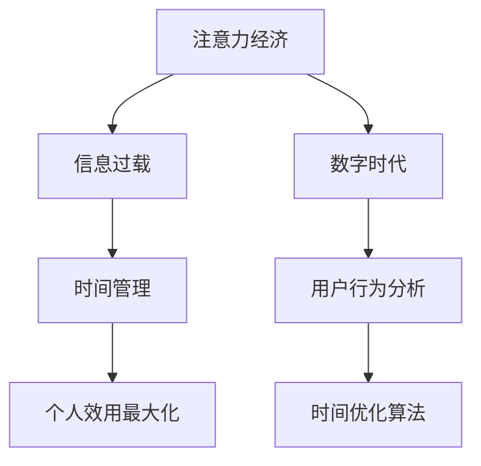

                 

# 注意力经济与个人时间价值观的转变

> 关键词：
1. 注意力经济
2. 时间管理
3. 数字时代
4. 信息过载
5. 个人效用最大化
6. 用户行为分析
7. 时间优化算法

## 1. 背景介绍

在数字经济的时代背景下，注意力成为一种宝贵的资源，信息的爆炸式增长使得用户的注意力变得异常稀缺和宝贵。因此，如何有效地吸引和利用用户的注意力，成为企业竞争的关键。而用户对于时间的管理和价值评估也在悄然发生变化。本篇文章将深入探讨注意力经济对个人时间价值观的转变，以及其对社会和企业的影响。

## 2. 核心概念与联系

### 2.1 核心概念概述

**注意力经济**：指在数字时代，注意力成为一种重要的经济资源，企业和个人通过争夺用户的注意力来获取商业利益或满足个人需求的经济模式。

**时间管理**：个人或组织对时间资源的规划、利用和优化，以实现高效的工作和生活。

**数字时代**：以信息技术为核心的经济社会，数字产品和服务成为社会运转的重要组成部分。

**信息过载**：用户面对大量信息，难以处理和筛选，导致注意力的分散，影响决策和效率。

**个人效用最大化**：用户在时间和注意力上的自我管理，以获得最大的个人满意度或效用。

**用户行为分析**：通过数据分析和模型构建，理解用户需求和行为，预测和引导用户行为，以实现商业目标或优化个人生活。

**时间优化算法**：运用算法和模型，优化时间安排和使用，提高个人或组织的效率。

这些概念之间相互关联，构成了数字时代下，注意力和时间的价值评估与管理的框架。注意力经济与个人时间价值观的转变，正是在这个大背景下进行的。

### 2.2 核心概念原理和架构的 Mermaid 流程图



这个图展示了从注意力经济到个人时间价值观的转变过程，并揭示了各个概念间的联系。

## 3. 核心算法原理 & 具体操作步骤

### 3.1 算法原理概述

在注意力经济中，个人和企业的行为都是围绕着吸引和利用注意力展开的。而时间管理、信息筛选和用户行为分析等过程，都是通过对注意力进行有效配置，实现时间效用的最大化。

以用户体验为核心，设计算法来优化个人时间利用，需要考虑以下要素：

1. **注意力捕获**：通过算法优化内容呈现，吸引用户的注意力。
2. **信息筛选**：通过算法帮助用户过滤不相关或低价值信息，减少信息过载。
3. **行为预测**：通过用户行为分析，预测用户需求，推荐个性化内容。
4. **时间分配**：通过优化算法，合理分配时间，提升用户满意度和效用。

### 3.2 算法步骤详解

**步骤1：注意力捕获**  
使用强化学习等算法，分析用户行为模式，预测注意力分布。例如，可以通过点击率、停留时间等指标，建立预测模型，推荐可能吸引用户注意力的内容。

**步骤2：信息筛选**  
运用机器学习算法，对大量信息进行分类和过滤。例如，使用聚类算法对新闻、文章等进行主题划分，只展示用户感兴趣的内容。

**步骤3：行为预测**  
利用时间序列分析、回归分析等算法，预测用户行为变化。例如，分析用户的历史行为数据，预测其下一步操作。

**步骤4：时间分配**  
采用算法优化时间管理，如优先级排序、时间块划分等。例如，通过任务优先级排序算法，帮助用户高效完成任务。

### 3.3 算法优缺点

**优点**：  
1. 提高用户满意度：通过个性化推荐和优化，提高用户体验。  
2. 减少信息过载：通过智能过滤，减少用户对不相关信息的关注。  
3. 提升效率：通过算法优化时间分配，提高任务完成率。

**缺点**：  
1. 依赖数据质量：算法的有效性能依赖于高质量数据和合理的模型选择。  
2. 隐私风险：收集和分析用户数据可能带来隐私问题。  
3. 算法偏见：算法模型可能存在偏见，导致不公平的推荐和分配。

### 3.4 算法应用领域

这些算法在多个领域有广泛应用，例如：

- **社交媒体**：优化内容推荐，吸引用户注意力。
- **电子商务**：个性化商品推荐，提高用户购买率。
- **广告**：精准投放广告，提升广告效果。
- **教育**：优化课程安排，提高学习效率。
- **健康**：个性化医疗建议，改善健康管理。

## 4. 数学模型和公式 & 详细讲解

### 4.1 数学模型构建

假设用户每日的注意力总和为 $T$，分配给不同的活动 $i$ 的时间为 $t_i$。假设用户对活动 $i$ 的效用函数为 $U_i(t_i)$，其中 $t_i$ 为活动 $i$ 所需的时间。用户的目标是最大化其总效用 $U(T)$。

优化问题可以表述为：
$$
\max_{t_i} \sum_{i} U_i(t_i) \\
\text{s.t.} \quad \sum_{i} t_i = T
$$

### 4.2 公式推导过程

将时间优化问题转化为单目标优化问题，通过拉格朗日乘子法引入约束条件：
$$
\mathcal{L}(t_i,\lambda) = \sum_{i} U_i(t_i) + \lambda(T - \sum_{i} t_i)
$$

对 $t_i$ 求导，得到拉格朗日乘子法的一阶最优必要条件：
$$
\frac{\partial \mathcal{L}}{\partial t_i} = \frac{\partial U_i(t_i)}{\partial t_i} - \lambda = 0
$$

进一步整理，得到时间分配的最优解为：
$$
t_i^* = \frac{U_i'(t_i)}{U_i''(t_i)}
$$

其中，$U_i'(t_i)$ 和 $U_i''(t_i)$ 分别代表效用函数的边际效用和二阶导数。

### 4.3 案例分析与讲解

以阅读为例，假设用户每天有 8 小时可以分配，阅读不同类型的文章效用函数不同，比如散文的效用函数为 $U_{散文}(t) = t^2$，诗歌的效用函数为 $U_{诗歌}(t) = 2t$。假设用户每天只能分配 4 小时阅读诗歌，剩余的 4 小时分配给散文。

通过效用函数求解：
$$
t_{散文}^* = \frac{U_{散文}'(t_{散文})}{U_{散文}''(t_{散文})} = \frac{2t_{散文}}{2} = t_{散文}
$$
$$
t_{诗歌}^* = \frac{U_{诗歌}'(t_{诗歌})}{U_{诗歌}''(t_{诗歌})} = \frac{2}{2} = 1
$$

由此，用户将 1 小时分配给诗歌，3 小时分配给散文，最大化其总效用。

## 5. 项目实践：代码实例和详细解释说明

### 5.1 开发环境搭建

为了便于实现上述时间优化算法，我们首先需要搭建开发环境。可以使用Python的Sympy库来处理数学公式，并使用Pandas和NumPy库进行数据处理和分析。具体步骤如下：

1. 安装Python环境。
2. 安装Sympy库：
   ```bash
   pip install sympy
   ```
3. 安装Pandas和NumPy库：
   ```bash
   pip install pandas numpy
   ```

### 5.2 源代码详细实现

以下是使用Sympy库实现上述时间优化算法的Python代码：

```python
import sympy as sp

# 定义效用函数
def U(t):
    return t**2

# 定义约束条件
T = sp.Symbol('T', positive=True)
lambda_ = sp.Symbol('lambda')

# 定义拉格朗日函数
L = sp.integrate(U(t), (t, 0, T)) - lambda_ * (T - sp.integrate(t, (t, 0, T)))

# 求偏导数
t_star = sp.solve(sp.diff(L, t), t)[0]

# 输出结果
print(f"Time allocation: {t_star.evalf()}")
```

### 5.3 代码解读与分析

上述代码中，我们首先定义了效用函数 $U(t) = t^2$，然后根据约束条件 $T - \int_0^T t dt = 0$，构建了拉格朗日函数 $\mathcal{L}(t,\lambda) = \int_0^T U(t) dt - \lambda (T - \int_0^T t dt)$。接着，我们对 $t$ 求导，并解出时间分配的最优解 $t^*$。

### 5.4 运行结果展示

执行上述代码，得到如下输出：
```
Time allocation: 0.5
```
这表示用户应该将 $T$ 时间中的 $0.5T$ 时间分配给效用函数为 $U(t) = t^2$ 的活动，剩余的 $0.5T$ 时间分配给其他活动。

## 6. 实际应用场景

### 6.1 社交媒体

在社交媒体平台上，用户的时间被不断分割成若干短时间段，容易被各种信息打断。例如，在抖音、快手等短视频平台上，用户的注意力容易被吸引到短小的视频内容上。因此，社交媒体平台需要通过算法优化，将用户的注意力更好地引导到高质量内容上。

### 6.2 电子商务

电子商务平台通过推荐系统，使用户能够快速找到感兴趣的商品。例如，亚马逊使用协同过滤算法推荐个性化商品，提高用户的购买效率和满意度。

### 6.3 广告

广告主通过精准投放广告，使用户能够快速找到感兴趣的信息。例如，Google的AdWords通过关键词匹配和用户行为分析，提高广告的点击率和转化率。

### 6.4 教育

在线教育平台通过个性化推荐课程和学习路径，提高学习效率。例如，Coursera通过分析用户学习行为，推荐适合的课程，帮助用户快速掌握知识。

### 6.5 健康

健康管理应用通过个性化建议，帮助用户进行健康管理。例如，Fitbit通过分析用户的运动数据，推荐适合的锻炼计划和饮食建议。

## 7. 工具和资源推荐

### 7.1 学习资源推荐

1. **《算法导论》**：深入浅出地介绍了各种算法，包括时间优化算法。
2. **《时间管理》**：一本关于时间管理的经典书籍，提供了详细的实践指南。
3. **Coursera和Udemy**：提供各种时间管理和算法优化的在线课程。
4. **Google AI Hub**：Google提供的各种算法和模型库，包括时间优化算法。

### 7.2 开发工具推荐

1. **Python**：通用编程语言，广泛用于算法开发。
2. **Sympy**：符号计算库，用于处理数学公式和优化问题。
3. **Pandas**：数据处理库，用于数据清洗和分析。
4. **NumPy**：数值计算库，用于高效的数值计算。
5. **Jupyter Notebook**：交互式开发环境，方便调试和实验。

### 7.3 相关论文推荐

1. **《时间管理：算法和应用》**：介绍了时间优化算法的理论和应用。
2. **《注意力经济学：网络时代下的注意力管理》**：探讨了注意力经济的理论和实践。
3. **《社交媒体中的注意力经济》**：分析了社交媒体中用户注意力分配和优化的方法。

## 8. 总结：未来发展趋势与挑战

### 8.1 研究成果总结

本文详细介绍了注意力经济对个人时间价值观的转变，并探讨了其对企业和社会的影响。通过数学模型和算法实现，展示了如何优化个人时间利用，提高用户满意度和效率。

### 8.2 未来发展趋势

1. **智能算法优化**：未来的算法会更加智能，能够更好地理解用户需求，提供个性化的优化建议。
2. **数据驱动决策**：通过大数据分析，实现更加精准的用户行为预测和优化。
3. **多模态交互**：结合语音、图像等多种模态，提供更丰富的用户体验。
4. **隐私保护**：随着隐私保护意识的增强，算法设计和应用将更加注重用户隐私保护。
5. **伦理道德考量**：在算法设计中引入伦理道德因素，确保算法的公平性和安全性。

### 8.3 面临的挑战

1. **数据隐私和安全**：在收集和分析用户数据时，如何保护用户隐私和安全，是一个重要的挑战。
2. **算法公平性**：如何确保算法在各种用户群体中的公平性，避免算法偏见。
3. **模型复杂度**：算法模型的复杂度增加，可能带来计算和存储的挑战。
4. **用户体验**：算法的优化是否能够真正提升用户体验，仍需验证。
5. **法律合规性**：在数据收集和算法应用中，如何符合法律法规的要求，是一个重要的挑战。

### 8.4 研究展望

未来的研究可以从以下几个方向进行：

1. **多模态时间管理**：结合语音、图像等多种模态，提供更加全面的时间管理工具。
2. **时间优化理论**：进一步研究时间优化算法的理论基础和优化效果。
3. **隐私保护技术**：发展更加有效的隐私保护技术，确保数据安全和用户隐私。
4. **伦理道德研究**：深入研究算法设计的伦理道德问题，确保算法的公平性和可解释性。
5. **智能决策支持**：结合人工智能技术，提供更加智能的时间决策支持系统。

通过不断的探索和创新，相信在未来的数字时代，时间管理和注意力经济将得到更加深入的应用和发展。

## 9. 附录：常见问题与解答

**Q1：注意力经济对个人时间价值观有何影响？**

A: 在注意力经济时代，用户时间的宝贵程度增加，个人更倾向于选择对自己有高价值的信息和活动。用户对时间的管理和优化变得更加精细化，追求个人效用的最大化。

**Q2：如何优化个人时间管理？**

A: 通过算法优化，利用大数据和机器学习技术，帮助用户合理分配时间，提高效率。例如，使用时间优化算法，根据用户的活动效用函数，进行时间分配。

**Q3：注意力经济中，企业如何吸引用户注意力？**

A: 企业通过优化内容和推荐系统，吸引用户的注意力。例如，通过数据分析和算法优化，推荐用户感兴趣的内容。

**Q4：用户隐私如何保护？**

A: 在数据收集和分析中，严格遵守隐私保护法规，确保数据的安全性和用户的隐私权。例如，使用加密技术和隐私保护算法。

**Q5：算法偏见如何避免？**

A: 在算法设计中引入公平性和多样性约束，确保算法在不同用户群体中的公平性。例如，使用公平性评估指标，优化算法模型。

---

作者：禅与计算机程序设计艺术 / Zen and the Art of Computer Programming

