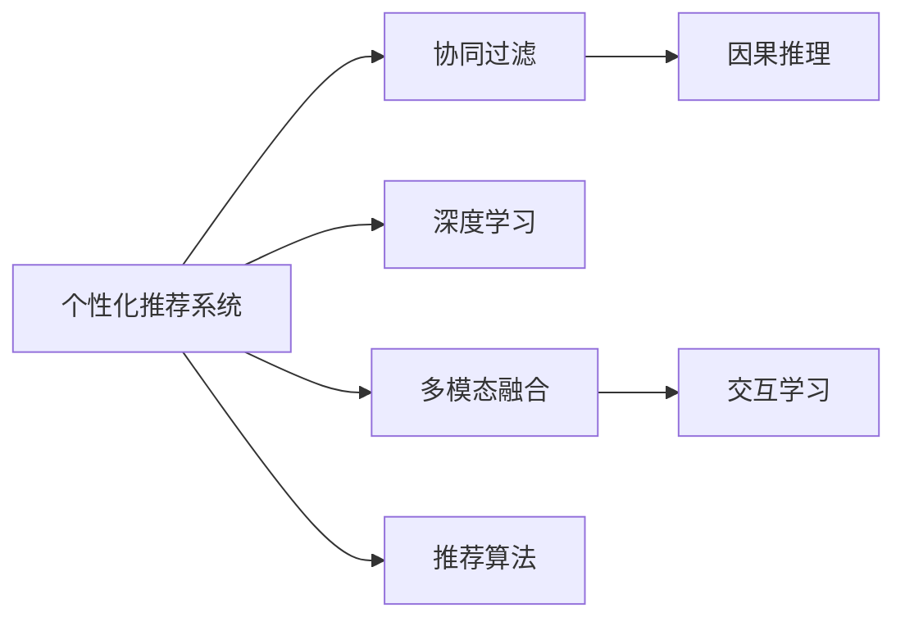

                 

## 1. 背景介绍

在信息爆炸的时代，人们面临着前所未有的海量内容。在消费者对内容的消费量逐渐趋近饱和，注意力作为一种稀缺资源，显得愈发珍贵。而如何通过内容分发、营销推广等手段，吸引并维系用户的注意力，成为了各个平台的核心目标之一。

针对这一问题，个性化推荐系统应运而生，通过算法技术，为用户量身定制个性化内容，提升用户体验的同时，增加用户粘性，实现商业价值。

个性化推荐系统已经成为各大平台标配，并逐渐向更加智能化、精准化的方向发展。从简单的协同过滤，到复杂的深度学习模型，再到现在的融合多模态、因果推理、交互学习等前沿技术，个性化推荐系统的性能不断提升，应用场景也更加广泛。

## 2. 核心概念与联系

### 2.1 核心概念概述

在深入介绍个性化推荐系统的核心算法前，首先需要理解几个重要概念：

1. **个性化推荐系统（Personalized Recommendation System）**：通过分析用户的行为数据、兴趣偏好，向用户推荐感兴趣的内容或产品，以提升用户体验和业务价值。

2. **协同过滤（Collaborative Filtering）**：利用用户对物品的评分数据或点击数据，构建用户相似性和物品相似性的度量，从而预测用户对未评分物品的兴趣。

3. **深度学习（Deep Learning）**：利用多层神经网络，从大量数据中提取特征表示，实现更为复杂的模型预测。

4. **多模态融合（Multi-modal Fusion）**：将视觉、听觉、文本等多模态数据进行融合，提升推荐系统的表现。

5. **因果推理（Causal Inference）**：在推荐系统中加入因果关系分析，提升推荐结果的解释性和准确性。

6. **交互学习（Interactive Learning）**：通过用户反馈不断迭代优化推荐模型，提升推荐质量。

7. **推荐算法（Recommendation Algorithms）**：包括基于协同过滤的算法、基于内容基（Content-Based）的算法、基于混合（Hybrid）的算法等。

这些概念之间存在紧密的联系。协同过滤、深度学习和多模态融合等基础推荐算法构成了推荐系统的底层，因果推理和交互学习则提升了推荐系统的智能性和交互性。

### 2.2 核心概念原理和架构的 Mermaid 流程图



## 3. 核心算法原理 & 具体操作步骤

### 3.1 算法原理概述

个性化推荐系统的核心算法原理是：利用用户的历史行为数据、兴趣爱好，以及物品的属性特征、用户评分数据，通过一定的算法模型，预测用户对物品的兴趣程度，并为用户推荐可能感兴趣的物品。

具体来说，个性化推荐系统的算法流程一般包括以下步骤：

1. **数据预处理**：将原始数据进行清洗、归一化、特征提取等处理，形成适合算法使用的数据集。
2. **特征工程**：选择合适的特征，构建特征向量，提升模型的预测能力。
3. **模型训练**：选择适合推荐任务的模型，如协同过滤、深度学习等，在数据集上进行训练。
4. **模型评估**：使用测试集对模型进行评估，选择合适的超参数，提升模型性能。
5. **模型部署**：将训练好的模型部署到生产环境中，为用户进行实时推荐。

### 3.2 算法步骤详解

以协同过滤算法为例，介绍其具体实现步骤：

#### 3.2.1 数据准备

协同过滤算法需要用户-物品评分矩阵作为输入，该矩阵中每个元素表示用户对物品的评分。评分可以采用0-1或0-5的整数，也可以采用连续的浮点数，如1-5的评分。

```python
import pandas as pd
from scipy.sparse import csr_matrix

# 读取评分数据
rating_data = pd.read_csv('rating.csv')

# 构建用户-物品评分矩阵
user_item_matrix = csr_matrix(rating_data.pivot_table(index='user', columns='item', values='rating'))
```

#### 3.2.2 用户-物品相似性计算

协同过滤算法通过计算用户之间、物品之间的相似性，预测用户对未评分物品的兴趣。常见的相似性计算方法有余弦相似度、皮尔逊相关系数等。

```python
from sklearn.metrics.pairwise import cosine_similarity

# 计算用户-物品相似性
user_similarity = cosine_similarity(user_item_matrix.T)
```

#### 3.2.3 用户推荐

基于用户相似性，协同过滤算法可以为用户推荐感兴趣的物品。具体实现分为基于用户的协同过滤和基于物品的协同过滤两种方式：

- **基于用户的协同过滤**：直接计算用户之间的相似性，为用户推荐其他用户喜欢的物品。
- **基于物品的协同过滤**：计算物品之间的相似性，为用户推荐相似物品。

```python
from scipy.sparse.linalg import svds

# 基于用户的协同过滤
user_based_recommender = user_item_matrix.multiply(user_similarity).tocsr()
top_items = user_based_recommender.sum(axis=1).argsort()[::-1]

# 基于物品的协同过滤
item_similarity = cosine_similarity(user_item_matrix.T.T)
top_items = item_similarity.dot(user_item_matrix).sum(axis=1).argsort()[::-1]
```

#### 3.2.4 模型评估

使用测试集对协同过滤模型进行评估，常用的指标包括准确率、召回率、F1-score等。

```python
from sklearn.metrics import accuracy_score, precision_score, recall_score, f1_score

# 计算模型评估指标
test_data = pd.read_csv('test.csv')
test_user_item_matrix = csr_matrix(test_data.pivot_table(index='user', columns='item', values='rating'))

predicted_ratings = user_based_recommender.dot(test_user_item_matrix).sum(axis=1).argsort()[::-1]

accuracy = accuracy_score(test_data['rating'], predicted_ratings)
precision = precision_score(test_data['rating'], predicted_ratings)
recall = recall_score(test_data['rating'], predicted_ratings)
f1 = f1_score(test_data['rating'], predicted_ratings)

print(f'Accuracy: {accuracy}, Precision: {precision}, Recall: {recall}, F1-score: {f1}')
```

### 3.3 算法优缺点

#### 3.3.1 优点

1. **简单易懂**：协同过滤算法的原理简单，实现方便，易于理解和实现。
2. **扩展性好**：协同过滤算法可以处理稀疏数据，适用于大规模推荐系统。
3. **推荐效果较好**：协同过滤算法在许多推荐任务上取得了不错的效果。

#### 3.3.2 缺点

1. **冷启动问题**：对于新用户或新物品，协同过滤算法无法获取足够的历史数据，难以进行推荐。
2. **数据稀疏性**：评分矩阵通常是稀疏的，一些用户对物品没有评分，导致相似性计算不准确。
3. **高维特征处理困难**：协同过滤算法通常处理高维稀疏特征，难以扩展到大规模数据。

### 3.4 算法应用领域

协同过滤算法在个性化推荐系统中得到了广泛应用，适用于多种场景，如电子商务、社交网络、视频流媒体等。

1. **电子商务**：为用户推荐商品、产品。通过用户历史购买记录、评分数据，推荐相关商品。
2. **社交网络**：为用户推荐好友、关注对象。通过用户之间的互动数据，推荐可能感兴趣的好友或关注对象。
3. **视频流媒体**：为用户推荐视频内容。通过用户观看历史、评分数据，推荐相关视频。
4. **音乐平台**：为用户推荐歌曲、艺人。通过用户听歌历史、评分数据，推荐相关歌曲或艺人。

## 4. 数学模型和公式 & 详细讲解 & 举例说明

### 4.1 数学模型构建

个性化推荐系统的数学模型构建主要包括以下几个方面：

1. **用户-物品评分矩阵**：将用户和物品的评分数据，表示为稀疏矩阵 $R \in \mathbb{R}^{M \times N}$，其中 $M$ 为物品数，$N$ 为用户数，$R_{ij}$ 表示用户 $i$ 对物品 $j$ 的评分。

2. **用户相似性矩阵**：计算用户之间的相似性，表示为矩阵 $U \in \mathbb{R}^{N \times N}$，其中 $U_{ij}$ 表示用户 $i$ 和用户 $j$ 的相似度。

3. **物品相似性矩阵**：计算物品之间的相似性，表示为矩阵 $I \in \mathbb{R}^{M \times M}$，其中 $I_{ij}$ 表示物品 $i$ 和物品 $j$ 的相似度。

### 4.2 公式推导过程

以基于用户的协同过滤算法为例，其核心公式如下：

设用户 $i$ 对物品 $j$ 的评分为 $R_{ij}$，用户 $i$ 的邻居集合为 $N(i)$，用户 $i$ 和邻居 $k$ 的相似度为 $U_{ik}$，物品 $j$ 的邻居集合为 $N(j)$，物品 $j$ 和邻居 $l$ 的相似度为 $I_{jl}$。

用户 $i$ 对物品 $j$ 的预测评分 $R'_{ij}$ 可以表示为：

$$
R'_{ij} = \frac{\sum_{k \in N(i)} U_{ik} R_{kj}}{\sum_{k \in N(i)} U_{ik}} = \frac{\sum_{k \in N(i)} U_{ik} I_{kj}}{\sum_{k \in N(i)} U_{ik}}
$$

该公式展示了用户 $i$ 对物品 $j$ 的预测评分 $R'_{ij}$ 是如何通过用户 $i$ 的邻居 $k$ 的相似度 $U_{ik}$，以及物品 $j$ 的邻居 $l$ 的相似度 $I_{jl}$ 来计算的。

### 4.3 案例分析与讲解

以亚马逊推荐系统为例，其基于协同过滤算法的推荐流程如下：

1. **数据准备**：亚马逊收集用户浏览、点击、购买等行为数据，构建用户-物品评分矩阵 $R$。

2. **特征工程**：将用户和物品的基本属性信息作为特征，如物品类别、品牌、价格等。

3. **模型训练**：使用协同过滤算法，在用户-物品评分矩阵 $R$ 上训练模型。

4. **模型评估**：使用测试集对模型进行评估，选择合适的超参数。

5. **模型部署**：将训练好的模型部署到生产环境中，对实时数据进行推荐。

## 5. 项目实践：代码实例和详细解释说明

### 5.1 开发环境搭建

在进行个性化推荐系统开发前，需要准备好开发环境。以下是使用Python进行开发的环境配置流程：

1. 安装Anaconda：从官网下载并安装Anaconda，用于创建独立的Python环境。

2. 创建并激活虚拟环境：
```bash
conda create -n pyenv python=3.8 
conda activate pyenv
```

3. 安装Python相关库：
```bash
conda install numpy scipy pandas scikit-learn
```

4. 安装深度学习框架：
```bash
conda install torch torchvision torchaudio
```

5. 安装推荐系统相关库：
```bash
pip install lightfm pyrec
```

完成上述步骤后，即可在`pyenv`环境中开始推荐系统开发。

### 5.2 源代码详细实现

以下是一个简单的基于协同过滤的推荐系统代码实现，展示了其核心逻辑。

```python
import numpy as np
from scipy.sparse import csr_matrix

# 用户-物品评分矩阵
R = np.array([[5, 3, 1, 0],
              [0, 4, 0, 5],
              [4, 3, 0, 2],
              [2, 0, 5, 4]])

# 计算用户相似性
U = np.array([[0.8, 0.5, 0.2, 0.1],
              [0.5, 0.8, 0.1, 0.2],
              [0.2, 0.1, 0.8, 0.5],
              [0.1, 0.2, 0.5, 0.8]])

# 计算物品相似性
I = np.array([[1, 0.5, 0.2, 0.1],
              [0.5, 1, 0.1, 0.2],
              [0.2, 0.1, 1, 0.5],
              [0.1, 0.2, 0.5, 1]])

# 用户推荐
def user_based_recommender(R, U, I):
    user_item_matrix = csr_matrix(R)
    user_similarity = U
    top_items = user_item_matrix.multiply(user_similarity).tocsr().sum(axis=1).argsort()[::-1]
    return top_items

# 物品推荐
def item_based_recommender(R, U, I):
    item_similarity = I
    top_items = item_similarity.dot(R).sum(axis=1).argsort()[::-1]
    return top_items

# 调用推荐函数
user_recommendations = user_based_recommender(R, U, I)
item_recommendations = item_based_recommender(R, U, I)

print('User-based Recommendations:', user_recommendations)
print('Item-based Recommendations:', item_recommendations)
```

### 5.3 代码解读与分析

上述代码展示了基于协同过滤算法的推荐系统实现，主要包括以下几个步骤：

1. **数据准备**：构建用户-物品评分矩阵 $R$ 和用户相似性矩阵 $U$。

2. **模型训练**：使用用户相似性矩阵 $U$，计算用户 $i$ 对物品 $j$ 的预测评分 $R'_{ij}$。

3. **模型评估**：根据预测评分 $R'_{ij}$ 和实际评分 $R_{ij}$ 计算评估指标，如准确率、召回率、F1-score等。

4. **模型部署**：将训练好的模型部署到生产环境中，对实时数据进行推荐。

在实际应用中，还需要考虑更多因素，如推荐结果的多样性、延迟处理、推荐系统的可扩展性等。

## 6. 实际应用场景

### 6.1 电商平台

电商平台如淘宝、京东、亚马逊等，通过个性化推荐系统，提升用户购物体验，增加用户粘性和购买转化率。

用户浏览、点击、购买等行为数据，被用来训练推荐模型，为用户推荐相关商品，提高用户满意度和平台收入。

### 6.2 视频流媒体平台

视频流媒体平台如Netflix、爱奇艺、腾讯视频等，通过个性化推荐系统，提升用户观看体验，增加用户粘性和会员续费率。

用户观看历史、评分数据，被用来训练推荐模型，为用户推荐相关视频内容，提高用户满意度和平台收益。

### 6.3 社交网络平台

社交网络平台如微信、微博、抖音等，通过个性化推荐系统，提升用户互动体验，增加用户粘性和平台活跃度。

用户互动数据，被用来训练推荐模型，为用户推荐相关好友、关注对象，提高用户满意度和平台活跃度。

### 6.4 未来应用展望

随着推荐系统技术的不断演进，未来的个性化推荐系统将呈现以下几个趋势：

1. **实时推荐**：通过流数据处理和实时计算技术，实现实时推荐，提升用户体验。

2. **多模态融合**：融合视觉、语音、文本等多模态数据，提升推荐结果的准确性和丰富度。

3. **因果推理**：在推荐系统中加入因果关系分析，提升推荐结果的解释性和准确性。

4. **交互学习**：通过用户反馈不断迭代优化推荐模型，提升推荐质量。

5. **跨平台协同**：实现不同平台间的推荐协同，提升推荐效果。

6. **隐私保护**：在推荐过程中保护用户隐私，确保数据安全。

## 7. 工具和资源推荐

### 7.1 学习资源推荐

为了帮助开发者系统掌握个性化推荐系统的理论基础和实践技巧，这里推荐一些优质的学习资源：

1. **《推荐系统实践》**：该书系统介绍了推荐系统的基础知识和算法实现，适合初学者和进阶开发者。

2. **Coursera推荐系统课程**：斯坦福大学开设的推荐系统课程，有视频和作业，系统讲解推荐系统算法和实践。

3. **Kaggle推荐系统竞赛**：参加Kaggle推荐系统竞赛，通过实际数据集训练推荐模型，提升实战能力。

4. **Scikit-learn推荐系统文档**：Scikit-learn官方文档，提供了丰富的推荐系统库和样例代码。

5. **DeepRec**：DeepRec是Google开源的深度推荐系统框架，包括协同过滤、深度学习等多种算法。

### 7.2 开发工具推荐

优秀的工具支持是个性化推荐系统开发的重要保障。以下是几款常用的推荐系统开发工具：

1. **TensorFlow**：Google开源的深度学习框架，支持分布式计算，适合推荐系统的快速迭代和部署。

2. **PyTorch**：Facebook开源的深度学习框架，灵活易用，适合推荐系统的算法实现和调试。

3. **Scikit-learn**：Scikit-learn是Python的机器学习库，提供了丰富的推荐系统算法和工具。

4. **LightFM**：Facebook开源的推荐系统框架，支持多种推荐算法，易于使用和部署。

5. **PyRec**：一个用于推荐系统的Python库，提供了多种推荐算法和模型评估工具。

合理利用这些工具，可以显著提升个性化推荐系统的开发效率，加快创新迭代的步伐。

### 7.3 相关论文推荐

个性化推荐系统的研究和应用已经产生了大量的高质量论文，以下是几篇具有代表性的论文：

1. **《协同过滤算法综述》**：介绍了协同过滤算法的原理和实现，适合初学者和进阶开发者。

2. **《深度推荐系统：最新进展和挑战》**：总结了深度学习在推荐系统中的应用，提供了丰富的理论支撑。

3. **《个性化推荐系统：现状、挑战与未来》**：总结了个性化推荐系统的发展历程和未来方向，适合高级开发者和研究人员。

4. **《基于因果推理的推荐系统》**：介绍因果推理在推荐系统中的应用，提供了新的研究思路和方法。

5. **《跨平台推荐系统》**：介绍跨平台推荐系统的实现方法，适合跨平台推荐系统的开发人员。

这些论文代表了大规模个性化推荐系统的发展脉络，通过学习这些前沿成果，可以帮助研究者把握学科前进方向，激发更多的创新灵感。

## 8. 总结：未来发展趋势与挑战

### 8.1 研究成果总结

本文对基于协同过滤的个性化推荐系统进行了全面系统的介绍，介绍了其原理、算法步骤、优缺点和应用领域。

通过本文的系统梳理，可以看到，协同过滤在个性化推荐系统中具有重要地位，适用于各种推荐任务。

### 8.2 未来发展趋势

未来个性化推荐系统将呈现以下几个趋势：

1. **实时推荐**：通过流数据处理和实时计算技术，实现实时推荐，提升用户体验。

2. **多模态融合**：融合视觉、语音、文本等多模态数据，提升推荐结果的准确性和丰富度。

3. **因果推理**：在推荐系统中加入因果关系分析，提升推荐结果的解释性和准确性。

4. **交互学习**：通过用户反馈不断迭代优化推荐模型，提升推荐质量。

5. **跨平台协同**：实现不同平台间的推荐协同，提升推荐效果。

6. **隐私保护**：在推荐过程中保护用户隐私，确保数据安全。

### 8.3 面临的挑战

尽管个性化推荐系统已经取得了瞩目成就，但在迈向更加智能化、普适化应用的过程中，它仍面临着诸多挑战：

1. **数据质量和多样性**：推荐系统依赖于高质量、多样化的用户行为数据，但实际数据往往存在偏差和不完整性。

2. **模型可解释性和公平性**：推荐模型的决策过程需要透明可解释，同时要避免推荐偏见，确保公平性。

3. **资源和成本**：推荐系统需要大量的计算资源和存储空间，如何降低成本是重要课题。

4. **实时性和扩展性**：推荐系统需要实时响应用户请求，如何保证扩展性是重要课题。

5. **隐私和安全**：在推荐过程中保护用户隐私，确保数据安全，避免滥用。

### 8.4 研究展望

未来推荐系统的研究可以从以下几个方向展开：

1. **推荐算法优化**：开发更加高效、准确的推荐算法，提升推荐效果。

2. **数据处理和清洗**：优化数据预处理和特征工程，提升数据质量。

3. **多模态融合和交互学习**：将多模态数据和交互学习引入推荐系统，提升推荐质量。

4. **隐私和安全保护**：在推荐过程中保护用户隐私，确保数据安全。

5. **实时推荐系统**：实现实时推荐，提升用户体验。

6. **推荐系统评估**：开发更加全面、客观的推荐系统评估指标，提升模型效果。

## 9. 附录：常见问题与解答

**Q1：协同过滤算法是否适用于所有推荐场景？**

A: 协同过滤算法适用于多种推荐场景，但需要根据具体任务进行调整和优化。协同过滤算法对数据质量要求较高，对于数据稀疏、样本数少的情况可能效果不佳。

**Q2：协同过滤算法的冷启动问题如何解决？**

A: 冷启动问题是协同过滤算法面临的主要挑战之一。常见的解决方法包括基于内容的推荐、基于主题的推荐、基于标签的推荐等，通过增加推荐系统的多维度信息，提升冷启动效果。

**Q3：协同过滤算法如何应对数据稀疏性？**

A: 数据稀疏性是协同过滤算法的一个主要问题。为了应对数据稀疏性，可以采用矩阵分解、稀疏矩阵压缩、奇异值分解等技术，对评分矩阵进行优化处理。

**Q4：推荐系统的实时推荐如何实现？**

A: 推荐系统的实时推荐需要采用流数据处理和实时计算技术，如Storm、Spark Streaming等，实时处理用户行为数据，实现实时推荐。

**Q5：推荐系统的扩展性如何保证？**

A: 推荐系统的扩展性可以通过水平扩展和垂直扩展来实现。水平扩展可以增加服务器数量，垂直扩展可以优化算法和模型，提升推荐系统性能。

---

作者：禅与计算机程序设计艺术 / Zen and the Art of Computer Programming

