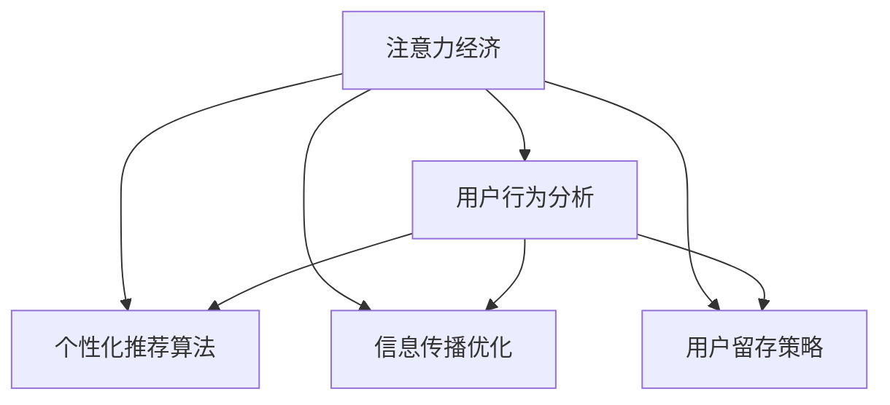

                 

# 注意力经济与内容策略：如何创建吸引并留住受众的信息

> 关键词：注意力经济,内容策略,用户留存,算法推荐,信息传播

## 1. 背景介绍

### 1.1 问题由来
在数字化时代，信息过载成为了我们共同的困扰。面对海量增长的数据，我们如何吸引受众的注意力，并保持他们的持续关注，是每个内容生产者面临的重大挑战。这一问题，早在信息经济学和心理学研究中被提出，并在近年进一步演化为“注意力经济”概念，成为互联网、媒体、广告等领域探讨的焦点。

在注意力经济中，信息的价值不再简单地取决于其内容质量，更在于其在受众中的吸引力。这意味着，内容策略的优化，已经上升为影响企业盈利和社会影响的战略层面。

### 1.2 问题核心关键点
当前，利用数据和算法进行用户行为分析、个性化推荐等技术，已经逐渐成为内容策略优化的一个重要工具。但技术只是手段，核心的目标在于理解和利用受众的注意力机制，设计有效的信息传播策略。具体包括以下几个关键点：

1. **用户行为分析**：通过收集和分析用户的互动数据，了解他们的兴趣偏好，为内容制作和推荐提供依据。
2. **个性化推荐算法**：根据用户行为分析结果，通过算法推荐个性化的内容，增加用户停留时间和满意度。
3. **信息传播优化**：设计更具吸引力的内容形式和传播策略，提升信息的传播效率和覆盖面。
4. **用户留存策略**：通过持续的内容更新和互动，建立与用户的长期关系，提升用户忠诚度。

### 1.3 问题研究意义
注意力经济的深入研究，对于提升内容传播效果、优化用户体验、提高用户留存率具有重要意义。具体体现在：

1. **提升传播效率**：通过用户行为分析和个性化推荐，可以将高质量内容精准地推送给目标受众，提高内容的到达率和互动率。
2. **优化用户体验**：通过内容策略的优化，确保内容形式和传播方式与用户期望相符合，提升用户的满意度和忠诚度。
3. **增强用户留存**：通过持续的内容互动和个性化服务，增强用户粘性，降低流失率，提升业务转化率。
4. **推动内容创新**：对受众注意力机制的深入理解，可以指导内容创作的优化，推动内容形式的创新和多元化。

## 2. 核心概念与联系

### 2.1 核心概念概述

为更好地理解注意力经济与内容策略，本节将介绍几个密切相关的核心概念：

- **注意力经济**：在信息过载时代，吸引和保持用户注意力的经济活动。内容策略的优化是其核心驱动力。
- **用户行为分析**：通过用户互动数据，理解用户偏好和行为特征，指导内容推荐和传播策略。
- **个性化推荐算法**：根据用户行为分析结果，通过算法推荐个性化的内容，增加用户停留时间和满意度。
- **信息传播优化**：设计更具吸引力的内容形式和传播策略，提升信息的传播效率和覆盖面。
- **用户留存策略**：通过持续的内容更新和互动，建立与用户的长期关系，提升用户忠诚度。

这些概念之间的逻辑关系可以通过以下Mermaid流程图来展示：



这个流程图展示了一系列核心概念及其之间的关系：

1. 注意力经济的实现依赖于对用户行为和偏好的深入理解。
2. 用户行为分析通过收集和分析用户数据，指导个性化推荐和信息传播策略的设计。
3. 个性化推荐算法和信息传播优化共同作用，提升内容的到达率和用户满意度。
4. 用户留存策略通过持续的互动和内容更新，增强用户粘性。

## 3. 核心算法原理 & 具体操作步骤
### 3.1 算法原理概述

注意力经济与内容策略的核心在于利用算法和数据，深度理解和引导用户的行为，设计有效的信息传播策略。其核心算法原理主要包括以下几个方面：

1. **用户行为分析**：通过机器学习算法分析用户行为数据，提取用户偏好特征，形成用户画像。
2. **个性化推荐算法**：结合用户画像和内容特征，通过推荐算法生成个性化内容推荐列表。
3. **信息传播优化**：基于推荐结果，设计更具吸引力的内容形式和传播策略，提升内容的到达率和用户互动。
4. **用户留存策略**：通过持续的内容互动和更新，建立与用户的长期关系，提升用户留存率。

### 3.2 算法步骤详解

以下详细介绍基于注意力经济的内容策略优化的具体操作步骤：

**Step 1: 数据收集与用户行为分析**

- 收集用户与内容的互动数据，如点击、浏览、点赞、评论等。
- 使用机器学习算法对互动数据进行分析，提取用户偏好特征，如兴趣类别、活跃时间段等。
- 结合用户基础信息（如年龄、性别、地域等），形成详尽的用户画像。

**Step 2: 个性化推荐算法设计**

- 根据用户画像和内容特征，选择合适的推荐算法，如协同过滤、基于内容的推荐、混合推荐等。
- 设计推荐算法超参数，如学习率、正则化系数等，进行模型调参。
- 在推荐过程中，结合用户实时反馈，不断调整推荐策略，优化推荐效果。

**Step 3: 信息传播策略设计**

- 分析推荐内容的表现数据，如点击率、停留时间等，确定最受欢迎的内容形式。
- 结合用户行为特征，设计更具吸引力的传播策略，如定时推送、分组推送等。
- 利用A/B测试等方法，对比不同策略的效果，选择最优方案。

**Step 4: 用户留存策略实施**

- 定期更新内容，保持内容的鲜活和吸引力。
- 设计互动环节，如问卷调查、用户评论等，增强用户参与感。
- 通过积分奖励、会员特权等激励措施，提升用户粘性。

### 3.3 算法优缺点

注意力经济与内容策略优化算法具有以下优点：

1. **提升传播效率**：通过个性化推荐和内容优化，将优质内容精准推送给目标受众，提升传播效率和用户满意度。
2. **优化用户体验**：个性化推荐和互动设计，确保内容形式和传播方式与用户期望相符，提升用户体验。
3. **增强用户留存**：持续的内容更新和互动，建立长期用户关系，提升用户留存率。
4. **推动内容创新**：对用户注意力机制的深入理解，指导内容创作的优化，推动内容形式的创新和多元化。

同时，该算法也存在一些局限性：

1. **依赖数据质量**：个性化推荐和行为分析的效果依赖于高质量的用户互动数据，数据缺失或噪声会影响分析结果。
2. **算法偏见**：算法可能基于训练数据的学习，引入或放大数据中的偏见，影响推荐公平性和多样性。
3. **隐私问题**：用户数据收集和使用需符合隐私保护法规，如GDPR等，否则可能引发法律风险。
4. **用户疲劳**：频繁推送个性化内容可能引起用户疲劳，降低互动意愿。

尽管存在这些局限性，但整体而言，基于算法的内容策略优化已经在大规模应用中取得了显著的效果，成为提高内容传播效率和用户满意度的重要手段。

### 3.4 算法应用领域

注意力经济与内容策略优化算法，在多个领域得到了广泛应用：

- **广告投放**：通过个性化推荐和行为分析，精准定位目标用户，提升广告投放效果和ROI。
- **内容分发**：社交媒体、视频平台等平台，通过个性化推荐，优化内容分发策略，提高用户粘性。
- **电子商务**：电商网站利用个性化推荐和行为分析，提升用户购买转化率和购物体验。
- **教育培训**：在线教育平台利用行为分析和推荐算法，提供个性化学习内容和推荐，提升学习效果。
- **娱乐传媒**：通过个性化推荐和互动设计，提高用户观看体验和参与度，增加用户粘性。

除了上述这些经典应用外，注意力经济与内容策略优化算法还被创新性地应用到更多场景中，如智能家居、医疗健康、公共服务等领域，为内容传播和用户互动带来新的突破。

## 4. 数学模型和公式 & 详细讲解 & 举例说明

### 4.1 数学模型构建

基于注意力经济的内容策略优化，涉及多个数学模型，本节将以协同过滤算法为例，详细介绍其数学模型构建。

假设用户集为 $U$，内容集为 $I$，用户对内容的评分矩阵为 $R_{ui}$，用户画像特征向量为 $x_u$，内容特征向量为 $x_i$，协同过滤算法的目标是学习用户画像 $x_u$ 和内容特征 $x_i$，使得 $R_{ui}$ 最大化。

用户画像和内容特征的数学模型构建如下：

- 用户画像 $x_u = (x_{u1}, x_{u2}, ..., x_{un})$，其中 $n$ 为用户画像的特征维度。
- 内容特征 $x_i = (x_{i1}, x_{i2}, ..., x_{im})$，其中 $m$ 为内容特征的维度。
- 协同过滤模型的目标函数为：
$$
\min_{x_u, x_i} \frac{1}{2}\sum_{u=1}^U \sum_{i=1}^I ||R_{ui} - \langle x_u, x_i \rangle ||^2
$$
其中 $\langle x_u, x_i \rangle$ 为用户画像和内容特征的内积。

### 4.2 公式推导过程

协同过滤算法的推导过程如下：

1. **目标函数**：协同过滤算法旨在最小化用户画像和内容特征的内积与实际评分矩阵的误差平方和。
2. **求解过程**：使用梯度下降等优化算法，对用户画像 $x_u$ 和内容特征 $x_i$ 进行迭代优化，直到误差最小化。

### 4.3 案例分析与讲解

**案例：电商个性化推荐**

假设有一个电商网站，需要为用户推荐商品。根据用户历史购买数据，可以构建评分矩阵 $R_{ui}$，其中 $u$ 为用户编号，$i$ 为商品编号。用户画像特征可以包括用户的年龄、性别、浏览历史等，内容特征可以包括商品的类别、价格、销量等。

使用协同过滤算法，可以构建如下的数学模型：

- 用户画像 $x_u = (age, gender, view_history, ...)$
- 商品特征 $x_i = (category, price, sales, ...)$
- 目标函数：
$$
\min_{x_u, x_i} \frac{1}{2}\sum_{u=1}^U \sum_{i=1}^I ||R_{ui} - \langle x_u, x_i \rangle ||^2
$$

通过求解上述目标函数，可以得到用户画像 $x_u$ 和商品特征 $x_i$，进而计算用户对商品的预测评分 $R_{ui}$。

## 5. 项目实践：代码实例和详细解释说明
### 5.1 开发环境搭建

在进行个性化推荐系统开发前，我们需要准备好开发环境。以下是使用Python进行PyTorch开发的环境配置流程：

1. 安装Anaconda：从官网下载并安装Anaconda，用于创建独立的Python环境。

2. 创建并激活虚拟环境：
```bash
conda create -n recommendation-env python=3.8 
conda activate recommendation-env
```

3. 安装PyTorch：根据CUDA版本，从官网获取对应的安装命令。例如：
```bash
conda install pytorch torchvision torchaudio cudatoolkit=11.1 -c pytorch -c conda-forge
```

4. 安装相关库：
```bash
pip install numpy pandas scikit-learn joblib tqdm scikit-learn
```

5. 安装TensorBoard：
```bash
pip install tensorboard
```

完成上述步骤后，即可在`recommendation-env`环境中开始个性化推荐系统的开发。

### 5.2 源代码详细实现

下面以协同过滤算法为例，给出使用PyTorch和TensorBoard进行电商个性化推荐系统的完整代码实现。

首先，导入相关库并设置超参数：

```python
import torch
import torch.nn as nn
import torch.optim as optim
from sklearn.model_selection import train_test_split
from sklearn.metrics import mean_squared_error

device = torch.device('cuda' if torch.cuda.is_available() else 'cpu')
N = 500  # 用户数
I = 1000 # 商品数
R = 5  # 评分矩阵大小
M = 50  # 用户画像特征维度
K = 10  # 内容特征维度

user_features = torch.randn(N, M).to(device)
item_features = torch.randn(I, K).to(device)
R_matrix = torch.randn(N, I).to(device)

N_train, N_test = train_test_split(range(N), test_size=0.2)
I_train, I_test = train_test_split(range(I), test_size=0.2)
```

然后，定义协同过滤算法的模型和损失函数：

```python
class MatrixFactorization(nn.Module):
    def __init__(self):
        super(MatrixFactorization, self).__init__()
        self.user_factors = nn.Linear(M, K, bias=False)
        self.item_factors = nn.Linear(K, 1, bias=False)

    def forward(self, user_features, item_features):
        user_factors = self.user_factors(user_features)
        item_factors = self.item_factors(item_features)
        R_pred = torch.matmul(user_factors, item_factors.t())
        return R_pred

model = MatrixFactorization().to(device)
criterion = nn.MSELoss().to(device)

optimizer = optim.Adam(model.parameters(), lr=0.001)
```

接着，定义训练和评估函数：

```python
def train_epoch(model, user_features, item_features, R_matrix, criterion, optimizer, batch_size):
    train_R_matrix = R_matrix[N_train:]
    train_user_features = user_features[N_train:]
    train_item_features = item_features[I_train:]
    model.train()
    loss = 0
    for i in range(0, len(train_R_matrix), batch_size):
        optimizer.zero_grad()
        R_pred = model(train_user_features[i:i+batch_size], train_item_features[i:i+batch_size])
        loss += criterion(R_pred, train_R_matrix[i:i+batch_size].to(device)).item()
        loss.backward()
        optimizer.step()
    return loss / (len(train_R_matrix) / batch_size)

def evaluate(model, user_features, item_features, R_matrix, criterion, batch_size):
    test_R_matrix = R_matrix[N_test:]
    test_user_features = user_features[N_test:]
    test_item_features = item_features[I_test:]
    model.eval()
    loss = 0
    with torch.no_grad():
        for i in range(0, len(test_R_matrix), batch_size):
            R_pred = model(test_user_features[i:i+batch_size], test_item_features[i:i+batch_size])
            loss += criterion(R_pred, test_R_matrix[i:i+batch_size].to(device)).item()
    return loss / (len(test_R_matrix) / batch_size)

def main():
    train_epochs = 100
    batch_size = 32
    for epoch in range(train_epochs):
        loss = train_epoch(model, user_features, item_features, R_matrix, criterion, optimizer, batch_size)
        print(f'Epoch {epoch+1}, train loss: {loss:.4f}')

        test_loss = evaluate(model, user_features, item_features, R_matrix, criterion, batch_size)
        print(f'Epoch {epoch+1}, test loss: {test_loss:.4f}')

        writer.add_scalar('train_loss', loss, epoch)
        writer.add_scalar('test_loss', test_loss, epoch)

    writer.close()
```

最后，启动训练流程并使用TensorBoard进行监控：

```bash
python main.py
tensorboard --logdir=logs
```

### 5.3 代码解读与分析

让我们再详细解读一下关键代码的实现细节：

**MatrixFactorization类**：
- 定义了协同过滤算法的模型，包含两个线性层，分别用于用户画像和内容特征的映射。
- 在`forward`方法中，计算用户画像和内容特征的内积，得到预测评分矩阵。

**train_epoch和evaluate函数**：
- 分别用于训练和评估模型，通过mini-batch的方式迭代训练，计算损失并更新模型参数。
- 在训练过程中，记录每个epoch的损失值，使用TensorBoard进行可视化监控。

**main函数**：
- 定义训练轮数和batch size，在每个epoch内进行训练和评估，记录损失值并使用TensorBoard进行可视化监控。

通过以上代码实现，可以看到，利用PyTorch和TensorBoard可以高效地构建和训练个性化推荐系统，并通过可视化工具监控训练效果。

## 6. 实际应用场景
### 6.1 电商个性化推荐

电商网站利用协同过滤算法进行个性化推荐，显著提升了用户的购物体验和转化率。通过分析用户的历史购买数据和浏览行为，构建评分矩阵和用户画像特征，预测用户对商品的评分。利用推荐算法生成个性化的商品推荐列表，提升用户购买意愿和满意度。

### 6.2 视频平台内容推荐

视频平台如Netflix、YouTube等，通过协同过滤算法和用户行为分析，为每个用户推荐个性化的视频内容。用户观看历史、点赞收藏、评分反馈等数据，被用于构建评分矩阵和用户画像，生成推荐列表。用户通过观看推荐视频，提升平台的用户粘性和互动率。

### 6.3 社交媒体个性化推送

社交媒体平台如Facebook、微信等，通过协同过滤算法和行为分析，为每个用户推荐个性化的内容。用户点赞、评论、分享等互动数据，被用于构建评分矩阵和用户画像，生成个性化推送列表。用户通过浏览推荐内容，提升平台的使用频率和活跃度。

### 6.4 未来应用展望

随着个性化推荐技术的不断进步，其应用领域将进一步拓展。预计未来会有更多场景引入注意力经济与内容策略优化，具体包括：

- **智能家居**：智能设备利用用户行为分析，为每个用户推荐个性化的家居场景和智能控制策略。
- **医疗健康**：医疗机构通过行为分析和推荐算法，为患者推荐个性化的治疗方案和健康建议。
- **公共服务**：政府部门利用用户反馈和行为分析，为每个用户推荐个性化的公共服务和信息。

这些应用场景将带来全新的业务模式和用户体验，进一步推动数字化时代的深入发展。

## 7. 工具和资源推荐
### 7.1 学习资源推荐

为了帮助开发者系统掌握注意力经济与内容策略的优化方法，这里推荐一些优质的学习资源：

1. **《推荐系统实践》书籍**：由KDD会议主席郑勇等人合著，全面介绍了推荐系统的发展历程和实现方法，涵盖协同过滤、矩阵分解、深度学习等技术。

2. **Coursera《Recommender Systems》课程**：由新加坡国立大学开设，系统讲解推荐系统的原理和应用，包括协同过滤、基于内容的推荐、混合推荐等。

3. **《深度学习》书籍**：由Goodfellow等人合著，全面介绍了深度学习的基本原理和应用方法，包括神经网络、卷积神经网络、循环神经网络等。

4. **Kaggle推荐系统竞赛**：通过参与Kaggle等数据科学竞赛，了解推荐系统在实际场景中的应用，提升解决实际问题的能力。

5. **Recommender Systems论文集**：由ACM SIGIR会议等顶级会议的推荐系统论文组成，涵盖最新的研究进展和技术突破。

通过对这些资源的学习实践，相信你一定能够掌握注意力经济与内容策略的优化精髓，并应用于实际项目中。

### 7.2 开发工具推荐

高效的开发离不开优秀的工具支持。以下是几款用于个性化推荐系统开发的常用工具：

1. **PyTorch**：基于Python的开源深度学习框架，灵活动态的计算图，适合快速迭代研究。支持多种神经网络模型，包括协同过滤算法。

2. **TensorFlow**：由Google主导开发的开源深度学习框架，生产部署方便，适合大规模工程应用。支持多种推荐算法模型，如深度神经网络、注意力机制等。

3. **Joblib**：用于任务调度和并行计算的工具，支持多线程、多进程和分布式计算，适合复杂的推荐系统训练任务。

4. **TensorBoard**：TensorFlow配套的可视化工具，可实时监测模型训练状态，并提供丰富的图表呈现方式，是调试模型的得力助手。

5. **TQDM**：用于进度条和进度条显示的工具，支持多线程和进度条更新，适用于推荐系统训练和评估过程中的数据可视化。

合理利用这些工具，可以显著提升个性化推荐系统的开发效率，加快创新迭代的步伐。

### 7.3 相关论文推荐

注意力经济与内容策略的优化研究源于学界的持续探索。以下是几篇奠基性的相关论文，推荐阅读：

1. **《Netflix Prize: A Prize Competition to Build Recommendation Systems》**：详细介绍了Netflix Prize竞赛的背景和推荐系统的发展历程，包含协同过滤算法的实现。

2. **《Collaborative Filtering》**：经典论文，由Bengio等人合著，系统讲解协同过滤算法的原理和应用，是推荐系统的理论基础。

3. **《A Survey of Collaborative Filtering Techniques》**：由Herlocker等人合著，全面总结了协同过滤算法的各种变种和技术，是推荐系统研究的必备参考。

4. **《Diversity, Novelty and Serendipity: A Unified Approach for Recommendation》**：提出了一个统一的推荐模型框架，考虑了多样性、新颖性和惊喜性等指标，是推荐系统性能评估的重要参考。

5. **《Deep Recommendations》**：由Shani等人合著，介绍了深度学习在推荐系统中的应用，包括深度神经网络、卷积神经网络和循环神经网络等。

这些论文代表了大规模推荐系统的发展脉络，是理解注意力经济与内容策略优化理论和方法的重要资源。

## 8. 总结：未来发展趋势与挑战

### 8.1 总结

本文对基于注意力经济的内容策略优化进行了全面系统的介绍。首先阐述了注意力经济的概念及其在数字化时代的重要性，明确了内容策略优化在提升传播效率、优化用户体验、增强用户留存等方面的价值。其次，从原理到实践，详细讲解了协同过滤算法的数学模型和实现步骤，给出了电商个性化推荐系统的代码实现。同时，本文还广泛探讨了注意力经济与内容策略在多个领域的应用前景，展示了其在实际场景中的巨大潜力。此外，本文精选了相关学习资源和开发工具，力求为读者提供全方位的技术指引。

通过本文的系统梳理，可以看到，基于注意力经济的内容策略优化已经成为推荐系统的重要手段，显著提升了内容传播效率和用户满意度。面对数据量爆炸和用户需求多样化的挑战，算法和技术的不断演进，必将进一步推动内容策略优化的创新和发展，为数字化时代带来更多的变革。

### 8.2 未来发展趋势

展望未来，注意力经济与内容策略优化将呈现以下几个发展趋势：

1. **深度学习与推荐结合**：深度神经网络、卷积神经网络和循环神经网络等，将进一步与推荐算法结合，提升模型的表达能力和预测精度。
2. **多模态信息融合**：推荐系统将利用视觉、语音、时间等多种信息源，提升模型的感知能力和用户体验。
3. **实时推荐与预测**：基于用户实时行为数据，实时计算推荐结果，提升用户的即时满足感。
4. **个性化与多样性平衡**：推荐系统将更注重个性化与多样性的平衡，避免过度推荐单一内容导致的用户疲劳。
5. **动态调整与上下文感知**：推荐系统将动态调整推荐策略，考虑用户上下文和情境变化，提升推荐的相关性和时效性。

这些趋势凸显了注意力经济与内容策略优化的广阔前景。未来的研究将在深度学习、多模态融合、实时推荐等方面取得更多突破，进一步提升推荐系统的性能和用户体验。

### 8.3 面临的挑战

尽管注意力经济与内容策略优化已经取得了显著的成效，但在迈向更加智能化、普适化应用的过程中，仍面临诸多挑战：

1. **数据质量和隐私问题**：用户数据的质量和隐私保护是推荐系统优化的重要障碍。如何保证数据的质量和用户的隐私权，将是一个长期挑战。
2. **算法公平性和透明性**：推荐算法的公平性和透明性问题，如算法偏见、黑箱操作等，可能引发伦理和社会责任问题。
3. **算力资源限制**：推荐系统通常需要处理大规模数据和高维特征，对算力资源有较高要求。如何在资源有限的情况下提升推荐效果，是一个亟待解决的问题。
4. **用户疲劳与过度推荐**：频繁推荐相似内容可能导致用户疲劳，降低互动意愿。如何设计合理的推荐策略，避免过度推荐，提升用户满意度，是一个重要研究方向。
5. **多样性与新颖性不足**：推荐系统可能过度关注用户历史行为，忽视多样性和新颖性，导致内容推荐缺乏新鲜感和惊喜感。

这些挑战需要学界和产业界共同努力，不断探索和优化算法和模型，才能实现推荐系统的可持续发展。

### 8.4 研究展望

面对注意力经济与内容策略优化所面临的挑战，未来的研究需要在以下几个方面寻求新的突破：

1. **无监督和半监督学习**：通过无监督和半监督学习，缓解对标注数据的依赖，利用更多非结构化数据，提升推荐系统的泛化能力和鲁棒性。
2. **深度生成模型**：利用深度生成模型，如变分自编码器、生成对抗网络等，生成更加多样和新颖的内容推荐，提升用户满意度。
3. **因果关系建模**：引入因果推断方法，分析用户行为背后的因果关系，提升推荐系统的决策透明性和可解释性。
4. **多模态融合技术**：利用多模态融合技术，将视觉、语音、文本等不同模态的信息结合，提升推荐系统的感知能力和用户体验。
5. **公平性与透明性研究**：从算法设计和模型训练的各个环节，加入公平性和透明性的约束，确保推荐系统的伦理和社会责任。

这些研究方向的探索，将引领注意力经济与内容策略优化技术迈向更高的台阶，为推荐系统带来更多的变革。面向未来，推荐系统还需要与其他人工智能技术进行更深入的融合，如知识表示、因果推理、强化学习等，协同发力，共同推动内容的传播和优化。只有勇于创新、敢于突破，才能不断拓展内容策略优化的边界，推动数字化时代的发展。

## 9. 附录：常见问题与解答

**Q1：推荐系统为何需要用户行为数据？**

A: 推荐系统通过用户行为数据分析，了解用户的兴趣偏好和行为特征，生成个性化的推荐结果。用户行为数据是推荐算法的主要输入，其质量直接影响推荐效果。

**Q2：推荐系统如何进行实时推荐？**

A: 实时推荐系统通过构建实时数据流，实时计算用户行为数据和推荐模型参数，生成推荐结果。常用的技术手段包括事件驱动、消息队列、流式计算等。

**Q3：推荐系统如何处理用户疲劳？**

A: 推荐系统可以通过引入多样性、个性化和上下文感知等策略，减少用户对相似内容的疲劳感。同时，通过用户的反馈数据，动态调整推荐策略，提升用户体验。

**Q4：推荐系统如何进行冷启动？**

A: 冷启动问题是指新用户或新商品加入系统时，推荐算法无法提供推荐结果。解决方案包括基于内容的推荐、协同过滤等，利用已有数据对新用户或新商品进行推荐。

**Q5：推荐系统如何避免过度推荐？**

A: 过度推荐可能导致用户疲劳，降低互动意愿。推荐系统可以通过引入多样性、新颖性和用户满意度等指标，动态调整推荐策略，避免过度推荐。

---

作者：禅与计算机程序设计艺术 / Zen and the Art of Computer Programming

