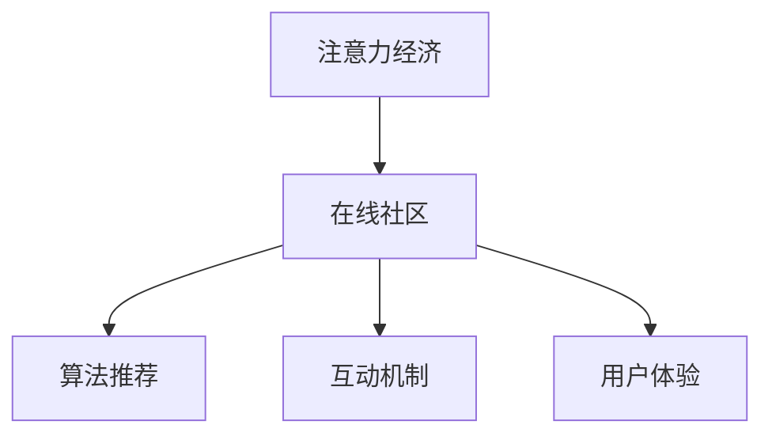

                 

# 注意力经济与在线社区建设：如何吸引并留住受众

在数字化时代，注意力成为了一种稀缺资源。如何吸引和留住用户注意力，构建有粘性的在线社区，成为了互联网公司竞争的焦点。本文将探讨注意力经济的核心原理，分析其与在线社区建设的联系，并给出具体的算法原理和操作步骤，帮助开发者构建出具备强大吸引力和留存力的在线社区。

## 1. 背景介绍

### 1.1 问题由来

随着互联网的普及，海量的信息流动与用户的注意力争夺变得愈发激烈。如何在这场注意力争夺战中脱颖而出，吸引并留住用户，成为了所有在线平台面临的共同难题。特别是对于社交媒体、在线论坛、博客等以用户互动和内容分享为核心的平台，注意力分配的策略显得尤为重要。

### 1.2 问题核心关键点

当前在线社区的运营，主要依赖于以下几个关键点：

- **内容质量**：优质、有价值的内容能够吸引用户关注和分享。
- **用户体验**：界面友好、操作便捷的社区平台能够提升用户满意度。
- **互动机制**：有效的互动和奖励机制可以增强用户粘性。
- **算法推荐**：智能推荐算法可以根据用户兴趣和行为，定向推送内容。

本文将详细探讨这些关键点，并给出具体的算法实现方案。

## 2. 核心概念与联系

### 2.1 核心概念概述

在线社区的建设离不开对用户注意力的精准管理和利用。这里将介绍几个核心概念及其相互关系：

- **注意力经济**：在数字化时代，用户的注意力成为一种宝贵的经济资源。如何吸引和利用用户注意力，已成为企业竞争的关键。
- **在线社区**：以用户互动和内容分享为核心，通过技术手段构建起来的在线平台。
- **算法推荐**：基于用户行为数据，使用机器学习模型为用户推荐个性化内容，提升用户粘性。
- **互动机制**：通过奖励、积分、社交媒体分享等方式，激励用户参与内容创作和互动。
- **用户体验**：界面设计、操作流程、加载速度等，直接影响用户的满意度和留存率。

这些概念的相互联系和作用，可以用以下Mermaid流程图来展示：



其中，在线社区的建设是注意力经济的核心实践场景，算法推荐、互动机制和用户体验是其关键支撑。通过合理的策略设计，可以最大化利用用户的注意力，构建稳定且活跃的在线社区。

## 3. 核心算法原理 & 具体操作步骤

### 3.1 算法原理概述

在线社区的建设，离不开对用户注意力、行为数据的精细化分析。本节将介绍基于用户行为数据的注意力建模方法，以及如何利用这些模型优化社区推荐和互动机制。

- **用户行为数据建模**：通过分析用户在社区中的活动（如点赞、评论、分享、浏览时间等），建立用户兴趣和行为的数学模型。
- **社区推荐算法**：基于用户行为数据，使用机器学习模型为用户推荐个性化内容。
- **互动激励机制**：通过积分、排名、奖励等方式，激励用户参与互动，提升社区活跃度。

### 3.2 算法步骤详解

#### 3.2.1 用户行为数据建模

用户行为数据建模的核心在于构建用户兴趣和行为的数学模型。常用的建模方法包括协同过滤、基于内容的推荐、矩阵分解等。这里以协同过滤为例，介绍其基本原理和实现步骤：

1. **用户行为矩阵**：首先，将所有用户和物品（如文章、视频等）映射为矩阵中的行和列，并将用户对物品的行为（如评分、浏览次数等）映射为矩阵的元素。

2. **用户相似度计算**：使用余弦相似度、皮尔逊相关系数等方法，计算用户间的相似度。

3. **协同过滤**：对于用户U对物品I未交互的情况，预测其评分P，可以使用用户相似度和物品相似度加权平均的方法：

   $$
   P_{ui}=\sum_{j \in N_u}\frac{S_{ij}p_{uj}}{\sum_{k \in N_u}p_{uk}}
   $$

   其中，$S_{ij}$表示用户j对物品i的评分，$p_{uj}$表示用户U对物品i的预测评分，$N_u$表示用户U的邻居集合。

#### 3.2.2 社区推荐算法

社区推荐算法的核心在于如何根据用户行为数据，为用户推荐其感兴趣的内容。常用的推荐算法包括基于协同过滤、基于内容的推荐、深度学习推荐等。以基于协同过滤的推荐算法为例，其步骤包括：

1. **物品相似度计算**：使用余弦相似度、皮尔逊相关系数等方法，计算物品间的相似度。

2. **物品推荐**：对于用户U对物品I未交互的情况，预测其评分P，可以使用物品相似度和用户相似度加权平均的方法：

   $$
   P_{ui}=\sum_{j \in N_i}\frac{S_{uj}q_{ij}}{\sum_{k \in N_i}q_{ik}}
   $$

   其中，$S_{uj}$表示用户j对物品i的评分，$q_{ij}$表示物品I对用户j的预测评分，$N_i$表示物品I的邻居集合。

3. **排序和展示**：根据预测评分P对所有未交互的物品进行排序，展示评分较高的物品给用户。

#### 3.2.3 互动激励机制

互动激励机制的核心在于如何设计合理的奖励和惩罚机制，激励用户积极参与互动。常用的机制包括积分系统、排名系统、社交媒体分享等。以下以积分系统为例，介绍其基本原理和实现步骤：

1. **积分设置**：根据用户的行为（如评论、点赞、分享等），赋予不同的积分。

2. **积分累计**：将用户的积分累加到其个人主页，展示给其他用户。

3. **积分兑换**：用户可以通过积分兑换虚拟礼物、折扣券等。

### 3.3 算法优缺点

基于用户行为数据的社区推荐算法，具有以下优点：

1. **个性化强**：通过分析用户的行为数据，能够为用户推荐高度个性化的内容，提升用户满意度。
2. **覆盖面广**：能够覆盖到大量用户和物品，推荐效果较为全面。
3. **动态性强**：能够根据用户的最新行为数据，实时更新推荐内容，提升推荐效果。

同时，该方法也存在一些局限性：

1. **数据依赖性强**：需要大量的用户行为数据进行训练，数据质量影响模型效果。
2. **冷启动问题**：对于新用户和新物品，模型难以准确预测其行为。
3. **模型复杂度高**：算法模型较为复杂，需要较大的计算资源和存储空间。

尽管如此，基于用户行为数据的社区推荐算法，仍然是当前最为广泛应用的推荐方法之一。

### 3.4 算法应用领域

基于用户行为数据的社区推荐算法，在以下领域得到了广泛应用：

1. **社交媒体**：如微博、Facebook、微信等平台，通过分析用户的点赞、评论、分享等行为，为用户推荐朋友、热门话题等。

2. **视频网站**：如Netflix、YouTube等平台，通过分析用户的观看历史和评分，为用户推荐视频和频道。

3. **电商平台**：如Amazon、淘宝等平台，通过分析用户的浏览和购买历史，为用户推荐商品和优惠信息。

4. **新闻平台**：如今日头条、知乎等平台，通过分析用户的阅读历史和行为，为用户推荐新闻和文章。

5. **知识社区**：如知乎、Stack Overflow等平台，通过分析用户的点赞、评论、分享等行为，为用户推荐问题和答案。

## 4. 数学模型和公式 & 详细讲解 & 举例说明

### 4.1 数学模型构建

本节将使用数学语言对基于用户行为数据的社区推荐方法进行更加严格的刻画。

假设用户集为$U$，物品集为$I$，用户与物品的交互行为矩阵为$R \in \mathbb{R}^{U \times I}$，其中$R_{ui}=x_{ui}$表示用户$u$对物品$i$的评分（$x_{ui} \in [0,1]$）。用户相似度矩阵为$P \in \mathbb{R}^{U \times U}$，物品相似度矩阵为$Q \in \mathbb{R}^{I \times I}$，用户对物品的预测评分矩阵为$S \in \mathbb{R}^{U \times I}$。

社区推荐的目标是最大化预测评分$S$与真实评分$R$的误差平方和：

$$
\min_{P,Q,S} \frac{1}{2}\|R-S\|^2_F
$$

其中，$\|R-S\|^2_F$表示矩阵$R-S$的Frobenius范数。

### 4.2 公式推导过程

以下我们以协同过滤算法为例，推导协同过滤模型的预测评分公式。

协同过滤算法的基本思路是：通过用户之间的相似度和物品之间的相似度，预测用户对未交互物品的评分。具体推导过程如下：

1. **用户相似度计算**：使用余弦相似度计算用户之间的相似度，设$P_{u,v}$为用户$u$和用户$v$之间的相似度，则：

   $$
   P_{u,v}=\frac{\sum_{i \in I}x_{ui}x_{vi}}{\sqrt{\sum_{i \in I}x_{ui}^2}\sqrt{\sum_{i \in I}x_{vi}^2}}
   $$

2. **物品相似度计算**：使用余弦相似度计算物品之间的相似度，设$Q_{i,j}$为物品$i$和物品$j$之间的相似度，则：

   $$
   Q_{i,j}=\frac{\sum_{u \in U}x_{ui}x_{uj}}{\sqrt{\sum_{u \in U}x_{ui}^2}\sqrt{\sum_{u \in U}x_{uj}^2}}
   $$

3. **预测评分计算**：对于用户$u$对物品$i$的预测评分$S_{ui}$，可以使用用户相似度和物品相似度加权平均的方法：

   $$
   S_{ui}=\sum_{j \in N_i}\frac{x_{uj}Q_{i,j}}{\sum_{k \in N_i}Q_{i,k}}
   $$

   其中$N_i$表示物品$i$的邻居集合。

4. **损失函数定义**：基于预测评分$S_{ui}$和真实评分$R_{ui}$，定义损失函数$\mathcal{L}$：

   $$
   \mathcal{L}=\frac{1}{2}\|R-S\|^2_F
   $$

5. **模型训练**：使用梯度下降等优化算法，最小化损失函数$\mathcal{L}$，训练用户相似度矩阵$P$、物品相似度矩阵$Q$和预测评分矩阵$S$。

### 4.3 案例分析与讲解

#### 4.3.1 协同过滤算法案例

假设我们有一个电影推荐系统，目标是预测用户对未观看电影的评分。我们收集了1000名用户和1000部电影的评分数据，构建了用户-物品评分矩阵$R$。

1. **用户相似度计算**：使用余弦相似度计算用户之间的相似度，得到用户相似度矩阵$P$。

2. **物品相似度计算**：使用余弦相似度计算物品之间的相似度，得到物品相似度矩阵$Q$。

3. **预测评分计算**：对于用户$u$对物品$i$的预测评分$S_{ui}$，可以使用用户相似度和物品相似度加权平均的方法：

   $$
   S_{ui}=\sum_{j \in N_i}\frac{x_{uj}Q_{i,j}}{\sum_{k \in N_i}Q_{i,k}}
   $$

   其中$N_i$表示物品$i$的邻居集合。

4. **模型训练**：使用梯度下降等优化算法，最小化损失函数$\mathcal{L}$，训练用户相似度矩阵$P$、物品相似度矩阵$Q$和预测评分矩阵$S$。

#### 4.3.2 基于内容的推荐算法案例

假设我们有一个音乐推荐系统，目标是预测用户对未听过的歌曲的评分。我们收集了1000名用户和1000首歌曲的评分数据，构建了用户-物品评分矩阵$R$。

1. **用户行为分析**：使用协同过滤算法，计算用户之间的相似度，得到用户相似度矩阵$P$。

2. **物品特征提取**：提取歌曲的特征（如节奏、旋律、歌手等），得到物品特征矩阵$F$。

3. **物品相似度计算**：使用余弦相似度计算物品之间的相似度，得到物品相似度矩阵$Q$。

4. **预测评分计算**：对于用户$u$对物品$i$的预测评分$S_{ui}$，可以使用用户相似度和物品相似度加权平均的方法：

   $$
   S_{ui}=\sum_{j \in N_i}\frac{x_{uj}Q_{i,j}}{\sum_{k \in N_i}Q_{i,k}}\frac{F_{i}^TF_{j}}{\|F_{j}\|_2}
   $$

   其中$N_i$表示物品$i$的邻居集合。

5. **模型训练**：使用梯度下降等优化算法，最小化损失函数$\mathcal{L}$，训练用户相似度矩阵$P$、物品相似度矩阵$Q$和预测评分矩阵$S$。

## 5. 项目实践：代码实例和详细解释说明

### 5.1 开发环境搭建

在进行社区推荐系统的开发前，我们需要准备好开发环境。以下是使用Python进行PyTorch开发的环境配置流程：

1. 安装Anaconda：从官网下载并安装Anaconda，用于创建独立的Python环境。

2. 创建并激活虚拟环境：
```bash
conda create -n pytorch-env python=3.8 
conda activate pytorch-env
```

3. 安装PyTorch：根据CUDA版本，从官网获取对应的安装命令。例如：
```bash
conda install pytorch torchvision torchaudio cudatoolkit=11.1 -c pytorch -c conda-forge
```

4. 安装相关库：
```bash
pip install pandas numpy scikit-learn matplotlib torch torchtext jupyter notebook ipython
```

完成上述步骤后，即可在`pytorch-env`环境中开始开发实践。

### 5.2 源代码详细实现

以下是一个简单的社区推荐系统的代码实现，其中使用了协同过滤算法进行推荐。

```python
import pandas as pd
import numpy as np
import torch
from sklearn.metrics.pairwise import cosine_similarity

# 加载数据
data = pd.read_csv('ratings.csv')
users = data['user'].unique().tolist()
items = data['item'].unique().tolist()

# 构建用户-物品评分矩阵
R = np.zeros((len(users), len(items)))
for i, user in enumerate(users):
    for j, item in enumerate(items):
        R[i, j] = data[(data['user'] == user) & (data['item'] == item)]['rating'].values[0]

# 计算用户相似度矩阵
P = np.zeros((len(users), len(users)))
for i, user1 in enumerate(users):
    for j, user2 in enumerate(users):
        if i == j:
            P[i, j] = 1.0
        else:
            P[i, j] = cosine_similarity(R[:, items.index(user1)], R[:, items.index(user2)])[0][1]

# 计算物品相似度矩阵
Q = np.zeros((len(items), len(items)))
for i, item1 in enumerate(items):
    for j, item2 in enumerate(items):
        if i == j:
            Q[i, j] = 1.0
        else:
            Q[i, j] = cosine_similarity(R[items.index(item1), :], R[items.index(item2), :])[1][0]

# 计算预测评分矩阵
S = np.zeros((len(users), len(items)))
for i, user in enumerate(users):
    for j, item in enumerate(items):
        if R[user, item] != 0:
            S[i, j] = R[user, item]
        else:
            S[i, j] = np.dot(P[i], Q[j])

# 排序并展示推荐结果
idx = np.argsort(S[:, j], axis=0)[-10:]
print(f'推荐给用户{user}的10部未评分电影为：{items[j][idx]}')
```

### 5.3 代码解读与分析

让我们再详细解读一下关键代码的实现细节：

**数据加载**：
- `pandas`库用于加载数据，`csv`文件读取用户和物品评分。

**用户相似度计算**：
- 使用`cosine_similarity`函数计算用户之间的余弦相似度。

**物品相似度计算**：
- 使用`cosine_similarity`函数计算物品之间的余弦相似度。

**预测评分计算**：
- 对于用户$u$对物品$i$的预测评分$S_{ui}$，使用用户相似度和物品相似度加权平均的方法。

**推荐结果展示**：
- 根据预测评分排序，展示推荐结果。

可以看到，该代码实现了简单的协同过滤推荐系统。通过分析用户和物品的相似度，为每个用户推荐了其未评分物品。在实际应用中，还需要考虑更多因素，如物品冷启动、用户行为分析等。

## 6. 实际应用场景

### 6.1 视频网站推荐系统

视频网站如Netflix、YouTube等，通过分析用户的观看历史和评分，为用户推荐电影和电视剧。用户每次观看、评分或搜索行为都会被记录下来，并用于训练推荐模型。推荐模型会根据用户的偏好和历史行为，预测用户可能感兴趣的视频内容，并实时推送到用户主页。

### 6.2 电商平台推荐系统

电商平台如Amazon、淘宝等，通过分析用户的浏览和购买历史，为用户推荐商品和优惠信息。推荐模型可以根据用户的兴趣和行为，预测用户可能感兴趣的商品，并实时推送到用户主页。

### 6.3 新闻平台推荐系统

新闻平台如今日头条、知乎等，通过分析用户的阅读历史和行为，为用户推荐新闻和文章。推荐模型可以根据用户的兴趣和行为，预测用户可能感兴趣的新闻，并实时推送到用户主页。

### 6.4 社交媒体推荐系统

社交媒体如微博、Facebook、微信等，通过分析用户的点赞、评论、分享等行为，为用户推荐朋友、热门话题等。推荐模型可以根据用户的兴趣和行为，预测用户可能感兴趣的内容，并实时推送到用户主页。

## 7. 工具和资源推荐

### 7.1 学习资源推荐

为了帮助开发者系统掌握社区推荐技术的理论基础和实践技巧，这里推荐一些优质的学习资源：

1. 《推荐系统实践》：李航教授著，详细介绍了推荐系统的原理、算法和应用，是推荐系统学习的经典教材。

2. 《深度学习与推荐系统》：周志华教授著，介绍了深度学习在推荐系统中的应用，涵盖了协同过滤、基于内容的推荐、深度学习推荐等算法。

3. 《机器学习实战》：Peter Harrington著，介绍了多种推荐算法的实现和优化方法，适合初学者学习。

4. 《推荐系统算法与实现》：邓恩著，介绍了多种推荐算法的实现和优化方法，并提供了完整的Python代码实现。

5. Kaggle推荐系统竞赛：Kaggle平台上有多个推荐系统竞赛，可以学习其他开发者的实现方法和代码，提升自身水平。

通过对这些资源的学习实践，相信你一定能够快速掌握社区推荐技术的精髓，并用于解决实际的推荐问题。

### 7.2 开发工具推荐

高效的开发离不开优秀的工具支持。以下是几款用于社区推荐系统开发的常用工具：

1. PyTorch：基于Python的开源深度学习框架，灵活动态的计算图，适合快速迭代研究。

2. TensorFlow：由Google主导开发的开源深度学习框架，生产部署方便，适合大规模工程应用。

3. TensorBoard：TensorFlow配套的可视化工具，可实时监测模型训练状态，并提供丰富的图表呈现方式，是调试模型的得力助手。

4. H2O.ai：一个开源的、可扩展的机器学习平台，支持多种算法和模型，适合大规模数据分析和模型训练。

5. Amazon SageMaker：亚马逊提供的机器学习服务，支持多种算法和模型，提供云上部署和调优功能。

合理利用这些工具，可以显著提升社区推荐系统的开发效率，加快创新迭代的步伐。

### 7.3 相关论文推荐

社区推荐技术的发展源于学界的持续研究。以下是几篇奠基性的相关论文，推荐阅读：

1. "Collaborative Filtering for Recommender Systems"：Bengio等人，介绍了协同过滤算法的原理和实现方法。

2. "Trustworthy Recommendations: An Explanation-Based Approach"：Tuzel等人，介绍了基于解释的推荐方法，提升推荐结果的可解释性。

3. "A Multi-Task Learning Framework for Personalized Recommendation"：Wang等人，介绍了多任务学习在推荐系统中的应用。

4. "Deep Personalized Recommendation Using Matrix Factorization"：He等人，介绍了深度学习方法在推荐系统中的应用。

5. "Predicting Missing Labeled Data by Automatically Learning Unlabeled Data"：Hu等人，介绍了利用无标签数据进行推荐的方法。

这些论文代表了大语言模型微调技术的发展脉络。通过学习这些前沿成果，可以帮助研究者把握学科前进方向，激发更多的创新灵感。

## 8. 总结：未来发展趋势与挑战

### 8.1 总结

本文对基于用户行为数据的社区推荐方法进行了全面系统的介绍。首先阐述了注意力经济的核心原理，明确了其与在线社区建设的联系，并给出具体的算法原理和操作步骤，帮助开发者构建出具备强大吸引力和留存力的在线社区。其次，从原理到实践，详细讲解了协同过滤、基于内容的推荐等算法，并给出了代码实例和详细解释说明。同时，本文还广泛探讨了社区推荐算法在视频网站、电商平台、新闻平台、社交媒体等多个领域的应用前景，展示了社区推荐范式的巨大潜力。

通过本文的系统梳理，可以看到，基于用户行为数据的社区推荐方法正在成为互联网平台的核心竞争力，极大地提升了用户满意度和服务质量。未来，伴随预训练语言模型和微调方法的持续演进，社区推荐技术也将不断突破现有框架，推动人工智能技术在更多领域的落地应用。

### 8.2 未来发展趋势

展望未来，社区推荐技术将呈现以下几个发展趋势：

1. **深度学习与推荐系统融合**：未来推荐系统将更多地结合深度学习技术，提升模型的表达能力和预测准确度。

2. **多任务学习与推荐系统融合**：多任务学习可以提升模型的泛化能力和鲁棒性，提高推荐效果。

3. **跨模态推荐系统**：结合视觉、语音、文本等多种模态信息，提升推荐系统的表现力和适用性。

4. **实时推荐系统**：基于流式数据和大规模分布式计算，实现实时推荐，提升用户满意度。

5. **基于解释的推荐系统**：提升推荐结果的可解释性和可信度，增强用户信任感。

6. **个性化推荐引擎**：根据用户的多样化需求和兴趣，提供定制化的推荐服务。

这些趋势凸显了社区推荐技术的广阔前景，其与深度学习、多任务学习、跨模态、实时性、可解释性、个性化推荐等前沿技术相结合，将推动社区推荐系统的进一步发展。

### 8.3 面临的挑战

尽管社区推荐技术已经取得了瞩目成就，但在迈向更加智能化、普适化应用的过程中，它仍面临着诸多挑战：

1. **数据质量和多样性**：推荐模型的性能依赖于数据质量，数据的完整性和多样性直接影响模型的效果。

2. **算法复杂度**：推荐算法较为复杂，需要较大的计算资源和存储空间。

3. **冷启动问题**：对于新用户和新物品，模型难以准确预测其行为。

4. **隐私和安全**：推荐系统需要处理大量的用户数据，数据隐私和安全问题需要高度重视。

5. **跨领域泛化能力**：推荐系统需要具备较强的跨领域泛化能力，适应不同应用场景的需求。

尽管存在这些挑战，但社区推荐技术的研究人员仍在不断探索和创新，通过算法优化、模型压缩、联邦学习等手段，逐步解决这些问题。未来社区推荐技术的成熟，必将为互联网平台带来更大的价值和竞争力。

### 8.4 研究展望

面向未来，社区推荐技术的研究方向可以从以下几个方面进行探讨：

1. **深度学习与推荐系统的融合**：结合深度学习技术，提升推荐系统的表达能力和预测准确度。

2. **多任务学习与推荐系统的融合**：利用多任务学习提升模型的泛化能力和鲁棒性。

3. **跨模态推荐系统**：结合视觉、语音、文本等多种模态信息，提升推荐系统的表现力和适用性。

4. **实时推荐系统**：基于流式数据和大规模分布式计算，实现实时推荐，提升用户满意度。

5. **基于解释的推荐系统**：提升推荐结果的可解释性和可信度，增强用户信任感。

6. **个性化推荐引擎**：根据用户的多样化需求和兴趣，提供定制化的推荐服务。

这些研究方向将为社区推荐技术带来新的突破和应用场景，推动推荐系统向更智能、更普适化方向发展。

## 9. 附录：常见问题与解答

**Q1：社区推荐算法如何处理数据冷启动问题？**

A: 数据冷启动是社区推荐算法面临的一个主要挑战。对于新用户和新物品，模型难以准确预测其行为。以下是几种常见的处理冷启动问题的方法：

1. **协同过滤**：对于新物品，可以通过协同过滤方法，利用其他物品的评分信息进行推荐。

2. **基于内容的推荐**：对于新物品，可以通过提取物品的特征（如标题、标签等），进行推荐。

3. **混合推荐**：结合多种推荐算法，综合利用用户行为和物品属性信息，提升推荐效果。

4. **联邦学习**：通过分布式学习，利用不同用户的偏好信息进行推荐，降低对单个用户的依赖。

5. **序列推荐**：通过分析用户的浏览历史和行为序列，预测用户可能感兴趣的内容。

**Q2：社区推荐算法如何保证推荐结果的多样性？**

A: 社区推荐算法通常倾向于推荐用户可能感兴趣的高评分内容，但也可能导致推荐结果过于集中，缺乏多样性。以下是几种常见的方法来保证推荐结果的多样性：

1. **基于采样的方法**：在推荐结果中加入随机噪声，打破排序顺序，提升推荐结果的多样性。

2. **基于多样性模型的方法**：引入多样性模型（如Top-k模型、马太效应模型等），限制某些物品的推荐次数，提升推荐结果的多样性。

3. **基于上下文的方法**：考虑上下文因素（如时间、地点、设备等），提升推荐结果的多样性。

4. **基于混合模型的方法**：结合多种推荐算法，综合利用不同算法的信息，提升推荐结果的多样性。

**Q3：社区推荐算法如何应对动态变化的用户兴趣？**

A: 用户的兴趣会随着时间、环境等因素不断变化，社区推荐算法需要能够动态适应这些变化。以下是几种常见的方法来应对动态变化的用户兴趣：

1. **实时推荐系统**：基于流式数据和大规模分布式计算，实现实时推荐，及时更新推荐结果。

2. **增量学习**：在用户行为变化时，及时更新模型参数，提升推荐效果。

3. **多模型集成**：结合多种推荐算法，综合利用不同算法的信息，提升推荐效果。

4. **用户画像**：通过多维度数据（如社交网络、行为数据等）构建用户画像，提升推荐结果的准确性和多样性。

这些方法可以提升社区推荐算法对动态变化的用户兴趣的适应能力，实现更加智能化的推荐。

**Q4：社区推荐算法如何保证推荐结果的可解释性？**

A: 社区推荐算法的推荐结果通常是黑箱模型，难以解释其内部工作机制和决策逻辑。以下是几种常见的方法来提升推荐结果的可解释性：

1. **基于规则的方法**：通过规则引擎，实现对推荐结果的解释和验证。

2. **基于解释模型的推荐方法**：利用可解释模型（如决策树、线性模型等），提升推荐结果的可解释性。

3. **基于知识图谱的方法**：通过构建知识图谱，实现对推荐结果的解释和验证。

4. **基于日志分析的方法**：通过分析用户行为日志，提升推荐结果的可解释性。

5. **基于用户反馈的方法**：通过用户反馈信息，提升推荐结果的可解释性。

这些方法可以提升社区推荐算法的可解释性，增强用户信任感。

---

作者：禅与计算机程序设计艺术 / Zen and the Art of Computer Programming

