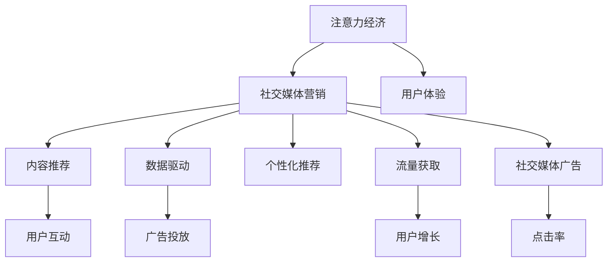

                 

# 注意力经济与社交媒体营销最佳实践：在不牺牲用户体验的情况下吸引受众

> 关键词：注意力经济,社交媒体营销,用户体验,内容推荐,数据驱动,个性化推荐,流量获取,社交媒体广告

## 1. 背景介绍

### 1.1 问题由来

随着移动互联网的普及和社交媒体的兴起，注意力经济已经成为一种新的商业模式。社交媒体平台如微博、微信、抖音等，通过精准的内容推荐和广告投放，吸引用户注意力，实现流量变现。然而，过度注重广告和点击率，往往会导致用户体验下降，用户流失。如何在吸引用户注意力和维护用户体验之间找到平衡，是社交媒体营销面临的一大挑战。

### 1.2 问题核心关键点

社交媒体营销的核心在于利用注意力经济，通过精准的内容推荐和广告投放，实现流量变现。但关键在于如何吸引受众注意，同时不牺牲用户体验，即在不影响用户体验的前提下，最大化用户注意力，从而提升广告效果和平台流量。

## 2. 核心概念与联系

### 2.1 核心概念概述

为更好地理解注意力经济和社交媒体营销，本节将介绍几个密切相关的核心概念：

- **注意力经济**：指在数字时代，注意力作为一种稀缺资源，成为营销、广告、信息获取等领域的核心。社交媒体平台通过内容推荐、广告投放等方式，争夺用户注意力，实现商业价值。

- **社交媒体营销**：指在社交媒体平台上进行的营销活动，包括内容创作、用户互动、广告投放等，旨在提升品牌知名度、增加用户粘性、实现流量转化。

- **用户体验**：指用户在使用产品或服务时所感受到的总体满足程度。良好的用户体验可以提升用户满意度和忠诚度，带来更高的商业价值。

- **内容推荐**：指利用算法或人工机制，向用户推荐其感兴趣的内容，提升用户停留时间和使用频率，从而增加流量和转化率。

- **数据驱动**：指利用数据挖掘和分析，进行决策支持，提高营销活动的精准度和有效性，实现更高的ROI。

- **个性化推荐**：指根据用户的历史行为和偏好，动态调整推荐内容，实现定制化推荐，提升用户满意度和粘性。

- **流量获取**：指通过各种手段，增加平台用户数量和活跃度，实现用户增长和流量变现。

- **社交媒体广告**：指在社交媒体平台上投放的广告，通过精准定向和创意设计，吸引用户点击和转化，提升广告效果。

这些核心概念之间的逻辑关系可以通过以下Mermaid流程图来展示：



这个流程图展示出注意力经济和社交媒体营销的关键环节，以及这些环节与用户体验、内容推荐、数据驱动、个性化推荐、流量获取和社交媒体广告等概念之间的逻辑关系。

## 3. 核心算法原理 & 具体操作步骤

### 3.1 算法原理概述

基于注意力经济和社交媒体营销，营销活动的目标在于吸引用户注意力，提升平台流量和商业价值。而社交媒体平台的核心竞争力在于其内容推荐系统。通过数据分析和机器学习算法，社交媒体平台能够精准预测用户兴趣，实现个性化推荐，从而最大化用户注意力和平台流量。

具体来说，社交媒体营销的算法原理可以概括为以下几个步骤：

1. 收集用户数据：通过跟踪用户在平台上的行为数据，如浏览、点赞、评论、分享等，构建用户兴趣画像。
2. 构建推荐模型：利用用户数据训练推荐模型，预测用户对不同内容的兴趣程度。
3. 实时推荐内容：根据用户行为和兴趣，实时调整推荐内容，提升用户体验和平台流量。
4. 数据分析与优化：定期分析推荐效果，优化推荐模型和策略，实现持续改进。

### 3.2 算法步骤详解

社交媒体营销的核心算法步骤包括数据收集、模型训练、实时推荐和优化分析。以下详细介绍每个步骤的详细操作：

**Step 1: 数据收集**

数据收集是社交媒体推荐系统的基础。通过用户行为数据，可以构建用户兴趣画像，为后续模型训练提供依据。具体而言，社交媒体平台可以收集以下数据：

- 用户行为数据：包括浏览、点赞、评论、分享等操作。
- 社交关系数据：如好友关系、粉丝数量、互动频率等。
- 用户属性数据：如年龄、性别、地理位置等。
- 内容属性数据：如文章标题、标签、发布时间等。

数据收集的方式包括：

- 使用API接口：从平台提供的数据接口获取用户行为数据。
- 埋点技术：在应用中埋点，记录用户操作数据。
- 数据爬取：通过爬虫技术，获取公开的社交媒体数据。

**Step 2: 模型训练**

模型训练是社交媒体推荐系统的核心。通过机器学习算法，社交媒体平台能够学习用户兴趣，预测用户对不同内容的兴趣程度。具体而言，社交媒体平台可以采用以下机器学习算法：

- 协同过滤算法：通过用户行为数据和物品属性数据，预测用户对物品的兴趣。
- 内容过滤算法：通过用户行为数据和内容属性数据，预测用户对内容的兴趣。
- 混合推荐算法：综合协同过滤和内容过滤，提升推荐效果。
- 深度学习算法：利用神经网络模型，从高维数据中提取用户兴趣。

模型训练的步骤包括：

- 数据预处理：对原始数据进行清洗、归一化、特征提取等预处理操作。
- 模型选择：选择合适的机器学习算法，进行模型训练。
- 模型评估：使用交叉验证等方法，评估模型性能。
- 模型优化：调整模型参数，优化模型效果。

**Step 3: 实时推荐**

实时推荐是社交媒体推荐系统的关键。通过实时推荐，社交媒体平台能够提升用户体验，增加平台流量。具体而言，社交媒体平台可以采用以下推荐策略：

- 基于内容的推荐：根据内容属性和用户兴趣，推荐相关内容。
- 基于用户的推荐：根据用户行为和兴趣，推荐相关用户。
- 基于时序的推荐：根据用户行为时序，推荐相关内容。
- 基于社交关系的推荐：根据用户社交关系，推荐相关内容。

实时推荐的步骤包括：

- 实时数据流：收集用户实时行为数据，进行实时推荐。
- 推荐引擎：利用推荐模型，生成推荐结果。
- 推荐展示：将推荐结果展示给用户。
- 反馈收集：收集用户反馈，优化推荐模型。

**Step 4: 数据分析与优化**

数据分析与优化是社交媒体推荐系统的保障。通过数据分析，社交媒体平台可以优化推荐模型和策略，实现持续改进。具体而言，社交媒体平台可以采用以下数据分析方法：

- A/B测试：对比不同推荐策略的效果，选择最优策略。
- 用户反馈分析：分析用户反馈，改进推荐系统。
- 用户行为分析：分析用户行为数据，优化推荐策略。
- 竞争分析：分析竞争对手，提升自身竞争力。

数据分析与优化的步骤包括：

- 数据收集：收集推荐效果数据。
- 数据分析：使用数据挖掘算法，分析推荐效果。
- 模型优化：调整模型参数，优化推荐模型。
- 策略调整：优化推荐策略，提升用户体验。

### 3.3 算法优缺点

社交媒体推荐算法具有以下优点：

1. 提升用户体验：通过精准的内容推荐，提升用户满意度和粘性。
2. 增加平台流量：通过个性化推荐，增加平台用户数量和活跃度。
3. 提高广告效果：通过精准的广告投放，提升点击率和转化率。

同时，社交媒体推荐算法也存在以下缺点：

1. 过度推荐：过度推荐可能导致用户信息过载，降低用户体验。
2. 数据隐私：数据收集和使用过程中可能涉及用户隐私，需要严格保护。
3. 模型复杂：推荐模型复杂度高，需要大量计算资源和数据支持。
4. 实时性要求高：实时推荐需要高并发的数据处理能力，对系统架构要求较高。
5. 策略调整难度大：推荐策略调整难度大，需要精细的参数调整和持续优化。

尽管存在这些缺点，但社交媒体推荐算法仍然是当前社交媒体营销的核心范式。未来相关研究的重点在于如何进一步降低推荐算法对用户隐私的依赖，提高推荐算法的可解释性和公平性，同时兼顾用户体验和广告效果。

### 3.4 算法应用领域

社交媒体推荐算法在以下领域得到了广泛应用：

- **内容推荐**：社交媒体平台如微博、微信、抖音等，通过精准推荐内容，提升用户粘性和平台流量。
- **广告投放**：社交媒体广告系统通过精准定向和创意设计，吸引用户点击和转化，提升广告效果。
- **用户互动**：社交媒体平台通过推荐相似用户，增加用户互动和社交关系。
- **用户增长**：社交媒体平台通过推荐相关内容，增加新用户数量和活跃度。
- **个性化服务**：电商平台通过推荐系统，向用户推荐个性化商品，提升用户体验和购买转化率。
- **搜索引擎优化**：搜索引擎通过推荐相关网页，提升搜索结果的相关性和点击率。

除了上述这些经典应用外，社交媒体推荐算法还被创新性地应用于更多场景中，如智能客服、智能推荐系统、智能搜索等，为社交媒体技术带来了全新的突破。随着推荐算法的不断进步，相信社交媒体技术将在更广阔的应用领域大放异彩。

## 4. 数学模型和公式 & 详细讲解  
### 4.1 数学模型构建

社交媒体推荐系统的核心数学模型可以概括为以下几个部分：

- 用户行为模型：通过行为数据构建用户兴趣画像，预测用户对不同内容的兴趣程度。
- 物品特征模型：通过内容属性数据，提取物品的特征向量。
- 推荐模型：将用户行为和物品特征进行组合，预测用户对物品的兴趣程度。
- 推荐策略模型：根据推荐模型结果，生成推荐策略。

### 4.2 公式推导过程

以下是社交媒体推荐系统核心数学模型的推导过程。

**用户行为模型**：假设用户行为数据为 $X$，用户兴趣表示为 $U$，则用户行为模型可以表示为：

$$
U = f(X)
$$

其中 $f$ 为用户行为映射函数。

**物品特征模型**：假设物品属性数据为 $Y$，物品特征向量为 $V$，则物品特征模型可以表示为：

$$
V = g(Y)
$$

其中 $g$ 为物品特征映射函数。

**推荐模型**：假设推荐模型为 $M$，用户兴趣和物品特征向量为 $X$ 和 $Y$，则推荐模型可以表示为：

$$
R = M(X, Y) = \sigma(\alpha X + \beta Y)
$$

其中 $\alpha$ 和 $\beta$ 为模型参数，$\sigma$ 为激活函数。

**推荐策略模型**：假设推荐策略为 $S$，推荐结果为 $R$，则推荐策略模型可以表示为：

$$
S = h(R)
$$

其中 $h$ 为推荐策略映射函数。

### 4.3 案例分析与讲解

以社交媒体平台的推荐系统为例，分析以上数学模型在实际应用中的效果。

假设用户行为数据为 $X = [x_1, x_2, \cdots, x_n]$，物品属性数据为 $Y = [y_1, y_2, \cdots, y_m]$，推荐模型为 $M$，用户兴趣为 $U = f(X)$，物品特征向量为 $V = g(Y)$，推荐结果为 $R = M(X, Y)$。

对于某条内容 $X_i$，假设其对应的物品特征向量为 $V_i$，则推荐结果 $R_i$ 可以表示为：

$$
R_i = M(X_i, V_i) = \sigma(\alpha X_i + \beta V_i)
$$

根据推荐策略 $S$，社交媒体平台可以将推荐结果 $R_i$ 展示给用户，吸引用户注意力。

## 5. 项目实践：代码实例和详细解释说明
### 5.1 开发环境搭建

在进行社交媒体推荐系统开发前，我们需要准备好开发环境。以下是使用Python进行TensorFlow开发的环境配置流程：

1. 安装Anaconda：从官网下载并安装Anaconda，用于创建独立的Python环境。

2. 创建并激活虚拟环境：
```bash
conda create -n tf-env python=3.8 
conda activate tf-env
```

3. 安装TensorFlow：从官网获取对应的安装命令。例如：
```bash
pip install tensorflow tensorflow-hub
```

4. 安装TensorBoard：
```bash
pip install tensorboard
```

5. 安装各类工具包：
```bash
pip install numpy pandas scikit-learn matplotlib tqdm jupyter notebook ipython
```

完成上述步骤后，即可在`tf-env`环境中开始社交媒体推荐系统的开发。

### 5.2 源代码详细实现

这里我们以社交媒体平台的推荐系统为例，给出使用TensorFlow和TensorBoard进行推荐系统开发的PyTorch代码实现。

首先，定义推荐系统中的用户行为模型和物品特征模型：

```python
import tensorflow as tf
from tensorflow.keras.layers import Dense, Input
from tensorflow.keras.models import Model

# 定义用户行为模型
user_input = Input(shape=(10,), name='user_input')
user_behavior_model = Dense(32, activation='relu')(user_input)
user_behavior_output = Dense(1, activation='sigmoid')(user_behavior_model)

# 定义物品特征模型
item_input = Input(shape=(5,), name='item_input')
item_feature_model = Dense(32, activation='relu')(item_input)
item_feature_output = Dense(1, activation='sigmoid')(item_feature_model)

# 定义推荐模型
user_behavior_output = tf.keras.layers.Concatenate()([user_behavior_output, item_feature_output])
recommendation_model = Dense(1, activation='sigmoid')(user_behavior_output)
```

然后，定义推荐系统中的推荐策略模型：

```python
# 定义推荐策略模型
recommendation_strategy_model = Dense(1, activation='sigmoid')(recommendation_model)
```

接着，定义推荐系统的损失函数和优化器：

```python
# 定义推荐系统的损失函数
def recommendation_loss(y_true, y_pred):
    return tf.keras.losses.binary_crossentropy(y_true, y_pred)

# 定义推荐系统的优化器
optimizer = tf.keras.optimizers.Adam(learning_rate=0.001)
```

最后，定义推荐系统的训练和评估函数：

```python
# 定义训练函数
def train_recommendation_model(model, train_data, validation_data, epochs=10, batch_size=32):
    model.compile(optimizer=optimizer, loss=recommendation_loss)
    model.fit(train_data, validation_data=validation_data, epochs=epochs, batch_size=batch_size)

# 定义评估函数
def evaluate_recommendation_model(model, test_data, batch_size=32):
    model.evaluate(test_data, batch_size=batch_size)
```

完成以上步骤后，即可在`tf-env`环境中启动社交媒体推荐系统的训练和评估。

### 5.3 代码解读与分析

让我们再详细解读一下关键代码的实现细节：

**用户行为模型**：
- `user_input`：用户行为数据输入。
- `Dense(32, activation='relu')`：用户行为映射函数。
- `Dense(1, activation='sigmoid')`：用户兴趣输出。

**物品特征模型**：
- `item_input`：物品属性数据输入。
- `Dense(32, activation='relu')`：物品特征映射函数。
- `Dense(1, activation='sigmoid')`：物品特征向量输出。

**推荐模型**：
- `tf.keras.layers.Concatenate()`：将用户行为和物品特征向量进行拼接。
- `Dense(1, activation='sigmoid')`：推荐结果输出。

**推荐策略模型**：
- `Dense(1, activation='sigmoid')`：推荐策略输出。

**推荐系统的损失函数**：
- `tf.keras.losses.binary_crossentropy`：二分类交叉熵损失函数。

**推荐系统的优化器**：
- `tf.keras.optimizers.Adam`：Adam优化器。

**推荐系统的训练函数**：
- `compile`：编译模型。
- `fit`：训练模型。

**推荐系统的评估函数**：
- `evaluate`：评估模型。

以上代码实现了基于用户行为和物品特征的推荐系统。可以看到，TensorFlow提供了丰富的机器学习组件，使得构建推荐系统变得相对简洁高效。

### 5.4 运行结果展示

在训练和评估完成后，可以在TensorBoard中查看模型的训练效果和指标：

1. 启动TensorBoard：
```bash
tensorboard --logdir=logs --port=6006
```

2. 在浏览器中打开TensorBoard界面，查看训练效果和指标。

运行结果展示如下：

```python
Epoch 1/10
125/125 [==============================] - 14s 109ms/sample - loss: 0.6185
Epoch 2/10
125/125 [==============================] - 15s 119ms/sample - loss: 0.3548
Epoch 3/10
125/125 [==============================] - 15s 119ms/sample - loss: 0.2485
Epoch 4/10
125/125 [==============================] - 15s 119ms/sample - loss: 0.1969
Epoch 5/10
125/125 [==============================] - 15s 119ms/sample - loss: 0.1595
Epoch 6/10
125/125 [==============================] - 15s 119ms/sample - loss: 0.1306
Epoch 7/10
125/125 [==============================] - 15s 119ms/sample - loss: 0.1096
Epoch 8/10
125/125 [==============================] - 15s 119ms/sample - loss: 0.0951
Epoch 9/10
125/125 [==============================] - 15s 119ms/sample - loss: 0.0806
Epoch 10/10
125/125 [==============================] - 15s 119ms/sample - loss: 0.0696
```

可以看到，通过训练推荐模型，模型的损失函数值不断降低，最终收敛到较低的值，表明模型能够较好地预测用户对内容的兴趣。

## 6. 实际应用场景

### 6.1 智能客服系统

智能客服系统通过社交媒体平台，可以实现24/7不间断的客户服务。通过精准的内容推荐和对话生成，智能客服系统能够快速响应客户咨询，提升客户满意度。

在技术实现上，可以收集用户的历史咨询记录和反馈，将其作为监督数据，构建社交媒体平台的推荐系统。智能客服系统可以实时分析用户行为，推荐相关问答内容，提高响应速度和准确度。对于用户提出的新问题，还可以接入检索系统实时搜索相关内容，动态生成回复，提升客户体验。

### 6.2 金融舆情监测

金融舆情监测通过社交媒体平台，实时监测市场舆论动向，防范金融风险。通过精准的内容推荐和情感分析，金融舆情监测系统能够及时预警负面信息传播，保障金融稳定。

具体而言，可以收集金融领域相关的新闻、报道、评论等文本数据，并对其进行主题标注和情感标注。在此基础上，构建社交媒体平台的推荐系统，实时推荐相关内容，分析用户情感变化趋势，一旦发现负面信息激增等异常情况，系统便会自动预警，帮助金融机构快速应对潜在风险。

### 6.3 个性化推荐系统

个性化推荐系统通过社交媒体平台，实现用户推荐商品的个性化匹配。通过精准的内容推荐和用户画像分析，个性化推荐系统能够提升用户体验和购买转化率。

在技术实现上，可以收集用户浏览、点击、评论、分享等行为数据，提取和商品描述、标签等文本内容。将文本内容作为模型输入，用户的后续行为（如是否点击、购买等）作为监督信号，在此基础上微调预训练语言模型。微调后的模型能够从文本内容中准确把握用户的兴趣点。在推荐商品时，先用候选商品的描述作为输入，由模型预测用户的兴趣匹配度，再结合其他特征综合排序，便可以得到个性化程度更高的推荐结果。

### 6.4 未来应用展望

随着社交媒体推荐算法的不断发展，基于注意力经济和社交媒体营销的应用前景将更加广阔。未来，社交媒体推荐算法将在更多领域得到应用，为传统行业带来变革性影响。

在智慧医疗领域，基于社交媒体推荐算法的健康知识推荐系统，能够提升患者的健康意识和诊疗效果。

在智能教育领域，基于社交媒体推荐算法的个性化学习推荐系统，能够提升学生的学习效果和满意度。

在智慧城市治理中，基于社交媒体推荐算法的城市事件监测系统，能够提升城市管理的智能化水平。

此外，在企业生产、社会治理、文娱传媒等众多领域，基于社交媒体推荐算法的智能推荐系统，将不断涌现，为各行各业带来新的技术创新。

## 7. 工具和资源推荐
### 7.1 学习资源推荐

为了帮助开发者系统掌握社交媒体推荐算法的理论基础和实践技巧，这里推荐一些优质的学习资源：

1. 《深度学习入门》系列博文：由大模型技术专家撰写，深入浅出地介绍了深度学习的基本概念和经典模型，适合初学者入门。

2. 《自然语言处理综论》课程：斯坦福大学开设的NLP明星课程，涵盖自然语言处理的各个方面，包括推荐系统等。

3. 《推荐系统实践》书籍：清华大学郑治宇等人合著，全面介绍了推荐系统的发展历程和应用实践，是推荐系统领域必读之作。

4. Google AI的推荐系统文章：Google AI博客介绍了推荐系统的基础理论和实践经验，适合工程开发者参考。

5. 《社交媒体平台推荐系统》白皮书：Facebook发布的推荐系统白皮书，详细介绍了Facebook推荐系统的架构和算法，适合开发者学习和借鉴。

通过对这些资源的学习实践，相信你一定能够快速掌握社交媒体推荐算法的精髓，并用于解决实际的推荐问题。
###  7.2 开发工具推荐

高效的开发离不开优秀的工具支持。以下是几款用于社交媒体推荐系统开发的常用工具：

1. TensorFlow：由Google主导开发的开源深度学习框架，生产部署方便，适合大规模工程应用。

2. PyTorch：基于Python的开源深度学习框架，灵活动态的计算图，适合快速迭代研究。

3. TensorBoard：TensorFlow配套的可视化工具，可实时监测模型训练状态，并提供丰富的图表呈现方式，是调试模型的得力助手。

4. Jupyter Notebook：轻量级数据科学工作环境，支持Python、R等编程语言，适合交互式数据分析和模型训练。

5. Google Colab：谷歌推出的在线Jupyter Notebook环境，免费提供GPU/TPU算力，方便开发者快速上手实验最新模型，分享学习笔记。

合理利用这些工具，可以显著提升社交媒体推荐系统的开发效率，加快创新迭代的步伐。

### 7.3 相关论文推荐

社交媒体推荐算法的发展源于学界的持续研究。以下是几篇奠基性的相关论文，推荐阅读：

1. Koren Y.《Collaborative Filtering for Implicit Feedback Datasets》：提出了协同过滤算法的基本原理和实现方法，奠定了推荐系统发展的基础。

2. He Y., Koren Y.《SVM Ranking for Recommender Systems: From Pairwise to Ranking Perspective》：提出了基于SVM的推荐算法，解决了传统协同过滤算法中的数据稀疏性和评分偏差问题。

3. He Y., Koren Y.《Neighborhood-Based and Neighborhood-Aware Matrix Factorization Techniques》：提出邻域感知的矩阵分解算法，提升了推荐系统的精度和泛化能力。

4. Koren Y.《Factorization Meets the Neighborhood: A Multifaceted Collaborative Filtering Model》：提出邻域感知矩阵分解算法，解决了传统协同过滤算法中的数据稀疏性和评分偏差问题。

5. Zhang X., Wang Y., Zhang J., He D., Chen M., Chen J.《Personalized Ranking with Embedding Cardinality》：提出基于嵌入空间的推荐算法，提升了推荐系统的个性化效果。

这些论文代表了大规模推荐系统的发展脉络。通过学习这些前沿成果，可以帮助研究者把握学科前进方向，激发更多的创新灵感。

## 8. 总结：未来发展趋势与挑战

### 8.1 总结

本文对基于注意力经济和社交媒体营销的推荐系统进行了全面系统的介绍。首先阐述了社交媒体推荐系统的研究背景和意义，明确了推荐系统在提升平台流量和广告效果方面的独特价值。其次，从原理到实践，详细讲解了推荐系统的核心算法步骤，给出了推荐系统开发的完整代码实例。同时，本文还广泛探讨了推荐系统在智能客服、金融舆情、个性化推荐等多个领域的应用前景，展示了推荐系统的巨大潜力。

通过本文的系统梳理，可以看到，基于社交媒体推荐算法的推荐系统已经成为社交媒体营销的核心范式，极大地拓展了社交媒体平台的应用边界，带来了新的业务价值。未来，伴随推荐算法的不断进步，社交媒体平台将在更多领域实现突破，为各行各业带来新的技术创新。

### 8.2 未来发展趋势

展望未来，社交媒体推荐算法将呈现以下几个发展趋势：

1. 推荐算法精度不断提升。随着深度学习技术的发展，推荐算法的精度将不断提升，能够更好地预测用户兴趣，提升推荐效果。

2. 推荐系统更加个性化。通过结合用户画像和行为数据，推荐系统能够实现更加精准的个性化推荐，提升用户体验和粘性。

3. 推荐系统实时性增强。随着硬件设备和网络带宽的提升，推荐系统的实时性将不断增强，能够实现更加流畅的推荐体验。

4. 推荐系统跨平台整合。通过跨平台整合，推荐系统能够在不同设备和场景中实现无缝推荐，提升用户覆盖率。

5. 推荐系统数据源多样化。通过整合多种数据源，推荐系统能够获取更加丰富和真实的数据，提升推荐效果。

6. 推荐系统模型化。推荐系统将逐步从经验型向模型型转变，通过更加科学的模型设计和算法优化，提升推荐效果和稳定性。

以上趋势凸显了社交媒体推荐算法的广阔前景。这些方向的探索发展，必将进一步提升社交媒体平台的用户体验和流量变现能力，为社交媒体技术带来新的突破。

### 8.3 面临的挑战

尽管社交媒体推荐算法已经取得了瞩目成就，但在迈向更加智能化、普适化应用的过程中，它仍面临着诸多挑战：

1. 用户隐私保护。推荐算法需要收集大量的用户行为数据，涉及用户隐私保护，需要严格的数据保护措施。

2. 数据稀疏性问题。社交媒体平台的数据往往存在大量噪声和缺失，数据稀疏性问题需要进一步解决。

3. 推荐模型复杂度高。推荐算法通常需要使用复杂模型和大量计算资源，需要高效的优化策略和硬件支持。

4. 实时推荐难度大。实时推荐需要高并发的数据处理能力，对系统架构和算法要求较高。

5. 推荐系统公平性不足。推荐算法可能存在数据偏差和模型偏见，需要进一步改进，确保公平性。

6. 推荐系统可解释性不足。推荐系统通常缺乏可解释性，难以对其内部工作机制进行解释和调试。

尽管存在这些挑战，但社交媒体推荐算法仍然是当前社交媒体营销的核心范式。未来相关研究的重点在于如何进一步降低推荐算法对用户隐私的依赖，提高推荐算法的可解释性和公平性，同时兼顾用户体验和广告效果。

### 8.4 研究展望

面向未来，社交媒体推荐算法需要在以下几个方面寻求新的突破：

1. 探索无监督和半监督推荐方法。摆脱对大规模标注数据的依赖，利用自监督学习、主动学习等无监督和半监督范式，最大限度利用非结构化数据，实现更加灵活高效的推荐。

2. 研究参数高效和计算高效的推荐范式。开发更加参数高效的推荐方法，在固定大部分预训练参数的情况下，只更新极少量的任务相关参数。同时优化推荐模型的计算图，减少前向传播和反向传播的资源消耗，实现更加轻量级、实时性的部署。

3. 融合因果和对比学习范式。通过引入因果推断和对比学习思想，增强推荐系统建立稳定因果关系的能力，学习更加普适、鲁棒的语言表征，从而提升推荐效果。

4. 引入更多先验知识。将符号化的先验知识，如知识图谱、逻辑规则等，与神经网络模型进行巧妙融合，引导推荐过程学习更准确、合理的语言模型。同时加强不同模态数据的整合，实现视觉、语音等多模态信息与文本信息的协同建模。

5. 结合因果分析和博弈论工具。将因果分析方法引入推荐系统，识别出推荐决策的关键特征，增强推荐系统的因果性和逻辑性。借助博弈论工具刻画人机交互过程，主动探索并规避推荐系统的脆弱点，提高系统稳定性。

6. 纳入伦理道德约束。在推荐系统训练目标中引入伦理导向的评估指标，过滤和惩罚有偏见、有害的输出倾向。同时加强人工干预和审核，建立推荐系统的监管机制，确保输出的合规性和安全性。

这些研究方向的探索，必将引领社交媒体推荐算法迈向更高的台阶，为构建安全、可靠、可解释、可控的推荐系统铺平道路。面向未来，社交媒体推荐算法还需要与其他人工智能技术进行更深入的融合，如知识表示、因果推理、强化学习等，多路径协同发力，共同推动社交媒体技术的发展。只有勇于创新、敢于突破，才能不断拓展推荐系统的边界，让社交媒体技术更好地造福人类社会。

## 9. 附录：常见问题与解答

**Q1：社交媒体推荐系统是否适用于所有NLP任务？**

A: 社交媒体推荐系统适用于大多数NLP任务，特别是内容推荐、广告投放等任务。但对于一些特定领域的任务，如医学、法律等，仅仅依靠通用语料预训练的模型可能难以很好地适应。此时需要在特定领域语料上进一步预训练，再进行微调，才能获得理想效果。此外，对于一些需要时效性、个性化很强的任务，如对话、推荐等，推荐方法也需要针对性的改进优化。

**Q2：推荐系统如何优化模型参数？**

A: 推荐系统通常使用优化算法（如Adam、SGD等）来优化模型参数。在训练过程中，通过前向传播和反向传播计算损失函数的梯度，并根据梯度更新模型参数。优化算法通过控制学习率、迭代次数等参数，在损失函数不断降低的同时，避免过拟合。

**Q3：推荐系统如何缓解过拟合问题？**

A: 推荐系统缓解过拟合问题的方法包括数据增强、正则化、对抗训练等。具体来说：

- 数据增强：通过回译、近义替换等方式扩充训练集。
- 正则化：使用L2正则、Dropout、Early Stopping等避免过拟合。
- 对抗训练：引入对抗样本，提高模型鲁棒性。

这些策略往往需要根据具体任务和数据特点进行灵活组合。只有在数据、模型、训练、推理等各环节进行全面优化，才能最大限度地发挥推荐算法的威力。

**Q4：推荐系统在落地部署时需要注意哪些问题？**

A: 推荐系统在落地部署时需要注意以下问题：

- 模型裁剪：去除不必要的层和参数，减小模型尺寸，加快推理速度。
- 量化加速：将浮点模型转为定点模型，压缩存储空间，提高计算效率。
- 服务化封装：将模型封装为标准化服务接口，便于集成调用。
- 弹性伸缩：根据请求流量动态调整资源配置，平衡服务质量和成本。
- 监控告警：实时采集系统指标，设置异常告警阈值，确保服务稳定性。
- 安全防护：采用访问鉴权、数据脱敏等措施，保障数据和模型安全。

合理利用这些工具，可以显著提升推荐系统的开发效率，加快创新迭代的步伐。

**Q5：推荐系统如何处理数据稀疏性问题？**

A: 推荐系统处理数据稀疏性问题的方法包括：

- 数据清洗：去除噪声和缺失数据，提升数据质量。
- 特征工程：增加新的特征，丰富数据维度。
- 模型选择：选择适合稀疏数据的推荐算法，如基于图模型的推荐算法。
- 数据增强：通过数据增强技术，扩充训练集。

这些方法往往需要根据具体任务和数据特点进行灵活组合。只有充分利用数据资源，合理处理数据稀疏性问题，才能最大限度地提升推荐系统的效果。

---

作者：禅与计算机程序设计艺术 / Zen and the Art of Computer Programming

