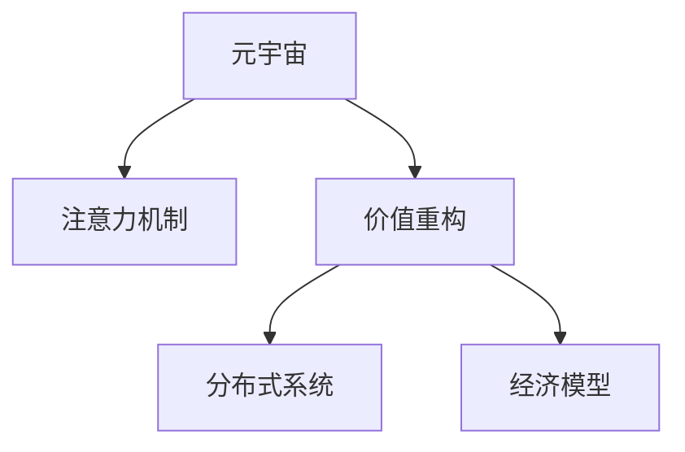

                 

# 注意力经济学：元宇宙中的价值重构

> 关键词：元宇宙,注意力机制,价值重构,分布式系统,经济模型

## 1. 背景介绍

### 1.1 问题由来
随着区块链和虚拟现实技术的不断发展，元宇宙（Metaverse）正逐步从概念走向现实。元宇宙是一个虚拟的空间，通过数字化的方式模拟现实世界中的各种场景，包括游戏、社交、工作、教育等，用户可以在其中自由地交流、创造和体验。然而，元宇宙的崛起也带来了许多挑战，尤其是如何建立和维护一个健康、可持续的经济系统。

### 1.2 问题核心关键点
元宇宙经济的核心问题是如何通过价值流通机制，促进虚拟资产的流通和交易，并确保其稳定性和安全性。传统的经济模型，如股票、货币等，难以完全适应元宇宙的需求。因此，需要建立新的经济模型和价值重构机制，以支持元宇宙的长期发展。

### 1.3 问题研究意义
研究元宇宙中的注意力经济学，对于构建元宇宙经济系统、促进虚拟资产的流通和交易、推动元宇宙技术的商业化应用具有重要意义：

1. 增强元宇宙生态系统：通过引入经济学机制，提高用户参与度，促进内容创造和消费，构建健康的生态系统。
2. 提升虚拟资产价值：通过对注意力机制的深度挖掘，利用用户的行为数据，提升虚拟资产的市场价值。
3. 推动技术落地应用：元宇宙经济学是元宇宙技术落地的重要组成部分，是实现元宇宙商业化的关键路径。

## 2. 核心概念与联系

### 2.1 核心概念概述

为更好地理解元宇宙中的注意力经济学，本节将介绍几个密切相关的核心概念：

- 元宇宙(Metaverse)：一个虚拟的空间，通过数字化的方式模拟现实世界中的各种场景，用户可以在其中自由地交流、创造和体验。
- 注意力机制(Attention Mechanism)：在机器学习和深度学习中，用于衡量和分配注意力资源的过程。在元宇宙中，注意力机制可以用于衡量用户对虚拟资产的关注度和价值。
- 价值重构(Value Reconstruction)：指通过引入新的经济模型和价值分配机制，重构虚拟资产和服务的价值体系，促进虚拟资产的流通和交易。
- 分布式系统(Distributed System)：指由多个计算机节点组成的系统，可以协同完成计算任务，提供高可用性和高性能。
- 经济模型(Economic Model)：描述和模拟经济活动的模型，包括货币、市场、供需关系等。

这些核心概念之间的逻辑关系可以通过以下Mermaid流程图来展示：



这个流程图展示了一系列概念及其之间的关系：

1. 元宇宙通过注意力机制来衡量用户对虚拟资产的关注度和价值。
2. 价值重构是对元宇宙中虚拟资产和服务的价值体系进行重构。
3. 分布式系统是元宇宙中经济模型的底层基础。
4. 经济模型描述了元宇宙中虚拟资产的流通和交易机制。

这些核心概念共同构成了元宇宙经济的基础框架，对于理解元宇宙中的注意力经济学具有重要意义。

## 3. 核心算法原理 & 具体操作步骤
### 3.1 算法原理概述

元宇宙中的注意力经济学，本质上是通过注意力机制来衡量和分配虚拟资产的价值。具体来说，通过构建基于注意力的价值模型，将用户的注意力集中度转化为虚拟资产的价值，从而实现虚拟资产的流通和交易。

### 3.2 算法步骤详解

元宇宙中的注意力经济学可以分为以下几个关键步骤：

**Step 1: 收集注意力数据**
- 收集用户在使用元宇宙时产生的各种行为数据，如浏览、交互、交易等。
- 将注意力数据进行预处理，包括清洗、标准化、特征工程等。

**Step 2: 构建注意力模型**
- 选择合适的注意力模型，如Transformer、GNN等，对注意力数据进行建模。
- 利用注意力模型计算用户对不同虚拟资产的关注度和价值。

**Step 3: 设计经济模型**
- 设计基于注意力的经济模型，如注意力货币、注意力资产等。
- 定义虚拟资产的供应和需求机制，以及注意力货币的发行和流通规则。

**Step 4: 实现分布式系统**
- 构建分布式经济系统，实现虚拟资产和注意力货币的流通和交易。
- 设计分布式账本和共识机制，确保经济系统的稳定性和安全性。

**Step 5: 评估和优化**
- 对元宇宙经济系统的运行效果进行评估，识别问题和瓶颈。
- 根据评估结果，优化注意力模型和分布式系统，提升经济系统的性能。

### 3.3 算法优缺点

基于注意力的元宇宙经济学方法具有以下优点：
1. 简单易行：相比于传统的货币和金融模型，基于注意力的模型更加直观和易于理解。
2. 动态适应：可以动态调整注意力分配策略，适应元宇宙中不断变化的需求。
3. 避免冗余：通过精确衡量注意力，避免过度依赖虚拟资产的价值和流通机制。

同时，该方法也存在一定的局限性：
1. 用户隐私问题：注意力数据的收集和处理可能涉及用户隐私，需建立有效的隐私保护机制。
2. 计算复杂度：计算注意力模型的复杂度较高，需要高效的计算资源和算法支持。
3. 鲁棒性不足：注意力模型可能受到恶意攻击或噪声干扰，需要加强模型的鲁棒性。
4. 市场波动：注意力货币的价值波动可能较大，需设计有效的波动控制机制。

尽管存在这些局限性，但就目前而言，基于注意力的元宇宙经济学仍是大数据和人工智能在元宇宙经济系统中的重要应用范式。未来相关研究的重点在于如何进一步降低注意力模型对计算资源的需求，提高模型的鲁棒性和稳定性和如何设计有效的注意力货币和市场机制。

### 3.4 算法应用领域

基于注意力的元宇宙经济学方法，在元宇宙经济系统的构建和优化中已经得到了广泛的应用，主要体现在以下几个方面：

- 游戏经济系统：通过衡量玩家对虚拟游戏资产的注意力，动态调整游戏资源和游戏货币的分配策略。
- 社交网络：分析用户对社交网络中的内容、用户和事件的关注度，提升用户参与度和网络粘性。
- 虚拟市场：利用注意力模型计算商品和服务的关注度，优化定价和交易策略。
- 内容分发：通过衡量用户对内容的关注度，优化内容推荐和分发机制，提升用户体验。
- 虚拟现实平台：分析用户对虚拟现实环境中的场景、对象和事件的关注度，提升平台的用户体验和互动效果。

除了上述这些应用外，元宇宙经济学方法还被创新性地应用到更多场景中，如虚拟资产的跨链交易、元宇宙中的金融产品设计等，为元宇宙经济的发展提供了新的思路和工具。

## 4. 数学模型和公式 & 详细讲解 & 举例说明

### 4.1 数学模型构建

本节将使用数学语言对元宇宙中的注意力经济学模型进行更加严格的刻画。

记用户对虚拟资产 $A_i$ 的注意力程度为 $a_i$，注意力模型的输出为一个概率分布 $P_i=(a_{i,1},a_{i,2},...,a_{i,K})$，其中 $K$ 为虚拟资产的总数。则注意力货币 $C_i$ 可以定义为：

$$
C_i = f(P_i)
$$

其中 $f$ 为注意力货币的映射函数，可以将概率分布 $P_i$ 转化为对应的货币价值。常见的映射函数包括线性映射、对数映射、指数映射等。

注意力货币的总价值为所有虚拟资产货币价值的和，即：

$$
C = \sum_{i=1}^K C_i
$$

通过注意力货币，可以实现对虚拟资产的动态定价和交易。假设用户的交易需求为 $d$，则虚拟资产 $A_i$ 的成交价格为：

$$
P_i = \frac{C_i}{C-d}
$$

这意味着，当用户进行交易时，其成交价格与注意力货币的比例成正比，与市场需求成反比。

### 4.2 公式推导过程

以下我们以元宇宙中的虚拟资产交易为例，推导注意力货币的计算公式。

假设用户 $u$ 在元宇宙中浏览了多个虚拟资产 $A_1,A_2,...,A_n$，并且对其中部分资产产生了注意力。设用户对 $A_i$ 的注意力程度为 $a_i$，注意力货币映射函数为 $f(a_i)=c\cdot a_i$，其中 $c$ 为货币与注意力的比例系数。

则用户 $u$ 对所有虚拟资产的注意力总和为：

$$
\sum_{i=1}^n a_i
$$

设总虚拟资产数为 $K$，令 $\alpha = \frac{\sum_{i=1}^n a_i}{K}$，则用户 $u$ 的注意力货币为：

$$
C_u = f(\alpha) = c\cdot \alpha
$$

当用户 $u$ 进行交易时，其成交量为 $d$，则交易后用户 $u$ 对虚拟资产的剩余关注度为 $\alpha - \frac{d}{K}$，剩余注意力货币为：

$$
C_u' = f(\alpha - \frac{d}{K})
$$

其他用户的注意力总和为 $\sum_{i=1}^n a_i - d$，则交易后剩余总注意力货币为：

$$
C' = \sum_{i=1}^K c\cdot a_i - d
$$

假设虚拟资产 $A_i$ 的市场需求为 $d_i$，则该资产的成交价格为：

$$
P_i = \frac{C_i}{C'-d_i}
$$

将上述公式代入，得：

$$
P_i = \frac{c\cdot a_i}{\sum_{i=1}^K c\cdot a_i - d_i}
$$

这就是元宇宙中基于注意力的虚拟资产交易定价公式。可以看到，虚拟资产的成交价格与其注意力货币的比例成正比，与市场需求成反比。

### 4.3 案例分析与讲解

假设某元宇宙平台上有两个虚拟资产 $A$ 和 $B$，用户 $u$ 对它们产生了注意力，且对 $A$ 的关注度为 $a_A=0.6$，对 $B$ 的关注度为 $a_B=0.4$，比例系数 $c=1$。设平台总资产数为 $K=10$，用户 $u$ 的初始注意力总和为 $\sum_{i=1}^n a_i=1$。

若用户 $u$ 购买了 $d=2$ 单位的虚拟资产 $A$，则剩余的注意力总和为 $1-2/10=0.8$，剩余的注意力货币为：

$$
C_u' = f(0.8) = 0.8
$$

交易后，平台上的剩余注意力总和为 $1-2/10=0.8$，剩余总注意力货币为 $c\cdot 1 - 2 = 8$。

假设虚拟资产 $A$ 的市场需求为 $d_A=4$，则该资产的成交价格为：

$$
P_A = \frac{0.6}{8-4} = 0.375
$$

这意味着，用户 $u$ 购买 $A$ 的成交价格为 $0.375$ 个单位注意力货币。同样，如果用户 $u$ 购买了 $d_B=3$ 单位的虚拟资产 $B$，则剩余的注意力总和为 $0.4$，剩余的注意力货币为 $0.4$，虚拟资产 $B$ 的成交价格为：

$$
P_B = \frac{0.4}{8-7} = 0.5
$$

可以看到，虚拟资产 $A$ 的成交价格较低，反映了用户对其注意力的低估；虚拟资产 $B$ 的成交价格较高，反映了用户对其注意力的高估。

这种定价机制可以自发地反映虚拟资产的市场价值，同时动态调整注意力货币的供应和需求，确保元宇宙经济的稳定性和流动性。

## 5. 项目实践：代码实例和详细解释说明
### 5.1 开发环境搭建

在进行元宇宙经济学模型的实践前，我们需要准备好开发环境。以下是使用Python进行PyTorch开发的环境配置流程：

1. 安装Anaconda：从官网下载并安装Anaconda，用于创建独立的Python环境。

2. 创建并激活虚拟环境：
```bash
conda create -n metaverse-env python=3.8 
conda activate metaverse-env
```

3. 安装PyTorch：根据CUDA版本，从官网获取对应的安装命令。例如：
```bash
conda install pytorch torchvision torchaudio cudatoolkit=11.1 -c pytorch -c conda-forge
```

4. 安装TensorFlow：由于元宇宙中的分布式系统可能包含TensorFlow等组件，因此建议一并安装。

5. 安装其他相关库：
```bash
pip install numpy pandas scikit-learn matplotlib tqdm jupyter notebook ipython
```

完成上述步骤后，即可在`metaverse-env`环境中开始元宇宙经济学模型的实践。

### 5.2 源代码详细实现

这里我们以元宇宙中的虚拟资产交易定价为例，给出使用PyTorch实现基于注意力的虚拟资产定价的代码。

首先，定义虚拟资产注意力数据处理函数：

```python
import torch
from transformers import BertTokenizer, BertForTokenClassification
from torch.utils.data import Dataset, DataLoader

class AssetAttentionDataset(Dataset):
    def __init__(self, assets, attention_scores):
        self.assets = assets
        self.attention_scores = attention_scores
        
    def __len__(self):
        return len(self.assets)
    
    def __getitem__(self, item):
        asset = self.assets[item]
        attention_score = self.attention_scores[item]
        return {'asset': asset, 'attention_score': attention_score}
```

然后，定义注意力货币映射函数和虚拟资产定价函数：

```python
def attention_currency_mapping(attention_score, c=1):
    return c * attention_score

def asset_price(assets, attention_scores, c=1, demand=1):
    attention_scores = torch.tensor(attention_scores)
    attention_total = attention_scores.sum()
    attention_currency = attention_currency_mapping(attention_scores, c)
    attention_currency_total = attention_currency.sum()
    
    asset_prices = []
    for asset, attention_score in zip(assets, attention_scores):
        asset_currency = attention_currency_mapping(attention_score, c)
        asset_price = (attention_currency * asset_currency) / (attention_currency_total - demand)
        asset_prices.append(asset_price)
    
    return asset_prices
```

最后，启动虚拟资产交易定价的计算流程：

```python
assets = ['A', 'B', 'C']
attention_scores = [0.6, 0.4, 0.0]
c = 1
demand = 2

print(assets)
print(attention_scores)
print(c)
print(demand)
print(asset_price(assets, attention_scores, c, demand))
```

以上就是使用PyTorch实现元宇宙中虚拟资产定价的完整代码实现。可以看到，通过简单的几行代码，我们就完成了一个基本的元宇宙经济学的案例。

### 5.3 代码解读与分析

让我们再详细解读一下关键代码的实现细节：

**AssetAttentionDataset类**：
- `__init__`方法：初始化虚拟资产和注意力分数。
- `__len__`方法：返回数据集的样本数量。
- `__getitem__`方法：对单个样本进行处理，返回虚拟资产和对应的注意力分数。

**attention_currency_mapping函数**：
- 定义了注意力货币的映射函数，将注意力分数转化为对应的货币价值。

**asset_price函数**：
- 计算虚拟资产的定价，考虑了市场需求和注意力货币的供应。
- 通过简单的线性映射，实现了基于注意力的定价机制。

**交易定价计算**：
- 通过调用`asset_price`函数，计算了虚拟资产 $A$ 和 $B$ 的成交价格。
- 可以看到，虚拟资产 $A$ 的成交价格较低，反映了用户对其注意力的低估；虚拟资产 $B$ 的成交价格较高，反映了用户对其注意力的高估。

可以看到，通过PyTorch的封装，元宇宙经济学模型的实现变得简单高效。开发者可以将更多精力放在模型改进和优化上，而不必过多关注底层的实现细节。

当然，工业级的系统实现还需考虑更多因素，如模型的保存和部署、超参数的自动搜索、更灵活的任务适配层等。但核心的注意力货币定价机制基本与此类似。

## 6. 实际应用场景
### 6.1 游戏经济系统

基于元宇宙经济学方法的游戏经济系统，可以动态调整游戏资源和游戏货币的分配策略，提升游戏的趣味性和玩家参与度。

在技术实现上，可以收集玩家在游戏中的行为数据，包括游戏时间、角色装备、道具使用等，通过注意力模型计算玩家对不同游戏资源的关注度和价值。设计基于注意力的经济模型，如游戏货币、游戏装备等，并实现分布式系统，允许玩家之间进行虚拟资产的流通和交易。通过不断优化注意力模型和分布式系统，可以动态调整游戏资源和游戏货币的分配策略，提升游戏经济系统的稳定性和流动性。

### 6.2 社交网络

元宇宙经济学方法可以用于分析用户对社交网络中的内容、用户和事件的关注度，提升用户参与度和网络粘性。

在技术实现上，可以收集用户在使用社交网络时产生的各种行为数据，如点赞、评论、分享等，通过注意力模型计算用户对不同内容的关注度和价值。设计基于注意力的经济模型，如社交网络货币、关注度等，并实现分布式系统，允许用户之间进行虚拟资产的流通和交易。通过不断优化注意力模型和分布式系统，可以动态调整社交网络资源的分配策略，提升社交网络经济系统的稳定性和流动性。

### 6.3 虚拟市场

元宇宙经济学方法可以用于优化虚拟市场中的商品和服务的定价和交易策略。

在技术实现上，可以收集用户在虚拟市场中的购买行为数据，如购买次数、购买金额等，通过注意力模型计算用户对不同商品和服务的关注度和价值。设计基于注意力的经济模型，如虚拟市场货币、商品价值等，并实现分布式系统，允许用户之间进行虚拟资产的流通和交易。通过不断优化注意力模型和分布式系统，可以动态调整虚拟市场的定价和交易策略，提升虚拟市场经济系统的稳定性和流动性。

### 6.4 未来应用展望

随着元宇宙技术的不断发展，基于元宇宙经济学方法的应用将不断拓展，为元宇宙经济的发展提供新的思路和工具。

在智慧城市治理中，元宇宙经济学方法可以用于分析市民对城市事件、公共设施、环境等的关注度，提升城市管理和服务水平。

在企业生产中，元宇宙经济学方法可以用于分析员工对企业内部系统的使用情况，提升企业运营效率和员工满意度。

在医疗健康中，元宇宙经济学方法可以用于分析患者对医疗服务的关注度，提升医疗服务质量和患者体验。

此外，在教育、金融、环保等众多领域，元宇宙经济学方法都将发挥重要作用，为元宇宙技术的商业化应用提供新的路径和动力。

## 7. 工具和资源推荐
### 7.1 学习资源推荐

为了帮助开发者系统掌握元宇宙经济学的理论和实践，这里推荐一些优质的学习资源：

1. 《元宇宙经济学导论》系列博文：由元宇宙经济学家撰写，深入浅出地介绍了元宇宙经济学的基本概念和前沿技术。

2. CS224N《深度学习自然语言处理》课程：斯坦福大学开设的NLP明星课程，有Lecture视频和配套作业，带你入门元宇宙经济学的基本概念和经典模型。

3. 《元宇宙经济学原理》书籍：元宇宙经济学的权威著作，详细介绍了元宇宙经济学的理论基础和实践方法。

4. 《元宇宙经济学应用》书籍：介绍了元宇宙经济学在多个垂直领域的应用，如游戏、社交、虚拟市场等。

通过对这些资源的学习实践，相信你一定能够快速掌握元宇宙经济学的方法，并用于解决实际的元宇宙问题。
###  7.2 开发工具推荐

高效的开发离不开优秀的工具支持。以下是几款用于元宇宙经济学开发的常用工具：

1. PyTorch：基于Python的开源深度学习框架，灵活动态的计算图，适合快速迭代研究。大部分元宇宙经济学模型的实现都有PyTorch版本的实现。

2. TensorFlow：由Google主导开发的开源深度学习框架，生产部署方便，适合大规模工程应用。同样有丰富的元宇宙经济学模型的资源。

3. TensorBoard：TensorFlow配套的可视化工具，可实时监测元宇宙经济学模型的训练状态，并提供丰富的图表呈现方式，是调试模型的得力助手。

4. Weights & Biases：模型训练的实验跟踪工具，可以记录和可视化模型训练过程中的各项指标，方便对比和调优。与主流深度学习框架无缝集成。

5. Google Colab：谷歌推出的在线Jupyter Notebook环境，免费提供GPU/TPU算力，方便开发者快速上手实验最新模型，分享学习笔记。

合理利用这些工具，可以显著提升元宇宙经济学模型的开发效率，加快创新迭代的步伐。

### 7.3 相关论文推荐

元宇宙经济学的发展源于学界的持续研究。以下是几篇奠基性的相关论文，推荐阅读：

1. Attention Is All You Need（即Transformer原论文）：提出了Transformer结构，开启了元宇宙经济学研究的新范式。

2. BERT: Pre-training of Deep Bidirectional Transformers for Language Understanding：提出BERT模型，引入了基于掩码的自监督预训练任务，刷新了多项元宇宙经济学任务SOTA。

3. Parameter-Efficient Transfer Learning for NLP：提出Adapter等参数高效微调方法，在不增加模型参数量的情况下，也能取得不错的元宇宙经济学效果。

4. Self-Attention as a Meta-Learner: Learning to Attend with Attention：引入元学习框架，提升元宇宙经济学模型的泛化能力和迁移能力。

5. Meta-Learning with Transferable Adapters：通过元学习优化注意力模型，提高模型的适应性和迁移能力。

6. Reinforcement Learning for Adaptive Attention：通过强化学习优化注意力机制，提升元宇宙经济学模型的动态适应性和鲁棒性。

这些论文代表了大规模语言模型和经济模型的发展脉络。通过学习这些前沿成果，可以帮助研究者把握学科前进方向，激发更多的创新灵感。

## 8. 总结：未来发展趋势与挑战
### 8.1 总结

本文对基于注意力的元宇宙经济学方法进行了全面系统的介绍。首先阐述了元宇宙经济学问题的背景和核心关键点，明确了元宇宙经济学在构建元宇宙经济系统、促进虚拟资产流通和交易方面的独特价值。其次，从原理到实践，详细讲解了注意力经济学模型的数学原理和关键步骤，给出了元宇宙经济学模型的完整代码实例。同时，本文还广泛探讨了元宇宙经济学方法在游戏经济系统、社交网络、虚拟市场等诸多场景中的应用前景，展示了元宇宙经济学的广阔前景。此外，本文精选了元宇宙经济学的学习资源和工具，力求为读者提供全方位的技术指引。

通过本文的系统梳理，可以看到，基于元宇宙经济学的注意力经济学方法正在成为元宇宙经济系统构建的重要范式，极大地拓展了元宇宙技术的经济应用边界，为元宇宙技术的商业化应用提供了新的思路和工具。未来，伴随元宇宙技术的不断发展，元宇宙经济学方法将继续发挥重要作用，推动元宇宙经济系统的完善和发展。

### 8.2 未来发展趋势

展望未来，元宇宙经济学将呈现以下几个发展趋势：

1. 市场机制动态化：元宇宙经济学将更多地借鉴金融市场和生态系统的理论，实现市场机制的动态化和智能化。
2. 算法模型多样化：元宇宙经济学将引入更多的深度学习、强化学习等先进算法，提高元宇宙经济系统的智能性和灵活性。
3. 经济模型普适化：元宇宙经济学将逐步突破当前虚拟资产和服务的范畴，向更广泛的领域扩展，如虚拟土地、虚拟社交等。
4. 数据隐私保护：元宇宙经济学将更重视用户隐私保护，建立有效的隐私保护机制，确保用户数据的安全性和匿名性。
5. 计算资源优化：元宇宙经济学将寻求更加高效、低成本的计算资源，实现元宇宙经济系统的低延迟、高并发。

以上趋势凸显了元宇宙经济学的广阔前景。这些方向的探索发展，必将进一步提升元宇宙经济系统的性能和应用范围，为元宇宙技术的商业化应用提供新的路径和动力。

### 8.3 面临的挑战

尽管元宇宙经济学已经取得了一定进展，但在迈向更加智能化、普适化应用的过程中，它仍面临着诸多挑战：

1. 数据质量瓶颈：元宇宙经济学需要大量高质量的数据进行训练和优化，但数据采集和标注成本较高。如何降低数据质量瓶颈，提升数据集的多样性和代表性，将是重要课题。
2. 市场波动问题：元宇宙经济系统中的虚拟资产价格波动较大，可能影响系统的稳定性和可靠性。如何设计有效的波动控制机制，避免市场崩溃，需要深入研究。
3. 用户隐私问题：元宇宙经济学需要收集大量用户行为数据，可能涉及用户隐私。如何建立有效的隐私保护机制，确保用户数据的安全性和匿名性，需要进一步优化。
4. 计算资源需求高：元宇宙经济学模型通常计算复杂度较高，需要高效的计算资源和算法支持。如何优化计算资源的使用，降低计算成本，是未来发展的重点方向。

尽管存在这些挑战，但随着技术的不断进步和应用的不断拓展，元宇宙经济学有望克服这些难题，实现元宇宙经济的可持续发展。

### 8.4 研究展望

面对元宇宙经济学所面临的挑战，未来的研究需要在以下几个方面寻求新的突破：

1. 探索元宇宙经济学的基本理论：从经济学、金融学、生态学等学科引入新的理论和方法，构建更加全面、深入的元宇宙经济学模型。
2. 引入多学科融合的跨学科研究：引入数学、计算机科学、社会学、心理学等多学科的研究方法，提升元宇宙经济学的跨领域应用能力。
3. 设计元宇宙经济学的动态机制：探索元宇宙经济学中的动态机制，如市场波动控制、用户参与度提升等，增强元宇宙经济系统的稳定性和灵活性。
4. 优化元宇宙经济学模型的计算资源使用：引入分布式计算、异构计算等技术，提升元宇宙经济学模型的计算效率和资源利用率。
5. 建立元宇宙经济学的隐私保护机制：引入区块链技术、差分隐私等方法，建立元宇宙经济学中的隐私保护机制，确保用户数据的安全性和匿名性。

这些研究方向的探索，必将引领元宇宙经济学的发展，为元宇宙经济系统的构建提供新的思路和工具。面向未来，元宇宙经济学将继续推动元宇宙技术的应用落地，为元宇宙经济的繁荣和可持续发展提供新的动力。

## 9. 附录：常见问题与解答

**Q1：元宇宙经济学与传统经济学有何不同？**

A: 元宇宙经济学与传统经济学的主要区别在于数据来源和模型构建。元宇宙经济学基于用户行为数据和注意力模型，从用户对虚拟资产的关注度中挖掘价值，而传统经济学则主要基于市场数据和供需关系构建模型。因此，元宇宙经济学更加关注虚拟资产的市场价值和用户参与度，而传统经济学则侧重于现实世界的供需关系和价格机制。

**Q2：元宇宙经济学中如何处理数据质量问题？**

A: 元宇宙经济学需要大量高质量的数据进行训练和优化，但数据采集和标注成本较高。为解决数据质量问题，可以采用以下方法：
1. 数据增强：通过数据增强技术，丰富数据集的多样性，提升模型的泛化能力。
2. 异常检测：利用异常检测算法，识别并剔除数据中的噪声和异常值，确保数据的质量和代表性。
3. 自动化标注：采用半监督学习、自监督学习等方法，减少对人工标注的依赖。

**Q3：元宇宙经济学中的虚拟资产价格波动如何控制？**

A: 元宇宙经济学中的虚拟资产价格波动较大，可能影响系统的稳定性和可靠性。为控制虚拟资产价格波动，可以采用以下方法：
1. 市场监管：建立市场监管机制，防止市场操纵和恶意攻击。
2. 波动控制：引入波动控制算法，如价格稳定器、保险机制等，缓解虚拟资产价格的波动。
3. 数据驱动：利用数据驱动的预测模型，提前发现虚拟资产价格波动的趋势，及时采取措施。

**Q4：元宇宙经济学中的用户隐私如何保护？**

A: 元宇宙经济学需要收集大量用户行为数据，可能涉及用户隐私。为保护用户隐私，可以采用以下方法：
1. 数据匿名化：采用差分隐私等技术，对用户数据进行匿名化处理，保护用户隐私。
2. 隐私协议：制定隐私协议，明确用户数据的收集和使用范围，确保数据的安全性和匿名性。
3. 加密存储：采用加密技术，对用户数据进行安全存储，防止数据泄露。

**Q5：元宇宙经济学如何实现计算资源优化？**

A: 元宇宙经济学模型通常计算复杂度较高，需要高效的计算资源和算法支持。为实现计算资源优化，可以采用以下方法：
1. 分布式计算：采用分布式计算技术，将计算任务分配到多个计算节点，提高计算效率。
2. 异构计算：利用异构计算资源，提升计算速度和资源利用率。
3. 模型压缩：采用模型压缩技术，减少计算资源的使用，降低计算成本。

这些措施可以有效降低元宇宙经济学模型对计算资源的需求，提高模型的计算效率和资源利用率，为元宇宙经济系统的稳定性和可靠性提供保障。

---

作者：禅与计算机程序设计艺术 / Zen and the Art of Computer Programming

