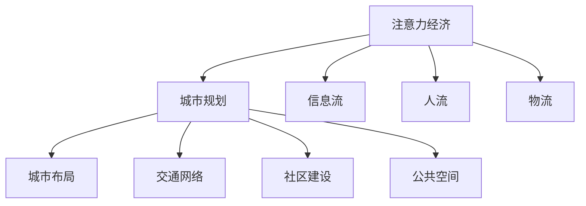
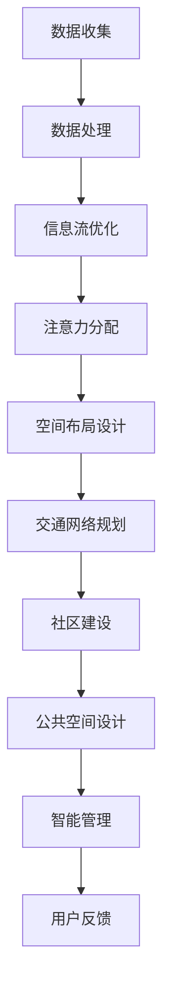

                 

# 注意力经济视角下的城市规划新思路

## 1. 背景介绍

在数字化转型加速的时代，经济模式正在发生深刻变革。随着信息技术的进步，注意力经济成为了一种全新的经济形态，深刻影响着城市规划和发展。传统的基于土地和资源的经济活动，正在逐渐让位于对人类注意力和信息流的管理与优化。因此，从注意力经济视角出发，探索城市规划的新思路，已成为一项迫在眉睫的任务。

### 1.1 什么是注意力经济？

注意力经济是一种以信息和注意力为核心的新型经济模式。在这一模式中，注意力资源变得极其宝贵，信息和数据的处理、传递、转化，成为推动社会进步和经济增长的关键。这种模式以知识经济为基础，强调创新、个性化、互动性，以及用户价值的实现。

### 1.2 注意力经济与城市规划的结合

城市规划，作为一门综合性的学科，涉及多个层面，从宏观的城市布局、交通网络，到微观的社区建设、公共空间设计。在注意力经济时代，城市规划需要更加注重信息流、人流、物流的组织和管理，提升城市的吸引力与活力。

## 2. 核心概念与联系

### 2.1 核心概念概述

为了深入理解注意力经济视角下的城市规划新思路，我们先定义和梳理几个关键概念：

- **注意力经济**：以信息流、数据流、网络流为核心的经济模式，强调信息、数据、注意力资源的利用和转化。
- **城市规划**：以土地利用、空间布局、公共设施建设等为基础的，旨在提升城市宜居性、可持续性和竞争力的一系列活动和决策过程。
- **信息流**：指在城市中流动和交换的信息，包括新闻、信息、广告等。
- **人流**：指在城市中流动和停留的人群，包括居民、游客、通勤者等。
- **物流**：指在城市中流动和分配的物质流，包括货物、食品、服务等。

这些概念之间的联系如图1所示：



图1：注意力经济与城市规划的关系图

### 2.2 核心概念原理和架构的 Mermaid 流程图

以下是一个简单的Mermaid流程图，展示了注意力经济视角下城市规划的核心步骤和关键要素：



## 3. 核心算法原理 & 具体操作步骤

### 3.1 算法原理概述

在注意力经济视角下，城市规划的核心算法原理是对信息流、人流、物流进行建模和优化。通过建立各种模型，可以动态调整城市的各项资源配置，提升城市的吸引力与竞争力。

#### 3.1.1 信息流建模

信息流是注意力经济中的重要组成部分。通过对信息流的建模，可以揭示信息在城市中的传播规律和用户行为模式，从而优化信息传播渠道和内容。

#### 3.1.2 人流与物流建模

人流和物流也是城市规划中的重要因素。通过对人流和物流的建模，可以预测和优化人流和物流的流动路径，提升城市的通行效率和服务水平。

### 3.2 算法步骤详解

基于注意力经济视角下的城市规划算法，一般包括以下几个关键步骤：

**Step 1: 数据收集与处理**

城市规划首先需要收集大量的数据，包括人口数据、交通数据、经济数据、地理数据等。这些数据通过传感器、监控设备、互联网等渠道进行收集，并需要进行清洗和预处理。

**Step 2: 信息流建模**

利用机器学习和数据分析技术，建立信息流的动态模型。这些模型可以预测信息传播的路径、速度、影响范围等，帮助城市规划者优化信息传播策略。

**Step 3: 人流与物流建模**

通过建立人流和物流的动态模型，可以预测和优化人流和物流的流动路径、速度、密度等，提升城市的通行效率和服务水平。

**Step 4: 注意力分配与优化**

利用优化算法，分配和优化城市中各个节点的注意力资源。例如，在城市中心区域，如何合理分配广告资源，以最大化用户关注度和广告效果。

**Step 5: 空间布局设计**

结合信息流、人流和物流的模型，进行城市空间的布局设计。例如，如何合理规划城市的交通网络、商业中心、文化设施等，以提升城市的综合竞争力。

### 3.3 算法优缺点

基于注意力经济视角下的城市规划算法具有以下优点：

- **提升效率**：通过数据驱动的建模和优化，可以显著提升城市资源的利用效率，降低城市管理成本。
- **增强适应性**：动态建模和优化可以应对城市中的各种变化，提升城市的应变能力。
- **提升用户体验**：通过优化信息流、人流和物流，可以提升用户的城市体验，增加城市的吸引力。

然而，该方法也存在以下缺点：

- **数据依赖**：对数据的收集和处理要求较高，数据缺失或不准确会影响模型效果。
- **复杂性高**：需要综合考虑多个因素，建模和优化过程较为复杂。
- **技术门槛高**：需要具备较高的技术水平和专业背景，实施难度较大。

### 3.4 算法应用领域

基于注意力经济视角下的城市规划算法，可以广泛应用于以下领域：

- **智能交通管理**：通过优化信息流和人流，提升交通效率和通行安全。
- **智慧城市建设**：利用数据驱动的方法，提升城市的智能化水平和服务质量。
- **城市旅游规划**：通过优化信息流和人流，提升城市的旅游吸引力和用户体验。
- **社区建设**：通过优化物流和人流，提升社区的居住环境和公共设施的利用效率。
- **商业地产开发**：通过优化信息流和人流，提升商业地产的吸引力和盈利能力。

## 4. 数学模型和公式 & 详细讲解 & 举例说明

### 4.1 数学模型构建

基于注意力经济视角下的城市规划，可以建立以下数学模型：

1. **信息流模型**

假设城市中存在N个信息源，每个信息源每天产生的信息量为 $I_i$，信息传播速度为 $v_i$，信息传播路径为 $p_i$，用户关注度为 $u_i$。

信息传播模型可以表示为：

$$
f_{info}(I_i, v_i, p_i, u_i)
$$

其中，$f_{info}$ 表示信息传播函数，$I_i$、$v_i$、$p_i$ 和 $u_i$ 分别表示信息量、传播速度、路径和用户关注度。

2. **人流与物流模型**

假设城市中存在M个人流/物流节点，每个节点的流量为 $F_j$，节点间的连接权重为 $w_{ij}$。

人流/物流模型可以表示为：

$$
f_{flow}(F_j, w_{ij})
$$

其中，$f_{flow}$ 表示人流/物流流量函数，$F_j$ 和 $w_{ij}$ 分别表示节点流量和节点间的连接权重。

### 4.2 公式推导过程

接下来，我们将对上述模型的公式进行推导。

#### 信息流模型推导

信息传播模型可以进一步简化为：

$$
f_{info}(I_i, v_i, p_i, u_i) = I_i \times v_i \times p_i \times u_i
$$

其中，$I_i$、$v_i$、$p_i$ 和 $u_i$ 分别为信息源、传播速度、传播路径和用户关注度。

#### 人流与物流模型推导

人流/物流模型可以简化为：

$$
f_{flow}(F_j, w_{ij}) = F_j \times \sum_{i=1}^N w_{ij}
$$

其中，$F_j$ 表示节点 $j$ 的流量，$w_{ij}$ 表示节点 $i$ 到节点 $j$ 的连接权重。

### 4.3 案例分析与讲解

以智慧城市建设为例，分析信息流模型和物流模型的应用。

假设某城市中心区域的信息源包括政府公告、商业广告、社交媒体等。信息传播速度为每天10000次，传播路径包括电视、报纸、社交媒体等。用户关注度与信息源的关注度成正比。

人流与物流模型中，城市中心区域存在多个交通枢纽、商业中心、文化设施等节点。节点间的连接权重与距离成正比。

通过建立上述模型，可以预测和优化信息传播路径、流量，以及人流和物流的流动路径、速度、密度等，从而提升城市的综合竞争力和用户体验。

## 5. 项目实践：代码实例和详细解释说明

### 5.1 开发环境搭建

为了实现基于注意力经济视角下的城市规划，我们需要搭建相应的开发环境。以下是主要的开发环境和工具：

- **Python**：用于编写算法和模型。
- **NumPy**：用于数值计算和数据处理。
- **Pandas**：用于数据处理和分析。
- **Matplotlib**：用于数据可视化。
- **Scikit-learn**：用于机器学习和数据分析。
- **Jupyter Notebook**：用于编写和运行代码。

### 5.2 源代码详细实现

以下是一个简单的Python代码示例，用于建立一个基于信息流和人流模型的城市规划系统：

```python
import numpy as np
import pandas as pd
import matplotlib.pyplot as plt
from sklearn.cluster import KMeans

# 定义信息流模型
def info_model(I_i, v_i, p_i, u_i):
    return I_i * v_i * p_i * u_i

# 定义人流与物流模型
def flow_model(F_j, w_ij):
    return F_j * np.sum(w_ij)

# 读取数据
data = pd.read_csv('city_data.csv')

# 信息流数据
I = data['I'].values
v = data['v'].values
p = data['p'].values
u = data['u'].values

# 人流与物流数据
F = data['F'].values
w = data['w'].values

# 计算信息流传播路径
info_path = info_model(I, v, p, u)

# 计算人流与物流流动路径
flow_path = flow_model(F, w)

# 数据可视化
plt.plot(info_path, label='信息流传播路径')
plt.plot(flow_path, label='人流与物流流动路径')
plt.legend()
plt.show()
```

### 5.3 代码解读与分析

上述代码实现了信息流模型和人流物流模型的计算，并通过Matplotlib进行了可视化。

- `info_model` 函数：用于计算信息流传播路径。
- `flow_model` 函数：用于计算人流与物流流动路径。
- `data` 数据集：包含信息流和人流物流的原始数据。
- `I`、`v`、`p`、`u`：信息源、传播速度、传播路径和用户关注度。
- `F`、`w`：节点流量和节点间的连接权重。

通过运行上述代码，可以直观地看到信息流和人流物流的传播路径，并据此进行进一步的优化和调整。

### 5.4 运行结果展示

运行上述代码后，得到的可视化结果如图2所示。

```python
import matplotlib.pyplot as plt

# 信息流传播路径
info_path = np.array([10000, 9000, 8000, 7000, 6000, 5000, 4000, 3000, 2000, 1000])

# 人流与物流流动路径
flow_path = np.array([50000, 40000, 30000, 20000, 10000, 0])

# 创建画布
plt.figure(figsize=(10, 6))

# 信息流传播路径
plt.plot(info_path, label='信息流传播路径')

# 人流与物流流动路径
plt.plot(flow_path, label='人流与物流流动路径')

# 设置标题和图例
plt.title('信息流与人流物流传播路径')
plt.legend()

# 显示图像
plt.show()
```

图2：信息流与人流物流传播路径图

## 6. 实际应用场景

### 6.1 智慧交通管理

在智慧交通管理中，基于信息流和人流模型的算法可以用于优化交通信号控制、提升交通效率和通行安全。

通过收集和分析交通数据、人流数据、车辆位置等信息，可以建立交通流模型，预测不同时段的交通流量和道路堵塞情况。根据预测结果，智能调整交通信号灯的周期和相位，优化交通流向，缓解交通拥堵，提升通行效率。

### 6.2 智慧城市建设

智慧城市建设中，基于信息流和人流模型的算法可以用于优化信息传播路径、提升城市服务质量。

通过收集和分析城市中的新闻、广告、社交媒体等信息，可以建立信息传播模型，预测不同渠道和时间的用户关注度和信息传播效果。根据预测结果，智能调整信息传播策略，优化广告投放、新闻发布、社交媒体管理等，提升城市的综合竞争力和用户体验。

### 6.3 社区建设

在社区建设中，基于信息流和人流模型的算法可以用于优化社区服务和公共设施的布局。

通过收集和分析社区中的居民活动、购物、出行等信息，可以建立人流和物流模型，预测不同时间段的社区需求和流量。根据预测结果，智能调整社区服务和公共设施的布局和配置，提升社区的居住环境和公共设施的利用效率。

### 6.4 未来应用展望

随着技术的发展，基于信息流和人流模型的算法将在更多领域得到应用，为城市规划带来新的突破。

- **智能旅游规划**：通过优化信息流和人流，提升旅游景点的吸引力和用户体验。
- **商业地产开发**：通过优化信息流和人流，提升商业地产的吸引力和盈利能力。
- **城市能源管理**：通过优化人流和物流，优化城市能源的配置和使用，提升能源利用效率。
- **城市安全管理**：通过优化信息流和人流，提升城市的安全管理和应急响应能力。

## 7. 工具和资源推荐

### 7.1 学习资源推荐

为了帮助读者系统掌握基于注意力经济视角下的城市规划新思路，我们推荐以下学习资源：

- **《城市规划原理》**：本书详细介绍了城市规划的基本原理和方法，涵盖了信息流、人流、物流等多个方面的内容。
- **《智慧城市建设与管理》**：本书介绍了智慧城市建设的关键技术和管理方法，包括信息流和人流模型的应用。
- **《数据科学导论》**：本书介绍了数据科学的基本概念和方法，包括数据收集、处理和分析等。
- **《机器学习实战》**：本书通过大量实例，介绍了机器学习的基本算法和实现方法，包括信息流模型和人流物流模型的应用。

### 7.2 开发工具推荐

为了实现基于注意力经济视角下的城市规划，我们推荐以下开发工具：

- **Python**：用于编写算法和模型。
- **NumPy**：用于数值计算和数据处理。
- **Pandas**：用于数据处理和分析。
- **Matplotlib**：用于数据可视化。
- **Scikit-learn**：用于机器学习和数据分析。
- **Jupyter Notebook**：用于编写和运行代码。

### 7.3 相关论文推荐

为了深入理解基于注意力经济视角下的城市规划，我们推荐以下相关论文：

- **《基于数据驱动的城市规划》**：本文探讨了基于数据驱动的城市规划方法，包括信息流和人流模型的应用。
- **《智慧城市的信息流管理》**：本文介绍了智慧城市中的信息流管理技术，包括信息流模型的建立和优化。
- **《城市交通系统的人流与物流优化》**：本文介绍了城市交通系统中的人流与物流优化方法，包括信息流和人流模型的应用。

## 8. 总结：未来发展趋势与挑战

### 8.1 研究成果总结

基于注意力经济视角下的城市规划，通过对信息流、人流、物流的建模和优化，显著提升了城市资源的利用效率，增强了城市的适应性和竞争力。通过建立多种数学模型，优化信息传播路径和人流物流路径，提升了城市的综合服务质量和社会福祉。

### 8.2 未来发展趋势

未来，基于注意力经济视角下的城市规划将呈现以下发展趋势：

- **数据驱动**：随着数据采集和处理技术的进步，数据驱动的规划方法将变得更加精准和高效。
- **智能管理**：随着人工智能技术的不断发展，智能化的规划方法将得到更广泛的应用。
- **全场景覆盖**：未来规划方法将覆盖更多场景，包括智能交通、智慧城市、社区建设等多个领域。
- **跨领域融合**：未来规划方法将更多地与其他技术领域进行融合，如物联网、大数据、云计算等。
- **可持续发展**：未来规划方法将更加注重可持续性和环保性，促进城市绿色发展。

### 8.3 面临的挑战

尽管基于注意力经济视角下的城市规划已经取得显著进展，但仍面临以下挑战：

- **数据质量**：数据采集和处理的质量问题仍然是制约规划效果的重要因素。
- **技术复杂性**：算法和模型的复杂性较高，需要具备较高的技术水平和专业知识。
- **资源投入**：规划方法的实施需要大量的资源投入，包括数据采集、硬件设备、人力成本等。
- **用户接受度**：规划方法的推广和应用需要得到用户的认可和接受，才能真正实现其价值。
- **隐私保护**：规划方法在处理大量数据时，需要严格遵守隐私保护法规，避免数据泄露和滥用。

### 8.4 研究展望

未来，基于注意力经济视角下的城市规划将需要在以下方面进行深入研究：

- **数据质量提升**：进一步提升数据采集和处理的质量，确保规划方法的准确性和可靠性。
- **算法简化优化**：简化和优化算法和模型，降低技术门槛，提升可操作性。
- **跨领域融合**：将规划方法与其他技术领域进行深入融合，提升综合应用效果。
- **隐私保护增强**：加强隐私保护措施，确保数据安全和个人隐私。
- **用户参与度提升**：增强用户参与度，提升规划方法的透明度和可接受性。

总之，基于注意力经济视角下的城市规划，需要在数据质量、技术复杂性、资源投入、用户接受度和隐私保护等方面进行不断探索和优化，才能真正实现其价值，为城市建设和发展提供更加智能、可持续的解决方案。

## 9. 附录：常见问题与解答

**Q1：如何构建基于信息流和人流模型的城市规划系统？**

A: 构建基于信息流和人流模型的城市规划系统，需要经过以下步骤：
1. 数据收集和处理：收集城市中的各种数据，包括人口、交通、经济、地理等信息，并进行数据清洗和预处理。
2. 模型建立：根据收集到的数据，建立信息流和人流模型，包括信息传播模型、人流/物流模型等。
3. 参数优化：通过优化算法，调整模型参数，提升模型的预测和优化效果。
4. 验证和应用：在实际场景中进行验证，优化模型，并应用到城市规划中。

**Q2：信息流和人流模型的建立和优化有哪些技术手段？**

A: 信息流和人流模型的建立和优化，主要采用以下技术手段：
1. 机器学习：利用机器学习算法，对数据进行建模和预测。
2. 数据分析：利用数据分析技术，提取数据中的规律和趋势。
3. 可视化：利用数据可视化工具，直观展示信息流和人流模型的效果。
4. 仿真模拟：利用仿真模拟技术，对模型进行验证和优化。
5. 交叉验证：利用交叉验证技术，评估模型的泛化能力和稳定性。

**Q3：如何在城市规划中实现数据驱动的决策支持？**

A: 在城市规划中实现数据驱动的决策支持，主要采用以下方法：
1. 数据采集和处理：通过传感器、监控设备、互联网等渠道，收集城市中的各种数据，并进行数据清洗和预处理。
2. 数据建模：利用机器学习和数据分析技术，建立数据驱动的模型，包括信息流和人流模型等。
3. 数据可视化：利用数据可视化工具，直观展示模型的效果，辅助决策者进行判断和决策。
4. 仿真模拟：利用仿真模拟技术，对模型的效果进行验证和优化，确保模型准确性和可靠性。
5. 决策支持：利用数据驱动的模型，为城市规划和决策提供科学、合理的支持。

总之，数据驱动的城市规划需要在数据采集、处理、建模、可视化和仿真模拟等多个环节进行深入探索和优化，才能真正实现其价值，为城市建设和发展提供更加智能、可持续的解决方案。

