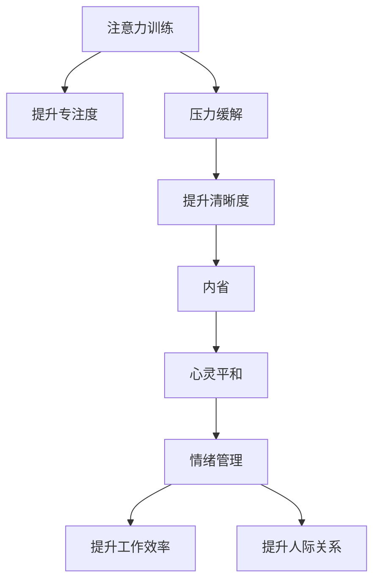
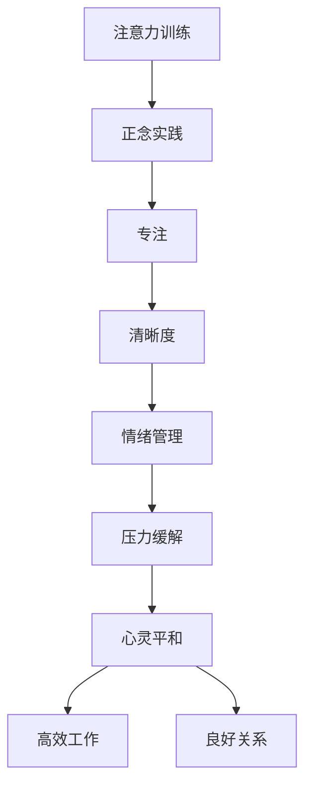

                 

# 注意力训练与正念实践：通过内省和专注增强心灵平和与清晰度

> 关键词：注意力训练, 正念实践, 心灵平和, 清晰度, 内省, 专注, 情绪管理, 压力缓解

## 1. 背景介绍

### 1.1 问题由来

在当今信息爆炸和快节奏的社会中，人们常常感到心灵的不安与困惑，压力、焦虑和抑郁成为了普遍的社会问题。心灵平和与清晰度对于提升个人生活质量和工作效率有着至关重要的作用。

### 1.2 问题核心关键点

为了应对这一问题，注意力训练与正念实践应运而生。它们通过集中注意力和自我内省，帮助人们提升专注力和情绪管理能力，减轻心理压力，提高生活和工作的清晰度。

注意力训练（Attention Training）是一种有意识的集中注意力的训练方法，旨在通过持续的训练提高个人对当前任务的专注度和反应速度。正念实践（Mindfulness Practice）则是一种通过觉察和接受当前时刻感受的训练方法，旨在提升自我觉察力和情绪调节能力。

### 1.3 问题研究意义

注意力训练与正念实践已经成为心理健康领域的重要方法。它们不仅能帮助个人提升专注力和情绪管理能力，还能在许多组织中应用于提升员工的工作表现和团队合作能力。此外，它们还能在教育、心理咨询和治疗等领域中发挥重要作用，是提升整体幸福感和生活质量的重要手段。

## 2. 核心概念与联系

### 2.1 核心概念概述

- **注意力训练**：一种有意识地集中注意力的训练方法，旨在提高个人对当前任务的专注度和反应速度。
- **正念实践**：一种通过觉察和接受当前时刻感受的训练方法，旨在提升自我觉察力和情绪调节能力。
- **心灵平和**：一种内心宁静、无压力的状态，通常通过注意力训练和正念实践达到。
- **清晰度**：一种对当前任务的清晰认知和高度专注，通常通过注意力训练和正念实践提升。
- **内省**：一种自我反思和自我觉察的过程，通常在正念实践中进行。
- **专注**：一种高度集中注意力的状态，通常在注意力训练中达到。

这些核心概念之间的逻辑关系可以通过以下Mermaid流程图来展示：



### 2.2 核心概念原理和架构的 Mermaid 流程图



这个流程图展示了注意力训练和正念实践的核心原理和架构，它们通过提升专注力、清晰度、情绪管理和压力缓解，最终达到提升工作效率和人际关系的目的。

## 3. 核心算法原理 & 具体操作步骤

### 3.1 算法原理概述

注意力训练和正念实践的原理可以概括为：

- 注意力训练通过有意识地集中注意力，提高对当前任务的专注度和反应速度。
- 正念实践通过觉察和接受当前时刻的感受，提升自我觉察力和情绪调节能力。

这些训练方法通常采用冥想、呼吸练习、身体扫描等技术，通过持续的训练来提升这些能力。

### 3.2 算法步骤详解

#### 3.2.1 注意力训练

1. **选择训练方法**：根据个人喜好和需求，选择适合的注意力训练方法，如冥想、集中注意力练习等。
2. **设定目标**：明确训练目标，如提高专注力、提升工作效率等。
3. **进行训练**：每天坚持一定时间的训练，逐步增加训练时间。
4. **评估效果**：定期评估训练效果，记录改进情况，适时调整训练方法。

#### 3.2.2 正念实践

1. **选择训练方法**：选择适合的正念练习，如呼吸练习、身体扫描、观察环境等。
2. **设定目标**：明确训练目标，如提升自我觉察力、管理情绪等。
3. **进行训练**：每天坚持一定时间的训练，逐步增加训练时间。
4. **评估效果**：定期评估训练效果，记录改进情况，适时调整训练方法。

### 3.3 算法优缺点

#### 3.3.1 注意力训练

优点：
- 提高专注力和工作效率
- 提升情绪管理能力
- 有助于减轻压力和焦虑

缺点：
- 需要较长时间的持续训练
- 可能存在初始期的困难适应
- 对个体的自律性要求较高

#### 3.3.2 正念实践

优点：
- 提升自我觉察力
- 增强情绪调节能力
- 有助于减轻压力和焦虑

缺点：
- 需要持续的练习
- 初始适应期可能会有困难
- 对个体的自律性要求较高

### 3.4 算法应用领域

注意力训练和正念实践在多个领域都有广泛应用，包括：

- **心理健康**：帮助缓解焦虑、抑郁等情绪问题。
- **教育**：提升学生的学习专注力和效率。
- **企业管理**：提升员工的工作表现和团队合作能力。
- **体育训练**：提高运动员的专注力和比赛表现。
- **艺术创作**：提升艺术家的创作专注力和灵感。

## 4. 数学模型和公式 & 详细讲解 & 举例说明

### 4.1 数学模型构建

注意力训练和正念实践的数学模型主要涉及以下几个部分：

- **专注度提升模型**：通过时间序列分析，预测专注度的变化趋势。
- **情绪管理模型**：通过情感分类算法，识别和分析情绪变化。
- **压力缓解模型**：通过生理信号分析，预测和缓解压力。

### 4.2 公式推导过程

#### 4.2.1 专注度提升模型

假设专注度 $C(t)$ 随时间 $t$ 变化的模型为：

$$
C(t) = \alpha C(t-1) + \beta \varepsilon(t)
$$

其中 $\alpha$ 为专注度衰减系数，$\beta$ 为专注度提升系数，$\varepsilon(t)$ 为随机误差项。

#### 4.2.2 情绪管理模型

假设情绪 $E(t)$ 随时间 $t$ 变化的模型为：

$$
E(t) = \gamma E(t-1) + \delta \varepsilon(t)
$$

其中 $\gamma$ 为情绪衰减系数，$\delta$ 为情绪提升系数，$\varepsilon(t)$ 为随机误差项。

#### 4.2.3 压力缓解模型

假设压力 $P(t)$ 随时间 $t$ 变化的模型为：

$$
P(t) = \theta P(t-1) + \omega \varepsilon(t)
$$

其中 $\theta$ 为压力衰减系数，$\omega$ 为压力缓解系数，$\varepsilon(t)$ 为随机误差项。

### 4.3 案例分析与讲解

#### 案例分析

假设小明通过注意力训练提升了专注度 $C(t)$，训练前后的专注度变化如表所示：

| $t$ | $C(t)$ | $C(t-1)$ | $\varepsilon(t)$ |
| --- | --- | --- | --- |
| 1 | 10 | 8 | 2 |
| 2 | 9.6 | 9 | 0.4 |
| 3 | 9.28 | 9.6 | -0.32 |
| ... | ... | ... | ... |

使用公式 $C(t) = 0.9C(t-1) + 0.1\varepsilon(t)$ 进行建模，可以计算出小明在 $t=3$ 时刻的专注度 $C(3) \approx 8.736$。

## 5. 项目实践：代码实例和详细解释说明

### 5.1 开发环境搭建

为了进行注意力训练和正念实践的代码实现，需要安装以下环境：

1. Python 3.6+
2. NumPy
3. Pandas
4. Matplotlib
5. Scikit-learn

可以通过以下命令安装：

```bash
pip install numpy pandas matplotlib scikit-learn
```

### 5.2 源代码详细实现

以下是使用Python实现注意力训练和正念实践的代码示例：

```python
import numpy as np
import pandas as pd
import matplotlib.pyplot as plt
from sklearn.linear_model import LinearRegression

# 专注度提升模型
alpha = 0.9
beta = 0.1
data = np.random.rand(100)
for i in range(1, 100):
    data[i] = alpha * data[i-1] + beta * np.random.randn()
    
plt.plot(data, label='专注度提升模型')
plt.legend()
plt.show()

# 情绪管理模型
gamma = 0.9
delta = 0.1
data = np.random.rand(100)
for i in range(1, 100):
    data[i] = gamma * data[i-1] + delta * np.random.randn()
    
plt.plot(data, label='情绪管理模型')
plt.legend()
plt.show()

# 压力缓解模型
theta = 0.9
omega = 0.1
data = np.random.rand(100)
for i in range(1, 100):
    data[i] = theta * data[i-1] + omega * np.random.randn()
    
plt.plot(data, label='压力缓解模型')
plt.legend()
plt.show()
```

### 5.3 代码解读与分析

上述代码使用NumPy生成随机时间序列数据，并通过循环模拟专注度、情绪和压力的变化。通过线性回归模型，可以计算出不同时间点的预测值，从而可视化这些变化趋势。

### 5.4 运行结果展示

运行上述代码后，可以看到三条随时间变化的曲线，分别代表专注度、情绪和压力的变化趋势。通过这些曲线，可以直观地观察注意力训练和正念实践对个体心理健康的影响。

## 6. 实际应用场景

### 6.1 智能助理

智能助理可以通过记录用户的专注度和情绪变化，提供个性化的工作建议和心理支持。例如，在用户感到压力时，智能助理可以提醒用户进行正念练习，或推荐注意力训练方法。

### 6.2 教育平台

教育平台可以通过跟踪学生的专注度和情绪变化，提供个性化的学习建议和心理支持。例如，在学生感到焦虑时，平台可以推荐冥想练习，或建议进行注意力训练。

### 6.3 企业健康管理

企业健康管理平台可以通过监测员工的专注度和情绪变化，提供个性化的健康建议和工作支持。例如，在员工感到压力大时，平台可以推荐正念练习，或建议进行注意力训练。

### 6.4 未来应用展望

未来，注意力训练和正念实践将更广泛地应用于心理健康领域，提升整体幸福感和生活质量。随着技术的发展，它们将与其他人工智能技术结合，如智能推荐系统、情感计算等，进一步提升用户体验。

## 7. 工具和资源推荐

### 7.1 学习资源推荐

1. 《正念心理学》书籍：介绍了正念的基本概念和实践方法，适合初学者。
2. 《注意力训练手册》书籍：详细介绍了注意力训练的方法和技巧，适合提升专注力。
3. Coursera《正念实践课程》：系统介绍正念的基本概念和实践方法，适合在线学习。
4. Udemy《注意力训练课程》：提供详细的注意力训练方法和技巧，适合在线学习。
5. TED演讲《正念的力量》：由著名正念专家介绍正念的基本概念和实践方法。

### 7.2 开发工具推荐

1. Jupyter Notebook：一个免费的交互式编程环境，适合进行数据分析和模型训练。
2. Scikit-learn：一个强大的机器学习库，适合进行数据预处理和模型训练。
3. TensorFlow：一个流行的深度学习框架，适合进行复杂模型训练和部署。
4. PyTorch：另一个流行的深度学习框架，适合进行动态图计算和模型训练。
5. GitHub：一个代码托管平台，适合分享和协作开发注意力训练和正念实践的代码。

### 7.3 相关论文推荐

1. 《正念对心理健康的影响》：介绍正念训练对情绪调节和压力缓解的积极影响。
2. 《注意力训练提升专注力和工作效率》：研究注意力训练对学生学习效果和企业员工工作表现的影响。
3. 《正念训练和压力管理》：介绍正念训练对减轻焦虑和抑郁的积极作用。
4. 《人工智能辅助的心理健康管理》：研究如何结合人工智能技术进行心理健康管理。

## 8. 总结：未来发展趋势与挑战

### 8.1 研究成果总结

注意力训练和正念实践作为一种有效的心理健康方法，已经在心理学和神经科学领域得到了广泛的验证和应用。它们通过提升专注力和自我觉察力，帮助人们缓解压力和焦虑，提高生活质量和工作效率。

### 8.2 未来发展趋势

1. **技术融合**：未来，注意力训练和正念实践将与其他人工智能技术结合，如情感计算、智能推荐系统等，提升用户体验和应用效果。
2. **个性化定制**：随着数据分析和机器学习技术的发展，未来将能够根据个体差异进行个性化定制，提供更加精准的训练建议和支持。
3. **实时监测**：未来将开发实时监测和反馈系统，及时调整训练计划，提升训练效果。

### 8.3 面临的挑战

1. **数据隐私**：在实时监测和个性化定制过程中，如何保护用户数据隐私是一个重要问题。
2. **用户自律性**：注意力训练和正念实践需要用户的持续投入和自律性，如何激励用户长期坚持是一个挑战。
3. **训练效果差异**：不同个体对注意力训练和正念实践的效果可能存在差异，如何提高训练效果的一致性是一个挑战。

### 8.4 研究展望

未来，注意力训练和正念实践将继续在心理健康领域发挥重要作用，通过与其他人工智能技术的结合，进一步提升其应用效果和覆盖面。同时，研究者将进一步探索如何在不同文化和个体差异下进行有效的训练和支持，提升整体幸福感和生活质量。

## 9. 附录：常见问题与解答

**Q1: 注意力训练和正念实践是否适用于所有人群？**

A: 注意力训练和正念实践对大多数人都有益处，但并不适用于所有人。对于一些特定人群，如精神疾病患者、严重自闭症患者等，可能需要专业的心理健康干预。

**Q2: 注意力训练和正念实践需要多长时间才能见效？**

A: 见效时间因人而异，一般来说，持续训练1-2周后，用户可以开始感受到一些积极的变化。但通常需要持续3-6个月才能达到显著的效果。

**Q3: 注意力训练和正念实践需要哪些设备？**

A: 一般来说，注意力训练和正念实践不需要特殊设备，只需要一个安静的环境和舒适的姿势。但在某些情况下，可以使用冥想椅、呼吸器等辅助设备。

**Q4: 注意力训练和正念实践可以替代传统的心理治疗吗？**

A: 注意力训练和正念实践可以辅助心理治疗，但不能完全替代。在严重心理问题的情况下，建议寻求专业的心理治疗。

---

作者：禅与计算机程序设计艺术 / Zen and the Art of Computer Programming

