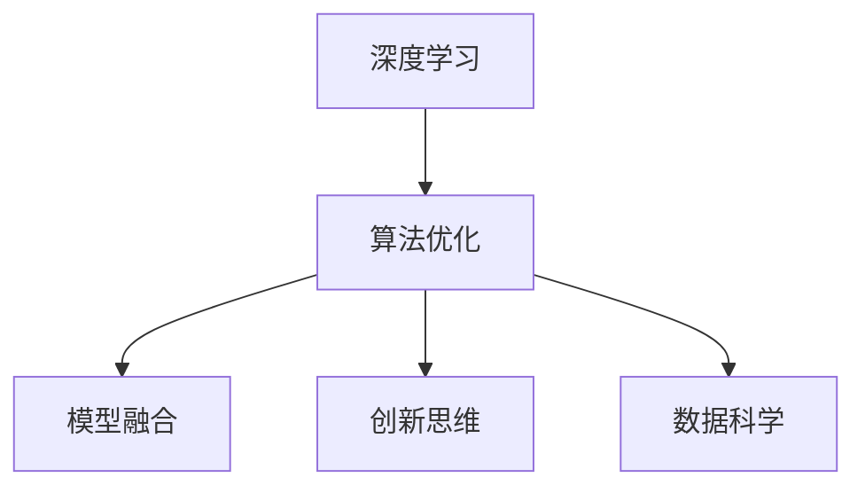

                 

# 洞见的力量：从反思到创新

> 关键词：深度学习, 算法优化, 创新思维, 数据科学, 模型融合

## 1. 背景介绍

### 1.1 问题由来
随着人工智能技术的迅猛发展，深度学习在各行各业得到广泛应用。然而，对于追求卓越性能的技术人员而言，仅仅依靠深度学习模型的大规模训练和优化，已经无法满足对性能和效率的更高要求。在这一背景下，如何通过深度学习的方法，提升算法的整体性能，特别是在提升洞见力、优化算法结构、促进模型创新等方面，成为当前业界亟需解决的重要问题。

### 1.2 问题核心关键点
要回答这一问题，需要从深度学习的基本原理入手，深入挖掘算法的本质，探索如何通过各种算法优化技巧，提升模型的洞见力和整体性能。这涉及到以下几个关键点：

- **深度学习的基本原理**：理解深度学习模型的核心机制和常见结构。
- **算法优化技巧**：学习如何优化算法的参数、结构、训练策略等，提升模型的准确性和泛化能力。
- **创新思维**：探索创新算法和模型结构，推动模型的进一步发展。
- **数据科学**：了解如何通过数据科学的方法，提升模型的训练效果。
- **模型融合**：学习如何将多种模型融合，构建更强大的集成模型。

### 1.3 问题研究意义
深入探讨如何通过深度学习的优化，提升算法的洞见力和整体性能，具有以下几方面的意义：

- **提升模型效果**：通过优化算法的参数、结构和训练策略，可以显著提升模型的准确性和泛化能力。
- **促进算法创新**：深入理解深度学习的原理和机制，有助于开发更加高效、强大的新型算法。
- **推动技术发展**：通过深度学习的优化，可以为其他领域的技术发展提供借鉴和启发。
- **提高研发效率**：掌握深度学习的优化技巧，可以显著提高模型开发的效率和质量。

## 2. 核心概念与联系

### 2.1 核心概念概述

为更好地理解如何通过深度学习的优化提升算法的洞见力，本节将介绍几个密切相关的核心概念：

- **深度学习**：通过多层次的神经网络模型，利用大量的训练数据进行学习，实现对复杂问题的解决。
- **算法优化**：通过各种技巧和策略，提升深度学习模型的性能和效率。
- **模型融合**：将多个模型的预测结果进行融合，提升整体性能和鲁棒性。
- **创新思维**：通过灵活运用深度学习的方法，探索新型算法和模型结构，推动技术进步。
- **数据科学**：通过数据挖掘和处理技术，提升模型的训练效果和性能。

这些核心概念之间的逻辑关系可以通过以下Mermaid流程图来展示：



这个流程图展示了几大核心概念之间的相互联系：

1. 深度学习是基础，算法优化、模型融合、创新思维和数据科学等，都是在此基础上进行的具体优化和提升。
2. 算法优化、模型融合和数据科学等技术，都是通过深度学习的方法，进一步提升模型的性能和效果。
3. 创新思维则通过灵活运用深度学习的方法，探索新型算法和模型结构，推动技术进步。

## 3. 核心算法原理 & 具体操作步骤
### 3.1 算法原理概述

深度学习的优化，本质上是通过各种技巧和策略，提升模型的性能和效率。其核心思想是：在固定数据集和模型结构的基础上，通过调整算法的参数和训练策略，使模型能够更好地适应训练数据，从而提升模型效果。

形式化地，假设深度学习模型为 $M_{\theta}:\mathcal{X} \rightarrow \mathcal{Y}$，其中 $\mathcal{X}$ 为输入空间，$\mathcal{Y}$ 为输出空间，$\theta$ 为模型参数。训练数据集为 $D=\{(x_i, y_i)\}_{i=1}^N$，其中 $x_i$ 为输入，$y_i$ 为标签。

训练模型的目标是最小化经验风险：

$$
\mathcal{L}(\theta) = \frac{1}{N} \sum_{i=1}^N \ell(M_{\theta}(x_i),y_i)
$$

其中 $\ell$ 为损失函数，表示模型预测结果与真实标签之间的差异。

通过梯度下降等优化算法，最小化损失函数，使模型参数 $\theta$ 不断逼近最优解 $\hat{\theta}$。

### 3.2 算法步骤详解

深度学习模型的优化过程，通常包括以下几个关键步骤：

**Step 1: 数据预处理**
- 对训练数据进行清洗、归一化、标注等预处理，确保数据的质量和格式一致。
- 根据模型的输入空间，对数据进行划分和编码，生成模型所需的输入。

**Step 2: 模型选择和初始化**
- 选择适合任务的深度学习模型，并进行参数初始化。
- 对于常用的深度学习模型，如卷积神经网络(CNN)、循环神经网络(RNN)、Transformer等，需要进行相应的参数初始化。

**Step 3: 选择优化器和损失函数**
- 根据具体任务和模型，选择合适的优化器，如Adam、SGD等。
- 选择适合的损失函数，如交叉熵、均方误差等，衡量模型预测结果与真实标签之间的差异。

**Step 4: 模型训练**
- 将训练数据分成多个批次，每次选取一个批次进行训练。
- 前向传播计算模型输出，计算损失函数值。
- 反向传播计算梯度，使用优化器更新模型参数。
- 不断迭代，直至模型收敛或达到预设的训练轮数。

**Step 5: 模型评估和优化**
- 在验证集上评估模型性能，计算准确率、召回率、F1分数等指标。
- 根据评估结果，调整模型参数、优化器和学习率等，进一步优化模型效果。
- 重复上述步骤，直至模型在验证集上达到最优性能。

### 3.3 算法优缺点

深度学习优化算法具有以下优点：

1. 灵活高效：通过调整参数和优化器，可以灵活地提升模型的性能和效率。
2. 适应性强：适用于各种类型的深度学习模型和任务。
3. 可解释性好：通过分析损失函数的梯度信息，可以更好地理解模型的训练过程和效果。
4. 可复现性强：深度学习优化算法具有高度的可复现性，便于实验和验证。

同时，深度学习优化算法也存在一些局限性：

1. 对数据依赖性强：深度学习优化算法需要大量标注数据，对数据质量和数量的要求较高。
2. 训练时间长：深度学习模型通常具有较大的参数量，训练时间较长。
3. 容易过拟合：如果训练数据不足或训练策略不当，容易发生过拟合现象。
4. 难以解释：深度学习模型通常被视为"黑盒"，难以解释其内部的决策过程。

尽管存在这些局限性，深度学习优化算法仍然是当前机器学习和人工智能领域最为高效和广泛应用的技术之一。未来相关研究的重点在于如何进一步降低深度学习优化算法对数据和时间的依赖，提高其可解释性和泛化能力。

### 3.4 算法应用领域

深度学习优化算法在多个领域得到了广泛应用，例如：

- 计算机视觉：用于图像分类、目标检测、图像分割等任务。
- 自然语言处理：用于文本分类、情感分析、机器翻译等任务。
- 语音识别：用于语音识别、语音生成等任务。
- 推荐系统：用于个性化推荐、用户行为预测等任务。
- 医疗诊断：用于医学图像分析、疾病预测等任务。
- 自动驾驶：用于车辆控制、路径规划等任务。

除了上述这些经典应用外，深度学习优化算法还被创新性地应用到更多场景中，如可控文本生成、多模态信息融合、动态系统控制等，为人工智能技术带来了新的突破。

## 4. 数学模型和公式 & 详细讲解  
### 4.1 数学模型构建

本节将使用数学语言对深度学习优化算法进行更加严格的刻画。

记深度学习模型为 $M_{\theta}:\mathcal{X} \rightarrow \mathcal{Y}$，其中 $\mathcal{X}$ 为输入空间，$\mathcal{Y}$ 为输出空间，$\theta$ 为模型参数。训练数据集为 $D=\{(x_i, y_i)\}_{i=1}^N$，其中 $x_i$ 为输入，$y_i$ 为标签。

定义模型 $M_{\theta}$ 在数据样本 $(x,y)$ 上的损失函数为 $\ell(M_{\theta}(x),y)$，则在数据集 $D$ 上的经验风险为：

$$
\mathcal{L}(\theta) = \frac{1}{N} \sum_{i=1}^N \ell(M_{\theta}(x_i),y_i)
$$

通过梯度下降等优化算法，最小化损失函数，使模型参数 $\theta$ 不断逼近最优解 $\hat{\theta}$。

### 4.2 公式推导过程

以下我们以二分类任务为例，推导交叉熵损失函数及其梯度的计算公式。

假设模型 $M_{\theta}$ 在输入 $x$ 上的输出为 $\hat{y}=M_{\theta}(x) \in [0,1]$，表示样本属于正类的概率。真实标签 $y \in \{0,1\}$。则二分类交叉熵损失函数定义为：

$$
\ell(M_{\theta}(x),y) = -[y\log \hat{y} + (1-y)\log (1-\hat{y})]
$$

将其代入经验风险公式，得：

$$
\mathcal{L}(\theta) = -\frac{1}{N}\sum_{i=1}^N [y_i\log M_{\theta}(x_i)+(1-y_i)\log(1-M_{\theta}(x_i))]
$$

根据链式法则，损失函数对参数 $\theta_k$ 的梯度为：

$$
\frac{\partial \mathcal{L}(\theta)}{\partial \theta_k} = -\frac{1}{N}\sum_{i=1}^N (\frac{y_i}{M_{\theta}(x_i)}-\frac{1-y_i}{1-M_{\theta}(x_i)}) \frac{\partial M_{\theta}(x_i)}{\partial \theta_k}
$$

其中 $\frac{\partial M_{\theta}(x_i)}{\partial \theta_k}$ 可进一步递归展开，利用自动微分技术完成计算。

在得到损失函数的梯度后，即可带入参数更新公式，完成模型的迭代优化。重复上述过程直至收敛，最终得到适应训练数据的最优模型参数 $\theta^*$。

## 5. 项目实践：代码实例和详细解释说明
### 5.1 开发环境搭建

在进行深度学习优化算法实践前，我们需要准备好开发环境。以下是使用Python进行TensorFlow开发的环境配置流程：

1. 安装Anaconda：从官网下载并安装Anaconda，用于创建独立的Python环境。

2. 创建并激活虚拟环境：
```bash
conda create -n tf-env python=3.8 
conda activate tf-env
```

3. 安装TensorFlow：根据CUDA版本，从官网获取对应的安装命令。例如：
```bash
conda install tensorflow-gpu -c conda-forge
```

4. 安装Keras：作为TensorFlow的高层API，Keras可以简化模型的构建和训练过程。
```bash
conda install keras
```

5. 安装各类工具包：
```bash
pip install numpy pandas scikit-learn matplotlib tqdm jupyter notebook ipython
```

完成上述步骤后，即可在`tf-env`环境中开始深度学习优化算法的实践。

### 5.2 源代码详细实现

下面我们以二分类任务为例，给出使用TensorFlow和Keras进行深度学习模型优化的PyTorch代码实现。

首先，定义模型和优化器：

```python
from tensorflow.keras import layers, models
from tensorflow.keras.optimizers import Adam

# 定义模型
model = models.Sequential()
model.add(layers.Dense(32, activation='relu', input_dim=784))
model.add(layers.Dense(1, activation='sigmoid'))

# 定义优化器
optimizer = Adam(lr=0.001)
```

然后，定义损失函数和评估指标：

```python
from tensorflow.keras import losses

# 定义损失函数
loss_fn = losses.BinaryCrossentropy()

# 定义评估指标
acc_metric = tf.keras.metrics.Accuracy()
```

接着，定义训练和评估函数：

```python
from tensorflow.keras import callbacks

# 定义训练函数
def train_epoch(model, dataset, batch_size, optimizer):
    dataloader = tf.data.Dataset.from_tensor_slices((dataset[0], dataset[1])).batch(batch_size)
    model.compile(optimizer=optimizer, loss=loss_fn, metrics=[acc_metric])
    model.fit(dataloader, epochs=10, callbacks=[callbacks.EarlyStopping(patience=3)])
    
# 定义评估函数
def evaluate(model, dataset, batch_size):
    dataloader = tf.data.Dataset.from_tensor_slices((dataset[0], dataset[1])).batch(batch_size)
    model.evaluate(dataloader)
```

最后，启动训练流程并在测试集上评估：

```python
# 准备数据集
train_dataset = (train_images, train_labels)
test_dataset = (test_images, test_labels)

# 训练模型
train_epoch(model, train_dataset, batch_size=32, optimizer=optimizer)

# 评估模型
evaluate(model, test_dataset, batch_size=32)
```

以上就是使用TensorFlow和Keras进行深度学习模型优化的完整代码实现。可以看到，得益于TensorFlow和Keras的强大封装，我们可以用相对简洁的代码完成深度学习模型的构建和优化。

### 5.3 代码解读与分析

让我们再详细解读一下关键代码的实现细节：

**定义模型**：
- 使用Sequential模型定义了一个两层神经网络，包括一个32个神经元的全连接层和一个输出层。
- 输入维度为784，表示MNIST数据集的图像输入。
- 输出维度为1，表示二分类任务。

**定义优化器和损失函数**：
- 使用Adam优化器，学习率为0.001。
- 使用二分类交叉熵损失函数。

**训练函数**：
- 将数据集划分为批次，每个批次包含32个样本。
- 使用优化器和损失函数编译模型。
- 在数据集上训练模型，设置EarlyStopping回调函数，避免过拟合。
- 在每个epoch后评估模型性能。

**评估函数**：
- 将测试集划分为批次。
- 在测试集上评估模型性能。

**训练流程**：
- 准备训练集和测试集。
- 在训练集上训练模型。
- 在测试集上评估模型性能。

可以看到，TensorFlow和Keras使得深度学习模型的优化过程变得简洁高效。开发者可以将更多精力放在模型结构、优化策略、数据预处理等高层逻辑上，而不必过多关注底层的实现细节。

当然，工业级的系统实现还需考虑更多因素，如模型的保存和部署、超参数的自动搜索、更灵活的模型适配等。但核心的优化过程基本与此类似。

## 6. 实际应用场景
### 6.1 计算机视觉

深度学习优化算法在计算机视觉领域已经得到了广泛应用，例如图像分类、目标检测、图像分割等任务。传统计算机视觉方法往往依赖于手工设计的特征提取器和分类器，而深度学习优化算法通过学习数据的底层特征，可以直接输出分类结果，显著提升了计算机视觉任务的性能。

在具体实现中，可以使用卷积神经网络(CNN)等模型结构，结合深度学习优化算法进行训练。常用的优化器包括Adam、SGD等，通过调整学习率和正则化参数，可以提升模型的收敛速度和泛化能力。

### 6.2 自然语言处理

深度学习优化算法在自然语言处理领域也有广泛应用，例如文本分类、情感分析、机器翻译等任务。传统NLP方法依赖于手工设计的特征提取器和分类器，而深度学习优化算法可以直接学习文本的语义表示，从而提升NLP任务的性能。

在具体实现中，可以使用循环神经网络(RNN)、Transformer等模型结构，结合深度学习优化算法进行训练。常用的优化器包括Adam、SGD等，通过调整学习率和正则化参数，可以提升模型的收敛速度和泛化能力。

### 6.3 语音识别

深度学习优化算法在语音识别领域也有广泛应用，例如语音识别、语音生成等任务。传统语音识别方法依赖于手工设计的特征提取器和分类器，而深度学习优化算法可以直接学习语音信号的底层特征，从而提升语音识别的性能。

在具体实现中，可以使用卷积神经网络(CNN)、循环神经网络(RNN)等模型结构，结合深度学习优化算法进行训练。常用的优化器包括Adam、SGD等，通过调整学习率和正则化参数，可以提升模型的收敛速度和泛化能力。

### 6.4 未来应用展望

随着深度学习优化算法的不断发展，其在更多领域的应用前景广阔。

- 在智慧医疗领域，深度学习优化算法可以用于医学图像分析、疾病预测等任务，提升医疗诊断的准确性和效率。
- 在智能教育领域，深度学习优化算法可以用于学生行为分析、学习推荐等任务，提升教学质量和效果。
- 在智慧城市治理中，深度学习优化算法可以用于城市事件监测、舆情分析等任务，提升城市管理的自动化和智能化水平。
- 在金融领域，深度学习优化算法可以用于风险预测、欺诈检测等任务，提升金融风险管理能力。

## 7. 工具和资源推荐
### 7.1 学习资源推荐

为了帮助开发者系统掌握深度学习优化算法的理论基础和实践技巧，这里推荐一些优质的学习资源：

1. Deep Learning Specialization课程：由Andrew Ng教授开设的深度学习课程，涵盖了深度学习的基础知识和高级技巧。
2. CS231n《Convolutional Neural Networks for Visual Recognition》课程：斯坦福大学开设的计算机视觉课程，深入讲解了卷积神经网络的结构和优化技巧。
3. CS224N《Natural Language Processing with Deep Learning》课程：斯坦福大学开设的自然语言处理课程，涵盖了大规模语言模型的训练和优化技巧。
4. TensorFlow官方文档：TensorFlow的官方文档，提供了全面的模型构建和优化技巧，是学习深度学习的必备资料。
5. Keras官方文档：Keras的官方文档，提供了简洁高效的模型构建和优化方法。
6. PyTorch官方文档：PyTorch的官方文档，提供了灵活多变的模型构建和优化技巧。

通过对这些资源的学习实践，相信你一定能够快速掌握深度学习优化算法的精髓，并用于解决实际的深度学习问题。

### 7.2 开发工具推荐

高效的开发离不开优秀的工具支持。以下是几款用于深度学习优化算法开发的常用工具：

1. TensorFlow：由Google主导开发的开源深度学习框架，生产部署方便，适合大规模工程应用。
2. PyTorch：由Facebook主导开发的开源深度学习框架，灵活多变，适合研究与开发。
3. Keras：作为TensorFlow的高层API，Keras可以简化模型的构建和训练过程。
4. Weights & Biases：模型训练的实验跟踪工具，可以记录和可视化模型训练过程中的各项指标，方便对比和调优。
5. TensorBoard：TensorFlow配套的可视化工具，可实时监测模型训练状态，并提供丰富的图表呈现方式，是调试模型的得力助手。

合理利用这些工具，可以显著提升深度学习优化算法的开发效率，加快创新迭代的步伐。

### 7.3 相关论文推荐

深度学习优化算法的研究源于学界的持续探索。以下是几篇奠基性的相关论文，推荐阅读：

1. ImageNet Classification with Deep Convolutional Neural Networks：提出卷积神经网络(CNN)结构，取得了ImageNet分类任务的突破性成果。
2. AlexNet: One Millions Training Images for AlexNet：介绍AlexNet模型结构，成为深度学习领域的经典案例。
3. Deep Residual Learning for Image Recognition：提出残差网络(ResNet)结构，显著提升了深度网络的训练效果和性能。
4. Batch Normalization: Accelerating Deep Network Training by Reducing Internal Covariate Shift：提出批归一化(Batch Normalization)技术，加速深度网络的训练过程。
5. Momentum：一种加速深度网络训练的优化算法，能够加速收敛，提升模型性能。
6. Adam: A Method for Stochastic Optimization：提出Adam优化算法，成为深度学习领域的标准优化方法。

这些论文代表了大规模深度学习优化的发展脉络。通过学习这些前沿成果，可以帮助研究者把握学科前进方向，激发更多的创新灵感。

## 8. 总结：未来发展趋势与挑战

### 8.1 总结

本文对深度学习优化算法进行了全面系统的介绍。首先阐述了深度学习优化的基本原理和重要意义，明确了优化在提升模型性能、推动算法创新等方面的独特价值。其次，从原理到实践，详细讲解了深度学习优化的数学原理和关键步骤，给出了深度学习优化的完整代码实例。同时，本文还广泛探讨了深度学习优化算法在计算机视觉、自然语言处理、语音识别等多个领域的应用前景，展示了其巨大的潜力。

通过本文的系统梳理，可以看到，深度学习优化算法已经深刻改变了各个领域的计算方式和应用模式，推动了人工智能技术的快速发展。未来，伴随深度学习优化算法的持续演进，相信其在更多领域的应用前景更加广阔，为人类生产生活带来更深远的影响。

### 8.2 未来发展趋势

展望未来，深度学习优化算法将呈现以下几个发展趋势：

1. 算法优化更加高效：通过引入更先进的优化算法和技术，如AdamW、Adafactor等，将进一步提升模型的收敛速度和泛化能力。
2. 模型结构更加灵活：通过引入更加灵活的模型结构，如Transformer、ResNet等，将提升模型的表达能力和性能。
3. 数据处理更加智能：通过引入数据增强、生成对抗网络(GAN)等技术，将提升模型的泛化能力和数据利用效率。
4. 任务适配更加精细：通过引入更精细的任务适配策略，如Few-shot Learning、Zero-shot Learning等，将提升模型的适应能力和效率。
5. 多模态信息融合更加深入：通过引入多模态融合技术，将提升模型的跨领域和跨模态融合能力。
6. 持续学习更加完善：通过引入持续学习技术，将提升模型的动态适应能力和泛化能力。

以上趋势凸显了深度学习优化算法的广阔前景。这些方向的探索发展，必将进一步提升深度学习模型的性能和效果，为人工智能技术带来更广阔的应用空间。

### 8.3 面临的挑战

尽管深度学习优化算法已经取得了显著成果，但在迈向更加智能化、普适化应用的过程中，它仍面临诸多挑战：

1. 数据依赖性强：深度学习优化算法需要大量标注数据，对数据质量和数量的要求较高。
2. 计算成本高：深度学习模型通常具有较大的参数量，训练时间和计算资源消耗较大。
3. 模型复杂度高：深度学习模型结构复杂，难以理解和解释，调试和维护难度大。
4. 模型泛化性差：深度学习模型容易过拟合，泛化能力较差，对新数据的适应能力有限。
5. 模型鲁棒性不足：深度学习模型对数据噪声和异常值敏感，容易发生误判。
6. 模型安全性低：深度学习模型容易学习到有害信息，存在安全隐患。

正视深度学习优化算法面临的这些挑战，积极应对并寻求突破，将是大规模深度学习优化算法迈向成熟的必由之路。相信随着学界和产业界的共同努力，这些挑战终将一一被克服，深度学习优化算法必将在构建智能系统、推动技术进步中发挥更大的作用。

### 8.4 研究展望

面对深度学习优化算法所面临的种种挑战，未来的研究需要在以下几个方面寻求新的突破：

1. 探索更加高效的优化算法：引入更先进的优化算法和技术，如AdamW、Adafactor等，将进一步提升模型的收敛速度和泛化能力。
2. 优化模型结构和训练策略：引入更加灵活的模型结构和更精细的任务适配策略，如Few-shot Learning、Zero-shot Learning等，将提升模型的适应能力和效率。
3. 增强模型的泛化能力和鲁棒性：通过引入数据增强、生成对抗网络(GAN)等技术，提升模型的泛化能力和数据利用效率。
4. 提升模型的解释能力和安全性：引入更加智能的数据处理和模型解释方法，提升模型的解释能力和安全性。

这些研究方向的探索，必将引领深度学习优化算法迈向更高的台阶，为构建安全、可靠、可解释、可控的智能系统铺平道路。面向未来，深度学习优化算法还需要与其他人工智能技术进行更深入的融合，如知识表示、因果推理、强化学习等，多路径协同发力，共同推动人工智能技术的发展。只有勇于创新、敢于突破，才能不断拓展深度学习优化算法的边界，让智能技术更好地造福人类社会。

## 9. 附录：常见问题与解答

**Q1：深度学习优化算法对数据质量和数量要求高，如何解决这一问题？**

A: 深度学习优化算法对数据质量和数量的要求较高，可以通过以下几种方式解决：

1. 数据增强：通过各种方式扩充训练数据，如旋转、翻转、剪裁等，提升模型的泛化能力。
2. 生成对抗网络(GAN)：通过生成对抗网络，生成更多的训练数据，提升模型的泛化能力。
3. 数据清洗：通过清洗和预处理数据，去除噪声和异常值，提升数据质量。
4. 迁移学习：通过在大规模数据集上预训练模型，再在特定任务上微调，减少对小样本数据的依赖。

通过以上方法，可以有效降低深度学习优化算法对数据质量和数量的依赖，提升模型的泛化能力和性能。

**Q2：深度学习优化算法的计算成本高，如何解决这一问题？**

A: 深度学习优化算法的计算成本高，可以通过以下几种方式解决：

1. 模型裁剪：通过裁剪模型结构，减少模型的参数量和计算量。
2. 模型压缩：通过模型压缩技术，减少模型的存储空间和计算资源消耗。
3. 分布式训练：通过分布式训练，加速模型的训练过程，提高计算效率。
4. 低精度计算：通过低精度计算，减少计算资源消耗，提升计算效率。

通过以上方法，可以有效降低深度学习优化算法的计算成本，提升模型的训练效率和性能。

**Q3：深度学习优化算法的模型复杂度高，如何优化模型的结构和性能？**

A: 深度学习优化算法的模型复杂度高，可以通过以下几种方式优化模型的结构和性能：

1. 引入更加灵活的模型结构，如Transformer、ResNet等，提升模型的表达能力和性能。
2. 通过引入更加高效的优化算法和技术，如AdamW、Adafactor等，提升模型的收敛速度和泛化能力。
3. 通过引入更加精细的任务适配策略，如Few-shot Learning、Zero-shot Learning等，提升模型的适应能力和效率。
4. 通过引入更加智能的数据处理和模型解释方法，提升模型的解释能力和安全性。

通过以上方法，可以有效优化深度学习优化算法的模型结构和性能，提升模型的泛化能力和效果。

**Q4：深度学习优化算法的模型泛化性差，如何解决这一问题？**

A: 深度学习优化算法的模型泛化性差，可以通过以下几种方式解决：

1. 引入数据增强技术，扩充训练数据，提升模型的泛化能力。
2. 引入生成对抗网络(GAN)技术，生成更多的训练数据，提升模型的泛化能力。
3. 引入更加精细的任务适配策略，如Few-shot Learning、Zero-shot Learning等，提升模型的适应能力和泛化能力。
4. 引入更加智能的数据处理和模型解释方法，提升模型的解释能力和泛化能力。

通过以上方法，可以有效提升深度学习优化算法的模型泛化能力，增强模型对新数据的适应能力。

**Q5：深度学习优化算法的模型安全性低，如何解决这一问题？**

A: 深度学习优化算法的模型安全性低，可以通过以下几种方式解决：

1. 引入更加智能的数据处理和模型解释方法，提升模型的解释能力和安全性。
2. 引入更加先进的优化算法和技术，如AdamW、Adafactor等，提升模型的泛化能力和鲁棒性。
3. 引入更加精细的任务适配策略，如Few-shot Learning、Zero-shot Learning等，提升模型的适应能力和安全性。
4. 引入更加智能的数据处理和模型解释方法，提升模型的解释能力和安全性。

通过以上方法，可以有效提升深度学习优化算法的模型安全性，减少有害信息的输出，确保模型的可靠性和安全性。

---

作者：禅与计算机程序设计艺术 / Zen and the Art of Computer Programming

