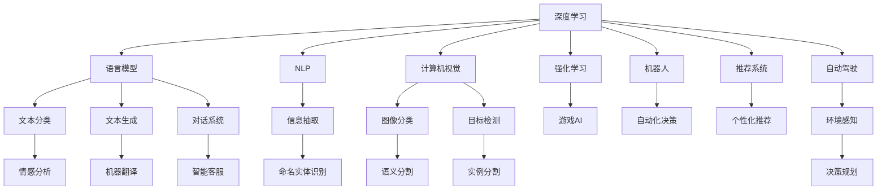

                 

# 深入理解AI、LLM和深度学习：一个实践性课程

> 关键词：人工智能, 语言模型, 深度学习, 计算机视觉, 自然语言处理(NLP), 深度学习框架, 开源工具, 实践项目

## 1. 背景介绍

### 1.1 问题由来

近年来，人工智能(AI)技术迅速崛起，成为驱动科技创新的重要引擎。AI的广泛应用，不仅颠覆了传统的计算、通信、娱乐、医疗等行业，还深刻改变了人类社会的生产生活方式。在这一背景下，深度学习(DL)和自然语言处理(NLP)作为AI领域的两大核心技术，被赋予了更高的期望和更多的关注。

深度学习是一种模仿人脑神经网络的机器学习方法，通过对数据进行多层次的抽象表示，能够自动发现数据特征，并用于分类、回归、生成等任务。语言模型作为深度学习的重要应用之一，主要应用于文本分类、机器翻译、语音识别、文本生成等领域。

### 1.2 问题核心关键点

当前，深度学习和语言模型在实际应用中已展现出显著的性能优势。然而，AI技术仍面临诸多挑战：

- **数据依赖**：AI模型需要大量标注数据进行训练，数据标注成本高昂，且数据分布的差异可能导致模型性能下降。
- **模型复杂度**：大规模深度模型需要高算力支持，同时对模型的推理速度和计算资源占用提出更高要求。
- **模型泛化能力**：深度模型通常存在过拟合问题，泛化能力较差，难以处理未见过的数据。
- **解释性不足**：深度学习模型被视为“黑盒”，难以解释其决策过程，难以在医疗、金融等高风险场景中广泛应用。

基于以上挑战，本文旨在通过一个实践性课程，系统深入理解AI、LLM和深度学习的核心原理与实践方法，并通过多个实际项目，帮助读者掌握相关技术，并解决上述挑战。

## 2. 核心概念与联系

### 2.1 核心概念概述

为更好地理解AI、LLM和深度学习，本节将介绍几个关键概念及其相互联系：

- **深度学习**：通过构建多层神经网络，深度学习模型能够自动提取高层次抽象特征，用于处理复杂的数据和任务。

- **语言模型**：主要应用于文本数据的生成、分类、翻译等任务。基于大规模语料库预训练的模型，如BERT、GPT等，能够显著提升模型的性能。

- **自然语言处理(NLP)**：研究如何让计算机理解和处理自然语言，包括文本分析、信息抽取、文本生成等任务。

- **深度学习框架**：如TensorFlow、PyTorch等，提供了高效的工具和库，使得深度学习模型的开发和训练变得更加容易。

- **开源工具**：如GitHub、Kaggle等，提供了丰富的开源项目和数据集，帮助开发者快速进入AI领域。

### 2.2 核心概念原理和架构的 Mermaid 流程图



这个流程图展示了深度学习、语言模型、NLP、计算机视觉等核心概念之间的联系，并通过具体的应用实例，说明了各概念在实际应用中的作用和价值。

## 3. 核心算法原理 & 具体操作步骤

### 3.1 算法原理概述

深度学习算法主要通过前向传播和反向传播两个步骤进行训练。前向传播时，输入数据通过多层神经网络，逐步抽象出高层次特征，并输出预测结果。反向传播时，模型根据预测结果与真实标签的差异，计算损失函数，并通过链式法则反向传播误差，调整各层权重。

对于语言模型，常见的任务包括文本分类、情感分析、命名实体识别、机器翻译等。这些任务通常通过在大量文本数据上预训练模型，然后在特定任务上微调，以获得更好的性能。

### 3.2 算法步骤详解

深度学习的训练过程可以分为以下几个关键步骤：

1. **数据准备**：收集和处理训练数据，生成数据集。
2. **模型构建**：选择合适的深度学习模型，并配置相应的超参数。
3. **模型训练**：使用反向传播算法，不断调整模型权重，最小化损失函数。
4. **模型评估**：在测试集上评估模型性能，选择最优模型。
5. **模型部署**：将训练好的模型应用到实际问题中，进行推理预测。

### 3.3 算法优缺点

深度学习算法的优点在于其强大的数据建模能力，能够自动发现数据中的复杂关系。缺点在于其对数据和计算资源的高需求，模型容易过拟合，且难以解释其内部工作机制。

语言模型在文本分类、情感分析、机器翻译等任务上取得了显著的效果，但其依赖大量标注数据，且对长尾数据的泛化能力有限。

### 3.4 算法应用领域

深度学习算法广泛应用于计算机视觉、自然语言处理、语音识别、自动驾驶、医疗影像分析等领域。语言模型在文本分类、情感分析、机器翻译、文本生成等任务中展现出强大的性能。

## 4. 数学模型和公式 & 详细讲解 & 举例说明

### 4.1 数学模型构建

深度学习模型的核心在于构建多层神经网络。以卷积神经网络(CNN)为例，其数学模型可以表示为：

$$
y = W^T a_2 + b
$$

其中，$y$为输出结果，$W$为权重矩阵，$a_2$为第二层输出，$b$为偏置项。

### 4.2 公式推导过程

对于前向传播过程，卷积神经网络可以将输入数据通过卷积、池化等操作，逐步提取高层次特征，并输出结果。以卷积层为例：

$$
a_{i+1} = f(W*a_i + b)
$$

其中，$a_{i+1}$为第$i+1$层的输出，$f$为激活函数，$W$为卷积核，$a_i$为第$i$层的输出。

### 4.3 案例分析与讲解

以文本分类任务为例，深度学习模型可以使用长短时记忆网络(LSTM)进行建模。通过在大量文本数据上预训练模型，然后在特定任务上进行微调，以获得更好的分类性能。

## 5. 项目实践：代码实例和详细解释说明

### 5.1 开发环境搭建

在深度学习项目中，开发环境的选择对项目的效率和性能有重要影响。以下是一个简单的开发环境搭建流程：

1. 安装Python：从官网下载并安装Python 3.x版本。
2. 安装深度学习框架：如TensorFlow、PyTorch等。
3. 安装相关库：如NumPy、Pandas、Matplotlib等。
4. 安装GPU驱动：确保开发环境支持GPU加速。

### 5.2 源代码详细实现

以图像分类任务为例，使用PyTorch框架进行代码实现：

```python
import torch
import torch.nn as nn
import torch.optim as optim
import torchvision.transforms as transforms
from torchvision.datasets import CIFAR10
from torch.utils.data import DataLoader

# 定义卷积神经网络模型
class Net(nn.Module):
    def __init__(self):
        super(Net, self).__init__()
        self.conv1 = nn.Conv2d(3, 6, 5)
        self.pool = nn.MaxPool2d(2, 2)
        self.conv2 = nn.Conv2d(6, 16, 5)
        self.fc1 = nn.Linear(16 * 5 * 5, 120)
        self.fc2 = nn.Linear(120, 84)
        self.fc3 = nn.Linear(84, 10)
        
    def forward(self, x):
        x = self.pool(F.relu(self.conv1(x)))
        x = self.pool(F.relu(self.conv2(x)))
        x = x.view(-1, 16 * 5 * 5)
        x = F.relu(self.fc1(x))
        x = F.relu(self.fc2(x))
        x = self.fc3(x)
        return x

# 加载CIFAR-10数据集
transform = transforms.Compose([
    transforms.ToTensor(),
    transforms.Normalize((0.5, 0.5, 0.5), (0.5, 0.5, 0.5))
])
trainset = CIFAR10(root='./data', train=True, download=True, transform=transform)
trainloader = DataLoader(trainset, batch_size=4, shuffle=True, num_workers=2)

# 定义模型和优化器
net = Net()
criterion = nn.CrossEntropyLoss()
optimizer = optim.SGD(net.parameters(), lr=0.001, momentum=0.9)

# 训练模型
for epoch in range(2):  # 仅训练两轮以节约时间
    running_loss = 0.0
    for i, data in enumerate(trainloader, 0):
        inputs, labels = data
        optimizer.zero_grad()
        outputs = net(inputs)
        loss = criterion(outputs, labels)
        loss.backward()
        optimizer.step()

        # 打印训练结果
        running_loss += loss.item()
        if i % 2000 == 1999:    # 每2000个batch输出一次训练结果
            print('[%d, %5d] loss: %.3f' %
                  (epoch + 1, i + 1, running_loss / 2000))
            running_loss = 0.0

print('Finished Training')
```

### 5.3 代码解读与分析

上述代码展示了图像分类任务的基本流程：

- **模型定义**：定义卷积神经网络模型，包含卷积层、池化层、全连接层等。
- **数据加载**：使用PyTorch提供的CIFAR-10数据集，并进行数据增强和归一化处理。
- **模型训练**：定义损失函数和优化器，在训练集上进行模型训练，输出训练结果。

## 6. 实际应用场景

### 6.1 计算机视觉

深度学习在计算机视觉领域的应用非常广泛，涵盖了图像分类、目标检测、语义分割等任务。

以图像分类为例，深度学习模型如CNN可以在大量图像数据上预训练，然后在特定类别上微调，实现高效的图像分类。例如，使用预训练的ResNet模型在图像分类竞赛中取得了优异成绩。

### 6.2 自然语言处理(NLP)

NLP是深度学习的重要应用领域，包括文本分类、情感分析、机器翻译等任务。语言模型如BERT、GPT等通过在大量文本数据上预训练，然后在特定任务上微调，能够显著提升模型的性能。例如，BERT在问答系统、文本生成等领域取得了突破性进展。

### 6.3 语音识别

深度学习在语音识别领域也展现出强大的能力。通过构建卷积神经网络和循环神经网络，深度学习模型可以自动提取语音信号的特征，并进行语音识别。例如，Google的DeepSpeech项目使用深度学习模型实现了语音转文字的功能。

### 6.4 未来应用展望

深度学习在未来的发展方向包括：

- **自监督学习**：利用无标签数据进行自监督学习，减少对标注数据的依赖。
- **迁移学习**：通过在多个任务上进行预训练和微调，提升模型的泛化能力。
- **模型压缩**：通过模型剪枝、量化等技术，减小模型的尺寸，提升推理速度。
- **联邦学习**：通过分布式训练，保护数据隐私的同时提升模型性能。

## 7. 工具和资源推荐

### 7.1 学习资源推荐

- **深度学习入门书籍**：《深度学习》(Florian Ruder)、《Python深度学习》(Francois Chollet)等，深入浅出地介绍了深度学习的基本原理和实践方法。
- **在线课程**：如Coursera上的《深度学习专项课程》，由深度学习领域的专家授课，提供系统化的学习路径。
- **论文阅读**：通过阅读最新的研究论文，了解最新的技术进展和应用实践。

### 7.2 开发工具推荐

- **深度学习框架**：如TensorFlow、PyTorch、Keras等，提供了丰富的深度学习模型和工具，便于快速开发和调试。
- **数据可视化工具**：如TensorBoard、Visdom等，用于可视化模型的训练过程和性能指标。
- **代码管理工具**：如GitHub、Git等，用于版本控制和代码协作。

### 7.3 相关论文推荐

- **计算机视觉**：《ImageNet Classification with Deep Convolutional Neural Networks》(2012)、《Very Deep Convolutional Networks for Large-Scale Image Recognition》(2014)等。
- **自然语言处理**：《Attention is All You Need》(2017)、《BERT: Pre-training of Deep Bidirectional Transformers for Language Understanding》(2018)等。
- **语音识别**：《Deep Speech 2: End-to-End Speech Recognition in English and Mandarin》(2016)、《WaveNet: A Generative Model for Raw Audio》(2017)等。

## 8. 总结：未来发展趋势与挑战

### 8.1 研究成果总结

深度学习在AI领域取得了突破性进展，广泛应用于计算机视觉、自然语言处理、语音识别等领域。通过预训练和微调等技术，深度学习模型在特定任务上展现了强大的性能。

### 8.2 未来发展趋势

未来，深度学习的发展趋势包括：

- **自监督学习**：利用无标签数据进行自监督学习，提升模型的泛化能力。
- **迁移学习**：通过在多个任务上进行预训练和微调，提升模型的迁移能力。
- **模型压缩**：通过模型剪枝、量化等技术，减小模型的尺寸，提升推理速度。
- **联邦学习**：通过分布式训练，保护数据隐私的同时提升模型性能。

### 8.3 面临的挑战

尽管深度学习在应用中展现了强大的能力，但也面临着诸多挑战：

- **数据依赖**：深度学习模型需要大量标注数据进行训练，数据标注成本高昂，且数据分布的差异可能导致模型性能下降。
- **模型复杂度**：大规模深度模型需要高算力支持，同时对模型的推理速度和计算资源占用提出更高要求。
- **模型泛化能力**：深度模型通常存在过拟合问题，泛化能力较差，难以处理未见过的数据。
- **解释性不足**：深度学习模型被视为“黑盒”，难以解释其内部工作机制，难以在医疗、金融等高风险场景中广泛应用。

### 8.4 研究展望

未来的研究方向包括：

- **自监督学习**：利用无标签数据进行自监督学习，提升模型的泛化能力。
- **迁移学习**：通过在多个任务上进行预训练和微调，提升模型的迁移能力。
- **模型压缩**：通过模型剪枝、量化等技术，减小模型的尺寸，提升推理速度。
- **联邦学习**：通过分布式训练，保护数据隐私的同时提升模型性能。

## 9. 附录：常见问题与解答

**Q1：深度学习模型是否适合所有任务？**

A: 深度学习模型在处理复杂数据时表现出强大的性能，但在某些简单任务上可能过于复杂。在选择模型时，需要考虑任务的复杂度和数据量。

**Q2：如何优化深度学习模型的性能？**

A: 优化深度学习模型的方法包括：

- **超参数调优**：调整学习率、批大小等超参数，找到最优组合。
- **正则化**：使用L2正则、Dropout等技术，避免过拟合。
- **数据增强**：通过旋转、缩放等方式增强数据多样性，提升模型泛化能力。
- **模型压缩**：通过模型剪枝、量化等技术，减小模型尺寸，提升推理速度。

**Q3：深度学习模型的可解释性如何提升？**

A: 提升深度学习模型可解释性的方法包括：

- **可视化**：通过可视化技术，了解模型的决策过程。
- **模型解释**：使用模型解释工具，如LIME、SHAP等，分析模型的预测结果。
- **特征重要性**：计算特征对模型输出的重要性，解释模型决策依据。

**Q4：深度学习模型在实际应用中面临哪些挑战？**

A: 深度学习模型在实际应用中面临以下挑战：

- **数据依赖**：深度学习模型需要大量标注数据进行训练，数据标注成本高昂。
- **模型复杂度**：大规模深度模型需要高算力支持，同时对模型的推理速度和计算资源占用提出更高要求。
- **模型泛化能力**：深度模型通常存在过拟合问题，泛化能力较差，难以处理未见过的数据。
- **解释性不足**：深度学习模型被视为“黑盒”，难以解释其内部工作机制，难以在医疗、金融等高风险场景中广泛应用。

---

作者：禅与计算机程序设计艺术 / Zen and the Art of Computer Programming

