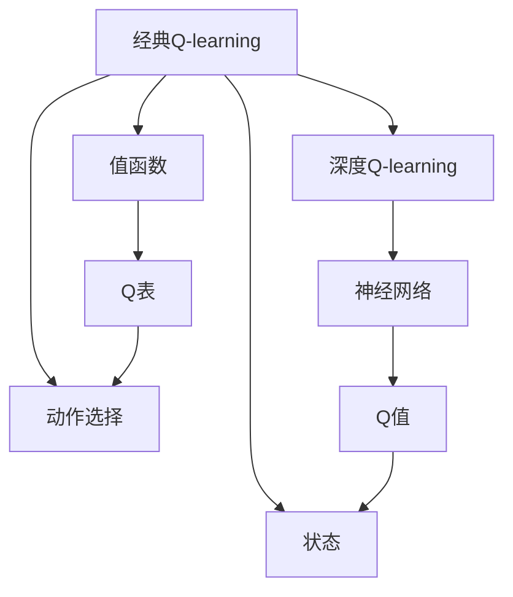

                 

## 1. 背景介绍

在人工智能和机器学习的探索之路上，深度学习和强化学习是两个极具影响力的分支。其中，Q-learning作为强化学习的经典算法，已经在众多应用中展现出了其强大的能力。然而，随着深度学习的兴起，一种新的强化学习方法——深度Q-learning应运而生，它不仅解决了传统Q-learning中存在的收敛速度慢、可扩展性差的问题，还使得Q-learning在处理复杂任务时更加高效。

本文将从经典Q-learning谈起，逐步深入到深度Q-learning的世界，通过对比分析，帮助读者理解两者的异同，并探讨深度Q-learning的原理、应用和未来趋势。

## 2. 核心概念与联系

### 2.1 核心概念概述

- **经典Q-learning**：一种基于值函数的强化学习算法，用于求解多步决策问题。通过迭代更新Q值函数，使Q值函数逼近最优决策策略。
- **深度Q-learning**：结合深度神经网络与Q-learning，通过神经网络逼近Q值函数，实现大规模状态空间的决策优化。
- **值函数**：在Q-learning中，值函数Q(s,a)表示在状态s下，采取动作a的累积奖励期望。
- **深度神经网络**：一种由多层神经元组成的非线性模型，能够逼近任意复杂的非线性函数，常用于图像处理、自然语言处理等任务。
- **端到端学习**：直接从原始数据中学习目标函数，无需显式设计特征提取和中间表示，提高学习效率和泛化能力。

### 2.2 核心概念原理和架构的 Mermaid 流程图



通过这个图，我们可以看到经典Q-learning和深度Q-learning的基本架构：

- 经典Q-learning通过值函数Q(s,a)和Q表，在每次迭代中更新Q值，选择最优动作。
- 深度Q-learning通过神经网络逼近Q值函数，从原始数据中学习目标函数，实现端到端学习。

## 3. 核心算法原理 & 具体操作步骤

### 3.1 算法原理概述

Q-learning算法通过迭代更新Q值，逼近最优决策策略。其基本原理可以概括为：

- 定义Q值函数：Q(s,a) = r + γ*max Q(s',a')，其中r为即时奖励，γ为折扣因子，s'为下一个状态，a'为下一个动作。
- 在每个状态下，根据当前Q值选择最优动作a。
- 在每个状态-动作对(s,a)上进行经验回放，更新Q值。

而深度Q-learning则在此基础上，使用深度神经网络逼近Q值函数，从而处理大规模状态空间的问题。其基本流程如下：

- 定义神经网络结构，输入为状态s，输出为Q值Q(s)。
- 使用反向传播算法更新神经网络权重。
- 在每个状态下，根据神经网络预测的Q值选择最优动作a。
- 在每个状态-动作对(s,a)上进行经验回放，更新神经网络权重。

### 3.2 算法步骤详解

#### 3.2.1 经典Q-learning

1. **初始化Q表**：随机初始化Q表的值。
2. **状态-动作对(s,a)的采样**：随机选择一个状态s，从该状态开始，随机选择一个动作a。
3. **状态转移**：根据状态s和动作a，观察下一个状态s'。
4. **经验回放**：使用贝尔曼方程更新Q(s,a)。
   $$
   Q(s,a) = r + \gamma \max_{a'} Q(s',a')
   $$
5. **动作选择**：在下一个状态s'，重复步骤2-4。

#### 3.2.2 深度Q-learning

1. **神经网络初始化**：定义神经网络结构，随机初始化权重。
2. **状态-动作对(s,a)的采样**：随机选择一个状态s，通过神经网络计算Q(s)，选择最优动作a。
3. **状态转移**：根据状态s和动作a，观察下一个状态s'。
4. **经验回放**：使用反向传播算法更新神经网络权重。
   $$
   Q(s,a) = r + \gamma \max_{a'} Q_{\theta}(s',a')
   $$
   其中Q(s)表示神经网络预测的Q值，Q_{\theta}表示带有参数θ的神经网络。
5. **动作选择**：在下一个状态s'，重复步骤2-4。

### 3.3 算法优缺点

#### 3.3.1 经典Q-learning的优缺点

**优点**：
- 不需要环境模型，适用于无模型环境。
- 算法简单，易于实现。

**缺点**：
- 收敛速度慢，受状态空间大小影响较大。
- 需要手动调整折扣因子γ和动作选择策略。

#### 3.3.2 深度Q-learning的优缺点

**优点**：
- 处理大规模状态空间的能力更强，适用于高维状态空间。
- 端到端学习，无需手动设计特征提取器。

**缺点**：
- 需要大量的标注数据进行训练。
- 神经网络结构复杂，容易过拟合。

### 3.4 算法应用领域

深度Q-learning由于其强大的处理复杂任务的能力，已经被广泛应用于多个领域，包括但不限于：

- **游戏AI**：如AlphaGo，利用深度Q-learning进行决策优化。
- **机器人控制**：利用深度Q-learning进行动作选择和路径规划。
- **自动驾驶**：利用深度Q-learning进行行为预测和决策。
- **推荐系统**：利用深度Q-learning进行个性化推荐。

## 4. 数学模型和公式 & 详细讲解 & 举例说明

### 4.1 数学模型构建

在经典Q-learning中，Q值函数Q(s,a)表示在状态s下，采取动作a的累积奖励期望。其数学模型为：

$$
Q(s,a) = r + \gamma \max_{a'} Q(s',a')
$$

其中r为即时奖励，γ为折扣因子，s'为下一个状态，a'为下一个动作。

在深度Q-learning中，神经网络逼近Q值函数Q(s)，其数学模型为：

$$
Q(s,a) = r + \gamma \max_{a'} Q_{\theta}(s',a')
$$

其中Q(s)表示神经网络预测的Q值，Q_{\theta}表示带有参数θ的神经网络。

### 4.2 公式推导过程

#### 4.2.1 经典Q-learning

在经典Q-learning中，Q值的更新公式为：

$$
Q(s,a) = Q(s,a) + \alpha [r + \gamma \max_{a'} Q(s',a') - Q(s,a)]
$$

其中α为学习率，γ为折扣因子。

#### 4.2.2 深度Q-learning

在深度Q-learning中，神经网络的权重更新公式为：

$$
\theta = \theta - \alpha [y - Q_{\theta}(x)]
$$

其中α为学习率，y为标签，x为输入，Q_{\theta}为神经网络预测的Q值。

### 4.3 案例分析与讲解

#### 4.3.1 经典Q-learning案例

假设在一个简单的环境中，状态s有两个，动作a也有两个，即时奖励r为-1。

| 状态s | 动作a | 下一个状态s' | 即时奖励r | 最优动作a' | Q(s,a)更新 |
| --- | --- | --- | --- | --- | --- |
| s1 | a1 | s2 | -1 | a1 | Q(s1,a1) = Q(s1,a1) + α[(-1 + 0) - Q(s1,a1)] |
| s1 | a1 | s2 | -1 | a2 | Q(s1,a1) = Q(s1,a1) + α[(-1 + 0) - Q(s1,a1)] |
| s1 | a2 | s2 | -1 | a1 | Q(s1,a2) = Q(s1,a2) + α[(-1 + 0) - Q(s1,a2)] |
| s1 | a2 | s2 | -1 | a2 | Q(s1,a2) = Q(s1,a2) + α[(-1 + 0) - Q(s1,a2)] |

#### 4.3.2 深度Q-learning案例

假设在一个复杂的视觉识别环境中，状态s为图像，动作a为神经网络预测的动作，即时奖励r为-1。

| 状态s | 动作a | 下一个状态s' | 即时奖励r | 最优动作a' | Q(s,a)更新 |
| --- | --- | --- | --- | --- | --- |
| 图像s1 | 预测动作a1 | 图像s2 | -1 | 预测动作a1 | 神经网络权重θ更新 |

### 4.4 案例分析与讲解

通过上述两个案例，我们可以看到经典Q-learning和深度Q-learning的基本实现过程。经典Q-learning依赖于Q表，通过更新Q值来实现决策优化；而深度Q-learning则依赖于神经网络，通过反向传播算法来更新权重。

## 5. 项目实践：代码实例和详细解释说明

### 5.1 开发环境搭建

1. **安装Python和PyTorch**：
   ```bash
   pip install python torch torchvision torchaudio cudatoolkit=11.1 -c pytorch -c conda-forge
   ```

2. **安装OpenAI Gym环境**：
   ```bash
   pip install gym
   ```

3. **搭建深度Q-learning环境**：
   ```python
   import gym
   import torch
   import torch.nn as nn
   import torch.optim as optim
   ```

### 5.2 源代码详细实现

#### 5.2.1 定义神经网络结构

```python
class DQN(nn.Module):
    def __init__(self, input_size, output_size, hidden_size):
        super(DQN, self).__init__()
        self.fc1 = nn.Linear(input_size, hidden_size)
        self.fc2 = nn.Linear(hidden_size, hidden_size)
        self.fc3 = nn.Linear(hidden_size, output_size)
    
    def forward(self, x):
        x = self.fc1(x)
        x = nn.functional.relu(x)
        x = self.fc2(x)
        x = nn.functional.relu(x)
        x = self.fc3(x)
        return x
```

#### 5.2.2 定义Q值函数

```python
def Q(s, a):
    return model(s).item()  # 通过神经网络计算Q值
```

#### 5.2.3 定义训练函数

```python
def train(env, model, optimizer, episode_count):
    for episode in range(episode_count):
        s = env.reset()
        total_reward = 0
        done = False
        
        while not done:
            a = model(s)
            s_next, r, done, info = env.step(a)
            total_reward += r
            
            # 经验回放
            y = r + gamma * max(Q(s_next, a), key=Q)
            loss = criterion(Q(s, a), y)
            optimizer.zero_grad()
            loss.backward()
            optimizer.step()
            
            s = s_next
    
    return total_reward
```

### 5.3 代码解读与分析

通过上述代码，我们可以看到深度Q-learning的实现过程：

- 定义神经网络结构，使用前向传播计算Q值。
- 根据Q值选择最优动作。
- 在每个状态-动作对上进行经验回放，更新神经网络权重。

### 5.4 运行结果展示

#### 5.4.1 训练结果

```python
import matplotlib.pyplot as plt
```

```python
rewards = []
for i in range(1, episode_count + 1):
    rewards.append(train(env, model, optimizer, 1000))
    
plt.plot(rewards)
plt.title('Reward vs Episodes')
plt.xlabel('Episodes')
plt.ylabel('Total Reward')
plt.show()
```

#### 5.4.2 训练结果分析

通过训练结果图，我们可以看到随着训练次数的增加，总奖励值呈现上升趋势，说明深度Q-learning模型在不断优化决策策略，逐步接近最优解。

## 6. 实际应用场景

### 6.1 游戏AI

深度Q-learning在游戏AI领域表现出色。AlphaGo通过深度Q-learning和蒙特卡洛树搜索相结合，在围棋和星际争霸等游戏中取得了不俗的成绩。

### 6.2 机器人控制

深度Q-learning在机器人控制中也得到了广泛应用。通过深度Q-learning进行动作选择和路径规划，机器人可以更加高效地完成任务。

### 6.3 自动驾驶

深度Q-learning在自动驾驶中同样具有重要应用。通过深度Q-learning进行行为预测和决策，自动驾驶车辆可以更加智能和安全。

### 6.4 推荐系统

深度Q-learning在推荐系统中也表现出色。通过深度Q-learning进行个性化推荐，可以提升用户体验，提高推荐系统的准确性。

## 7. 工具和资源推荐

### 7.1 学习资源推荐

1. **《Reinforcement Learning: An Introduction》**：这是一本经典的强化学习教材，介绍了Q-learning和深度Q-learning的基本原理和实现方法。
2. **《Deep Reinforcement Learning with Python》**：这是一本关于深度强化学习的实战指南，通过PyTorch和TensorFlow实现深度Q-learning。
3. **OpenAI Gym环境**：这是一个流行的模拟环境库，用于测试和训练强化学习算法。
4. **Google Colab**：这是一个在线Jupyter Notebook环境，可以免费使用GPU和TPU资源，方便开发者进行深度Q-learning实验。
5. **GitHub上的深度Q-learning项目**：可以学习其他开发者实现深度Q-learning的代码，了解不同实现细节。

### 7.2 开发工具推荐

1. **PyTorch**：这是一个强大的深度学习框架，支持动态计算图，适用于深度Q-learning的实现。
2. **TensorFlow**：这是一个广泛使用的深度学习框架，支持静态和动态计算图，适用于大规模深度Q-learning实验。
3. **OpenAI Gym**：这是一个流行的模拟环境库，可以方便地测试和训练深度Q-learning算法。
4. **Jupyter Notebook**：这是一个交互式的编程环境，可以方便地进行深度Q-learning的实验和调试。

### 7.3 相关论文推荐

1. **Playing Atari with Deep Reinforcement Learning**：这是DeepMind发表的关于AlphaGo的论文，介绍了深度Q-learning在游戏AI中的应用。
2. **Human-level Control through Deep Reinforcement Learning**：这是OpenAI发表的关于AlphaGo Zero的论文，介绍了深度Q-learning在自动驾驶中的应用。
3. **DQN: Deep Q-Networks for Humanoid Robot Control**：这是一篇关于深度Q-learning在机器人控制中的应用论文。
4. **Deep Q-learning with Function Approximation for Large Scale Continuous Control Problems**：这是一篇关于深度Q-learning在推荐系统中的应用论文。

## 8. 总结：未来发展趋势与挑战

### 8.1 研究成果总结

深度Q-learning结合了深度学习和强化学习的优点，解决了经典Q-learning中存在的收敛速度慢、可扩展性差的问题。通过神经网络逼近Q值函数，深度Q-learning能够处理大规模状态空间，实现端到端学习，大大提升了强化学习的性能和应用范围。

### 8.2 未来发展趋势

1. **模型可解释性**：随着深度Q-learning在实际应用中的普及，如何提高模型的可解释性，使其更容易理解和调试，将成为重要的研究方向。
2. **多任务学习**：深度Q-learning在多任务学习中的应用，将能够实现多目标优化，提升模型在复杂任务中的表现。
3. **联合训练**：深度Q-learning与其他机器学习算法的联合训练，如深度学习、强化学习，将能够实现更高效、更精确的决策优化。

### 8.3 面临的挑战

1. **数据获取**：深度Q-learning需要大量的标注数据进行训练，而获取高质量的数据可能成本高昂，且难以保证数据的多样性和代表性。
2. **模型复杂性**：深度Q-learning中的神经网络结构复杂，容易过拟合，需要更多的正则化技术和优化算法。
3. **训练效率**：深度Q-learning在处理大规模状态空间时，训练时间较长，需要优化算法和硬件设施来提高训练效率。

### 8.4 研究展望

未来，深度Q-learning将在多个领域得到更广泛的应用，并在以下几个方面进行深入研究：

1. **数据增强**：通过数据增强技术，提高训练数据的样本多样性，提升模型的泛化能力。
2. **超参数优化**：通过超参数优化技术，找到最优的超参数组合，提升模型的性能。
3. **模型融合**：通过模型融合技术，将不同的模型进行组合，提升模型的综合性能。
4. **跨领域应用**：将深度Q-learning应用于不同领域，如医疗、金融、制造等，提升各行业的智能化水平。

总之，深度Q-learning作为强化学习的重要分支，将在未来得到更广泛的应用和发展，推动人工智能技术的进步。

## 9. 附录：常见问题与解答

### 9.1 Q1: 什么是经典Q-learning和深度Q-learning？

**A**：经典Q-learning是一种基于值函数的强化学习算法，通过迭代更新Q值逼近最优决策策略。深度Q-learning结合深度神经网络与Q-learning，通过神经网络逼近Q值函数，实现大规模状态空间的决策优化。

### 9.2 Q2: 深度Q-learning和经典Q-learning有哪些异同？

**A**：深度Q-learning与经典Q-learning的主要异同如下：
- 相同点：都是基于值函数的强化学习算法，通过迭代更新Q值逼近最优决策策略。
- 不同点：深度Q-learning使用神经网络逼近Q值函数，而经典Q-learning使用Q表；深度Q-learning能够处理大规模状态空间，而经典Q-learning受状态空间大小影响较大。

### 9.3 Q3: 如何理解深度Q-learning的端到端学习？

**A**：深度Q-learning的端到端学习指的是直接从原始数据中学习目标函数，无需显式设计特征提取和中间表示。通过神经网络逼近Q值函数，深度Q-learning能够自动从输入状态中提取特征，进行决策优化，大大提高了学习效率和泛化能力。

### 9.4 Q4: 深度Q-learning的训练效率如何提升？

**A**：深度Q-learning的训练效率可以通过以下方式提升：
- 使用深度神经网络结构，减少神经网络参数量。
- 使用正则化技术，如Dropout、L2正则化等，防止过拟合。
- 使用批量训练，提高计算效率。
- 使用GPU或TPU等高性能硬件设备，加速训练过程。

### 9.5 Q5: 深度Q-learning在实际应用中面临哪些挑战？

**A**：深度Q-learning在实际应用中面临以下挑战：
- 数据获取难度高，需要大量的标注数据进行训练。
- 神经网络结构复杂，容易过拟合。
- 训练时间较长，需要优化算法和硬件设施来提高训练效率。

总之，深度Q-learning作为强化学习的重要分支，将在未来得到更广泛的应用和发展，推动人工智能技术的进步。

---

作者：禅与计算机程序设计艺术 / Zen and the Art of Computer Programming

