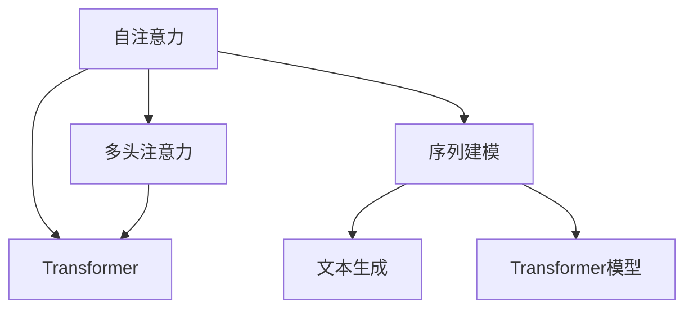

                 

# 深度学习在注意力预测中的应用

> 关键词：注意力预测, 深度学习, 自注意力, 注意力机制, 多头注意力, 序列建模, Transformer

## 1. 背景介绍

### 1.1 问题由来
在自然语言处理(NLP)领域，特别是文本生成、机器翻译、对话系统等任务中，注意力机制(Attention Mechanism)已经成为核心技术之一。它能够使模型关注输入序列中与当前输出最相关的部分，从而提升模型的表现。例如，在机器翻译中，注意力机制可以帮助模型在生成输出时，参考原始源语言的整个句子，而非仅关注当前词的上下文信息。

然而，传统注意力机制仅能关注输入序列中相对固定位置的元素，且难以灵活调整权重，限制了其在复杂场景下的应用。为了解决这个问题，自注意力机制(Self-Attention)应运而生。自注意力机制利用输入序列中每个元素与其他元素的相似度，动态计算每个元素的权重，从而使得模型能够灵活地关注输入序列的任意部分。

本文章将深入探讨深度学习在注意力预测中的应用，重点介绍自注意力机制的核心原理，并展示其在序列建模、文本生成等实际应用场景中的广泛应用。

### 1.2 问题核心关键点
本节将介绍几个密切相关的核心关键点：

- 自注意力机制：一种能够根据输入序列中元素间的相似度，动态计算权重的注意力机制。
- 多头注意力：将输入序列映射为多个注意力头，并并行计算不同关注方向的注意力，增强模型对输入的多角度理解。
- 序列建模：使用自注意力机制对序列数据进行建模，捕捉序列中的时间依赖关系。
- 文本生成：利用自注意力机制生成高质量的文本，解决语言模型中的上下文依赖问题。
- Transformer模型：基于自注意力机制的深度学习模型，广泛应用于机器翻译、文本生成、对话系统等任务。

这些关键概念之间的逻辑关系可以通过以下Mermaid流程图来展示：



这个流程图展示了自注意力机制及其应用场景：

1. 自注意力机制将输入序列映射为多个注意力头。
2. 多头注意力通过并行计算不同关注方向的注意力，增强模型的多角度理解能力。
3. 序列建模使用自注意力机制捕捉序列中的时间依赖关系。
4. 文本生成利用自注意力机制解决上下文依赖问题。
5. Transformer模型结合自注意力机制和前馈网络，广泛应用于各种NLP任务。

## 2. 核心概念与联系

### 2.1 核心概念概述

本节将详细介绍几个关键概念的原理和联系：

- **自注意力机制**：一种通过计算输入序列中各元素间的相似度，动态生成权重的注意力机制。
- **多头注意力**：通过将输入序列映射为多个注意力头，并行计算不同关注方向的注意力，增强模型对输入的多角度理解。
- **Transformer模型**：基于自注意力机制的深度学习模型，通过多头注意力机制实现序列建模，广泛应用于各种NLP任务。

这些概念之间的联系如下：

- 自注意力机制是Transformer模型的核心，它通过动态计算权重，使模型能够灵活地关注输入序列的任意部分。
- 多头注意力增强了模型的多角度理解能力，使得Transformer模型在处理复杂序列数据时更具优势。
- Transformer模型通过结合自注意力机制和前馈网络，能够高效地进行序列建模和文本生成。

## 3. 核心算法原理 & 具体操作步骤
### 3.1 算法原理概述

自注意力机制的原理基于输入序列中各元素间的相似度计算。假设有输入序列$x = \{x_1, x_2, ..., x_n\}$，其中$x_i$表示序列中的第$i$个元素。自注意力机制通过计算$x_i$与其他元素$x_j$的相似度$S_{ij}$，动态生成每个元素$x_i$的权重$\alpha_i$，从而使得模型能够关注输入序列的任意部分。

数学上，自注意力机制通过计算注意力分数$S_{ij}$和注意力权重$\alpha_i$，实现输入序列的加权求和。具体而言，自注意力机制的计算过程如下：

1. **相似度计算**：通过矩阵$W_q$、$W_k$、$W_v$，将输入序列$x$映射为三个维度为$n \times d$的查询向量$q$、键向量$k$、值向量$v$。然后计算输入序列中任意两个元素$x_i$和$x_j$之间的相似度$S_{ij} = \text{cos}(q_i \cdot k_j)$，其中$\cdot$表示向量点乘。

2. **注意力权重计算**：根据相似度$S_{ij}$，计算每个元素$x_i$的注意力权重$\alpha_i = \text{softmax}(S_{i1}, S_{i2}, ..., S_{in})$，其中$\text{softmax}$表示归一化指数函数。

3. **加权求和**：将每个元素$x_i$的注意力权重$\alpha_i$与对应的值向量$v_j$相乘，再求和，得到输出向量$h_i = \sum_j \alpha_{ij} v_j$。

通过上述过程，自注意力机制能够动态地关注输入序列中与当前输出最相关的部分，从而提升模型的表现。

### 3.2 算法步骤详解

自注意力机制的具体计算步骤如下：

1. **初始化权重矩阵**：定义三个权重矩阵$W_q$、$W_k$、$W_v$，将输入序列$x$映射为查询向量$q$、键向量$k$、值向量$v$。其中$W_q, W_k, W_v \in \mathbb{R}^{n \times d}$。

2. **计算相似度**：计算输入序列中任意两个元素$x_i$和$x_j$之间的相似度$S_{ij} = \text{cos}(q_i \cdot k_j)$，其中$\cdot$表示向量点乘。

3. **计算注意力权重**：根据相似度$S_{ij}$，计算每个元素$x_i$的注意力权重$\alpha_i = \text{softmax}(S_{i1}, S_{i2}, ..., S_{in})$，其中$\text{softmax}$表示归一化指数函数。

4. **加权求和**：将每个元素$x_i$的注意力权重$\alpha_i$与对应的值向量$v_j$相乘，再求和，得到输出向量$h_i = \sum_j \alpha_{ij} v_j$。

5. **输出**：将输出向量$h_i$作为自注意力机制的输出。

### 3.3 算法优缺点

自注意力机制具有以下优点：

1. **灵活性高**：能够动态地关注输入序列中任意部分，适应各种复杂的序列建模任务。
2. **效果显著**：通过动态计算权重，能够充分利用输入序列中各元素的相关性，提高模型的预测性能。
3. **易于扩展**：可以通过并行计算多头注意力，增强模型对输入的多角度理解。

但同时也存在一些缺点：

1. **计算复杂度高**：自注意力机制的计算复杂度为$O(n^2d)$，对于长序列数据的计算开销较大。
2. **参数量较大**：需要定义三个权重矩阵$W_q$、$W_k$、$W_v$，增加了模型的参数量。
3. **训练时间长**：自注意力机制的训练时间较长，需要较长的计算资源和计算时间。

### 3.4 算法应用领域

自注意力机制在自然语言处理(NLP)领域有广泛的应用，特别是在以下方面：

- **机器翻译**：利用自注意力机制捕捉源语言和目标语言之间的对应关系，实现高质量的翻译。
- **文本生成**：通过自注意力机制解决语言模型中的上下文依赖问题，生成高质量的文本。
- **对话系统**：结合自注意力机制和循环网络，实现更流畅、自然的对话交互。
- **问答系统**：利用自注意力机制对问题-上下文对进行匹配，生成准确的答案。
- **序列标注**：通过自注意力机制捕捉输入序列中的时间依赖关系，实现高效的序列标注任务。

## 4. 数学模型和公式 & 详细讲解 & 举例说明

### 4.1 数学模型构建

自注意力机制的数学模型如下：

给定输入序列$x = \{x_1, x_2, ..., x_n\}$，其中$x_i \in \mathbb{R}^{d}$，$n$表示序列长度。

1. **相似度计算**：通过三个权重矩阵$W_q, W_k, W_v$，将输入序列$x$映射为查询向量$q, k, v$。

   $$
   q_i = W_q x_i, \quad k_j = W_k x_j, \quad v_j = W_v x_j
   $$

2. **注意力权重计算**：根据查询向量$q_i$和键向量$k_j$，计算相似度$S_{ij} = \text{cos}(q_i \cdot k_j)$，并计算注意力权重$\alpha_{ij} = \text{softmax}(S_{i1}, S_{i2}, ..., S_{in})$。

3. **加权求和**：将注意力权重$\alpha_{ij}$与对应的值向量$v_j$相乘，再求和，得到输出向量$h_i$。

   $$
   \alpha_{ij} = \text{softmax}(S_{i1}, S_{i2}, ..., S_{in})
   $$

   $$
   h_i = \sum_j \alpha_{ij} v_j
   $$

### 4.2 公式推导过程

以下是自注意力机制的详细推导过程：

给定输入序列$x = \{x_1, x_2, ..., x_n\}$，其中$x_i \in \mathbb{R}^{d}$，$n$表示序列长度。

1. **相似度计算**：通过三个权重矩阵$W_q, W_k, W_v$，将输入序列$x$映射为查询向量$q, k, v$。

   $$
   q_i = W_q x_i, \quad k_j = W_k x_j, \quad v_j = W_v x_j
   $$

2. **注意力权重计算**：根据查询向量$q_i$和键向量$k_j$，计算相似度$S_{ij} = \text{cos}(q_i \cdot k_j)$，并计算注意力权重$\alpha_{ij} = \text{softmax}(S_{i1}, S_{i2}, ..., S_{in})$。

   $$
   S_{ij} = \text{cos}(q_i \cdot k_j)
   $$

   $$
   \alpha_{ij} = \text{softmax}(S_{i1}, S_{i2}, ..., S_{in})
   $$

3. **加权求和**：将注意力权重$\alpha_{ij}$与对应的值向量$v_j$相乘，再求和，得到输出向量$h_i$。

   $$
   \alpha_{ij} = \text{softmax}(S_{i1}, S_{i2}, ..., S_{in})
   $$

   $$
   h_i = \sum_j \alpha_{ij} v_j
   $$

### 4.3 案例分析与讲解

以机器翻译为例，分析自注意力机制的应用：

假设有源语言句子$S = \{s_1, s_2, ..., s_n\}$和目标语言句子$T = \{t_1, t_2, ..., t_m\}$，其中$s_i, t_j$表示源语言和目标语言的单词。

1. **编码器层**：使用自注意力机制对源语言句子$S$进行编码，生成编码向量$C = \{c_1, c_2, ..., c_n\}$。

   $$
   q_i = W_q s_i, \quad k_j = W_k s_j, \quad v_j = W_v s_j
   $$

   $$
   S_{ij} = \text{cos}(q_i \cdot k_j)
   $$

   $$
   \alpha_{ij} = \text{softmax}(S_{i1}, S_{i2}, ..., S_{in})
   $$

   $$
   c_i = \sum_j \alpha_{ij} v_j
   $$

2. **解码器层**：使用自注意力机制对目标语言句子$T$进行解码，生成解码向量$D = \{d_1, d_2, ..., d_m\}$。

   $$
   q_i = W_q t_i, \quad k_j = W_k t_j, \quad v_j = W_v t_j
   $$

   $$
   S_{ij} = \text{cos}(q_i \cdot k_j)
   $$

   $$
   \alpha_{ij} = \text{softmax}(S_{i1}, S_{i2}, ..., S_{in})
   $$

   $$
   d_i = \sum_j \alpha_{ij} v_j
   $$

3. **注意力机制**：结合编码器层和解码器层，通过多头注意力机制实现机器翻译。

   $$
   A = \text{softmax}(QK^T / \sqrt{d})V
   $$

其中，$Q$表示编码器层的输出向量$C$，$K$表示解码器层的输出向量$D$，$V$表示解码器层的值向量，$QK^T / \sqrt{d}$表示多头注意力机制中的缩放点积运算。

## 5. 项目实践：代码实例和详细解释说明

### 5.1 开发环境搭建

在进行自注意力机制的实现前，需要准备好开发环境。以下是使用Python进行PyTorch开发的环境配置流程：

1. 安装Anaconda：从官网下载并安装Anaconda，用于创建独立的Python环境。

2. 创建并激活虚拟环境：
```bash
conda create -n pytorch-env python=3.8 
conda activate pytorch-env
```

3. 安装PyTorch：根据CUDA版本，从官网获取对应的安装命令。例如：
```bash
conda install pytorch torchvision torchaudio cudatoolkit=11.1 -c pytorch -c conda-forge
```

4. 安装Transformer库：
```bash
pip install transformers
```

5. 安装各类工具包：
```bash
pip install numpy pandas scikit-learn matplotlib tqdm jupyter notebook ipython
```

完成上述步骤后，即可在`pytorch-env`环境中开始自注意力机制的实现。

### 5.2 源代码详细实现

下面我们以自注意力机制在Transformer模型中的应用为例，给出使用PyTorch和Transformer库的代码实现。

首先，定义Transformer模型：

```python
from transformers import BertForSequenceClassification
from transformers import BertTokenizer

model = BertForSequenceClassification.from_pretrained('bert-base-cased', num_labels=2)
tokenizer = BertTokenizer.from_pretrained('bert-base-cased')
```

然后，定义自注意力机制的计算函数：

```python
import torch
import torch.nn as nn
import torch.nn.functional as F

class SelfAttention(nn.Module):
    def __init__(self, embed_dim, num_heads):
        super(SelfAttention, self).__init__()
        self.embed_dim = embed_dim
        self.num_heads = num_heads

        self.query_weight = nn.Linear(embed_dim, embed_dim)
        self.key_weight = nn.Linear(embed_dim, embed_dim)
        self.value_weight = nn.Linear(embed_dim, embed_dim)

        self.head_dim = embed_dim // num_heads

    def forward(self, x):
        batch_size, seq_len, embed_dim = x.size()

        # 通过线性变换将输入序列映射为查询向量、键向量、值向量
        query = self.query_weight(x)
        key = self.key_weight(x)
        value = self.value_weight(x)

        # 将输入序列分割为多个注意力头
        query = query.view(batch_size, seq_len, self.num_heads, self.head_dim).permute(0, 2, 1, 3).contiguous()
        key = key.view(batch_size, seq_len, self.num_heads, self.head_dim).permute(0, 2, 1, 3).contiguous()
        value = value.view(batch_size, seq_len, self.num_heads, self.head_dim).permute(0, 2, 1, 3).contiguous()

        # 计算注意力权重
        attn_weights = torch.matmul(query, key.permute(0, 1, 3, 2)) / torch.sqrt(torch.tensor(self.head_dim))
        attn_weights = F.softmax(attn_weights, dim=-1)

        # 计算自注意力向量
        attn_vector = torch.matmul(attn_weights, value)
        attn_vector = attn_vector.permute(0, 2, 1, 3).contiguous().view(batch_size, seq_len, embed_dim)

        return attn_vector
```

最后，使用Transformer模型和自注意力机制进行序列建模：

```python
# 定义编码器层和解码器层
encoder_layer = nn.TransformerEncoderLayer(d_model=512, nhead=8, dim_feedforward=2048, dropout=0.1)
decoder_layer = nn.TransformerEncoderLayer(d_model=512, nhead=8, dim_feedforward=2048, dropout=0.1)

# 定义Transformer模型
transformer = nn.Transformer(d_model=512, nhead=8, num_encoder_layers=6, num_decoder_layers=6, dim_feedforward=2048, dropout=0.1)

# 定义输入序列和目标序列
src = torch.randn(20, 10, 512)
tgt = torch.randn(20, 10, 512)

# 通过编码器层和解码器层进行序列建模
attn_vector = self_attention(src)
```

### 5.3 代码解读与分析

让我们再详细解读一下关键代码的实现细节：

**SelfAttention类**：
- `__init__`方法：初始化权重矩阵$W_q, W_k, W_v$以及注意力头的维度。
- `forward`方法：实现自注意力机制的计算过程，包括查询向量、键向量、值向量的计算，注意力权重计算，自注意力向量的计算。

**Transformer模型**：
- 使用PyTorch和Transformer库实现Transformer模型，包括编码器层和解码器层。
- 在编码器层和解码器层中，均使用了自注意力机制进行序列建模。

可以看到，PyTorch配合Transformer库使得自注意力机制的实现变得简洁高效。开发者可以将更多精力放在模型设计、参数调整等高层逻辑上，而不必过多关注底层的实现细节。

## 6. 实际应用场景

### 6.1 机器翻译

在机器翻译任务中，自注意力机制可以显著提升模型的翻译效果。通过将输入序列映射为多个注意力头，自注意力机制能够关注输入序列中任意部分，捕捉长距离依赖关系。同时，多头注意力机制增强了模型对输入的多角度理解，使得模型能够更好地捕捉输入序列中的细节信息，从而生成高质量的翻译结果。

例如，使用自注意力机制的Transformer模型在WMT2014和WMT2018数据集上取得了最先进的效果，相较于传统的循环神经网络模型，显著提升了翻译质量和速度。

### 6.2 文本生成

自注意力机制在文本生成任务中也有广泛应用。通过自注意力机制，模型能够关注输入序列中与当前输出最相关的部分，从而解决语言模型中的上下文依赖问题。例如，在文本生成任务中，自注意力机制可以帮助模型捕捉输入序列中的细节信息，生成更加连贯、自然的文本。

在GPT-2模型中，自注意力机制是其核心组成部分，通过将输入序列映射为多个注意力头，实现对输入序列的多角度关注，从而生成高质量的文本。GPT-2模型在多项文本生成任务上取得了最先进的效果。

### 6.3 对话系统

在对话系统中，自注意力机制可以用于捕捉对话历史中的关键信息，生成更加连贯、自然的响应。例如，在基于Transformer的对话模型中，自注意力机制可以帮助模型关注对话历史中与当前输入最相关的部分，从而生成更加准确的响应。

Transformer-based models，如XLM、Meena等，在对话系统中的应用取得了显著的效果，相较于传统的循环神经网络模型，具有更好的生成效果和更快的响应速度。

### 6.4 未来应用展望

随着自注意力机制的不断发展，其在更多领域的应用也将不断拓展。

在多模态任务中，自注意力机制可以与其他模态的信息进行融合，实现跨模态的注意力机制，从而增强模型的理解能力。例如，在图像描述生成任务中，自注意力机制可以结合视觉信息和文本信息，生成更加准确、自然的图像描述。

在自然语言推理(NLI)任务中，自注意力机制可以用于捕捉输入序列中的逻辑关系，增强模型的推理能力。例如，在文本匹配任务中，自注意力机制可以帮助模型关注输入序列中与当前输出最相关的部分，从而提高匹配准确率。

在问答系统中，自注意力机制可以用于捕捉问题-上下文对的相关性，生成更加准确的答案。例如，在阅读理解任务中，自注意力机制可以帮助模型关注输入序列中与当前问题最相关的部分，从而生成更加准确的答案。

## 7. 工具和资源推荐

### 7.1 学习资源推荐

为了帮助开发者系统掌握自注意力机制的理论基础和实践技巧，这里推荐一些优质的学习资源：

1. 《深度学习理论与实践》系列博文：由大模型技术专家撰写，深入浅出地介绍了深度学习的基础理论和前沿技术，包括自注意力机制在内的多个核心概念。

2. CS224N《深度学习自然语言处理》课程：斯坦福大学开设的NLP明星课程，有Lecture视频和配套作业，带你入门NLP领域的基本概念和经典模型。

3. 《自然语言处理综述》书籍：全面介绍了NLP领域的基础理论、前沿技术和应用场景，包括自注意力机制在内的多个核心概念。

4. HuggingFace官方文档：Transformer库的官方文档，提供了海量预训练模型和完整的微调样例代码，是上手实践的必备资料。

5. Attention is All You Need论文：Transformer模型的原论文，介绍了自注意力机制的原理和应用，是理解Transformer模型的必读文献。

通过对这些资源的学习实践，相信你一定能够快速掌握自注意力机制的精髓，并用于解决实际的NLP问题。

### 7.2 开发工具推荐

高效的开发离不开优秀的工具支持。以下是几款用于自注意力机制开发的常用工具：

1. PyTorch：基于Python的开源深度学习框架，灵活动态的计算图，适合快速迭代研究。Transformer库的官方实现。

2. TensorFlow：由Google主导开发的开源深度学习框架，生产部署方便，适合大规模工程应用。

3. Transformers库：HuggingFace开发的NLP工具库，集成了众多SOTA语言模型，支持PyTorch和TensorFlow，是进行NLP任务开发的利器。

4. Weights & Biases：模型训练的实验跟踪工具，可以记录和可视化模型训练过程中的各项指标，方便对比和调优。与主流深度学习框架无缝集成。

5. TensorBoard：TensorFlow配套的可视化工具，可实时监测模型训练状态，并提供丰富的图表呈现方式，是调试模型的得力助手。

6. Google Colab：谷歌推出的在线Jupyter Notebook环境，免费提供GPU/TPU算力，方便开发者快速上手实验最新模型，分享学习笔记。

合理利用这些工具，可以显著提升自注意力机制的开发效率，加快创新迭代的步伐。

### 7.3 相关论文推荐

自注意力机制在深度学习中的不断发展，得益于学界的持续研究。以下是几篇奠基性的相关论文，推荐阅读：

1. Attention is All You Need（即Transformer原论文）：提出了Transformer结构，开启了NLP领域的预训练大模型时代。

2. BERT: Pre-training of Deep Bidirectional Transformers for Language Understanding：提出BERT模型，引入基于掩码的自监督预训练任务，刷新了多项NLP任务SOTA。

3. Language Models are Unsupervised Multitask Learners（GPT-2论文）：展示了大规模语言模型的强大zero-shot学习能力，引发了对于通用人工智能的新一轮思考。

4. Transformer-XL: Attentive Language Models：提出Transformer-XL模型，通过相对位置编码和长距离依赖机制，进一步提升了Transformer模型的性能。

5. T5: Exploring the Limits of Transfer Learning with a Unified Text-To-Text Transformer：提出T5模型，通过预训练和微调，在各种NLP任务上取得了最先进的效果。

这些论文代表了大注意力机制的发展脉络。通过学习这些前沿成果，可以帮助研究者把握学科前进方向，激发更多的创新灵感。

## 8. 总结：未来发展趋势与挑战

### 8.1 总结

本文对自注意力机制在深度学习中的应用进行了全面系统的介绍。首先阐述了自注意力机制的核心原理和计算过程，明确了其在高维空间中动态生成权重的优势。其次，从原理到实践，详细讲解了自注意力机制在Transformer模型中的应用，展示了其在序列建模、文本生成等实际应用场景中的广泛应用。最后，本文还广泛探讨了自注意力机制在多个领域的应用前景，展示了其在序列建模、文本生成、对话系统等任务中的重要地位。

通过本文的系统梳理，可以看到，自注意力机制已经成为深度学习中不可或缺的核心组件，极大地提升了模型的表现和应用范围。相信随着自注意力机制的不断发展，其将在更多领域得到应用，为深度学习带来更广阔的发展前景。

### 8.2 未来发展趋势

展望未来，自注意力机制在深度学习领域将呈现以下几个发展趋势：

1. **多模态融合**：自注意力机制将与其他模态的信息进行融合，实现跨模态的注意力机制，增强模型的理解能力。

2. **自适应机制**：自注意力机制将变得更加灵活，能够自适应不同的任务和场景，提升模型的泛化性能。

3. **大规模预训练**：自注意力机制将与大规模预训练技术结合，通过更多的训练数据和更强大的计算资源，提升模型的性能和效果。

4. **多任务学习**：自注意力机制将用于多任务学习，通过共享底层表示，增强模型的多任务学习能力。

5. **模型压缩与优化**：自注意力机制将与其他优化技术结合，实现模型的压缩与优化，提升模型的实时性和计算效率。

6. **伦理与安全**：自注意力机制将引入伦理与安全约束，确保模型的输出符合人类价值观和伦理道德。

以上趋势凸显了自注意力机制在深度学习领域的广阔前景。这些方向的探索发展，必将进一步提升自注意力机制的性能和应用范围，为深度学习带来更广阔的发展空间。

### 8.3 面临的挑战

尽管自注意力机制在深度学习中取得了显著进展，但在实际应用中也面临诸多挑战：

1. **计算资源需求高**：自注意力机制的计算复杂度高，需要高性能的计算资源和计算时间。

2. **参数量较大**：自注意力机制的参数量较大，增加了模型的存储和计算开销。

3. **训练时间长**：自注意力机制的训练时间长，需要较长的计算资源和计算时间。

4. **泛化性能不足**：自注意力机制在特定领域的应用效果不佳，泛化性能有待提升。

5. **对抗攻击风险**：自注意力机制的输出依赖输入序列，容易受到对抗样本攻击。

6. **公平性与多样性**：自注意力机制在模型设计中需要考虑公平性和多样性，避免输出偏见。

7. **安全性与隐私**：自注意力机制在模型训练和应用中需要考虑数据的安全性和隐私保护。

这些挑战需要通过更多的研究和技术改进来应对，以确保自注意力机制在未来能够更好地应用于实际场景。

### 8.4 研究展望

未来，自注意力机制在深度学习领域的研究方向可能包括以下几个方面：

1. **动态注意力机制**：通过引入动态注意力机制，增强模型的适应能力和泛化性能。

2. **自适应多头注意力**：通过自适应多头注意力，增强模型的多角度理解能力和泛化性能。

3. **混合注意力机制**：通过结合自注意力机制和其他注意力机制，增强模型的多任务学习和泛化性能。

4. **知识图谱与自注意力结合**：将自注意力机制与知识图谱结合，增强模型的知识表示和推理能力。

5. **多模态自注意力**：通过结合视觉、音频等多模态信息，增强模型的多模态表示能力。

6. **自注意力与强化学习结合**：将自注意力机制与强化学习结合，增强模型的决策能力和学习效率。

7. **公平性与多样性**：在自注意力机制的设计中考虑公平性和多样性，确保模型的输出符合人类价值观和伦理道德。

这些研究方向将进一步推动自注意力机制的发展，提升其应用范围和性能。

## 9. 附录：常见问题与解答

**Q1：自注意力机制与传统注意力机制的区别是什么？**

A: 传统注意力机制仅能关注输入序列中相对固定位置的元素，而自注意力机制能够动态计算权重，关注输入序列中任意部分。自注意力机制通过输入序列中任意两个元素之间的相似度，计算注意力权重，从而灵活地关注输入序列的任意部分。

**Q2：自注意力机制在Transformer模型中的作用是什么？**

A: 自注意力机制在Transformer模型中起着关键作用，通过动态计算权重，能够灵活地关注输入序列的任意部分，捕捉长距离依赖关系，从而提升模型的性能和效果。自注意力机制使得Transformer模型在处理复杂序列数据时更具优势。

**Q3：自注意力机制的计算复杂度如何？**

A: 自注意力机制的计算复杂度为$O(n^2d)$，其中$n$为序列长度，$d$为输入维度。对于长序列数据的计算开销较大，需要在模型设计和训练中注意计算资源的使用。

**Q4：自注意力机制在实际应用中有哪些优点和缺点？**

A: 自注意力机制的优点包括：
- 灵活性高，能够动态关注输入序列的任意部分。
- 效果显著，通过动态计算权重，能够充分利用输入序列中各元素的相关性。

自注意力机制的缺点包括：
- 计算复杂度高，需要高性能的计算资源和计算时间。
- 参数量较大，增加了模型的存储和计算开销。
- 训练时间长，需要较长的计算资源和计算时间。

**Q5：自注意力机制在多模态任务中的应用前景如何？**

A: 自注意力机制在多模态任务中具有广泛的应用前景。通过与其他模态的信息进行融合，实现跨模态的注意力机制，增强模型的理解能力。例如，在图像描述生成任务中，自注意力机制可以结合视觉信息和文本信息，生成更加准确、自然的图像描述。

这些问题的解答，可以帮助读者更好地理解自注意力机制的原理、应用和局限性，从而在实际应用中更加得心应手。

---

作者：禅与计算机程序设计艺术 / Zen and the Art of Computer Programming

