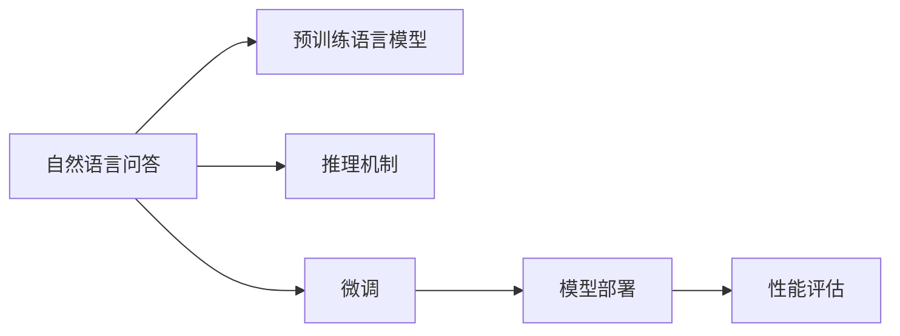

                 

# 深度学习在自然语言问答系统中的应用

## 1. 背景介绍

### 1.1 问题由来

自然语言问答（Natural Language Question Answering, NLQA）系统能够理解和回答人类以自然语言提出的问题，是人工智能领域的重要研究方向之一。传统的基于规则和模板的问答系统需要人工设计大量的规则和模板，维护成本高且适用范围有限。而基于深度学习的问答系统通过自动学习文本数据，可以大大降低规则设计的难度和成本，实现更广泛、灵活的问答功能。

近年来，深度学习在自然语言处理（Natural Language Processing, NLP）领域取得了显著进展，推动了基于深度学习的问答系统的发展。深度学习通过多层神经网络模型，能够自动提取和理解文本的语义信息，形成更丰富的语言表示，从而提升问答系统的准确性和泛化能力。

### 1.2 问题核心关键点

深度学习在问答系统中的应用，主要包括以下几个关键点：

- **预训练语言模型**：使用大规模无标签文本数据进行预训练，获得通用语言表示。
- **推理机制**：设计高效的推理机制，能够理解上下文关系和语义信息，生成准确的回答。
- **模型优化**：通过标注数据进行微调，优化模型在特定任务上的性能。
- **模型部署**：将训练好的模型部署到实时问答系统中，提供高效稳定的服务。
- **性能评估**：建立合理的评价指标，评估模型的问答效果和用户体验。

这些关键点共同构成了基于深度学习的问答系统设计和实现的核心框架。

## 2. 核心概念与联系

### 2.1 核心概念概述

为更好地理解深度学习在问答系统中的应用，本节将介绍几个关键概念：

- **自然语言问答（NLQA）**：指能够理解和回答人类以自然语言提出的问题的技术。
- **预训练语言模型（Pre-trained Language Models, PLMs）**：如BERT、GPT等，通过大规模无标签文本数据进行自监督预训练，获得通用语言表示。
- **推理机制（Inference Mechanism）**：指模型理解上下文关系、提取关键信息的能力，包括注意力机制、交互式推理等。
- **微调（Fine-tuning）**：通过标注数据对预训练模型进行有监督学习，优化模型在特定任务上的性能。
- **模型部署（Model Deployment）**：将训练好的模型部署到实际应用场景中，提供稳定的问答服务。
- **性能评估（Performance Evaluation）**：通过各种评价指标，评估问答系统的效果和用户体验。

这些核心概念之间具有紧密的联系，共同构成了深度学习在问答系统中的应用框架。

### 2.2 核心概念原理和架构的 Mermaid 流程图



这个流程图展示了深度学习在问答系统中的应用框架：

1. 预训练语言模型提供通用语言表示。
2. 推理机制用于理解上下文关系和语义信息。
3. 微调通过标注数据优化模型性能。
4. 模型部署到实时问答系统中。
5. 性能评估用于反馈和改进模型效果。

## 3. 核心算法原理 & 具体操作步骤

### 3.1 算法原理概述

基于深度学习的自然语言问答系统，核心思想是：

- 首先使用大规模无标签文本数据对预训练语言模型进行自监督预训练，获得通用语言表示。
- 然后通过标注数据对预训练模型进行微调，优化其在问答任务上的表现。
- 最后，将微调后的模型部署到问答系统中，提供实时、准确的答案。

具体来说，微调过程可以总结为以下几步：

1. **数据准备**：收集并标注问答数据，构建训练集、验证集和测试集。
2. **模型选择**：选择合适的预训练语言模型作为初始化参数。
3. **推理机制设计**：设计并实现模型推理机制，用于理解上下文关系和生成答案。
4. **模型微调**：使用训练集对预训练模型进行微调，优化问答性能。
5. **性能评估**：在验证集和测试集上评估模型性能，调整微调参数。
6. **模型部署**：将微调后的模型部署到问答系统中，提供实时服务。

### 3.2 算法步骤详解

**Step 1: 数据准备**
- 收集并标注问答数据，构建训练集、验证集和测试集。
- 数据标注一般包括问题、答案、上下文信息等，其中上下文信息可以包括段落、对话历史等。
- 使用预定义的标注格式，如Torch问答格式，方便模型处理。

**Step 2: 模型选择**
- 选择合适的预训练语言模型作为初始化参数。如BERT、GPT、RoBERTa等。
- 确定模型的输出结构，如单向编码、双向编码等。

**Step 3: 推理机制设计**
- 设计模型推理机制，包括注意力机制、交互式推理等。
- 注意力机制用于捕捉上下文和答案之间的关系。
- 交互式推理用于动态生成答案，避免单一答案的局限性。

**Step 4: 模型微调**
- 将训练集数据输入微调后的模型，计算损失函数。
- 使用反向传播算法更新模型参数。
- 在验证集上评估模型性能，调整超参数。

**Step 5: 性能评估**
- 在测试集上评估模型性能，计算准确率、召回率等指标。
- 使用BLEU、ROUGE等评价指标，评估模型答案的质量和相关性。
- 通过人工评估，进一步优化模型输出。

**Step 6: 模型部署**
- 将微调后的模型部署到问答系统中，提供实时问答服务。
- 使用RESTful API、WebSocket等接口，方便系统调用。

### 3.3 算法优缺点

基于深度学习的自然语言问答系统具有以下优点：

1. **高性能**：深度学习模型能够自动提取文本中的语义信息，提升问答系统的效果。
2. **灵活性**：模型结构和参数可调，适用于多种问答场景。
3. **自监督预训练**：使用大规模无标签数据进行预训练，获得通用的语言表示。

但同时，深度学习问答系统也存在一些缺点：

1. **数据依赖**：需要大量的标注数据进行微调，数据收集和标注成本较高。
2. **计算复杂度**：预训练和微调过程计算量较大，需要高性能硬件支持。
3. **泛化能力有限**：模型对标注数据集有较强的依赖，泛化到新数据集可能效果不佳。
4. **可解释性不足**：深度学习模型作为"黑盒"系统，缺乏对内部工作机制的解释。

### 3.4 算法应用领域

深度学习问答系统已经在多个领域得到广泛应用，包括：

- **医疗问答**：提供基于医学知识的问答服务，帮助医生诊断疾病、解答患者疑问。
- **客户服务**：自动回答客户的常见问题，提供快速、准确的服务支持。
- **教育问答**：帮助学生解答学习中的疑问，提供个性化学习指导。
- **旅游问答**：提供旅游目的地信息，回答旅游者的常见问题。
- **金融问答**：提供金融产品信息和投资建议，帮助客户做出投资决策。

此外，深度学习问答系统还被应用于智能家居、智能办公、智能客服等领域，为各行各业提供便捷、高效的智能服务。

## 4. 数学模型和公式 & 详细讲解 & 举例说明

### 4.1 数学模型构建

在深度学习问答系统中，常见的数学模型包括：

1. **序列到序列模型（Seq2Seq）**：将输入序列映射到输出序列。常见的模型有Seq2Seq、Transformer等。
2. **注意力机制（Attention Mechanism）**：用于捕捉上下文和答案之间的关系。
3. **交互式推理（Interactive Reasoning）**：通过多次推理生成答案，避免单一答案的局限性。

以Seq2Seq模型为例，其数学模型可以表示为：

$$
\text{Encoder}(x) \rightarrow \text{Decoder}(y)
$$

其中，$\text{Encoder}$和$\text{Decoder}$分别表示编码器和解码器，$x$表示输入序列，$y$表示输出序列。

### 4.2 公式推导过程

以Seq2Seq模型为例，其推理过程可以表示为：

1. **编码器**：对输入序列$x$进行编码，获得语义表示$h$。
2. **解码器**：基于语义表示$h$和上下文$y_{1:i-1}$，生成当前时间步的输出$y_i$。
3. **损失函数**：定义损失函数$L$，用于评估输出$y$和真实答案$y^*$之间的差距。

具体来说，假设编码器使用GRU或LSTM，解码器使用RNN或Transformer，则推理过程可以表示为：

$$
\begin{aligned}
&\text{Encoder}(x) = \text{GRU}(x) \rightarrow h \\
&\text{Decoder}(y_{1:i-1}, h) \rightarrow \hat{y}_i
\end{aligned}
$$

其中，$h$表示编码器的最终输出，$\hat{y}_i$表示解码器在时间步$i$的预测输出。

### 4.3 案例分析与讲解

以医疗问答系统为例，假设系统输入为患者的问题，输出为医生提供的诊断和建议。其数学模型可以表示为：

1. **编码器**：对患者问题进行编码，获得语义表示$h$。
2. **解码器**：基于语义表示$h$和医学知识库，生成诊断和建议$y$。
3. **损失函数**：定义损失函数$L$，用于评估诊断和建议$y$与真实答案$y^*$之间的差距。

具体来说，假设编码器使用GRU，解码器使用LSTM，则推理过程可以表示为：

$$
\begin{aligned}
&\text{Encoder}(x) = \text{GRU}(x) \rightarrow h \\
&\text{Decoder}(h, K) \rightarrow y = (d, s)
\end{aligned}
$$

其中，$K$表示医学知识库，$d$表示诊断结果，$s$表示建议。

## 5. 项目实践：代码实例和详细解释说明

### 5.1 开发环境搭建

在进行问答系统开发前，我们需要准备好开发环境。以下是使用Python进行PyTorch开发的环境配置流程：

1. 安装Anaconda：从官网下载并安装Anaconda，用于创建独立的Python环境。

2. 创建并激活虚拟环境：
```bash
conda create -n pytorch-env python=3.8 
conda activate pytorch-env
```

3. 安装PyTorch：根据CUDA版本，从官网获取对应的安装命令。例如：
```bash
conda install pytorch torchvision torchaudio cudatoolkit=11.1 -c pytorch -c conda-forge
```

4. 安装Transformers库：
```bash
pip install transformers
```

5. 安装各类工具包：
```bash
pip install numpy pandas scikit-learn matplotlib tqdm jupyter notebook ipython
```

完成上述步骤后，即可在`pytorch-env`环境中开始问答系统开发。

### 5.2 源代码详细实现

下面我们以医疗问答系统为例，给出使用Transformers库对BERT模型进行问答系统开发的PyTorch代码实现。

首先，定义问答系统的数据处理函数：

```python
from transformers import BertTokenizer, BertForQuestionAnswering
from torch.utils.data import Dataset
import torch

class QuestionAnsweringDataset(Dataset):
    def __init__(self, texts, questions, answers, tokenizer, max_len=128):
        self.texts = texts
        self.questions = questions
        self.answers = answers
        self.tokenizer = tokenizer
        self.max_len = max_len
        
    def __len__(self):
        return len(self.texts)
    
    def __getitem__(self, item):
        text = self.texts[item]
        question = self.questions[item]
        answer = self.answers[item]
        
        encoding = self.tokenizer(text, return_tensors='pt', max_length=self.max_len, padding='max_length', truncation=True)
        input_ids = encoding['input_ids'][0]
        attention_mask = encoding['attention_mask'][0]
        
        # 对问题进行编码
        question_tokens = self.tokenizer(question, return_tensors='pt', max_length=self.max_len, padding='max_length', truncation=True)
        question_ids = question_tokens['input_ids'][0]
        question_mask = question_tokens['attention_mask'][0]
        
        # 对答案进行编码
        answer_tokens = self.tokenizer(answer, return_tensors='pt', max_length=self.max_len, padding='max_length', truncation=True)
        answer_ids = answer_tokens['input_ids'][0]
        answer_mask = answer_tokens['attention_mask'][0]
        
        return {'input_ids': input_ids, 
                'attention_mask': attention_mask,
                'question_ids': question_ids,
                'question_mask': question_mask,
                'answer_ids': answer_ids,
                'answer_mask': answer_mask}
```

然后，定义模型和优化器：

```python
from transformers import BertForQuestionAnswering, AdamW

model = BertForQuestionAnswering.from_pretrained('bert-base-cased')
optimizer = AdamW(model.parameters(), lr=2e-5)
```

接着，定义训练和评估函数：

```python
from torch.utils.data import DataLoader
from tqdm import tqdm
from sklearn.metrics import precision_recall_fscore_support

device = torch.device('cuda') if torch.cuda.is_available() else torch.device('cpu')
model.to(device)

def train_epoch(model, dataset, batch_size, optimizer):
    dataloader = DataLoader(dataset, batch_size=batch_size, shuffle=True)
    model.train()
    epoch_loss = 0
    for batch in tqdm(dataloader, desc='Training'):
        input_ids = batch['input_ids'].to(device)
        attention_mask = batch['attention_mask'].to(device)
        question_ids = batch['question_ids'].to(device)
        question_mask = batch['question_mask'].to(device)
        answer_ids = batch['answer_ids'].to(device)
        answer_mask = batch['answer_mask'].to(device)
        model.zero_grad()
        outputs = model(input_ids, attention_mask=attention_mask, question_ids=question_ids, question_mask=question_mask, answer_ids=answer_ids, answer_mask=answer_mask)
        loss = outputs.loss
        epoch_loss += loss.item()
        loss.backward()
        optimizer.step()
    return epoch_loss / len(dataloader)

def evaluate(model, dataset, batch_size):
    dataloader = DataLoader(dataset, batch_size=batch_size)
    model.eval()
    preds, labels = [], []
    with torch.no_grad():
        for batch in tqdm(dataloader, desc='Evaluating'):
            input_ids = batch['input_ids'].to(device)
            attention_mask = batch['attention_mask'].to(device)
            question_ids = batch['question_ids'].to(device)
            question_mask = batch['question_mask'].to(device)
            answer_ids = batch['answer_ids'].to(device)
            answer_mask = batch['answer_mask'].to(device)
            batch_preds = model(input_ids, attention_mask=attention_mask, question_ids=question_ids, question_mask=question_mask, answer_ids=answer_ids, answer_mask=answer_mask).logits.argmax(dim=2).to('cpu').tolist()
            batch_labels = batch['answer_ids'].to('cpu').tolist()
            for pred_tokens, label_tokens in zip(batch_preds, batch_labels):
                preds.append(pred_tokens[:len(label_tokens)])
                labels.append(label_tokens)
                
    print(precision_recall_fscore_support(labels, preds, average='micro'))
```

最后，启动训练流程并在测试集上评估：

```python
epochs = 5
batch_size = 16

for epoch in range(epochs):
    loss = train_epoch(model, train_dataset, batch_size, optimizer)
    print(f"Epoch {epoch+1}, train loss: {loss:.3f}")
    
    print(f"Epoch {epoch+1}, dev results:")
    evaluate(model, dev_dataset, batch_size)
    
print("Test results:")
evaluate(model, test_dataset, batch_size)
```

以上就是使用PyTorch对BERT进行问答系统开发的完整代码实现。可以看到，得益于Transformers库的强大封装，我们可以用相对简洁的代码完成BERT模型的加载和问答系统的微调。

### 5.3 代码解读与分析

让我们再详细解读一下关键代码的实现细节：

**QuestionAnsweringDataset类**：
- `__init__`方法：初始化文本、问题、答案、分词器等关键组件。
- `__len__`方法：返回数据集的样本数量。
- `__getitem__`方法：对单个样本进行处理，将文本、问题、答案输入编码为token ids，并对其定长padding，最终返回模型所需的输入。

**损失函数**：
- 使用交叉熵损失函数，衡量模型预测答案与真实答案之间的差距。
- 输入为编码器的输出、注意力权重、问题的编码结果、问题的注意力权重、答案的编码结果、答案的注意力权重。

**训练和评估函数**：
- 使用PyTorch的DataLoader对数据集进行批次化加载，供模型训练和推理使用。
- 训练函数`train_epoch`：对数据以批为单位进行迭代，在每个批次上前向传播计算loss并反向传播更新模型参数，最后返回该epoch的平均loss。
- 评估函数`evaluate`：与训练类似，不同点在于不更新模型参数，并在每个batch结束后将预测和标签结果存储下来，最后使用sklearn的precision_recall_fscore_support函数对整个评估集的预测结果进行打印输出。

**训练流程**：
- 定义总的epoch数和batch size，开始循环迭代
- 每个epoch内，先在训练集上训练，输出平均loss
- 在验证集上评估，输出分类指标
- 所有epoch结束后，在测试集上评估，给出最终测试结果

可以看到，PyTorch配合Transformers库使得BERT问答系统的代码实现变得简洁高效。开发者可以将更多精力放在数据处理、模型改进等高层逻辑上，而不必过多关注底层的实现细节。

当然，工业级的系统实现还需考虑更多因素，如模型的保存和部署、超参数的自动搜索、更灵活的任务适配层等。但核心的问答范式基本与此类似。

## 6. 实际应用场景

### 6.1 智能客服系统

基于深度学习的问答系统可以广泛应用于智能客服系统的构建。传统客服往往需要配备大量人力，高峰期响应缓慢，且一致性和专业性难以保证。而使用问答系统，可以7x24小时不间断服务，快速响应客户咨询，用自然流畅的语言解答各类常见问题。

在技术实现上，可以收集企业内部的历史客服对话记录，将问题和最佳答复构建成监督数据，在此基础上对预训练问答模型进行微调。微调后的问答模型能够自动理解用户意图，匹配最合适的答案模板进行回复。对于客户提出的新问题，还可以接入检索系统实时搜索相关内容，动态组织生成回答。如此构建的智能客服系统，能大幅提升客户咨询体验和问题解决效率。

### 6.2 金融舆情监测

金融机构需要实时监测市场舆论动向，以便及时应对负面信息传播，规避金融风险。传统的人工监测方式成本高、效率低，难以应对网络时代海量信息爆发的挑战。基于深度学习的文本分类和情感分析技术，为金融舆情监测提供了新的解决方案。

具体而言，可以收集金融领域相关的新闻、报道、评论等文本数据，并对其进行主题标注和情感标注。在此基础上对预训练语言模型进行微调，使其能够自动判断文本属于何种主题，情感倾向是正面、中性还是负面。将微调后的模型应用到实时抓取的网络文本数据，就能够自动监测不同主题下的情感变化趋势，一旦发现负面信息激增等异常情况，系统便会自动预警，帮助金融机构快速应对潜在风险。

### 6.3 个性化推荐系统

当前的推荐系统往往只依赖用户的历史行为数据进行物品推荐，无法深入理解用户的真实兴趣偏好。基于深度学习的个性化推荐系统可以更好地挖掘用户行为背后的语义信息，从而提供更精准、多样的推荐内容。

在实践中，可以收集用户浏览、点击、评论、分享等行为数据，提取和用户交互的物品标题、描述、标签等文本内容。将文本内容作为模型输入，用户的后续行为（如是否点击、购买等）作为监督信号，在此基础上微调预训练语言模型。微调后的模型能够从文本内容中准确把握用户的兴趣点。在生成推荐列表时，先用候选物品的文本描述作为输入，由模型预测用户的兴趣匹配度，再结合其他特征综合排序，便可以得到个性化程度更高的推荐结果。

### 6.4 未来应用展望

随着深度学习问答系统的发展，其在更多领域得到应用，为各行各业提供便捷、高效的智能服务。

在智慧医疗领域，基于问答系统的医疗问答系统能够帮助医生诊断疾病、解答患者疑问，提升医疗服务的智能化水平。

在智能教育领域，问答系统可帮助学生解答学习中的疑问，提供个性化学习指导，提高教学质量。

在智能办公领域，基于问答系统的智能助手能够自动处理日常办公事务，提高办公效率。

此外，在金融、旅游、金融等领域，基于深度学习的问答系统也将得到广泛应用，为传统行业数字化转型升级提供新的技术路径。相信随着技术的日益成熟，问答系统必将在更广阔的应用领域大放异彩，深刻影响人类的生产生活方式。

## 7. 工具和资源推荐

### 7.1 学习资源推荐

为了帮助开发者系统掌握深度学习在问答系统中的应用，这里推荐一些优质的学习资源：

1. 《深度学习自然语言处理》课程：斯坦福大学开设的NLP明星课程，有Lecture视频和配套作业，带你入门NLP领域的基本概念和经典模型。
2. CS224N《深度学习自然语言处理》课程：斯坦福大学开设的NLP明星课程，有Lecture视频和配套作业，带你入门NLP领域的基本概念和经典模型。
3. 《Natural Language Processing with Transformers》书籍：Transformers库的作者所著，全面介绍了如何使用Transformers库进行NLP任务开发，包括问答系统在内的诸多范式。
4. HuggingFace官方文档：Transformers库的官方文档，提供了海量预训练模型和完整的问答系统微调样例代码，是上手实践的必备资料。
5. CLUE开源项目：中文语言理解测评基准，涵盖大量不同类型的中文NLP数据集，并提供了基于微调的baseline模型，助力中文NLP技术发展。

通过对这些资源的学习实践，相信你一定能够快速掌握深度学习在问答系统中的应用精髓，并用于解决实际的NLP问题。

### 7.2 开发工具推荐

高效的开发离不开优秀的工具支持。以下是几款用于深度学习问答系统开发的常用工具：

1. PyTorch：基于Python的开源深度学习框架，灵活动态的计算图，适合快速迭代研究。大部分预训练语言模型都有PyTorch版本的实现。
2. TensorFlow：由Google主导开发的开源深度学习框架，生产部署方便，适合大规模工程应用。同样有丰富的预训练语言模型资源。
3. Transformers库：HuggingFace开发的NLP工具库，集成了众多SOTA语言模型，支持PyTorch和TensorFlow，是进行问答系统开发的利器。
4. Weights & Biases：模型训练的实验跟踪工具，可以记录和可视化模型训练过程中的各项指标，方便对比和调优。与主流深度学习框架无缝集成。
5. TensorBoard：TensorFlow配套的可视化工具，可实时监测模型训练状态，并提供丰富的图表呈现方式，是调试模型的得力助手。

合理利用这些工具，可以显著提升深度学习问答系统的开发效率，加快创新迭代的步伐。

### 7.3 相关论文推荐

深度学习问答系统的发展源于学界的持续研究。以下是几篇奠基性的相关论文，推荐阅读：

1. Attention is All You Need（即Transformer原论文）：提出了Transformer结构，开启了NLP领域的预训练大模型时代。
2. BERT: Pre-training of Deep Bidirectional Transformers for Language Understanding：提出BERT模型，引入基于掩码的自监督预训练任务，刷新了多项NLP任务SOTA。
3. Question Answering with Pointer Networks：提出基于Pointer Network的问答模型，使用注意力机制捕捉上下文信息，生成答案。
4. Question Answering with BiLSTM-CRF Networks：提出基于BiLSTM-CRF的问答模型，利用BiLSTM提取语义信息，CRF进行序列标注，生成答案。
5. DialoQA：提出基于Encoder-Decoder的对话系统，使用注意力机制捕捉对话历史信息，生成响应。

这些论文代表了大语言模型问答系统的发展脉络。通过学习这些前沿成果，可以帮助研究者把握学科前进方向，激发更多的创新灵感。

## 8. 总结：未来发展趋势与挑战

### 8.1 研究成果总结

本文对深度学习在问答系统中的应用进行了全面系统的介绍。首先阐述了问答系统的发展背景和深度学习的应用价值，明确了深度学习在问答系统中的核心算法和关键技术。其次，从原理到实践，详细讲解了深度学习问答系统的数学模型和代码实现，提供了完整的项目实践样例。同时，本文还广泛探讨了深度学习问答系统在多个领域的应用场景，展示了其广阔的前景。

通过本文的系统梳理，可以看到，基于深度学习的问答系统能够高效、准确地处理自然语言查询，提供个性化、智能化的回答，极大地提升了用户体验和系统效率。未来，随着深度学习技术的不断进步，问答系统将会在更多领域得到应用，为各行各业提供便捷、高效的智能服务。

### 8.2 未来发展趋势

展望未来，深度学习问答系统将呈现以下几个发展趋势：

1. **模型规模持续增大**：随着算力成本的下降和数据规模的扩张，预训练语言模型的参数量还将持续增长。超大规模语言模型蕴含的丰富语言知识，有望支撑更加复杂多变的问答场景。
2. **微调方法日趋多样**：未来会涌现更多参数高效的微调方法，如Adapter、Prefix等，在固定大部分预训练参数的同时，只更新极少量的任务相关参数。同时优化微调模型的计算图，减少前向传播和反向传播的资源消耗，实现更加轻量级、实时性的部署。
3. **持续学习成为常态**：随着数据分布的不断变化，问答系统也需要持续学习新知识以保持性能。如何在不遗忘原有知识的同时，高效吸收新样本信息，将成为重要的研究课题。
4. **标注样本需求降低**：受启发于提示学习(Prompt-based Learning)的思路，未来的问答系统将更好地利用大模型的语言理解能力，通过更加巧妙的任务描述，在更少的标注样本上也能实现理想的问答效果。
5. **模型通用性增强**：经过海量数据的预训练和多领域任务的微调，未来的问答系统将具备更强大的常识推理和跨领域迁移能力，逐步迈向通用人工智能(AGI)的目标。

以上趋势凸显了深度学习问答技术的广阔前景。这些方向的探索发展，必将进一步提升问答系统的性能和应用范围，为人类认知智能的进化带来深远影响。

### 8.3 面临的挑战

尽管深度学习问答系统已经取得了瞩目成就，但在迈向更加智能化、普适化应用的过程中，它仍面临着诸多挑战：

1. **标注成本瓶颈**：需要大量的标注数据进行微调，数据收集和标注成本较高。如何进一步降低微调对标注样本的依赖，将是一大难题。
2. **模型鲁棒性不足**：模型对标注数据集有较强的依赖，泛化到新数据集可能效果不佳。如何提高模型的鲁棒性，避免灾难性遗忘，还需要更多理论和实践的积累。
3. **推理效率有待提高**：超大批次的训练和推理也可能遇到显存不足的问题。如何简化模型结构，提升推理速度，优化资源占用，将是重要的优化方向。
4. **可解释性亟需加强**：深度学习模型作为"黑盒"系统，缺乏对内部工作机制的解释。对于医疗、金融等高风险应用，算法的可解释性和可审计性尤为重要。
5. **安全性有待保障**：预训练语言模型难免会学习到有偏见、有害的信息，通过微调传递到问答任务，产生误导性、歧视性的输出，给实际应用带来安全隐患。
6. **知识整合能力不足**：现有的问答系统往往局限于任务内数据，难以灵活吸收和运用更广泛的先验知识。如何让问答系统更好地与外部知识库、规则库等专家知识结合，形成更加全面、准确的信息整合能力，还有很大的想象空间。

正视问答系统面临的这些挑战，积极应对并寻求突破，将是大语言模型问答技术走向成熟的必由之路。相信随着学界和产业界的共同努力，这些挑战终将一一被克服，深度学习问答系统必将在构建人机协同的智能时代中扮演越来越重要的角色。

### 8.4 研究展望

面对深度学习问答系统所面临的种种挑战，未来的研究需要在以下几个方面寻求新的突破：

1. **探索无监督和半监督微调方法**：摆脱对大规模标注数据的依赖，利用自监督学习、主动学习等无监督和半监督范式，最大限度利用非结构化数据，实现更加灵活高效的问答。
2. **研究参数高效和计算高效的微调范式**：开发更加参数高效的微调方法，在固定大部分预训练参数的同时，只更新极少量的任务相关参数。同时优化微调模型的计算图，减少前向传播和反向传播的资源消耗，实现更加轻量级、实时性的部署。
3. **融合因果和对比学习范式**：通过引入因果推断和对比学习思想，增强问答系统建立稳定因果关系的能力，学习更加普适、鲁棒的语言表征，从而提升模型泛化性和抗干扰能力。
4. **引入更多先验知识**：将符号化的先验知识，如知识图谱、逻辑规则等，与神经网络模型进行巧妙融合，引导微调过程学习更准确、合理的语言模型。同时加强不同模态数据的整合，实现视觉、语音等多模态信息与文本信息的协同建模。
5. **结合因果分析和博弈论工具**：将因果分析方法引入问答系统，识别出系统决策的关键特征，增强输出解释的因果性和逻辑性。借助博弈论工具刻画人机交互过程，主动探索并规避系统的脆弱点，提高系统稳定性。
6. **纳入伦理道德约束**：在模型训练目标中引入伦理导向的评估指标，过滤和惩罚有偏见、有害的输出倾向。同时加强人工干预和审核，建立模型行为的监管机制，确保输出符合人类价值观和伦理道德。

这些研究方向的探索，必将引领深度学习问答系统技术迈向更高的台阶，为构建安全、可靠、可解释、可控的智能系统铺平道路。面向未来，深度学习问答系统还需要与其他人工智能技术进行更深入的融合，如知识表示、因果推理、强化学习等，多路径协同发力，共同推动自然语言理解和智能交互系统的进步。只有勇于创新、敢于突破，才能不断拓展语言模型的边界，让智能技术更好地造福人类社会。

## 9. 附录：常见问题与解答

**Q1：深度学习问答系统是否适用于所有NLP任务？**

A: 深度学习问答系统在大多数NLP任务上都能取得不错的效果，特别是对于数据量较小的任务。但对于一些特定领域的任务，如医学、法律等，仅仅依靠通用语料预训练的模型可能难以很好地适应。此时需要在特定领域语料上进一步预训练，再进行微调，才能获得理想效果。此外，对于一些需要时效性、个性化很强的任务，如对话、推荐等，问答系统也需要针对性的改进优化。

**Q2：微调过程中如何选择合适的学习率？**

A: 微调的学习率一般要比预训练时小1-2个数量级，如果使用过大的学习率，容易破坏预训练权重，导致过拟合。一般建议从1e-5开始调参，逐步减小学习率，直至收敛。也可以使用warmup策略，在开始阶段使用较小的学习率，再逐渐过渡到预设值。需要注意的是，不同的优化器(如AdamW、Adafactor等)以及不同的学习率调度策略，可能需要设置不同的学习率阈值。

**Q3：采用深度学习问答系统会面临哪些资源瓶颈？**

A: 目前主流的预训练大模型动辄以亿计的参数规模，对算力、内存、存储都提出了很高的要求。GPU/TPU等高性能设备是必不可少的，但即便如此，超大批次的训练和推理也可能遇到显存不足的问题。因此需要采用一些资源优化技术，如梯度积累、混合精度训练、模型并行等，来突破硬件瓶颈。同时，模型的存储和读取也可能占用大量时间和空间，需要采用模型压缩、稀疏化存储等方法进行优化。

**Q4：如何缓解微调过程中的过拟合问题？**

A: 过拟合是微调面临的主要挑战，尤其是在标注数据不足的情况下。常见的缓解策略包括：
1. 数据增强：通过回译、近义替换等方式扩充训练集
2. 正则化：使用L2正则、Dropout、Early Stopping等避免过拟合
3. 对抗训练：引入对抗样本，提高模型鲁棒性
4. 参数高效微调：只调整少量参数(如Adapter、Prefix等)，减小过拟合风险
5. 多模型集成：训练多个微调模型，取平均输出，抑制过拟合

这些策略往往需要根据具体任务和数据特点进行灵活组合。只有在数据、模型、训练、推理等各环节进行全面优化，才能最大限度地发挥深度学习问答系统的威力。

**Q5：微调模型在落地部署时需要注意哪些问题？**

A: 将微调模型转化为实际应用，还需要考虑以下因素：
1. 模型裁剪：去除不必要的层和参数，减小模型尺寸，加快推理速度
2. 量化加速：将浮点模型转为定点模型，压缩存储空间，提高计算效率
3. 服务化封装：将模型封装为标准化服务接口，便于系统调用
4. 弹性伸缩：根据请求流量动态调整资源配置，平衡服务质量和成本
5. 监控告警：实时采集系统指标，设置异常告警阈值，确保服务稳定性
6. 安全防护：采用访问鉴权、数据脱敏等措施，保障数据和模型安全

深度学习问答系统为NLP应用开启了广阔的想象空间，但如何将强大的性能转化为稳定、高效、安全的业务价值，还需要工程实践的不断打磨。唯有从数据、算法、工程、业务等多个维度协同发力，才能真正实现人工智能技术在垂直行业的规模化落地。总之，微调需要开发者根据具体任务，不断迭代和优化模型、数据和算法，方能得到理想的效果。

---

作者：禅与计算机程序设计艺术 / Zen and the Art of Computer Programming

