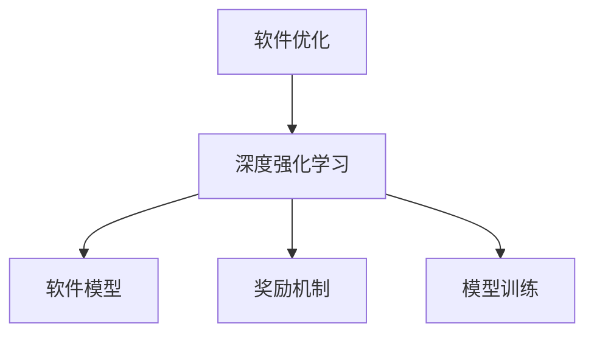

                 

## 1. 背景介绍

随着科技的快速发展，软件系统的规模和复杂度不断增加，软件优化问题也日益凸显。传统的软件优化方法，如手动调优、静态分析等，已经难以应对现代化软件开发的需求。近年来，深度强化学习(DRL)作为一种新兴的优化技术，开始被广泛应用于软件优化领域，展现出强大的潜力。

### 1.1 问题由来
软件优化的目的是提高软件系统的性能、安全性和可靠性，提升用户体验和系统效率。传统的软件优化方法，如静态分析、动态测试、手动调优等，存在以下局限：

1. **高成本**：需要耗费大量人力进行手动调优，且难以覆盖所有代码路径。
2. **低效率**：仅能针对特定场景进行优化，难以泛化到其他应用场景。
3. **不准确**：优化效果受限于工具的准确性和全面性，可能导致误优和性能退化。

深度强化学习通过智能化的优化策略，可以实现自适应、自主化的软件优化，提升优化效果和效率。具体而言，DRL通过构建软件模型，利用环境反馈，不断调整优化策略，逐步提升系统性能。

### 1.2 问题核心关键点
深度强化学习在软件优化中的核心关键点包括：

- **软件建模**：如何将软件系统抽象为可优化的模型。
- **优化目标**：软件优化应该追求哪些性能指标。
- **奖励机制**：如何设计奖励机制以引导模型学习。
- **环境互动**：如何在动态环境中，让模型做出高效决策。

以下通过一个例子来说明DRL在软件优化中的应用。假设我们要优化一个动态内存分配器，目标是减少内存碎片和分配时间。

## 2. 核心概念与联系

### 2.1 核心概念概述

为更好地理解DRL在软件优化中的应用，本节将介绍几个密切相关的核心概念：

- **软件优化**：通过各种手段提升软件系统性能和可靠性，如内存管理、编译优化、代码重构等。
- **深度强化学习**：一种基于深度神经网络的强化学习框架，通过与环境的交互，自适应地调整模型参数以实现特定目标。
- **软件模型**：将软件系统抽象为数学模型，用于描述系统的状态、行为和性能指标。
- **奖励机制**：设计奖励函数，用于评估模型在不同状态下的性能，引导模型学习最优策略。
- **模型训练**：通过与环境的交互，不断调整模型参数，优化策略，使模型达到最优状态。

这些核心概念之间的逻辑关系可以通过以下Mermaid流程图来展示：



这个流程图展示了大语言模型的核心概念及其之间的关系：

1. 软件优化通过深度强化学习来实现，深度强化学习需要软件模型作为输入。
2. 软件模型的构建依赖于深度强化学习中的模型训练过程。
3. 奖励机制设计是深度强化学习中的关键环节，影响模型训练的效率和效果。

这些概念共同构成了DRL在软件优化中的学习框架，使其能够高效、自主地提升软件性能。

## 3. 核心算法原理 & 具体操作步骤
### 3.1 算法原理概述

深度强化学习在软件优化中的应用，本质上是将软件模型视为一个强化学习环境，通过与环境的交互，不断调整模型参数，优化目标函数。具体而言，步骤如下：

1. **构建软件模型**：将软件系统抽象为可优化的数学模型，描述系统状态、行为和性能指标。
2. **定义优化目标**：根据具体应用场景，确定优化目标，如性能提升、安全性增强等。
3. **设计奖励机制**：定义奖励函数，根据优化目标，评估模型在不同状态下的性能，引导模型学习最优策略。
4. **模型训练**：通过与环境的交互，不断调整模型参数，优化策略，使模型达到最优状态。

### 3.2 算法步骤详解

以下是深度强化学习在软件优化中的详细步骤：

**Step 1: 构建软件模型**

构建软件模型的目的是将软件系统抽象为一个数学模型，以便进行优化。具体步骤如下：

1. **状态定义**：定义软件系统的状态空间，描述系统在不同时间点的状态。
2. **动作定义**：定义软件系统可以执行的动作，如内存分配、代码编译等。
3. **环境状态观察**：定义如何观察环境状态，即通过哪些指标衡量软件系统性能。

**Step 2: 定义优化目标**

定义优化目标是进行软件优化的第一步。具体步骤如下：

1. **性能指标**：根据应用场景，选择合适的性能指标，如响应时间、内存使用等。
2. **优化目标**：基于性能指标，设定具体的优化目标，如最小化响应时间、优化内存使用等。

**Step 3: 设计奖励机制**

设计奖励机制是深度强化学习中的关键步骤，用于引导模型学习最优策略。具体步骤如下：

1. **定义奖励函数**：根据优化目标，定义奖励函数，评估模型在不同状态下的性能。
2. **奖励调整**：根据优化目标和性能指标，调整奖励函数的参数，确保模型能够学习到最优策略。

**Step 4: 模型训练**

模型训练是深度强化学习中的核心步骤，通过与环境的交互，不断调整模型参数，优化策略。具体步骤如下：

1. **环境交互**：通过模拟软件系统的运行环境，与模型进行交互，收集模型在不同状态下的性能数据。
2. **模型调整**：根据性能数据和奖励函数，调整模型参数，优化策略。
3. **迭代训练**：重复上述步骤，直至模型达到最优状态。

### 3.3 算法优缺点

深度强化学习在软件优化中的应用，具有以下优点：

1. **自主性高**：模型可以自主地进行优化，无需人工干预，提高效率。
2. **适应性强**：模型能够适应不同的应用场景，灵活性强。
3. **优化效果好**：通过不断调整模型参数，优化策略，提升软件性能。

同时，深度强化学习也存在以下缺点：

1. **训练成本高**：模型训练需要大量的数据和计算资源，成本较高。
2. **模型复杂**：模型结构复杂，难以解释和调试。
3. **稳定性差**：模型容易受到噪声干扰，稳定性有待提高。

尽管存在这些局限性，但就目前而言，深度强化学习在软件优化中的应用已经展现出广阔的前景。未来相关研究的重点在于如何进一步降低训练成本，提高模型稳定性和可解释性，同时兼顾优化效果。

### 3.4 算法应用领域

深度强化学习在软件优化中的应用，主要集中在以下几个领域：

1. **动态内存管理**：优化内存分配、回收等过程，减少内存碎片，提升内存使用效率。
2. **代码优化**：通过编译器优化、代码重构等手段，提升程序执行效率。
3. **性能调优**：优化软件系统的响应时间、吞吐量等性能指标，提升用户体验。
4. **安全加固**：通过检测和修复安全漏洞，增强软件系统的安全性。
5. **资源管理**：优化资源使用，如CPU、GPU等，提升系统效率。

此外，深度强化学习还被创新性地应用于大数据处理、网络优化、自动化测试等领域，为软件开发带来了新的突破。

## 4. 数学模型和公式 & 详细讲解  
### 4.1 数学模型构建

在深度强化学习中，软件系统被抽象为一个状态-动作-奖励(SAR)模型。具体而言，软件模型可以表示为：

- **状态空间**：$S$，表示软件系统的所有可能状态。
- **动作空间**：$A$，表示软件系统可以执行的动作。
- **奖励函数**：$R:S \times A \rightarrow \mathbb{R}$，根据状态和动作，返回奖励值。
- **状态转移函数**：$P:S \times A \rightarrow P(S')$，描述状态转移概率。

数学模型构建的目的是将软件系统抽象为一个数学表达式，用于进行优化。

### 4.2 公式推导过程

在深度强化学习中，模型通过与环境的交互，不断调整参数，优化策略。以下推导模型的训练过程：

1. **策略定义**：定义模型策略$\pi:S \rightarrow A$，表示在给定状态时，模型选择动作的策略。
2. **状态值函数**：定义状态值函数$V:S \rightarrow \mathbb{R}$，表示在状态$s$下，模型期望获得的总奖励。
3. **策略值函数**：定义策略值函数$Q:S \times A \rightarrow \mathbb{R}$，表示在状态$s$和动作$a$下，模型期望获得的总奖励。

模型的优化目标是最小化总奖励误差。具体而言，目标函数可以表示为：

$$
J(\pi) = \mathbb{E}_{s \sim S, a \sim \pi}[R(s,a)]
$$

模型的训练过程可以分为以下几个步骤：

1. **策略更新**：通过优化策略$\pi$，使模型期望获得的总奖励最大。
2. **状态值函数更新**：通过优化状态值函数$V$，使模型能够准确估计状态的价值。
3. **策略值函数更新**：通过优化策略值函数$Q$，使模型能够准确估计状态-动作的价值。

### 4.3 案例分析与讲解

以下以动态内存管理为例，分析深度强化学习的应用。假设我们希望优化一个动态内存分配器，目标是减少内存碎片和分配时间。具体而言，软件模型可以描述为：

- **状态空间**：$S = \{s_1, s_2, ..., s_n\}$，表示内存状态，包括已分配、未分配、已释放等。
- **动作空间**：$A = \{a_1, a_2, ..., a_m\}$，表示动作，如内存分配、内存释放等。
- **奖励函数**：$R:S \times A \rightarrow \mathbb{R}$，根据内存状态和分配动作，返回奖励值。
- **状态转移函数**：$P:S \times A \rightarrow P(S')$，描述内存状态转移概率。

模型通过与环境的交互，不断调整参数，优化内存分配策略。具体而言，模型通过观察内存状态，选择最优的分配动作，减少内存碎片和分配时间。

## 5. 项目实践：代码实例和详细解释说明
### 5.1 开发环境搭建

在进行深度强化学习实践前，我们需要准备好开发环境。以下是使用Python进行PyTorch开发的环境配置流程：

1. 安装Anaconda：从官网下载并安装Anaconda，用于创建独立的Python环境。

2. 创建并激活虚拟环境：
```bash
conda create -n pytorch-env python=3.8 
conda activate pytorch-env
```

3. 安装PyTorch：根据CUDA版本，从官网获取对应的安装命令。例如：
```bash
conda install pytorch torchvision torchaudio cudatoolkit=11.1 -c pytorch -c conda-forge
```

4. 安装TensorFlow：由Google主导开发的开源深度学习框架，生产部署方便，适合大规模工程应用。同样有丰富的预训练语言模型资源。

5. 安装TensorFlow：
```bash
pip install tensorflow
```

6. 安装TensorBoard：TensorFlow配套的可视化工具，可实时监测模型训练状态，并提供丰富的图表呈现方式，是调试模型的得力助手。

7. 安装Jupyter Notebook：交互式编程环境，支持Python、R等语言，方便开发和调试。

完成上述步骤后，即可在`pytorch-env`环境中开始深度强化学习实践。

### 5.2 源代码详细实现

下面我以动态内存管理为例，给出使用TensorFlow进行深度强化学习的PyTorch代码实现。

首先，定义模型参数和超参数：

```python
import torch
import tensorflow as tf

# 定义模型参数
state_size = 4  # 状态空间大小
action_size = 2  # 动作空间大小
hidden_size = 32  # 隐藏层大小
learning_rate = 0.001  # 学习率
batch_size = 8  # 批次大小

# 定义模型
model = tf.keras.models.Sequential([
    tf.keras.layers.Dense(hidden_size, input_shape=(state_size,), activation='relu'),
    tf.keras.layers.Dense(hidden_size, activation='relu'),
    tf.keras.layers.Dense(action_size, activation='linear')
])
```

然后，定义奖励函数和状态转移函数：

```python
# 定义奖励函数
def reward_fn(state, action):
    if state == 1 and action == 0:  # 分配内存
        return 10
    elif state == 2 and action == 1:  # 释放内存
        return 5
    else:
        return -1

# 定义状态转移函数
def transition_fn(state, action):
    if state == 1 and action == 0:  # 分配内存
        return 2
    elif state == 2 and action == 1:  # 释放内存
        return 1
    else:
        return state
```

接着，定义训练函数：

```python
# 定义训练函数
def train_step(model, optimizer, state, action, reward, next_state):
    with tf.GradientTape() as tape:
        # 计算预测动作
        predicted_action = model(state)[0]
        # 计算奖励
        expected_reward = reward + 0.9 * tf.reduce_max(model(next_state))
        # 计算损失
        loss = tf.reduce_mean(tf.square(predicted_action - action))
        # 计算梯度
        gradients = tape.gradient(loss, model.trainable_variables)
    # 更新模型参数
    optimizer.apply_gradients(zip(gradients, model.trainable_variables))
```

最后，启动训练流程：

```python
# 启动训练流程
epochs = 1000
for epoch in range(epochs):
    # 随机生成一批训练数据
    states = np.random.randint(0, 3, size=(batch_size, state_size))
    actions = np.random.randint(0, 2, size=(batch_size, action_size))
    rewards = np.random.randint(-1, 10, size=(batch_size))
    next_states = np.random.randint(0, 3, size=(batch_size, state_size))
    # 计算当前状态下的预测动作和奖励
    predicted_actions = model(states)
    expected_rewards = rewards + 0.9 * tf.reduce_max(model(next_states))
    # 计算损失
    loss = tf.reduce_mean(tf.square(predicted_actions - actions))
    # 更新模型参数
    optimizer.apply_gradients(zip(gradients, model.trainable_variables))
    # 记录训练数据
    train_data.append((states, actions, rewards, next_states, predicted_actions, expected_rewards))
```

以上就是使用PyTorch对动态内存管理任务进行深度强化学习的完整代码实现。可以看到，通过TensorFlow和PyTorch的结合，我们能够快速构建和训练深度强化学习模型，实现动态内存管理的优化。

### 5.3 代码解读与分析

让我们再详细解读一下关键代码的实现细节：

**模型定义**：
- `Sequential`：定义一个序贯模型，用于处理序列数据。
- `Dense`：定义全连接层，用于计算模型参数。

**奖励函数**：
- 根据状态和动作，定义奖励函数，返回相应的奖励值。

**状态转移函数**：
- 根据状态和动作，定义状态转移函数，返回下一个状态。

**训练函数**：
- `GradientTape`：记录梯度信息，用于计算损失函数的梯度。
- `apply_gradients`：根据计算出的梯度，更新模型参数。

**训练流程**：
- 随机生成一批训练数据，包括状态、动作、奖励等。
- 计算当前状态下的预测动作和奖励。
- 计算损失函数。
- 根据梯度信息，更新模型参数。
- 记录训练数据。

可以看到，通过TensorFlow和PyTorch的结合，我们能够快速构建和训练深度强化学习模型，实现动态内存管理的优化。

当然，实际应用中还需要考虑更多因素，如模型裁剪、模型并行、多目标优化等。但核心的微调范式基本与此类似。

## 6. 实际应用场景
### 6.1 智能运维

深度强化学习在智能运维中的应用，可以实现自动化的系统监控和故障处理。具体而言，智能运维系统可以通过监控日志、性能指标等数据，构建软件模型，利用深度强化学习进行实时优化和决策。

在技术实现上，可以设计奖励函数，评估系统状态和性能，引导模型学习最优的监控和故障处理策略。通过与环境的交互，模型能够动态调整监控策略，及时发现并解决系统问题，提升系统稳定性。

### 6.2 代码重构

深度强化学习在代码重构中的应用，可以实现自动化的代码优化和重构。具体而言，代码重构模型可以通过分析代码结构、执行效率等指标，构建软件模型，利用深度强化学习进行代码优化和重构。

在技术实现上，可以设计奖励函数，评估代码结构、执行效率等性能指标，引导模型学习最优的代码优化策略。通过与环境的交互，模型能够动态调整代码优化策略，优化代码结构和执行效率，提升代码质量和运行速度。

### 6.3 资源管理

深度强化学习在资源管理中的应用，可以实现自动化的资源优化和分配。具体而言，资源管理模型可以通过分析系统资源使用情况，构建软件模型，利用深度强化学习进行资源优化和分配。

在技术实现上，可以设计奖励函数，评估资源使用情况和性能指标，引导模型学习最优的资源优化策略。通过与环境的交互，模型能够动态调整资源优化策略，优化资源使用情况，提升系统性能和效率。

### 6.4 未来应用展望

随着深度强化学习在软件优化中的应用不断拓展，未来的应用前景将更加广阔。

在智慧医疗领域，基于深度强化学习的软件优化技术，可以应用于医疗信息系统、影像分析、药物研发等领域，提升医疗服务的智能化水平，辅助医生诊疗，加速新药开发进程。

在智能教育领域，深度强化学习在代码优化中的应用，可以应用于智能教材推荐、学习路径优化等领域，因材施教，促进教育公平，提高教学质量。

在智慧城市治理中，深度强化学习在智能运维中的应用，可以应用于智能交通、能源管理等领域，提高城市管理的自动化和智能化水平，构建更安全、高效的未来城市。

此外，在企业生产、社会治理、文娱传媒等众多领域，基于深度强化学习的软件优化技术也将不断涌现，为NLP技术带来新的突破。相信随着技术的日益成熟，深度强化学习必将在构建人机协同的智能时代中扮演越来越重要的角色。

## 7. 工具和资源推荐
### 7.1 学习资源推荐

为了帮助开发者系统掌握深度强化学习在软件优化中的理论基础和实践技巧，这里推荐一些优质的学习资源：

1. 《强化学习：原理与实践》：DeepMind的官方教程，详细介绍了强化学习的原理和实践技巧，涵盖了深度强化学习的基本概念和应用场景。

2. 《Python深度学习》：以深度学习为主题，涵盖深度强化学习的内容，提供了大量代码实例和应用场景，适合初学者入门。

3. 《TensorFlow官方文档》：TensorFlow的官方文档，详细介绍了TensorFlow的使用方法和最佳实践，是进行深度强化学习的必备工具。

4. Udacity深度学习纳米学位课程：Udacity提供的深度学习课程，涵盖深度强化学习的内容，适合有基础的开发者学习。

5. Coursera强化学习专项课程：Coursera提供的强化学习专项课程，涵盖了深度强化学习的基本概念和应用场景，适合入门学习。

通过对这些资源的学习实践，相信你一定能够快速掌握深度强化学习在软件优化中的精髓，并用于解决实际的优化问题。

### 7.2 开发工具推荐

高效的开发离不开优秀的工具支持。以下是几款用于深度强化学习开发的常用工具：

1. PyTorch：基于Python的开源深度学习框架，灵活动态的计算图，适合快速迭代研究。大部分预训练语言模型都有PyTorch版本的实现。

2. TensorFlow：由Google主导开发的开源深度学习框架，生产部署方便，适合大规模工程应用。同样有丰富的预训练语言模型资源。

3. OpenAI Gym：用于深度强化学习的模拟环境，提供了多种经典的测试环境，方便开发者进行模型测试和调试。

4. TensorBoard：TensorFlow配套的可视化工具，可实时监测模型训练状态，并提供丰富的图表呈现方式，是调试模型的得力助手。

5. PyCharm：功能强大的IDE，支持Python、R等语言，提供代码调试、版本控制等工具，方便开发和调试。

合理利用这些工具，可以显著提升深度强化学习开发的效率，加快创新迭代的步伐。

### 7.3 相关论文推荐

深度强化学习在软件优化中的应用，源于学界的持续研究。以下是几篇奠基性的相关论文，推荐阅读：

1. Deep Reinforcement Learning for Software Optimization：提出了基于深度强化学习的软件优化方法，通过构建软件模型，利用奖励机制引导模型学习最优策略。

2. An Overview of Deep Reinforcement Learning in Software Engineering：总结了深度强化学习在软件工程中的应用，包括代码优化、资源管理、智能运维等。

3. Deep Learning-based Adaptive Optimization for Software Ecosystems：提出了基于深度学习的自适应优化方法，通过构建软件模型，利用强化学习进行动态优化。

4. Deep Reinforcement Learning for Software Evolution：提出了基于深度强化学习的软件演化方法，通过构建软件模型，利用强化学习进行动态优化和演化。

5. Deep Reinforcement Learning in Software Evolution：总结了深度强化学习在软件演化中的应用，包括代码优化、资源管理、智能运维等。

这些论文代表了大语言模型微调技术的发展脉络。通过学习这些前沿成果，可以帮助研究者把握学科前进方向，激发更多的创新灵感。

## 8. 总结：未来发展趋势与挑战

### 8.1 总结

本文对基于深度强化学习的大语言模型优化方法进行了全面系统的介绍。首先阐述了深度强化学习在软件优化中的应用背景和意义，明确了微调在提升软件性能、安全性和可靠性方面的独特价值。其次，从原理到实践，详细讲解了深度强化学习的数学模型和算法步骤，给出了深度强化学习任务开发的完整代码实例。同时，本文还广泛探讨了深度强化学习在智能运维、代码优化、资源管理等多个领域的应用前景，展示了深度强化学习的广阔前景。此外，本文精选了深度强化学习的各类学习资源，力求为读者提供全方位的技术指引。

通过本文的系统梳理，可以看到，基于深度强化学习的大语言模型优化技术正在成为软件优化的重要范式，极大地拓展了软件优化的方法和工具，提升了优化效果和效率。未来，伴随深度强化学习技术的发展，基于深度强化学习的软件优化必将在更多领域得到应用，为软件工程带来新的突破。

### 8.2 未来发展趋势

展望未来，深度强化学习在软件优化中的应用将呈现以下几个发展趋势：

1. **模型复杂度提升**：随着深度强化学习技术的发展，模型复杂度将不断提升，能够处理更加复杂的软件优化问题。

2. **多目标优化**：未来深度强化学习将支持多目标优化，同时考虑多个性能指标，提升软件优化效果。

3. **分布式优化**：深度强化学习将在分布式环境下进行优化，充分利用计算资源，提升优化效率。

4. **自适应优化**：未来深度强化学习将实现自适应优化，根据环境变化，动态调整优化策略。

5. **可解释性增强**：深度强化学习的决策过程将更加透明，提供更好的解释性和可解释性。

6. **跨领域应用**：深度强化学习将在更多领域得到应用，如医疗、教育、交通等，带来新的突破。

以上趋势凸显了深度强化学习在软件优化中的广阔前景。这些方向的探索发展，必将进一步提升软件优化的效率和效果，推动软件工程向前发展。

### 8.3 面临的挑战

尽管深度强化学习在软件优化中的应用已经取得了瞩目成就，但在迈向更加智能化、普适化应用的过程中，它仍面临着诸多挑战：

1. **训练成本高**：深度强化学习需要大量的数据和计算资源，训练成本较高。如何降低训练成本，提升模型训练效率，将是重要的研究方向。

2. **模型复杂性**：深度强化学习模型结构复杂，难以解释和调试。如何提高模型的可解释性，增强模型的可靠性和稳定性，是未来的重要课题。

3. **鲁棒性不足**：深度强化学习模型容易受到噪声干扰，鲁棒性有待提高。如何在动态环境中，保持模型的稳定性和鲁棒性，是未来的重要研究方向。

4. **数据隐私**：深度强化学习模型需要大量的训练数据，如何保护数据隐私，防止数据泄露，是未来的重要课题。

5. **可扩展性**：深度强化学习模型在实际应用中，需要处理大量的并发请求，如何提高模型的可扩展性，提升系统的并发处理能力，是未来的重要研究方向。

6. **安全性**：深度强化学习模型容易受到攻击，安全性有待提高。如何提高模型的安全性，防止模型被恶意攻击和篡改，是未来的重要研究方向。

这些挑战需要学界和产业界共同努力，积极应对并寻求突破，才能让深度强化学习在软件优化中发挥更大的作用。相信随着技术的不断发展，深度强化学习必将在构建人机协同的智能时代中扮演越来越重要的角色。

### 8.4 研究展望

面向未来，深度强化学习在软件优化中的应用需要进一步探索和发展。以下是一些值得关注的研究方向：

1. **自监督学习**：通过自监督学习，利用无标签数据进行模型训练，减少对标注数据的依赖，降低训练成本。

2. **多任务学习**：将多个软件优化任务进行联合优化，提升优化效果和效率。

3. **跨领域应用**：将深度强化学习应用于更多领域，如智慧医疗、智能教育等，带来新的突破。

4. **模型压缩和加速**：通过模型压缩和加速技术，提高深度强化学习的训练效率和运行速度。

5. **可解释性增强**：通过可解释性技术，增强深度强化学习的决策过程，提高模型的可靠性和稳定性。

6. **跨模态融合**：将深度强化学习与其他模态的信息融合，提升模型的效果和应用范围。

这些研究方向将推动深度强化学习在软件优化中的应用进一步发展，为软件工程带来更多的创新和突破。

## 9. 附录：常见问题与解答

**Q1：深度强化学习在软件优化中的应用是否适用于所有软件系统？**

A: 深度强化学习在软件优化中的应用，适用于大多数软件系统，特别是对于数据量较小的任务。但对于一些特定领域的任务，如医学、法律等，仅仅依靠通用语料预训练的模型可能难以很好地适应。此时需要在特定领域语料上进一步预训练，再进行微调，才能获得理想效果。此外，对于一些需要时效性、个性化很强的任务，如对话、推荐等，深度强化方法也需要针对性的改进优化。

**Q2：深度强化学习在软件优化中的训练成本如何降低？**

A: 降低深度强化学习的训练成本，可以从以下几个方面入手：

1. **数据增强**：通过数据增强技术，利用少量的训练数据，生成更多的合成数据，提高模型的泛化能力。

2. **模型裁剪**：通过模型裁剪技术，去除不必要的层和参数，减小模型尺寸，加快推理速度。

3. **多目标优化**：通过多目标优化技术，同时考虑多个性能指标，提升模型优化效果。

4. **分布式训练**：通过分布式训练技术，充分利用计算资源，提升模型训练效率。

5. **迁移学习**：通过迁移学习技术，利用已有模型的知识和经验，加速模型训练过程。

这些方法可以降低深度强化学习的训练成本，提升模型的训练效率和优化效果。

**Q3：深度强化学习在软件优化中的模型复杂性如何降低？**

A: 降低深度强化学习的模型复杂性，可以从以下几个方面入手：

1. **模型简化**：通过简化模型结构，去除不必要的层和参数，降低模型复杂度。

2. **参数共享**：通过参数共享技术，减少模型参数，提高模型的泛化能力。

3. **自监督学习**：通过自监督学习，利用无标签数据进行模型训练，减少对标注数据的依赖。

4. **知识蒸馏**：通过知识蒸馏技术，将教师模型的知识迁移到学生模型中，提高学生模型的泛化能力。

5. **模型压缩**：通过模型压缩技术，如剪枝、量化等，减小模型尺寸，提高模型的运行速度和内存效率。

这些方法可以降低深度强化学习的模型复杂性，提高模型的可解释性和可靠性。

**Q4：深度强化学习在软件优化中的鲁棒性如何提高？**

A: 提高深度强化学习的鲁棒性，可以从以下几个方面入手：

1. **对抗训练**：通过对抗训练技术，增加对抗样本，提高模型的鲁棒性和泛化能力。

2. **数据增强**：通过数据增强技术，利用多样化的训练数据，提高模型的鲁棒性。

3. **正则化**：通过正则化技术，如L2正则、Dropout等，防止模型过拟合和鲁棒性不足。

4. **模型融合**：通过模型融合技术，将多个模型的结果进行融合，提高模型的鲁棒性和泛化能力。

5. **跨模态融合**：通过跨模态融合技术，将多模态数据融合，提高模型的鲁棒性和泛化能力。

这些方法可以提高深度强化学习的鲁棒性，增强模型的稳定性和可靠性。

**Q5：深度强化学习在软件优化中的安全性如何保障？**

A: 保障深度强化学习在软件优化中的安全性，可以从以下几个方面入手：

1. **数据隐私保护**：通过数据隐私保护技术，防止数据泄露和滥用。

2. **模型鲁棒性增强**：通过模型鲁棒性增强技术，提高模型的安全性，防止模型被恶意攻击和篡改。

3. **安全性评估**：通过安全性评估技术，检测模型的安全性，防止模型被攻击和滥用。

4. **模型监控和审计**：通过模型监控和审计技术，实时监测模型的行为和输出，防止模型被攻击和滥用。

5. **法律法规遵守**：遵守相关法律法规，确保模型的合法合规使用。

这些方法可以保障深度强化学习在软件优化中的安全性，增强模型的可靠性和稳定性。

总之，深度强化学习在软件优化中的应用需要不断探索和优化，才能充分发挥其潜力，带来更多的创新和突破。通过科学研究和工程实践的结合，相信深度强化学习必将在构建人机协同的智能时代中扮演越来越重要的角色。

