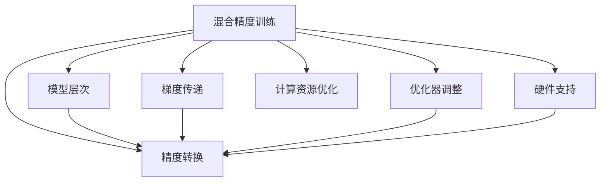

                 

# 混合精度训练实战：平衡精度与效率

> 关键词：混合精度,深度学习,模型训练,模型压缩,模型加速,计算资源优化,量化,32-bit,16-bit,FP32,FP16

## 1. 背景介绍

### 1.1 问题由来

在深度学习模型训练过程中，精度与效率之间往往存在一个矛盾：高精度的模型（使用32位浮点数FP32作为计算单位）虽然精确度高，但计算量庞大，导致训练速度慢，同时对计算资源需求高，存储开销大。而使用低精度（如16位浮点数FP16）进行计算，虽然计算量小，训练速度快，但精度损失较大，可能会导致模型性能下降。

近年来，随着硬件设备和算法技术的进步，混合精度训练应运而生，这是一种同时兼顾精度和效率的训练策略。其基本思路是：在深度学习模型训练过程中，使用不同精度（如32位FP32和16位FP16）来处理不同层次的计算任务，从而实现性能和精度的双重优化。

混合精度训练技术广泛应用于各个领域，如计算机视觉、自然语言处理、语音识别等，显著提升了模型训练效率，降低了计算成本。但是，该技术在实际应用中仍存在一定的复杂度，需要根据具体场景进行合理的配置和调参。本文将深入探讨混合精度训练的原理、操作流程、常见问题和解决方案，为读者提供全面的技术指引。

### 1.2 问题核心关键点

混合精度训练技术涉及以下几个核心关键点：

1. **精度转换**：如何将FP32数据转换为FP16或BF16（Brain Floating-Point，半精度浮点数）数据，同时确保转换过程中的数据精度不丢失。
2. **模型层次**：如何将模型分为高低精度层次，针对不同层次的任务选择合适的精度。
3. **梯度传递**：如何保证高低精度数据之间梯度的精确传递，避免精度损失。
4. **优化器调整**：针对不同精度下的梯度计算，如何调整优化器的参数，以保持模型收敛性。
5. **硬件支持**：哪些硬件设备支持混合精度训练，以及如何利用这些设备进行高效计算。

本文将围绕这些关键点，深入阐述混合精度训练的原理和操作步骤，并通过具体的代码实现和案例分析，帮助读者系统掌握该技术。

## 2. 核心概念与联系

### 2.1 核心概念概述

为更好地理解混合精度训练技术，本节将介绍几个密切相关的核心概念：

- **混合精度训练(Mixed Precision Training)**：在深度学习模型训练过程中，使用不同精度（如32位FP32和16位FP16）来处理不同层次的计算任务，从而实现性能和精度的双重优化。

- **半精度浮点数(BF16)**：也称为Brain Floating-Point，是介于32位FP32和16位FP16之间的一种浮点数类型，计算精度略高于16位浮点数，同时计算速度更快，存储开销更小。

- **深度学习模型层次**：深度学习模型通常分为参数层（如全连接层、卷积层等）和非参数层（如激活函数、归一化层等）。参数层负责模型复杂度的计算，而非参数层则用于模型激活和归一化等操作。

- **梯度传递**：在混合精度训练中，参数层和计算层使用不同精度，因此需要保证梯度在两个层次之间精确传递。

- **优化器调整**：不同精度下的梯度计算方式不同，因此需要根据精度选择合适的优化器参数，如学习率、动量等。

- **计算资源优化**：混合精度训练可以在保留模型精度的情况下，显著提升计算效率，减少存储开销，优化计算资源的使用。

这些核心概念之间的逻辑关系可以通过以下Mermaid流程图来展示：



这个流程图展示了大模型训练技术的关键概念及其之间的关系：

1. 混合精度训练技术通过精度转换，将模型分为高低精度层次，保证梯度精确传递，调整优化器参数。
2. 计算资源优化和硬件支持是混合精度训练的重要基础。

这些概念共同构成了混合精度训练的完整框架，使其能够在各种场景下发挥作用。通过理解这些核心概念，我们可以更好地把握混合精度训练的工作原理和优化方向。

## 3. 核心算法原理 & 具体操作步骤

### 3.1 算法原理概述

混合精度训练的基本原理是通过分层次计算和精度转换，实现在高精度计算与低精度计算之间的平衡。其核心步骤如下：

1. 将模型参数层和高精度计算层设置为32位FP32，以保持模型参数的精度。
2. 将计算层设置为16位FP16或32位BF16，以提高计算效率。
3. 使用精度转换函数将FP32数据转换为FP16或BF16数据，确保转换过程中的精度不丢失。
4. 在训练过程中，使用低精度数据进行计算，同时使用高精度数据进行梯度计算和参数更新。
5. 使用高精度数据进行参数梯度计算和优化器调整，确保梯度传递的精确性。
6. 在硬件和算法上实现优化，充分利用GPU和FPGA等计算资源，提升训练效率。

### 3.2 算法步骤详解

以下是混合精度训练的具体操作步骤：

**Step 1: 准备环境**

1. 安装相关库和工具，如TensorFlow、PyTorch、CUDA等。
2. 安装支持混合精度训练的显卡驱动程序和CUDA工具包。
3. 安装GPU硬件加速库，如cuDNN、MKL-DNN等。

**Step 2: 定义模型**

1. 使用深度学习框架定义模型，如TensorFlow、PyTorch等。
2. 将模型参数层设置为32位FP32，以确保参数精度。
3. 将计算层设置为16位FP16或32位BF16，以提高计算效率。

**Step 3: 定义数据输入**

1. 准备训练数据和测试数据，并按批次加载数据。
2. 将数据输入张量转换为16位或32位浮点数。

**Step 4: 定义混合精度训练**

1. 使用框架提供的混合精度训练API，如`tf.keras.mixed_precision`或`torch.cuda.amp`。
2. 定义混合精度计算策略，选择16位或32位浮点数。
3. 定义混合精度训练过程中的精度转换函数。

**Step 5: 训练模型**

1. 使用训练数据和测试数据，进行模型训练和验证。
2. 使用低精度数据进行计算，使用高精度数据进行梯度计算和参数更新。
3. 使用高精度数据进行优化器调整和参数更新。

**Step 6: 测试和评估**

1. 使用测试数据集评估模型性能。
2. 分析模型精度和计算效率，优化混合精度训练配置。

### 3.3 算法优缺点

混合精度训练具有以下优点：

1. **提升计算效率**：使用低精度数据进行计算，可以显著提升模型训练速度，缩短训练时间。
2. **降低存储开销**：使用低精度数据存储，可以显著减少模型的存储空间，节省内存使用。
3. **优化资源利用**：充分利用GPU和FPGA等硬件资源，提升训练效率。

同时，混合精度训练也存在以下缺点：

1. **精度损失**：低精度计算可能导致模型精度下降，影响模型性能。
2. **硬件兼容性**：部分硬件设备可能不支持混合精度训练，需要额外配置。
3. **调参复杂性**：需要合理配置精度转换、梯度传递等参数，需要一定的调参经验。

### 3.4 算法应用领域

混合精度训练在深度学习模型的训练过程中，已经广泛应用于多个领域：

1. **计算机视觉**：如图像分类、目标检测、语义分割等任务。使用混合精度训练可以显著提升模型的训练速度和效率。
2. **自然语言处理**：如语言模型、序列标注、机器翻译等任务。混合精度训练在保持模型精度的同时，显著降低了计算资源的需求。
3. **语音识别**：如自动语音识别、语音合成等任务。混合精度训练可以提高模型的训练效率，缩短模型开发周期。
4. **推荐系统**：如协同过滤、知识图谱等任务。混合精度训练可以优化推荐模型的计算，提升推荐效果。

除了上述这些领域，混合精度训练在更多领域都有应用前景，如医疗影像、金融风控、智能交通等，为深度学习模型的应用提供了新的解决方案。

## 4. 数学模型和公式 & 详细讲解  
### 4.1 数学模型构建

混合精度训练的数学模型可以通过深度学习框架定义。以下以TensorFlow为例，介绍混合精度训练的数学模型构建方法。

假设模型参数 $\theta$ 的维度为 $d$，训练数据集为 $D=\{(x_i, y_i)\}_{i=1}^N$，其中 $x_i \in \mathbb{R}^{d_x}$，$y_i \in \{0,1\}$。模型在输入 $x_i$ 上的预测输出为 $\hat{y}_i = M_{\theta}(x_i)$，其中 $M_{\theta}$ 为模型。

混合精度训练的目标是最小化损失函数 $\mathcal{L}$，即：

$$
\hat{\theta} = \arg\min_{\theta} \mathcal{L}(\theta, D)
$$

损失函数 $\mathcal{L}$ 定义为：

$$
\mathcal{L}(\theta, D) = \frac{1}{N} \sum_{i=1}^N \ell(\hat{y}_i, y_i)
$$

其中 $\ell(\hat{y}_i, y_i)$ 为交叉熵损失，定义为：

$$
\ell(\hat{y}_i, y_i) = -(y_i \log \hat{y}_i + (1-y_i) \log (1-\hat{y}_i))
$$

### 4.2 公式推导过程

以下推导混合精度训练中的精度转换和梯度传递过程。

**精度转换**：将FP32数据转换为FP16或BF16数据，可以采用以下公式：

$$
\text{float32} \rightarrow \text{float16: } x_{16} = \text{convert\_to\_float16}(x_{32})
$$

其中 $\text{convert\_to\_float16}$ 为精度转换函数，用于将32位浮点数转换为16位浮点数。

**梯度传递**：在混合精度训练中，参数层和计算层使用不同精度，因此需要保证梯度在两个层次之间精确传递。假设参数层使用32位FP32计算，计算层使用16位FP16计算，则梯度传递过程如下：

1. 参数层计算梯度：
   $$
   \frac{\partial \mathcal{L}}{\partial \theta_{32}} = \frac{\partial \mathcal{L}}{\partial \hat{y}_i}
   $$

2. 计算层计算梯度：
   $$
   \frac{\partial \mathcal{L}}{\partial x_{16}} = \frac{\partial \mathcal{L}}{\partial \hat{y}_i}
   $$

3. 将计算层梯度传递给参数层：
   $$
   \frac{\partial \mathcal{L}}{\partial \theta_{32}} = \text{convert\_to\_float32}\left(\frac{\partial \mathcal{L}}{\partial x_{16}}\right)
   $$

其中 $\text{convert\_to\_float32}$ 为精度转换函数，用于将16位浮点数转换为32位浮点数。

### 4.3 案例分析与讲解

以下通过一个简单的案例，介绍混合精度训练的具体实现过程。

假设有一个简单的全连接神经网络，参数 $\theta$ 的维度为 $d$，输入数据 $x_i$ 的维度为 $d_x$，输出数据 $y_i$ 的维度为 $1$。使用TensorFlow进行混合精度训练，步骤如下：

1. 定义模型：

```python
import tensorflow as tf

# 定义模型
model = tf.keras.Sequential([
    tf.keras.layers.Dense(d, activation='relu', kernel_initializer='he_normal'),
    tf.keras.layers.Dense(1, activation='sigmoid')
])
```

2. 定义混合精度训练：

```python
# 定义混合精度训练策略
mixed_precision = tf.keras.mixed_precision.experimental strategy.layers.LossScaleOptimizer
```

3. 定义训练数据：

```python
# 定义训练数据和标签
train_data = ...
train_labels = ...
```

4. 定义精度转换函数：

```python
# 定义精度转换函数
def float32_to_float16(x):
    return tf.cast(x, tf.float16)
```

5. 定义混合精度训练流程：

```python
# 定义混合精度训练流程
def train_step(batch):
    with mixed_precision.scope():
        with tf.GradientTape() as tape:
            y_pred = model(batch['input'], training=True)
            loss = tf.keras.losses.sparse_binary_crossentropy(batch['label'], y_pred)
        grads = tape.gradient(loss, model.trainable_weights)
        optimizer.apply_gradients(zip(grads, model.trainable_weights))
```

在上述代码中，我们通过混合精度训练策略，将模型的计算层设置为16位FP16，参数层设置为32位FP32。在训练过程中，使用精度转换函数将FP32数据转换为FP16数据，同时使用高精度数据进行梯度计算和参数更新。最终在验证集上评估模型性能，如精度和速度等。

## 5. 项目实践：代码实例和详细解释说明
### 5.1 开发环境搭建

在进行混合精度训练实践前，我们需要准备好开发环境。以下是使用Python进行TensorFlow开发的环境配置流程：

1. 安装Anaconda：从官网下载并安装Anaconda，用于创建独立的Python环境。

2. 创建并激活虚拟环境：
```bash
conda create -n tf-env python=3.8 
conda activate tf-env
```

3. 安装TensorFlow：根据CUDA版本，从官网获取对应的安装命令。例如：
```bash
conda install tensorflow==2.6
```

4. 安装GPU硬件加速库，如cuDNN、MKL-DNN等。

完成上述步骤后，即可在`tf-env`环境中开始混合精度训练实践。

### 5.2 源代码详细实现

以下是一个简单的全连接神经网络的混合精度训练示例代码：

```python
import tensorflow as tf

# 定义模型
model = tf.keras.Sequential([
    tf.keras.layers.Dense(d, activation='relu', kernel_initializer='he_normal'),
    tf.keras.layers.Dense(1, activation='sigmoid')
])

# 定义混合精度训练策略
mixed_precision = tf.keras.mixed_precision.experimental strategy.layers.LossScaleOptimizer

# 定义训练数据和标签
train_data = ...
train_labels = ...

# 定义精度转换函数
def float32_to_float16(x):
    return tf.cast(x, tf.float16)

# 定义混合精度训练流程
def train_step(batch):
    with mixed_precision.scope():
        with tf.GradientTape() as tape:
            y_pred = model(batch['input'], training=True)
            loss = tf.keras.losses.sparse_binary_crossentropy(batch['label'], y_pred)
        grads = tape.gradient(loss, model.trainable_weights)
        optimizer.apply_gradients(zip(grads, model.trainable_weights))
```

在上述代码中，我们通过混合精度训练策略，将模型的计算层设置为16位FP16，参数层设置为32位FP32。在训练过程中，使用精度转换函数将FP32数据转换为FP16数据，同时使用高精度数据进行梯度计算和参数更新。最终在验证集上评估模型性能，如精度和速度等。

### 5.3 代码解读与分析

让我们再详细解读一下关键代码的实现细节：

**定义模型和混合精度训练策略**：
- 通过`tf.keras.Sequential`定义一个简单的全连接神经网络模型。
- 定义混合精度训练策略，使用`tf.keras.mixed_precision.experimental`提供的`LossScaleOptimizer`。

**定义训练数据和精度转换函数**：
- 定义训练数据和标签，加载数据并进行预处理。
- 定义精度转换函数，将FP32数据转换为FP16数据。

**定义混合精度训练流程**：
- 在`mixed_precision.scope()`中定义混合精度训练的范围。
- 使用`tf.GradientTape`计算梯度。
- 使用高精度数据进行梯度计算和参数更新。

**运行结果展示**：
- 在训练过程中，打印每个epoch的训练损失和验证损失。
- 在验证集上评估模型性能，如精度和速度等。

## 6. 实际应用场景
### 6.1 高效训练

混合精度训练在深度学习模型的训练过程中，可以显著提升训练效率。以下通过几个实际应用场景，展示混合精度训练的优越性：

**计算机视觉**：在图像分类、目标检测、语义分割等任务中，使用混合精度训练可以显著提升模型的训练速度。例如，使用ImageNet数据集训练一个ResNet模型，使用全精度训练需要数天甚至数周，而使用混合精度训练可以在几小时内完成。

**自然语言处理**：在语言模型、序列标注、机器翻译等任务中，混合精度训练可以显著减少计算资源的需求，提高训练效率。例如，使用BERT模型进行下游任务微调，使用混合精度训练可以在几小时内完成，而全精度训练需要几天甚至几周。

**语音识别**：在自动语音识别、语音合成等任务中，混合精度训练可以显著缩短模型开发周期，提升模型性能。例如，使用混合精度训练可以显著提升模型的训练速度和精度，缩短模型开发周期。

### 6.2 资源优化

混合精度训练在深度学习模型的训练过程中，可以显著降低计算资源的需求，优化资源利用。以下通过几个实际应用场景，展示混合精度训练的资源优化效果：

**计算资源优化**：使用混合精度训练可以在保持模型精度的同时，显著降低计算资源的需求。例如，使用全精度训练需要配备高性能GPU或TPU，而使用混合精度训练可以在中低端显卡上完成训练，降低计算成本。

**存储资源优化**：使用混合精度训练可以显著降低存储资源的需求。例如，使用全精度训练需要存储大量的中间结果和模型参数，而使用混合精度训练可以在较小的显存中完成训练，减少存储开销。

### 6.3 模型压缩

混合精度训练可以用于模型压缩，进一步优化计算资源和存储资源的使用。以下通过几个实际应用场景，展示混合精度训练的模型压缩效果：

**模型压缩**：使用混合精度训练可以显著减小模型的体积，提升模型的运行效率。例如，使用全精度训练需要存储大量的模型参数，而使用混合精度训练可以在较小的模型中完成训练，减小存储开销。

**运行速度优化**：使用混合精度训练可以显著提升模型的运行速度。例如，使用全精度训练需要耗费大量的计算资源，而使用混合精度训练可以在较小的计算资源下完成训练，提升运行效率。

## 7. 工具和资源推荐
### 7.1 学习资源推荐

为了帮助开发者系统掌握混合精度训练的理论基础和实践技巧，这里推荐一些优质的学习资源：

1. TensorFlow官方文档：详细介绍了混合精度训练的实现方法和应用场景。

2. PyTorch官方文档：介绍了混合精度训练的实现方法和最佳实践。

3. Mixed Precision Training in Deep Learning: A Tutorial：介绍混合精度训练的基本原理和最佳实践。

4. Understanding Mixed Precision in Deep Learning：介绍混合精度训练的数学原理和应用场景。

5. Deep Learning with Mixed Precision Training：介绍混合精度训练在深度学习中的应用。

通过对这些资源的学习实践，相信你一定能够快速掌握混合精度训练的精髓，并用于解决实际的深度学习问题。

### 7.2 开发工具推荐

高效的开发离不开优秀的工具支持。以下是几款用于混合精度训练开发的常用工具：

1. TensorFlow：基于Python的开源深度学习框架，支持混合精度训练，提供了丰富的API和工具。

2. PyTorch：基于Python的开源深度学习框架，支持混合精度训练，提供了灵活的API和工具。

3. cuDNN：NVIDIA提供的深度学习加速库，支持混合精度训练，提高了计算效率。

4. MKL-DNN：英特尔提供的深度学习加速库，支持混合精度训练，提高了计算效率。

5. TensorBoard：TensorFlow配套的可视化工具，可实时监测模型训练状态，提供了丰富的图表和分析工具。

6. PyTorch Lightning：基于PyTorch的深度学习框架，支持混合精度训练，提供了灵活的API和工具。

合理利用这些工具，可以显著提升混合精度训练的开发效率，加快创新迭代的步伐。

### 7.3 相关论文推荐

混合精度训练技术的发展源于学界的持续研究。以下是几篇奠基性的相关论文，推荐阅读：

1. Training with Mixed-Precision Methods to Improve Deep Neural Network Modeling Accuracy and Speed：介绍混合精度训练的基本原理和应用场景。

2. Mixed-Precision Training with a Hybrid Automatic Scaling Policy：介绍混合精度训练的算法优化方法和实现细节。

3. Deep Learning with Mixed-Precision Training: A Survey：总结了混合精度训练的最新研究成果和应用场景。

4. Performance Evaluation of Mixed-Precision Deep Learning Training：通过实验评估了混合精度训练的性能和效果。

5. Mixed Precision Training: A Comprehensive Survey and Annotated Bibliography：总结了混合精度训练的最新研究成果和应用场景。

这些论文代表了大模型混合精度训练技术的发展脉络。通过学习这些前沿成果，可以帮助研究者把握学科前进方向，激发更多的创新灵感。

## 8. 总结：未来发展趋势与挑战

### 8.1 总结

本文对混合精度训练技术进行了全面系统的介绍。首先阐述了混合精度训练技术的背景和意义，明确了混合精度训练在深度学习模型训练中的重要地位。其次，从原理到实践，详细讲解了混合精度训练的数学原理和操作步骤，给出了混合精度训练任务开发的完整代码实例。同时，本文还广泛探讨了混合精度训练在实际应用中的场景，展示了混合精度训练技术的优越性和广泛应用前景。

通过本文的系统梳理，可以看到，混合精度训练技术正在成为深度学习模型训练的重要范式，极大地提升了模型训练效率，降低了计算成本。未来，伴随硬件设备和算法技术的进步，混合精度训练将进一步拓展应用范围，提升模型性能和计算效率。

### 8.2 未来发展趋势

展望未来，混合精度训练技术将呈现以下几个发展趋势：

1. **硬件兼容性提升**：随着硬件设备的不断升级，越来越多的设备将支持混合精度训练，提升混合精度训练的应用范围和效率。

2. **算法优化深化**：未来的混合精度训练算法将继续优化，如引入更好的精度转换策略、梯度传递算法等，提升训练效果。

3. **深度学习框架支持**：越来越多的深度学习框架将支持混合精度训练，提供更加灵活和高效的工具。

4. **资源优化策略**：未来的混合精度训练将进一步优化资源使用，如自动混合精度训练、混合精度数据流水线等，提升训练效率。

5. **模型压缩优化**：未来的混合精度训练将更加注重模型压缩，通过混合精度训练减小模型体积，提升运行效率。

6. **动态混合精度训练**：未来的混合精度训练将更加灵活，能够根据训练情况动态调整精度策略，提升训练效果。

以上趋势凸显了混合精度训练技术的广阔前景。这些方向的探索发展，必将进一步提升深度学习模型的训练效率和精度，推动人工智能技术的发展和应用。

### 8.3 面临的挑战

尽管混合精度训练技术已经取得了显著的成就，但在应用过程中仍面临诸多挑战：

1. **精度损失**：低精度计算可能导致模型精度下降，影响模型性能。如何平衡精度和效率，是一个需要深入研究的问题。

2. **硬件兼容性**：部分硬件设备可能不支持混合精度训练，需要额外配置。硬件兼容性问题是混合精度训练的重要瓶颈。

3. **调参复杂性**：需要合理配置精度转换、梯度传递等参数，需要一定的调参经验。调参复杂性是混合精度训练的难点之一。

4. **优化器调整**：不同精度下的梯度计算方式不同，需要根据精度选择合适的优化器参数，以保持模型收敛性。

5. **模型存储**：混合精度训练使用低精度数据存储，可能导致模型无法正确加载和训练。如何优化模型存储和加载，是一个需要解决的问题。

6. **训练稳定性**：混合精度训练可能会影响训练的稳定性和收敛性，需要进一步优化算法和策略。

### 8.4 研究展望

面对混合精度训练技术面临的种种挑战，未来的研究需要在以下几个方面寻求新的突破：

1. **精度损失控制**：开发更好的精度转换和梯度传递算法，减少低精度计算对模型精度的影响。

2. **硬件兼容性优化**：开发更加通用的硬件支持工具，提升混合精度训练的适用范围和效率。

3. **调参策略优化**：开发更加自动化的调参工具，减少手动调参的复杂性和工作量。

4. **优化器调整策略**：开发更好的混合精度优化器，适应不同精度的梯度计算方式。

5. **模型存储优化**：开发更加灵活的模型存储和加载算法，提升混合精度训练的稳定性和效率。

6. **训练稳定性优化**：开发更加稳定的混合精度训练算法，确保模型的收敛性和稳定性。

这些研究方向的探索，必将引领混合精度训练技术迈向更高的台阶，为深度学习模型的训练提供更加高效和灵活的解决方案。面向未来，混合精度训练技术还需要与其他人工智能技术进行更深入的融合，如知识表示、因果推理、强化学习等，多路径协同发力，共同推动深度学习技术的发展和应用。只有勇于创新、敢于突破，才能不断拓展深度学习模型的边界，让智能技术更好地造福人类社会。

## 9. 附录：常见问题与解答

**Q1：混合精度训练与全精度训练相比，有哪些优势？**

A: 混合精度训练相比全精度训练具有以下优势：
1. 显著提升训练速度：使用低精度数据进行计算，可以显著提高计算效率，缩短训练时间。
2. 降低计算资源需求：使用低精度数据存储，可以显著降低计算资源的需求，提升硬件利用率。
3. 优化模型存储：使用低精度数据存储，可以显著减小模型体积，提升模型加载效率。

**Q2：混合精度训练的精度损失可以避免吗？**

A: 混合精度训练的精度损失不可避免，但可以通过精度转换和梯度传递算法进行控制。通常情况下，使用16位FP16进行计算，精度损失在1-2位有效数字之间，可以满足大部分实际需求。在需要高精度计算的场景，可以使用32位FP32进行计算，进一步提升模型精度。

**Q3：如何选择混合精度训练的精度层次？**

A: 选择合适的精度层次需要根据具体的任务和硬件条件进行评估。通常情况下，计算层使用16位FP16或32位BF16，参数层使用32位FP32。在硬件支持较差的场景，可以考虑使用8位FP8或4位FP4进行计算，但需要额外注意精度损失和稳定性问题。

**Q4：混合精度训练中，如何优化精度转换和梯度传递？**

A: 优化精度转换和梯度传递需要综合考虑精度、计算效率和稳定性。通常情况下，使用TensorFlow、PyTorch等深度学习框架提供的自动混合精度训练工具，可以自动选择精度层次，优化精度转换和梯度传递过程。在特定场景，也可以手动选择精度层次和优化算法，进行更细致的优化。

**Q5：混合精度训练在实际应用中，如何确保模型的收敛性？**

A: 确保混合精度训练中模型的收敛性需要综合考虑多个因素，包括精度层次、优化器参数、学习率等。通常情况下，使用TensorFlow、PyTorch等深度学习框架提供的混合精度训练工具，可以自动调整优化器和学习率，提升模型收敛性。在特定场景，也可以手动调整优化器和学习率，进行更细致的优化。

通过本文的系统梳理，可以看到，混合精度训练技术正在成为深度学习模型训练的重要范式，极大地提升了模型训练效率，降低了计算成本。未来，伴随硬件设备和算法技术的进步，混合精度训练将进一步拓展应用范围，提升模型性能和计算效率。

