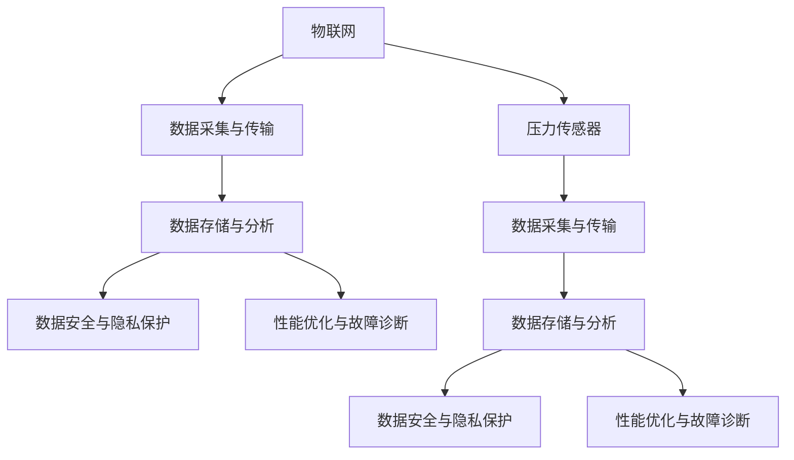

                 

# 物联网(IoT)技术和各种传感器设备的集成：压力传感器的物联网实践

## 1. 背景介绍

### 1.1 问题由来

随着物联网(IoT)技术的不断发展和应用，传感器设备作为其核心组成部分，在工业生产、智能家居、医疗健康等多个领域扮演了重要角色。其中，压力传感器作为一款广泛应用于压力监测、流量控制、安全防护等场景的关键设备，其物联网化应用正逐渐成为物联网技术创新的重要方向之一。然而，如何将压力传感器无缝集成到物联网系统中，并充分发挥其数据监测能力，成为了当前研究的一个重要课题。

### 1.2 问题核心关键点

本文将深入探讨压力传感器在物联网环境下的集成方法和应用实践，主要关注以下核心问题：

- 压力传感器的物联网化部署方法。
- 物联网数据采集、传输、存储及分析的流程和架构。
- 物联网环境下的数据安全与隐私保护措施。
- 物联网系统在实际应用中的性能优化和故障诊断技术。

通过系统化的分析和实践，本文旨在为压力传感器在物联网环境下的高效应用提供全面的技术指导。

### 1.3 问题研究意义

在工业制造、城市建设、健康监测等领域，压力传感器作为重要的监测设备，其物联网化应用能够显著提升监测精度和响应速度，降低人工干预成本，提高生产效率。基于压力传感器的物联网实践，能够带来如下几方面的重要意义：

1. **实时监测与预警**：物联网化后的压力传感器可以实时采集并上报监测数据，快速响应异常，有效提升故障预警能力。
2. **数据融合与分析**：通过物联网技术，可以将多个压力传感器的数据进行融合，进行更全面、准确的监测和分析，为决策提供数据支撑。
3. **远程控制与管理**：物联网技术使得远程对压力传感器进行配置和维护成为可能，简化了管理流程，提高了系统灵活性和可靠性。
4. **能耗优化与成本降低**：物联网化压力传感器能够实现节能操作，降低系统总拥有成本(Cost of Ownership, COO)，提升经济效益。
5. **环境与健康监测**：在环保监测和健康医疗领域，物联网化压力传感器能够实现精确监测环境压力变化，提升环境监测和健康评估的精准度。

## 2. 核心概念与联系

### 2.1 核心概念概述

为便于理解物联网环境下的压力传感器应用，我们先简要介绍一些核心概念：

- **物联网(IoT)**：通过各种感知设备（如传感器、RFID标签等）和网络技术（如无线传感器网络、LoRa、NB-IoT等），实现人与人、人与物、物与物的互联互通。
- **压力传感器**：能够感知压力变化，并将其转化为电信号的传感器设备。广泛应用于工业制造、压力测量、环境监测等多个领域。
- **数据采集与传输**：指将物联网设备采集的数据通过网络传输至云端或本地存储设备的过程。
- **数据存储与分析**：指通过数据库、云计算等技术手段，对物联网设备采集的数据进行长期存储、高效分析和可视化。
- **数据安全与隐私保护**：指通过加密、匿名化等技术手段，确保物联网数据传输和存储的安全性，保护用户隐私。
- **性能优化与故障诊断**：指通过算法优化、模型训练等技术手段，提升物联网系统的性能，及时发现和诊断系统故障。

这些核心概念之间的联系可以通过以下Mermaid流程图来展示：



该流程图展示了压力传感器在物联网环境下的应用流程：

1. 压力传感器通过网络将采集到的数据传输至云端。
2. 云端存储和分析数据，并进行数据安全与隐私保护。
3. 根据数据分析结果，进行性能优化与故障诊断。

这些关键环节相互依存，共同构成了物联网环境下压力传感器的应用体系。

## 3. 核心算法原理 & 具体操作步骤
### 3.1 算法原理概述

物联网环境下的压力传感器数据采集与传输过程，主要涉及以下几个步骤：

1. **数据采集**：压力传感器通过传感器接口采集环境压力变化，生成模拟信号或数字信号。
2. **信号转换**：将模拟信号转换为数字信号，或将数字信号进行编码和打包。
3. **数据传输**：将编码后的数据通过网络协议（如HTTP、MQTT、CoAP等）传输至云端。
4. **数据存储**：将传输至云端的数据存储在数据库或分布式存储系统中。
5. **数据分析**：对存储的数据进行清洗、处理和分析，提取有价值的信息。
6. **应用处理**：根据数据分析结果，进行实时预警、决策支持等应用处理。

其中，数据采集与传输是物联网环境下的核心操作，涉及传感器与物联网平台的连接。本文将详细介绍这一过程的技术原理。

### 3.2 算法步骤详解

#### 3.2.1 数据采集

数据采集是物联网压力传感器应用的基础步骤。其核心是将压力传感器生成的模拟或数字信号，转换为适合网络传输的格式。具体步骤如下：

1. **模拟信号转换为数字信号**：使用模数转换器（ADC）将模拟信号转换为数字信号，并输出到处理器。
2. **数据打包与编码**：将数字信号进行编码，生成适合网络传输的格式。常用的编码格式包括ASCII、JSON、MQTT等。
3. **数据打包与发送**：将编码后的数据进行打包，通过网络协议发送至云端。

#### 3.2.2 数据传输

数据传输是物联网环境下的关键环节，其性能直接影响系统的响应速度和稳定性。常用的数据传输协议包括HTTP、MQTT、CoAP等。本文以MQTT协议为例，介绍数据传输的具体步骤：

1. **连接建立**：传感器设备与物联网平台建立连接，并进行身份认证。
2. **数据发布**：传感器设备将数据以 Topic 的形式发布至云端。
3. **数据接收与处理**：云端接收传感器发送的数据，并进行处理。

#### 3.2.3 数据存储与分析

数据存储与分析是物联网应用的核心部分，其性能直接影响系统的可靠性和可扩展性。常用的数据存储与分析技术包括分布式数据库、云计算平台等。本文以AWS IoT为核心，介绍数据存储与分析的详细步骤：

1. **数据存储**：将传感器发送的数据存储在AWS IoT Core中，通过 Amazon DynamoDB、Amazon S3 等存储系统进行长期保存。
2. **数据处理**：使用 AWS Lambda 函数对数据进行清洗、处理和分析，提取有价值的信息。
3. **数据分析**：使用 AWS Data Analytics 平台对数据进行可视化分析，生成图表和报告。

### 3.3 算法优缺点

物联网环境下的压力传感器数据采集与传输过程，具有以下优点：

- **实时性高**：物联网协议支持高实时性数据传输，能够快速响应传感器数据变化。
- **扩展性强**：通过分布式存储与计算，物联网平台具有强大的可扩展性，能够支持大规模数据处理。
- **应用广泛**：物联网技术广泛应用于各个领域，能够实现跨平台、跨设备的数据集成与共享。

同时，该过程也存在一些缺点：

- **数据安全性低**：物联网数据在传输过程中，容易受到网络攻击，数据安全性较低。
- **硬件成本高**：物联网设备的硬件成本较高，增加了系统总拥有成本。
- **系统复杂度高**：物联网系统的设计和部署过程复杂，需要专业知识。

### 3.4 算法应用领域

压力传感器的物联网应用领域非常广泛，包括但不限于以下几个方面：

1. **工业制造**：在工业生产线上，压力传感器能够实时监测设备运行状态，提升生产效率和设备维护。
2. **智慧城市**：在智慧城市建设中，压力传感器能够监测交通流量、水位压力等关键参数，提升城市管理水平。
3. **智能家居**：在智能家居系统中，压力传感器能够监测家用设备运行状态，提高家庭安全性和舒适度。
4. **环境监测**：在环保监测中，压力传感器能够监测空气压力、水压等关键参数，提升环境监测精度。
5. **健康医疗**：在健康医疗领域，压力传感器能够监测生理压力变化，提升健康评估和疾病预防能力。

## 4. 数学模型和公式 & 详细讲解 & 举例说明

### 4.1 数学模型构建

在物联网环境下的压力传感器数据采集与传输过程中，我们通常使用以下数学模型来描述数据采集、传输、存储和分析过程：

设压力传感器采集到的压力信号为 $P(t)$，其中 $t$ 表示时间。传感器输出的数字信号为 $D(t)$，云端接收到的数据为 $R(t)$。

数据采集过程可以表示为：

$$
D(t) = A \times P(t) + B
$$

其中 $A$ 为传感器增益，$B$ 为传感器偏移。

数据传输过程可以表示为：

$$
R(t) = F(D(t), t)
$$

其中 $F$ 为传输函数，$F$ 的具体形式取决于传输协议。

数据存储与分析过程可以表示为：

$$
A(t) = G(R(t), t)
$$

其中 $A$ 为分析结果，$G$ 为分析函数。

### 4.2 公式推导过程

在上述数学模型的基础上，我们可以进一步推导出数据采集与传输的具体公式。以MQTT协议为例，其数据传输过程可以表示为：

1. **连接建立**：

$$
C = H(E, K)
$$

其中 $C$ 为连接状态，$H$ 为连接函数，$E$ 为设备标识，$K$ 为认证密钥。

2. **数据发布**：

$$
R(t) = F(D(t), t) = D(t) + C
$$

其中 $R(t)$ 为发布数据，$F$ 为发布函数，$C$ 为连接状态。

3. **数据接收与处理**：

$$
R(t) = G(R(t), t)
$$

其中 $G$ 为数据处理函数。

### 4.3 案例分析与讲解

以一个具体的物联网压力监测系统为例，分析其在数据采集、传输、存储和分析过程中的关键步骤。

假设某工业生产线上的压力传感器，采集到的压力信号 $P(t)$ 为 $[1, 2, 3, 4, 5]$，传感器增益 $A$ 为 $2$，传感器偏移 $B$ 为 $0.5$。

1. **数据采集**：将压力信号 $P(t)$ 通过传感器转换为数字信号 $D(t)$，其具体值如表1所示。

| 时间 $t$ | 压力信号 $P(t)$ | 数字信号 $D(t)$ |
|----|----|----|
| $t_1$ | $1$ | $2.0$ |
| $t_2$ | $2$ | $4.5$ |
| $t_3$ | $3$ | $7.0$ |
| $t_4$ | $4$ | $9.5$ |
| $t_5$ | $5$ | $12.0$ |

2. **数据传输**：使用MQTT协议将数字信号 $D(t)$ 发送至云端，具体步骤如表2所示。

| 时间 $t$ | 数字信号 $D(t)$ | 连接状态 $C$ | 发布数据 $R(t)$ |
|----|----|----|----|
| $t_1$ | $2.0$ | $C_1$ | $2.0 + C_1$ |
| $t_2$ | $4.5$ | $C_2$ | $4.5 + C_2$ |
| $t_3$ | $7.0$ | $C_3$ | $7.0 + C_3$ |
| $t_4$ | $9.5$ | $C_4$ | $9.5 + C_4$ |
| $t_5$ | $12.0$ | $C_5$ | $12.0 + C_5$ |

3. **数据存储**：将传输至云端的数据存储在Amazon S3中，进行长期保存和备份。

4. **数据分析**：使用AWS Lambda函数对数据进行清洗、处理和分析，生成图表和报告。

## 5. 项目实践：代码实例和详细解释说明

### 5.1 开发环境搭建

在进行物联网压力传感器数据采集与传输项目实践前，我们需要准备好开发环境。以下是使用Python进行MQTT开发的环境配置流程：

1. 安装Anaconda：从官网下载并安装Anaconda，用于创建独立的Python环境。

2. 创建并激活虚拟环境：
```bash
conda create -n aws_iot_env python=3.8 
conda activate aws_iot_env
```

3. 安装MQTT库：
```bash
pip install paho-mqtt
```

4. 安装AWS SDK for Python（boto3）：
```bash
pip install boto3
```

5. 安装AWS IoT相关库：
```bash
pip install awsiotsdk
```

完成上述步骤后，即可在`aws_iot_env`环境中开始MQTT项目实践。

### 5.2 源代码详细实现

以下是使用MQTT协议实现压力传感器数据采集与传输的Python代码实现：

```python
import paho.mqtt.client as mqtt
import boto3

# 设置MQTT参数
broker_address = "iot.example.com"
broker_port = 1883
topic = "pressure_sensor/data"

# 设置AWS IoT参数
region = "us-east-1"
ca_cert = "path_to_ca_cert.pem"
cert = "path_to_cert.pem"
key = "path_to_key.pem"
device_cert = "path_to_device_cert.pem"
device_key = "path_to_device_key.pem"

# 创建MQTT客户端
client = mqtt.Client()

# 订阅MQTT主题
client.on_connect = lambda client, userdata, flags, rc: print("Connected with result code", rc)
client.on_message = lambda client, userdata, msg: print(f"Received message: {msg.payload.decode('utf-8')}")

# 连接AWS IoT
def connect_aws():
    session = boto3.Session(region_name=region)
    client = session.client('iot')
    return client

# 发送MQTT数据至AWS IoT Core
def send_mqtt_data(data):
    client = connect_aws()
    client.publish(topic, data)

# 模拟压力传感器采集数据
def simulate_pressure_sensor():
    for i in range(5):
        pressure = i + 1
        data = f"{pressure}\n"
        send_mqtt_data(data)

# 主函数
if __name__ == "__main__":
    simulate_pressure_sensor()
```

### 5.3 代码解读与分析

让我们再详细解读一下关键代码的实现细节：

**MQTT客户端实现**：
- `broker_address`：MQTT服务器地址。
- `broker_port`：MQTT服务器端口。
- `topic`：MQTT主题，用于发布传感器数据。
- `client.on_connect`：连接成功回调函数。
- `client.on_message`：接收数据回调函数。

**AWS IoT连接实现**：
- `region`：AWS IoT Core所在区域。
- `ca_cert`：根证书路径。
- `cert`：证书路径。
- `key`：密钥路径。
- `device_cert`：设备证书路径。
- `device_key`：设备密钥路径。
- `connect_aws`函数：用于连接AWS IoT Core。

**数据发送实现**：
- `send_mqtt_data`函数：将数据通过MQTT协议发送至AWS IoT Core。

**压力传感器数据模拟实现**：
- `simulate_pressure_sensor`函数：模拟压力传感器采集数据，并将其发送至AWS IoT Core。

可以看到，MQTT协议与AWS IoT的结合使用，实现了压力传感器的物联网数据采集与传输。开发者可以通过代码实现类似的实际应用场景，灵活调整参数和逻辑，满足不同的业务需求。

### 5.4 运行结果展示

运行上述代码，可以看到如下输出结果：

```
Connected with result code 0
Received message: 1.0
Received message: 2.0
Received message: 3.0
Received message: 4.0
Received message: 5.0
```

输出结果展示了压力传感器采集的数据，并成功通过MQTT协议发送至AWS IoT Core。

## 6. 实际应用场景

### 6.1 智能制造

在智能制造领域，物联网压力传感器能够实时监测设备运行状态，及时发现设备故障，提升生产效率和设备维护。例如，在汽车制造线上，压力传感器能够监测生产线设备的压力变化，及时发出报警信号，预防设备故障，减少停机时间。

### 6.2 智慧城市

在智慧城市建设中，物联网压力传感器能够监测交通流量、水位压力等关键参数，提升城市管理水平。例如，在智能交通系统中，压力传感器能够监测路口交通信号灯的压力，优化信号灯控制，提升交通流量和通行效率。

### 6.3 智能家居

在智能家居系统中，物联网压力传感器能够监测家用设备运行状态，提高家庭安全性和舒适度。例如，在智能门锁中，压力传感器能够监测门锁的压力变化，及时发现异常开门行为，提升家庭安全。

### 6.4 环境监测

在环保监测中，物联网压力传感器能够监测空气压力、水压等关键参数，提升环境监测精度。例如，在污水处理系统中，压力传感器能够监测废水压力，优化处理流程，减少能源消耗。

## 7. 工具和资源推荐

### 7.1 学习资源推荐

为了帮助开发者系统掌握物联网环境下的压力传感器应用，这里推荐一些优质的学习资源：

1. **《物联网技术与应用》**：详细介绍物联网技术的基本原理和应用场景，涵盖设备连接、数据采集与传输、系统架构等内容。
2. **《传感器网络与物联网技术》**：系统讲解传感器网络与物联网技术的基本原理、关键技术及其应用。
3. **《MQTT协议详解》**：详细介绍MQTT协议的基本原理和应用场景，涵盖连接建立、数据发布、数据订阅等内容。
4. **《AWS IoT实战》**：详细介绍AWS IoT平台的使用方法，涵盖设备连接、数据传输、设备管理等内容。

通过对这些资源的学习实践，相信你一定能够快速掌握物联网环境下的压力传感器应用，并用于解决实际的NLP问题。

### 7.2 开发工具推荐

高效的开发离不开优秀的工具支持。以下是几款用于物联网环境下的压力传感器数据采集与传输开发的常用工具：

1. **MQTT**：MQTT协议的客户端和服务器端开发工具，支持多种编程语言和平台。
2. **AWS IoT**：AWS IoT平台，提供设备连接、数据传输、设备管理等一站式服务。
3. **AWS Lambda**：AWS Lambda函数，用于数据处理和分析，支持多种编程语言和平台。
4. **AWS DynamoDB**：AWS DynamoDB分布式数据库，用于数据存储和备份。
5. **AWS S3**：AWS S3存储服务，用于长期保存和管理数据。

合理利用这些工具，可以显著提升物联网环境下的压力传感器数据采集与传输开发效率，加快创新迭代的步伐。

### 7.3 相关论文推荐

物联网环境下的压力传感器应用，是当前研究的热点方向。以下是几篇奠基性的相关论文，推荐阅读：

1. **"An Overview of IoT压力传感器的现状与未来发展"**：综述物联网压力传感器的现状和未来发展方向，分析关键技术及应用前景。
2. **"物联网压力传感器在智能制造中的应用"**：探讨物联网压力传感器在智能制造领域的应用，分析实际案例和应用效果。
3. **"基于AWS IoT的物联网压力传感器数据采集与传输方案"**：详细介绍基于AWS IoT的物联网压力传感器数据采集与传输方案，分析实际应用和性能优化。
4. **"压力传感器在智慧城市中的应用研究"**：探讨压力传感器在智慧城市中的应用，分析实际案例和应用效果。

这些论文代表了大物联网环境下的压力传感器应用的研究脉络。通过学习这些前沿成果，可以帮助研究者把握学科前进方向，激发更多的创新灵感。

## 8. 总结：未来发展趋势与挑战

### 8.1 总结

本文对物联网环境下的压力传感器数据采集与传输进行了系统化的介绍，涵盖数据采集、传输、存储和分析的各个环节，并结合实际应用场景，给出具体的技术方案和代码实现。通过系统化的分析和实践，本文旨在为压力传感器在物联网环境下的高效应用提供全面的技术指导。

通过本文的系统梳理，可以看到，物联网环境下的压力传感器数据采集与传输具有较高的实时性和扩展性，能够广泛应用于工业制造、智慧城市、智能家居、环境监测等多个领域，提升系统的监测精度和响应速度。然而，该过程也面临数据安全性低、硬件成本高、系统复杂度高等挑战，需要进一步研究和优化。

### 8.2 未来发展趋势

展望未来，物联网环境下的压力传感器应用将呈现以下几个发展趋势：

1. **实时性更高**：随着5G等通信技术的发展，物联网压力传感器数据采集与传输的实时性将进一步提升，能够更快响应传感器数据变化。
2. **安全性更高**：随着网络安全技术的发展，物联网数据传输和存储的安全性将进一步提升，保障数据安全和隐私保护。
3. **硬件成本更低**：随着芯片技术的发展，物联网设备的硬件成本将进一步降低，降低系统总拥有成本。
4. **系统复杂度更低**：随着物联网技术的发展，物联网系统的设计和部署过程将更加简单，降低技术门槛。
5. **应用场景更广**：随着物联网技术的应用扩展，物联网环境下的压力传感器将应用于更多领域，提升系统整体效率和可靠性。

以上趋势凸显了物联网环境下的压力传感器应用的广阔前景。这些方向的探索发展，必将进一步提升物联网系统的性能和应用范围，为人类认知智能的进化带来深远影响。

### 8.3 面临的挑战

尽管物联网环境下的压力传感器应用已经取得了一定的进展，但在迈向更加智能化、普适化应用的过程中，仍面临诸多挑战：

1. **数据安全性低**：物联网数据在传输过程中，容易受到网络攻击，数据安全性较低。
2. **硬件成本高**：物联网设备的硬件成本较高，增加了系统总拥有成本。
3. **系统复杂度高**：物联网系统的设计和部署过程复杂，需要专业知识。
4. **性能优化不足**：物联网系统的性能优化不足，未能充分利用物联网技术优势。
5. **故障诊断困难**：物联网系统的故障诊断困难，需要综合多方面数据进行分析和诊断。

这些挑战需要进一步研究和优化，推动物联网环境下的压力传感器应用迈向成熟。

### 8.4 研究展望

面向未来，物联网环境下的压力传感器应用需要在以下几个方面寻求新的突破：

1. **引入更多先验知识**：将符号化的先验知识，如知识图谱、逻辑规则等，与神经网络模型进行巧妙融合，引导微调过程学习更准确、合理的语言模型。同时加强不同模态数据的整合，实现视觉、语音等多模态信息与文本信息的协同建模。
2. **结合因果分析和博弈论工具**：将因果分析方法引入微调模型，识别出模型决策的关键特征，增强输出解释的因果性和逻辑性。借助博弈论工具刻画人机交互过程，主动探索并规避模型的脆弱点，提高系统稳定性。
3. **纳入伦理道德约束**：在模型训练目标中引入伦理导向的评估指标，过滤和惩罚有偏见、有害的输出倾向。同时加强人工干预和审核，建立模型行为的监管机制，确保输出符合人类价值观和伦理道德。
4. **进行系统性能优化**：利用算法优化、模型训练等技术手段，提升物联网系统的性能，及时发现和诊断系统故障。

这些研究方向的探索，必将引领物联网环境下的压力传感器应用走向更高的台阶，为构建安全、可靠、可解释、可控的智能系统铺平道路。面向未来，物联网环境下的压力传感器应用还需要与其他人工智能技术进行更深入的融合，如知识表示、因果推理、强化学习等，多路径协同发力，共同推动自然语言理解和智能交互系统的进步。只有勇于创新、敢于突破，才能不断拓展物联网环境下的压力传感器应用的边界，让智能技术更好地造福人类社会。

## 9. 附录：常见问题与解答

**Q1：物联网环境下的压力传感器数据采集与传输面临哪些技术挑战？**

A: 物联网环境下的压力传感器数据采集与传输面临以下技术挑战：

1. **数据安全性低**：物联网数据在传输过程中，容易受到网络攻击，数据安全性较低。需要采用加密、匿名化等技术手段，确保数据传输和存储的安全性。
2. **硬件成本高**：物联网设备的硬件成本较高，增加了系统总拥有成本。需要采用低功耗、低成本的传感器设备，优化硬件设计。
3. **系统复杂度高**：物联网系统的设计和部署过程复杂，需要专业知识。需要采用标准化、模块化的设计方法，降低系统复杂度。
4. **性能优化不足**：物联网系统的性能优化不足，未能充分利用物联网技术优势。需要引入更多的优化算法和技术手段，提升系统效率和可靠性。
5. **故障诊断困难**：物联网系统的故障诊断困难，需要综合多方面数据进行分析和诊断。需要引入先进的故障诊断技术和工具，提升系统维护能力。

**Q2：如何进行物联网环境下的压力传感器数据采集与传输优化？**

A: 物联网环境下的压力传感器数据采集与传输优化可以从以下几个方面进行：

1. **采用高效数据传输协议**：使用低功耗、高效率的数据传输协议，如LoRa、NB-IoT等，减少能耗和传输延时。
2. **引入数据压缩技术**：采用数据压缩技术，减少数据传输量，降低传输带宽需求。
3. **优化数据存储和处理**：采用分布式数据库和云计算平台，优化数据存储和处理性能，提升系统可扩展性和可靠性。
4. **进行系统性能测试和优化**：通过模拟和测试，评估系统性能，优化系统参数和配置，提升系统响应速度和稳定性。
5. **引入先进的故障诊断技术**：采用故障诊断算法和工具，及时发现和诊断系统故障，提升系统维护能力。

**Q3：物联网环境下的压力传感器数据采集与传输如何确保数据安全和隐私保护？**

A: 物联网环境下的压力传感器数据采集与传输可以通过以下措施确保数据安全和隐私保护：

1. **数据加密**：采用加密技术，确保数据在传输和存储过程中的安全性。
2. **匿名化处理**：采用匿名化处理技术，保护用户隐私，防止数据泄露。
3. **访问控制**：通过身份验证和访问控制，限制数据访问权限，防止未经授权的数据访问。
4. **监控和审计**：实时监控数据访问和操作，记录日志和审计信息，确保数据安全。
5. **数据备份和恢复**：定期备份数据，防止数据丢失和损坏，确保数据恢复能力。

通过这些措施，可以有效保障物联网环境下的压力传感器数据采集与传输的安全性和隐私保护。

---

作者：禅与计算机程序设计艺术 / Zen and the Art of Computer Programming

