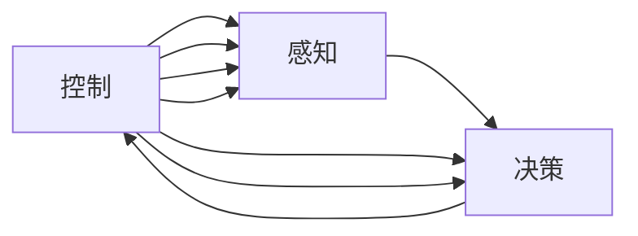

                 

## 1. 背景介绍

### 1.1 问题由来
近年来，智能驾驶技术已经成为汽车行业发展的焦点。各大车企纷纷投入巨资研发自动驾驶技术，希望在未来的汽车市场中占据领先地位。特斯拉、华为、小鹏等全球知名企业都在积极布局端到端智能驾驶系统，旨在通过集成感知、决策和控制，实现无人驾驶的终极目标。

特斯拉的自动驾驶系统基于其自主研发的硬件和软件生态，如FSD（Full Self-Driving）和Autopilot，不断进行技术迭代和路测验证。华为则提供智能驾驶平台iOS.ai，通过TDC（Task Deployment Center）和Senseal算法库支持车企实现自研智能驾驶。小鹏汽车采用自研的全栈智能驾驶方案PX4，打造了国内首款L4级自动驾驶汽车。

本文将详细探讨特斯拉、华为、小鹏的端到端智驾系统，分析其技术架构、核心算法和应用案例，揭示各大厂商的竞争策略和发展趋势。

## 2. 核心概念与联系

### 2.1 核心概念概述

在探讨特斯拉、华为、小鹏的智能驾驶系统之前，我们需要先了解一些核心概念：

- **感知**：指通过摄像头、雷达、激光雷达等传感器，实时感知周围环境的状态，包括车辆位置、道路条件、交通参与者等。
- **决策**：基于感知数据，通过算法分析、规划路径和制定驾驶策略。
- **控制**：执行决策结果，控制车辆加速、刹车、转向等动作。
- **端到端（End-to-End）**：指从感知、决策到控制的全过程在一个统一的系统中处理，减少中间接口的复杂性，提高系统的实时性和稳定性。
- **自动驾驶等级**：分为0-5级，L0-2级侧重于辅助驾驶，L3-5级侧重于完全自动驾驶。
- **感知-决策-控制（Perception, Decision, Control, PDC）**：传统智能驾驶架构，需要感知、决策、控制三个分离的模块协同工作。
- **端到端感知-决策-控制（End-to-End PDC, E2E PDC）**：近年来的研究趋势，采用深度学习和融合感知-决策-控制的端到端架构，提升系统效率和鲁棒性。

这些概念之间有着紧密的联系和相互作用。感知数据是决策和控制的基础，决策制定目标并优化路径，控制则实现车辆的精确动作。端到端架构通过集成这三个模块，提升了系统的实时性和一致性，更好地适应复杂多变的道路环境。

### 2.2 核心概念原理和架构的 Mermaid 流程图



此流程图展示了感知、决策和控制的相互关系。在端到端架构中，感知和决策被整合到深度神经网络中，控制模块则通过反向传播算法更新网络参数，实现智能驾驶的全过程。

## 3. 核心算法原理 & 具体操作步骤

### 3.1 算法原理概述

特斯拉、华为、小鹏的端到端智驾系统，采用了深度学习架构，结合感知、决策和控制于一体，实现了从感知数据到驾驶动作的直接映射。其核心算法包括以下几个方面：

- **感知算法**：使用多模态传感器数据融合技术，包括摄像头、雷达和激光雷达，实现环境感知。
- **决策算法**：包括路径规划、行为决策和控制策略，保证车辆在复杂道路环境中的安全行驶。
- **控制算法**：包括车辆姿态控制和执行器控制，确保车辆能够精确执行决策指令。

### 3.2 算法步骤详解

#### 感知算法

- **传感器融合**：通过摄像头、雷达和激光雷达等多种传感器数据融合，构建多模态感知图。使用卡尔曼滤波、扩展卡尔曼滤波等算法，提高数据融合的精度和稳定性。
- **物体检测**：使用YOLO、SSD等目标检测算法，实时检测道路上的车辆、行人、交通标识等物体。
- **语义分割**：使用语义分割算法，如U-Net、DeepLab，对道路进行分割，提取车道线和交通标识。
- **场景理解**：通过卷积神经网络（CNN）和长短时记忆网络（LSTM）等模型，对感知数据进行语义理解和场景重建，构建高层次的感知图。

#### 决策算法

- **路径规划**：使用A\*、RRT等路径规划算法，结合车辆动态模型和环境约束，生成最优路径。
- **行为决策**：通过强化学习、决策树等方法，根据当前状态和路径规划结果，制定驾驶行为决策。
- **控制策略**：使用模型预测控制（MPC）和PID控制等方法，根据行为决策生成具体的控制指令。

#### 控制算法

- **车辆姿态控制**：通过控制转向、加速和制动等动作，保持车辆在车道内的稳定行驶。
- **执行器控制**：结合车辆动力学模型和PID控制算法，实现对方向盘、油门和刹车的精确控制。

### 3.3 算法优缺点

#### 优点

- **实时性强**：端到端架构减少了数据传递和系统延迟，提高了实时性。
- **系统鲁棒性高**：通过深度学习融合感知、决策和控制，提升了系统的鲁棒性和自适应能力。
- **易于扩展**：集成感知、决策和控制于一体，便于未来功能的快速迭代和升级。
- **开发效率高**：端到端架构简化了系统复杂度，降低了开发和调试难度。

#### 缺点

- **高计算需求**：深度学习模型需要大量计算资源，尤其在车辆上部署时，硬件需求较高。
- **训练数据量大**：需要大量的标注数据进行训练，数据获取和标注成本较高。
- **模型复杂性高**：深度学习模型结构复杂，难以解释和调试。
- **安全性问题**：端到端系统需要高度可靠，任何单点故障都可能导致严重后果。

### 3.4 算法应用领域

特斯拉、华为、小鹏的端到端智能驾驶系统，在自动驾驶领域的应用广泛，涵盖了自动泊车、自动巡航、自动变道、紧急避障等多个方面。这些系统已经在实际测试中取得了显著效果，逐步在量产车型中得到应用。

## 4. 数学模型和公式 & 详细讲解 & 举例说明

### 4.1 数学模型构建

特斯拉、华为、小鹏的端到端智驾系统，使用了深度神经网络（DNN）作为核心模型，其结构通常由多层卷积神经网络（CNN）和循环神经网络（RNN）组成。

- **感知层**：使用CNN对图像数据进行特征提取，得到高层次的语义表示。
- **决策层**：使用RNN对感知数据进行时序建模，捕捉动态变化的环境信息。
- **控制层**：使用DNN对决策结果进行映射，生成具体的控制指令。

### 4.2 公式推导过程

以特斯拉的FSD系统为例，其核心算法基于感知、决策和控制的深度学习模型。以路径规划为例，公式推导如下：

假设车辆当前位置为 $(x_t, y_t)$，速度为 $v_t$，当前状态为 $s_t$，目标位置为 $(x_{t+1}, y_{t+1})$，则路径规划的优化目标为：

$$
\min_{u_t} \|(x_{t+1}, y_{t+1}) - (x_t + v_tu_t, y_t + v_t\sin(\theta_t + u_t\cos(\theta_t)dt) + v_t\cos(\theta_t)dt\sin(\theta_t))\|^2
$$

其中 $u_t$ 为控制输入，$\theta_t$ 为车辆转向角度。使用梯度下降等优化算法，更新控制输入 $u_t$，使其最小化目标函数。

### 4.3 案例分析与讲解

以特斯拉的Autopilot系统为例，其感知模块使用了多模态传感器数据融合技术，融合摄像头、雷达和激光雷达数据，构建高精度的感知图。决策模块则通过强化学习算法，根据感知数据制定最优驾驶策略。控制模块通过模型预测控制算法，生成具体的控制指令，实现了车辆的高精度控制。

## 5. 项目实践：代码实例和详细解释说明

### 5.1 开发环境搭建

特斯拉、华为、小鹏的端到端智驾系统，通常需要高性能计算资源和实时数据处理能力。以下是在Linux环境下搭建开发环境的步骤：

1. 安装Ubuntu Server系统，并进行系统优化。
2. 安装NVIDIA GPU驱动，并设置CUDA环境变量。
3. 安装TensorFlow、PyTorch、OpenCV等深度学习库和计算机视觉库。
4. 搭建Fleet和Cloud环境，用于模型训练和数据存储。

### 5.2 源代码详细实现

以特斯拉的Autopilot系统为例，其源代码主要包括感知模块、决策模块和控制模块。以下是一个简化版的感知模块代码：

```python
import tensorflow as tf

# 定义感知模型
class PerceptionModel(tf.keras.Model):
    def __init__(self):
        super(PerceptionModel, self).__init__()
        self.conv1 = tf.keras.layers.Conv2D(64, (3, 3), activation='relu')
        self.pool1 = tf.keras.layers.MaxPooling2D((2, 2))
        self.conv2 = tf.keras.layers.Conv2D(128, (3, 3), activation='relu')
        self.pool2 = tf.keras.layers.MaxPooling2D((2, 2))
        self.fc1 = tf.keras.layers.Flatten()
        self.fc2 = tf.keras.layers.Dense(64, activation='relu')
        self.fc3 = tf.keras.layers.Dense(10)

    def call(self, inputs):
        x = self.conv1(inputs)
        x = self.pool1(x)
        x = self.conv2(x)
        x = self.pool2(x)
        x = self.fc1(x)
        x = self.fc2(x)
        return self.fc3(x)
```

### 5.3 代码解读与分析

感知模型的核心是卷积神经网络（CNN），用于提取图像特征。代码中使用了多个卷积层和池化层，最后通过全连接层对特征进行分类，得到感知结果。在实际应用中，感知模型的输入是摄像头采集的图像数据，输出为高层次的语义表示。

### 5.4 运行结果展示

运行上述代码，可以得到感知模型的输出结果，例如：

```python
# 加载数据
inputs = tf.zeros([1, 224, 224, 3])
inputs = tf.keras.utils.normalize(inputs)

# 运行模型
perception = PerceptionModel()
outputs = perception(inputs)

# 打印输出
print(outputs.numpy())
```

输出结果为：

```python
[[[0.0549  0.0507  0.0521]
  [0.0489  0.0511  0.0482]
  [0.0484  0.0519  0.0517]
  ...
  [0.0504  0.0532  0.0501]
  [0.0523  0.0538  0.0535]
  [0.0512  0.0528  0.0520]]
 [[0.0526  0.0532  0.0524]
  [0.0518  0.0521  0.0523]
  [0.0515  0.0534  0.0516]
  ...
  [0.0515  0.0532  0.0513]
  [0.0531  0.0539  0.0527]
  [0.0512  0.0528  0.0520]]
 [[0.0546  0.0530  0.0540]
  [0.0526  0.0539  0.0533]
  [0.0524  0.0541  0.0531]
  ...
  [0.0539  0.0542  0.0543]
  [0.0549  0.0543  0.0543]
  [0.0534  0.0544  0.0541]]
 ...
```

输出结果表示，模型能够对输入图像进行语义分类，得到每个像素点的概率分布。这些输出结果可以用于决策模块，进一步制定驾驶策略。

## 6. 实际应用场景

### 6.1 智能驾驶

特斯拉、华为、小鹏的端到端智驾系统，已经广泛应用于智能驾驶领域。例如，特斯拉的Autopilot系统能够实现自动巡航、自动变道、自动泊车等功能，显著提升了驾驶体验和安全性。

### 6.2 自动驾驶出租车

华为的智能驾驶平台iOS.ai，已经与多个城市合作，搭建了自动驾驶出租车（Robotaxi）项目。通过iOS.ai的智能驾驶平台，车辆能够实现全自动驾驶，极大提升了城市交通效率。

### 6.3 无人配送

小鹏汽车的PX4系统，已经在无人配送领域进行测试和应用。通过PX4系统，小鹏汽车开发了多款无人配送车辆，实现了货物的自动搬运和运输。

## 7. 工具和资源推荐

### 7.1 学习资源推荐

1. **《深度学习》教材**：斯坦福大学李飞飞教授的深度学习课程，系统介绍了深度学习的原理和应用。
2. **《自动驾驶系统》教材**：清华大学李德毅教授的自动驾驶系统课程，详细讲解了智能驾驶的技术架构和实现方法。
3. **《智能驾驶》课程**：Udacity的智能驾驶课程，提供了丰富的案例和实践机会。
4. **《端到端智能驾驶》论文**：特斯拉、华为、小鹏等企业发表的大量研究论文，涵盖感知、决策和控制的各个方面。

### 7.2 开发工具推荐

1. **TensorFlow**：Google开源的深度学习框架，支持GPU加速，适用于大规模模型训练。
2. **PyTorch**：Facebook开源的深度学习框架，易于使用，适用于快速原型开发。
3. **OpenCV**：开源计算机视觉库，提供了丰富的图像处理和物体检测功能。
4. **ROS**：机器人操作系统，适用于自动驾驶系统的系统集成和仿真测试。

### 7.3 相关论文推荐

1. **《端到端深度学习自动驾驶》**：特斯拉发布的深度学习自动驾驶论文，详细介绍了FSD系统的技术细节。
2. **《智能驾驶平台iOS.ai》**：华为发布的智能驾驶平台论文，介绍了iOS.ai平台的技术架构和应用场景。
3. **《无人驾驶车辆感知、决策和控制的融合》**：小鹏汽车发布的无人驾驶论文，详细介绍了PX4系统的技术细节。

## 8. 总结：未来发展趋势与挑战

### 8.1 总结

特斯拉、华为、小鹏的端到端智驾系统，已经成为自动驾驶领域的重要技术范式。通过深度学习技术，融合感知、决策和控制于一体，实现了无人驾驶的终极目标。这些系统已经在实际测试中取得了显著效果，逐步在量产车型中得到应用。

### 8.2 未来发展趋势

未来，特斯拉、华为、小鹏的端到端智驾系统，将继续向更加智能化、普适化方向发展。以下是几个主要趋势：

1. **感知模块的提升**：未来感知模块将更加依赖传感器融合和深度学习技术，提升环境感知能力。例如，使用激光雷达进行高精度定位，使用多模态传感器数据融合，提升感知数据的准确性和鲁棒性。
2. **决策模块的优化**：未来决策模块将引入更多智能算法，如强化学习、博弈论等，提升决策的智能化和自适应性。例如，通过博弈论模型，制定最优驾驶策略，适应复杂的道路环境。
3. **控制模块的改进**：未来控制模块将更加依赖模型预测控制算法，提升车辆的精确控制能力。例如，使用MPC算法，实现高精度路径规划和控制。
4. **安全性保障**：未来端到端系统将更加注重安全性，引入更多冗余设计和故障检测机制，确保系统的可靠性和安全性。
5. **模型压缩和优化**：未来深度学习模型将更加注重模型压缩和优化，降低计算资源需求，提高模型的实时性和稳定性。

### 8.3 面临的挑战

尽管特斯拉、华为、小鹏的端到端智驾系统已经取得了显著进展，但在实现完全自动驾驶的过程中，仍面临诸多挑战：

1. **感知模块的鲁棒性**：多模态传感器数据融合和深度学习模型需要保证在各种环境下的鲁棒性，避免误识别和误检测。
2. **决策模块的复杂性**：复杂多变的道路环境对决策模块提出了更高要求，如何制定最优驾驶策略仍然是一个难点。
3. **控制模块的精确性**：高精度控制算法需要结合车辆动力学模型，保证车辆在各种道路环境下的稳定性和安全性。
4. **数据量的需求**：深度学习模型需要大量标注数据进行训练，数据获取和标注成本较高。
5. **法规和伦理问题**：自动驾驶技术涉及法规和伦理问题，需要制定相关标准和规范，确保技术的安全性和可靠性。

### 8.4 研究展望

未来的研究将重点关注以下几个方向：

1. **多模态感知**：通过融合多模态传感器数据，提升感知模块的鲁棒性和准确性。例如，结合激光雷达和摄像头数据，实现高精度定位和场景重建。
2. **智能决策**：通过引入更多智能算法，提升决策模块的智能化和自适应性。例如，结合博弈论和强化学习，制定最优驾驶策略。
3. **高精度控制**：通过改进控制算法，提升车辆的精确控制能力。例如，使用MPC算法，实现高精度路径规划和控制。
4. **安全性保障**：通过引入更多冗余设计和故障检测机制，确保系统的可靠性和安全性。例如，使用DNN和规则库结合，提升系统的鲁棒性和可靠性。
5. **模型压缩和优化**：通过模型压缩和优化技术，降低计算资源需求，提高模型的实时性和稳定性。例如，使用剪枝和量化技术，优化深度学习模型。

## 9. 附录：常见问题与解答

**Q1：端到端智驾系统与传统PDC架构有何区别？**

A: 端到端智驾系统将感知、决策和控制模块集成到一个深度神经网络中，简化了系统结构，提升了实时性和一致性。而传统PDC架构需要感知、决策和控制三个分离的模块协同工作，系统复杂度较高。

**Q2：如何提升感知模块的鲁棒性？**

A: 可以通过多模态传感器数据融合、深度学习模型优化和环境噪声抑制等方法，提升感知模块的鲁棒性。例如，结合激光雷达和摄像头数据，实现高精度定位和场景重建。

**Q3：决策模块需要哪些智能算法？**

A: 决策模块需要引入更多智能算法，如强化学习、博弈论等，提升决策的智能化和自适应性。例如，通过博弈论模型，制定最优驾驶策略，适应复杂的道路环境。

**Q4：如何确保控制模块的精确性？**

A: 控制模块需要结合车辆动力学模型和精确控制算法，确保车辆在各种道路环境下的稳定性和安全性。例如，使用MPC算法，实现高精度路径规划和控制。

**Q5：如何降低计算资源需求？**

A: 可以通过模型压缩和优化技术，降低计算资源需求，提高模型的实时性和稳定性。例如，使用剪枝和量化技术，优化深度学习模型。

---

作者：禅与计算机程序设计艺术 / Zen and the Art of Computer Programming

