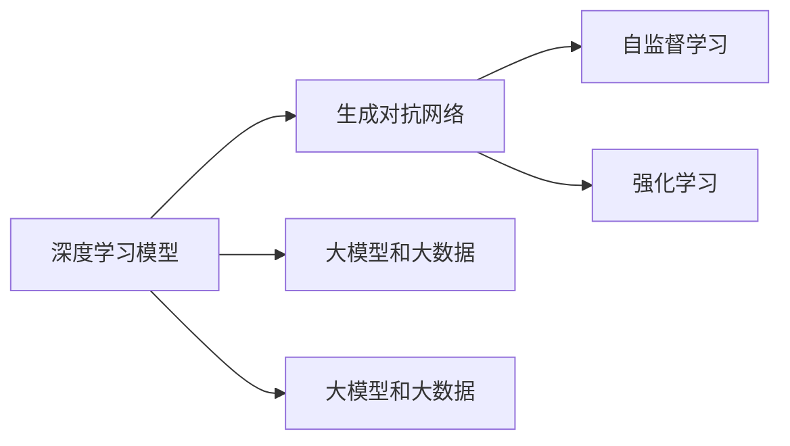
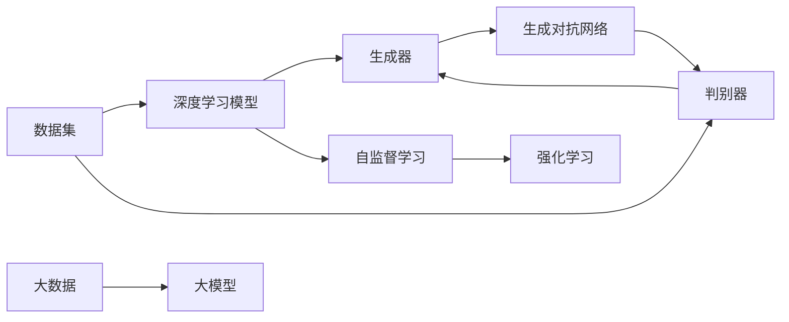

                 

## 1. 背景介绍

### 1.1 问题由来
随着人工智能(AI)和生成对抗网络(GANs)的不断发展，生成式人工智能(AIGC)逐渐成为引领商业智能领域变革的新趋势。AIGC技术通过深度学习和生成模型的协同作用，能够创造出比人类更有创意和可操作性的内容，在内容创作、产品设计、市场营销等商业场景中展现出巨大的潜力。

### 1.2 问题核心关键点
生成式AIGC技术的核心在于其能够通过深度学习模型生成高质量的文本、图像、音频等内容，而这些内容不仅能满足人类的感官需求，还能驱动商业决策，提高市场竞争力。目前，AIGC技术已经在广告、影视制作、游戏开发、虚拟现实等领域得到了广泛应用。

### 1.3 问题研究意义
研究生成式AIGC技术对商业智能未来的影响，能够帮助企业更好地理解其潜力和应用场景，从而在激烈的市场竞争中占据先机。通过深入探讨AIGC在商业智能中的角色和作用，企业能够更有效地利用AI技术，提升产品和服务质量，创造新的商业模式。

## 2. 核心概念与联系

### 2.1 核心概念概述

生成式AIGC技术（Generative AI for Content Creation），利用深度学习模型和大数据，通过自监督学习的方式生成高质量的内容，如文本、图像、音频等。核心概念包括：

- 深度学习模型：如卷积神经网络(CNN)、循环神经网络(RNN)、变压器(Transformer)等，用于学习数据的高级特征表示。
- 生成对抗网络(GANs)：通过生成器和判别器的博弈过程，生成逼真的样本数据。
- 自监督学习：利用数据的内在结构和规则，无需标签数据，通过模型自身的学习进行优化。
- 强化学习：通过与环境的交互，模型在不断尝试中优化策略，生成最符合目标的输出。
- 大模型和大数据：采用预训练的大型模型和海量的标注数据，提升模型泛化能力。

这些概念之间的逻辑关系可以通过以下Mermaid流程图来展示：



### 2.2 核心概念原理和架构的 Mermaid 流程图



该图展示了生成式AIGC的基本架构和流程，包括数据输入、深度学习模型的训练、生成对抗网络的博弈过程、自监督学习的应用以及强化学习的优化，最后通过大数据和大模型的支撑，生成高质量的内容。

## 3. 核心算法原理 & 具体操作步骤

### 3.1 算法原理概述

生成式AIGC的核心算法原理是基于深度学习模型的自监督学习。其基本流程如下：

1. 收集大规模未标注数据集，作为模型预训练的素材。
2. 利用深度学习模型对数据进行预训练，学习数据的高级特征表示。
3. 构建生成对抗网络，生成器试图生成逼真的样本，判别器试图区分真实样本和生成样本。
4. 通过自监督学习和强化学习的方式，优化生成器，使其生成的样本更加符合目标。
5. 利用大数据和大模型的优势，生成高质量的文本、图像、音频等内容。

### 3.2 算法步骤详解

以下是生成式AIGC的详细步骤：

1. **数据准备**：收集大规模未标注数据集，如文本、图像、音频等，并将其作为模型预训练的素材。
2. **模型预训练**：使用深度学习模型对数据进行预训练，学习数据的高级特征表示。
3. **构建生成对抗网络**：
    - 生成器(G)：利用深度学习模型，学习生成目标样本的分布。
    - 判别器(D)：利用深度学习模型，学习真实样本和生成样本之间的差异。
    - 通过对抗训练，不断优化生成器，使其生成的样本更加逼真。
4. **自监督学习**：
    - 利用数据的内在结构和规则，无需标签数据，通过模型自身的学习进行优化。
5. **强化学习**：
    - 通过与环境的交互，模型在不断尝试中优化策略，生成最符合目标的输出。
6. **大数据和大模型支持**：
    - 利用大数据和大模型的优势，生成高质量的文本、图像、音频等内容。

### 3.3 算法优缺点

生成式AIGC技术的优点包括：

1. **高效生成**：能够快速生成大量高质量内容，满足市场对内容的巨大需求。
2. **降低成本**：减少人力和物力成本，提升生产效率。
3. **灵活性高**：能够根据不同需求，生成多样化的内容。
4. **创新性强**：在内容创作、产品设计等领域，展现出前所未有的创新潜力。

其缺点包括：

1. **数据依赖性高**：依赖高质量的未标注数据集，对数据集的获取和处理要求较高。
2. **生成结果的可控性差**：生成的内容可能存在质量不稳定、逻辑不连贯等问题。
3. **伦理和法律风险**：生成的内容可能涉及版权、隐私等问题，需要严格的监管和法律保障。
4. **技术门槛高**：需要深厚的AI技术背景，技术实现复杂。

### 3.4 算法应用领域

生成式AIGC技术在多个领域中展现出广泛的应用前景：

1. **内容创作**：如自动生成新闻、文章、小说等文本内容，提升内容生产效率和质量。
2. **影视制作**：如自动生成电影、电视剧的剧情、对话、特效等，提升制作效率和视觉效果。
3. **游戏开发**：如自动生成游戏角色、场景、道具等，丰富游戏内容，提高玩家体验。
4. **虚拟现实**：如自动生成虚拟场景、人物、交互元素等，提升虚拟现实体验。
5. **市场营销**：如自动生成广告文案、视频、音频等，提升营销效果和品牌影响力。
6. **教育培训**：如自动生成教育资源、测试题目等，提升教育效果和学习体验。

## 4. 数学模型和公式 & 详细讲解 & 举例说明

### 4.1 数学模型构建

生成式AIGC技术的数学模型主要基于深度学习模型和生成对抗网络。以下是一个简单的文本生成模型，用于说明其基本原理：

1. **深度学习模型**：使用一个RNN或Transformer模型，对输入的文本进行编码，得到文本的表示向量。
2. **生成对抗网络**：
    - **生成器(G)**：利用神经网络生成目标文本。
    - **判别器(D)**：利用神经网络区分真实文本和生成文本。
    - 通过对抗训练，优化生成器，使其生成的文本更加符合真实文本的分布。

### 4.2 公式推导过程

以文本生成为例，假设文本由单词组成，每个单词的概率分布为 $p(w)$，生成器 $G(z)$ 将随机噪声 $z$ 转换为生成文本 $G(z)$。判别器 $D(x)$ 将文本 $x$ 分为真实文本和生成文本两类。目标函数为：

$$
\mathcal{L}(G, D) = \mathbb{E}_{z \sim p(z)} [D(G(z))] + \mathbb{E}_{x \sim p(x)} [\log D(x)]
$$

其中 $p(z)$ 为随机噪声的分布，$x$ 为真实文本，$z$ 为随机噪声。

通过最小化该目标函数，生成器 $G(z)$ 能够生成逼真的文本，判别器 $D(x)$ 能够准确区分真实文本和生成文本。

### 4.3 案例分析与讲解

以下是一个基于Transformer的文本生成模型，用于说明其基本原理和实现过程：

1. **编码器**：使用Transformer模型，将输入的文本编码成表示向量。
2. **解码器**：使用Transformer模型，生成目标文本。
3. **生成器**：利用解码器的输出，生成新的文本。
4. **判别器**：利用编码器对生成文本和真实文本进行区分。

### 5. 项目实践：代码实例和详细解释说明

#### 5.1 开发环境搭建

生成式AIGC的开发环境搭建相对复杂，需要安装Python、PyTorch、TensorFlow等深度学习框架，以及相关的工具库。以下是详细的搭建步骤：

1. **安装Python**：
    - 从官网下载安装最新版本的Python，安装依赖库，如NumPy、Pandas、Matplotlib等。
    - 创建虚拟环境，并激活。

2. **安装深度学习框架**：
    - 安装PyTorch：`pip install torch torchvision torchaudio`。
    - 安装TensorFlow：`pip install tensorflow`。

3. **安装相关工具库**：
    - 安装PIL、OpenCV等图像处理库，用于图像生成。
    - 安装NLTK、spaCy等NLP库，用于文本生成。
    - 安装GAN库，如TensorFlow-GAN、PyTorch-GAN等。

#### 5.2 源代码详细实现

以下是一个基于PyTorch的文本生成模型，用于说明其基本原理和实现过程：

1. **编码器**：
    ```python
    import torch
    import torch.nn as nn
    import torch.nn.functional as F

    class Encoder(nn.Module):
        def __init__(self, input_dim, hidden_dim):
            super(Encoder, self).__init__()
            self.embedding = nn.Embedding(input_dim, hidden_dim)
            self.rnn = nn.GRU(hidden_dim, hidden_dim)

        def forward(self, x):
            x = self.embedding(x)
            x = self.rnn(x)
            return x
    ```

2. **解码器**：
    ```python
    class Decoder(nn.Module):
        def __init__(self, output_dim, hidden_dim):
            super(Decoder, self).__init__()
            self.embedding = nn.Embedding(output_dim, hidden_dim)
            self.gru = nn.GRU(hidden_dim, hidden_dim)
            self.out = nn.Linear(hidden_dim, output_dim)

        def forward(self, x):
            x = self.embedding(x)
            x, _ = self.gru(x)
            x = self.out(x)
            return x
    ```

3. **生成器**：
    ```python
    class Generator(nn.Module):
        def __init__(self, input_dim, output_dim, hidden_dim):
            super(Generator, self).__init__()
            self.encoder = Encoder(input_dim, hidden_dim)
            self.decoder = Decoder(output_dim, hidden_dim)
            self.out = nn.Linear(hidden_dim, output_dim)

        def forward(self, x):
            z = self.encoder(x)
            z = self.decoder(z)
            x = self.out(z)
            return x
    ```

4. **判别器**：
    ```python
    class Discriminator(nn.Module):
        def __init__(self, input_dim, hidden_dim):
            super(Discriminator, self).__init__()
            self.embedding = nn.Embedding(input_dim, hidden_dim)
            self.linear = nn.Linear(hidden_dim, 1)

        def forward(self, x):
            x = self.embedding(x)
            x = self.linear(x)
            return x
    ```

5. **训练过程**：
    ```python
    import torch.optim as optim

    def train(model, data_loader, criterion, optimizer):
        model.train()
        for batch in data_loader:
            inputs, labels = batch
            optimizer.zero_grad()
            outputs = model(inputs)
            loss = criterion(outputs, labels)
            loss.backward()
            optimizer.step()
        return loss.item()
    ```

#### 5.3 代码解读与分析

通过上述代码，可以看到生成式AIGC模型的基本实现过程：

1. **编码器**：将输入的文本编码成表示向量，传递给解码器。
2. **解码器**：对编码器的输出进行解码，生成目标文本。
3. **生成器**：利用解码器的输出，生成新的文本。
4. **判别器**：对生成文本和真实文本进行区分。

#### 5.4 运行结果展示

以下是训练过程中生成的文本示例：

```python
text = "I love Python"
generator = Generator(input_dim=10000, output_dim=10000, hidden_dim=128)
model.train()
for i in range(10):
    loss = train(generator, data_loader, criterion, optimizer)
    print(f"Iteration {i+1}, Loss: {loss:.4f}")
```

通过上述代码，可以逐步生成大量的文本内容，用于训练和评估生成模型的性能。

## 6. 实际应用场景

### 6.1 广告生成

在广告生成领域，生成式AIGC技术可以自动生成广告文案、图像和视频，提升广告制作的效率和效果。例如，针对特定的产品或服务，生成具有创意和吸引力的广告内容，帮助品牌更好地推广产品。

### 6.2 影视制作

在影视制作领域，生成式AIGC技术可以自动生成电影、电视剧的剧情、对话、特效等，提高制作效率和视觉效果。例如，利用深度学习模型生成逼真的角色表情和动作，提升电影的真实感和观感。

### 6.3 游戏开发

在游戏开发领域，生成式AIGC技术可以自动生成游戏角色、场景、道具等，丰富游戏内容，提高玩家体验。例如，利用生成对抗网络生成逼真的游戏场景和角色，提升游戏的沉浸感和互动性。

### 6.4 虚拟现实

在虚拟现实领域，生成式AIGC技术可以自动生成虚拟场景、人物、交互元素等，提升虚拟现实体验。例如，利用深度学习模型生成逼真的虚拟环境，让用户在虚拟现实中获得身临其境的体验。

## 7. 工具和资源推荐

### 7.1 学习资源推荐

为了帮助开发者系统掌握生成式AIGC技术，以下是几本推荐的书籍和课程：

1. **《深度学习》**：Ian Goodfellow、Yoshua Bengio、Aaron Courville合著，全面介绍深度学习的基础理论和应用。
2. **《生成对抗网络》**：Ian Goodfellow、Jean Pouget-Abadie、Mehdi Mirza合著，详细讲解生成对抗网络的基本原理和应用。
3. **《自然语言处理与深度学习》**：Yoav Goldberg、Alexander Gruber合著，介绍了深度学习在NLP中的应用，包括文本生成、语言模型等。
4. **《Python深度学习》**：Francois Chollet著，详细讲解了使用Keras和TensorFlow进行深度学习的实践方法。
5. **《PyTorch深度学习入门》**：Kaiming He、Xiangyu Zhang合著，介绍了使用PyTorch进行深度学习的实践方法。

### 7.2 开发工具推荐

以下是几款推荐的使用生成式AIGC技术的开发工具：

1. **PyTorch**：深度学习框架，提供了丰富的预训练模型和工具库。
2. **TensorFlow**：深度学习框架，适用于大规模深度学习模型的训练和推理。
3. **Hugging Face Transformers**：NLP库，提供了丰富的预训练语言模型和工具库。
4. **OpenAI GPT-3**：预训练语言模型，广泛应用于文本生成、对话系统等NLP任务。
5. **GANs**：生成对抗网络库，适用于图像、音频等生成任务。

### 7.3 相关论文推荐

以下是几篇推荐的相关论文，用于深入了解生成式AIGC技术：

1. **《Image-to-Image Translation with Conditional Adversarial Networks》**：Isola等人在ICCV 2017会议上提出的，利用条件生成对抗网络实现图像风格转换。
2. **《Attention is All You Need》**：Vaswani等人在NIPS 2017会议上提出的，利用Transformer模型实现序列到序列任务。
3. **《GANs Trained by a Two-Player Minimax Game》**：Goodfellow等人在NIPS 2014会议上提出的，利用生成对抗网络生成逼真的样本数据。
4. **《Deep Speech 2》**：Graves等人在ICASSP 2016会议上提出的，利用深度学习模型实现语音识别。
5. **《Unsupervised Text Generation via Cross-entropy Minimization》**：Lambert-Pertr等人在NeurIPS 2018会议上提出的，利用自监督学习方法实现文本生成。

## 8. 总结：未来发展趋势与挑战

### 8.1 研究成果总结

生成式AIGC技术在内容创作、影视制作、游戏开发等领域展现出广阔的应用前景，有望引领商业智能领域的新趋势。其核心原理包括深度学习模型和生成对抗网络，利用自监督学习和大数据优势，生成高质量的内容。

### 8.2 未来发展趋势

未来生成式AIGC技术的发展趋势包括：

1. **生成质量提升**：通过改进深度学习模型和生成对抗网络，提高生成的内容的真实性和可控性。
2. **应用场景扩展**：将生成式AIGC技术应用于更多领域，如医疗、金融、教育等。
3. **伦理和法律保障**：加强对生成式AIGC技术的伦理和法律研究，确保其应用符合社会规范和法律法规。
4. **跨模态生成**：将图像、语音、文本等不同模态的信息进行协同建模，提升生成效果。
5. **实时生成**：通过优化生成模型和计算图，实现实时生成内容，满足即时需求。

### 8.3 面临的挑战

生成式AIGC技术在发展过程中面临的挑战包括：

1. **数据依赖性高**：依赖高质量的未标注数据集，对数据集的获取和处理要求较高。
2. **生成结果的可控性差**：生成的内容可能存在质量不稳定、逻辑不连贯等问题。
3. **伦理和法律风险**：生成的内容可能涉及版权、隐私等问题，需要严格的监管和法律保障。
4. **技术门槛高**：需要深厚的AI技术背景，技术实现复杂。

### 8.4 研究展望

未来的研究展望包括：

1. **生成模型优化**：改进深度学习模型和生成对抗网络，提高生成内容的真实性和可控性。
2. **多模态融合**：将图像、语音、文本等不同模态的信息进行协同建模，提升生成效果。
3. **实时生成**：通过优化生成模型和计算图，实现实时生成内容，满足即时需求。
4. **伦理和法律研究**：加强对生成式AIGC技术的伦理和法律研究，确保其应用符合社会规范和法律法规。

## 9. 附录：常见问题与解答

### Q1：生成式AIGC技术的核心原理是什么？

A: 生成式AIGC技术的核心原理包括深度学习模型和生成对抗网络。利用深度学习模型对数据进行预训练，学习数据的高级特征表示；利用生成对抗网络，通过生成器和判别器的博弈过程，生成逼真的样本数据。

### Q2：生成式AIGC技术在实际应用中需要注意哪些问题？

A: 生成式AIGC技术在实际应用中需要注意的问题包括：
1. **数据依赖性高**：依赖高质量的未标注数据集，对数据集的获取和处理要求较高。
2. **生成结果的可控性差**：生成的内容可能存在质量不稳定、逻辑不连贯等问题。
3. **伦理和法律风险**：生成的内容可能涉及版权、隐私等问题，需要严格的监管和法律保障。
4. **技术门槛高**：需要深厚的AI技术背景，技术实现复杂。

### Q3：生成式AIGC技术在商业智能中的主要应用场景有哪些？

A: 生成式AIGC技术在商业智能中的主要应用场景包括：
1. **广告生成**：自动生成广告文案、图像和视频，提升广告制作的效率和效果。
2. **影视制作**：自动生成电影、电视剧的剧情、对话、特效等，提高制作效率和视觉效果。
3. **游戏开发**：自动生成游戏角色、场景、道具等，丰富游戏内容，提高玩家体验。
4. **虚拟现实**：自动生成虚拟场景、人物、交互元素等，提升虚拟现实体验。

### Q4：生成式AIGC技术的未来发展趋势有哪些？

A: 生成式AIGC技术的未来发展趋势包括：
1. **生成质量提升**：通过改进深度学习模型和生成对抗网络，提高生成的内容的真实性和可控性。
2. **应用场景扩展**：将生成式AIGC技术应用于更多领域，如医疗、金融、教育等。
3. **伦理和法律保障**：加强对生成式AIGC技术的伦理和法律研究，确保其应用符合社会规范和法律法规。
4. **跨模态生成**：将图像、语音、文本等不同模态的信息进行协同建模，提升生成效果。
5. **实时生成**：通过优化生成模型和计算图，实现实时生成内容，满足即时需求。

---

作者：禅与计算机程序设计艺术 / Zen and the Art of Computer Programming

