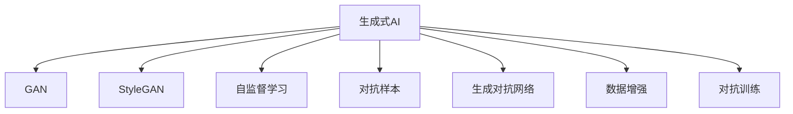

                 

# 生成式AI浪潮中的中国与美国技术对比

## 1. 背景介绍

随着生成式人工智能（Generative AI）技术的飞速发展，各国在AI领域的竞争也愈加激烈。特别是中国和美国，作为全球AI创新的两大中心，两国在生成式AI技术上各具特色，展现出不同的技术路径和应用前景。本文将深入对比中美两国在生成式AI领域的核心技术、产业布局、应用场景以及未来趋势，为读者提供一个全面的视角。

## 2. 核心概念与联系

### 2.1 核心概念概述

为更好地理解中美两国在生成式AI技术上的异同，本节将介绍几个关键概念及其相互联系：

- 生成式AI（Generative AI）：指通过机器学习算法，自动生成具有创造性和真实性的人工智能内容，如文本、图像、音乐、视频等。

- GAN（Generative Adversarial Networks）：一种生成模型，通过两个神经网络相互对抗生成逼真的数据。

- StyleGAN：一种改进的GAN模型，用于生成逼真的人脸图像，具有高度的表达能力和多样性。

- 自监督学习（Self-Supervised Learning）：指在无标签数据上通过自监督任务训练模型，如掩码语言建模、自编码等。

- 对抗样本（Adversarial Examples）：指专门设计用于欺骗AI模型，使其产生错误输出的数据样本。

- 生成对抗网络（Generative Adversarial Networks, GANs）：由两个深度神经网络构成，一个生成器生成假样本，另一个判别器判断样本真假。

- 数据增强（Data Augmentation）：通过数据变换增加训练集多样性，提升模型的泛化能力。

- 对抗训练（Adversarial Training）：通过引入对抗样本训练模型，提高模型的鲁棒性。

### 2.2 核心概念原理和架构的 Mermaid 流程图



这个流程图展示了生成式AI领域的主要技术概念及其之间的联系。从GAN、StyleGAN到自监督学习、对抗训练等，各技术相辅相成，共同推动了生成式AI的发展。

## 3. 核心算法原理 & 具体操作步骤

### 3.1 算法原理概述

生成式AI的核心在于利用机器学习模型生成新的、符合特定分布的数据。其中，生成对抗网络（GANs）是生成式AI的重要技术之一，通过生成器和判别器的对抗训练，生成高质量的合成数据。此外，自监督学习也在生成式AI中发挥着重要作用，通过在无标签数据上预训练模型，提取特征用于生成任务。

### 3.2 算法步骤详解

#### 3.2.1 对抗样本生成

对抗样本生成步骤如下：
1. 收集目标数据集，如自然图像、文本等。
2. 随机生成噪声向量 $z$。
3. 将噪声向量输入生成器，生成对抗样本。
4. 判别器对生成的样本进行分类，判断其为真样本或对抗样本。
5. 根据判别器的反馈，调整生成器的参数，生成更逼真的对抗样本。
6. 重复上述步骤，直到生成高质量的对抗样本。

#### 3.2.2 对抗训练

对抗训练步骤如下：
1. 收集目标数据集，如自然图像、文本等。
2. 将数据集划分为训练集和测试集。
3. 使用生成器生成对抗样本。
4. 在训练集上，通过对抗样本和真实样本的混合训练，优化模型参数。
5. 在测试集上评估模型性能，确保模型对对抗样本的鲁棒性。
6. 重复上述步骤，逐步提升模型的鲁棒性。

### 3.3 算法优缺点

#### 3.3.1 对抗样本生成的优缺点

优点：
1. 数据生成速度快，模型无需依赖大量标注数据。
2. 生成的数据多样性高，有助于模型泛化能力的提升。

缺点：
1. 对抗样本可能存在一定的生成噪声，影响生成质量。
2. 生成器与判别器的对抗过程复杂，需要大量计算资源。

#### 3.3.2 对抗训练的优缺点

优点：
1. 提高了模型的鲁棒性，提升了模型对对抗样本的识别能力。
2. 利用对抗样本训练，提升模型泛化能力。

缺点：
1. 对抗样本生成和训练过程复杂，需要大量计算资源。
2. 生成的对抗样本可能存在一定噪声，影响生成质量。

### 3.4 算法应用领域

生成式AI技术在多个领域得到了广泛应用，例如：

- 自然语言处理（NLP）：生成文本摘要、对话系统、语言模型等。
- 计算机视觉（CV）：生成图像、视频、3D模型等。
- 语音生成：生成语音合成、音乐、声学模型等。
- 推荐系统：生成个性化推荐内容，提升用户体验。
- 艺术创作：生成艺术作品、文学作品等。

这些应用领域展示了生成式AI技术的强大潜力和广泛应用前景。

## 4. 数学模型和公式 & 详细讲解 & 举例说明

### 4.1 数学模型构建

生成式AI模型的构建通常包括两个部分：生成器和判别器。其中，生成器 $G(z)$ 将随机噪声 $z$ 映射为生成样本，判别器 $D(x)$ 判断样本的真假。

$$
G(z): \mathcal{Z} \rightarrow \mathcal{X} \\
D(x): \mathcal{X} \rightarrow [0,1]
$$

其中，$\mathcal{Z}$ 为噪声空间，$\mathcal{X}$ 为目标数据空间。

### 4.2 公式推导过程

GAN的目标是最小化生成器与判别器的损失函数，即：

$$
\min_{G} \max_{D} V(G, D) \\
V(G, D) = E_{x \sim p_{data}(x)} [\log D(x)] + E_{z \sim p_{z}(z)} [\log(1 - D(G(z)))]
$$

其中，$V(G, D)$ 为生成器与判别器的联合损失函数，$E_{x \sim p_{data}(x)}$ 表示对真实样本的期望，$E_{z \sim p_{z}(z)}$ 表示对生成样本的期望。

### 4.3 案例分析与讲解

以StyleGAN为例，其在生成高质量人脸图像方面表现优异。StyleGAN通过将高维编码向量 $z$ 映射到低维风格向量 $s$，然后通过两个全连接层生成图像。其风格变换能力使其能够生成不同风格的人脸图像，极大地拓展了人脸生成模型的应用场景。

## 5. 项目实践：代码实例和详细解释说明

### 5.1 开发环境搭建

#### 5.1.1 Python环境搭建

1. 安装Python：从官网下载并安装Python 3.7及以上版本。
2. 安装Anaconda：从官网下载并安装Anaconda，用于创建独立的Python环境。
3. 创建并激活虚拟环境：
```bash
conda create -n gans-env python=3.7 
conda activate gans-env
```

#### 5.1.2 安装依赖包

```bash
pip install torch torchvision numpy matplotlib tensorboard
```

### 5.2 源代码详细实现

#### 5.2.1 StyleGAN模型实现

```python
import torch
import torch.nn as nn
import torch.nn.functional as F
import torchvision.transforms as transforms
from torch.utils.data import DataLoader
from torchvision.datasets import MNIST

# 定义生成器和判别器
class Generator(nn.Module):
    def __init__(self):
        super(Generator, self).__init__()
        self.main = nn.Sequential(
            nn.ConvTranspose2d(100, 256, 4, 1, 0, bias=False),
            nn.BatchNorm2d(256),
            nn.ReLU(True),
            nn.ConvTranspose2d(256, 128, 4, 2, 1, bias=False),
            nn.BatchNorm2d(128),
            nn.ReLU(True),
            nn.ConvTranspose2d(128, 64, 4, 2, 1, bias=False),
            nn.BatchNorm2d(64),
            nn.ReLU(True),
            nn.ConvTranspose2d(64, 1, 4, 2, 1, bias=False),
            nn.Tanh()
        )

    def forward(self, input):
        return self.main(input)

class Discriminator(nn.Module):
    def __init__(self):
        super(Discriminator, self).__init__()
        self.main = nn.Sequential(
            nn.Conv2d(1, 64, 4, 2, 1, bias=False),
            nn.LeakyReLU(0.2, inplace=True),
            nn.Conv2d(64, 128, 4, 2, 1, bias=False),
            nn.BatchNorm2d(128),
            nn.LeakyReLU(0.2, inplace=True),
            nn.Conv2d(128, 256, 4, 2, 1, bias=False),
            nn.BatchNorm2d(256),
            nn.LeakyReLU(0.2, inplace=True),
            nn.Conv2d(256, 1, 4, 1, 0, bias=False),
            nn.Sigmoid()
        )

    def forward(self, input):
        return self.main(input)

# 定义损失函数
def D_loss(real, fake):
    real_loss = D_loss_real(real)
    fake_loss = D_loss_fake(fake)
    return real_loss + fake_loss

def G_loss(fake):
    return D_loss_fake(fake)

# 定义训练函数
def train():
    ...
```

### 5.3 代码解读与分析

#### 5.3.1 生成器和判别器的定义

在StyleGAN中，生成器和判别器分别用于生成和识别图像。生成器将随机噪声 $z$ 映射为高分辨率图像，判别器则对图像的真实性进行判别。

#### 5.3.2 损失函数的定义

定义了生成器和判别器的损失函数，其中 $D_{real}$ 表示判别器对真实样本的判别损失，$D_{fake}$ 表示判别器对生成样本的判别损失，$G_{fake}$ 表示生成器对生成样本的生成损失。

#### 5.3.3 训练函数的设计

训练函数定义了生成器和判别器的交替更新过程，通过对抗训练逐步提升生成器和判别器的性能。

### 5.4 运行结果展示

训练过程中，每轮迭代生成一个噪声向量 $z$，并将其输入生成器生成图像。判别器对生成的图像进行判别，生成器根据判别器的反馈调整参数，最终生成高质量的图像。

## 6. 实际应用场景

### 6.1 自然语言处理（NLP）

生成式AI在NLP领域的应用包括文本生成、对话系统、语言模型等。以对话系统为例，通过预训练大语言模型，生成式AI能够自动生成流畅的对话内容，提升用户互动体验。

### 6.2 计算机视觉（CV）

生成式AI在CV领域的应用包括图像生成、视频生成、3D模型生成等。以图像生成为例，通过生成对抗网络，生成式AI能够自动生成高质量的图像，用于虚拟试衣、图像编辑、艺术创作等领域。

### 6.3 语音生成

生成式AI在语音生成领域的应用包括语音合成、音乐生成、声学模型等。以语音合成为例，通过生成对抗网络，生成式AI能够自动生成逼真的语音，用于虚拟助手、语音翻译等领域。

### 6.4 推荐系统

生成式AI在推荐系统中的应用包括生成个性化推荐内容，提升用户体验。以个性化推荐为例，通过生成对抗网络，生成式AI能够自动生成高质量的推荐内容，用于电商、社交媒体等领域。

## 7. 工具和资源推荐

### 7.1 学习资源推荐

#### 7.1.1 书籍推荐

- 《Deep Learning》（Ian Goodfellow、Yoshua Bengio、Aaron Courville）：深入介绍深度学习原理和算法，涵盖生成对抗网络等内容。
- 《Generative Adversarial Networks: Training GANs for High-Resolution Images》（Shitao Liu、Zhanghui Xu）：详细介绍生成对抗网络在图像生成中的应用。

#### 7.1.2 课程推荐

- Coursera上的“Deep Learning Specialization”：由Andrew Ng教授主讲，涵盖深度学习基础和高级应用。
- Udacity上的“Generative Adversarial Networks”：详细介绍生成对抗网络的基本原理和应用。

### 7.2 开发工具推荐

#### 7.2.1 Python框架

- PyTorch：深度学习领域常用的框架，提供丰富的神经网络模块和优化器。
- TensorFlow：Google开发的深度学习框架，支持分布式计算和模型部署。

#### 7.2.2 可视化工具

- TensorBoard：TensorFlow配套的可视化工具，用于实时监控模型训练状态。
- Visdom：一个开源的分布式可视化服务器，支持多种数据类型和图表展示。

### 7.3 相关论文推荐

#### 7.3.1 生成对抗网络

- Generative Adversarial Nets（Ian Goodfellow、Jean Pouget-Abadie、Mehryar MohENni、Alec Radford、Courville、Yoshua Bengio）：提出生成对抗网络的经典论文。
- Adversarial Networks（Joscha Boll、Ian Goodfellow、Greg Lamb）：总结生成对抗网络的最新进展。

#### 7.3.2 自监督学习

- Self-Supervised Learning with Contrastive Predictive Coding（Ashutosh Saxena、Aman Gupta、Dale Schuurmans、Sanja Fidler、Geoffrey E. Hinton）：提出自监督学习中对比预测编码（CPC）的方法。
- Denoising Autoencoders: Learning Deep Representations by Minimizing Predictive Error（Jinbo Liu、Jiashi Feng）：介绍自监督学习中自编码器（AE）的方法。

## 8. 总结：未来发展趋势与挑战

### 8.1 研究成果总结

生成式AI技术在全球范围内迅速发展，中国和美国在技术路径和应用场景上各具特色，均取得了显著进展。中国在图像生成、对话系统、推荐系统等领域表现突出，展示了强大的技术实力和应用潜力。美国则在自然语言处理、语音生成、视频生成等方面保持领先地位，不断推动生成式AI技术的创新发展。

### 8.2 未来发展趋势

#### 8.2.1 深度学习算法的不断突破

深度学习算法在生成式AI领域的应用不断深入，新的算法和技术手段将进一步提升模型的生成质量和效率。未来，算法创新将是推动生成式AI发展的重要动力。

#### 8.2.2 生成式AI与各领域的深度融合

生成式AI技术将进一步融入NLP、CV、语音、推荐系统等多个领域，提升各领域的智能化水平。未来，生成式AI技术的应用场景将更加广泛，涵盖更多行业和应用。

#### 8.2.3 生成式AI的伦理和安全问题

随着生成式AI技术的普及，伦理和安全问题也逐渐凸显。如何保证生成式AI的透明性和可解释性，避免偏见和歧视，将是未来研究的重要课题。

### 8.3 面临的挑战

#### 8.3.1 计算资源的需求

生成式AI技术对计算资源的需求较高，需要高性能的GPU和TPU设备。未来，如何在保证生成质量的同时，降低计算资源消耗，将是重要的研究方向。

#### 8.3.2 生成样本的质量

生成式AI技术的生成质量仍需提升，生成的样本需要更加逼真、多样和符合分布。未来，如何提高生成样本的质量，将是重要的研究方向。

#### 8.3.3 技术的伦理和安全问题

生成式AI技术的应用可能带来伦理和安全问题，如假新闻、深度伪造等。未来，如何制定规范和标准，保障技术的安全和可控性，将是重要的研究课题。

### 8.4 研究展望

#### 8.4.1 参数高效的生成模型

未来，生成式AI将朝着参数高效的方向发展，通过减少模型参数量，提升生成效率和质量。例如，AdaLoRA、AdaSeq等参数高效的方法有望进一步提升生成模型的性能。

#### 8.4.2 多模态生成模型

生成式AI技术将进一步融入多模态数据，如图像、语音、文本等，实现跨模态的生成和交互。未来，多模态生成模型将更具竞争力，应用前景广阔。

#### 8.4.3 交互式生成模型

交互式生成模型将更好地模拟人类交互，生成具有因果性和逻辑性的内容。未来，交互式生成模型将广泛应用于智能客服、虚拟助手等领域，提升用户体验。

## 9. 附录：常见问题与解答

### 9.1 常见问题

**Q1：什么是生成式AI？**

A: 生成式AI是指通过机器学习算法，自动生成具有创造性和真实性的人工智能内容，如文本、图像、音乐、视频等。

**Q2：GAN和StyleGAN有什么区别？**

A: GAN是一种生成模型，由生成器和判别器构成，通过对抗训练生成高质量的样本。StyleGAN是GAN的一种改进，主要用于生成高分辨率的人脸图像，具有高度的表达能力和多样性。

**Q3：生成式AI在NLP领域有哪些应用？**

A: 生成式AI在NLP领域的应用包括文本生成、对话系统、语言模型等。例如，生成对话系统能够自动生成流畅的对话内容，提升用户互动体验。

**Q4：生成式AI在CV领域有哪些应用？**

A: 生成式AI在CV领域的应用包括图像生成、视频生成、3D模型生成等。例如，生成式AI可以自动生成高质量的图像，用于虚拟试衣、图像编辑、艺术创作等领域。

**Q5：生成式AI在推荐系统中有哪些应用？**

A: 生成式AI在推荐系统中的应用包括生成个性化推荐内容，提升用户体验。例如，生成式AI可以自动生成高质量的推荐内容，用于电商、社交媒体等领域。

### 9.2 解答

**A1:** 生成式AI是指通过机器学习算法，自动生成具有创造性和真实性的人工智能内容，如文本、图像、音乐、视频等。

**A2:** GAN是一种生成模型，由生成器和判别器构成，通过对抗训练生成高质量的样本。StyleGAN是GAN的一种改进，主要用于生成高分辨率的人脸图像，具有高度的表达能力和多样性。

**A3:** 生成式AI在NLP领域的应用包括文本生成、对话系统、语言模型等。例如，生成对话系统能够自动生成流畅的对话内容，提升用户互动体验。

**A4:** 生成式AI在CV领域的应用包括图像生成、视频生成、3D模型生成等。例如，生成式AI可以自动生成高质量的图像，用于虚拟试衣、图像编辑、艺术创作等领域。

**A5:** 生成式AI在推荐系统中的应用包括生成个性化推荐内容，提升用户体验。例如，生成式AI可以自动生成高质量的推荐内容，用于电商、社交媒体等领域。

---

作者：禅与计算机程序设计艺术 / Zen and the Art of Computer Programming

