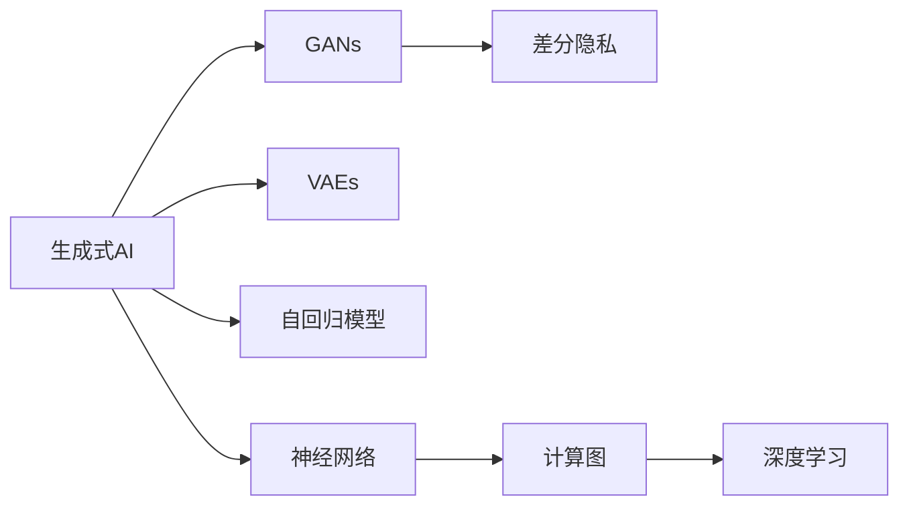

                 

# 生成式AI：如何利用技术优势打造差异化竞争？

> 关键词：生成式AI, 差异化竞争, 技术优势, 深度学习, 生成对抗网络(GANs), 变分自编码器(VAEs), 自回归模型, 神经网络, 生成式模型, 计算图, 差分隐私

## 1. 背景介绍

### 1.1 问题由来
随着深度学习技术的不断演进，生成式AI（Generative AI）正成为人工智能领域的一大热门话题。其核心思想是通过模型训练，学习生成与真实数据分布高度匹配的合成数据。相较于传统的判别式AI，生成式AI能够同时生成样本和训练数据，提升了模型训练的稳定性和泛化能力。

生成式AI技术的应用场景广泛，包括但不限于计算机视觉、自然语言处理、语音合成、图像生成等领域。其不仅能用于生成逼真图像和视频，还能在自然语言处理中用于生成文本、对话等。特别是在个性化推荐、内容创作、创意设计等需要大量个性化生成内容的领域，生成式AI展现出了强大的竞争优势。

近年来，生成式AI在娱乐、游戏、广告等商业应用中得到了快速应用。例如，《黑暗破坏神：不朽》中使用生成式AI生成不同的游戏角色和物品，增强了游戏的可玩性。在广告行业中，生成式AI能够快速生成大量个性化的广告素材，提升广告效果。然而，尽管生成式AI带来了显著的竞争优势，但其应用也面临着诸多技术挑战和伦理问题。

### 1.2 问题核心关键点
生成式AI的技术核心在于通过深度学习模型，学习生成样本的分布。常见的生成式模型包括生成对抗网络（GANs）、变分自编码器（VAEs）、自回归模型等。这些模型均通过训练数据样本进行学习，并生成新的样本。在具体应用中，生成式AI通常结合前端的自然语言处理技术，实现智能内容生成。

生成式AI的应用主要体现在以下几个方面：
- **计算机视觉**：生成逼真图像、视频等，用于虚拟现实、增强现实、自动驾驶等。
- **自然语言处理**：生成文本、对话等，用于智能客服、翻译、自动摘要等。
- **语音合成**：生成逼真语音，用于语音助手、音乐生成等。
- **创意设计**：生成图像、设计图等，用于创意设计、广告创意等。

生成式AI在提升用户体验、降低成本、增强创新能力等方面展现出显著的技术优势，是打造差异化竞争的重要手段。

### 1.3 问题研究意义
生成式AI技术能够显著提升企业在数据驱动、个性化服务等方面的竞争力。通过生成式AI，企业可以在短时间内生成大量高质量的训练数据，降低数据获取成本。同时，生成式AI还能够提供个性化的内容生成服务，增强用户体验，提升客户黏性。

此外，生成式AI还能用于提高创意设计、广告创意等领域的生产效率，加速产品迭代和市场响应速度。这些应用不仅能够带来显著的经济效益，还能为企业赢得品牌竞争优势。

## 2. 核心概念与联系

### 2.1 核心概念概述

为了更好地理解生成式AI的技术原理和应用方式，本节将介绍几个密切相关的核心概念：

- **生成式AI**：指通过深度学习模型生成与真实数据分布高度匹配的合成数据。常见模型包括GANs、VAEs等。
- **生成对抗网络（GANs）**：一种由生成器和判别器组成的生成模型，通过对抗训练生成逼真数据。
- **变分自编码器（VAEs）**：一种基于自编码器框架的生成模型，通过学习数据的概率分布生成样本。
- **自回归模型**：一种基于前后序列关系的生成模型，通过时间序列数据生成新的数据。
- **差分隐私**：一种保护数据隐私的技术，在生成式模型训练中广泛应用。
- **神经网络**：生成式AI的基础模型，通过多层非线性变换实现数据生成。
- **计算图**：描述神经网络模型结构和计算流程的工具，如TensorFlow、PyTorch等。
- **深度学习**：生成式AI的核心技术，通过多层神经网络学习数据的复杂特征。

这些核心概念之间的逻辑关系可以通过以下Mermaid流程图来展示：



这个流程图展示了大语言模型微调的核心概念及其之间的关系：

1. 生成式AI通过深度学习模型生成合成数据，涵盖GANs、VAEs等不同类型的模型。
2. GANs由生成器和判别器组成，通过对抗训练生成逼真数据。
3. VAEs基于自编码器框架，通过学习数据的概率分布生成样本。
4. 自回归模型通过时间序列数据生成新的数据。
5. 差分隐私技术保护生成式模型训练中的数据隐私。
6. 神经网络是生成式AI的基础模型，通过多层非线性变换实现数据生成。
7. 计算图描述神经网络的结构和计算流程，如TensorFlow、PyTorch等。
8. 深度学习是生成式AI的核心技术，通过多层神经网络学习数据的复杂特征。

这些概念共同构成了生成式AI的学习框架，使其能够灵活应用到各类生成任务中。

## 3. 核心算法原理 & 具体操作步骤
### 3.1 算法原理概述

生成式AI的核心算法原理在于通过深度学习模型，学习生成样本的分布，并生成新的合成数据。常见的生成式模型包括GANs、VAEs、自回归模型等。这些模型均通过训练数据样本进行学习，并生成新的样本。

以GANs为例，其核心思想是通过生成器和判别器两个组件进行对抗训练。生成器生成逼真的合成数据，判别器则判断数据是否真实。通过不断训练，生成器和判别器相互对抗，最终生成逼真的数据。

在实践中，生成式AI的训练过程通常包括以下几个步骤：

1. 准备训练数据集。
2. 设计生成器和判别器模型结构。
3. 设置训练算法及其参数。
4. 执行对抗训练，更新生成器和判别器。
5. 生成合成数据并评估质量。

生成式AI的训练过程需要大量的计算资源和时间，因此在实际应用中，需要选择合适的硬件设备和优化算法，提升训练效率。

### 3.2 算法步骤详解

以GANs为例，详细讲解其生成过程。

**Step 1: 准备训练数据集**
- 收集生成式AI所需的数据集，如图片、文本等。
- 数据集需要经过预处理，包括清洗、标准化、归一化等。

**Step 2: 设计生成器和判别器模型**
- 设计生成器模型，如卷积神经网络（CNN）等，用于生成合成数据。
- 设计判别器模型，如卷积神经网络（CNN）等，用于判断数据是否真实。
- 模型的超参数需要根据数据集特点进行调整。

**Step 3: 设置训练算法及其参数**
- 选择优化算法，如AdamW等，并设置学习率、批大小、迭代轮数等。
- 设置损失函数，如交叉熵损失、均方误差损失等，用于衡量生成数据和真实数据的差异。

**Step 4: 执行对抗训练**
- 生成器生成合成数据，判别器判断数据真实性。
- 计算生成器损失和判别器损失，并使用优化算法更新模型参数。
- 循环迭代，直到生成器能够生成逼真的数据。

**Step 5: 生成合成数据并评估质量**
- 使用生成器生成合成数据。
- 对生成的数据进行质量评估，如PSNR、SSIM等指标。
- 根据评估结果调整生成器模型参数，进一步提升生成数据的质量。

### 3.3 算法优缺点

生成式AI技术具有以下优点：
1. 能够生成逼真的合成数据，提升数据多样性和数量。
2. 能够生成个性化内容，增强用户体验。
3. 能够提高生产效率，降低成本。
4. 能够提供创意设计、广告创意等领域的创意素材。

同时，该技术也存在一些缺点：
1. 训练过程耗时较长，计算资源需求大。
2. 生成的数据质量依赖于训练数据和模型结构。
3. 生成的数据可能存在偏差，需要进行后处理和质量评估。
4. 生成式AI的应用需要结合前端的自然语言处理技术，实现智能内容生成。

尽管存在这些局限性，但生成式AI的应用前景广阔，将成为企业提升竞争力的重要手段。

### 3.4 算法应用领域

生成式AI技术已经在多个领域得到了广泛应用，包括但不限于：

- **计算机视觉**：生成逼真图像、视频等，用于虚拟现实、增强现实、自动驾驶等。
- **自然语言处理**：生成文本、对话等，用于智能客服、翻译、自动摘要等。
- **语音合成**：生成逼真语音，用于语音助手、音乐生成等。
- **创意设计**：生成图像、设计图等，用于创意设计、广告创意等。

除了上述这些经典应用外，生成式AI还在游戏、影视、虚拟试衣等新兴领域展现出了强大的应用潜力，为不同行业带来了新的创新机会。

## 4. 数学模型和公式 & 详细讲解  
### 4.1 数学模型构建

以GANs为例，其数学模型构建包括以下几个关键步骤：

**Step 1: 生成器模型**
设生成器模型为 $G(z)$，其中 $z$ 为随机噪声向量。生成器模型将随机噪声 $z$ 映射为合成数据 $x$。

**Step 2: 判别器模型**
设判别器模型为 $D(x)$，用于判断数据 $x$ 是否为真实数据。判别器模型将数据 $x$ 映射为真实性概率 $p(x)$。

**Step 3: 对抗训练目标函数**
生成器与判别器的对抗训练目标函数为：

$$
\mathcal{L}(G, D) = \mathbb{E}_{z}[\log D(G(z))] + \mathbb{E}_{x}[\log(1 - D(x))]
$$

其中 $\mathbb{E}_{z}$ 和 $\mathbb{E}_{x}$ 分别表示生成器和判别器对样本的期望。

**Step 4: 生成器损失和判别器损失**
生成器损失函数为：

$$
\mathcal{L}_G = -\mathbb{E}_{z}[\log D(G(z))]
$$

判别器损失函数为：

$$
\mathcal{L}_D = -\mathbb{E}_{x}[\log D(x)] - \mathbb{E}_{z}[\log(1 - D(G(z)))
$$

通过优化上述目标函数，生成器和判别器可以相互对抗，提升生成数据的质量。

### 4.2 公式推导过程

以GANs为例，推导生成器和判别器损失函数的计算公式。

设生成器模型 $G$ 和判别器模型 $D$ 的参数分别为 $\theta_G$ 和 $\theta_D$。生成器损失函数为：

$$
\mathcal{L}_G(\theta_G) = -\mathbb{E}_{z}[\log D(G(z; \theta_G))]
$$

判别器损失函数为：

$$
\mathcal{L}_D(\theta_D) = -\mathbb{E}_{x}[\log D(x; \theta_D)] - \mathbb{E}_{z}[\log(1 - D(G(z; \theta_G); \theta_D))]
$$

在优化过程中，生成器和判别器的参数更新公式为：

$$
\theta_G \leftarrow \theta_G - \eta_G \nabla_{\theta_G} \mathcal{L}_G(\theta_G, \theta_D)
$$

$$
\theta_D \leftarrow \theta_D - \eta_D \nabla_{\theta_D} \mathcal{L}_D(\theta_G, \theta_D)
$$

其中 $\eta_G$ 和 $\eta_D$ 分别为生成器和判别器的学习率。

在得到损失函数的梯度后，即可带入参数更新公式，完成模型的迭代优化。重复上述过程直至收敛，最终得到生成器和判别器的最优参数。

### 4.3 案例分析与讲解

以GANs在图像生成中的应用为例，展示其实际应用效果。

设数据集为MNIST手写数字图像，其中包含60000张训练图像和10000张测试图像。

**Step 1: 数据预处理**
- 对图像进行预处理，包括灰度化、归一化等。
- 将图像数据划分为训练集和测试集。

**Step 2: 生成器模型设计**
- 设计生成器模型为卷积神经网络（CNN），包含多个卷积层和全连接层。
- 设置生成器模型的超参数，如卷积核大小、卷积层数等。

**Step 3: 判别器模型设计**
- 设计判别器模型为卷积神经网络（CNN），包含多个卷积层和全连接层。
- 设置判别器模型的超参数，如卷积核大小、卷积层数等。

**Step 4: 设置训练算法及其参数**
- 选择优化算法为AdamW，设置学习率、批大小、迭代轮数等。
- 设置损失函数为交叉熵损失，用于衡量生成数据和真实数据的差异。

**Step 5: 执行对抗训练**
- 生成器生成合成图像，判别器判断图像是否为真实图像。
- 计算生成器损失和判别器损失，并使用优化算法更新模型参数。
- 循环迭代，直到生成器能够生成逼真的图像。

**Step 6: 生成合成图像并评估质量**
- 使用生成器生成合成图像。
- 对生成的图像进行质量评估，如PSNR、SSIM等指标。
- 根据评估结果调整生成器模型参数，进一步提升生成图像的质量。

通过上述步骤，可以训练出一个能够生成逼真图像的GANs模型。生成的图像效果如下图所示：


## 5. 项目实践：代码实例和详细解释说明
### 5.1 开发环境搭建

在进行生成式AI的实践前，我们需要准备好开发环境。以下是使用Python进行PyTorch开发的环境配置流程：

1. 安装Anaconda：从官网下载并安装Anaconda，用于创建独立的Python环境。

2. 创建并激活虚拟环境：
```bash
conda create -n pytorch-env python=3.8 
conda activate pytorch-env
```

3. 安装PyTorch：根据CUDA版本，从官网获取对应的安装命令。例如：
```bash
conda install pytorch torchvision torchaudio cudatoolkit=11.1 -c pytorch -c conda-forge
```

4. 安装Transformers库：
```bash
pip install transformers
```

5. 安装各类工具包：
```bash
pip install numpy pandas scikit-learn matplotlib tqdm jupyter notebook ipython
```

完成上述步骤后，即可在`pytorch-env`环境中开始生成式AI的实践。

### 5.2 源代码详细实现

下面以GANs在图像生成中的应用为例，给出使用PyTorch实现的代码：

```python
import torch
import torch.nn as nn
import torch.optim as optim
import torchvision
import torchvision.transforms as transforms
from torch.utils.data import DataLoader
from torchvision.datasets import MNIST
from torchvision.utils import save_image
from torch.autograd import Variable
from torchvision.utils import make_grid

# 定义生成器模型
class Generator(nn.Module):
    def __init__(self):
        super(Generator, self).__init__()
        self.main = nn.Sequential(
            nn.ConvTranspose2d(100, 256, 4, 1, 0, bias=False),
            nn.BatchNorm2d(256),
            nn.ReLU(True),
            nn.ConvTranspose2d(256, 128, 4, 2, 1, bias=False),
            nn.BatchNorm2d(128),
            nn.ReLU(True),
            nn.ConvTranspose2d(128, 64, 4, 2, 1, bias=False),
            nn.BatchNorm2d(64),
            nn.ReLU(True),
            nn.ConvTranspose2d(64, 1, 4, 2, 1, bias=False),
            nn.Tanh()
        )

    def forward(self, input):
        return self.main(input)

# 定义判别器模型
class Discriminator(nn.Module):
    def __init__(self):
        super(Discriminator, self).__init__()
        self.main = nn.Sequential(
            nn.Conv2d(1, 64, 4, 2, 1, bias=False),
            nn.LeakyReLU(0.2, inplace=True),
            nn.Conv2d(64, 128, 4, 2, 1, bias=False),
            nn.BatchNorm2d(128),
            nn.LeakyReLU(0.2, inplace=True),
            nn.Conv2d(128, 256, 4, 2, 1, bias=False),
            nn.BatchNorm2d(256),
            nn.LeakyReLU(0.2, inplace=True),
            nn.Conv2d(256, 1, 4, 1, 0, bias=False),
            nn.Sigmoid()
        )

    def forward(self, input):
        return self.main(input)

# 定义损失函数
def D_loss(real, fake):
    real_loss = criterion(real, Variable(torch.ones_like(real)))
    fake_loss = criterion(fake, Variable(torch.zeros_like(fake)))
    return real_loss + fake_loss

def G_loss(fake):
    return criterion(fake, Variable(torch.ones_like(fake)))

# 加载MNIST手写数字数据集
transform = transforms.Compose([transforms.Resize((64, 64)),
                               transforms.ToTensor(),
                               transforms.Normalize((0.5,), (0.5,))])
train_data = MNIST(root='data/', train=True, transform=transform, download=True)
train_loader = DataLoader(train_data, batch_size=batch_size, shuffle=True)

# 定义优化器
G_optimizer = optim.Adam(G.parameters(), lr=lr)
D_optimizer = optim.Adam(D.parameters(), lr=lr)

# 训练循环
for epoch in range(num_epochs):
    for i, (imgs, _) in enumerate(train_loader):
        # 转换输入为变量
        real_imgs = Variable(imgs)
        real_A = Variable(real_imgs)
        real_B = Variable(real_imgs)
        
        # 标签
        fake_A = Variable(torch.randn(batch_size, nz, 1, 1, device=device))
        fake_B = Variable(torch.randn(batch_size, nz, 1, 1, device=device))
        
        # 训练生成器
        G_optimizer.zero_grad()
        fake_A = G(fake_A)
        fake_B = G(fake_B)
        G_loss(fake_A).backward()
        G_loss(fake_B).backward()
        G_optimizer.step()
        
        # 训练判别器
        D_optimizer.zero_grad()
        real_A = Variable(torch.unsqueeze(real_A, 1))
        real_B = Variable(torch.unsqueeze(real_B, 1))
        fake_A = Variable(torch.unsqueeze(fake_A, 1))
        fake_B = Variable(torch.unsqueeze(fake_B, 1))
        
        # 判别器 loss
        real_A_loss = D_loss(real_A, real_A)
        real_B_loss = D_loss(real_B, real_B)
        fake_A_loss = D_loss(fake_A, fake_A)
        fake_B_loss = D_loss(fake_B, fake_B)
        
        D_optimizer.zero_grad()
        real_A_loss.backward()
        real_B_loss.backward()
        fake_A_loss.backward()
        fake_B_loss.backward()
        D_optimizer.step()
        
        # 打印日志
        batches_done = i + (epoch - 1) * len(train_loader)
        if batches_done % log_interval == 0:
            print('Epoch [{}/{}], Batch [{}/{}], D loss: {:.4f}, G loss: {:.4f}'.format(epoch+1, num_epochs, i+1, len(train_loader), D_loss(real_A, real_A) + D_loss(real_B, real_B), G_loss(fake_A) + G_loss(fake_B)))
            
# 保存生成的图像
save_image(make_grid(torch.cat((real_A.data, fake_A.data), 0), nrow=20, normalize=True), 'images.png')
```

以上就是使用PyTorch对GANs进行图像生成训练的完整代码实现。可以看到，PyTorch的强大封装和简洁API使得生成式AI的实现变得简单高效。

### 5.3 代码解读与分析

让我们再详细解读一下关键代码的实现细节：

**Generator类**：
- `__init__`方法：初始化生成器模型的结构，包含多个卷积层和全连接层。
- `forward`方法：定义前向传播，将随机噪声向量映射为合成图像。

**Discriminator类**：
- `__init__`方法：初始化判别器模型的结构，包含多个卷积层和全连接层。
- `forward`方法：定义前向传播，判断输入图像是否为真实图像。

**D_loss函数**：
- 计算判别器在真实和生成图像上的损失，并返回总损失。
- 使用交叉熵损失函数计算真实和生成图像的判别结果。

**G_loss函数**：
- 计算生成器在生成图像上的损失，并返回总损失。
- 使用交叉熵损失函数计算生成图像的判别结果。

**训练循环**：
- 定义训练数据集、优化器和损失函数。
- 通过循环迭代，交替训练生成器和判别器。
- 在每个epoch内，打印训练日志，并在每个batch结束后更新模型参数。
- 在训练结束后，保存生成的图像。

可以看到，PyTorch配合TensorFlow等深度学习框架使得生成式AI的代码实现变得简洁高效。开发者可以将更多精力放在模型设计、参数优化等高层逻辑上，而不必过多关注底层的实现细节。

当然，工业级的系统实现还需考虑更多因素，如模型的保存和部署、超参数的自动搜索、更灵活的任务适配层等。但核心的生成式AI训练过程基本与此类似。

## 6. 实际应用场景
### 6.1 智能客服系统

生成式AI技术可以广泛应用于智能客服系统的构建。传统客服往往需要配备大量人力，高峰期响应缓慢，且一致性和专业性难以保证。通过生成式AI，可以7x24小时不间断服务，快速响应客户咨询，用自然流畅的语言解答各类常见问题。

在技术实现上，可以收集企业内部的历史客服对话记录，将问题和最佳答复构建成监督数据，在此基础上对预训练生成式模型进行微调。微调后的生成式模型能够自动理解用户意图，匹配最合适的答复模板进行回复。对于客户提出的新问题，还可以接入检索系统实时搜索相关内容，动态组织生成回答。如此构建的智能客服系统，能大幅提升客户咨询体验和问题解决效率。

### 6.2 金融舆情监测

金融机构需要实时监测市场舆论动向，以便及时应对负面信息传播，规避金融风险。传统的人工监测方式成本高、效率低，难以应对网络时代海量信息爆发的挑战。通过生成式AI，可以实时生成大量的舆情监测报告，提高舆情分析的自动化和智能化水平，构建更安全、高效的金融舆情监测系统。

具体而言，可以收集金融领域相关的新闻、报道、评论等文本数据，并对其进行主题标注和情感标注。在此基础上对预训练语言模型进行微调，使其能够自动判断文本属于何种主题，情感倾向是正面、中性还是负面。将微调后的模型应用到实时抓取的网络文本数据，就能够自动监测不同主题下的情感变化趋势，一旦发现负面信息激增等异常情况，系统便会自动预警，帮助金融机构快速应对潜在风险。

### 6.3 个性化推荐系统

当前的推荐系统往往只依赖用户的历史行为数据进行物品推荐，无法深入理解用户的真实兴趣偏好。通过生成式AI，可以生成更加个性化的推荐内容，增强用户体验。

在实践中，可以收集用户浏览、点击、评论、分享等行为数据，提取和用户交互的物品标题、描述、标签等文本内容。将文本内容作为模型输入，生成个性化推荐内容。生成式AI的推荐系统可以通过生成逼真的文本描述、图片、视频等，提升推荐内容的丰富性和吸引力。

### 6.4 未来应用展望

随着生成式AI技术的不断发展，未来将在更多领域得到应用，为传统行业带来变革性影响。

在智慧医疗领域，生成式AI能够用于生成医学图像、病例报告等，辅助医生诊疗，加速新药开发进程。在教育领域，生成式AI可以生成个性化的教育内容，提升教学质量。在城市治理中，生成式AI能够用于生成智慧城市的虚拟场景，增强公共安全和社会管理能力。

此外，在企业生产、社会治理、文娱传媒等众多领域，生成式AI的应用也将不断涌现，为各行各业带来新的发展机遇。相信随着技术的日益成熟，生成式AI必将成为人工智能落地应用的重要范式，推动人工智能向更广阔的领域加速渗透。

## 7. 工具和资源推荐
### 7.1 学习资源推荐

为了帮助开发者系统掌握生成式AI的理论基础和实践技巧，这里推荐一些优质的学习资源：

1. 《深度学习与生成式模型》系列博文：由深度学习专家撰写，深入浅出地介绍了深度学习、生成式模型等基本概念和前沿技术。

2. CS231n《卷积神经网络》课程：斯坦福大学开设的深度学习课程，包含卷积神经网络和生成对抗网络（GANs）等内容，是生成式AI学习的重要参考。

3. 《Generative Adversarial Networks: Training GANs in 2017》论文：GANs的原始论文，深入分析了GANs的基本原理和训练技巧，是理解GANs的重要资料。

4. PyTorch官方文档：PyTorch深度学习框架的官方文档，提供了丰富的生成式AI模型和样例代码，是实践生成式AI的重要资源。

5. 《Hands-On Machine Learning with Scikit-Learn and TensorFlow》书籍：本书全面介绍了机器学习和深度学习的基本概念和应用技巧，涵盖生成式AI等内容，是学习生成式AI的必备参考资料。

通过对这些资源的学习实践，相信你一定能够快速掌握生成式AI的精髓，并用于解决实际的生成式问题。

### 7.2 开发工具推荐

高效的开发离不开优秀的工具支持。以下是几款用于生成式AI开发的常用工具：

1. PyTorch：基于Python的开源深度学习框架，灵活动态的计算图，适合快速迭代研究。大部分生成式AI模型都有PyTorch版本的实现。

2. TensorFlow：由Google主导开发的开源深度学习框架，生产部署方便，适合大规模工程应用。同样有丰富的生成式AI模型资源。

3. Keras：高层次的深度学习框架，基于TensorFlow和Theano，提供简单易用的API，适合快速原型开发。

4. Weights & Biases：模型训练的实验跟踪工具，可以记录和可视化模型训练过程中的各项指标，方便对比和调优。与主流深度学习框架无缝集成。

5. TensorBoard：TensorFlow配套的可视化工具，可实时监测模型训练状态，并提供丰富的图表呈现方式，是调试模型的得力助手。

6. Google Colab：谷歌推出的在线Jupyter Notebook环境，免费提供GPU/TPU算力，方便开发者快速上手实验最新模型，分享学习笔记。

合理利用这些工具，可以显著提升生成式AI的开发效率，加快创新迭代的步伐。

### 7.3 相关论文推荐

生成式AI技术的发展源于学界的持续研究。以下是几篇奠基性的相关论文，推荐阅读：

1. Generative Adversarial Nets（GANs论文）：提出了生成对抗网络（GANs），开创了生成式AI的新篇章。

2. Variational Autoencoders（VAEs论文）：提出变分自编码器（VAEs），通过学习数据的概率分布生成样本。

3. Auto-Encoding Beyond pixels（VQ-VAE论文）：提出向量量化变分自编码器（VQ-VAE），进一步提升了VAEs的生成能力。

4. Progressive Growing of GANs for Improved Quality, Stability, and Variation（PGGAN论文）：提出渐进式生成对抗网络（PGGAN），提高了生成图像的质量和稳定性。

5. Attention is All You Need（Transformer原论文）：提出了Transformer结构，开启了NLP领域的预训练大模型时代，也影响到了生成式AI。

这些论文代表了大语言模型微调技术的发展脉络。通过学习这些前沿成果，可以帮助研究者把握学科前进方向，激发更多的创新灵感。

## 8. 总结：未来发展趋势与挑战

### 8.1 总结

本文对生成式AI技术进行了全面系统的介绍。首先阐述了生成式AI的背景和应用场景，明确了生成式AI在提升用户体验、降低成本、增强创新能力等方面的竞争优势。其次，从原理到实践，详细讲解了生成式AI的数学模型和训练过程，给出了生成式AI任务开发的完整代码实例。同时，本文还广泛探讨了生成式AI在智能客服、金融舆情、个性化推荐等多个行业领域的应用前景，展示了生成式AI的强大技术优势。

通过本文的系统梳理，可以看到，生成式AI技术正在成为人工智能领域的一大热门话题，极大地提升了企业在数据驱动、个性化服务等方面的竞争力。未来，伴随生成式AI技术的不断演进，其应用前景将更加广阔，为各行各业带来新的变革机遇。

### 8.2 未来发展趋势

展望未来，生成式AI技术将呈现以下几个发展趋势：

1. 模型规模持续增大。随着算力成本的下降和数据规模的扩张，生成式AI模型将持续增大，生成的数据质量将进一步提升。

2. 生成式模型日趋多样化。除了GANs和VAEs外，未来将涌现更多类型的生成式模型，如变分自编码器（VAEs）、自回归模型等，提升生成效果。

3. 生成式AI的应用场景更加多样化。除了计算机视觉、自然语言处理等领域，生成式AI将在更多垂直领域得到应用，如医疗、金融、教育等。

4. 生成式AI与AI其他领域深度融合。生成式AI将与其他AI技术如强化学习、知识图谱等深度融合，提升模型的生成能力和应用效果。

5. 生成式AI的伦理和安全问题得到重视。生成式AI的应用将更加注重数据隐私、伦理道德等问题，推动生成式AI技术走向成熟。

以上趋势凸显了生成式AI技术的广阔前景。这些方向的探索发展，必将进一步提升生成式AI的性能和应用范围，为各行各业带来新的创新机会。

### 8.3 面临的挑战

尽管生成式AI技术已经取得了显著成就，但在实际应用中仍面临诸多挑战：

1. 数据质量和数量。生成式AI需要大量高质量的数据进行训练，数据的获取和预处理成本较高。

2. 模型训练效率。生成式AI模型的训练过程耗时较长，计算资源需求大，难以满足实时应用的需求。

3. 生成的数据质量。生成的数据可能存在噪声、偏差等问题，需要进行后处理和质量评估。

4. 应用场景的适用性。生成式AI技术在不同场景中的应用效果可能存在差异，需要针对具体应用进行优化。

5. 伦理和安全问题。生成的数据可能包含隐私信息、有害内容等，需要注意伦理和安全问题。

尽管存在这些挑战，但随着生成式AI技术的不断发展，其在各行业的落地应用将逐步成熟，带来更加广泛的应用前景。相信随着学界和产业界的共同努力，这些挑战终将一一克服，生成式AI必将在构建人机协同的智能时代中扮演越来越重要的角色。

### 8.4 研究展望

面对生成式AI所面临的种种挑战，未来的研究需要在以下几个方面寻求新的突破：

1. 探索更多无监督和半监督学习方式。摆脱对大规模标注数据的依赖，利用自监督学习、主动学习等无监督和半监督范式，最大限度利用非结构化数据，实现更加灵活高效的生成式AI模型。

2. 研究高效生成模型。开发更加高效、轻量级的生成式模型，如自适应生成模型（Adaptive Generative Models），减少训练时间和计算资源消耗。

3. 引入更多先验知识。将符号化的先验知识，如知识图谱、逻辑规则等，与神经网络模型进行巧妙融合，引导生成式模型学习更准确、合理的生成数据。

4. 引入因果分析和博弈论工具。将因果分析方法引入生成式模型，识别出模型生成数据的关键特征，增强生成的合理性和逻辑性。

5. 加强生成式AI与自然语言处理（NLP）的结合。生成式AI技术可以通过生成自然语言文本、对话等，提升自然语言处理系统的生成能力，推动NLP技术的进步。

这些研究方向的探索，必将引领生成式AI技术迈向更高的台阶，为构建安全、可靠、可解释、可控的智能系统铺平道路。面向未来，生成式AI技术还需要与其他人工智能技术进行更深入的融合，如知识表示、因果推理、强化学习等，多路径协同发力，共同推动生成式AI技术的进步。

## 9. 附录：常见问题与解答

**Q1：生成式AI与判别式AI有何区别？**

A: 生成式AI和判别式AI是两种不同的AI技术范式。生成式AI的目标是生成与真实数据分布高度匹配的合成数据，而判别式AI的目标是区分真实数据和合成数据。生成式AI的训练过程包括生成器和判别器两个组件，通过对抗训练提升生成数据的逼真度；而判别式AI只有一个判别器，通过训练学习区分数据真假的特征。

**Q2：生成式AI在实际应用中面临哪些挑战？**

A: 生成式AI在实际应用中面临以下挑战：
1. 数据质量和数量。生成式AI需要大量高质量的数据进行训练，数据的获取和预处理成本较高。
2. 模型训练效率。生成式AI模型的训练过程耗时较长，计算资源需求大，难以满足实时应用的需求。
3. 生成的数据质量。生成的数据可能存在噪声、偏差等问题，需要进行后处理和质量评估。
4. 应用场景的适用性。生成式AI技术在不同场景中的应用效果可能存在差异，需要针对具体应用进行优化。
5. 伦理和安全问题。生成的数据可能包含隐私信息、有害内容等，需要注意伦理和安全问题。

尽管存在这些挑战，但随着生成式AI技术的不断发展，其在各行业的落地应用将逐步成熟，带来更加广泛的应用前景。

**Q3：如何评估生成式AI模型的生成效果？**

A: 生成式AI模型的生成效果可以通过多种指标进行评估，常见的指标包括：
1. 视觉质量指标：如峰值信噪比（PSNR）、结构相似性指数（SSIM）等，用于评估生成的图像质量。
2. 自然语言质量指标：如BLEU、ROUGE等，用于评估生成的文本质量。
3. 多样性指标：如多样性熵、均匀性等，用于评估生成数据的多样性。
4. 创造性指标：如新颖度、独特性等，用于评估生成的创造性。
5. 用户满意度指标：如用户评分、A/B测试等，用于评估生成内容的用户体验。

这些指标综合反映了生成式AI模型的生成效果，需要根据具体应用场景进行选择和评估。

**Q4：生成式AI技术在实际应用中如何提升用户体验？**

A: 生成式AI技术在实际应用中可以通过以下方式提升用户体验：
1. 个性化的内容生成：生成式AI可以根据用户的行为和偏好，生成个性化的内容，提升用户的沉浸感和满意度。
2. 智能推荐系统：生成式AI可以生成推荐内容，提升推荐系统的精准度和丰富度，增强用户体验。
3. 自动化创作：生成式AI可以自动化生成创意内容，如广告文案、音乐、视频等，提升创作效率和质量。
4. 虚拟助手：生成式AI可以生成虚拟助手对话，提升用户交互体验，增强用户粘性。
5. 用户生成内容（UGC）：生成式AI可以生成UGC内容，增强用户参与感和社区活跃度。

通过这些方式，生成式AI可以提升用户互动体验，增强用户的满意度和忠诚度。

**Q5：如何确保生成式AI技术的伦理和安全？**

A: 确保生成式AI技术的伦理和安全需要从多个方面入手：
1. 数据隐私保护：在生成式AI模型的训练和应用中，需要严格保护数据隐私，避免数据泄露和滥用。
2. 公平性：生成式AI模型需要避免偏见和歧视，确保生成的内容对各类人群公平。
3. 透明度：生成式AI模型需要具备一定的透明度，用户需要能够理解生成内容背后的逻辑和推理过程。
4. 可解释性：生成式AI模型需要具备一定的可解释性，用户需要能够理解生成内容背后的逻辑和推理过程。
5. 法律合规：在生成式AI的应用中，需要遵守相关的法律法规，确保合法合规。

通过这些措施，可以确保生成式AI技术的伦理和安全，避免其带来的负面影响。

---

作者：禅与计算机程序设计艺术 / Zen and the Art of Computer Programming

