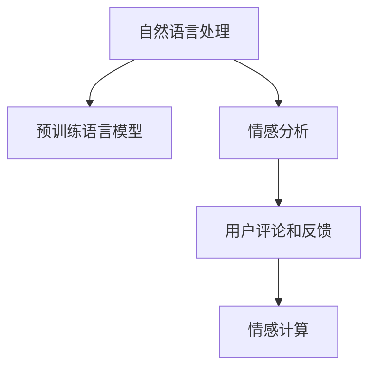

                 

## 1. 背景介绍

### 1.1 问题由来

随着互联网和社交媒体的迅速发展，用户产生的数据量呈指数级增长。用户情感分析(User Sentiment Analysis, USA)作为自然语言处理(Natural Language Processing, NLP)的一个重要分支，旨在自动化分析用户评论、评价、反馈等文本数据，挖掘出用户对某一产品、服务或事件的真实情感倾向。该技术不仅能够帮助企业及时了解市场反馈，还能指导产品改进和品牌管理，因此受到了广泛关注。

传统的情感分析方法通常依赖于规则、词典或机器学习模型，难以捕捉复杂情境下的情感变化。近年来，人工智能(AI)技术在情感分析领域取得了显著进步，尤其是在大规模预训练语言模型和大规模数据集的基础上，基于深度学习的方法已成为主流。

### 1.2 问题核心关键点

情感分析的核心在于将自然语言文本映射为情感标签，常见的情感标签有正面、负面、中性等。由于文本数据的高度非结构化特性，情感分析面临着许多挑战：

1. **数据标注成本高**：情感分析需要大量标注数据作为训练集，但标注成本昂贵且耗时。
2. **情感表达多样性**：不同语言和文化背景下，情感表达方式可能完全不同，情感分析模型需要具备跨领域和跨文化的泛化能力。
3. **情感模糊性**：许多情感表达既包含正面因素也包含负面因素，例如“不好不坏”的中性表达，情感分析模型需要具备处理模糊情感的能力。
4. **上下文依赖**：情感分析需要考虑语境、语气、背景信息等多种因素，单靠文本本身难以准确判断情感。

为应对这些挑战，基于深度学习的情感分析模型，特别是预训练语言模型，通过大规模无标签数据的自监督学习，学习到了丰富的语言知识和语义表示。本文将详细探讨如何利用这些预训练模型进行情感分析，以及如何进一步改进服务质量。

## 2. 核心概念与联系

### 2.1 核心概念概述

本节将介绍几个密切相关的核心概念，以帮助我们理解情感分析的基础原理：

1. **自然语言处理(NLP)**：研究如何让计算机理解和处理人类语言的技术。NLP是人工智能的一个重要分支，涉及文本预处理、语义分析、情感分析等多个领域。

2. **预训练语言模型(Pre-trained Language Models, PLMs)**：如BERT、GPT等，通过在大规模无标签文本上自监督学习，学习到丰富的语言知识和语义表示。这些模型可以作为情感分析任务的特征提取器，提高情感分析的准确性。

3. **情感分析(Sentiment Analysis)**：通过文本分析，自动识别用户对某一产品、服务或事件的真实情感倾向。常见的情感分析任务包括情感分类、情感强度评估、情感极性分析等。

4. **用户评论和反馈(User Reviews and Feedback)**：用户在购买、使用产品或服务后，通过评论、评分、投诉等形式表达对产品或服务的情感态度。情感分析可以帮助企业快速响应用户反馈，提升用户体验和产品满意度。

5. **情感计算(EA)**：涉及计算社会科学、人工智能等多个领域，旨在通过计算技术和算法，理解和分析人类的情感和行为。情感计算是情感分析技术的一个重要应用方向。

这些概念之间的逻辑关系可以通过以下Mermaid流程图来展示：



这个流程图展示了大语言模型在情感分析中的核心作用：

1. 自然语言处理是情感分析的基础技术。
2. 预训练语言模型为情感分析提供高质量的特征提取。
3. 情感分析通过文本分析，自动识别用户情感。
4. 用户评论和反馈是情感分析的主要数据来源。
5. 情感计算通过计算技术和算法，进一步理解和应用情感分析结果。

## 3. 核心算法原理 & 具体操作步骤

### 3.1 算法原理概述

基于深度学习的情感分析模型，通常通过在大规模无标签文本上进行预训练，学习到丰富的语言知识和语义表示。这些模型可以作为情感分析任务的特征提取器，通过在标注数据上微调，学习特定任务的情感分类能力。

形式化地，假设预训练模型为 $M_{\theta}$，其中 $\theta$ 为预训练得到的模型参数。给定情感分析任务的标注数据集 $D=\{(x_i, y_i)\}_{i=1}^N$，其中 $x_i$ 为输入文本，$y_i$ 为情感标签（如正面、负面、中性），情感分析的目标是找到新的模型参数 $\hat{\theta}$，使得：

$$
\hat{\theta}=\mathop{\arg\min}_{\theta} \mathcal{L}(M_{\theta},D)
$$

其中 $\mathcal{L}$ 为针对情感分类任务设计的损失函数，用于衡量模型预测输出与真实标签之间的差异。常见的损失函数包括交叉熵损失、均方误差损失等。

通过梯度下降等优化算法，情感分析过程不断更新模型参数 $\theta$，最小化损失函数 $\mathcal{L}$，使得模型输出逼近真实标签。由于 $\theta$ 已经通过预训练获得了较好的初始化，因此即便在少量标注数据上微调，也能较快收敛到理想的模型参数 $\hat{\theta}$。

### 3.2 算法步骤详解

基于深度学习的情感分析模型通常包括以下几个关键步骤：

**Step 1: 准备预训练模型和数据集**
- 选择合适的预训练语言模型 $M_{\theta}$ 作为初始化参数，如 BERT、GPT 等。
- 准备情感分析任务的标注数据集 $D$，划分为训练集、验证集和测试集。一般要求标注数据与预训练数据的分布不要差异过大。

**Step 2: 添加任务适配层**
- 根据任务类型，在预训练模型顶层设计合适的输出层和损失函数。
- 对于分类任务，通常在顶层添加线性分类器和交叉熵损失函数。
- 对于情感强度评估任务，可以使用回归模型和均方误差损失函数。

**Step 3: 设置微调超参数**
- 选择合适的优化算法及其参数，如 AdamW、SGD 等，设置学习率、批大小、迭代轮数等。
- 设置正则化技术及强度，包括权重衰减、Dropout、Early Stopping等。
- 确定冻结预训练参数的策略，如仅微调顶层，或全部参数都参与微调。

**Step 4: 执行梯度训练**
- 将训练集数据分批次输入模型，前向传播计算损失函数。
- 反向传播计算参数梯度，根据设定的优化算法和学习率更新模型参数。
- 周期性在验证集上评估模型性能，根据性能指标决定是否触发 Early Stopping。
- 重复上述步骤直到满足预设的迭代轮数或 Early Stopping 条件。

**Step 5: 测试和部署**
- 在测试集上评估微调后模型 $M_{\hat{\theta}}$ 的性能，对比微调前后的精度提升。
- 使用微调后的模型对新样本进行推理预测，集成到实际的应用系统中。
- 持续收集新的数据，定期重新微调模型，以适应数据分布的变化。

以上是基于深度学习的情感分析模型的基本流程。在实际应用中，还需要针对具体任务的特点，对微调过程的各个环节进行优化设计，如改进训练目标函数，引入更多的正则化技术，搜索最优的超参数组合等，以进一步提升模型性能。

### 3.3 算法优缺点

基于深度学习的情感分析模型具有以下优点：

1. **精度高**：深度学习模型能够捕捉文本中的细微情感变化，准确度高于传统方法。
2. **泛化能力强**：通过在大规模无标签数据上进行预训练，模型具有较强的泛化能力，能够处理多种情感表达方式。
3. **可解释性**：深度学习模型通过学习复杂特征，具有一定的可解释性，能够揭示情感表达的语义特征。
4. **适应性强**：模型能够快速适应新的任务和数据，通过微调就能在不同领域应用。

但这些模型也存在一些局限性：

1. **数据依赖性强**：模型的性能依赖于标注数据的质量和数量，标注成本较高。
2. **计算资源需求高**：深度学习模型需要大量的计算资源进行训练，难以在低资源环境中运行。
3. **模型复杂度高**：深度学习模型结构复杂，难以理解和调试。
4. **过拟合风险**：在大规模数据上进行预训练，模型容易过拟合，泛化能力受到限制。

尽管存在这些局限性，但就目前而言，基于深度学习的情感分析模型仍是大语言模型应用的最主流范式。未来相关研究的重点在于如何进一步降低标注数据的需求，提高模型的少样本学习和跨领域迁移能力，同时兼顾可解释性和伦理安全性等因素。

### 3.4 算法应用领域

基于深度学习的情感分析模型在众多领域得到了广泛应用，例如：

- **电子商务**：分析用户对商品或服务的评论情感，优化商品推荐和价格策略。
- **社交媒体**：监测用户对品牌、产品或事件的情感倾向，指导营销和舆情管理。
- **金融**：分析用户对金融产品的情感反馈，评估产品性能和风险。
- **旅游**：评估用户对旅游服务的满意度，提升服务质量和用户体验。
- **医疗**：分析用户对医疗服务的情感反馈，优化服务流程和患者体验。

除了这些常见应用外，情感分析还应用于舆情分析、品牌管理、客户服务等多个领域，成为企业数字化转型和智能服务的重要工具。

## 4. 数学模型和公式 & 详细讲解 & 举例说明

### 4.1 数学模型构建

本节将使用数学语言对基于深度学习的情感分析过程进行更加严格的刻画。

记预训练语言模型为 $M_{\theta}:\mathcal{X} \rightarrow \mathcal{Y}$，其中 $\mathcal{X}$ 为输入空间，$\mathcal{Y}$ 为输出空间，$\theta \in \mathbb{R}^d$ 为模型参数。假设情感分析任务的训练集为 $D=\{(x_i,y_i)\}_{i=1}^N$，其中 $x_i$ 为输入文本，$y_i \in \{0,1\}$ 为情感标签（0表示负面，1表示正面）。

定义模型 $M_{\theta}$ 在输入 $x$ 上的输出为 $\hat{y}=M_{\theta}(x) \in [0,1]$，表示样本属于正面的概率。情感分析的优化目标是最小化经验风险，即找到最优参数：

$$
\theta^* = \mathop{\arg\min}_{\theta} \mathcal{L}(\theta)
$$

其中 $\mathcal{L}$ 为针对情感分类任务设计的损失函数，用于衡量模型预测输出与真实标签之间的差异。常见的损失函数包括交叉熵损失：

$$
\ell(M_{\theta}(x),y) = -y\log M_{\theta}(x) - (1-y)\log(1-M_{\theta}(x))
$$

将其代入经验风险公式，得：

$$
\mathcal{L}(\theta) = -\frac{1}{N}\sum_{i=1}^N [y_i\log M_{\theta}(x_i)+(1-y_i)\log(1-M_{\theta}(x_i))]
$$

根据链式法则，损失函数对参数 $\theta_k$ 的梯度为：

$$
\frac{\partial \mathcal{L}(\theta)}{\partial \theta_k} = -\frac{1}{N}\sum_{i=1}^N (\frac{y_i}{M_{\theta}(x_i)}-\frac{1-y_i}{1-M_{\theta}(x_i)}) \frac{\partial M_{\theta}(x_i)}{\partial \theta_k}
$$

其中 $\frac{\partial M_{\theta}(x_i)}{\partial \theta_k}$ 可进一步递归展开，利用自动微分技术完成计算。

### 4.2 公式推导过程

以下我们以二分类任务为例，推导交叉熵损失函数及其梯度的计算公式。

假设模型 $M_{\theta}$ 在输入 $x$ 上的输出为 $\hat{y}=M_{\theta}(x) \in [0,1]$，表示样本属于正面的概率。真实标签 $y \in \{0,1\}$。则二分类交叉熵损失函数定义为：

$$
\ell(M_{\theta}(x),y) = -y\log \hat{y} - (1-y)\log (1-\hat{y})
$$

将其代入经验风险公式，得：

$$
\mathcal{L}(\theta) = -\frac{1}{N}\sum_{i=1}^N [y_i\log M_{\theta}(x_i)+(1-y_i)\log(1-M_{\theta}(x_i))]
$$

根据链式法则，损失函数对参数 $\theta_k$ 的梯度为：

$$
\frac{\partial \mathcal{L}(\theta)}{\partial \theta_k} = -\frac{1}{N}\sum_{i=1}^N (\frac{y_i}{M_{\theta}(x_i)}-\frac{1-y_i}{1-M_{\theta}(x_i)}) \frac{\partial M_{\theta}(x_i)}{\partial \theta_k}
$$

其中 $\frac{\partial M_{\theta}(x_i)}{\partial \theta_k}$ 可进一步递归展开，利用自动微分技术完成计算。

在得到损失函数的梯度后，即可带入参数更新公式，完成模型的迭代优化。重复上述过程直至收敛，最终得到适应情感分析任务的最优模型参数 $\theta^*$。

## 5. 项目实践：代码实例和详细解释说明

### 5.1 开发环境搭建

在进行情感分析实践前，我们需要准备好开发环境。以下是使用Python进行PyTorch开发的环境配置流程：

1. 安装Anaconda：从官网下载并安装Anaconda，用于创建独立的Python环境。

2. 创建并激活虚拟环境：
```bash
conda create -n pytorch-env python=3.8 
conda activate pytorch-env
```

3. 安装PyTorch：根据CUDA版本，从官网获取对应的安装命令。例如：
```bash
conda install pytorch torchvision torchaudio cudatoolkit=11.1 -c pytorch -c conda-forge
```

4. 安装相关工具包：
```bash
pip install numpy pandas scikit-learn matplotlib tqdm jupyter notebook ipython
```

完成上述步骤后，即可在`pytorch-env`环境中开始情感分析实践。

### 5.2 源代码详细实现

下面我们以二分类情感分析任务为例，给出使用Transformers库对BERT模型进行情感分析的PyTorch代码实现。

首先，定义情感分析任务的数据处理函数：

```python
from transformers import BertTokenizer
from torch.utils.data import Dataset
import torch

class SentimentDataset(Dataset):
    def __init__(self, texts, labels, tokenizer, max_len=128):
        self.texts = texts
        self.labels = labels
        self.tokenizer = tokenizer
        self.max_len = max_len
        
    def __len__(self):
        return len(self.texts)
    
    def __getitem__(self, item):
        text = self.texts[item]
        label = self.labels[item]
        
        encoding = self.tokenizer(text, return_tensors='pt', max_length=self.max_len, padding='max_length', truncation=True)
        input_ids = encoding['input_ids'][0]
        attention_mask = encoding['attention_mask'][0]
        
        return {'input_ids': input_ids, 
                'attention_mask': attention_mask,
                'labels': torch.tensor(label, dtype=torch.long)}
```

然后，定义模型和优化器：

```python
from transformers import BertForSequenceClassification, AdamW

model = BertForSequenceClassification.from_pretrained('bert-base-cased', num_labels=2)

optimizer = AdamW(model.parameters(), lr=2e-5)
```

接着，定义训练和评估函数：

```python
from torch.utils.data import DataLoader
from tqdm import tqdm
from sklearn.metrics import classification_report

device = torch.device('cuda') if torch.cuda.is_available() else torch.device('cpu')
model.to(device)

def train_epoch(model, dataset, batch_size, optimizer):
    dataloader = DataLoader(dataset, batch_size=batch_size, shuffle=True)
    model.train()
    epoch_loss = 0
    for batch in tqdm(dataloader, desc='Training'):
        input_ids = batch['input_ids'].to(device)
        attention_mask = batch['attention_mask'].to(device)
        labels = batch['labels'].to(device)
        model.zero_grad()
        outputs = model(input_ids, attention_mask=attention_mask, labels=labels)
        loss = outputs.loss
        epoch_loss += loss.item()
        loss.backward()
        optimizer.step()
    return epoch_loss / len(dataloader)

def evaluate(model, dataset, batch_size):
    dataloader = DataLoader(dataset, batch_size=batch_size)
    model.eval()
    preds, labels = [], []
    with torch.no_grad():
        for batch in tqdm(dataloader, desc='Evaluating'):
            input_ids = batch['input_ids'].to(device)
            attention_mask = batch['attention_mask'].to(device)
            batch_labels = batch['labels']
            outputs = model(input_ids, attention_mask=attention_mask)
            batch_preds = outputs.logits.argmax(dim=2).to('cpu').tolist()
            batch_labels = batch_labels.to('cpu').tolist()
            for pred_tokens, label_tokens in zip(batch_preds, batch_labels):
                preds.append(pred_tokens[0])
                labels.append(label_tokens[0])
                
    print(classification_report(labels, preds))
```

最后，启动训练流程并在测试集上评估：

```python
epochs = 5
batch_size = 16

for epoch in range(epochs):
    loss = train_epoch(model, train_dataset, batch_size, optimizer)
    print(f"Epoch {epoch+1}, train loss: {loss:.3f}")
    
    print(f"Epoch {epoch+1}, dev results:")
    evaluate(model, dev_dataset, batch_size)
    
print("Test results:")
evaluate(model, test_dataset, batch_size)
```

以上就是使用PyTorch对BERT进行情感分析任务微调的完整代码实现。可以看到，得益于Transformers库的强大封装，我们可以用相对简洁的代码完成BERT模型的加载和情感分析微调。

### 5.3 代码解读与分析

让我们再详细解读一下关键代码的实现细节：

**SentimentDataset类**：
- `__init__`方法：初始化文本、标签、分词器等关键组件。
- `__len__`方法：返回数据集的样本数量。
- `__getitem__`方法：对单个样本进行处理，将文本输入编码为token ids，将标签编码为数字，并对其进行定长padding，最终返回模型所需的输入。

**训练和评估函数**：
- 使用PyTorch的DataLoader对数据集进行批次化加载，供模型训练和推理使用。
- 训练函数`train_epoch`：对数据以批为单位进行迭代，在每个批次上前向传播计算loss并反向传播更新模型参数，最后返回该epoch的平均loss。
- 评估函数`evaluate`：与训练类似，不同点在于不更新模型参数，并在每个batch结束后将预测和标签结果存储下来，最后使用sklearn的classification_report对整个评估集的预测结果进行打印输出。

**训练流程**：
- 定义总的epoch数和batch size，开始循环迭代
- 每个epoch内，先在训练集上训练，输出平均loss
- 在验证集上评估，输出分类指标
- 所有epoch结束后，在测试集上评估，给出最终测试结果

可以看到，PyTorch配合Transformers库使得BERT微调的代码实现变得简洁高效。开发者可以将更多精力放在数据处理、模型改进等高层逻辑上，而不必过多关注底层的实现细节。

当然，工业级的系统实现还需考虑更多因素，如模型的保存和部署、超参数的自动搜索、更灵活的任务适配层等。但核心的微调范式基本与此类似。

## 6. 实际应用场景

### 6.1 情感分析在电子商务中的应用

电子商务平台每天都会收到大量的用户评论和反馈，通过情感分析，平台可以及时了解用户对商品或服务的满意度，进行针对性的优化和改进。例如，电商网站可以分析用户对某个商品的评论，判断是否需要调整价格或增加售后服务，从而提升用户满意度和销售额。

具体而言，电商平台可以收集用户提交的评论、评分等数据，构建情感分析的训练集。然后对预训练的BERT模型进行微调，学习商品或服务的情感分类能力。微调后的模型可以实时处理用户输入的评论，分析情感倾向，生成相应推荐，优化用户购物体验。

### 6.2 情感分析在金融领域的应用

金融领域对舆情分析的需求尤为强烈，情感分析可以帮助金融机构及时掌握市场动向，评估客户情感，制定风险管理策略。例如，银行可以分析客户对某一产品的情感反馈，判断市场对该产品的接受程度，进而调整产品设计和推广策略。

具体而言，金融机构可以收集用户对金融产品的评论、投诉等数据，构建情感分析的训练集。然后对预训练的BERT模型进行微调，学习金融产品的情感分类能力。微调后的模型可以实时处理用户输入的评论，分析情感倾向，评估产品性能和风险，优化客户服务。

### 6.3 情感分析在社交媒体中的应用

社交媒体平台每天都会产生大量的用户生成内容，情感分析可以帮助平台了解用户对某一话题或事件的情感倾向，进行内容推荐和舆情管理。例如，社交媒体平台可以分析用户对某一新闻事件的评论，判断舆情走向，采取相应的干预措施。

具体而言，社交媒体平台可以收集用户对某一新闻事件的评论、转发等数据，构建情感分析的训练集。然后对预训练的BERT模型进行微调，学习新闻事件的情感分类能力。微调后的模型可以实时处理用户输入的评论，分析情感倾向，生成相关内容推荐，控制舆情传播。

### 6.4 情感分析在旅游领域中的应用

旅游领域对用户反馈的关注程度较高，通过情感分析，旅游平台可以及时了解用户对旅游服务的满意度，进行服务质量提升和市场推广。例如，旅游平台可以分析用户对某一旅游产品的评论，判断服务质量，进行优化改进。

具体而言，旅游平台可以收集用户对旅游产品的评论、评分等数据，构建情感分析的训练集。然后对预训练的BERT模型进行微调，学习旅游服务的情感分类能力。微调后的模型可以实时处理用户输入的评论，分析情感倾向，生成推荐方案，优化旅游服务。

### 6.5 情感分析在医疗领域中的应用

医疗领域对用户反馈的关注程度较高，通过情感分析，医疗平台可以及时了解用户对医疗服务的满意度，进行服务质量提升和问题改进。例如，医疗平台可以分析用户对某一次治疗的评论，判断服务质量，进行优化改进。

具体而言，医疗平台可以收集用户对某一医疗服务的评论、评分等数据，构建情感分析的训练集。然后对预训练的BERT模型进行微调，学习医疗服务的情感分类能力。微调后的模型可以实时处理用户输入的评论，分析情感倾向，生成推荐方案，优化医疗服务。

## 7. 工具和资源推荐

### 7.1 学习资源推荐

为了帮助开发者系统掌握情感分析的理论基础和实践技巧，这里推荐一些优质的学习资源：

1. 《深度学习与自然语言处理》：斯坦福大学推出的深度学习课程，涵盖了NLP基础和高级技术，包括情感分析在内。

2. 《NLP with Transformers》：由HuggingFace的作者所著，全面介绍了如何使用Transformers库进行NLP任务开发，包括情感分析在内的多个应用。

3. 《Natural Language Processing》：MIT推出的自然语言处理课程，系统讲解了NLP的基本概念和前沿技术。

4. 《AI in Industry》：HuggingFace官网提供的工业级NLP实践指南，包含情感分析在内的多个实用案例。

5. Kaggle情感分析竞赛数据集：Kaggle平台提供的大规模情感分析数据集，包含电影评论、产品评论等多种类型的数据，适合练习情感分析算法。

通过对这些资源的学习实践，相信你一定能够快速掌握情感分析的精髓，并用于解决实际的NLP问题。

### 7.2 开发工具推荐

高效的开发离不开优秀的工具支持。以下是几款用于情感分析开发的常用工具：

1. PyTorch：基于Python的开源深度学习框架，灵活动态的计算图，适合快速迭代研究。大部分预训练语言模型都有PyTorch版本的实现。

2. TensorFlow：由Google主导开发的开源深度学习框架，生产部署方便，适合大规模工程应用。同样有丰富的预训练语言模型资源。

3. Transformers库：HuggingFace开发的NLP工具库，集成了众多SOTA语言模型，支持PyTorch和TensorFlow，是进行情感分析任务的开发利器。

4. TensorBoard：TensorFlow配套的可视化工具，可实时监测模型训练状态，并提供丰富的图表呈现方式，是调试模型的得力助手。

5. Weights & Biases：模型训练的实验跟踪工具，可以记录和可视化模型训练过程中的各项指标，方便对比和调优。与主流深度学习框架无缝集成。

6. Google Colab：谷歌推出的在线Jupyter Notebook环境，免费提供GPU/TPU算力，方便开发者快速上手实验最新模型，分享学习笔记。

合理利用这些工具，可以显著提升情感分析任务的开发效率，加快创新迭代的步伐。

### 7.3 相关论文推荐

情感分析领域的研究持续活跃，以下是几篇奠基性的相关论文，推荐阅读：

1. Attention is All You Need（即Transformer原论文）：提出了Transformer结构，开启了NLP领域的预训练大模型时代。

2. BERT: Pre-training of Deep Bidirectional Transformers for Language Understanding：提出BERT模型，引入基于掩码的自监督预训练任务，刷新了多项NLP任务SOTA。

3. Sentiment Analysis with Attention and Deep Learning：提出基于注意力机制的情感分析模型，提升了情感分类精度。

4. Social Media Sentiment Analysis: A Survey：对社交媒体情感分析进行了系统综述，分析了不同数据源和模型方法的优势和局限。

5. Deep Learning for Sentiment Analysis: A Review：对情感分析的深度学习模型进行了全面回顾，分析了不同模型的优缺点和适用场景。

这些论文代表了大语言模型在情感分析领域的发展脉络。通过学习这些前沿成果，可以帮助研究者把握学科前进方向，激发更多的创新灵感。

## 8. 总结：未来发展趋势与挑战

### 8.1 总结

本文对基于深度学习的情感分析方法进行了全面系统的介绍。首先阐述了情感分析的背景和意义，明确了其在电子商务、金融、社交媒体等领域的重要应用价值。其次，从原理到实践，详细讲解了情感分析的数学模型和关键步骤，给出了情感分析任务开发的完整代码实例。同时，本文还探讨了情感分析在多个行业领域的应用前景，展示了其在实际场景中的巨大潜力。此外，本文精选了情感分析技术的各类学习资源，力求为读者提供全方位的技术指引。

通过本文的系统梳理，可以看到，基于深度学习的情感分析方法正在成为NLP领域的重要范式，极大地拓展了预训练语言模型的应用边界，催生了更多的落地场景。受益于大规模语料的预训练，情感分析模型能够处理更多样化、复杂化的情感表达，从而提供更准确、全面的情感分析结果。未来，伴随预训练语言模型和情感分析方法的持续演进，相信情感分析技术必将在更多领域取得突破性应用，深刻影响人类的生产生活方式。

### 8.2 未来发展趋势

展望未来，情感分析技术将呈现以下几个发展趋势：

1. **跨领域、跨文化**：情感分析模型将逐渐具备跨领域、跨文化的泛化能力，能够处理不同语言和文化背景下的情感表达。

2. **情感强度评估**：未来的情感分析模型将不仅仅局限于情感分类，还将能够评估情感强度，分析情感变化趋势，提供更细致的情感分析结果。

3. **情感融合**：情感分析模型将能够融合多种情感表达方式，处理文本、语音、图像等多模态数据，提升情感分析的全面性和准确性。

4. **实时分析**：基于在线推荐、实时舆情管理等应用场景，情感分析模型将需要具备实时处理能力，能够快速响应用户反馈，提升用户体验。

5. **情感计算**：情感分析技术将与计算社会科学、人工智能等学科深度融合，发展出更多基于情感的智能应用，如情感驱动的内容生成、社交网络情感预测等。

这些趋势凸显了情感分析技术的广阔前景。这些方向的探索发展，必将进一步提升情感分析的精度和应用范围，为构建更加智能化的情感分析系统提供新的技术支撑。

### 8.3 面临的挑战

尽管情感分析技术已经取得了瞩目成就，但在迈向更加智能化、普适化应用的过程中，它仍面临着诸多挑战：

1. **数据标注成本高**：标注数据的获取和维护成本较高，数据量不足或标注质量不高，都会影响情感分析模型的性能。

2. **情感表达多样性**：不同语言和文化背景下，情感表达方式可能完全不同，情感分析模型需要具备高度的灵活性和泛化能力。

3. **情感模糊性**：许多情感表达既包含正面因素也包含负面因素，情感分析模型需要具备处理模糊情感的能力。

4. **计算资源需求高**：深度学习模型需要大量的计算资源进行训练，难以在低资源环境中运行。

5. **模型复杂度高**：深度学习模型结构复杂，难以理解和调试，模型的可解释性有待提高。

6. **过拟合风险**：在大规模数据上进行预训练，模型容易过拟合，泛化能力受到限制。

尽管存在这些挑战，但就目前而言，基于深度学习的情感分析模型仍是大语言模型应用的最主流范式。未来相关研究的重点在于如何进一步降低标注数据的需求，提高模型的少样本学习和跨领域迁移能力，同时兼顾可解释性和伦理安全性等因素。

### 8.4 研究展望

面对情感分析面临的种种挑战，未来的研究需要在以下几个方面寻求新的突破：

1. **无监督和半监督学习**：探索无监督和半监督学习范式，摆脱对大规模标注数据的依赖，利用自监督学习、主动学习等无监督和半监督范式，最大限度利用非结构化数据，实现更加灵活高效的情感分析。

2. **参数高效微调**：开发更加参数高效的情感分析模型，在固定大部分预训练参数的同时，只更新极少量的任务相关参数，以提高情感分析的效率和泛化能力。

3. **多模态融合**：研究文本、语音、图像等多模态数据的情感分析，提升情感分析的全面性和准确性。

4. **可解释性增强**：开发可解释性强的情感分析模型，揭示情感表达的语义特征，增强模型的可解释性和可信度。

5. **伦理和安全**：研究情感分析模型的伦理和安全问题，避免模型的偏见和误导性输出，确保情感分析的应用安全。

这些研究方向的探索，必将引领情感分析技术迈向更高的台阶，为构建更加智能、安全的情感分析系统铺平道路。面向未来，情感分析技术还需要与其他人工智能技术进行更深入的融合，如知识表示、因果推理、强化学习等，多路径协同发力，共同推动自然语言理解和智能交互系统的进步。只有勇于创新、敢于突破，才能不断拓展情感分析技术的边界，让情感分析技术更好地造福人类社会。

## 9. 附录：常见问题与解答

**Q1：情感分析是否适用于所有文本数据？**

A: 情感分析模型主要依赖文本数据进行训练和推理，因此需要确保文本数据的干净性和结构性。对于低质量或噪音较多的文本数据，情感分析模型可能会产生误判。

**Q2：如何选择合适的情感分析模型？**

A: 选择合适的情感分析模型需要考虑多个因素，如数据类型、任务需求、计算资源等。常用的情感分析模型包括基于RNN、CNN和Transformer的各类模型，每种模型都有其适用场景和优缺点。

**Q3：情感分析模型在实际应用中需要注意哪些问题？**

A: 情感分析模型在实际应用中需要注意以下几个问题：
1. 数据质量：确保训练数据的真实性和代表性，避免模型过拟合或泛化能力不足。
2. 模型选择：选择合适的情感分析模型，考虑其适用场景和性能表现。
3. 模型训练：优化模型的超参数设置，采用合适的训练策略，提高模型性能。
4. 模型部署：合理部署情感分析模型，确保其在生产环境中的稳定性和效率。

**Q4：情感分析模型如何优化？**

A: 情感分析模型的优化方法包括但不限于：
1. 数据增强：通过数据增强技术，扩充训练集，提高模型的泛化能力。
2. 正则化：应用L2正则、Dropout等技术，防止模型过拟合。
3. 模型压缩：通过模型压缩技术，减少模型参数量，提高推理速度。
4. 模型融合：采用模型融合技术，提高情感分析的精度和鲁棒性。

**Q5：情感分析模型如何应用？**

A: 情感分析模型可以应用于多个领域，如电子商务、金融、社交媒体、旅游、医疗等。具体应用方式包括：
1. 评论情感分析：分析用户评论，评估产品或服务的情感倾向。
2. 舆情监控：监测社会舆情，分析公众对某一事件的情感倾向。
3. 内容推荐：分析用户情感，生成个性化推荐内容。
4. 风险管理：评估客户情感，优化金融产品和风险管理策略。

通过合理应用情感分析模型，可以提升用户满意度和品牌价值，优化产品设计和市场推广，为企业的数字化转型提供重要支持。

**Q6：情感分析模型的效果如何评估？**

A: 情感分析模型的效果评估主要通过以下几个指标：
1. 准确率：衡量模型预测情感的正确率。
2. 召回率：衡量模型捕捉情感的能力。
3. F1分数：综合考虑准确率和召回率，反映模型的整体性能。
4. 混淆矩阵：展示模型在不同情感类别上的表现，分析模型误判情况。

合理评估情感分析模型的效果，有助于优化模型性能，提升其在实际应用中的效果。

---

作者：禅与计算机程序设计艺术 / Zen and the Art of Computer Programming

