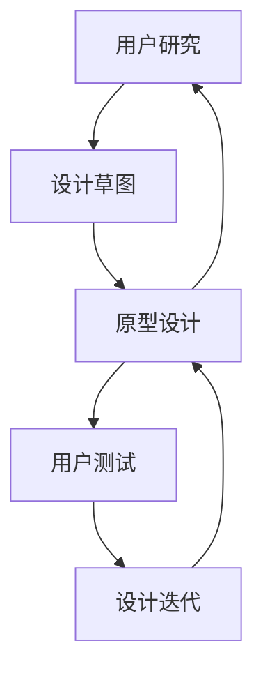

                 

# 用户界面设计：打造友好易用的人机交互

## 1. 背景介绍

### 1.1 问题由来

随着科技的快速发展，用户界面设计（UI设计）已经成为各行各业都非常重视的一环。不论是在应用程序、网站、还是硬件设备中，良好的用户界面设计都能提升用户体验，增加用户粘性。在移动设备日益普及的今天，UI设计对于产品的竞争力尤其重要。

但是，当前许多用户界面设计存在诸多问题，例如复杂的界面结构、繁琐的操作流程、不直观的图标等等，这些问题都极大地降低了用户体验，甚至可能导致用户流失。因此，如何进行友好的用户界面设计，是当前界面设计师和开发人员面临的巨大挑战。

### 1.2 问题核心关键点

本文章将重点讨论以下几个核心问题：

- 用户界面设计的原则和策略
- 界面元素的合理布局和设计
- 交互流程的设计和优化
- 界面反馈机制的设计
- 界面可访问性考虑
- 界面性能优化

## 2. 核心概念与联系

### 2.1 核心概念概述

在开始讨论具体的UI设计问题之前，我们先介绍几个核心的概念：

- **用户界面设计（User Interface Design）**：指的是在应用程序或网站中，对用户与系统交互的界面进行设计和优化，以提升用户使用体验的过程。

- **人机交互（Human-Computer Interaction, HCI）**：研究人与计算机系统之间交互的原理和方式，目标是设计出易用、高效、易访问的界面。

- **用户中心设计（User-Centered Design, UCD）**：一种设计方法，以用户需求为核心，通过研究和测试来设计出更符合用户使用习惯的界面。

这些核心概念共同构成了用户界面设计的理论基础，通过它们，我们可以更好地理解UI设计的目标和方式。

### 2.2 核心概念原理和架构的 Mermaid 流程图

以下是一个简化版的用户界面设计流程：



这个流程图中，我们从前期的用户研究开始，到草图设计、原型设计、用户测试、设计迭代，直至最终的设计方案完成。这是一个循环的过程，每一个环节都与用户直接相关，只有在不断的用户测试和迭代中，才能设计出符合用户需求的界面。

## 3. 核心算法原理 & 具体操作步骤

### 3.1 算法原理概述

用户界面设计虽然是设计类的工作，但也可以通过算法来进行辅助。例如，我们可以使用一些数据挖掘和机器学习算法来预测用户行为，设计出更符合用户使用习惯的界面。

常见的算法包括：

- **回归分析**：用于预测用户在界面中的行为，例如点击率、停留时间等。
- **聚类算法**：将用户分为不同的群体，并根据不同群体的特点进行界面设计。
- **分类算法**：预测用户行为是否符合某个类别，例如新手用户和高级用户。

这些算法可以帮助界面设计师更好地理解用户，从而进行更精确的设计。

### 3.2 算法步骤详解

#### 步骤1：用户研究

用户研究是用户界面设计的第一步，主要包括：

1. **用户画像（User Persona）**：定义目标用户群体，包括他们的年龄、性别、职业、兴趣等。
2. **用户需求分析**：了解用户的具体需求和使用场景。
3. **用户行为研究**：分析用户在实际使用中的行为模式。

通过这些研究，设计师可以更好地理解用户，从而进行更符合用户需求的设计。

#### 步骤2：界面元素设计

界面元素是用户直接与系统交互的对象，设计时需注意以下几点：

1. **布局设计**：界面元素的布局应合理，避免过于复杂，同时保证用户在任何情况下都能方便地找到所需的功能。
2. **色彩搭配**：颜色应符合用户习惯，同时保证界面美观。
3. **图标设计**：图标应简洁易懂，同时保证在不同设备上都有良好的显示效果。

#### 步骤3：交互流程设计

交互流程是用户使用系统时的行为路径，设计时需注意以下几点：

1. **流程图设计**：绘制用户行为流程图，明确每个步骤的输入和输出。
2. **任务分配**：明确每个步骤的任务和目标。
3. **反馈机制**：及时给用户反馈，例如页面加载时的加载动画。

#### 步骤4：界面测试

界面测试是用户界面设计的最后一步，主要包括：

1. **可用性测试**：通过用户测试，了解用户对界面的反馈。
2. **性能测试**：测试界面的加载速度、响应时间等性能指标。
3. **用户反馈**：收集用户的反馈意见，进行界面优化。

### 3.3 算法优缺点

#### 优点

- **精确度**：算法可以提供大量数据支持，从而提高设计的精确度。
- **效率**：算法可以自动化执行某些步骤，提高设计的效率。
- **可重复性**：算法可以重复执行，保证设计的一致性。

#### 缺点

- **数据依赖**：算法的预测效果依赖于数据的质量，如果数据不充分，算法效果会受到影响。
- **主观性**：用户界面的最终设计还是依赖于设计师的审美和判断，算法只能提供辅助。
- **复杂性**：算法实现较为复杂，需要一定的技术和数据支持。

### 3.4 算法应用领域

用户界面设计的算法应用非常广泛，主要包括：

- **智能推荐系统**：通过算法预测用户需求，进行界面和内容的推荐。
- **个性化界面设计**：根据用户行为和偏好，动态调整界面元素和布局。
- **界面性能优化**：通过算法分析界面性能瓶颈，进行优化。

## 4. 数学模型和公式 & 详细讲解 & 举例说明

### 4.1 数学模型构建

用户界面设计中，我们可以使用以下数学模型：

1. **回归模型**：
   $$ y = w_0 + w_1 x_1 + w_2 x_2 + \cdots + w_n x_n + \epsilon $$
   其中 $y$ 为预测值，$x_1, x_2, \cdots, x_n$ 为输入变量，$w_0, w_1, w_2, \cdots, w_n$ 为模型参数，$\epsilon$ 为随机误差。

2. **聚类模型**：
   $$ D = \sum_{i=1}^{K} \sum_{j=1}^{n} (x_{ij} - \mu_k)^2 $$
   其中 $D$ 为聚类目标函数，$K$ 为聚类数，$x_{ij}$ 为数据点，$\mu_k$ 为聚类中心。

3. **分类模型**：
   $$ P(y|x) = \frac{e^{\alpha + \beta^T x}}{1 + e^{\alpha + \beta^T x}} $$
   其中 $P(y|x)$ 为预测结果的概率，$\alpha$ 和 $\beta$ 为模型参数。

### 4.2 公式推导过程

#### 回归模型的推导过程

1. 线性回归模型：
   $$ y = w_0 + w_1 x_1 + w_2 x_2 + \cdots + w_n x_n + \epsilon $$
   其中 $w_0, w_1, w_2, \cdots, w_n$ 为模型参数，$\epsilon$ 为随机误差。

2. 最小二乘法求解模型参数：
   $$ w_i = \frac{\sum_{j=1}^{n} (x_j - \bar{x})(x_j - \bar{x})^T}{\sum_{j=1}^{n} (x_j - \bar{x})^2} $$
   其中 $\bar{x}$ 为数据的平均值。

#### 聚类模型的推导过程

1. K-Means算法：
   $$ D = \sum_{i=1}^{K} \sum_{j=1}^{n} (x_{ij} - \mu_k)^2 $$
   其中 $D$ 为聚类目标函数，$K$ 为聚类数，$x_{ij}$ 为数据点，$\mu_k$ 为聚类中心。

2. K-Means算法的步骤：
   1. 随机选择 $K$ 个聚类中心。
   2. 将每个数据点分配到最近的聚类中心。
   3. 重新计算每个聚类的中心。
   4. 重复步骤2和步骤3，直到聚类中心不再变化或达到预设的迭代次数。

#### 分类模型的推导过程

1. 逻辑回归模型：
   $$ P(y|x) = \frac{e^{\alpha + \beta^T x}}{1 + e^{\alpha + \beta^T x}} $$
   其中 $P(y|x)$ 为预测结果的概率，$\alpha$ 和 $\beta$ 为模型参数。

2. 交叉熵损失函数：
   $$ \mathcal{L} = -\frac{1}{N} \sum_{i=1}^{N} (y_i \log \hat{y}_i + (1 - y_i) \log (1 - \hat{y}_i)) $$
   其中 $y_i$ 为实际标签，$\hat{y}_i$ 为模型预测结果。

### 4.3 案例分析与讲解

#### 案例1：智能推荐系统

1. **问题**：用户在电商平台上浏览商品时，希望推荐相似或相关的商品。

2. **解决方案**：
   - **用户画像**：定义用户群体，例如25-35岁、女性、喜欢时尚。
   - **数据收集**：收集用户浏览历史、购买历史等数据。
   - **算法模型**：使用协同过滤、内容推荐等算法，预测用户可能感兴趣的商品。
   - **界面设计**：将推荐商品展示在用户浏览的商品附近，同时设计简洁易用的商品展示界面。

#### 案例2：个性化界面设计

1. **问题**：用户希望在网站中看到自己感兴趣的内容，但每次访问界面都相同。

2. **解决方案**：
   - **用户画像**：定义用户兴趣标签，例如旅游、美食、科技。
   - **数据收集**：收集用户浏览记录、点击记录等数据。
   - **算法模型**：使用聚类算法，将用户分为不同群体，然后为每个群体设计不同的界面。
   - **界面设计**：根据用户兴趣标签，动态调整界面元素和布局。

## 5. 项目实践：代码实例和详细解释说明

### 5.1 开发环境搭建

在进行用户界面设计实践之前，我们需要准备好开发环境。以下是使用Python进行UI设计开发的环境配置流程：

1. 安装Python：从官网下载并安装Python，建议安装最新版本。

2. 安装第三方库：
   - 安装Pandas、Numpy、Matplotlib等数据处理和可视化库。
   - 安装Scikit-learn等机器学习库。
   - 安装Flask或Django等Web框架。

3. 安装开发工具：
   - 安装Visual Studio Code等IDE。
   - 安装Git进行版本控制。

### 5.2 源代码详细实现

以下是一个使用Flask框架实现的简单界面设计示例：

```python
from flask import Flask, render_template
import pandas as pd

app = Flask(__name__)

@app.route('/')
def home():
    data = pd.read_csv('data.csv')
    # 数据处理和模型训练
    # 返回界面设计结果
    return render_template('index.html', data=data)

if __name__ == '__main__':
    app.run(debug=True)
```

在这个示例中，我们使用了Flask框架和Pandas库。具体步骤如下：

1. 安装Flask框架和Pandas库。
2. 编写Python代码，使用Flask框架搭建Web服务器。
3. 在代码中读取数据，并进行数据处理和模型训练。
4. 返回界面设计结果，渲染模板页面。

### 5.3 代码解读与分析

#### 代码1：Flask框架搭建

1. **Flask框架**：Flask是一个轻量级的Python Web框架，非常适合开发小型Web应用。

2. **路由**：Flask框架的路由（@app.route）用于定义Web应用的URL路径和对应的处理函数。

#### 代码2：数据处理

1. **Pandas库**：Pandas是一个数据处理库，可以方便地读取和处理各种数据格式。

2. **数据读取**：使用Pandas库的read_csv方法，从CSV文件中读取数据。

3. **数据处理**：对数据进行清洗、分析、统计等处理，生成模型输入数据。

#### 代码3：模型训练

1. **模型训练**：使用Scikit-learn等机器学习库，训练回归模型、聚类模型等算法。

2. **模型输出**：将模型预测结果输出到模板页面。

### 5.4 运行结果展示

运行上述代码，可以通过浏览器访问http://127.0.0.1:5000/，查看生成的界面设计结果。

## 6. 实际应用场景

### 6.1 智能推荐系统

智能推荐系统在电商、视频、音乐等平台上广泛应用。例如，亚马逊通过推荐系统，向用户推荐可能感兴趣的书籍和商品，显著提高了用户购买率和满意度。

### 6.2 个性化界面设计

个性化界面设计在新闻、社交、金融等平台上也有广泛应用。例如，LinkedIn通过个性化界面设计，根据用户的职业和兴趣，展示相关的新闻和内容，提高用户的活跃度和粘性。

## 7. 工具和资源推荐

### 7.1 学习资源推荐

为了帮助开发者系统掌握用户界面设计的理论基础和实践技巧，这里推荐一些优质的学习资源：

1. **《设计心理学》**：这是一本经典的UI设计入门书籍，详细介绍了用户心理和行为理论，帮助设计师更好地理解用户需求。

2. **《交互设计基础》**：这是一本介绍交互设计原理和方法的书籍，适合初学者学习。

3. **Coursera的《人机交互》课程**：由斯坦福大学教授讲授，深入浅出地介绍了HCI的理论和实践，适合系统学习。

4. **Udacity的《用户界面设计》课程**：提供了大量的实战项目，适合实践学习。

5. **Smashing Magazine**：一个专注于UI设计的在线平台，提供了大量的设计文章、案例和资源。

通过学习这些资源，相信你一定能够快速掌握用户界面设计的精髓，并用于解决实际的UI设计问题。

### 7.2 开发工具推荐

为了提高开发效率，推荐使用以下开发工具：

1. **Visual Studio Code**：一个轻量级的IDE，支持多种语言和框架，适合UI设计开发。

2. **Git**：一个版本控制系统，可以方便地管理代码和项目。

3. **JIRA**：一个项目管理工具，可以帮助团队进行需求管理和进度跟踪。

4. **Sketch**：一个专业的UI设计工具，支持矢量图形和原型设计。

5. **InVision**：一个原型设计和协作平台，支持团队协作和版本管理。

### 7.3 相关论文推荐

用户界面设计的论文主要涉及心理学、认知科学、计算机科学等多个领域，以下是几篇经典论文：

1. **《Design of Universal Human-Machine Interaction Systems》**：介绍了通用人机交互系统的设计原理和实践，适合系统学习。

2. **《Human Factors in Computing Systems》**：介绍了人机交互中的心理学和认知科学研究，适合深入理解。

3. **《Interaction Design Foundation》**：提供了大量交互设计的资源和案例，适合实践学习。

这些论文代表了大界面设计的最新研究成果，通过学习这些前沿成果，可以帮助研究者把握学科前进方向，激发更多的创新灵感。

## 8. 总结：未来发展趋势与挑战

### 8.1 研究成果总结

用户界面设计作为用户体验的核心部分，一直在不断发展和进步。当前，用户界面设计已经从简单的美观设计，发展为更加注重用户体验和用户行为的研究。例如，界面设计中加入了更多的心理学和认知科学原理，设计过程也更加系统化、数据驱动化。

### 8.2 未来发展趋势

未来，用户界面设计将呈现以下几个发展趋势：

1. **用户体验为中心**：越来越多的设计将以用户为中心，注重用户行为和心理研究，提升用户满意度和体验。

2. **数据驱动设计**：设计过程将更加数据驱动，通过数据分析和用户研究，进行更加精准的设计。

3. **跨平台设计**：随着多设备、多平台的发展，界面设计将更加注重跨平台和一致性设计。

4. **虚拟现实设计**：虚拟现实技术的普及，将带来全新的界面设计方式，例如虚拟界面的交互设计。

5. **可访问性设计**：随着对无障碍设计的关注度提升，界面设计将更加注重可访问性设计，帮助有特殊需求的用户更好地使用系统。

### 8.3 面临的挑战

尽管用户界面设计已经取得了不少进步，但在实际应用中，仍然面临许多挑战：

1. **用户需求复杂多样**：不同用户的需求和行为习惯不同，设计时需要考虑更多因素。

2. **技术更新快速**：新技术和新设备的出现，需要设计师不断学习和适应。

3. **设计效率低下**：设计师的工作量和需求量不断增加，设计效率有待提高。

4. **设计质量参差不齐**：一些设计产品仍然存在质量问题，需要进一步提升设计水平。

5. **设计成本高昂**：设计和开发界面需要大量人力和资源，成本较高。

### 8.4 研究展望

未来的用户界面设计研究，需要在以下几个方面进行突破：

1. **数据驱动设计**：利用更多的数据分析和用户研究，进行更加精准的设计。

2. **自动化设计**：利用算法和自动化工具，提高设计效率和质量。

3. **跨学科研究**：结合心理学、认知科学、计算机科学等多个学科，进行更加全面的研究。

4. **设计标准化**：制定标准化的设计规范，帮助设计师更好地进行设计。

5. **可持续设计**：设计出更加环保、可持续的界面，减少对环境的影响。

这些研究方向将推动用户界面设计进一步发展，提升用户体验和系统的可用性。相信未来，用户界面设计将成为人工智能和计算机科学的重要组成部分，为人机交互带来更加深刻的变革。

## 9. 附录：常见问题与解答

### Q1: UI设计中的“用户体验”具体指什么？

A: 用户体验（User Experience, UX）是指用户在使用产品时的主观感受和满意度。一个好的用户体验不仅能提升用户满意度，还能增加用户粘性和产品竞争力。

### Q2: UI设计中应该优先考虑什么？

A: UI设计中应该优先考虑用户需求和行为，进行系统的研究和分析。同时，设计过程也需要注重美观和一致性，保证界面的易用性和易访问性。

### Q3: UI设计中如何处理多设备兼容性问题？

A: 处理多设备兼容性问题，需要进行系统的测试和优化。例如，使用响应式设计，实现自适应布局；使用高保真的原型设计，进行多设备测试。

### Q4: UI设计中如何处理复杂性问题？

A: 处理复杂性问题，需要进行系统的分析和简化。例如，使用层次结构设计，将复杂的界面元素分解成更小的单元；使用交互流程图设计，明确每个步骤的输入和输出。

### Q5: UI设计中如何处理交互问题？

A: 处理交互问题，需要进行系统的测试和优化。例如，使用用户测试，了解用户的交互行为；使用反馈机制，及时给用户反馈；使用交互流程图设计，明确每个步骤的输入和输出。

---

作者：禅与计算机程序设计艺术 / Zen and the Art of Computer Programming

