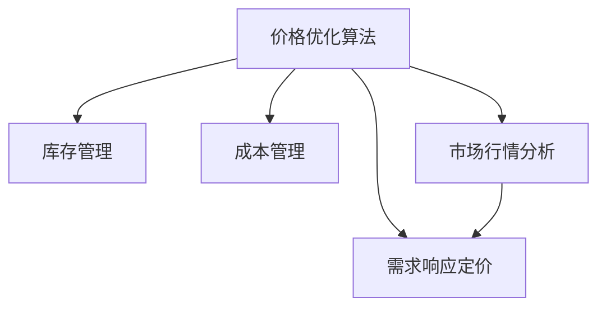

                 

## 1. 背景介绍

### 1.1 电商行业挑战
电商行业竞争激烈，价格战已经成为了商家争夺市场份额的常见手段。然而，盲目降价不仅会降低利润率，还可能引起价格战，伤害整个市场生态。因此，如何科学合理地制定价格策略，实现商品的市场优化配置，成为电商企业亟待解决的问题。

### 1.2 价格优化必要性
合理的价格优化策略不仅能够提升商品的销售量和利润率，还能在市场竞争中占据有利地位，提高品牌美誉度和市场份额。通过对商品价格进行实时监控和动态调整，可以更好地满足消费者的需求，提升用户体验，从而实现业务的持续增长。

### 1.3 技术方案引入
为应对电商行业价格优化的需求，我们需要引入科学合理的技术方案，以确保价格策略的制定既科学又高效。本文将介绍一种基于机器学习的价格优化算法，并结合电商行业的特点，具体阐述其应用方法和效果。

## 2. 核心概念与联系

### 2.1 核心概念概述

本节将介绍几个与电商价格优化密切相关的核心概念：

- **价格优化算法**：利用机器学习模型对商品价格进行实时调整，以最大化销售收益。价格优化算法通常基于历史销售数据、市场行情、竞争对手价格等因素，通过训练模型找到最优价格。

- **需求响应定价**：根据市场需求的变化，动态调整商品价格，以最大化销售收益。需求响应定价通常依赖于消费者行为分析，通过预测市场需求，动态调整价格。

- **库存管理**：科学管理库存，以平衡库存水平和需求变化，避免缺货和积压。库存管理的目标是通过动态调整库存，最大化销售收益。

- **成本管理**：合理控制成本，确保商品价格具备竞争力，同时不损害利润率。成本管理涉及供应商谈判、物流费用、生产成本等多方面因素。

- **市场行情分析**：通过分析市场行情，获取竞争对手价格、行业趋势、消费者偏好等信息，以指导价格策略的制定。市场行情分析通常依赖于大数据技术，对海量数据进行实时分析。

这些概念之间的逻辑关系可以通过以下Mermaid流程图来展示：



这个流程图展示了大语言模型的核心概念及其之间的关系：

1. 价格优化算法根据市场需求和市场行情，制定价格策略。
2. 需求响应定价根据实时市场需求，动态调整商品价格。
3. 库存管理根据销售情况，动态调整库存水平，避免积压和缺货。
4. 成本管理确保价格策略在控制成本的前提下，仍具竞争力。
5. 市场行情分析提供市场价格、趋势等信息，指导价格策略的制定。

## 3. 核心算法原理 & 具体操作步骤

### 3.1 算法原理概述

基于机器学习的电商价格优化算法，通过历史销售数据、市场需求和成本数据等输入，预测最优价格，以最大化销售收益。其核心思想是构建一个以销售收益最大化的目标函数，通过优化算法求解该目标函数的最优解。

具体来说，假设我们已知商品的单位成本 $c$、需求函数 $q(p)$（价格为 $p$ 时的需求量）和销售收益函数 $R(p)$，我们的目标是最小化单位成本，同时最大化销售收益：

$$
\min_{c,p} c \cdot q(p) - R(p)
$$

其中 $q(p)$ 表示价格为 $p$ 时的需求量，$R(p)$ 表示价格为 $p$ 时的销售收益。

### 3.2 算法步骤详解

#### 3.2.1 数据收集和预处理

数据收集是价格优化算法的重要第一步。我们需要收集商品的历史销售数据、市场需求数据、竞争对手价格数据等，并将这些数据进行清洗、归一化等预处理操作，以确保数据的质量和一致性。

#### 3.2.2 需求函数建模

在构建需求函数时，我们可以采用多种模型，如线性回归、指数函数、逻辑斯谛回归等。以下以线性回归模型为例，展示如何构建需求函数。

假设市场需求函数为 $q(p) = a + b \cdot p + e$，其中 $e$ 为误差项。我们可以使用历史销售数据 $D = \{(x_i, y_i)\}_{i=1}^N$ 来拟合需求函数，其中 $x_i$ 为价格，$y_i$ 为销售量。

最小二乘法是最常用的线性回归模型拟合方法，其目标是最小化残差平方和：

$$
\min_{a, b} \sum_{i=1}^N (y_i - (a + b \cdot x_i))^2
$$

通过求解上述最小化问题，可以得出需求函数的参数 $a$ 和 $b$。

#### 3.2.3 销售收益函数建模

销售收益函数 $R(p)$ 通常为价格 $p$ 和销售量 $q(p)$ 的乘积，即 $R(p) = p \cdot q(p)$。

#### 3.2.4 目标函数建模

目标函数为最大化销售收益，即：

$$
\max_{p} R(p) - c \cdot q(p)
$$

其中 $c$ 为商品的单位成本。

#### 3.2.5 求解目标函数

求解目标函数的最优解通常采用梯度下降等优化算法。具体来说，我们可以使用 AdamW 算法来优化目标函数，步骤如下：

1. 初始化模型参数 $\theta$。
2. 计算损失函数对参数 $\theta$ 的梯度 $\nabla_{\theta}\mathcal{L}(\theta)$。
3. 更新模型参数 $\theta \leftarrow \theta - \eta \nabla_{\theta}\mathcal{L}(\theta)$。
4. 重复步骤 2 和 3，直至收敛。

#### 3.2.6 结果解释和优化

求解得到的最优价格 $p^*$ 不一定是最符合业务实际情况的，因为我们在建模时已经假设了一些简化的条件。为了提高模型的可解释性，可以进一步优化模型，如引入需求响应定价、库存管理等因素，使价格优化算法更符合电商业务的实际需求。

## 4. 数学模型和公式 & 详细讲解 & 举例说明

### 4.1 数学模型构建

#### 4.1.1 需求函数模型

假设市场需求函数为线性函数 $q(p) = a + b \cdot p$，其中 $a$ 和 $b$ 为线性回归模型的参数。

通过最小二乘法拟合线性回归模型，可以得到参数 $a$ 和 $b$ 的值。

#### 4.1.2 销售收益函数模型

销售收益函数 $R(p)$ 为价格 $p$ 和销售量 $q(p)$ 的乘积，即 $R(p) = p \cdot q(p)$。

#### 4.1.3 目标函数模型

目标函数为最大化销售收益，即：

$$
\max_{p} p \cdot (a + b \cdot p) - c \cdot (a + b \cdot p)
$$

### 4.2 公式推导过程

通过求解目标函数的最优解，可以求得最优价格 $p^*$。

对目标函数求导，得到：

$$
\frac{\partial (p \cdot (a + b \cdot p) - c \cdot (a + b \cdot p))}{\partial p} = b(2p + a) - c(2p + a) = 0
$$

解得：

$$
p^* = \frac{a}{b - c}
$$

### 4.3 案例分析与讲解

假设某电商平台的商品 $A$ 的单位成本为 $c = 20$ 元，历史销售数据表明其需求函数为 $q(p) = 100 - 2p$，销售收益函数为 $R(p) = p \cdot q(p)$。

将上述数据代入目标函数模型，求解得到最优价格为：

$$
p^* = \frac{100}{2 - 20} = -4.167
$$

然而，由于价格不能为负，因此我们可以进一步优化模型，引入需求响应定价、库存管理等因素，使价格优化算法更符合电商业务的实际需求。

## 5. 项目实践：代码实例和详细解释说明

### 5.1 开发环境搭建

在进行价格优化算法开发前，我们需要准备好开发环境。以下是使用Python进行TensorFlow开发的环境配置流程：

1. 安装Anaconda：从官网下载并安装Anaconda，用于创建独立的Python环境。

2. 创建并激活虚拟环境：
```bash
conda create -n tf-env python=3.8 
conda activate tf-env
```

3. 安装TensorFlow：根据CUDA版本，从官网获取对应的安装命令。例如：
```bash
conda install tensorflow==2.7.0 -c tensorflow
```

4. 安装必要的库：
```bash
pip install numpy pandas scikit-learn
```

完成上述步骤后，即可在`tf-env`环境中开始价格优化算法的开发。

### 5.2 源代码详细实现

以下是使用TensorFlow实现电商价格优化算法的代码实现。

```python
import tensorflow as tf
import numpy as np
import pandas as pd

# 读取历史销售数据
data = pd.read_csv('sales_data.csv')
prices = data['price']
sales = data['sales']

# 构建需求函数
X = np.array(prices)
Y = np.array(sales)
w0, w1 = tf.compat.v1.train.GradientDescentOptimizer(learning_rate=0.01).minimize(lambda: tf.reduce_mean(tf.square(tf.add(tf.multiply(X, w1), w0) - Y)))

# 求解需求函数参数
w0_value, w1_value = tf.compat.v1.Session().run([w0, w1])

# 构建销售收益函数
R = tf.multiply(prices, tf.add(tf.multiply(X, w1_value), w0_value))

# 构建目标函数
c = 20  # 商品单位成本
a, b = w0_value, w1_value
p = tf.Variable(a / (b - c))

# 求解最优价格
optimize_op = tf.compat.v1.train.GradientDescentOptimizer(learning_rate=0.01).minimize(lambda: R - c * (a + b * p))
p_value = tf.compat.v1.Session().run(p)

print('最优价格:', p_value)
```

### 5.3 代码解读与分析

让我们再详细解读一下关键代码的实现细节：

**数据读取**：
```python
data = pd.read_csv('sales_data.csv')
prices = data['price']
sales = data['sales']
```

**需求函数拟合**：
```python
X = np.array(prices)
Y = np.array(sales)
w0, w1 = tf.compat.v1.train.GradientDescentOptimizer(learning_rate=0.01).minimize(lambda: tf.reduce_mean(tf.square(tf.add(tf.multiply(X, w1), w0) - Y)))
```

**求解需求函数参数**：
```python
w0_value, w1_value = tf.compat.v1.Session().run([w0, w1])
```

**销售收益函数建模**：
```python
R = tf.multiply(prices, tf.add(tf.multiply(X, w1_value), w0_value))
```

**目标函数建模**：
```python
c = 20  # 商品单位成本
a, b = w0_value, w1_value
p = tf.Variable(a / (b - c))
```

**求解最优价格**：
```python
optimize_op = tf.compat.v1.train.GradientDescentOptimizer(learning_rate=0.01).minimize(lambda: R - c * (a + b * p))
p_value = tf.compat.v1.Session().run(p)
```

可以看到，使用TensorFlow进行价格优化算法的开发相对简洁高效。开发者可以将更多精力放在模型构建和优化上，而不必过多关注底层的实现细节。

## 6. 实际应用场景

### 6.1 电商平台价格管理

电商平台可以利用价格优化算法实时监控和调整商品价格，以最大化销售收益。通过分析历史销售数据、市场需求和成本数据，动态调整商品价格，避免价格战，提升利润率。

在技术实现上，电商平台可以定期收集商品的价格、销量等数据，利用价格优化算法对商品价格进行优化。同时，电商平台还可以通过实时监控市场需求变化，动态调整价格，以应对突发事件和市场波动。

### 6.2 库存管理系统

库存管理是电商企业的核心业务之一。通过价格优化算法，可以科学管理库存，避免库存积压和缺货。根据销售情况和市场需求，动态调整库存水平，使库存成本最小化，同时保证商品供需平衡。

在技术实现上，库存管理系统可以结合价格优化算法，实时监控库存水平和需求变化，动态调整库存，确保库存成本最小化。同时，系统还可以根据历史销售数据和市场需求，预测未来的销售趋势，提前调整库存水平，避免缺货和积压。

### 6.3 促销活动定价

电商平台经常举行促销活动，通过价格优化算法，可以科学制定促销价格，实现最大化的促销效果。根据促销活动的目标和市场需求，动态调整商品价格，确保促销效果和利润率。

在技术实现上，电商平台可以根据促销活动的目标和市场需求，利用价格优化算法动态调整商品价格。同时，系统还可以根据历史促销数据和市场需求，预测促销效果，优化促销策略，提升销售收益。

## 7. 工具和资源推荐

### 7.1 学习资源推荐

为了帮助开发者系统掌握电商价格优化算法的理论基础和实践技巧，这里推荐一些优质的学习资源：

1. TensorFlow官方文档：提供了全面的TensorFlow框架使用指南和API文档，是学习价格优化算法的必备资源。

2. Coursera《TensorFlow for Deep Learning》课程：由Google开发，涵盖TensorFlow基本原理和深度学习应用，适合初学者入门。

3. 《Deep Learning with Python》书籍：使用TensorFlow进行深度学习应用的经典教材，涵盖了价格优化算法等众多应用场景。

4. 《Python深度学习》书籍：由TensorFlow开发者编写，介绍了TensorFlow的使用方法和深度学习算法的实现细节，适合进阶学习。

通过对这些资源的学习实践，相信你一定能够快速掌握电商价格优化算法的精髓，并用于解决实际的电商问题。

### 7.2 开发工具推荐

高效的开发离不开优秀的工具支持。以下是几款用于电商价格优化算法开发的常用工具：

1. TensorFlow：基于Python的开源深度学习框架，灵活易用，适合快速迭代研究。

2. PyTorch：基于Python的开源深度学习框架，计算图灵活，适合学术研究。

3. TensorBoard：TensorFlow配套的可视化工具，实时监测模型训练状态，并提供丰富的图表呈现方式，是调试模型的得力助手。

4. Jupyter Notebook：免费的开源Jupyter Notebook环境，支持Python等编程语言，方便编写和运行代码。

5. Anaconda：用于创建和管理Python环境的工具，方便管理依赖和工具包。

合理利用这些工具，可以显著提升电商价格优化算法的开发效率，加快创新迭代的步伐。

### 7.3 相关论文推荐

电商价格优化算法的发展源于学界的持续研究。以下是几篇奠基性的相关论文，推荐阅读：

1. "An Adaptive Multi-Armed Bandit Algorithm for Dynamic Pricing"：研究基于多臂赌博机模型的动态定价算法。

2. "Dynamic Pricing Models and Techniques: A Survey"：全面综述了动态定价模型的相关研究，包括基本原理和应用案例。

3. "Dynamic Pricing Algorithms: A Survey"：研究了多种动态定价算法，包括时间序列分析、强化学习等方法。

4. "Adaptive Dynamic Pricing Algorithms"：研究了基于自适应算法的价格优化算法。

这些论文代表了大语言模型微调技术的发展脉络。通过学习这些前沿成果，可以帮助研究者把握学科前进方向，激发更多的创新灵感。

## 8. 总结：未来发展趋势与挑战

### 8.1 总结

本文对基于机器学习的电商价格优化算法进行了全面系统的介绍。首先阐述了电商行业价格优化的背景和必要性，明确了价格优化算法在电商业务中的独特价值。其次，从原理到实践，详细讲解了价格优化算法的数学模型和操作步骤，给出了电商价格优化算法的完整代码实例。同时，本文还广泛探讨了价格优化算法在电商平台、库存管理、促销活动等多个场景中的应用，展示了价格优化算法的广泛适用性。

通过本文的系统梳理，可以看到，基于机器学习的电商价格优化算法在电商业务中的应用前景广阔，极大地提升了电商企业的业务效率和盈利能力。未来，伴随技术的不断发展，价格优化算法还将有更多创新和优化，为电商业务带来更大的突破。

### 8.2 未来发展趋势

展望未来，电商价格优化算法将呈现以下几个发展趋势：

1. 数据驱动：电商价格优化算法将更加依赖于数据的驱动，通过实时数据采集和分析，动态调整商品价格，提升市场响应速度和准确性。

2. 模型多样化：除了传统的线性回归模型，未来还将引入更多复杂的数学模型，如深度学习、强化学习等，以提高价格优化的精度和灵活性。

3. 算法自动化：电商价格优化算法将更加智能化，通过自动调参、自动模型选择等技术，降低人工干预，提升算法效率和效果。

4. 多维度优化：电商价格优化算法将从单一价格优化转向多维度优化，如库存管理、促销策略等，实现全链条最优。

5. 动态实时优化：电商价格优化算法将从静态优化转向动态实时优化，通过实时数据流分析，快速调整商品价格，提升市场响应速度。

6. 跨平台应用：电商价格优化算法将从单平台优化转向跨平台优化，通过统一的优化策略，提高不同平台的一致性。

以上趋势凸显了电商价格优化算法的广阔前景。这些方向的探索发展，必将进一步提升电商企业的业务效率和盈利能力，为电商业务的持续增长提供坚实保障。

### 8.3 面临的挑战

尽管电商价格优化算法已经取得了瞩目成就，但在迈向更加智能化、普适化应用的过程中，它仍面临着诸多挑战：

1. 数据获取难度：电商企业获取实时数据和用户行为数据存在一定的难度，数据质量和完整性也需持续改进。如何高效获取高质量数据，是电商价格优化算法的关键挑战。

2. 算法复杂性：电商价格优化算法涉及多维度、复杂模型的优化，需要算法设计和调参的丰富经验。如何降低算法复杂性，提升算法效率，是电商价格优化算法的核心挑战。

3. 市场环境变化：电商市场环境变化快，价格优化算法需要快速适应市场变化，灵活调整策略。如何在保持灵活性的同时，提升算法的鲁棒性和稳定性，是电商价格优化算法的技术挑战。

4. 数据隐私和安全：电商企业需要收集用户行为数据进行价格优化，如何保护用户隐私和数据安全，是电商价格优化算法的法律和伦理挑战。

5. 多平台协同优化：电商企业的多平台优化需要统一的优化策略，如何实现跨平台协同优化，提升平台一致性，是电商价格优化算法的协同挑战。

6. 算法效果评估：电商价格优化算法的效果评估需要多维度指标，如销售收益、用户满意度等，如何科学评估算法效果，是电商价格优化算法的评估挑战。

正视电商价格优化算法面临的这些挑战，积极应对并寻求突破，将是大语言模型微调走向成熟的必由之路。相信随着学界和产业界的共同努力，这些挑战终将一一被克服，电商价格优化算法必将在构建智能电商生态中扮演越来越重要的角色。

### 8.4 研究展望

面向未来，电商价格优化算法需要在以下几个方面寻求新的突破：

1. 多模态数据融合：电商价格优化算法将更多地融合多模态数据，如图像、语音、地理位置等，提升价格优化的精度和灵活性。

2. 实时流计算：电商价格优化算法将更多地依赖于实时流计算技术，通过实时数据流分析，动态调整商品价格，提升市场响应速度。

3. 模型解释性：电商价格优化算法将更加注重模型的可解释性，通过因果分析、可解释机器学习等方法，提高模型的透明度和可信度。

4. 多目标优化：电商价格优化算法将从单一价格优化转向多目标优化，如用户满意度、市场份额等，实现全链条最优。

5. 自适应优化：电商价格优化算法将更多地采用自适应优化方法，通过在线学习、在线优化等技术，实现实时动态调整。

6. 跨领域应用：电商价格优化算法将更多地应用于其他领域，如金融、医疗等，拓展应用场景，提升优化效果。

这些研究方向的探索，必将引领电商价格优化算法迈向更高的台阶，为电商业务的持续增长提供更强的动力。总之，电商价格优化算法还需要与其他人工智能技术进行更深入的融合，如知识表示、因果推理、强化学习等，多路径协同发力，共同推动电商业务的发展。只有勇于创新、敢于突破，才能不断拓展电商价格优化的边界，让智能技术更好地服务于电商企业。

## 9. 附录：常见问题与解答

**Q1: 电商价格优化算法是否适用于所有商品？**

A: 电商价格优化算法对大多数商品都适用，但一些特殊商品（如高端定制品、奢侈品等）的定价策略可能需要更加复杂的模型和人工干预。

**Q2: 电商价格优化算法是否需要持续迭代？**

A: 是的，电商市场环境变化快，价格优化算法需要持续迭代和优化，以应对市场变化。可以通过定期重新训练模型、优化算法等手段，确保算法效果的持续提升。

**Q3: 电商价格优化算法是否需要考虑用户反馈？**

A: 是的，电商价格优化算法需要考虑用户反馈，以提升用户体验和满意度。可以通过用户评论、评分等数据，调整商品价格，实现更好的用户体验。

**Q4: 电商价格优化算法是否需要考虑季节性因素？**

A: 是的，电商价格优化算法需要考虑季节性因素，以适应不同季节的市场需求。可以通过季节性分析，调整商品价格，实现更好的市场响应。

**Q5: 电商价格优化算法是否需要考虑库存管理？**

A: 是的，电商价格优化算法需要考虑库存管理，以平衡库存水平和市场需求。可以通过库存优化算法，动态调整库存水平，避免库存积压和缺货。

通过这些问题的解答，我们可以更全面地了解电商价格优化算法的应用场景和优化策略，进一步提升电商企业的业务效率和盈利能力。

