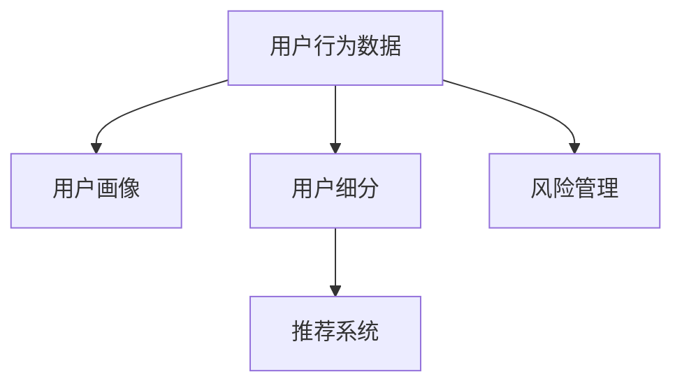

                 

# 电商平台中用户行为数据分析功能的设计与实现

## 1. 背景介绍

随着电子商务的兴起，电商平台已经成为了零售行业的重要组成部分。各大电商平台汇聚了数亿用户，其用户行为数据蕴含着巨大的商业价值，为个性化推荐、用户画像、营销策略优化提供了有力的支持。因此，构建一个高效、精确的用户行为数据分析平台，是电商平台能够实现精准营销和提升用户满意度的关键。

在现代电商平台上，用户行为数据的收集与分析方法正在从简单的点击流分析、浏览历史记录等，逐步扩展到更复杂的用户轨迹、交互路径、用户反馈等多个维度。这些数据源彼此之间相互交织，构成了用户行为的“数字指纹”。通过对这些数字指纹的深入分析和建模，电商平台可以实现以下目标：

1. **用户画像构建**：精准描绘用户的特征，包括兴趣偏好、消费习惯、行为模式等，为个性化推荐提供依据。
2. **用户细分**：基于用户画像进行用户群体划分，实现更细粒度的用户行为分析。
3. **营销策略优化**：分析用户行为数据，为营销活动设计、广告投放策略提供指导。
4. **风险管理**：通过用户行为数据的异常检测和分析，识别潜在欺诈、恶意攻击等风险，提升平台安全性。

本文将围绕电商平台用户行为数据分析功能的设计与实现，详细阐述核心概念和架构，并给出具体的操作步骤和案例分析。

## 2. 核心概念与联系

### 2.1 核心概念概述

为理解电商平台用户行为数据分析功能，我们先介绍几个核心概念：

- **用户行为数据（User Behavior Data）**：用户在电商平台上的各种操作记录，包括浏览、点击、购买、评价等。
- **用户画像（User Profile）**：基于用户行为数据构建的用户特征集合，描述了用户的兴趣、偏好、消费习惯等。
- **用户细分（User Segmentation）**：根据用户画像将用户划分为不同的群体，方便针对不同群体进行分析和营销。
- **推荐系统（Recommendation System）**：基于用户画像和行为数据，自动生成个性化推荐，提升用户体验和转化率。
- **风险管理（Risk Management）**：通过对用户行为数据的异常检测和分析，识别潜在的欺诈、恶意攻击等风险，保障平台安全。

这些核心概念之间的逻辑关系可以通过以下Mermaid流程图来展示：



这个流程图展示了用户行为数据如何通过用户画像、用户细分、推荐系统、风险管理等多个环节，转化为具体的商业价值和风险防范措施。

### 2.2 核心概念原理和架构

#### 用户行为数据的收集与处理

用户行为数据的收集主要通过以下几种方式：

1. **日志记录**：记录用户在网站上的各种操作，如浏览、点击、购买等。
2. **事件跟踪**：使用JavaScript等技术，记录用户在网页上的事件，如按钮点击、表单提交等。
3. **API接口**：提供API接口，供第三方系统集成，获取用户行为数据。

处理用户行为数据，需要完成以下步骤：

1. **数据清洗**：去除噪声数据，确保数据的准确性和完整性。
2. **数据归一化**：将不同来源的数据进行格式统一，便于后续处理。
3. **数据存储**：采用高效的数据存储方式，如Hadoop、MySQL等，保证数据的安全性和访问速度。

#### 用户画像构建

用户画像的构建需要以下几个步骤：

1. **特征选择**：根据业务需求，选择对用户行为分析有意义的特征，如浏览历史、购买记录、评价内容等。
2. **数据建模**：使用机器学习、深度学习等方法，对特征进行建模，生成用户画像。
3. **画像存储**：将用户画像存储在数据库或分布式缓存中，供其他系统调用。

#### 用户细分

用户细分主要通过以下步骤完成：

1. **特征计算**：基于用户画像，计算用户的特征向量，如兴趣偏好、消费能力等。
2. **聚类算法**：使用聚类算法，将用户按照特征向量进行划分，生成不同的用户群体。
3. **群体标签**：为每个用户群体设置独特的标签，方便后续分析和管理。

#### 推荐系统

推荐系统主要通过以下步骤实现：

1. **模型训练**：基于用户画像和行为数据，训练推荐模型，如协同过滤、内容推荐、深度学习推荐等。
2. **推荐算法**：使用推荐算法，根据用户画像和行为数据生成个性化推荐。
3. **效果评估**：评估推荐系统的效果，如点击率、转化率、覆盖率等，持续优化算法。

#### 风险管理

风险管理主要通过以下步骤完成：

1. **风险检测**：使用异常检测算法，识别用户行为中的异常行为，如异常购买、高频交易等。
2. **风险评估**：对识别出的异常行为进行评估，判断其对平台的影响程度。
3. **风险处置**：根据风险评估结果，采取相应的处置措施，如警告、封禁、追回资金等。

这些核心概念共同构成了电商平台用户行为数据分析功能的核心框架，通过合理的数据收集、处理、建模，可以有效地支持个性化推荐、用户细分、营销策略优化和风险管理等多个环节。

## 3. 核心算法原理 & 具体操作步骤

### 3.1 算法原理概述

电商平台用户行为数据分析功能的核心算法原理主要包括：

1. **机器学习算法**：用于用户画像构建和用户细分，如K-means聚类、随机森林、GBDT等。
2. **深度学习算法**：用于推荐系统，如协同过滤、内容推荐、深度神经网络等。
3. **异常检测算法**：用于风险管理，如孤立森林、One-Class SVM等。

这些算法共同构成了用户行为数据分析的完整流程，通过不同的算法处理，可以将用户行为数据转化为有价值的信息。

### 3.2 算法步骤详解

#### 用户画像构建

1. **特征选择**：根据业务需求，选择合适的用户行为特征，如浏览历史、购买记录、评价内容等。
2. **数据归一化**：将不同来源的数据进行格式统一，如对时间戳进行归一化，对文本数据进行分词、去停用词等。
3. **特征提取**：使用特征提取算法，将原始特征转化为可用于建模的特征向量，如TF-IDF、词袋模型等。
4. **用户画像建模**：使用机器学习算法或深度学习算法，对特征向量进行建模，生成用户画像。

#### 用户细分

1. **特征计算**：基于用户画像，计算用户的特征向量，如兴趣偏好、消费能力等。
2. **聚类算法**：使用聚类算法，将用户按照特征向量进行划分，生成不同的用户群体。
3. **群体标签**：为每个用户群体设置独特的标签，方便后续分析和管理。

#### 推荐系统

1. **模型训练**：基于用户画像和行为数据，训练推荐模型，如协同过滤、内容推荐、深度学习推荐等。
2. **推荐算法**：使用推荐算法，根据用户画像和行为数据生成个性化推荐。
3. **效果评估**：评估推荐系统的效果，如点击率、转化率、覆盖率等，持续优化算法。

#### 风险管理

1. **风险检测**：使用异常检测算法，识别用户行为中的异常行为，如异常购买、高频交易等。
2. **风险评估**：对识别出的异常行为进行评估，判断其对平台的影响程度。
3. **风险处置**：根据风险评估结果，采取相应的处置措施，如警告、封禁、追回资金等。

### 3.3 算法优缺点

#### 用户画像构建

优点：

1. **多维度分析**：基于用户画像，可以全面了解用户的行为和特征。
2. **动态更新**：用户画像可以随着用户行为的增加而动态更新，保证数据的实时性。

缺点：

1. **数据质量依赖**：用户画像的质量高度依赖于数据收集和处理的准确性。
2. **计算资源消耗大**：用户画像构建需要大量计算资源，特别是深度学习模型的训练。

#### 用户细分

优点：

1. **目标群体明确**：用户细分可以明确不同的用户群体，方便针对不同群体进行分析和营销。
2. **个性化推荐**：基于用户细分，可以生成更个性化的推荐内容。

缺点：

1. **复杂度较高**：用户细分的算法复杂度较高，需要选择合适的聚类算法和参数。
2. **模型鲁棒性不足**：用户细分模型对数据的异常和噪声敏感，需要进一步优化。

#### 推荐系统

优点：

1. **提升用户体验**：基于用户画像和行为数据，生成个性化推荐，提升用户体验和转化率。
2. **算法灵活性高**：推荐系统可以使用多种算法，满足不同业务需求。

缺点：

1. **数据依赖性强**：推荐系统的效果高度依赖于用户行为数据的完整性和准确性。
2. **计算复杂度高**：推荐系统需要处理大量用户行为数据，计算复杂度高。

#### 风险管理

优点：

1. **实时监控**：异常检测算法可以实时监控用户行为，及时发现异常行为。
2. **决策灵活性高**：风险管理可以根据异常行为采取相应的处置措施，灵活性高。

缺点：

1. **误报率高**：异常检测算法可能存在误报，需要进一步优化算法。
2. **数据隐私问题**：风险管理需要大量用户行为数据，可能涉及用户隐私问题。

### 3.4 算法应用领域

#### 用户画像构建

用户画像构建在电商平台中的应用非常广泛，如：

1. **个性化推荐**：根据用户画像，生成个性化推荐内容，提升用户体验。
2. **用户细分**：根据用户画像，划分不同用户群体，制定差异化的营销策略。
3. **广告投放**：基于用户画像，进行精准的广告投放，提高广告效果。

#### 用户细分

用户细分在电商平台中的应用主要包括以下几个方面：

1. **用户分类**：将用户按照不同的特征进行分类，便于个性化推荐和营销。
2. **用户行为预测**：基于用户细分，预测用户的行为和需求，制定相应的营销策略。
3. **异常行为检测**：通过用户细分，检测异常行为，提升平台安全性。

#### 推荐系统

推荐系统在电商平台中的应用包括：

1. **商品推荐**：根据用户画像和行为数据，推荐用户可能感兴趣的商品。
2. **内容推荐**：根据用户画像和行为数据，推荐用户可能感兴趣的内容。
3. **广告推荐**：根据用户画像和行为数据，推荐用户可能感兴趣的广告。

#### 风险管理

风险管理在电商平台中的应用主要包括以下几个方面：

1. **欺诈检测**：通过异常检测算法，识别潜在的欺诈行为。
2. **恶意行为检测**：通过异常检测算法，识别潜在的恶意行为，如恶意下单、恶意评价等。
3. **异常行为预警**：通过异常检测算法，及时预警异常行为，保障平台安全。

这些算法应用领域涵盖了电商平台的各个环节，通过合理地应用算法，可以提升平台的运营效率和用户满意度。

## 4. 数学模型和公式 & 详细讲解 & 举例说明

### 4.1 数学模型构建

#### 用户画像构建

假设电商平台有$N$个用户，每个用户有$d$个行为特征，用户画像的构建可以表示为：

$$
\mathbf{P} = [\mathbf{p}_1, \mathbf{p}_2, ..., \mathbf{p}_N]
$$

其中，$\mathbf{p}_i$表示第$i$个用户的行为特征向量。

#### 用户细分

用户细分的目标是将用户分为$K$个群体，可以使用聚类算法，如K-means聚类，生成每个用户所属的群体标签。

#### 推荐系统

推荐系统的目标是根据用户画像和行为数据，生成个性化推荐。假设推荐模型为$f(\mathbf{P})$，其中$\mathbf{P}$为用户画像，推荐结果为$\mathbf{R}$。

#### 风险管理

风险管理的目标是通过异常检测算法，识别和评估用户行为中的异常行为。假设异常检测模型为$g(\mathbf{P})$，其中$\mathbf{P}$为用户画像，异常行为结果为$\mathbf{A}$。

### 4.2 公式推导过程

#### 用户画像构建

假设用户行为特征向量$\mathbf{p}_i$的维度为$d$，用户画像建模可以使用监督学习方法，如随机森林、GBDT等。假设随机森林模型为$F$，用户画像构建的公式可以表示为：

$$
\mathbf{P} = F(\mathbf{p}_i)
$$

其中，$F$为随机森林模型，$\mathbf{p}_i$为用户$i$的行为特征向量。

#### 用户细分

用户细分的聚类算法可以采用K-means算法，假设聚类模型为$K$，用户细分的公式可以表示为：

$$
\mathbf{C} = K(\mathbf{P})
$$

其中，$\mathbf{C}$为用户$i$所属的群体标签，$\mathbf{P}$为用户$i$的行为特征向量。

#### 推荐系统

推荐系统的目标是根据用户画像和行为数据，生成个性化推荐。假设推荐模型为$f(\mathbf{P})$，推荐结果为$\mathbf{R}$，推荐系统的公式可以表示为：

$$
\mathbf{R} = f(\mathbf{P})
$$

其中，$f$为推荐模型，$\mathbf{P}$为用户$i$的行为特征向量。

#### 风险管理

风险管理的目标是通过异常检测算法，识别和评估用户行为中的异常行为。假设异常检测模型为$g(\mathbf{P})$，异常行为结果为$\mathbf{A}$，风险管理的公式可以表示为：

$$
\mathbf{A} = g(\mathbf{P})
$$

其中，$g$为异常检测模型，$\mathbf{P}$为用户$i$的行为特征向量。

### 4.3 案例分析与讲解

#### 用户画像构建案例

假设电商平台中有$N=1000$个用户，每个用户有$d=10$个行为特征，使用随机森林模型进行用户画像构建。随机森林模型的参数为$m=100$，最大深度为$max\_depth=5$，最小叶子节点数为$min\_samples\_split=10$。用户画像构建的代码示例如下：

```python
from sklearn.ensemble import RandomForestClassifier

# 构建随机森林模型
rf = RandomForestClassifier(n_estimators=100, max_depth=5, min_samples_split=10)

# 训练模型
rf.fit(X, y)

# 生成用户画像
user_profiles = []
for user_id, user_data in user_data:
    user_profile = rf.predict(user_data)
    user_profiles.append(user_profile)

# 将用户画像存储在数据库中
store_user_profiles(user_profiles)
```

#### 用户细分案例

假设电商平台中有$N=1000$个用户，每个用户有$d=10$个行为特征，使用K-means聚类算法进行用户细分。K-means算法的参数为$K=5$，最大迭代次数为$max\_iter=100$。用户细分的代码示例如下：

```python
from sklearn.cluster import KMeans

# 构建K-means模型
kmeans = KMeans(n_clusters=5, max_iter=100)

# 训练模型
kmeans.fit(X)

# 生成用户细分结果
user_segments = []
for user_id, user_data in user_data:
    user_segment = kmeans.predict(user_data)
    user_segments.append(user_segment)

# 将用户细分结果存储在数据库中
store_user_segments(user_segments)
```

#### 推荐系统案例

假设电商平台中有$N=1000$个用户，每个用户有$d=10$个行为特征，使用协同过滤推荐模型进行推荐。协同过滤模型的参数为$m=100$，迭代次数为$max\_iter=10$。推荐系统的代码示例如下：

```python
from surprise import KNNWithMeans

# 构建协同过滤模型
knn = KNNWithMeans(k=100, max_iter=10)

# 训练模型
knn.fit(X, y)

# 生成推荐结果
user_recommendations = []
for user_id, user_data in user_data:
    recommendations = knn.predict(user_data)
    user_recommendations.append(recommendations)

# 将推荐结果存储在数据库中
store_user_recommendations(user_recommendations)
```

#### 风险管理案例

假设电商平台中有$N=1000$个用户，每个用户有$d=10$个行为特征，使用孤立森林算法进行异常检测。孤立森林算法的参数为$n_estimators=100$，最大深度为$max_depth=5$。风险管理的代码示例如下：

```python
from sklearn.ensemble import IsolationForest

# 构建孤立森林模型
iso = IsolationForest(n_estimators=100, max_depth=5)

# 训练模型
iso.fit(X)

# 生成异常行为结果
user_risks = []
for user_id, user_data in user_data:
    risk_score = iso.predict_proba(user_data)
    user_risks.append(risk_score)

# 将异常行为结果存储在数据库中
store_user_risks(user_risks)
```

通过以上案例分析，可以更直观地理解用户画像构建、用户细分、推荐系统和风险管理等核心算法的实际应用。

## 5. 项目实践：代码实例和详细解释说明

### 5.1 开发环境搭建

在开始项目实践前，我们需要搭建好开发环境。以下是搭建开发环境的步骤：

1. **安装Python**：安装最新版本的Python，建议使用Python 3.8及以上版本。

2. **安装依赖包**：安装所需的Python依赖包，如numpy、pandas、scikit-learn等。

3. **安装数据库**：安装MySQL、PostgreSQL等数据库，用于存储用户行为数据和用户画像等。

4. **安装开发工具**：安装IDE、版本控制系统（如Git）等开发工具。

### 5.2 源代码详细实现

假设我们已经搭建好开发环境，接下来我们将详细介绍电商平台用户行为数据分析功能的实现。

#### 用户画像构建

首先，我们需要定义用户画像构建的类：

```python
class UserProfileBuilder:
    def __init__(self, model):
        self.model = model

    def build(self, user_data):
        features = self.model.predict(user_data)
        return features
```

然后，我们使用随机森林模型进行用户画像构建：

```python
from sklearn.ensemble import RandomForestClassifier

# 构建随机森林模型
rf = RandomForestClassifier(n_estimators=100, max_depth=5, min_samples_split=10)

# 构建用户画像构建类
profile_builder = UserProfileBuilder(rf)
```

接着，我们实现用户画像构建的具体逻辑：

```python
# 生成用户画像
user_profiles = []
for user_id, user_data in user_data:
    user_profile = profile_builder.build(user_data)
    user_profiles.append(user_profile)

# 将用户画像存储在数据库中
store_user_profiles(user_profiles)
```

#### 用户细分

接下来，我们定义用户细分的类：

```python
class UserSegmenter:
    def __init__(self, model):
        self.model = model

    def segment(self, user_data):
        segments = self.model.predict(user_data)
        return segments
```

然后，我们使用K-means聚类算法进行用户细分：

```python
from sklearn.cluster import KMeans

# 构建K-means模型
kmeans = KMeans(n_clusters=5, max_iter=100)

# 构建用户细分类
segmenter = UserSegmenter(kmeans)
```

接着，我们实现用户细分的具体逻辑：

```python
# 生成用户细分结果
user_segments = []
for user_id, user_data in user_data:
    user_segment = segmenter.segment(user_data)
    user_segments.append(user_segment)

# 将用户细分结果存储在数据库中
store_user_segments(user_segments)
```

#### 推荐系统

接下来，我们定义推荐系统的类：

```python
class RecommendationSystem:
    def __init__(self, model):
        self.model = model

    def recommend(self, user_data):
        recommendations = self.model.predict(user_data)
        return recommendations
```

然后，我们使用协同过滤推荐模型进行推荐：

```python
from surprise import KNNWithMeans

# 构建协同过滤模型
knn = KNNWithMeans(k=100, max_iter=10)

# 构建推荐系统类
recommender = RecommendationSystem(knn)
```

接着，我们实现推荐系统的具体逻辑：

```python
# 生成推荐结果
user_recommendations = []
for user_id, user_data in user_data:
    recommendations = recommender.recommend(user_data)
    user_recommendations.append(recommendations)

# 将推荐结果存储在数据库中
store_user_recommendations(user_recommendations)
```

#### 风险管理

最后，我们定义风险管理的类：

```python
class RiskManager:
    def __init__(self, model):
        self.model = model

    def evaluate(self, user_data):
        risk_score = self.model.predict_proba(user_data)
        return risk_score
```

然后，我们使用孤立森林算法进行异常检测：

```python
from sklearn.ensemble import IsolationForest

# 构建孤立森林模型
iso = IsolationForest(n_estimators=100, max_depth=5)

# 构建风险管理类
risk_manager = RiskManager(iso)
```

接着，我们实现风险管理的具体逻辑：

```python
# 生成异常行为结果
user_risks = []
for user_id, user_data in user_data:
    risk_score = risk_manager.evaluate(user_data)
    user_risks.append(risk_score)

# 将异常行为结果存储在数据库中
store_user_risks(user_risks)
```

### 5.3 代码解读与分析

通过以上代码示例，我们可以看到电商平台用户行为数据分析功能的实现过程：

1. **用户画像构建**：使用随机森林模型对用户行为数据进行特征提取和建模，生成用户画像。
2. **用户细分**：使用K-means聚类算法对用户画像进行聚类，生成用户细分结果。
3. **推荐系统**：使用协同过滤推荐模型对用户画像和行为数据进行推荐，生成个性化推荐结果。
4. **风险管理**：使用孤立森林算法对用户行为数据进行异常检测，生成风险评估结果。

这些代码实现涵盖了用户行为数据分析功能的各个环节，通过合理的算法选择和模型训练，可以构建一个高效、精确的电商平台用户行为数据分析平台。

## 6. 实际应用场景

### 6.1 个性化推荐

电商平台通过用户画像构建和用户细分，可以实现精准的个性化推荐。例如，基于用户的浏览历史、购买记录等行为数据，推荐系统可以生成用户可能感兴趣的商品或内容，提升用户体验和转化率。

### 6.2 用户行为分析

通过用户画像和行为数据的分析，电商平台可以深入了解用户的兴趣偏好、消费习惯等，为营销活动设计、广告投放策略提供指导。例如，电商平台可以针对不同的用户群体，制定不同的广告投放策略，提高广告效果。

### 6.3 风险管理

电商平台通过异常检测和风险评估，可以有效识别潜在的欺诈、恶意攻击等风险，保障平台安全。例如，电商平台可以通过异常检测算法，识别异常购买行为，及时预警并采取相应的处置措施。

### 6.4 未来应用展望

随着技术的不断发展，电商平台用户行为数据分析功能也将不断升级和优化。未来的趋势包括：

1. **多模态融合**：电商平台可以结合文本、图像、音频等多模态数据，提升用户画像构建和行为分析的准确性。
2. **深度学习应用**：电商平台可以使用深度学习模型，如神经网络、注意力机制等，提升推荐系统的效果。
3. **实时分析**：电商平台可以实现实时用户行为分析，及时调整营销策略和风险管理措施。
4. **自动化优化**：电商平台可以使用自动化机器学习技术，自动优化推荐模型和异常检测算法，提升系统性能。

这些未来趋势将进一步提升电商平台的运营效率和用户满意度，推动电商平台向更加智能、高效的方向发展。

## 7. 工具和资源推荐

### 7.1 学习资源推荐

为了帮助开发者系统掌握电商平台用户行为数据分析的理论基础和实践技巧，这里推荐一些优质的学习资源：

1. **《深度学习》课程**：由吴恩达教授主讲，涵盖了深度学习的基础理论和实践技巧，是深度学习领域的经典课程。
2. **《Python数据科学手册》书籍**：详细介绍了Python在数据科学中的应用，包括数据分析、机器学习、数据可视化等。
3. **《数据科学与机器学习》书籍**：由Ganesh Venkataraman等撰写，介绍了数据科学和机器学习的基础理论和应用案例。
4. **Kaggle平台**：提供了丰富的数据集和竞赛项目，是学习和实践数据科学和机器学习的绝佳平台。

### 7.2 开发工具推荐

为了提高电商平台的开发效率，以下是几款推荐的开发工具：

1. **PyTorch**：开源深度学习框架，具有灵动的计算图和强大的动态计算能力，适合快速迭代研究。
2. **TensorFlow**：由Google主导开发的深度学习框架，具有生产部署的优势，适合大规模工程应用。
3. **Pandas**：开源数据处理库，支持高效的数据读写、数据清洗、数据统计等操作。
4. **Jupyter Notebook**：开源的Jupyter Notebook，支持Python、R等语言的混合编程，方便协作开发。

### 7.3 相关论文推荐

电商平台用户行为数据分析领域的研究成果众多，以下是几篇奠基性的相关论文，推荐阅读：

1. **《推荐系统实战》**：张宇撰写，详细介绍了推荐系统的理论基础和实现技巧。
2. **《深度学习与推荐系统》**：李斌撰写，介绍了深度学习在推荐系统中的应用和效果。
3. **《用户画像：个性化推荐的技术基础》**：陈洋撰写，介绍了用户画像构建的算法和实践。
4. **《电商平台的异常行为检测技术》**：陈健撰写，介绍了异常检测算法的应用和优化。

这些论文代表了大数据分析领域的最新进展，通过学习这些前沿成果，可以帮助研究者把握学科前进方向，激发更多的创新灵感。

## 8. 总结：未来发展趋势与挑战

### 8.1 研究成果总结

本文介绍了电商平台用户行为数据分析功能的设计与实现，详细阐述了用户画像构建、用户细分、推荐系统和风险管理等核心概念和算法，并通过代码示例展示了具体实现过程。本文还讨论了电商平台用户行为数据分析功能在实际应用中的场景和挑战，给出了未来的发展趋势和展望。

### 8.2 未来发展趋势

随着技术的不断发展和应用场景的扩展，电商平台用户行为数据分析功能也将不断升级和优化。未来的趋势包括：

1. **多模态融合**：电商平台可以结合文本、图像、音频等多模态数据，提升用户画像构建和行为分析的准确性。
2. **深度学习应用**：电商平台可以使用深度学习模型，如神经网络、注意力机制等，提升推荐系统的效果。
3. **实时分析**：电商平台可以实现实时用户行为分析，及时调整营销策略和风险管理措施。
4. **自动化优化**：电商平台可以使用自动化机器学习技术，自动优化推荐模型和异常检测算法，提升系统性能。

### 8.3 面临的挑战

尽管电商平台用户行为数据分析功能在实际应用中取得了显著效果，但仍面临一些挑战：

1. **数据隐私问题**：电商平台需要处理大量的用户行为数据，可能涉及用户隐私问题，需要采取相应的隐私保护措施。
2. **数据质量问题**：用户行为数据的质量和完整性对分析结果的影响较大，需要进一步优化数据收集和处理流程。
3. **模型复杂度问题**：用户画像构建、用户细分、推荐系统和风险管理等算法复杂度高，需要进一步优化算法和模型。
4. **计算资源消耗大**：用户行为数据分析需要大量计算资源，需要优化算法和模型，减少计算资源的消耗。

### 8.4 研究展望

未来，电商平台用户行为数据分析功能的研究方向包括：

1. **数据隐私保护**：研究如何保护用户隐私，采用差分隐私、联邦学习等技术，确保用户数据的安全性。
2. **数据质量提升**：研究如何优化数据收集和处理流程，提升用户行为数据的完整性和准确性。
3. **算法优化**：研究如何优化用户画像构建、用户细分、推荐系统和风险管理等算法，提升算法的准确性和鲁棒性。
4. **计算资源优化**：研究如何优化算法和模型，减少计算资源的消耗，提升系统的实时性和可扩展性。

通过不断优化算法和模型，提升数据质量，保障用户隐私，电商平台用户行为数据分析功能将进一步提升平台的运营效率和用户满意度，推动电商平台向更加智能、高效的方向发展。

## 9. 附录：常见问题与解答

### Q1：电商平台的用户行为数据如何收集？

A: 电商平台可以通过多种方式收集用户行为数据，包括：

1. **日志记录**：记录用户在网站上的各种操作，如浏览、点击、购买等。
2. **事件跟踪**：使用JavaScript等技术，记录用户在网页上的事件，如按钮点击、表单提交等。
3. **API接口**：提供API接口，供第三方系统集成，获取用户行为数据。

### Q2：用户画像构建的主要步骤有哪些？

A: 用户画像构建的主要步骤如下：

1. **特征选择**：根据业务需求，选择对用户行为分析有意义的特征，如浏览历史、购买记录、评价内容等。
2. **数据归一化**：将不同来源的数据进行格式统一，如对时间戳进行归一化，对文本数据进行分词、去停用词等。
3. **特征提取**：使用特征提取算法，将原始特征转化为可用于建模的特征向量，如TF-IDF、词袋模型等。
4. **用户画像建模**：使用机器学习算法或深度学习算法，对特征向量进行建模，生成用户画像。

### Q3：用户细分的主要算法有哪些？

A: 用户细分的主要算法包括：

1. **K-means聚类**：将用户按照特征向量进行聚类，生成不同的用户群体。
2. **层次聚类**：基于层次关系，对用户进行聚类，生成不同的用户群体。
3. **密度聚类**：使用密度函数，对用户进行聚类，生成不同的用户群体。

### Q4：推荐系统的主要算法有哪些？

A: 推荐系统的主要算法包括：

1. **协同过滤**：基于用户行为数据，推荐用户可能感兴趣的商品或内容。
2. **内容推荐**：基于商品或内容的属性，推荐用户可能感兴趣的商品或内容。
3. **深度学习推荐**：使用神经网络等深度学习模型，提升推荐系统的效果。

### Q5：风险管理的主要算法有哪些？

A: 风险管理的主要算法包括：

1. **孤立森林**：使用孤立森林算法，检测异常行为。
2. **One-Class SVM**：使用One-Class SVM算法，检测异常行为。
3. **GBDT**：使用梯度提升树算法，检测异常行为。

### Q6：电商平台用户行为数据分析功能如何提升用户满意度？

A: 电商平台用户行为数据分析功能可以通过以下方式提升用户满意度：

1. **个性化推荐**：根据用户的兴趣偏好、消费习惯等，生成个性化推荐内容，提升用户体验和转化率。
2. **用户行为分析**：深入了解用户的兴趣偏好、消费习惯等，为营销活动设计、广告投放策略提供指导。
3. **风险管理**：及时识别潜在的欺诈、恶意攻击等风险，保障平台安全，提升用户信任度。

### Q7：电商平台用户行为数据分析功能的未来发展方向有哪些？

A: 电商平台用户行为数据分析功能的未来发展方向包括：

1. **多模态融合**：结合文本、图像、音频等多模态数据，提升用户画像构建和行为分析的准确性。
2. **深度学习应用**：使用神经网络、注意力机制等深度学习模型，提升推荐系统的效果。
3. **实时分析**：实现实时用户行为分析，及时调整营销策略和风险管理措施。
4. **自动化优化**：使用自动化机器学习技术，自动优化推荐模型和异常检测算法，提升系统性能。

通过不断优化算法和模型，提升数据质量，保障用户隐私，电商平台用户行为数据分析功能将进一步提升平台的运营效率和用户满意度，推动电商平台向更加智能、高效的方向发展。

---

作者：禅与计算机程序设计艺术 / Zen and the Art of Computer Programming

