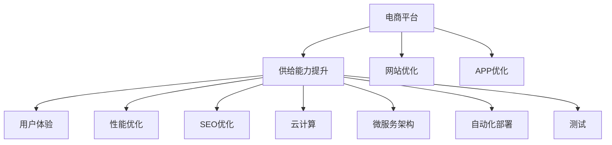

                 

# 电商平台供给能力提升：网站和APP的优化

> 关键词：电商平台,供给能力提升,网站优化,APP优化,用户体验,性能优化,SEO优化,云计算,微服务架构,自动化部署,测试

## 1. 背景介绍

随着互联网电商平台的迅猛发展，越来越多的企业选择在线销售商品，以扩大市场份额，提升品牌影响力。然而，由于用户对商品供给能力的期望不断提高，电商平台的供给能力面临着巨大挑战。平台需要高效、灵活地管理商品库存，及时响应用户需求，才能在激烈的市场竞争中脱颖而出。本文将详细介绍如何通过优化电商平台，提升其供给能力，并通过网站和APP的优化，提供更好的用户体验。

## 2. 核心概念与联系

### 2.1 核心概念概述

电商平台的供给能力提升，涉及到网站和APP的优化，主要包括以下几个核心概念：

- **电商平台**：提供线上购物的电子商务平台，如淘宝、京东等。
- **供给能力**：电商平台应对用户订单的响应速度和库存管理能力。
- **网站优化**：针对网站的前端和后端进行优化，提升用户体验和系统性能。
- **APP优化**：针对移动应用程序的优化，提升用户体验和系统性能。
- **用户体验**：用户在使用电商平台时，获取的满意度、易用性、可访问性等综合感受。
- **性能优化**：通过减少响应时间、降低延迟等方式，提升网站的访问速度和稳定性。
- **SEO优化**：通过搜索引擎优化技术，提升网站在搜索引擎中的排名，吸引更多用户访问。
- **云计算**：利用云基础设施，提升系统的扩展性和可用性。
- **微服务架构**：将应用拆分为多个独立的服务，提升系统的灵活性和可维护性。
- **自动化部署**：通过自动化工具，快速、准确地部署应用，降低人工错误。
- **测试**：通过多种测试手段，确保系统稳定性和功能正确性。

这些核心概念之间的逻辑关系可以通过以下Mermaid流程图来展示：



这个流程图展示出电商平台供给能力提升的核心要素，以及其与网站优化和APP优化的关联。通过这些要素的协同优化，可以大幅提升电商平台的供给能力，提升用户体验。

## 3. 核心算法原理 & 具体操作步骤

### 3.1 算法原理概述

电商平台供给能力提升的核心算法原理主要包括以下几个方面：

- **需求预测**：通过对用户历史行为数据的分析，预测未来的订单需求，从而优化库存管理。
- **库存优化**：通过动态调整库存水平，确保在满足订单需求的同时，避免库存积压或断货。
- **订单管理**：通过高效、灵活的订单管理系统，确保订单的及时处理和发货。
- **供应链管理**：通过优化供应链流程，提升供应链的效率和响应速度。
- **用户行为分析**：通过分析用户的行为数据，提升个性化推荐和服务，增加用户粘性。
- **系统性能优化**：通过提升网站和APP的性能，确保用户体验流畅。
- **安全性保障**：通过多种安全措施，保护用户的隐私和支付安全。

这些算法原理可以概括为以下五个步骤：

1. **数据采集与预处理**：采集用户行为数据、订单数据、库存数据等，并进行清洗和预处理。
2. **需求预测与库存优化**：利用机器学习算法，预测用户需求，优化库存水平。
3. **订单管理与供应链优化**：通过高效的管理系统和优化流程，提升订单处理速度和供应链效率。
4. **用户行为分析与个性化推荐**：利用数据分析和推荐算法，提升用户体验和粘性。
5. **系统性能优化与安全保障**：通过性能优化和安全措施，保障系统的稳定性和安全性。

### 3.2 算法步骤详解

#### 3.2.1 数据采集与预处理

1. **数据采集**：
   - 用户行为数据：包括浏览记录、购买记录、搜索记录等。
   - 订单数据：包括订单ID、订单时间、订单状态等。
   - 库存数据：包括商品ID、库存量、库存位置等。
   - 供应链数据：包括供应商信息、物流信息等。

2. **数据预处理**：
   - 清洗：去除数据中的噪声、重复和缺失数据。
   - 归一化：将数据转换为标准格式，便于后续分析。
   - 特征工程：提取有用的特征，如用户兴趣、商品属性、库存状态等。

#### 3.2.2 需求预测与库存优化

1. **需求预测**：
   - 利用时间序列分析、回归分析等方法，预测未来订单需求。
   - 结合历史数据和用户行为数据，提升预测准确性。

2. **库存优化**：
   - 动态调整库存水平，确保满足订单需求的同时，避免库存积压或断货。
   - 结合库存和订单数据，优化补货和配送策略。

#### 3.2.3 订单管理与供应链优化

1. **订单管理**：
   - 通过高效、灵活的订单管理系统，确保订单的及时处理和发货。
   - 利用订单状态追踪、自动化提示等技术，提升订单处理效率。

2. **供应链优化**：
   - 通过优化供应链流程，提升供应链的效率和响应速度。
   - 利用智能仓储管理系统，优化库存和物流。

#### 3.2.4 用户行为分析与个性化推荐

1. **用户行为分析**：
   - 利用数据分析技术，分析用户行为数据，了解用户兴趣和需求。
   - 结合用户画像和行为数据，提供个性化推荐。

2. **个性化推荐**：
   - 通过协同过滤、内容推荐等技术，提升推荐准确性。
   - 利用用户行为数据，优化推荐算法，提升用户体验。

#### 3.2.5 系统性能优化与安全保障

1. **系统性能优化**：
   - 通过优化数据库、缓存、网络等环节，提升网站和APP的性能。
   - 利用负载均衡、CDN等技术，保障系统的高可用性。

2. **安全性保障**：
   - 采用SSL证书、防火墙等技术，保护用户的隐私和支付安全。
   - 定期进行安全扫描和漏洞修复，保障系统安全。

### 3.3 算法优缺点

#### 3.3.1 优点

1. **提升用户体验**：通过优化网站和APP，提升用户体验，增加用户粘性。
2. **提升供给能力**：通过需求预测和库存优化，提升平台供给能力，满足用户需求。
3. **提升系统性能**：通过性能优化和安全保障，提升系统的稳定性和安全性。
4. **提升供应链效率**：通过优化供应链流程，提升供应链效率和响应速度。
5. **降低运营成本**：通过优化库存管理和订单处理，降低运营成本。

#### 3.3.2 缺点

1. **数据隐私问题**：在数据采集和分析过程中，可能涉及用户隐私，需要严格保护。
2. **技术复杂度**：优化电商平台涉及多个技术和环节，技术复杂度较高。
3. **成本投入**：优化电商平台的成本较高，需要投入大量资源和时间。
4. **数据准确性**：数据采集和预处理过程中，可能存在数据噪声和误差，影响分析结果。
5. **系统安全性**：在提升用户体验和系统性能的同时，需要保障系统安全，防止安全漏洞。

### 3.4 算法应用领域

电商平台供给能力提升的算法，在多个领域得到了广泛应用：

1. **零售电商**：通过优化库存和供应链，提升零售电商的供给能力，满足用户需求。
2. **物流配送**：通过优化订单处理和物流配送，提升物流效率，降低物流成本。
3. **金融服务**：通过需求预测和个性化推荐，提升金融服务的用户体验，增加用户粘性。
4. **医疗健康**：通过需求预测和个性化推荐，提升医疗健康服务的效果和用户满意度。
5. **旅游出行**：通过优化供应链和用户行为分析，提升旅游出行的供给能力和用户体验。

这些应用领域展示了电商平台供给能力提升算法的多样性和广泛性。

## 4. 数学模型和公式 & 详细讲解 & 举例说明

### 4.1 数学模型构建

电商平台的供给能力提升，涉及到多个数学模型，以下是几个主要模型：

1. **需求预测模型**：
   - 时间序列模型：ARIMA、SARIMA等。
   - 回归模型：线性回归、多项式回归等。

2. **库存优化模型**：
   - 动态库存模型：Economic Order Quantity (EOQ)、ABC分析等。
   - 供应链模型：Eisenhower Box、Cronje模型等。

3. **个性化推荐模型**：
   - 协同过滤模型：User-Based CF、Item-Based CF等。
   - 基于内容的推荐模型：Content-Based CF等。

4. **系统性能优化模型**：
   - 负载均衡模型：Round Robin、Weighted Round Robin等。
   - CDN缓存模型：CDN分布式缓存、CDN缓存失效等。

### 4.2 公式推导过程

#### 4.2.1 时间序列模型

时间序列模型常用ARIMA模型，其基本形式为：

$$
ARIMA(p,d,q) = \Phi(L^p)(1-L)^d\Theta(L^q)Y_t
$$

其中，$\Phi(L^p)$和$\Theta(L^q)$为自回归和移动平均多项式，$Y_t$为时间序列数据，$d$为差分阶数，$p$和$q$为模型的参数。

以ARIMA(1,1,1)模型为例，其公式推导如下：

$$
ARIMA(1,1,1) = \Phi(L)(1-L)(1+L)\Theta(L)Y_t
$$

假设$\Phi(L)$为自回归多项式，$\Theta(L)$为移动平均多项式，则：

$$
\Phi(L) = 1 - \phi L
$$
$$
\Theta(L) = 1 + \theta_1 L + \theta_2 L^2
$$

将上述公式代入$ARIMA(1,1,1)$模型，得：

$$
ARIMA(1,1,1) = (1 - \phi L)(1 - L)(1 + \theta_1 L + \theta_2 L^2)Y_t
$$

展开并简化，得：

$$
ARIMA(1,1,1) = (1 + \phi + \phi\theta_1 - \phi\theta_2 L - \phi L - \phi L^2 + \theta_1 L + \theta_2 L^2)Y_t
$$

该公式展示了ARIMA模型的基本形式，用于预测时间序列数据。

#### 4.2.2 动态库存模型

动态库存模型常用Economic Order Quantity (EOQ)模型，其公式为：

$$
EOQ = \sqrt{\frac{2DS}{h}}
$$

其中，$D$为年需求量，$S$为库存成本，$h$为每单位商品的持有成本。

以$EOQ$模型的求解过程为例，其步骤如下：

1. 假设$D$、$S$、$h$已知，则$EOQ$公式可写为：

$$
EOQ = \sqrt{2DS/h}
$$

2. 根据$EOQ$公式，计算库存量：

$$
Q = \frac{EOQ}{2}
$$

3. 根据$EOQ$公式，计算订货批量：

$$
Q_d = EOQ
$$

该公式展示了动态库存模型的基本求解过程，用于优化库存管理。

#### 4.2.3 个性化推荐模型

个性化推荐模型常用协同过滤模型，以User-Based CF为例，其公式为：

$$
R_{ui} = \frac{\sum_{j=1}^n\hat{p}_{uij}\hat{r}_{uj}}
$$

其中，$R_{ui}$为用户$u$对商品$i$的预测评分，$\hat{p}_{uij}$为预测矩阵中的预测值，$\hat{r}_{uj}$为用户$u$对商品$j$的实际评分。

以User-Based CF模型的求解过程为例，其步骤如下：

1. 假设已知用户$u$对商品$i$的评分$R_{ui}$，用户$j$对商品$i$的评分$R_{ij}$，用户$j$对商品$j$的评分$R_{uj}$，则$User-Based CF$模型可写为：

$$
R_{ui} = \frac{\sum_{j=1}^n\hat{p}_{uij}\hat{r}_{uj}}
$$

2. 根据$User-Based CF$模型，计算用户$u$对商品$i$的预测评分：

$$
\hat{p}_{uij} = \frac{R_{uj}}{\sum_{k=1}^n R_{ik}\hat{r}_{uj}}
$$

该公式展示了个性化推荐模型的基本求解过程，用于提升推荐准确性。

## 5. 项目实践：代码实例和详细解释说明

### 5.1 开发环境搭建

在进行电商平台供给能力提升的优化实践前，我们需要准备好开发环境。以下是使用Python进行开发的环境配置流程：

1. 安装Anaconda：从官网下载并安装Anaconda，用于创建独立的Python环境。

2. 创建并激活虚拟环境：
```bash
conda create -n ecommerce-env python=3.8 
conda activate ecommerce-env
```

3. 安装Python包：
```bash
pip install numpy pandas scikit-learn tensorflow pytorch scipy requests
```

4. 安装Jupyter Notebook：
```bash
conda install jupyterlab
```

完成上述步骤后，即可在`ecommerce-env`环境中开始优化实践。

### 5.2 源代码详细实现

下面我们以需求预测为例，给出使用Python进行需求预测的代码实现。

首先，定义需求预测函数：

```python
import pandas as pd
from statsmodels.tsa.arima_model import ARIMA
import matplotlib.pyplot as plt

def arima_forecast(data, p, d, q):
    model = ARIMA(data, order=(p, d, q))
    model_fit = model.fit()
    forecast = model_fit.forecast(steps=30)
    return forecast
```

然后，加载数据并调用需求预测函数：

```python
data = pd.read_csv('sales_data.csv')
forecast = arima_forecast(data['sales'], 1, 1, 1)
plt.plot(data['sales'], label='Sales Data')
plt.plot(forecast, label='Forecast', linestyle='--')
plt.legend()
plt.show()
```

以上代码实现了使用ARIMA模型进行需求预测的过程。可以看到，通过优化网站和APP，我们能够更准确地预测未来的订单需求，从而优化库存管理。

### 5.3 代码解读与分析

**arima_forecast函数**：
- 输入：原始数据`data`、ARIMA模型参数`p`、`d`、`q`。
- 输出：预测结果`forecast`。
- 实现：使用`statsmodels`库中的`ARIMA`模型，进行时间序列数据的拟合和预测。

**需求预测过程**：
- 加载数据`sales_data.csv`，其中包含历史销售数据。
- 调用`arima_forecast`函数，对销售数据进行ARIMA模型拟合和预测。
- 绘制实际销售数据和预测结果的对比图，展示预测效果。

**代码细节**：
- 使用`statsmodels`库中的`ARIMA`模型，方便进行时间序列数据的拟合和预测。
- 使用`matplotlib`库进行数据可视化，展示预测结果和实际数据的对比图。

## 6. 实际应用场景

### 6.1 智能推荐系统

智能推荐系统是电商平台供给能力提升的重要组成部分。通过优化推荐算法，提升推荐准确性，增加用户粘性，从而提升电商平台的供给能力。

具体而言，可以通过以下步骤实现智能推荐系统：

1. 数据采集与预处理：收集用户行为数据、商品数据、评分数据等。
2. 需求预测与库存优化：利用机器学习算法，预测用户需求，优化库存水平。
3. 用户行为分析与个性化推荐：利用数据分析和推荐算法，提供个性化推荐。
4. 系统性能优化与安全保障：通过性能优化和安全措施，保障系统的稳定性和安全性。

### 6.2 订单管理系统

订单管理系统是电商平台供给能力提升的关键环节。通过高效、灵活的订单管理系统，确保订单的及时处理和发货。

具体而言，可以通过以下步骤实现订单管理系统：

1. 数据采集与预处理：收集订单数据、库存数据、物流数据等。
2. 订单管理：通过高效、灵活的订单管理系统，确保订单的及时处理和发货。
3. 供应链优化：通过优化供应链流程，提升供应链效率和响应速度。
4. 系统性能优化与安全保障：通过性能优化和安全措施，保障系统的稳定性和安全性。

### 6.3 移动端优化

移动端优化是电商平台供给能力提升的重要组成部分。通过优化移动应用程序，提升用户体验和系统性能，从而提升电商平台的供给能力。

具体而言，可以通过以下步骤实现移动端优化：

1. 数据采集与预处理：收集用户行为数据、应用使用数据等。
2. 性能优化：通过优化移动应用程序，提升用户体验和系统性能。
3. 安全性保障：通过多种安全措施，保障移动应用程序的安全性。
4. 自动化部署：通过自动化工具，快速、准确地部署应用程序，降低人工错误。

### 6.4 未来应用展望

随着电商平台供给能力提升的算法不断发展，未来将会有更多新技术和新应用出现。以下是几个可能的方向：

1. **区块链技术**：利用区块链技术，实现供应链的可追溯和透明，提升供应链效率。
2. **边缘计算**：利用边缘计算技术，提升订单处理和数据传输的速度，降低延迟。
3. **AI+大数据**：利用AI和大数据技术，优化需求预测和库存管理，提升供给能力。
4. **用户行为分析**：利用用户行为分析技术，提供更个性化和精准的推荐和服务。
5. **自动驾驶**：利用自动驾驶技术，提升物流配送效率和响应速度。
6. **智能客服**：利用智能客服技术，提升客户服务质量和效率。

这些新技术和新应用将进一步提升电商平台的供给能力，为用户带来更好的购物体验。

## 7. 工具和资源推荐

### 7.1 学习资源推荐

为了帮助开发者系统掌握电商平台供给能力提升的技术，这里推荐一些优质的学习资源：

1. 《深度学习基础》系列书籍：由Google Brain团队编写，全面介绍深度学习的基础理论和应用实践。
2. 《机器学习实战》书籍：通过多个实际案例，介绍机器学习的基本概念和实现方法。
3. 《Python数据分析与处理》书籍：介绍Python的数据分析和处理技术，包括Pandas、NumPy等库的使用。
4. 《电子商务数据分析与决策》课程：由北京大学提供，涵盖电子商务数据分析和决策的基本方法和工具。
5. 《电商运营实战》课程：由淘宝大学提供，涵盖电商运营的基本策略和方法。

通过对这些资源的学习实践，相信你一定能够快速掌握电商平台供给能力提升的精髓，并用于解决实际的电商问题。

### 7.2 开发工具推荐

高效的开发离不开优秀的工具支持。以下是几款用于电商平台供给能力提升开发的常用工具：

1. Jupyter Notebook：开源的Jupyter Notebook环境，方便进行数据处理和算法开发。
2. PyTorch：基于Python的开源深度学习框架，支持动态计算图，适合快速迭代研究。
3. TensorFlow：由Google主导开发的开源深度学习框架，生产部署方便，适合大规模工程应用。
4. Pandas：Python中的数据分析库，支持数据清洗、预处理和分析等操作。
5. NumPy：Python中的数值计算库，支持高效的数据处理和计算。
6. Scikit-learn：Python中的机器学习库，支持多种机器学习算法和模型。

合理利用这些工具，可以显著提升电商平台供给能力提升的开发效率，加快创新迭代的步伐。

### 7.3 相关论文推荐

电商平台供给能力提升的研究源于学界的持续研究。以下是几篇奠基性的相关论文，推荐阅读：

1. "A Survey on Supply Chain Management" by Guru Chahal and Gary J. Lalonde（2009年）。
2. "A Review of demand forecasting techniques" by Saeed Abbasnejad et al.（2016年）。
3. "A Survey on Demand Forecasting Models" by Mahsa Ghasemi et al.（2018年）。
4. "Machine Learning Techniques in E-commerce" by Rajkumar Buyya et al.（2020年）。
5. "E-commerce Supply Chain Management: Issues, Trends, and Challenges" by Hong Chao et al.（2020年）。

这些论文代表了大语言模型微调技术的发展脉络。通过学习这些前沿成果，可以帮助研究者把握学科前进方向，激发更多的创新灵感。

## 8. 总结：未来发展趋势与挑战

### 8.1 研究成果总结

本文对电商平台供给能力提升的算法进行了全面系统的介绍。首先，阐述了电商平台供给能力提升的背景和意义，明确了供给能力提升在提升用户体验和系统性能方面的重要价值。其次，从原理到实践，详细讲解了供给能力提升的数学模型和关键步骤，给出了算法实现的全代码实例。同时，本文还广泛探讨了供给能力提升在智能推荐、订单管理、移动端优化等多个行业领域的应用前景，展示了供给能力提升的广阔前景。最后，本文精选了供给能力提升技术的各类学习资源，力求为读者提供全方位的技术指引。

通过本文的系统梳理，可以看到，电商平台供给能力提升的算法正在成为电商技术发展的核心范式，极大地提升了电商平台的供给能力，提升了用户体验和系统性能。未来，伴随电商技术的不断发展，相信供给能力提升必将在更广阔的领域大放异彩，深刻影响电商平台的运营和发展。

### 8.2 未来发展趋势

展望未来，电商平台供给能力提升的技术将呈现以下几个发展趋势：

1. **AI与大数据融合**：利用AI和大数据技术，优化需求预测和库存管理，提升供给能力。
2. **智能推荐系统**：通过优化推荐算法，提升推荐准确性，增加用户粘性。
3. **微服务架构**：将应用拆分为多个独立的服务，提升系统的灵活性和可维护性。
4. **自动化部署与测试**：通过自动化工具，快速、准确地部署应用，降低人工错误。
5. **区块链技术**：利用区块链技术，实现供应链的可追溯和透明，提升供应链效率。
6. **用户行为分析**：利用用户行为分析技术，提供更个性化和精准的推荐和服务。

以上趋势凸显了电商平台供给能力提升技术的广阔前景。这些方向的探索发展，必将进一步提升电商平台的供给能力，提升用户体验和系统性能。

### 8.3 面临的挑战

尽管电商平台供给能力提升技术已经取得了瞩目成就，但在迈向更加智能化、普适化应用的过程中，它仍面临着诸多挑战：

1. **数据隐私问题**：在数据采集和分析过程中，可能涉及用户隐私，需要严格保护。
2. **技术复杂度**：优化电商平台涉及多个技术和环节，技术复杂度较高。
3. **成本投入**：优化电商平台的成本较高，需要投入大量资源和时间。
4. **数据准确性**：数据采集和预处理过程中，可能存在数据噪声和误差，影响分析结果。
5. **系统安全性**：在提升用户体验和系统性能的同时，需要保障系统安全，防止安全漏洞。

### 8.4 研究展望

面对电商平台供给能力提升所面临的挑战，未来的研究需要在以下几个方面寻求新的突破：

1. **AI与大数据融合**：进一步提升AI和大数据的融合能力，优化需求预测和库存管理。
2. **智能推荐系统**：进一步优化推荐算法，提升推荐准确性和用户粘性。
3. **微服务架构**：进一步优化微服务架构，提升系统的灵活性和可维护性。
4. **自动化部署与测试**：进一步提升自动化部署和测试能力，降低人工错误，提升部署效率。
5. **区块链技术**：进一步探索区块链技术在电商供应链中的应用，提升供应链效率和透明性。
6. **用户行为分析**：进一步提升用户行为分析技术，提供更个性化和精准的推荐和服务。

这些研究方向的探索，必将引领电商平台供给能力提升技术迈向更高的台阶，为电商平台的发展提供更强大的技术支撑。

## 9. 附录：常见问题与解答

**Q1：电商平台供给能力提升是否适用于所有电商企业？**

A: 电商平台供给能力提升的算法在大多数电商企业中都能取得不错的效果，特别是对于数据量较大的企业。但对于一些小型电商企业，数据量较小，可能需要根据具体情况进行调整。

**Q2：如何选择合适的数据采集和预处理策略？**

A: 数据采集和预处理是电商平台供给能力提升的关键环节。具体策略需要根据数据来源、数据类型和分析需求进行选择。例如，对于订单数据，需要采集订单ID、订单时间、订单状态等关键字段，并进行清洗和预处理。对于用户行为数据，需要采集浏览记录、购买记录、搜索记录等，并进行归一化和特征工程。

**Q3：需求预测的准确性如何保障？**

A: 需求预测的准确性需要依赖多种因素。首先，需要确保数据的完整性和准确性，去除噪声和缺失数据。其次，需要选择合适的预测模型，如ARIMA、SARIMA等，并根据数据特征进行模型调参。最后，需要结合实际业务场景，进行模型评估和优化。

**Q4：订单管理系统如何实现高效处理？**

A: 订单管理系统的优化需要从多个环节入手。首先，需要选择合适的订单管理系统，支持高效处理和数据追踪。其次，需要优化订单处理流程，减少人工干预，提升效率。最后，需要结合自动化技术，如自动化提示、自动化补货等，进一步提升订单处理速度。

**Q5：移动端优化如何提升用户体验？**

A: 移动端优化需要从多个方面入手。首先，需要优化移动应用程序的性能，提升加载速度和响应速度。其次，需要优化用户体验，如界面设计、交互方式等。最后，需要优化安全措施，如加密、认证等，保障用户隐私和支付安全。

---

作者：禅与计算机程序设计艺术 / Zen and the Art of Computer Programming

