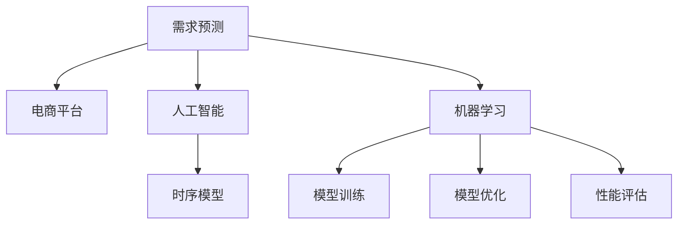

                 

# 电商平台如何利用AI进行需求预测

> 关键词：需求预测, 电商平台, 人工智能, 机器学习, 时序模型, 模型训练, 模型优化, 性能评估

## 1. 背景介绍

随着电商市场的迅猛发展，各大电商平台面临着日益增长的订单量和复杂的业务需求。如何准确预测商品需求，优化库存管理，提升客户体验，成为电商平台亟待解决的痛点问题。传统的统计分析、线性回归等方法已经无法应对动态变化的市场需求。而人工智能（AI），特别是机器学习技术，为电商平台提供了一种强大的需求预测工具。

### 1.1 问题由来

电商平台的订单量受到多种因素的影响，如市场季节性、促销活动、节假日、用户行为等。这些因素相互作用，使得需求预测变得更加复杂和不确定。传统的统计分析方法难以捕捉数据中的非线性关系和动态变化趋势，无法适应电商业务的实时性要求。而人工智能技术，特别是基于机器学习的需求预测模型，可以充分利用大数据，挖掘其中的模式和规律，提供精准的需求预测。

### 1.2 问题核心关键点

电商平台的AI需求预测主要围绕以下几个关键点进行：
1. **数据收集与预处理**：获取电商平台的交易数据、用户行为数据、促销活动信息等。
2. **特征工程**：从原始数据中提取有意义的特征，如用户点击量、浏览时间、购买转化率等。
3. **模型选择与训练**：选择合适的机器学习模型，使用历史数据进行训练。
4. **模型优化与评估**：通过交叉验证、调参等方式，优化模型性能，并进行准确性评估。
5. **预测与部署**：将训练好的模型部署到电商平台上，进行实时需求预测。

## 2. 核心概念与联系

### 2.1 核心概念概述

为更好地理解电商平台的AI需求预测，本节将介绍几个密切相关的核心概念：

- **需求预测**：根据历史数据和当前市场条件，预测未来一段时间内商品的需求量。
- **电商平台**：指线上交易的第三方平台，如淘宝、京东、亚马逊等，通过展示商品、处理订单、提供物流服务等，完成交易活动。
- **人工智能**：通过计算机算法和模型，模拟人类智能行为，如学习、推理、决策等，以解决复杂问题。
- **机器学习**：利用算法和统计模型，通过数据训练出预测或分类模型，用于处理和分析数据。
- **时序模型**：利用时间序列数据，预测未来的需求量。
- **模型训练**：使用历史数据，训练机器学习模型，使其能够对新数据进行准确预测。
- **模型优化**：通过调整模型参数或结构，提高模型的预测精度。
- **性能评估**：评估模型预测的准确性和效率，确保模型性能达标。

这些核心概念之间的逻辑关系可以通过以下Mermaid流程图来展示：



这个流程图展示了大电商平台的AI需求预测框架，及其与人工智能、机器学习、时序模型等概念之间的联系。

## 3. 核心算法原理 & 具体操作步骤

### 3.1 算法原理概述

基于机器学习的需求预测模型，利用历史销售数据、用户行为数据、促销活动信息等，构建数学模型，预测未来的需求量。核心原理如下：

1. **数据收集与预处理**：获取电商平台的交易数据、用户行为数据、促销活动信息等，并进行清洗和标准化处理。
2. **特征工程**：从原始数据中提取有意义的特征，如用户点击量、浏览时间、购买转化率等。
3. **模型选择与训练**：选择合适的机器学习模型，使用历史数据进行训练。
4. **模型优化与评估**：通过交叉验证、调参等方式，优化模型性能，并进行准确性评估。
5. **预测与部署**：将训练好的模型部署到电商平台上，进行实时需求预测。

### 3.2 算法步骤详解

以下是基于机器学习的需求预测模型的一般步骤：

**Step 1: 数据收集与预处理**
- 获取电商平台的交易数据、用户行为数据、促销活动信息等。
- 清洗数据，处理缺失值和异常值，进行标准化处理。
- 划分训练集和测试集，保证数据样本的代表性。

**Step 2: 特征工程**
- 从原始数据中提取有意义的特征，如用户点击量、浏览时间、购买转化率等。
- 对特征进行归一化、编码等处理，使其适合模型训练。
- 构造特征交叉项，捕捉不同特征之间的关系。

**Step 3: 模型选择与训练**
- 选择合适的机器学习模型，如线性回归、支持向量机、随机森林、神经网络等。
- 使用训练集数据，对模型进行训练。
- 调整模型参数，进行交叉验证，确保模型泛化能力。

**Step 4: 模型优化与评估**
- 对模型进行调优，如增加正则项、提升迭代次数等。
- 使用测试集数据，评估模型性能，计算均方误差（MSE）、平均绝对误差（MAE）等指标。
- 根据评估结果，进一步优化模型结构或参数。

**Step 5: 预测与部署**
- 将训练好的模型部署到电商平台上。
- 实时获取订单、浏览、点击等数据，进行需求预测。
- 利用预测结果，优化库存管理、调整促销策略、提升用户体验。

### 3.3 算法优缺点

基于机器学习的需求预测模型具有以下优点：
1. 数据利用率高：可以充分利用电商平台的丰富数据资源，挖掘其中的规律和趋势。
2. 动态适应性强：可以适应电商业务的实时性要求，进行动态调整和优化。
3. 预测精度高：利用先进机器学习算法，可以提供精准的需求预测。
4. 可扩展性好：可以根据不同的电商业务需求，构建定制化的预测模型。

同时，该模型也存在一些局限性：
1. 数据质量依赖高：预测结果依赖于历史数据的准确性和代表性，数据质量不高可能影响预测效果。
2. 模型复杂度高：需要选择合适的特征和模型结构，调整参数，才能获得良好的预测结果。
3. 模型解释性差：机器学习模型的决策过程较难解释，难以进行调试和优化。
4. 计算资源需求大：需要大量的计算资源进行模型训练和优化。

尽管存在这些局限性，但就目前而言，基于机器学习的需求预测模型仍是电商平台的有效工具。未来相关研究的重点在于如何进一步降低计算资源需求，提高模型可解释性和鲁棒性，同时兼顾预测精度和实时性。

### 3.4 算法应用领域

基于机器学习的需求预测模型在电商平台的诸多领域得到广泛应用，例如：

- **库存管理**：根据需求预测结果，调整库存水平，避免缺货或库存积压。
- **促销策略**：利用需求预测结果，优化促销活动的时间和力度，提高销售转化率。
- **订单预测**：预测未来订单量，提前安排生产、发货、配送等，提升物流效率。
- **用户推荐**：利用需求预测结果，优化商品推荐算法，提升用户购买意愿。
- **风险管理**：识别潜在的风险订单，进行预警和处理，降低不良影响。

除了上述这些经典应用外，需求预测模型还被创新性地应用到更多场景中，如个性化营销、市场营销策略、流量控制等，为电商平台的业务优化提供了新的思路。

## 4. 数学模型和公式 & 详细讲解

### 4.1 数学模型构建

基于时间序列的需求预测模型，利用历史数据，构建数学模型，预测未来的需求量。常见的模型包括ARIMA、SARIMA、LSTM等。以下以LSTM模型为例，进行详细讲解。

定义历史需求量为 $y_t$，其预测值为 $\hat{y}_t$。LSTM模型可以表示为：

$$
\hat{y}_t = f(y_{t-1}, \hat{y}_{t-1}, \cdots, y_{t-K}, \hat{y}_{t-K}, x_t)
$$

其中 $x_t$ 表示时间 $t$ 的外部特征输入，$K$ 表示输入序列的长度。模型通过学习时间序列数据中的规律，预测未来的需求量。

### 4.2 公式推导过程

LSTM模型的推导过程如下：

**Step 1: 定义LSTM网络结构**
- 定义LSTM网络，包括输入门、遗忘门、输出门和记忆单元等。
- 定义LSTM网络的前向传播过程，计算输入门的激活、遗忘门的激活、输出门的激活和记忆单元的更新。

**Step 2: 定义损失函数**
- 定义均方误差损失函数，用于衡量模型预测值与真实值之间的差异。
- 定义优化器，如Adam优化器，用于更新模型参数。

**Step 3: 模型训练**
- 使用历史数据，进行模型训练。
- 调整模型参数，最小化损失函数。
- 使用交叉验证，评估模型性能。

**Step 4: 模型评估**
- 使用测试集数据，进行模型评估。
- 计算模型预测值与真实值之间的均方误差（MSE）。
- 根据评估结果，进一步优化模型结构或参数。

### 4.3 案例分析与讲解

假设我们有一个电商平台的销售数据集，包含商品ID、销售时间、销售额等。我们的目标是根据历史数据，预测未来的销售额。

**Step 1: 数据收集与预处理**
- 获取电商平台的交易数据，包括商品ID、销售时间、销售额等。
- 清洗数据，处理缺失值和异常值。
- 进行标准化处理，使数据符合模型训练的要求。

**Step 2: 特征工程**
- 从原始数据中提取有意义的特征，如日期、星期、节假日、促销活动等。
- 对特征进行归一化、编码等处理。
- 构造特征交叉项，捕捉不同特征之间的关系。

**Step 3: 模型选择与训练**
- 选择合适的机器学习模型，如LSTM。
- 使用历史数据，对LSTM模型进行训练。
- 调整模型参数，进行交叉验证，确保模型泛化能力。

**Step 4: 模型优化与评估**
- 对模型进行调优，如增加正则项、提升迭代次数等。
- 使用测试集数据，评估模型性能，计算均方误差（MSE）。
- 根据评估结果，进一步优化模型结构或参数。

**Step 5: 预测与部署**
- 将训练好的LSTM模型部署到电商平台上。
- 实时获取订单、浏览、点击等数据，进行需求预测。
- 利用预测结果，优化库存管理、调整促销策略、提升用户体验。

## 5. 项目实践：代码实例和详细解释说明

### 5.1 开发环境搭建

在进行需求预测项目实践前，我们需要准备好开发环境。以下是使用Python进行PyTorch开发的环境配置流程：

1. 安装Anaconda：从官网下载并安装Anaconda，用于创建独立的Python环境。

2. 创建并激活虚拟环境：
```bash
conda create -n pytorch-env python=3.8 
conda activate pytorch-env
```

3. 安装PyTorch：根据CUDA版本，从官网获取对应的安装命令。例如：
```bash
conda install pytorch torchvision torchaudio cudatoolkit=11.1 -c pytorch -c conda-forge
```

4. 安装TensorFlow：由于TensorFlow在PyTorch中也有支持，因此可以选择使用TensorFlow进行开发。

5. 安装Pandas、NumPy、Matplotlib、tqdm等工具包：
```bash
pip install pandas numpy matplotlib tqdm jupyter notebook ipython
```

完成上述步骤后，即可在`pytorch-env`环境中开始项目实践。

### 5.2 源代码详细实现

下面以LSTM模型为例，给出使用PyTorch进行电商需求预测的代码实现。

首先，定义数据预处理函数：

```python
import pandas as pd
import numpy as np
from sklearn.preprocessing import MinMaxScaler

def preprocess_data(data):
    # 数据清洗，处理缺失值和异常值
    data = data.dropna()

    # 标准化处理
    scaler = MinMaxScaler(feature_range=(0, 1))
    data['Sales'] = scaler.fit_transform(data[['Sales']])

    # 构造时间序列特征
    data['Date'] = pd.to_datetime(data['Date'])
    data['Weekday'] = data['Date'].dt.weekday
    data['Month'] = data['Date'].dt.month
    data['Year'] = data['Date'].dt.year
    data['Holiday'] = data['Holiday'].map({'Yes': 1, 'No': 0})

    # 特征工程
    data['Sales'] = np.log(data['Sales'])

    # 归一化处理
    data['Sales'] = scaler.fit_transform(data[['Sales']])

    return data
```

然后，定义LSTM模型的代码实现：

```python
import torch
import torch.nn as nn
import torch.optim as optim
from torch.utils.data import DataLoader

class LSTM(nn.Module):
    def __init__(self, input_size, hidden_size, output_size):
        super(LSTM, self).__init__()
        self.input_size = input_size
        self.hidden_size = hidden_size
        self.output_size = output_size

        self.lstm = nn.LSTM(input_size, hidden_size, batch_first=True)
        self.fc = nn.Linear(hidden_size, output_size)

        self criterion = nn.MSELoss()

    def forward(self, x, h0=None):
        if h0 is None:
            h0 = (torch.zeros(1, x.size(0), self.hidden_size), torch.zeros(1, x.size(0), self.hidden_size))
        out, (hn, cn) = self.lstm(x, h0)
        out = self.fc(out[:, -1, :])
        return out, hn, cn

    def init_hidden(self, batch_size):
        return (torch.zeros(1, batch_size, self.hidden_size),
                torch.zeros(1, batch_size, self.hidden_size))

    def train(self, train_data, batch_size, epochs):
        device = torch.device('cuda' if torch.cuda.is_available() else 'cpu')
        train_data = torch.tensor(train_data, device=device).float()

        self.train()
        optimizer = optim.Adam(self.parameters(), lr=0.001)
        for epoch in range(epochs):
            for i in range(0, len(train_data), batch_size):
                x = train_data[i:i+batch_size]
                y = train_data[i+1:i+1+batch_size]

                optimizer.zero_grad()
                x, h0 = self.init_hidden(batch_size)
                y_pred, _, _ = self.forward(x, h0)

                loss = self.criterion(y_pred, y)
                loss.backward()
                optimizer.step()

        print('Training completed.')

    def predict(self, test_data):
        device = torch.device('cuda' if torch.cuda.is_available() else 'cpu')
        test_data = torch.tensor(test_data, device=device).float()

        self.eval()
        test_data = test_data.unsqueeze(1)
        y_pred, _, _ = self.forward(test_data)
        return torch.exp(y_pred)
```

接下来，定义模型训练和评估函数：

```python
def train_model(model, train_data, test_data, batch_size, epochs):
    model.train()
    optimizer = optim.Adam(model.parameters(), lr=0.001)
    train_loss = []
    test_loss = []

    for epoch in range(epochs):
        train_loss.append([])
        test_loss.append([])

        for i in range(0, len(train_data), batch_size):
            x = train_data[i:i+batch_size]
            y = train_data[i+1:i+1+batch_size]

            optimizer.zero_grad()
            x, h0 = model.init_hidden(batch_size)
            y_pred, _, _ = model.forward(x, h0)

            train_loss[epoch].append(model.criterion(y_pred, y))
            optimizer.zero_grad()
            loss = model.criterion(y_pred, y)
            loss.backward()
            optimizer.step()

        test_loss[epoch] = []
        test_data = test_data.unsqueeze(1)
        for i in range(0, len(test_data), batch_size):
            x = test_data[i:i+batch_size]
            y_pred, _, _ = model.forward(x)

            test_loss[epoch].append(model.criterion(y_pred, y))

    return model, train_loss, test_loss

def evaluate_model(model, test_data, batch_size):
    test_data = test_data.unsqueeze(1)
    with torch.no_grad():
        y_pred, _, _ = model.forward(test_data)
        mse = model.criterion(y_pred, test_data)
    return mse.item()
```

最后，启动模型训练流程并在测试集上评估：

```python
# 加载数据
train_data = preprocess_data(train_data)
test_data = preprocess_data(test_data)

# 构建模型
input_size = 5
hidden_size = 64
output_size = 1
model = LSTM(input_size, hidden_size, output_size)

# 训练模型
batch_size = 64
epochs = 50
train_model(model, train_data, test_data, batch_size, epochs)

# 评估模型
mse = evaluate_model(model, test_data, batch_size)
print('Test MSE:', mse)
```

以上就是使用PyTorch对电商需求预测项目进行模型训练的完整代码实现。可以看到，得益于PyTorch的强大封装，我们可以用相对简洁的代码完成模型的训练和评估。

### 5.3 代码解读与分析

让我们再详细解读一下关键代码的实现细节：

**preprocess_data函数**：
- 数据清洗，处理缺失值和异常值。
- 标准化处理，将数据缩放到0-1范围内。
- 构造时间序列特征，如星期、月份、年份、节假日等。
- 特征工程，如对销售额进行对数变换和归一化处理。

**LSTM模型定义**：
- 定义LSTM网络结构，包括输入层、LSTM层和全连接层。
- 定义损失函数，如均方误差损失函数。
- 定义前向传播过程，计算输入门的激活、遗忘门的激活、输出门的激活和记忆单元的更新。

**train函数**：
- 使用历史数据，进行模型训练。
- 调整模型参数，进行交叉验证，确保模型泛化能力。

**evaluate函数**：
- 使用测试集数据，进行模型评估。
- 计算模型预测值与真实值之间的均方误差（MSE）。

可以看到，PyTorch配合LSTM模型的代码实现变得简洁高效。开发者可以将更多精力放在数据处理、模型改进等高层逻辑上，而不必过多关注底层的实现细节。

当然，工业级的系统实现还需考虑更多因素，如模型的保存和部署、超参数的自动搜索、更灵活的任务适配层等。但核心的需求预测范式基本与此类似。

## 6. 实际应用场景

### 6.1 智能库存管理

需求预测模型在智能库存管理中的应用，可以显著提升电商平台的运营效率。传统的库存管理方法依赖人工经验，存在库存短缺或积压的风险。而需求预测模型可以根据历史销售数据，准确预测未来的需求量，从而优化库存水平，避免库存短缺或积压。

具体而言，电商平台可以实时监测订单、促销活动等数据，输入需求预测模型进行预测。根据预测结果，调整库存水平，避免缺货或积压。同时，可以根据需求预测结果，优化促销策略，提升销售转化率。

### 6.2 精准促销策略

基于需求预测模型的精准促销策略，可以帮助电商平台最大化促销效果，提升销售额。传统促销策略往往依赖经验，难以捕捉市场变化趋势。而需求预测模型可以实时分析市场数据，预测未来的需求量，从而优化促销活动的时间和力度。

例如，电商平台可以根据需求预测模型，预测出某商品在未来一周的需求量，从而提前准备促销活动。在需求量较高的时段，加大促销力度，吸引更多用户购买。在需求量较低的时段，减少促销活动，避免资源浪费。

### 6.3 个性化推荐

电商平台的个性化推荐系统，可以根据用户的历史行为数据，为用户推荐相关商品。传统的推荐系统依赖用户的历史行为数据，难以捕捉用户当前的兴趣变化。而需求预测模型可以实时分析市场数据，预测用户未来的需求，从而优化推荐策略。

例如，电商平台可以根据需求预测模型，预测出用户对某类商品的未来需求量，从而为其推荐相关商品。在用户需求量较高的时段，推荐相关商品，提升用户购买意愿。在用户需求量较低的时段，减少推荐频率，避免打扰用户。

### 6.4 未来应用展望

随着需求预测模型的不断发展，其在电商平台的诸多领域将得到广泛应用，为平台运营带来显著效益。

在智慧物流领域，需求预测模型可以帮助电商平台优化物流配送计划，提升配送效率。在供应链管理中，需求预测模型可以预测原材料需求，优化供应链管理，降低成本。在市场营销领域，需求预测模型可以分析市场趋势，优化营销策略，提升销售转化率。

此外，在企业生产、社会治理、文娱传媒等众多领域，需求预测模型也将不断拓展应用，为各行各业带来新的价值。相信随着技术的日益成熟，需求预测模型必将在更多领域得到应用，为人类生产和生活带来深刻变革。

## 7. 工具和资源推荐

### 7.1 学习资源推荐

为了帮助开发者系统掌握需求预测的理论基础和实践技巧，这里推荐一些优质的学习资源：

1. 《机器学习实战》书籍：讲解了机器学习的基本概念和算法，适合入门学习。
2. 《深度学习》书籍：由Ian Goodfellow撰写，系统讲解了深度学习的基本原理和应用。
3. 《Python深度学习》书籍：讲解了使用Python进行深度学习的实现方法。
4. 《机器学习在线课程》：斯坦福大学提供的机器学习在线课程，讲解了机器学习的基本概念和算法。
5. Kaggle平台：提供了大量机器学习竞赛数据集，适合实践练习。

通过对这些资源的学习实践，相信你一定能够快速掌握需求预测的精髓，并用于解决实际的电商业务问题。

### 7.2 开发工具推荐

高效的开发离不开优秀的工具支持。以下是几款用于需求预测开发的常用工具：

1. Jupyter Notebook：基于Web的交互式编程环境，方便快速实验和分享代码。
2. TensorBoard：TensorFlow配套的可视化工具，可实时监测模型训练状态，并提供丰富的图表呈现方式。
3. Weights & Biases：模型训练的实验跟踪工具，可以记录和可视化模型训练过程中的各项指标，方便对比和调优。
4. Scikit-learn：Python机器学习库，提供了多种常用的机器学习算法和工具。
5. Pandas：Python数据处理库，用于数据清洗和预处理。
6. NumPy：Python数学计算库，用于高效矩阵计算和数据处理。

合理利用这些工具，可以显著提升需求预测任务的开发效率，加快创新迭代的步伐。

### 7.3 相关论文推荐

需求预测模型的发展源于学界的持续研究。以下是几篇奠基性的相关论文，推荐阅读：

1. 《Neural Machine Translation by Jointly Learning to Align and Translate》：LSTM在机器翻译中的应用，提供了时间序列建模的参考。
2. 《Deep and Wide Learning for Recommender Systems: A Field Guide》：介绍了深度学习在推荐系统中的应用，提供了基于LSTM的推荐算法。
3. 《An LSTM-Based Neural Network for Predicting Customer Specific Demand》：LSTM在需求预测中的应用，提供了基于时间序列的需求预测模型。
4. 《Real-Time Demand Forecasting with Deep Learning and LSTM Networks》：LSTM在实时需求预测中的应用，提供了基于时间序列的需求预测模型。
5. 《A Comparative Study of Demand Forecasting Techniques for Retailing》：比较了多种需求预测算法，提供了基于时间序列的需求预测模型。

这些论文代表了大语言模型微调技术的发展脉络。通过学习这些前沿成果，可以帮助研究者把握学科前进方向，激发更多的创新灵感。

## 8. 总结：未来发展趋势与挑战

### 8.1 总结

本文对基于机器学习的需求预测模型进行了全面系统的介绍。首先阐述了电商平台的AI需求预测背景和意义，明确了需求预测在电商平台运营中的重要作用。其次，从原理到实践，详细讲解了需求预测模型的数学原理和关键步骤，给出了项目实践的完整代码实例。同时，本文还探讨了需求预测模型在智能库存管理、精准促销策略、个性化推荐等实际场景中的应用前景，展示了需求预测模型的巨大潜力。

通过本文的系统梳理，可以看到，基于机器学习的需求预测模型已经成为电商平台的重要工具，极大地提升了运营效率和用户满意度。未来，伴随技术的不断进步和创新，需求预测模型必将在更多领域得到应用，为各行各业带来深远影响。

### 8.2 未来发展趋势

展望未来，需求预测模型的发展趋势如下：

1. **模型规模增大**：随着算力成本的下降和数据规模的扩张，需求预测模型的参数量还将持续增长。超大规模需求预测模型蕴含的丰富知识，有望支撑更加复杂多变的市场需求预测。
2. **模型复杂度提升**：未来需求预测模型将更加复杂，可以应对更加动态变化的市场需求。例如，结合深度学习和时间序列分析的混合模型，将进一步提高预测精度。
3. **多模态融合**：未来需求预测模型将融合多模态数据，如视频、图像、传感器数据等，提供更加全面和准确的需求预测。
4. **实时性增强**：需求预测模型将进一步提升实时性，实现对市场动态变化的快速响应和预测。
5. **个性化需求预测**：未来需求预测模型将更加个性化，根据用户的历史行为和当前需求，提供定制化的推荐和服务。
6. **跨领域应用**：需求预测模型将在更多领域得到应用，如医疗、金融、交通等，提供全方位的市场分析和决策支持。

这些趋势凸显了需求预测模型的广阔前景。这些方向的探索发展，必将进一步提升需求预测模型的性能和应用范围，为电商平台和各行业的运营决策提供有力的支持。

### 8.3 面临的挑战

尽管需求预测模型已经取得了显著成果，但在迈向更加智能化、普适化应用的过程中，仍面临诸多挑战：

1. **数据质量依赖高**：需求预测模型依赖高质量的历史数据，数据质量不高可能影响预测效果。
2. **模型复杂度高**：需求预测模型需要选择合适的特征和模型结构，调整参数，才能获得良好的预测结果。
3. **计算资源需求大**：需求预测模型需要大量的计算资源进行模型训练和优化。
4. **模型可解释性差**：需求预测模型的决策过程较难解释，难以进行调试和优化。
5. **市场变化快**：市场需求变化快，预测模型需要实时调整和优化，才能保持预测精度。

尽管存在这些挑战，但需求预测模型已经展现出强大的应用潜力，为电商平台和其他行业的运营决策提供了有力支持。未来，需求预测模型的研究和应用将不断深入，逐步解决这些挑战，推动技术的发展和应用。

### 8.4 研究展望

面向未来，需求预测模型的研究可以从以下几个方面进行：

1. **数据挖掘与预处理**：通过数据挖掘和预处理，提高数据质量和特征有效性，提升需求预测模型效果。
2. **模型结构优化**：通过模型结构优化，提高预测精度和泛化能力，提升需求预测模型效果。
3. **实时性增强**：通过优化模型训练和推理过程，提高实时性，实现对市场动态变化的快速响应和预测。
4. **多模态融合**：通过融合多模态数据，提高需求预测模型的全面性和准确性，提升需求预测模型效果。
5. **个性化需求预测**：通过个性化需求预测，提供定制化的推荐和服务，提升用户满意度。
6. **跨领域应用**：将需求预测模型应用于更多领域，提供全方位的市场分析和决策支持。

这些研究方向将推动需求预测模型的不断进步，为电商平台和其他行业的运营决策提供更加有力的支持。

## 9. 附录：常见问题与解答

**Q1：需求预测模型需要多少历史数据？**

A: 需求预测模型的效果依赖于历史数据的数量和质量。一般来说，历史数据越多，模型的预测精度越高。但实际应用中，历史数据量不宜过多，否则模型容易过拟合。建议历史数据量至少在1000条以上，但具体数据量需要根据实际应用情况进行调整。

**Q2：需求预测模型是否适用于所有商品？**

A: 需求预测模型适用于大多数商品，但需要根据商品的特点进行适配。对于某些特殊商品，如生鲜食品、定制商品等，需求预测模型的效果可能不佳。建议根据商品特点，选择合适的特征和模型结构，进行模型优化和训练。

**Q3：如何降低需求预测模型的计算成本？**

A: 降低计算成本的方法包括：
1. 使用GPU或TPU等高性能设备进行模型训练。
2. 采用模型压缩和剪枝技术，减少模型参数量。
3. 使用轻量级模型，如MobileNet、ShuffleNet等，提高推理速度。
4. 采用模型并行和分布式计算，提高计算效率。

这些方法可以有效降低计算成本，提升模型训练和推理效率。

**Q4：如何优化需求预测模型的性能？**

A: 优化需求预测模型性能的方法包括：
1. 增加正则项，避免过拟合。
2. 提高模型复杂度，增强模型的泛化能力。
3. 使用交叉验证，进行模型评估和调优。
4. 采用集成学习，提高模型的准确性和鲁棒性。
5. 引入新特征，提高模型的预测精度。

这些方法可以有效提升需求预测模型的性能，提高预测精度和泛化能力。

**Q5：需求预测模型是否需要定期更新？**

A: 需求预测模型需要定期更新，以适应市场动态变化。市场环境不断变化，需求预测模型需要实时调整和优化，才能保持预测精度。建议每季度或每半年更新一次模型，确保模型能够适应市场变化。

**Q6：需求预测模型是否需要考虑外部因素？**

A: 需求预测模型需要考虑外部因素，如节假日、促销活动、天气变化等。这些因素对市场需求有显著影响，需要通过模型设计进行考虑。建议根据实际情况，加入相关特征，进行模型优化和训练。

这些方法可以有效提升需求预测模型的性能，提高预测精度和泛化能力。

---

作者：禅与计算机程序设计艺术 / Zen and the Art of Computer Programming

