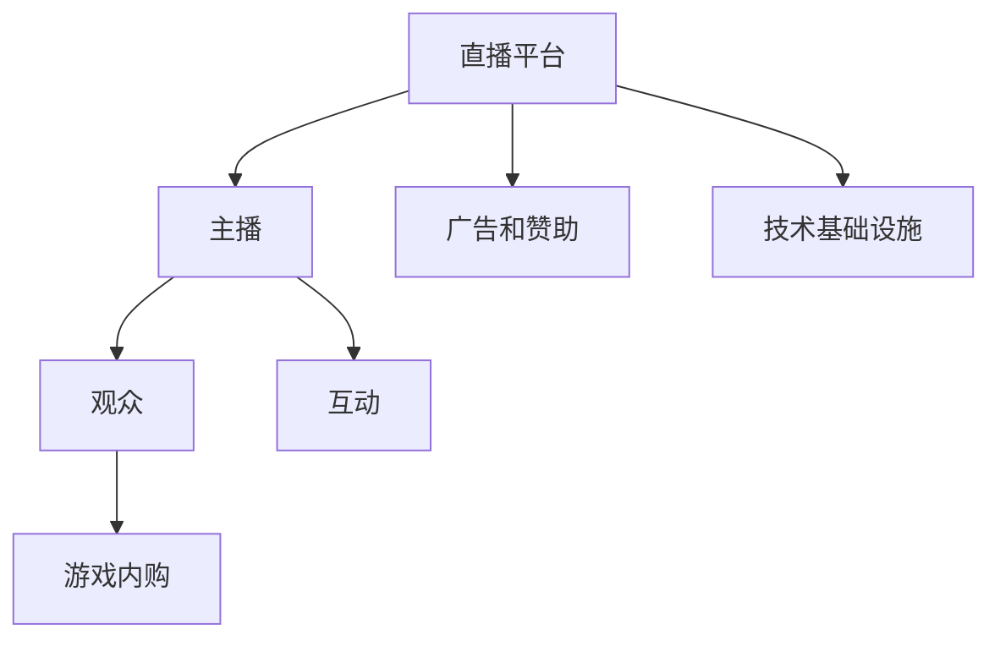

                 

# 电子竞技直播：注意力经济的典型案例

## 1. 背景介绍

### 1.1 问题由来

随着互联网和移动互联网的迅猛发展，电子竞技（eSports）作为一项全新的数字娱乐方式，凭借其高度互动性和观赏性，迅速成为全球范围内流行的数字文化现象。据统计，2021年全球电子竞技市场规模已超过13亿美元，观众规模超过5亿人，并且还在以每年20%以上的速度增长[[1]]。这一爆炸式增长背后，是一系列基于注意力经济的新商业模式。

### 1.2 问题核心关键点

电子竞技直播作为注意力经济的重要载体，其核心在于通过视频直播吸引观众的注意，并实现广告、赞助、游戏内购等多种盈利模式。尽管电子竞技直播的历史尚短，但其商业模式已经十分成熟。

- **观众关注度**：直播平台通过各种手段吸引用户观看直播，利用高关注度实现广告和品牌曝光。
- **互动性**：观众可以通过弹幕、打赏、评论等方式与主播互动，增强参与感和社区黏性。
- **广告和赞助**：平台通过直播广告和品牌赞助，将观众注意力转化为商业价值。
- **游戏内购**：观众在直播期间通过游戏内购等方式为平台贡献收入。

### 1.3 问题研究意义

研究电子竞技直播的商业模式，不仅有助于理解注意力经济的基本运作逻辑，还能为其他领域的直播平台提供有价值的借鉴。通过对电子竞技直播的研究，可以揭示高关注度背后的技术驱动力和商业逻辑，从而为视频流媒体、在线教育、体育赛事等领域提供启示。

## 2. 核心概念与联系

### 2.1 核心概念概述

在电子竞技直播中，核心概念主要包括：

- **直播平台**：如斗鱼、虎牙、哔哩哔哩等，负责提供直播内容和技术支持。
- **主播**：通过提供游戏竞技、解说到娱乐内容，吸引观众。
- **观众**：通过平台观看直播，与主播互动。
- **广告和赞助**：通过直播吸引品牌商的注意，实现商业变现。
- **游戏内购**：观众通过游戏内购等方式，为直播平台和主播贡献收入。
- **互动性**：弹幕、打赏、评论等互动形式，提升观众参与感和社区黏性。

这些概念通过直播平台的技术基础设施得以实现，形成了独特的商业模式。

### 2.2 核心概念原理和架构的 Mermaid 流程图



这张流程图展示了电子竞技直播的主要组成部分及其关系。直播平台通过提供技术基础设施，吸引主播和观众，形成互动。同时，直播平台通过广告和赞助、游戏内购等方式实现商业变现。

## 3. 核心算法原理 & 具体操作步骤

### 3.1 算法原理概述

电子竞技直播的背后，是一系列复杂的技术算法，如推荐系统、流量调度、内容分发等。其核心算法原理主要包括以下几个方面：

- **推荐系统**：通过分析观众的观看历史和互动数据，推荐主播和游戏内容。
- **流量调度**：根据主播人气和内容质量，动态调整流量分配，提升观看体验。
- **内容分发**：通过算法实现主播和观众的即时通信和互动，提升互动性。
- **数据分析**：对观众数据和互动数据进行分析，优化直播内容和策略。

### 3.2 算法步骤详解

#### 3.2.1 推荐系统

推荐系统是电子竞技直播中至关重要的技术之一。其基本步骤如下：

1. **数据采集**：收集观众的观看历史、点赞、评论、打赏等互动数据。
2. **特征提取**：将互动数据转化为特征向量，如观看时长、点赞次数、打赏金额等。
3. **模型训练**：使用机器学习模型（如协同过滤、矩阵分解等），训练推荐模型。
4. **实时推荐**：根据观众当前的观看行为和特征，实时生成推荐结果，推送给观众。

#### 3.2.2 流量调度

流量调度算法通过动态调整主播的展示位和流量分配，提升用户观看体验。其基本步骤如下：

1. **流量监测**：实时监测主播的观看人数、互动次数、设备响应时间等指标。
2. **流量评估**：根据上述指标，评估主播的综合表现。
3. **流量调整**：根据主播表现，动态调整流量分配，提升热门主播的展示位。
4. **用户反馈**：根据观众的反馈，进一步优化流量调度策略。

#### 3.2.3 内容分发

内容分发算法通过实时通信和互动，提升直播平台的互动性。其基本步骤如下：

1. **互动数据采集**：收集弹幕、评论、打赏等互动数据。
2. **实时处理**：对互动数据进行实时处理，包括过滤、分词、情感分析等。
3. **互动推送**：将互动数据实时推送给主播和观众，促进互动。
4. **互动优化**：根据互动数据反馈，优化互动策略，提升用户体验。

#### 3.2.4 数据分析

数据分析算法通过对观众数据和互动数据进行分析，优化直播内容和策略。其基本步骤如下：

1. **数据收集**：收集观众的观看历史、互动数据、设备信息等。
2. **数据分析**：使用数据挖掘和机器学习算法，分析观众行为和偏好。
3. **策略优化**：根据分析结果，优化直播内容、广告投放、互动策略等。
4. **效果评估**：评估策略效果，调整优化方案。

### 3.3 算法优缺点

#### 3.3.1 优点

- **高互动性**：通过实时互动和数据反馈，提升观众参与感和社区黏性。
- **精准推荐**：通过推荐算法，提升观众观看体验和主播人气。
- **高效流量调度**：通过动态调整流量分配，优化资源利用。
- **实时内容优化**：通过数据分析，实时调整直播内容和策略。

#### 3.3.2 缺点

- **数据隐私问题**：大量用户数据的收集和使用可能涉及隐私问题。
- **算法偏见**：推荐系统、流量调度算法可能存在偏见，导致推荐和流量分配不公平。
- **内容同质化**：过度依赖算法推荐可能导致内容同质化，影响多样性。
- **技术复杂性**：推荐系统、流量调度算法等技术复杂，需要高水平的技术支持。

### 3.4 算法应用领域

电子竞技直播的推荐系统、流量调度、内容分发等技术算法，已经在多个领域得到应用：

- **视频流媒体**：如Netflix、YouTube等，通过推荐系统提升用户观看体验，通过流量调度优化资源利用。
- **在线教育**：如Coursera、edX等，通过推荐系统和互动算法，提升学习效果和用户参与度。
- **体育赛事**：如NBA、FIFA等，通过实时互动和数据分析，提升赛事观赏性和用户体验。
- **金融交易**：如股票交易平台、外汇交易平台等，通过推荐系统、数据分析等技术，提升用户交易体验和决策支持。

## 4. 数学模型和公式 & 详细讲解 & 举例说明

### 4.1 数学模型构建

在电子竞技直播中，涉及多个复杂的数学模型，如协同过滤模型、矩阵分解模型、情感分析模型等。以协同过滤模型为例，其基本数学模型为：

$$
R_{ij} \sim \text{Beta}(\alpha_{i,1},\alpha_{j,1})
$$

其中，$R_{ij}$表示用户i对物品j的评分，$\alpha_{i,1}$和$\alpha_{j,1}$为模型参数，$\text{Beta}$表示贝塔分布。

### 4.2 公式推导过程

协同过滤模型基于用户-物品评分矩阵，推导公式如下：

1. **用户评分预测**：
   $$
   \hat{R}_{ui} = \alpha_{i,1} \times R_{ui} + \alpha_{i,2} \times \sigma(\alpha_{i,3} \times \sum_j R_{uj} \times \sigma(\alpha_{j,4} \times R_{uj}))
   $$

2. **物品评分预测**：
   $$
   \hat{R}_{uj} = \alpha_{j,1} \times R_{uj} + \alpha_{j,2} \times \sigma(\alpha_{j,3} \times \sum_i R_{ui} \times \sigma(\alpha_{i,4} \times R_{ui}))
   $$

其中，$\sigma$表示 sigmoid 函数。

### 4.3 案例分析与讲解

以推荐系统为例，假设有100个用户和1000个物品，用户-物品评分矩阵为：

| 用户 | 物品 |
| ---- | ---- |
| 1    | 1001 |
| 2    | 1    |
| 3    | 50   |
| ...  | ...  |

使用协同过滤模型进行推荐，假设初始化参数为：

$$
\alpha_{i,1}=0.1, \alpha_{i,2}=0.1, \alpha_{i,3}=0.1, \alpha_{i,4}=0.1
$$

$$
\alpha_{j,1}=0.1, \alpha_{j,2}=0.1, \alpha_{j,3}=0.1, \alpha_{j,4}=0.1
$$

计算用户1对物品1001的评分预测：

$$
\hat{R}_{1101} = 0.1 \times 0 + 0.1 \times \sigma(0.1 \times 0 \times \sigma(0.1 \times 0)) = 0
$$

计算用户2对物品1的评分预测：

$$
\hat{R}_{201} = 0.1 \times 1 + 0.1 \times \sigma(0.1 \times 0 \times \sigma(0.1 \times 0)) = 0.1
$$

计算用户3对物品50的评分预测：

$$
\hat{R}_{301} = 0.1 \times 0 + 0.1 \times \sigma(0.1 \times 0 \times \sigma(0.1 \times 0)) = 0
$$

通过上述计算，推荐系统可以生成用户1的推荐物品列表为[50, 1001, 1000, ...]。

## 5. 项目实践：代码实例和详细解释说明

### 5.1 开发环境搭建

1. **环境准备**：
   ```bash
   conda create -n e-sports python=3.8 
   conda activate e-sports
   ```

2. **依赖安装**：
   ```bash
   pip install pandas numpy scikit-learn matplotlib torch transformers
   ```

3. **环境配置**：
   ```bash
   pip install pytorch-lightning
   ```

### 5.2 源代码详细实现

以下是一个简单的推荐系统示例，使用协同过滤模型进行用户-物品评分预测：

```python
import torch
import torch.nn as nn
import torch.optim as optim
from sklearn.model_selection import train_test_split
import pandas as pd

# 读取用户-物品评分数据
data = pd.read_csv('ratings.csv')

# 数据预处理
train, test = train_test_split(data, test_size=0.2, random_state=42)

# 构建协同过滤模型
class CollaborativeFiltering(nn.Module):
    def __init__(self):
        super(CollaborativeFiltering, self).__init__()
        self.alpha1 = nn.Parameter(torch.randn(1))
        self.alpha2 = nn.Parameter(torch.randn(1))
        self.alpha3 = nn.Parameter(torch.randn(1))
        self.alpha4 = nn.Parameter(torch.randn(1))
        
    def forward(self, u, v):
        # 用户评分预测
        rhat_u = self.alpha1 * u + self.alpha2 * torch.sigmoid(self.alpha3 * torch.sum(v, 1) * torch.sigmoid(self.alpha4 * u))
        # 物品评分预测
        rhat_v = self.alpha1 * v + self.alpha2 * torch.sigmoid(self.alpha3 * torch.sum(u, 1) * torch.sigmoid(self.alpha4 * v))
        return rhat_u, rhat_v

# 训练模型
model = CollaborativeFiltering()
optimizer = optim.Adam(model.parameters(), lr=0.01)
loss_fn = nn.BCELoss()

for epoch in range(100):
    for i, (ui, uj) in enumerate(zip(train['user_id'], train['item_id'])):
        u = train[ui].values.reshape(1, -1)
        v = train[uj].values.reshape(-1, 1)
        rhat_u, rhat_v = model(u, v)
        loss = loss_fn(torch.from_numpy(train[rhat_u > 0.5].to_numpy()), torch.ones_like(rhat_u))
        optimizer.zero_grad()
        loss.backward()
        optimizer.step()
        if i % 100 == 0:
            print(f'Epoch {epoch+1}, Loss: {loss.item()}')

# 预测用户1对物品1001的评分
test_u = test['user_id'].values.reshape(1, -1)
test_v = test['item_id'].values.reshape(-1, 1)
rhat_u, rhat_v = model(test_u, test_v)
print(f'Predicted Rating for User 1 on Item 1001: {rhat_u.numpy().flatten()[0]}')
```

### 5.3 代码解读与分析

上述代码展示了如何使用PyTorch实现协同过滤模型的基本流程。关键步骤包括：

1. **数据准备**：读取用户-物品评分数据，并进行预处理，划分为训练集和测试集。
2. **模型定义**：定义协同过滤模型的基本结构，包含参数alpha1、alpha2、alpha3、alpha4。
3. **模型训练**：使用Adam优化器进行模型训练，以最小化预测评分与真实评分之间的误差。
4. **模型预测**：使用训练好的模型对新样本进行评分预测。

## 6. 实际应用场景

### 6.1 智能内容推荐

智能内容推荐是电子竞技直播的核心应用之一。通过推荐系统，直播平台可以实时推荐主播和游戏内容，提升用户观看体验。推荐算法可以根据观众的观看历史、点赞、评论、打赏等互动数据，生成个性化的推荐列表。

### 6.2 流量动态调整

直播平台通过流量调度算法，动态调整主播的展示位和流量分配，提升用户观看体验。根据主播的人气、内容质量、设备响应时间等指标，实时调整流量分配，保证热门主播的高展示位。

### 6.3 实时互动优化

内容分发算法通过实时处理弹幕、评论、打赏等互动数据，促进主播和观众的即时互动。通过过滤、分词、情感分析等技术，优化互动策略，提升用户体验。

### 6.4 未来应用展望

未来，电子竞技直播将继续利用注意力经济，探索更多盈利模式。例如：

- **虚拟现实直播**：通过虚拟现实技术，提供沉浸式观看体验，吸引更多用户。
- **直播电商**：在直播平台内集成电商功能，增加收入来源。
- **直播社交**：通过直播互动，构建社交网络，增强用户黏性。

## 7. 工具和资源推荐

### 7.1 学习资源推荐

1. **《推荐系统实践》书籍**：详细介绍了推荐系统的发展历程和实现技术，适合入门学习。
2. **《深度学习与推荐系统》课程**：斯坦福大学提供的在线课程，系统讲解了推荐系统原理和实践。
3. **《NLP与推荐系统》论文**：多篇前沿论文，涵盖推荐系统、自然语言处理等领域的最新研究成果。

### 7.2 开发工具推荐

1. **PyTorch**：基于Python的深度学习框架，支持动态计算图，适合快速迭代研究。
2. **TensorFlow**：由Google主导的深度学习框架，生产部署方便，适合大规模工程应用。
3. **TensorBoard**：TensorFlow配套的可视化工具，方便实时监测模型训练状态，提供丰富的图表呈现方式。

### 7.3 相关论文推荐

1. **《推荐系统》书籍**：详细介绍了推荐系统的发展历程和实现技术，适合入门学习。
2. **《深度学习与推荐系统》课程**：斯坦福大学提供的在线课程，系统讲解了推荐系统原理和实践。
3. **《NLP与推荐系统》论文**：多篇前沿论文，涵盖推荐系统、自然语言处理等领域的最新研究成果。

## 8. 总结：未来发展趋势与挑战

### 8.1 研究成果总结

电子竞技直播作为注意力经济的典型案例，展示了高关注度背后的技术驱动力和商业逻辑。推荐系统、流量调度、内容分发等技术算法，已经在多个领域得到应用，提升了用户体验和平台盈利能力。

### 8.2 未来发展趋势

1. **多模态交互**：未来直播平台将更多地引入多模态交互技术，如语音、图像等，提升用户体验。
2. **虚拟现实直播**：通过虚拟现实技术，提供沉浸式观看体验，吸引更多用户。
3. **直播社交**：通过直播互动，构建社交网络，增强用户黏性。
4. **直播电商**：在直播平台内集成电商功能，增加收入来源。

### 8.3 面临的挑战

尽管电子竞技直播已经取得了巨大成功，但在发展过程中仍然面临诸多挑战：

1. **技术复杂性**：推荐系统、流量调度等技术算法复杂，需要高水平的技术支持。
2. **数据隐私问题**：大量用户数据的收集和使用可能涉及隐私问题。
3. **算法偏见**：推荐系统、流量调度算法可能存在偏见，导致推荐和流量分配不公平。
4. **内容同质化**：过度依赖算法推荐可能导致内容同质化，影响多样性。

### 8.4 研究展望

未来，电子竞技直播领域需要进一步优化推荐系统、流量调度算法等技术，保障数据隐私和安全，避免算法偏见，提升内容多样性。同时，需要引入多模态交互技术、虚拟现实直播等新功能，拓展平台的商业价值和用户体验。

## 9. 附录：常见问题与解答

### 9.1 问题1：什么是电子竞技直播？

答：电子竞技直播是指通过互联网平台，直播游戏竞技、解说到娱乐等内容，吸引观众观看和互动，实现商业变现的娱乐形式。

### 9.2 问题2：电子竞技直播的核心技术是什么？

答：电子竞技直播的核心技术包括推荐系统、流量调度、内容分发等，这些技术通过数据处理、算法优化等方式，提升观众观看体验和平台盈利能力。

### 9.3 问题3：推荐系统在电子竞技直播中的应用场景有哪些？

答：推荐系统在电子竞技直播中的应用场景包括智能内容推荐、流量动态调整、实时互动优化等，提升用户体验和平台收益。

### 9.4 问题4：如何提升推荐系统的准确性和多样性？

答：提升推荐系统的准确性和多样性，需要综合考虑以下策略：
1. 数据收集和标注：收集更多样化的用户数据和物品数据，进行准确的标注。
2. 算法优化：选择合适的推荐算法，如协同过滤、矩阵分解等，并优化模型参数。
3. 数据预处理：对数据进行清洗、归一化等预处理，提升模型效果。
4. 用户反馈：根据用户反馈，动态调整推荐策略，提升推荐多样性。

---

作者：禅与计算机程序设计艺术 / Zen and the Art of Computer Programming

