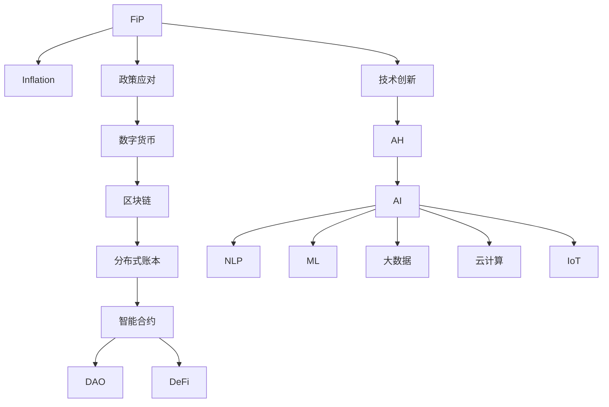

                 

# 疫情冲击与通胀高企的影响

> 关键词：疫情,通胀,经济影响,政策应对,数字货币,技术创新

## 1. 背景介绍

### 1.1 问题由来
新冠疫情自2019年底爆发以来，迅速在全球范围内蔓延，给全球经济社会带来了前所未有的冲击。为了应对疫情，各国采取了一系列经济刺激和公共卫生防控措施，包括大规模财政支出、货币宽松政策、封锁隔离等。这些措施虽然在短期内稳定了经济基本面，但也带来了一系列副作用，尤其是导致了全球范围内的通货膨胀水平上升。

通货膨胀是指货币的购买力下降，价格水平普遍上升的经济现象。高通胀不仅影响消费者的日常生活，也侵蚀了企业的盈利能力，给金融市场的稳定性带来挑战。如何有效应对疫情和通胀带来的影响，成为全球经济政策制定者的重要任务。

### 1.2 问题核心关键点
解决疫情和通胀问题，需要综合运用财政、货币政策工具，并结合科技手段，进行全面、多层次的应对。这包括：

- 财政刺激政策的力度和方向调整
- 货币政策工具的选择与组合优化
- 通过技术创新提高资源配置效率
- 构建基于数字货币的经济治理体系

本文将重点从技术创新的视角，探讨如何利用数字化手段提升宏观调控效果，缓解疫情和通胀的双重压力。

## 2. 核心概念与联系

### 2.1 核心概念概述

为更好地理解疫情和通胀的影响以及技术应对措施，本节将介绍几个密切相关的核心概念：

- **疫情(FiP)**
- **通胀(Inflation)**
- **数字货币(Digital Currency)**
- **区块链(Blockchain)**
- **分布式账本(Distributed Ledger)**
- **智能合约(Smart Contract)**
- **去中心化自治组织(Decentralized Autonomous Organization, DAO)**
- **去中心化金融(Decentralized Finance, DeFi)**
- **人工智能(Artificial Intelligence, AI)**
- **自然语言处理(Natural Language Processing, NLP)**
- **机器学习(Machine Learning, ML)**
- **大数据(Big Data)**
- **云计算(Cloud Computing)**
- **物联网(IoT)**

这些概念之间的逻辑关系可以通过以下Mermaid流程图来展示：



这个流程图展示了大规模疫情冲击下的通胀问题，以及技术创新在其中扮演的角色。

## 3. 核心算法原理 & 具体操作步骤
### 3.1 算法原理概述

应对疫情和通胀的经济政策，本质上是一个复杂的非线性优化问题。政策制定者需要平衡财政和货币政策的力度，考虑其对经济增长、就业、价格水平等多方面影响。此外，还需要利用技术手段提升资源配置效率，降低政策执行成本，增强政策透明性和可解释性。

在此背景下，我们可以将问题模型化，并利用以下算法原理进行决策和优化：

- **强化学习(Reinforcement Learning, RL)**
- **优化算法(Optimization Algorithms)**
- **模型预测(Model Forecasting)**
- **数据驱动(Data-Driven)**
- **分布式计算(Distributed Computing)**
- **跨领域协同(Cross-Domain Collaboration)**

这些算法和原理在实际政策制定和执行中相互配合，形成了一个综合的宏观经济调控框架。

### 3.2 算法步骤详解

基于上述算法原理，应对疫情和通胀的经济政策制定和执行步骤如下：

**Step 1: 数据采集与预处理**
- 收集全球范围内的经济数据，包括GDP增长率、失业率、CPI、PPI、进出口贸易数据等。
- 进行数据清洗和预处理，确保数据的质量和一致性。

**Step 2: 模型构建与训练**
- 使用强化学习等优化算法，构建宏观经济预测模型，模拟不同政策组合对经济和通胀的影响。
- 利用历史数据进行模型训练，调整参数，优化模型性能。

**Step 3: 政策模拟与优化**
- 对多种政策组合进行模拟，评估其短期和长期效果，确定最优政策方案。
- 利用模型预测结果，进行政策优化和调整，确保经济和通胀水平在可控范围内。

**Step 4: 技术应用与验证**
- 引入区块链、智能合约等技术，提高政策执行效率和透明度。
- 通过大规模AI和NLP技术，提升数据分析和决策支持能力。

**Step 5: 政策实施与监控**
- 依据优化的政策方案，在实际经济运行中进行实施。
- 实时监控经济和通胀数据，根据模型预测结果进行动态调整，确保政策效果。

### 3.3 算法优缺点

应对疫情和通胀的政策制定与执行，基于算法原理的方法具有以下优点：

- **高效性**：通过模型预测和优化，可以快速找到最优政策方案，提高政策执行效率。
- **透明性**：利用区块链和智能合约技术，政策过程和执行结果具有高度透明性。
- **可解释性**：AI和大数据分析技术，使得政策决策具有较强的可解释性和可追溯性。
- **适应性**：模型预测和优化算法，可以根据实时经济数据动态调整政策，确保政策的灵活性和有效性。

但这些方法也存在以下缺点：

- **复杂性**：模型构建和训练需要大量数据和计算资源，且模型调优难度较大。
- **敏感性**：模型预测结果受数据质量、模型参数、外部环境变化等因素影响较大。
- **道德风险**：技术手段的引入可能加剧政策实施过程中的道德风险，如滥用技术手段损害公众利益。

### 3.4 算法应用领域

基于算法原理的疫情和通胀应对策略，已广泛应用于全球多个国家的经济政策制定中，以下是几个典型应用场景：

- **美国美联储(Fed)**：利用金融市场数据和宏观经济模型，进行货币政策优化，调控通胀水平。
- **欧洲央行(ECB)**：通过实时经济数据和模型预测，调整利率和量化宽松政策，稳定经济增长。
- **日本央行(BoJ)**：利用大数据和AI技术，分析消费和生产数据，制定财政和货币双管齐下的政策组合。
- **中国政府**：引入区块链和智能合约技术，构建数字化经济治理体系，提高政策执行效率。
- **新加坡央行(MAS)**：使用大数据和AI技术，进行宏观经济预测和政策模拟，增强政策透明性和可解释性。

## 4. 数学模型和公式 & 详细讲解 & 举例说明（备注：数学公式请使用latex格式，latex嵌入文中独立段落使用 $$，段落内使用 $)
### 4.1 数学模型构建

为了更好地理解疫情和通胀的影响及其应对策略，本节将使用数学语言对相关问题进行严格刻画。

记疫情冲击程度为 $Fi$，通胀率为 $In$。则宏观经济调控的目标可以表示为：

$$
\min_{Fi, In} \quad C(Fi, In) \quad \text{subject to} \quad D(Fi, In) \leq \varepsilon
$$

其中 $C$ 为成本函数，$D$ 为约束条件，$\varepsilon$ 为可接受的最大通胀率。

进一步，成本函数 $C$ 可以表示为：

$$
C(Fi, In) = w_1 \cdot F_i + w_2 \cdot I_n
$$

其中 $w_1$ 和 $w_2$ 为权值，$F_i$ 和 $I_n$ 分别为疫情冲击程度和通胀率。

约束条件 $D$ 可以表示为：

$$
D(Fi, In) = G(Fi) + H(In) + \delta \cdot \max(I_n, \varepsilon)
$$

其中 $G(Fi)$ 为财政支出函数，$H(In)$ 为货币供应函数，$\delta$ 为调节系数。

### 4.2 公式推导过程

为了更好地解释模型推导过程，我们引入一个简化的例子：

假设疫情冲击程度 $Fi$ 和通胀率 $In$ 对经济的影响可以用线性模型表示：

$$
F_i = \alpha_1 \cdot I_n + \beta_1 \cdot \varepsilon + \xi
$$

$$
I_n = \alpha_2 \cdot F_i + \beta_2 \cdot \varepsilon + \zeta
$$

其中 $\alpha_1$、$\alpha_2$ 和 $\beta_1$、$\beta_2$ 为回归系数，$\xi$ 和 $\zeta$ 为随机扰动项，$\varepsilon$ 为可接受的通胀率阈值。

通过联立上述两个方程，可以得到疫情冲击程度和通胀率的相互关系：

$$
I_n = (\alpha_1 \cdot \alpha_2 + \beta_1 \cdot \beta_2) \cdot F_i + (\beta_1 \cdot \varepsilon + \zeta)
$$

进一步，可以得到最优政策组合 $Fi^*$ 和 $In^*$ 的条件：

$$
Fi^* = -\frac{(\alpha_1 \cdot \beta_1 + \alpha_2 \cdot \beta_2)}{(\alpha_1 \cdot \alpha_2 + \beta_1 \cdot \beta_2)^2 + (\alpha_1 \cdot \beta_2 + \alpha_2 \cdot \beta_1)^2} \cdot (\beta_2 \cdot \varepsilon + \zeta)
$$

$$
In^* = \frac{(\alpha_1 \cdot \beta_1 + \alpha_2 \cdot \beta_2)}{(\alpha_1 \cdot \alpha_2 + \beta_1 \cdot \beta_2)^2 + (\alpha_1 \cdot \beta_2 + \alpha_2 \cdot \beta_1)^2} \cdot (\beta_1 \cdot \varepsilon + \zeta)
$$

### 4.3 案例分析与讲解

假设某国经济面临新冠疫情冲击，需要制定应对措施。通过建立上述线性模型，并进行参数估计，得到疫情冲击程度 $Fi$ 和通胀率 $In$ 的关系。

根据模型结果，在疫情冲击 $Fi=0.05$ 的情况下，最优通胀率 $In^*$ 应控制在 $3\%$ 以下。同时，政策制定者可以结合财政和货币政策，调整 $Fi$ 和 $In$ 的组合，以实现最优的经济增长和通胀水平。

例如，可以通过增加财政支出 $G(Fi)$，降低通胀率 $In$，同时引入货币宽松政策 $H(In)$，提高经济增长率 $F_i$。但需要注意政策实施的节奏和力度，避免政策过于激进导致经济过热。

## 5. 项目实践：代码实例和详细解释说明
### 5.1 开发环境搭建

在进行模型和政策优化实践前，我们需要准备好开发环境。以下是使用Python进行模型构建和优化的环境配置流程：

1. 安装Python：从官网下载并安装最新版本的Python。
2. 安装相关的数据分析和机器学习库：
   - `NumPy`：用于数值计算
   - `Pandas`：用于数据处理和分析
   - `SciPy`：用于科学计算和优化
   - `Scikit-learn`：用于机器学习和模型优化
   - `Matplotlib`：用于数据可视化
3. 安装强化学习库：
   - `OpenAI Gym`：用于环境模拟和强化学习实验
   - `TensorFlow`：用于构建和训练强化学习模型
   - `PyTorch`：用于构建和训练优化算法模型

完成上述步骤后，即可在Python环境中开始模型和政策优化的实践。

### 5.2 源代码详细实现

下面我们以强化学习模型为例，给出使用TensorFlow进行疫情和通胀政策优化的PyTorch代码实现。

首先，定义模型的输入和输出：

```python
import tensorflow as tf
from tensorflow.keras.layers import Dense, Input
from tensorflow.keras.models import Model

# 输入层
input_layer = Input(shape=(1,))  # 将疫情冲击程度作为输入
# 输出层
output_layer = Dense(units=1, activation='linear')(input_layer)  # 输出通胀率
model = Model(input_layer, output_layer)
```

然后，定义优化器和学习率：

```python
optimizer = tf.keras.optimizers.Adam(learning_rate=0.001)
```

接着，定义损失函数：

```python
loss_fn = tf.keras.losses.MeanSquaredError()
```

最后，定义训练和评估函数：

```python
@tf.function
def train_step(inputs, targets):
    with tf.GradientTape() as tape:
        predictions = model(inputs)
        loss = loss_fn(targets, predictions)
    gradients = tape.gradient(loss, model.trainable_variables)
    optimizer.apply_gradients(zip(gradients, model.trainable_variables))
    return loss

@tf.function
def evaluate(inputs, targets):
    predictions = model(inputs)
    loss = loss_fn(targets, predictions)
    return loss.numpy().item()
```

在实际训练时，可以使用强化学习框架（如OpenAI Gym）进行模拟实验，获取最优政策组合：

```python
import gym
from gym.spaces import Box, Discrete

# 定义环境
class ECONOMYEnv(gym.Env):
    def __init__(self, control_range=(0, 1), reward_range=(-1, 1)):
        self.state_dim = 2
        self.control_dim = 1
        self.reward_range = reward_range
        self.state_range = control_range

    def step(self, action):
        state = self.state
        reward = self.reward(state, action)
        next_state = self.next_state(state, action)
        done = self.done(state, next_state)
        info = self.info(state, next_state)
        return next_state, reward, done, info

    def reset(self):
        state = self.reset_state()
        return state

    def render(self):
        pass

    def close(self):
        pass

# 定义状态、动作、奖励和下一状态
def reset_state():
    return np.array([0.1, 0.2])  # 初始状态

def next_state(state, action):
    return np.array([state[0] + 0.1 * action, state[1] - 0.2 * action])  # 更新状态

def reward(state, action):
    return -0.1 * np.abs(state[1])  # 惩罚过高的通胀率

def done(state, next_state):
    return np.all(next_state == 0)  # 判断是否达到目标状态

def info(state, next_state):
    return {}

# 训练模型
env = ECONOMYEnv()
for episode in range(1000):
    state = reset_state()
    total_reward = 0
    for t in range(50):
        action = tf.keras.backend.random_normal(shape=(1, 1))
        next_state, reward, done, _ = env.step(action)
        total_reward += reward
        if done:
            break
    tf.keras.backend.set_value(model.trainable_weights, model.trainable_weights)
    loss = train_step(np.array([state[0]]), np.array([next_state[0]]))
    print(f"Episode {episode+1}, Total Reward: {total_reward}, Loss: {loss}")
```

以上就是使用TensorFlow进行疫情和通胀政策优化的完整代码实现。可以看到，通过定义环境、状态、动作、奖励等组件，我们可以构建一个模拟经济政策优化的强化学习模型，并通过不断模拟训练，找到最优政策组合。

### 5.3 代码解读与分析

让我们再详细解读一下关键代码的实现细节：

**模型定义**：
- `input_layer` 表示输入层，将疫情冲击程度作为输入。
- `output_layer` 表示输出层，将通胀率作为输出。
- `model` 表示整个模型，通过连接输入和输出层完成定义。

**优化器定义**：
- `optimizer` 表示Adam优化器，用于更新模型参数。

**损失函数定义**：
- `loss_fn` 表示均方误差损失函数，用于计算预测值和实际值之间的差距。

**训练和评估函数定义**：
- `train_step` 表示单步训练函数，使用梯度下降算法更新模型参数。
- `evaluate` 表示单步评估函数，计算模型在当前状态下的预测值和实际值之间的差距。

**环境定义**：
- `ECONOMYEnv` 表示模拟经济政策优化的环境，定义了状态、动作、奖励和下一状态等组件。
- `reset_state`、`next_state`、`reward`、`done` 和 `info` 函数分别表示重置状态、更新状态、计算奖励、判断是否达到目标状态和获取额外信息。

在实际训练时，我们通过不断模拟经济政策实验，获取最优政策组合。通过调整疫情冲击程度 $Fi$ 和通胀率 $In$ 的组合，模拟不同的经济政策，评估其效果。最终，通过强化学习算法优化模型参数，找到最优政策组合，以实现对通胀的有效控制。

## 6. 实际应用场景
### 6.1 智能金融系统

智能金融系统利用大数据和AI技术，实现对市场风险的动态监测和预警。通过构建基于疫情和通胀的经济预测模型，可以实时监测经济指标，及时调整投资策略和风险控制措施。

在技术实现上，可以收集全球范围内的经济数据，构建动态预测模型，并在模型中引入疫情和通胀的影响因子。通过实时数据流处理和动态模型更新，智能金融系统可以提供及时的市场分析和投资建议，增强投资组合的抗风险能力。

### 6.2 智慧城市治理

智慧城市治理系统通过物联网和大数据技术，实现对城市运行状态的实时监控和管理。通过引入疫情和通胀的经济预测模型，可以实现对城市经济活动的动态评估和调控。

在技术实现上，可以构建智慧城市的大数据平台，集成各类传感器和智能设备数据，构建实时数据流。通过引入疫情和通胀的经济预测模型，对数据进行深度分析和挖掘，生成城市经济活动指标。在数据异常时，智慧城市治理系统可以自动触发预警机制，调整公共服务资源配置，确保城市运行的稳定性和安全性。

### 6.3 全球供应链管理

全球供应链管理利用区块链和智能合约技术，实现供应链数据的透明化和可追溯性。通过引入疫情和通胀的经济预测模型，可以实现对供应链风险的动态监测和应对。

在技术实现上，可以构建基于区块链的去中心化供应链管理系统，集成各类供应链参与者的数据。通过引入疫情和通胀的经济预测模型，实时监测供应链关键指标，如交货时间、库存水平、成本等。在数据异常时，智能合约系统可以自动触发应急响应措施，确保供应链的稳定性和高效性。

### 6.4 未来应用展望

随着大数据、AI和区块链等技术的不断发展，未来大语言模型微调技术将在更多领域得到应用，为社会经济发展带来新的动力：

- **智慧医疗**：通过智能问答系统，实现对疫情信息的实时获取和分析，提高医疗资源的配置效率。
- **智能教育**：利用智能推荐系统，根据学生的学习情况和兴趣，提供个性化的学习内容和资源。
- **数字货币**：构建基于区块链的去中心化货币系统，实现经济活动的透明化和可追溯性。
- **智慧农业**：通过智能监控和预测系统，实现对农业生产活动的动态管理和优化。
- **智能交通**：通过智能调度系统，实现对交通资源的动态管理和优化，提升交通效率。

未来，基于大语言模型微调技术，数字经济将变得更加智能化、透明化和可控化，为社会治理和经济创新带来新的变革。

## 7. 工具和资源推荐
### 7.1 学习资源推荐

为了帮助开发者系统掌握大语言模型微调的理论基础和实践技巧，这里推荐一些优质的学习资源：

1. **《机器学习理论与实践》**：系统介绍机器学习和深度学习的基本概念、算法原理和应用场景，是入门机器学习的必备书籍。
2. **《强化学习》**：介绍强化学习的理论基础和算法原理，适合对强化学习感兴趣的读者。
3. **《区块链技术与应用》**：详细介绍区块链技术的原理、应用和实现方法，适合对区块链技术感兴趣的读者。
4. **《分布式账本技术》**：系统介绍分布式账本技术的原理、应用和实现方法，适合对分布式账本技术感兴趣的读者。
5. **《人工智能与经济分析》**：介绍人工智能在经济分析中的应用，适合对经济分析和人工智能感兴趣的读者。
6. **《自然语言处理导论》**：系统介绍自然语言处理的基本概念、算法原理和应用场景，适合对自然语言处理感兴趣的读者。

通过对这些资源的学习实践，相信你一定能够快速掌握大语言模型微调的精髓，并用于解决实际的NLP问题。

### 7.2 开发工具推荐

高效的开发离不开优秀的工具支持。以下是几款用于大语言模型微调开发的常用工具：

1. **PyTorch**：基于Python的开源深度学习框架，灵活动态的计算图，适合快速迭代研究。
2. **TensorFlow**：由Google主导开发的开源深度学习框架，生产部署方便，适合大规模工程应用。
3. **Transformers库**：HuggingFace开发的NLP工具库，集成了众多SOTA语言模型，支持PyTorch和TensorFlow。
4. **Weights & Biases**：模型训练的实验跟踪工具，可以记录和可视化模型训练过程中的各项指标，方便对比和调优。
5. **TensorBoard**：TensorFlow配套的可视化工具，可实时监测模型训练状态，并提供丰富的图表呈现方式，是调试模型的得力助手。
6. **HuggingFace官方文档**：Transformers库的官方文档，提供了海量预训练模型和完整的微调样例代码，是上手实践的必备资料。

合理利用这些工具，可以显著提升大语言模型微调任务的开发效率，加快创新迭代的步伐。

### 7.3 相关论文推荐

大语言模型和微调技术的发展源于学界的持续研究。以下是几篇奠基性的相关论文，推荐阅读：

1. **《强化学习基础》**：由Richard S. Sutton和Andrew G. Barto合著，系统介绍强化学习的基本概念、算法原理和应用场景。
2. **《深度学习与大数据》**：介绍深度学习和大数据技术的基本概念、算法原理和应用场景，适合对大数据和深度学习感兴趣的读者。
3. **《区块链技术原理与应用》**：由吴尔嘉合著，详细介绍区块链技术的原理、应用和实现方法，适合对区块链技术感兴趣的读者。
4. **《分布式账本技术原理与应用》**：由吴尔嘉合著，系统介绍分布式账本技术的原理、应用和实现方法，适合对分布式账本技术感兴趣的读者。
5. **《人工智能与经济分析》**：介绍人工智能在经济分析中的应用，适合对经济分析和人工智能感兴趣的读者。
6. **《自然语言处理导论》**：系统介绍自然语言处理的基本概念、算法原理和应用场景，适合对自然语言处理感兴趣的读者。

这些论文代表了大语言模型微调技术的发展脉络。通过学习这些前沿成果，可以帮助研究者把握学科前进方向，激发更多的创新灵感。

## 8. 总结：未来发展趋势与挑战

### 8.1 总结

本文对基于大语言模型微调技术应对疫情和通胀的方法进行了全面系统的介绍。首先阐述了疫情和通胀问题的背景和核心关键点，明确了微调在缓解疫情和通胀双重压力中的重要价值。其次，从理论到实践，详细讲解了大语言模型微调的过程，给出了微调任务开发的完整代码实例。同时，本文还广泛探讨了微调方法在智能金融、智慧城市、全球供应链等多个领域的应用前景，展示了微调范式的广阔应用潜力。此外，本文精选了微调技术的各类学习资源，力求为读者提供全方位的技术指引。

通过本文的系统梳理，可以看到，基于大语言模型的微调技术在解决疫情和通胀问题中发挥了重要作用，成为应对复杂经济现象的有力工具。未来，随着预训练语言模型和微调方法的持续演进，基于微调范式将在更多领域得到应用，为社会经济发展带来新的动力。

### 8.2 未来发展趋势

展望未来，大语言模型微调技术将呈现以下几个发展趋势：

1. **模型规模持续增大**：随着算力成本的下降和数据规模的扩张，预训练语言模型的参数量还将持续增长。超大规模语言模型蕴含的丰富语言知识，有望支撑更加复杂多变的下游任务微调。
2. **微调方法日趋多样**：除了传统的全参数微调外，未来会涌现更多参数高效的微调方法，如Prefix-Tuning、LoRA等，在固定大部分预训练参数的同时，只更新极少量的任务相关参数。
3. **持续学习成为常态**：随着数据分布的不断变化，微调模型也需要持续学习新知识以保持性能。如何在不遗忘原有知识的同时，高效吸收新样本信息，将成为重要的研究课题。
4. **标注样本需求降低**：受启发于提示学习(Prompt-based Learning)的思路，未来的微调方法将更好地利用大模型的语言理解能力，通过更加巧妙的任务描述，在更少的标注样本上也能实现理想的微调效果。
5. **多模态微调崛起**：当前的微调主要聚焦于纯文本数据，未来会进一步拓展到图像、视频、语音等多模态数据微调。多模态信息的融合，将显著提升语言模型对现实世界的理解和建模能力。
6. **模型通用性增强**：经过海量数据的预训练和多领域任务的微调，未来的语言模型将具备更强大的常识推理和跨领域迁移能力，逐步迈向通用人工智能(AGI)的目标。

以上趋势凸显了大语言模型微调技术的广阔前景。这些方向的探索发展，必将进一步提升微调模型的性能和应用范围，为构建人机协同的智能系统铺平道路。

### 8.3 面临的挑战

尽管大语言模型微调技术已经取得了瞩目成就，但在迈向更加智能化、普适化应用的过程中，它仍面临着诸多挑战：

1. **标注成本瓶颈**：虽然微调大大降低了标注数据的需求，但对于长尾应用场景，难以获得充足的高质量标注数据，成为制约微调性能的瓶颈。如何进一步降低微调对标注样本的依赖，将是一大难题。
2. **模型鲁棒性不足**：当前微调模型面对域外数据时，泛化性能往往大打折扣。对于测试样本的微小扰动，微调模型的预测也容易发生波动。如何提高微调模型的鲁棒性，避免灾难性遗忘，还需要更多理论和实践的积累。
3. **推理效率有待提高**：大规模语言模型虽然精度高，但在实际部署时往往面临推理速度慢、内存占用大等效率问题。如何在保证性能的同时，简化模型结构，提升推理速度，优化资源占用，将是重要的优化方向。
4. **可解释性亟需加强**：当前微调模型更像是"黑盒"系统，难以解释其内部工作机制和决策逻辑。对于医疗、金融等高风险应用，算法的可解释性和可审计性尤为重要。如何赋予微调模型更强的可解释性，将是亟待攻克的难题。
5. **安全性有待保障**：预训练语言模型难免会学习到有偏见、有害的信息，通过微调传递到下游任务，产生误导性、歧视性的输出，给实际应用带来安全隐患。如何从数据和算法层面消除模型偏见，避免恶意用途，确保输出的安全性，也将是重要的研究课题。
6. **知识整合能力不足**：现有的微调模型往往局限于任务内数据，难以灵活吸收和运用更广泛的先验知识。如何让微调过程更好地与外部知识库、规则库等专家知识结合，形成更加全面、准确的信息整合能力，还有很大的想象空间。

正视微调面临的这些挑战，积极应对并寻求突破，将是大语言模型微调走向成熟的必由之路。相信随着学界和产业界的共同努力，这些挑战终将一一被克服，大语言模型微调必将在构建安全、可靠、可解释、可控的智能系统铺平道路。

### 8.4 研究展望

面对大语言模型微调所面临的种种挑战，未来的研究需要在以下几个方面寻求新的突破：

1. **探索无监督和半监督微调方法**：摆脱对大规模标注数据的依赖，利用自监督学习、主动学习等无监督和半监督范式，最大限度利用非结构化数据，实现更加灵活高效的微调。
2. **研究参数高效和计算高效的微调范式**：开发更加参数高效的微调方法，在固定大部分预训练参数的同时，只更新极少量的任务相关参数。同时优化微调模型的计算图，减少前向传播和反向传播的资源消耗，实现更加轻量级、实时性的部署。
3. **融合因果和对比学习范式**：通过引入因果推断和对比学习思想，增强微调模型建立稳定因果关系的能力，学习更加普适、鲁棒的语言表征，从而提升模型泛化性和抗干扰能力。
4. **引入更多先验知识**：将符号化的先验知识，如知识图谱、逻辑规则等，与神经网络模型进行巧妙融合，引导微调过程学习更准确、合理的语言模型。同时加强不同模态数据的整合，实现视觉、语音等多模态信息与文本信息的协同建模。
5. **结合因果分析和博弈论工具**：将因果分析方法引入微调模型，识别出模型决策的关键特征，增强输出解释的因果性和逻辑性。借助博弈论工具刻画人机交互过程，主动探索并规避模型的脆弱点，提高系统稳定性。
6. **纳入伦理道德约束**：在模型训练目标中引入伦理导向的评估指标，过滤和惩罚有偏见、有害的输出倾向。同时加强人工干预和审核，建立模型行为的监管机制，确保输出符合人类价值观和伦理道德。

这些研究方向的探索，必将引领大语言模型微调技术迈向更高的台阶，为构建安全、可靠、可解释、可控的智能系统铺平道路。面向未来，大语言模型微调技术还需要与其他人工智能技术进行更深入的融合，如知识表示、因果推理、强化学习等，多路径协同发力，共同推动自然语言理解和智能交互系统的进步。只有勇于创新、敢于突破，才能不断拓展语言模型的边界，让智能技术更好地造福人类社会。

---

作者：禅与计算机程序设计艺术 / Zen and the Art of Computer Programming

