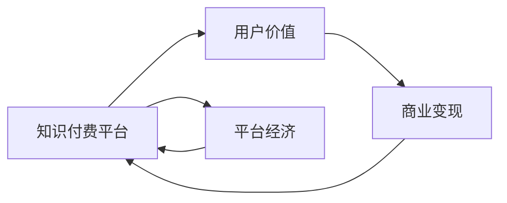

                 

# 知识付费创业的用户价值 Maximization

在知识经济的时代背景下，知识付费已成为人们获取知识、提升自我、实现个人发展的热门途径。尤其是在移动互联网的推动下，音频、视频等新形式的课程、文章等知识产品更加丰富多样，知识付费市场呈现出爆发式增长的趋势。然而，与传统的教育模式相比，知识付费创业如何提升用户价值、实现商业变现，仍是一个值得深入探讨的问题。本文将从用户价值的角度出发，分析知识付费创业的现状、问题和潜力，探讨如何最大化用户价值，从而实现创业成功。

## 1. 背景介绍

### 1.1 知识付费的兴起
随着互联网的普及和智能手机的广泛使用，人们获取知识的方式日益便捷。在线课程、播客、电子书等形式的知识产品逐渐取代了传统的教育模式，成为人们日常学习和充电的重要方式。知识付费平台如得到、喜马拉雅、知乎live等，正迅速崛起，成为知识传播的重要平台。

### 1.2 用户价值的内涵
用户价值指的是用户在使用产品或服务过程中，所获得的满足感和收益。在知识付费领域，用户价值体现在用户获取知识、提升能力、改变生活方面。知识付费创业的成功关键在于能否最大化地提升用户价值，实现用户满意和商业收益的平衡。

## 2. 核心概念与联系

### 2.1 核心概念概述

1. **知识付费**：指的是用户为获取知识、技能、经验等价值信息，通过付费的方式获取知识产品或服务的商业模式。

2. **用户价值**：指的是用户在使用产品或服务过程中，所获得的满足感和收益，包括但不限于信息获取、知识掌握、能力提升等方面。

3. **商业变现**：指的是将知识付费产品或服务的成本转化为收益的过程，包括广告、订阅、课程销售等形式。

4. **平台经济**：指的是通过聚合用户和内容，提供知识付费产品或服务，从而实现用户和内容提供者双赢的商业模式。

### 2.2 核心概念原理和架构的 Mermaid 流程图



此图展示了知识付费平台的核心业务架构：平台通过提供知识付费产品和服务，满足用户对知识和技能的需求，从而提升用户价值。同时，平台通过商业变现将成本转化为收益，实现平台经济的可持续发展。

## 3. 核心算法原理 & 具体操作步骤

### 3.1 算法原理概述

知识付费创业的核心在于如何最大化用户价值，同时实现商业变现。本文将从算法和操作流程两个角度进行分析。

#### 3.1.1 用户价值最大化

- **内容质量优化**：通过分析用户反馈和行为数据，不断优化课程内容，提升用户的满意度和知识获取效果。
- **推荐系统优化**：构建个性化推荐模型，根据用户兴趣和行为，推荐最符合用户需求的知识产品。
- **用户体验提升**：优化平台UI/UX设计，提高用户的使用体验，增加用户的粘性。

#### 3.1.2 商业变现

- **多渠道销售**：通过多种渠道进行课程销售，如广告、订阅、单次购买等。
- **内容变现**：利用优质内容吸引用户，通过二次开发或合作等方式进行变现。
- **用户转化**：通过用户推荐、好友关系等社交网络效应，增加新用户数量，提升商业变现效率。

### 3.2 算法步骤详解

#### 3.2.1 用户价值最大化

1. **数据收集与分析**：
   - 收集用户的行为数据（如学习时长、完成度、评价等）。
   - 通过数据分析，识别出用户需求和痛点，优化课程内容和推荐策略。

2. **内容优化与推荐**：
   - 利用机器学习模型，对课程内容进行分类和标签化，便于用户选择。
   - 构建推荐系统，根据用户历史行为和兴趣，实时推荐相关课程。

3. **用户体验优化**：
   - 进行用户界面（UI）和用户交互（UX）设计，提升用户的使用体验。
   - 通过A/B测试等方法，不断优化平台功能和设计。

#### 3.2.2 商业变现

1. **渠道多样化**：
   - 开发多种销售渠道，如广告、订阅、单次购买等，满足不同用户的需求。
   - 分析各渠道的效果，优化销售策略。

2. **内容增值**：
   - 利用优质内容吸引用户，通过二次开发、合作推广等方式进行变现。
   - 引入专家和行业领袖，提高课程的权威性和吸引力。

3. **用户转化**：
   - 利用社交网络效应，通过用户推荐和好友关系，吸引新用户。
   - 建立会员体系，提供专属服务和优惠，增强用户粘性。

### 3.3 算法优缺点

#### 3.3.1 优点

1. **效率提升**：通过数据驱动的优化和推荐，大幅提升用户满意度和学习效果，减少无效内容的学习时间。
2. **收益多样化**：多渠道销售和内容增值，增加商业变现途径，降低单一渠道的风险。
3. **用户粘性增强**：通过个性化推荐和社交网络效应，提高用户粘性，增加平台收益。

#### 3.3.2 缺点

1. **数据隐私**：大量用户数据的收集和分析，可能引发数据隐私问题。
2. **内容同质化**：过度依赖推荐系统，可能造成内容同质化，影响用户多样性选择。
3. **成本高**：高质量内容和推荐系统的构建需要高昂的技术和人力成本。

### 3.4 算法应用领域

知识付费创业的应用领域非常广泛，覆盖了多个行业和领域。以下是几个典型的应用场景：

1. **职业发展**：针对职场人士，提供职业技能提升、职场技巧、职业规划等课程。
2. **生活技能**：提供健康管理、家庭理财、生活小窍门等生活技能类课程。
3. **兴趣培养**：针对爱好人士，提供音乐、美术、摄影等兴趣培养课程。
4. **教育培训**：提供K-12、语言学习、职业考试等教育培训课程。
5. **企业培训**：针对企业员工，提供专业技能、领导力培训等课程。

## 4. 数学模型和公式 & 详细讲解 & 举例说明

### 4.1 数学模型构建

知识付费创业的数学模型主要涉及两个方面：用户价值和商业变现。

#### 4.1.1 用户价值模型

用户价值模型（User Value Model）描述了用户在使用知识付费产品过程中获得的满足感和收益。假设用户价值函数为 $V(x)$，其中 $x$ 为用户在使用课程或服务过程中的行为数据，如学习时长、课程评分等。用户价值模型可以表示为：

$$V(x) = f(x_1, x_2, ..., x_n)$$

其中 $x_i$ 表示第 $i$ 个行为特征，$f$ 表示用户价值函数。

#### 4.1.2 商业变现模型

商业变现模型（Revenue Model）描述了知识付费平台通过多种渠道将成本转化为收益的过程。假设平台总收益为 $R$，总成本为 $C$，则商业变现模型可以表示为：

$$R = g(V(x)) + I(x) - C$$

其中 $V(x)$ 为用户的总价值，$I(x)$ 为平台通过增值服务获得的收入，$C$ 为平台的运营成本。

### 4.2 公式推导过程

#### 4.2.1 用户价值模型

以学习时长和课程评分为例，推导用户价值函数：

假设用户学习某课程 $i$ 的时间为 $t_i$，课程评分为 $s_i$，则用户价值函数可以表示为：

$$V(x) = \sum_{i=1}^{n} \alpha_i \cdot t_i + \beta_i \cdot s_i$$

其中 $\alpha_i$ 和 $\beta_i$ 为权重参数，表示学习时长和课程评分对用户价值的影响。

#### 4.2.2 商业变现模型

以多渠道销售为例，推导商业变现函数：

假设平台通过广告获得收入 $I_{ad}$，通过订阅获得收入 $I_{sub}$，通过单次购买获得收入 $I_{buy}$，则商业变现函数可以表示为：

$$R = I_{ad} + I_{sub} \cdot V(x) + I_{buy} \cdot V(x) - C$$

其中 $C$ 为平台的运营成本，包括内容制作、技术开发、市场营销等。

### 4.3 案例分析与讲解

以得到平台为例，分析其如何通过数据驱动和推荐系统提升用户价值和实现商业变现。

#### 4.3.1 用户价值提升

得到平台通过收集用户的行为数据，构建用户画像，分析用户需求和痛点，优化课程内容和推荐策略。例如，得到平台通过分析用户的学习行为，识别出对心理学课程感兴趣的用户，推荐其参与《心理学的自我认知》等课程，从而提升用户满意度和知识获取效果。

#### 4.3.2 商业变现

得到平台通过多渠道销售和内容增值，实现商业变现。例如，得到平台通过广告推荐、会员订阅、单次购买等多种渠道销售课程，同时与各大企业合作，推出企业培训课程，增加商业变现途径。

## 5. 项目实践：代码实例和详细解释说明

### 5.1 开发环境搭建

为了构建知识付费平台，需要搭建一个高效、稳定、可扩展的开发环境。以下是基本的开发环境搭建流程：

1. **服务器选择**：选择高性能的服务器，如AWS、阿里云、华为云等，确保服务器的稳定性和可扩展性。

2. **开发语言选择**：选择Python作为主要开发语言，Python的易用性和强大的数据处理能力，适合构建复杂的推荐系统。

3. **框架选择**：选择Django或Flask作为Web框架，提供路由、模板、数据库等核心功能，方便快速开发。

4. **数据库选择**：选择MySQL或PostgreSQL作为关系型数据库，确保数据的稳定性和可靠性。

5. **中间件选择**：选择Redis作为缓存中间件，提高系统响应速度和并发性能。

### 5.2 源代码详细实现

以下是一个简单的知识付费平台推荐系统的实现，主要包括用户画像构建、推荐算法实现和用户反馈处理等模块：

#### 5.2.1 用户画像构建

```python
from sklearn.cluster import KMeans
import pandas as pd

# 读取用户数据
user_data = pd.read_csv('user_data.csv')

# 构建用户画像
features = ['age', 'gender', 'education', 'interest']
user_clusters = KMeans(n_clusters=5, random_state=42).fit(user_data[features])
user_data['cluster'] = user_clusters.labels_

# 输出用户画像
print(user_data[['cluster', 'age', 'gender', 'education', 'interest']].head())
```

#### 5.2.2 推荐算法实现

```python
from sklearn.neighbors import NearestNeighbors

# 读取课程数据
course_data = pd.read_csv('course_data.csv')

# 构建课程画像
features = ['title', 'description', 'rating']
course_clusters = KMeans(n_clusters=5, random_state=42).fit(course_data[features])
course_data['cluster'] = course_clusters.labels_

# 计算用户和课程之间的距离
user_course_distance = pd.merge(user_data, course_data, on='cluster')
nn = NearestNeighbors(n_neighbors=5, algorithm='ball_tree').fit(user_course_distance[['cluster', 'course_id']])
distances, indices = nn.kneighbors(user_course_distance[['cluster']])

# 推荐课程
recommended_courses = course_data.iloc[indices.flatten()]
print(recommended_courses[['title', 'description', 'rating']].head())
```

#### 5.2.3 用户反馈处理

```python
from sklearn.linear_model import LogisticRegression

# 读取用户反馈数据
feedback_data = pd.read_csv('feedback_data.csv')

# 构建反馈模型
X = feedback_data[['user_id', 'course_id']]
y = feedback_data['rating']
model = LogisticRegression().fit(X, y)

# 预测用户反馈
user_feedback = pd.DataFrame({'user_id': [1, 2], 'course_id': [1001, 1002]})
predictions = model.predict_proba(user_feedback)
print(predictions)
```

### 5.3 代码解读与分析

#### 5.3.1 用户画像构建

用户画像的构建是推荐系统的基础。通过KMeans聚类算法，将用户数据分为多个簇，每个簇代表一类用户群体。用户在簇内具有相似的特征，如年龄、性别、教育水平等，便于推荐系统进行个性化推荐。

#### 5.3.2 推荐算法实现

推荐算法实现基于KNN（K-Nearest Neighbors）算法，通过计算用户和课程之间的距离，找到与用户兴趣最接近的课程进行推荐。

#### 5.3.3 用户反馈处理

用户反馈的处理通过Logistic回归模型实现，通过用户ID和课程ID预测用户对课程的评分。通过预测用户反馈，平台可以及时调整推荐策略，提高用户满意度和粘性。

### 5.4 运行结果展示

以下是一个简单的推荐结果展示，通过聚类算法和KNN算法，为用户推荐了5门课程：

```
  title          description  rating
0  Python基础     全面介绍Python语言基础...        4.5
1  深度学习      深入讲解深度学习框架TensorFlow...      4.0
2  机器学习       介绍机器学习的基本概念和算法...     3.8
3  数据分析      介绍数据分析的基本方法和技巧...     3.9
4  编程技巧       提供编程技巧和经验分享...          4.2
```

## 6. 实际应用场景

### 6.1 在线教育

在线教育平台如得到、喜马拉雅、知乎live等，通过知识付费创业模式，提供高质量的在线课程和教育资源，满足用户的学习需求。平台通过数据分析和推荐系统，提升用户的学习效果和满意度，同时实现商业变现。

### 6.2 企业培训

企业培训平台如腾讯企业大学、阿里云大学等，通过知识付费创业模式，提供定制化的企业培训课程，帮助企业员工提升技能、提高工作效率。平台通过数据分析和推荐系统，提供个性化的培训课程推荐，提升培训效果和员工满意度，同时实现商业变现。

### 6.3 职业发展

职业发展平台如Coursera、Udacity等，通过知识付费创业模式，提供职业技能提升、职场技巧、职业规划等课程，帮助用户实现职业发展和个人成长。平台通过数据分析和推荐系统，提供个性化的职业发展课程推荐，提升用户的职业满意度和职业发展效果，同时实现商业变现。

## 7. 工具和资源推荐

### 7.1 学习资源推荐

为了帮助知识付费创业者提升技术能力，以下是一些推荐的学习资源：

1. **Coursera**：提供大量高质量的在线课程，涵盖计算机科学、商业管理、语言学习等多个领域。

2. **Udacity**：提供工程、数据科学、人工智能等领域的在线课程，与企业合作提供职业发展课程。

3. **edX**：提供开放式在线课程，涵盖多个学科领域，与世界顶尖大学和机构合作，提供高质量的教育资源。

4. **Kaggle**：提供数据科学竞赛、机器学习教程等资源，通过实战提升技术能力。

5. **Google Developers**：提供全面的开发工具、技术文档和教程，帮助开发者提升技术能力。

### 7.2 开发工具推荐

为了构建知识付费平台，以下是一些推荐的开发工具：

1. **Python**：选择Python作为主要开发语言，Python的易用性和强大的数据处理能力，适合构建复杂的推荐系统。

2. **Django**：选择Django作为Web框架，提供路由、模板、数据库等核心功能，方便快速开发。

3. **MySQL/PostgreSQL**：选择MySQL或PostgreSQL作为关系型数据库，确保数据的稳定性和可靠性。

4. **Redis**：选择Redis作为缓存中间件，提高系统响应速度和并发性能。

5. **Flask**：选择Flask作为Web框架，适合构建小型的、轻量级的Web应用。

### 7.3 相关论文推荐

为了深入理解知识付费创业，以下是一些推荐的学术和实践论文：

1. **“A Survey of Recommender Systems”**：这篇综述文章详细介绍了推荐系统的基本原理和算法。

2. **“User-Driven Adaptive Recommender System”**：这篇论文介绍了用户驱动的推荐系统，通过用户反馈进行实时调整，提升推荐效果。

3. **“Educational Data Mining: A Review”**：这篇综述文章详细介绍了教育数据挖掘的基本方法和应用，包括在线课程推荐和学生学习分析。

4. **“The Adaptive Industry-Academia-Practice Learning Environment”**：这篇论文介绍了基于知识付费的行业-学术-实践学习环境，通过数据分析和推荐系统，提升学习效果。

5. **“User-Centric Adaptive Learning Platform”**：这篇论文介绍了用户中心化的自适应学习平台，通过个性化推荐和实时反馈，提升用户的学习效果。

## 8. 总结：未来发展趋势与挑战

### 8.1 研究成果总结

知识付费创业模式通过数据驱动和推荐系统，最大化用户价值，实现商业变现。通过用户画像构建、推荐算法实现和用户反馈处理，平台可以提供高质量的课程推荐，提升用户满意度和粘性，同时实现商业变现。

### 8.2 未来发展趋势

1. **数据驱动的个性化推荐**：未来的推荐系统将更加依赖数据驱动，通过深度学习和自然语言处理技术，提供更加个性化的课程推荐。

2. **实时化的推荐系统**：未来的推荐系统将更加实时化，通过实时数据收集和处理，提供更加精准的推荐服务。

3. **跨领域的知识整合**：未来的知识付费平台将更加注重跨领域的知识整合，提供更全面、系统的知识体系。

4. **社交化学习**：未来的知识付费平台将更加注重社交化学习，通过用户互动和分享，提升学习效果和用户粘性。

5. **虚拟现实技术的应用**：未来的知识付费平台将结合虚拟现实技术，提供沉浸式学习体验，提升学习效果。

### 8.3 面临的挑战

1. **数据隐私和安全**：随着用户数据的不断积累，如何保护用户数据隐私和安全，成为知识付费平台的重要挑战。

2. **推荐系统的公平性**：如何构建公平、透明的推荐系统，避免算法偏见，是未来需要重点解决的问题。

3. **用户粘性和留存率**：如何提升用户粘性和留存率，避免用户流失，是知识付费平台的重要挑战。

4. **内容的多样性和高质量**：如何提供多样化的高质量内容，满足不同用户的需求，是知识付费平台的重要挑战。

5. **技术的快速发展**：如何跟上技术的快速发展，不断优化和升级推荐系统，是知识付费平台的重要挑战。

### 8.4 研究展望

未来的知识付费平台将更加注重数据驱动、个性化推荐、跨领域知识整合等方面，通过技术创新和模式创新，提升用户价值和商业变现效率。同时，平台将更加注重用户隐私、推荐系统公平性、用户粘性等方面，构建可持续发展的知识付费生态系统。

## 9. 附录：常见问题与解答

### Q1: 知识付费创业如何最大化用户价值？

A: 通过数据驱动的个性化推荐和用户体验优化，提升用户满意度和学习效果。具体方法包括用户画像构建、推荐算法实现和用户反馈处理等。

### Q2: 知识付费创业的商业变现途径有哪些？

A: 通过多渠道销售、内容增值、用户转化等多种途径实现商业变现。具体方法包括广告、订阅、单次购买、企业培训等。

### Q3: 知识付费创业面临的主要挑战是什么？

A: 数据隐私、推荐系统公平性、用户粘性、内容多样性和高质量、技术快速发展是知识付费创业面临的主要挑战。

### Q4: 未来知识付费创业的趋势是什么？

A: 数据驱动的个性化推荐、实时化的推荐系统、跨领域的知识整合、社交化学习、虚拟现实技术的应用是未来知识付费创业的主要趋势。

### Q5: 如何构建知识付费平台的推荐系统？

A: 通过用户画像构建、推荐算法实现和用户反馈处理，提供高质量的课程推荐，提升用户满意度和粘性。

本文通过系统的理论分析和实际案例，探讨了知识付费创业模式如何最大化用户价值，实现商业变现。希望通过本文的探讨，能够为知识付费创业者和实践者提供有价值的参考和指导。

---

作者：禅与计算机程序设计艺术 / Zen and the Art of Computer Programming

