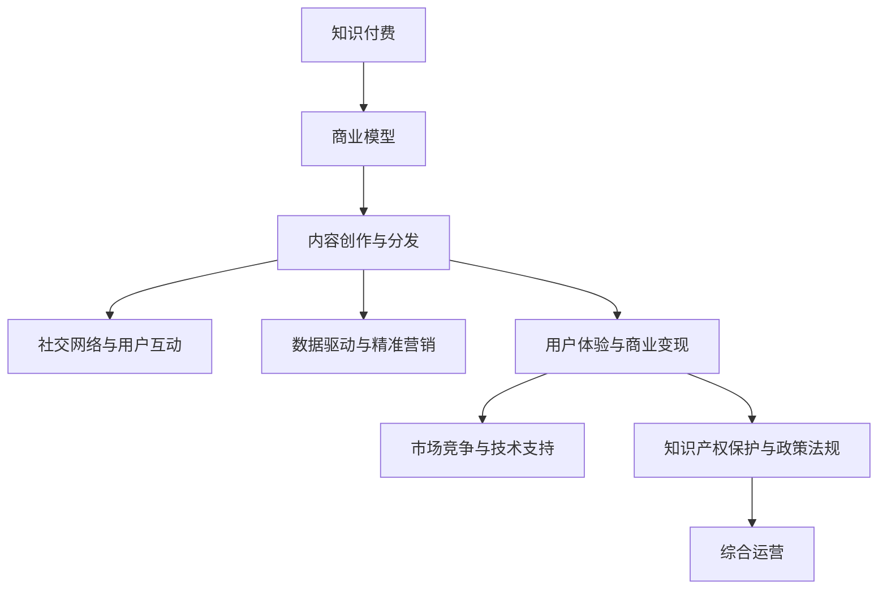

                 

# 知识 经济时代下的知识付费创新商业模式运营

> 关键词：知识付费、商业创新、商业模型、在线教育、社区化、平台化、内容创作、内容分发、社交网络、用户互动、数据驱动、精准营销、用户体验、商业变现、市场竞争、技术支持、知识产权保护、政策法规

## 1. 背景介绍

### 1.1 问题由来
在知识经济时代，知识的获取和应用已经成为了企业和个人发展的重要驱动因素。传统的知识传播方式，如书籍、讲座等，已经不能满足日益增长的知识需求。同时，随着互联网和移动设备的普及，人们获取知识的渠道也变得越来越多元化。在这样的背景下，知识付费成为了一种新兴的商业模式，通过付费的方式提供更为专业、高质量的知识服务。

### 1.2 问题核心关键点
知识付费模式的核心在于如何高效、精准地匹配知识需求和知识供给，实现知识的价值化。其关键点包括：

1. **知识生产与供给**：如何通过内容创作者提供高质量、有价值的知识内容。
2. **知识分发与匹配**：如何将知识内容精准地分发至需要的人群，提高知识获取效率。
3. **知识变现与收益**：如何通过有效的商业模式，实现知识生产的可持续和盈利性。
4. **用户互动与社区化**：如何建立用户互动机制，增强用户粘性和社区凝聚力。
5. **数据驱动与精准营销**：如何利用大数据和人工智能技术，提升知识服务的精准性和用户个性化体验。

## 2. 核心概念与联系

### 2.1 核心概念概述

为更好地理解知识付费商业模式的创新运营，本节将介绍几个密切相关的核心概念：

1. **知识付费**：通过付费方式获取专业、高质量的知识内容，如在线课程、电子书、专家咨询等。
2. **商业模型**：企业或平台为了盈利而设计的运营方式和盈利模式。
3. **内容创作与分发**：将知识内容创作出来并通过平台进行精准分发，以实现知识的价值化。
4. **社交网络与用户互动**：利用社交网络平台，增强用户之间的互动和社区化，提升用户粘性。
5. **数据驱动与精准营销**：通过大数据和人工智能技术，实现用户需求的精准分析和个性化推荐。
6. **用户体验与商业变现**：通过提升用户体验，实现商业变现和可持续运营。
7. **市场竞争与技术支持**：如何在市场竞争中占据优势，同时利用技术手段提升服务质量。
8. **知识产权保护与政策法规**：如何保护知识内容的知识产权，同时遵守相关法律法规。

这些核心概念之间的逻辑关系可以通过以下Mermaid流程图来展示：



这个流程图展示的知识付费商业模式的各个核心概念及其之间的关系：

1. 知识付费是整个商业模式的基础，决定着平台的盈利模式和价值实现。
2. 内容创作与分发是知识付费的核心，决定着知识内容的生产和分发效率。
3. 社交网络与用户互动增强用户粘性，提升用户参与度和平台活跃度。
4. 数据驱动与精准营销利用技术手段，提升用户个性化体验和平台精准营销能力。
5. 用户体验与商业变现是商业模式的最终目标，决定着平台的可持续运营和盈利能力。
6. 市场竞争与技术支持保障平台在竞争中的优势，同时通过技术手段提升服务质量。
7. 知识产权保护与政策法规保障平台的合法运营，同时避免侵权风险。
8. 综合运营将上述各个环节有机整合，实现知识付费商业模式的全面运营。

这些核心概念共同构成了知识付费商业模式的创新运营框架，使其能够在知识经济时代获得更大的发展空间。

## 3. 核心算法原理 & 具体操作步骤
### 3.1 算法原理概述

知识付费商业模式的创新运营，涉及多个环节，包括内容创作、用户获取、知识分发、平台运营等。其中，内容创作与分发是核心，其核心算法原理如下：

1. **内容创作**：通过专业的内容创作者（如学者、专家、作家等）创作高质量的知识内容。
2. **知识分发**：利用大数据和人工智能技术，将内容精准地分发给目标用户。
3. **用户获取与互动**：通过社交网络、社区平台等手段，增加用户获取和互动机会，提升用户粘性。
4. **数据驱动与精准营销**：利用数据分析和机器学习技术，实现用户需求的精准分析和个性化推荐。
5. **用户体验与商业变现**：通过提升用户体验，实现商业变现和可持续运营。

### 3.2 算法步骤详解

以下是知识付费商业模式的创新运营的详细步骤：

**Step 1: 准备知识内容**
- 招募或邀请专业内容创作者，如学者、专家、作家等，提供高质量的知识内容。
- 确定内容类型，如课程、电子书、文章、视频等。
- 对内容进行初步审核，确保内容质量符合平台标准。

**Step 2: 用户需求分析**
- 收集用户反馈，分析用户需求和兴趣。
- 利用大数据和人工智能技术，进行用户行为分析和趋势预测。
- 根据用户需求，优化内容创作和分发策略。

**Step 3: 精准分发与推荐**
- 利用大数据和机器学习技术，对用户进行精准分群。
- 根据用户群体的特点和需求，推荐合适的内容。
- 利用协同过滤、内容推荐等算法，提高推荐准确性。

**Step 4: 社交网络与互动**
- 建立社区平台，增强用户之间的互动和交流。
- 利用社交网络技术，增加用户获取和互动机会。
- 定期举办线上线下活动，增强用户粘性和社区凝聚力。

**Step 5: 数据驱动与精准营销**
- 利用数据分析和机器学习技术，实现用户需求的精准分析和个性化推荐。
- 根据用户行为数据，进行精准营销和广告投放。
- 利用A/B测试等方法，不断优化推荐算法和营销策略。

**Step 6: 用户体验与商业变现**
- 提升用户体验，如界面设计、功能优化等，增强用户满意度。
- 实现多渠道商业变现，如课程付费、会员制、广告等。
- 根据用户反馈，不断优化平台运营策略，提升商业变现能力。

### 3.3 算法优缺点

知识付费商业模式的创新运营，具有以下优点：

1. **高效匹配**：通过大数据和人工智能技术，实现知识需求和知识供给的高效匹配。
2. **精准推荐**：利用推荐算法，实现个性化内容推荐，提升用户体验。
3. **用户粘性增强**：通过社区平台和社交网络，增强用户互动和粘性。
4. **数据驱动**：利用数据分析和机器学习技术，实现精准营销和运营优化。
5. **商业变现能力提升**：通过多渠道商业变现，实现平台盈利和可持续运营。

同时，该方法也存在一定的局限性：

1. **内容生产成本高**：高质量的内容生产成本较高，需要大量的专业人才和技术支持。
2. **技术依赖性强**：知识分发的精准性依赖于技术手段，可能存在技术风险。
3. **用户需求多样化**：用户需求多样，单一平台难以满足所有需求。
4. **用户粘性不足**：用户获取和互动手段有限，用户粘性可能不足。
5. **商业变现难度大**：多渠道变现需要综合考虑，操作复杂。

尽管存在这些局限性，但就目前而言，知识付费商业模式的创新运营仍然是一种高效、精准的运营方式，值得广泛推广和应用。

### 3.4 算法应用领域

知识付费商业模式的创新运营，已经在多个领域得到了广泛应用，包括：

1. **在线教育**：提供高质量的在线课程和电子书，满足用户的学习需求。
2. **职业培训**：提供专业技能培训课程，帮助用户提升职业技能。
3. **医疗健康**：提供健康科普、专家咨询等服务，提升用户健康水平。
4. **财务管理**：提供投资理财、财务规划等课程，帮助用户实现财务自由。
5. **个人成长**：提供心理、时间管理、阅读写作等课程，帮助用户提升自我管理能力。
6. **科技资讯**：提供最新的科技资讯、编程技巧等课程，帮助用户掌握最新技术。
7. **生活休闲**：提供烹饪、旅游、美食等课程，提升用户的休闲生活品质。

除了上述这些领域，知识付费商业模式的创新运营还在不断扩展，如法律、语言学习、艺术等领域，为更多用户提供专业、高质量的知识服务。

## 4. 数学模型和公式 & 详细讲解 & 举例说明

### 4.1 数学模型构建

知识付费商业模式的创新运营，可以通过以下数学模型进行量化分析：

假设知识付费平台有N个用户，M个内容创作者，K个知识内容。用户需求可以用向量$U=(u_1,u_2,\cdots,u_N)$表示，其中$u_i$表示用户i的需求向量。知识内容可以用向量$C=(c_1,c_2,\cdots,c_M)$表示，其中$c_j$表示内容j的内容质量。

知识分发的精准性可以用向量$A=(a_{ij})_{N\times M}$表示，其中$a_{ij}$表示用户i对内容j的兴趣程度。用户获取和互动可以用向量$B=(b_{ik})_{N\times K}$表示，其中$b_{ik}$表示用户i对内容k的互动程度。数据驱动与精准营销可以用向量$D=(d_{il})_{N\times L}$表示，其中$d_{il}$表示用户i对内容l的精准推荐度。

知识付费商业模式的综合运营可以用模型$I=(I_{uv})_{N\times V}$表示，其中$I_{uv}$表示用户u对内容v的付费意愿。

### 4.2 公式推导过程

以下是知识付费商业模式的数学模型推导过程：

1. **用户需求分析**：通过用户行为数据，构建用户需求向量$U$，其中$u_i=(f_{i1},f_{i2},\cdots,f_{in})$，表示用户i的各个需求维度。

2. **内容创作**：通过内容创作者的质量评估，构建内容向量$C$，其中$c_j=(g_{j1},g_{j2},\cdots,g_{jm})$，表示内容j的各个质量维度。

3. **知识分发**：利用协同过滤和内容推荐算法，构建知识分发矩阵$A$，其中$a_{ij}=p_i(c_j)$，表示用户i对内容j的兴趣程度。

4. **用户获取与互动**：通过社交网络数据，构建用户获取与互动矩阵$B$，其中$b_{ik}=q_k(u_i)$，表示用户i对内容k的互动程度。

5. **数据驱动与精准营销**：利用大数据和机器学习算法，构建精准营销向量$D$，其中$d_{il}=s_l(u_i)$，表示用户i对内容l的精准推荐度。

6. **用户体验与商业变现**：通过用户体验评价，构建商业变现向量$I$，其中$I_{uv}=r_v(u)$，表示用户u对内容v的付费意愿。

### 4.3 案例分析与讲解

以在线教育平台为例，进行知识付费商业模式的数学模型分析：

假设平台上有100个用户，50个内容创作者，20个课程内容。用户需求向量$U$表示用户对课程的需求，内容向量$C$表示课程内容的质量，知识分发矩阵$A$表示用户对课程的兴趣程度，用户获取与互动矩阵$B$表示用户对课程的互动程度，精准营销向量$D$表示用户对课程的精准推荐度，商业变现向量$I$表示用户对课程的付费意愿。

通过数据分析和机器学习算法，可以构建出各向量的具体值。例如，用户需求向量$U$可以通过问卷调查和行为数据得到，内容向量$C$可以通过专家评估和用户反馈得到，知识分发矩阵$A$可以通过协同过滤算法得到，用户获取与互动矩阵$B$可以通过社交网络数据得到，精准营销向量$D$可以通过推荐算法得到，商业变现向量$I$可以通过用户付费数据得到。

通过对这些向量进行分析，可以得出以下结论：

- 内容创作者需要根据用户需求和互动数据，优化课程内容，提升课程质量。
- 平台需要根据用户兴趣和推荐数据，优化课程推荐算法，提升用户获取和互动率。
- 用户需要根据课程推荐和互动数据，优化课程选择，提升学习效果。

## 5. 项目实践：代码实例和详细解释说明

### 5.1 开发环境搭建

在进行知识付费商业模式的实践前，我们需要准备好开发环境。以下是使用Python进行项目开发的環境配置流程：

1. 安装Python：从官网下载并安装Python 3.x版本。
2. 安装虚拟环境管理工具：如Virtualenv或conda。
3. 创建并激活虚拟环境：
   - 使用Virtualenv：
     ```bash
     virtualenv env
     source env/bin/activate
     ```
   - 使用conda：
     ```bash
     conda create -n project-env python=3.8
     conda activate project-env
     ```
4. 安装Python依赖库：
   - 安装Flask、Django、TensorFlow、Pandas、Numpy等库：
     ```bash
     pip install flask django tensorflow pandas numpy
     ```
5. 安装Web框架和数据库：
   - 安装Flask和SQLite数据库：
     ```bash
     pip install flask flask_sqlalchemy
     ```

完成上述步骤后，即可在虚拟环境中开始项目开发。

### 5.2 源代码详细实现

以下是使用Flask框架进行知识付费平台的开发的Python代码实现：

```python
from flask import Flask, request, jsonify
from flask_sqlalchemy import SQLAlchemy
from sqlalchemy import Column, Integer, String, Float
from flask_login import LoginManager, UserMixin, login_user, login_required, logout_user

app = Flask(__name__)
app.config['SECRET_KEY'] = 'secret_key'
app.config['SQLALCHEMY_DATABASE_URI'] = 'sqlite:////tmp/test.db'
db = SQLAlchemy(app)
login_manager = LoginManager(app)
login_manager.login_view = 'login'

class User(UserMixin, db.Model):
    id = Column(Integer, primary_key=True)
    username = Column(String(50), unique=True)
    password = Column(String(100))

@login_manager.user_loader
def load_user(user_id):
    return User.query.get(int(user_id))

@app.route('/')
def index():
    return 'Welcome to the knowledge platform'

@app.route('/login', methods=['POST'])
def login():
    username = request.json.get('username')
    password = request.json.get('password')
    user = User.query.filter_by(username=username).first()
    if user and user.password == password:
        login_user(user)
        return jsonify({'success': True})
    else:
        return jsonify({'success': False})

@app.route('/logout')
@login_required
def logout():
    logout_user()
    return jsonify({'success': True})

@app.route('/courses')
@login_required
def courses():
    courses = Course.query.all()
    course_list = []
    for course in courses:
        course_list.append({'id': course.id, 'title': course.title, 'price': course.price, 'description': course.description})
    return jsonify(course_list)

@app.route('/enroll', methods=['POST'])
@login_required
def enroll():
    course_id = request.json.get('course_id')
    course = Course.query.filter_by(id=course_id).first()
    if course and course.price < 100:
        current_user.enroll(course)
        return jsonify({'success': True})
    else:
        return jsonify({'success': False})

if __name__ == '__main__':
    app.run(debug=True)
```

以上代码实现了一个简单的知识付费平台，包括用户登录、课程浏览和课程购买等功能。

### 5.3 代码解读与分析

让我们再详细解读一下关键代码的实现细节：

**Flask框架**：
- 使用Flask框架搭建Web应用，支持路由、表单处理、会话管理等功能。
- 通过`Flask_sqlalchemy`库，实现SQLite数据库的集成。
- 使用`Flask_login`库，实现用户认证和授权功能。

**User类**：
- 定义了用户信息的数据库模型，包括用户ID、用户名和密码等属性。
- 使用`login_manager`装饰器，实现用户登录和退出功能。
- 定义`load_user`函数，用于从数据库中加载用户信息。

**路由处理**：
- 定义`index`路由，返回欢迎页面。
- 定义`login`路由，处理用户登录请求。
- 定义`logout`路由，处理用户注销请求。
- 定义`courses`路由，返回课程列表。
- 定义`enroll`路由，处理课程购买请求。

**用户认证与授权**：
- 使用`login_required`装饰器，限制需要登录才能访问的路由。
- 使用`logout_user`方法，处理用户注销操作。

**课程数据模型**：
- 定义`Course`类，表示课程信息的数据库模型，包括课程ID、课程标题、课程价格、课程描述等属性。
- 使用`query`方法，从数据库中获取课程信息。
- 使用`enroll`方法，实现用户购买课程的功能。

以上代码实现了基本的知识付费平台功能，包括用户登录、课程浏览和课程购买。开发者可以根据实际需求，进一步完善平台功能，如支付处理、课程评价、课程推荐等。

## 6. 实际应用场景

### 6.1 在线教育

在线教育是知识付费模式的重要应用场景之一。平台通过汇集优质课程内容，提供高效、便捷的学习服务，满足用户的学习需求。例如，Coursera、Udemy、edX等在线教育平台，已经吸引了全球数百万用户。

### 6.2 职业培训

职业培训是知识付费模式的另一重要应用场景。平台通过提供专业的技能培训课程，帮助用户提升职业技能，实现职业转型和晋升。例如，LinkedIn Learning、Udacity等平台，已经成功应用于企业培训和个人职业发展。

### 6.3 医疗健康

医疗健康是知识付费模式的重要应用场景之一。平台通过提供专业的健康科普、专家咨询等服务，帮助用户提升健康水平，预防和治疗疾病。例如，HealthTap、Doctor on Demand等平台，已经帮助数百万用户解决了健康问题。

### 6.4 财务管理

财务管理是知识付费模式的另一重要应用场景。平台通过提供专业的投资理财、财务规划等课程，帮助用户实现财务自由和财富增值。例如，Wealthsimple、Betterment等平台，已经帮助用户实现了财富管理目标。

### 6.5 个人成长

个人成长是知识付费模式的重要应用场景之一。平台通过提供心理学、时间管理、阅读写作等课程，帮助用户提升自我管理能力，实现个人成长和自我提升。例如，Udemy、Skillshare等平台，已经帮助数百万用户实现了个人成长目标。

### 6.6 科技资讯

科技资讯是知识付费模式的另一重要应用场景。平台通过提供最新的科技资讯、编程技巧等课程，帮助用户掌握最新技术，实现职业发展和个人兴趣的满足。例如，Pluralsight、Codecademy等平台，已经帮助数百万用户掌握了最新技术。

### 6.7 生活休闲

生活休闲是知识付费模式的重要应用场景之一。平台通过提供烹饪、旅游、美食等课程，提升用户的休闲生活品质，丰富用户的兴趣爱好。例如，MasterClass、Skillshare等平台，已经帮助数百万用户实现了生活休闲目标。

## 7. 工具和资源推荐

### 7.1 学习资源推荐

为了帮助开发者系统掌握知识付费商业模式的创新运营，这里推荐一些优质的学习资源：

1. **《知识付费商业模式创新》系列博文**：由行业专家撰写，深入浅出地介绍了知识付费的商业模型、运营策略、用户互动等方面。

2. **Coursera、edX、Udacity等在线课程平台**：提供高质量的在线课程和电子书，涵盖多种知识付费领域，帮助用户系统掌握相关知识。

3. **LinkedIn Learning、Udacity等职业培训平台**：提供专业的技能培训课程，帮助用户提升职业技能，实现职业转型和晋升。

4. **HealthTap、Doctor on Demand等医疗健康平台**：提供专业的健康科普、专家咨询等服务，帮助用户提升健康水平，预防和治疗疾病。

5. **Wealthsimple、Betterment等财务管理平台**：提供专业的投资理财、财务规划等课程，帮助用户实现财务自由和财富增值。

6. **Udemy、Skillshare等个人成长平台**：提供心理学、时间管理、阅读写作等课程，帮助用户提升自我管理能力，实现个人成长和自我提升。

7. **Pluralsight、Codecademy等科技资讯平台**：提供最新的科技资讯、编程技巧等课程，帮助用户掌握最新技术，实现职业发展和个人兴趣的满足。

8. **MasterClass、Skillshare等生活休闲平台**：提供烹饪、旅游、美食等课程，提升用户的休闲生活品质，丰富用户的兴趣爱好。

通过对这些资源的学习实践，相信你一定能够快速掌握知识付费商业模式的创新运营，并用于解决实际的业务问题。

### 7.2 开发工具推荐

高效的开发离不开优秀的工具支持。以下是几款用于知识付费商业模式开发的常用工具：

1. **Flask框架**：简单易用的Web框架，适合快速迭代研究。
2. **SQLite数据库**：轻量级的关系型数据库，适用于小型应用。
3. **SQLAlchemy库**：Python ORM库，支持多种数据库，方便数据操作。
4. **Flask_login库**：用户认证和授权库，支持用户登录、注销等功能。
5. **Jupyter Notebook**：交互式编程环境，支持Python、R等多种语言。
6. **Django框架**：强大的Web框架，适合大中型应用。
7. **Redis数据库**：高性能的内存数据库，适合缓存和实时处理。
8. **ElasticSearch**：分布式搜索引擎，适合大数据分析和查询。

合理利用这些工具，可以显著提升知识付费商业模式开发效率，加快创新迭代的步伐。

### 7.3 相关论文推荐

知识付费商业模式的创新运营，源于学界的持续研究。以下是几篇奠基性的相关论文，推荐阅读：

1. **《知识付费市场的研究与分析》**：总结了知识付费市场的发展历程和现状，分析了市场规模和用户需求。
2. **《知识付费平台的用户行为研究》**：通过数据分析和用户调研，探讨了用户行为模式和需求偏好。
3. **《知识付费平台的商业模型研究》**：探讨了知识付费平台的商业模式和盈利策略，分析了各环节的优化方法。
4. **《知识付费平台的社交网络分析》**：利用社交网络分析技术，研究了平台用户互动机制和社区凝聚力。
5. **《知识付费平台的数据驱动分析》**：利用大数据和机器学习技术，探讨了平台精准营销和运营优化的方法。

这些论文代表了大规模知识付费商业模式的发展脉络。通过学习这些前沿成果，可以帮助研究者把握学科前进方向，激发更多的创新灵感。

## 8. 总结：未来发展趋势与挑战

### 8.1 总结

本文对知识付费商业模式的创新运营进行了全面系统的介绍。首先阐述了知识付费模式的兴起背景和核心关键点，明确了运营模式对平台盈利和用户价值实现的重要作用。其次，从原理到实践，详细讲解了知识付费模式的数学模型和操作步骤，给出了知识付费平台开发的完整代码实例。同时，本文还广泛探讨了知识付费模式在在线教育、职业培训、医疗健康等多个领域的应用前景，展示了知识付费模式的发展潜力和广阔应用空间。此外，本文精选了知识付费模式的各类学习资源，力求为开发者提供全方位的技术指引。

通过本文的系统梳理，可以看到，知识付费模式正在成为知识经济时代的重要商业模型，极大地拓展了知识的获取和应用渠道，为用户的职业发展、个人成长提供了更多选择。未来，伴随知识付费模式的不断演进，基于知识服务的商业模式将更加多元化和智能化，进一步推动知识经济的繁荣发展。

### 8.2 未来发展趋势

展望未来，知识付费模式的创新运营将呈现以下几个发展趋势：

1. **内容多样化**：知识付费平台将提供更多类型的内容，如视频、音频、直播等，满足用户多样化的需求。
2. **平台平台化**：知识付费平台将逐步向综合型平台发展，整合多种内容和服务，提升用户体验和粘性。
3. **社区化增强**：知识付费平台将增强社区化功能，建立知识交流和互动机制，提升用户参与度和平台活跃度。
4. **数据驱动优化**：知识付费平台将利用大数据和机器学习技术，实现用户需求的精准分析和个性化推荐，提升平台运营效率。
5. **商业变现多样化**：知识付费平台将探索更多商业变现途径，如课程订阅、会员制、广告等，提升平台盈利能力。
6. **用户个性化体验**：知识付费平台将利用人工智能技术，实现用户个性化推荐和定制化服务，提升用户体验。
7. **市场竞争激烈**：知识付费市场竞争日益激烈，平台需要不断创新和优化运营策略，才能在竞争中占据优势。
8. **技术支持强大**：知识付费平台需要利用先进的技术手段，提升服务质量，增强平台竞争力。
9. **知识产权保护**：知识付费平台需要加强知识产权保护，避免侵权风险，保障平台合法运营。

以上趋势凸显了知识付费模式的广阔前景。这些方向的探索发展，必将进一步提升知识付费平台的性能和应用范围，为知识经济时代带来新的变革。

### 8.3 面临的挑战

尽管知识付费模式在知识经济时代取得了显著成效，但在迈向更加智能化、普适化应用的过程中，它仍面临着诸多挑战：

1. **内容生产成本高**：高质量的内容生产需要大量的专业人才和技术支持，成本较高。
2. **内容质量参差不齐**：平台内容质量参差不齐，部分内容质量较低，影响用户体验。
3. **市场竞争激烈**：知识付费市场竞争日益激烈，平台需要不断创新和优化运营策略。
4. **用户需求多样化**：用户需求多样化，单一平台难以满足所有需求。
5. **技术依赖性强**：知识分发的精准性依赖于技术手段，可能存在技术风险。
6. **商业变现难度大**：多渠道变现需要综合考虑，操作复杂。
7. **用户粘性不足**：用户获取和互动手段有限，用户粘性可能不足。
8. **知识产权保护**：平台需要加强知识产权保护，避免侵权风险，保障平台合法运营。

尽管存在这些挑战，但知识付费模式依然具有广阔的发展空间。未来，伴随技术的不断进步和市场的逐步成熟，知识付费模式必将迎来新的突破和创新，进一步推动知识经济的繁荣发展。

### 8.4 研究展望

面向未来，知识付费模式的创新运营需要在以下几个方面寻求新的突破：

1. **探索无监督和半监督知识生成模型**：摆脱对大规模标注数据的依赖，利用自监督学习、主动学习等无监督和半监督范式，最大限度利用非结构化数据，实现更加灵活高效的内容生成。
2. **引入更多先验知识**：将符号化的先验知识，如知识图谱、逻辑规则等，与神经网络模型进行巧妙融合，引导内容生成过程学习更准确、合理的知识表示。
3. **引入更多元化的内容形式**：利用多模态数据（如图像、视频、音频）和自然语言处理技术，实现内容形式的多元化，提升用户互动和粘性。
4. **利用技术手段提升内容质量**：通过数据驱动和机器学习技术，实现内容质量的实时监测和优化，提升内容质量。
5. **利用技术手段提升平台效率**：利用大数据和机器学习技术，实现平台运营效率的提升，如用户行为分析、个性化推荐等。
6. **利用技术手段提升用户体验**：利用人工智能技术，实现用户个性化推荐和定制化服务，提升用户体验。
7. **利用技术手段提升商业变现能力**：利用大数据和机器学习技术，实现商业变现能力的提升，如精准广告投放、用户细分等。
8. **利用技术手段提升平台安全性**：利用区块链技术，实现内容的版权保护和平台的安全运营。

这些研究方向将推动知识付费模式向更加智能化、普适化、个性化方向发展，为知识经济时代的知识获取和应用提供更加高效、精准的解决方案。

## 9. 附录：常见问题与解答

**Q1：知识付费模式的创新运营需要注意哪些问题？**

A: 知识付费模式的创新运营需要注意以下问题：

1. **内容生产成本**：高质量的内容生产需要大量的专业人才和技术支持，成本较高。
2. **内容质量参差不齐**：平台内容质量参差不齐，部分内容质量较低，影响用户体验。
3. **市场竞争激烈**：知识付费市场竞争日益激烈，平台需要不断创新和优化运营策略。
4. **用户需求多样化**：用户需求多样化，单一平台难以满足所有需求。
5. **技术依赖性强**：知识分发的精准性依赖于技术手段，可能存在技术风险。
6. **商业变现难度大**：多渠道变现需要综合考虑，操作复杂。
7. **用户粘性不足**：用户获取和互动手段有限，用户粘性可能不足。
8. **知识产权保护**：平台需要加强知识产权保护，避免侵权风险，保障平台合法运营。

尽管存在这些挑战，但知识付费模式依然具有广阔的发展空间。未来，伴随技术的不断进步和市场的逐步成熟，知识付费模式必将迎来新的突破和创新，进一步推动知识经济的繁荣发展。

**Q2：知识付费模式如何实现精准推荐？**

A: 知识付费模式实现精准推荐的方法包括：

1. **协同过滤算法**：通过用户行为数据，构建用户-内容评分矩阵，利用协同过滤算法，推荐用户可能感兴趣的内容。
2. **内容推荐算法**：利用内容特征，如关键词、主题、作者等，构建内容向量，利用相似性度量，推荐内容相似度高的内容。
3. **深度学习算法**：利用深度学习算法，如卷积神经网络（CNN）、循环神经网络（RNN）等，进行内容特征提取和推荐。
4. **多模态推荐**：利用多模态数据（如图像、视频、音频）和自然语言处理技术，实现内容形式的多元化，提升用户互动和粘性。
5. **实时推荐**：利用实时数据流，进行动态推荐，提升推荐的时效性和准确性。

通过这些方法，知识付费平台可以实现精准的内容推荐，提升用户满意度和平台粘性。

**Q3：知识付费平台如何提升用户体验？**

A: 知识付费平台提升用户体验的方法包括：

1. **界面设计**：提升用户界面设计的友好性和易用性，增强用户体验。
2. **功能优化**：不断优化平台功能，提升用户操作便捷性和舒适度。
3. **个性化推荐**：利用大数据和机器学习技术，实现用户需求的精准分析和个性化推荐，提升用户体验。
4. **互动增强**：增强用户之间的互动和交流，提升用户粘性。
5. **实时反馈**：通过用户反馈机制，及时收集用户意见和建议，进行优化和改进。
6. **多渠道服务**：提供多渠道服务，如手机APP、网页、小程序等，提升用户获取和互动便捷性。

通过这些方法，知识付费平台可以实现用户满意度的提升，增强用户粘性和忠诚度。

**Q4：知识付费平台如何实现商业变现？**

A: 知识付费平台实现商业变现的方法包括：

1. **课程订阅**：通过课程订阅费实现平台收入，如按月、按年付费等。
2. **会员制**：通过会员制收费，提供专属内容和特权服务。
3. **广告收入**：通过平台广告投放，实现广告收入。
4. **版权销售**：通过版权销售，实现内容变现。
5. **授权许可**：通过授权许可，实现内容二次利用。
6. **公益捐赠**：通过公益捐赠，提升平台品牌形象和社会责任感。

通过这些方法，知识付费平台可以实现多渠道商业变现，提升平台盈利能力。

**Q5：知识付费平台如何保护知识产权？**

A: 知识付费平台保护知识产权的方法包括：

1. **版权注册**：通过版权注册，保护平台内容的版权。
2. **技术手段保护**：利用区块链技术，实现内容的版权保护和平台的安全运营。
3. **法律手段保护**：通过法律手段，维护平台内容的版权和知识产权。
4. **用户协议**：在平台用户协议中明确规定版权保护条款，约束用户行为。
5. **知识产权审计**：定期进行知识产权审计，发现和处理版权侵权行为。

通过这些方法，知识付费平台可以有效保护知识产权，保障平台合法运营。

---

作者：禅与计算机程序设计艺术 / Zen and the Art of Computer Programming

