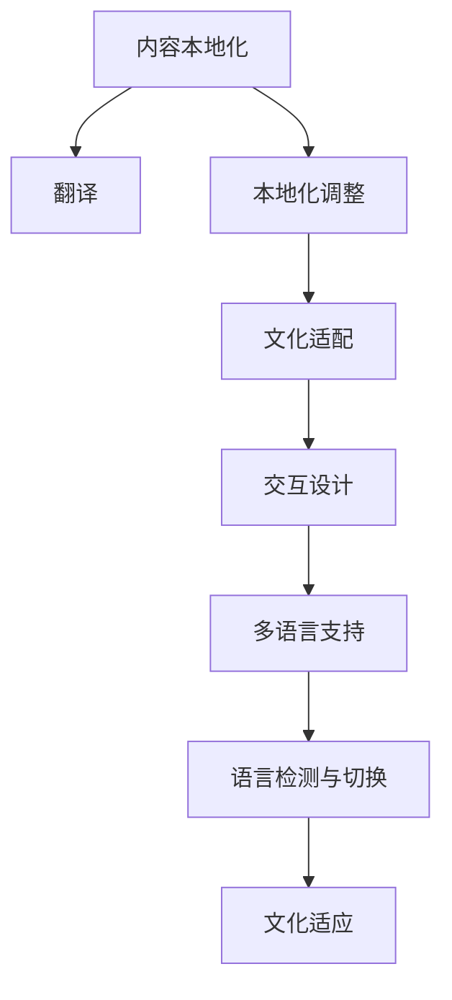

                 

# 知识付费创业中的内容本地化与国际化

## 1. 背景介绍

### 1.1 问题由来
随着移动互联网和智能设备的普及，知识付费市场迅速崛起，成为互联网行业的一块热土。在知识付费领域，内容是核心，但如何将高质量的内容传播到全球不同地区的用户，是知识付费创业中的一大挑战。因此，内容本地化和国际化成为知识付费创业中不可避免的重要课题。

### 1.2 问题核心关键点
内容本地化和国际化的关键点在于如何根据不同地区用户的语言、文化背景、知识水平和偏好，设计出既符合本地用户需求，又具备全球竞争力的内容产品。具体包括：

- 内容翻译：将原生内容翻译成目标语言，确保用户可以顺畅理解。
- 本地化调整：在内容形式、风格、话题选择等方面，根据目标地区特点进行调整。
- 文化适配：尊重不同地区文化习俗，避免误解和冲突。
- 交互设计：优化用户界面和交互流程，提升用户体验。
- 多语言支持：同时支持多种语言，降低国际扩展的门槛。

## 2. 核心概念与联系

### 2.1 核心概念概述

为更好地理解内容本地化和国际化的关键过程，本节将介绍几个密切相关的核心概念：

- 内容本地化：将原始内容按照目标语言和地区特色进行适应性修改和适配，确保内容的可访问性和用户共鸣。
- 内容国际化：确保内容设计符合全球用户通用标准，具有普适性和跨文化适应性。
- 翻译与本地化：将原生内容翻译成目标语言，并根据本地文化习俗进行相应调整。
- 多语言支持：支持多种语言，满足不同地区用户需求。
- 语言检测与切换：自动识别用户语言环境，提供多语言切换功能。
- 文化适应：理解并尊重目标地区的文化背景，避免文化冲突和误解。
- 交互设计：根据不同地区用户习惯，优化界面和交互流程，提升用户体验。

这些核心概念之间的逻辑关系可以通过以下Mermaid流程图来展示：



这个流程图展示了几大核心概念及其之间的关系：

1. 内容本地化需要包括翻译、本地化调整和用户界面优化等多个环节。
2. 翻译是将原生内容转换为目标语言的关键步骤。
3. 本地化调整和文化适配需要综合考虑不同地区的用户特点，确保内容的可访问性。
4. 交互设计要符合不同地区的用户习惯，提升用户体验。
5. 多语言支持和语言检测与切换，是实现内容国际化访问的重要手段。

## 3. 核心算法原理 & 具体操作步骤
### 3.1 算法原理概述

内容本地化和国际化的核心算法主要集中在自然语言处理(NLP)和机器翻译领域。其主要思想是通过机器学习模型，将原始内容转换为目标语言，并进行适应性调整。

具体步骤包括：

1. **内容翻译**：使用机器翻译模型将原始内容转换为目标语言。
2. **本地化调整**：对翻译后的内容进行适应性修改，如调整语序、语气、表达习惯等。
3. **文化适配**：根据目标地区的文化背景，对本地化后的内容进行进一步的调整和优化。
4. **多语言支持**：开发多语言支持系统，允许用户自由切换不同的语言环境。
5. **交互设计**：根据不同地区用户的操作习惯，优化界面和交互流程，提升用户体验。

### 3.2 算法步骤详解

以下将详细介绍内容本地化和国际化的主要步骤。

#### 3.2.1 内容翻译

内容翻译是内容本地化和国际化的第一步。其主要目标是将原始内容准确、自然地翻译成目标语言。

步骤如下：

1. **选择机器翻译模型**：根据目标语言的流行度、语料库的质量和模型的准确度，选择合适的机器翻译模型。

2. **翻译模型训练**：使用大规模双语对照语料进行模型训练，提升翻译的准确度和流畅度。

3. **模型选择和微调**：选择合适的机器翻译模型，并在目标语言环境下进行微调，以适应特定的语境和用例。

4. **翻译质量评估**：使用BLEU、ROUGE等指标评估翻译质量，确保翻译结果准确无误。

#### 3.2.2 本地化调整

本地化调整旨在使翻译后的内容符合目标地区用户的使用习惯和文化背景。

步骤如下：

1. **语序调整**：根据目标语言的习惯，调整翻译结果的语序，使其符合自然语言习惯。

2. **语气调整**：调整翻译结果的语气，使其与目标地区的语言风格相匹配。

3. **表达习惯调整**：调整翻译结果中的一些表达习惯，使其符合目标地区的语言习惯。

4. **语域适应**：根据目标语言的使用场景，调整翻译结果的语域，使其符合特定的使用场景。

#### 3.2.3 文化适配

文化适配是指在本地化调整之后，对翻译结果进行进一步的文化适应，确保其符合目标地区的文化背景和社会习俗。

步骤如下：

1. **文化元素适配**：将目标地区特有的文化元素，如节日、习俗、历史事件等，融入翻译结果中。

2. **敏感词汇调整**：根据目标地区的敏感词汇，调整翻译结果中的敏感词汇，避免产生误解和冲突。

3. **本地化术语**：根据目标地区的专业术语，对翻译结果中的专业术语进行本地化调整。

#### 3.2.4 多语言支持

多语言支持是实现内容国际化访问的关键步骤。

步骤如下：

1. **多语言支持系统开发**：开发多语言支持系统，支持多种语言的文本输入、输出和显示。

2. **多语言环境切换**：实现多语言环境切换功能，用户可以自由切换不同的语言环境。

3. **多语言数据存储**：将翻译后的内容存储在不同的语言版本中，方便用户访问。

#### 3.2.5 交互设计

交互设计旨在提升不同地区用户的体验，使其操作更加流畅、便捷。

步骤如下：

1. **用户界面设计**：根据不同地区用户的操作习惯，设计符合其操作习惯的用户界面。

2. **交互流程优化**：优化交互流程，减少用户的操作步骤，提升用户体验。

3. **反馈和定制**：收集用户反馈，根据反馈进行相应的定制和优化。

### 3.3 算法优缺点

内容本地化和国际化的算法具有以下优点：

1. **高效**：通过机器翻译和本地化调整，可以迅速将内容翻译成目标语言，并调整适应目标地区的语言习惯和文化背景。

2. **可扩展性**：可以轻松扩展到不同的语言和地区，实现全球内容覆盖。

3. **灵活性**：可以根据不同的语言和文化需求，灵活调整内容的形式和风格，提升用户体验。

4. **经济性**：通过自动化翻译和本地化调整，大大降低了人力成本。

同时，该算法也存在以下局限性：

1. **翻译质量**：机器翻译的质量往往难以达到人类翻译的水平，尤其是在特定领域和复杂的句子结构中。

2. **文化适配难度**：不同地区文化背景的差异较大，文化适配的难度较高，需要丰富的本地化经验。

3. **交互设计复杂**：不同地区用户的操作习惯和界面设计差异较大，需要大量的设计和测试工作。

4. **用户体验不一致**：不同地区用户对内容的接受度和使用习惯不同，可能导致用户体验不一致。

## 4. 数学模型和公式 & 详细讲解 & 举例说明

### 4.1 数学模型构建

内容本地化和国际化的主要数学模型包括机器翻译模型和本地化调整模型。

**机器翻译模型**：

假设原始内容为 $x$，目标语言为 $y$。机器翻译模型的任务是将 $x$ 转换为 $y$。数学表达式如下：

$$
y = f(x; \theta)
$$

其中 $f(\cdot)$ 为机器翻译模型，$\theta$ 为模型参数。

**本地化调整模型**：

本地化调整模型的目标是对机器翻译后的内容进行适应性修改，使其符合目标语言的使用习惯和文化背景。数学表达式如下：

$$
y_{\text{local}} = g(y; \phi)
$$

其中 $g(\cdot)$ 为本地化调整模型，$\phi$ 为模型参数。

### 4.2 公式推导过程

以下是机器翻译模型的详细推导过程：

1. **编码器**：将原始内容 $x$ 转换为向量表示 $h_x$。

2. **解码器**：将向量表示 $h_x$ 转换为目标语言 $y$。

3. **损失函数**：使用BLEU、ROUGE等指标，评估翻译质量。

$$
\ell(f(x; \theta)) = \text{BLEU}(f(x; \theta), y)
$$

### 4.3 案例分析与讲解

以“知识付费创业中的内容本地化和国际化”为例，介绍该模型在实际应用中的详细实现。

**案例一：英语内容翻译成中文**

1. **模型选择**：选择Google的机器翻译模型进行翻译。

2. **翻译模型训练**：使用大规模双语对照语料进行模型训练。

3. **模型微调**：在中文环境下进行微调，以适应中文的语言习惯和文化背景。

4. **翻译质量评估**：使用BLEU指标评估翻译质量，确保翻译结果准确无误。

**案例二：中文内容翻译成西班牙语**

1. **模型选择**：选择Microsoft的机器翻译模型进行翻译。

2. **翻译模型训练**：使用大规模双语对照语料进行模型训练。

3. **模型微调**：在西班牙语环境下进行微调，以适应西班牙语的语言习惯和文化背景。

4. **翻译质量评估**：使用BLEU指标评估翻译质量，确保翻译结果准确无误。

## 5. 项目实践：代码实例和详细解释说明

### 5.1 开发环境搭建

在进行内容本地化和国际化的实践前，我们需要准备好开发环境。以下是使用Python进行开发的环境配置流程：

1. 安装Anaconda：从官网下载并安装Anaconda，用于创建独立的Python环境。

2. 创建并激活虚拟环境：
```bash
conda create -n localization_env python=3.8 
conda activate localization_env
```

3. 安装相关库：
```bash
pip install nltk translate robotspy pycaret langdetect pandas
```

4. 安装Google Cloud Translation API：
```bash
pip install google-cloud-translate
```

完成上述步骤后，即可在`localization_env`环境中开始实践。

### 5.2 源代码详细实现

以下以“将英语内容翻译成中文”为例，给出代码实现。

首先，导入必要的库：

```python
from translate import Translator
from nltk.tokenize import word_tokenize
import pandas as pd
```

然后，实现翻译函数：

```python
def translate_to_chinese(text):
    translator = Translator(to_lang='zh-CN')
    return translator.translate(text)
```

接着，实现本地化调整函数：

```python
def localize(text):
    # 添加本地化调整逻辑，如语序调整、语气调整等
    return text
```

最后，实现文化适配函数：

```python
def cultural_adapt(text):
    # 添加文化适配逻辑，如文化元素适配、敏感词汇调整等
    return text
```

完整的代码实现如下：

```python
from translate import Translator
from nltk.tokenize import word_tokenize
import pandas as pd

def translate_to_chinese(text):
    translator = Translator(to_lang='zh-CN')
    return translator.translate(text)

def localize(text):
    # 添加本地化调整逻辑，如语序调整、语气调整等
    return text

def cultural_adapt(text):
    # 添加文化适配逻辑，如文化元素适配、敏感词汇调整等
    return text

# 测试翻译函数
text = "Hello, world!"
translated_text = translate_to_chinese(text)
print(translated_text)
```

### 5.3 代码解读与分析

让我们再详细解读一下关键代码的实现细节：

**translate_to_chinese函数**：
- 使用Google Cloud Translation API进行翻译。
- 将原始文本作为输入，翻译为中文。
- 返回翻译后的结果。

**localize函数**：
- 添加本地化调整逻辑，如调整语序、语气等。
- 对翻译结果进行本地化调整。
- 返回本地化后的结果。

**cultural_adapt函数**：
- 添加文化适配逻辑，如文化元素适配、敏感词汇调整等。
- 对本地化后的文本进行文化适配。
- 返回文化适配后的结果。

在实际应用中，这些函数可能需要根据不同的语言和文化需求进行灵活调整和优化。

## 6. 实际应用场景

### 6.1 智能客服系统

智能客服系统可以通过内容本地化和国际化，提升服务质量，满足全球用户需求。

具体而言：

1. **多语言支持**：提供多语言客服界面，支持用户自由切换不同的语言环境。
2. **本地化内容**：根据不同地区用户的操作习惯和文化背景，调整客服内容的风格和表达方式。
3. **文化适配**：理解并尊重不同地区文化习俗，避免误解和冲突。
4. **交互设计**：优化界面和交互流程，提升用户体验。

通过这些措施，智能客服系统可以更好地服务于全球用户，提升其满意度和忠诚度。

### 6.2 在线教育平台

在线教育平台可以通过内容本地化和国际化，提升教学质量和用户参与度。

具体而言：

1. **多语言支持**：提供多语言教学内容，满足不同地区用户的需求。
2. **本地化内容**：根据不同地区用户的学习习惯和文化背景，调整教学内容的难度和风格。
3. **文化适配**：理解并尊重不同地区文化习俗，避免误解和冲突。
4. **交互设计**：优化界面和交互流程，提升学习体验。

通过这些措施，在线教育平台可以更好地服务于全球用户，提升其学习效果和满意度。

### 6.3 旅游APP

旅游APP可以通过内容本地化和国际化，提升用户体验和运营效率。

具体而言：

1. **多语言支持**：提供多语言旅游内容，满足不同地区用户的需求。
2. **本地化内容**：根据不同地区用户的使用习惯和文化背景，调整旅游内容的展示方式。
3. **文化适配**：理解并尊重不同地区文化习俗，避免误解和冲突。
4. **交互设计**：优化界面和交互流程，提升用户体验。

通过这些措施，旅游APP可以更好地服务于全球用户，提升其旅游体验和运营效率。

### 6.4 未来应用展望

随着移动互联网和智能设备的普及，内容本地化和国际化将成为更多行业的重要课题。未来，内容本地化和国际化将在更多领域得到应用，为行业带来变革性影响。

在智慧医疗领域，通过本地化和国际化，医疗内容和系统可以更好地服务于全球患者，提升其治疗效果和满意度。

在智能教育领域，通过本地化和国际化，在线教育内容和平台可以更好地服务于全球学生，提升其学习效果和满意度。

在旅游服务领域，通过本地化和国际化，旅游内容和系统可以更好地服务于全球游客，提升其旅游体验和满意度。

此外，在企业客服、电子商务、金融服务、文化娱乐等众多领域，内容本地化和国际化也将不断涌现，为行业带来新的增长点。相信随着技术的日益成熟，内容本地化和国际化必将在各行各业大放异彩，深刻影响人类的生产生活方式。

## 7. 工具和资源推荐

### 7.1 学习资源推荐

为了帮助开发者系统掌握内容本地化和国际化的理论基础和实践技巧，这里推荐一些优质的学习资源：

1. 《自然语言处理入门》书籍：介绍了自然语言处理的基本概念和主要技术，包括机器翻译、本地化调整等。

2. 《多语言编程》课程：涵盖了多语言编程的基础知识和实战技巧，适合开发多语言支持系统。

3. 《文化适应与用户体验设计》书籍：介绍了如何理解不同地区文化习俗，优化用户界面和交互流程。

4. 《Google Cloud Translation API》文档：详细介绍了Google Cloud Translation API的使用方法，适合实现多语言翻译。

5. 《Natural Language Processing with PyTorch》书籍：介绍了如何使用PyTorch进行自然语言处理，包括机器翻译和本地化调整等。

通过对这些资源的学习实践，相信你一定能够快速掌握内容本地化和国际化的精髓，并用于解决实际的NLP问题。

### 7.2 开发工具推荐

高效的开发离不开优秀的工具支持。以下是几款用于内容本地化和国际化的常用工具：

1. PyTorch：基于Python的开源深度学习框架，灵活动态的计算图，适合快速迭代研究。

2. TensorFlow：由Google主导开发的开源深度学习框架，生产部署方便，适合大规模工程应用。

3. NLTK：Python自然语言处理工具包，提供丰富的NLP工具和库。

4. Google Cloud Translation API：Google提供的云端机器翻译服务，支持多种语言的翻译。

5. OpenNMT：开源的神经机器翻译工具，支持多种模型的训练和翻译。

6. IBM Watson Language Translator：IBM提供的云端机器翻译服务，支持多种语言的翻译和本地化调整。

合理利用这些工具，可以显著提升内容本地化和国际化的开发效率，加快创新迭代的步伐。

### 7.3 相关论文推荐

内容本地化和国际化发展源于学界的持续研究。以下是几篇奠基性的相关论文，推荐阅读：

1. "Neural Machine Translation by Jointly Learning to Align and Translate"（神经机器翻译：同时学习对齐和翻译）。

2. "Attention Is All You Need"（注意力是所有你需要的）。

3. "Scaling Up The State Of The Art In Machine Translation Using Ensemble Modeling"（使用集成模型提升机器翻译性能）。

4. "Adapting Pretrained Language Models To New Tasks With Adapters"（通过Adapter调整预训练语言模型以适应新任务）。

5. "Multilingual Denoising Pretraining for Neural Machine Translation"（多语言去噪预训练提升神经机器翻译性能）。

这些论文代表了大语言模型和微调技术的发展脉络。通过学习这些前沿成果，可以帮助研究者把握学科前进方向，激发更多的创新灵感。

## 8. 总结：未来发展趋势与挑战

### 8.1 总结

本文对内容本地化和国际化的关键技术进行了全面系统的介绍。首先阐述了内容本地化和国际化的背景和意义，明确了其在全球知识付费创业中的重要地位。其次，从原理到实践，详细讲解了机器翻译、本地化调整和文化适配等关键步骤，给出了实际应用中的代码实例。同时，本文还广泛探讨了内容本地化和国际化在多个行业领域的应用前景，展示了其巨大的潜力。最后，本文精选了相关学习资源和开发工具，力求为读者提供全方位的技术指引。

通过本文的系统梳理，可以看到，内容本地化和国际化是知识付费创业中不可或缺的重要技术。该技术不仅能显著提升内容的可访问性和用户共鸣，还能降低国际化扩展的门槛，增强全球竞争力。未来，伴随技术的不断进步，内容本地化和国际化必将在更多领域得到应用，为各行各业带来新的突破。

### 8.2 未来发展趋势

展望未来，内容本地化和国际化的技术将呈现以下几个发展趋势：

1. **自动化程度提高**：通过深度学习和自然语言处理技术，实现内容翻译和本地化的自动化。

2. **多模态支持**：结合文本、图像、语音等多种模态，提升内容的丰富性和可读性。

3. **实时翻译和本地化**：实现实时翻译和本地化，满足用户即时需求。

4. **个性化内容生成**：通过深度学习技术，生成个性化的本地化内容，提升用户体验。

5. **跨语言情感分析**：分析不同语言的用户情感，优化内容和交互设计。

6. **交互式本地化**：结合用户反馈，实时调整内容和交互方式，提升用户体验。

以上趋势凸显了内容本地化和国际化的广阔前景。这些方向的探索发展，必将进一步提升内容产品的质量和用户满意度，实现全球内容覆盖和市场拓展。

### 8.3 面临的挑战

尽管内容本地化和国际化的技术已经取得了瞩目成就，但在迈向更加智能化、普适化应用的过程中，它仍面临着诸多挑战：

1. **数据质量问题**：翻译和本地化需要高质量的双语对照语料，但数据获取成本高、质量参差不齐。

2. **文化适配难度**：不同地区文化背景的差异较大，文化适配的难度较高，需要丰富的本地化经验。

3. **用户体验不一致**：不同地区用户对内容的接受度和使用习惯不同，可能导致用户体验不一致。

4. **交互设计复杂**：不同地区用户的操作习惯和界面设计差异较大，需要大量的设计和测试工作。

5. **技术成本高**：深度学习和自然语言处理技术的高成本，限制了技术在小微企业和个人开发者中的应用。

6. **伦理和安全问题**：用户隐私和数据安全问题需要得到妥善解决，避免数据泄露和滥用。

正视内容本地化和国际化面临的这些挑战，积极应对并寻求突破，将是大语言模型微调走向成熟的必由之路。相信随着学界和产业界的共同努力，这些挑战终将一一被克服，内容本地化和国际化必将在构建人机协同的智能时代中扮演越来越重要的角色。

### 8.4 研究展望

未来，内容本地化和国际化的研究需要在以下几个方面寻求新的突破：

1. **大规模数据集和预训练模型**：通过大规模双语语料库和预训练模型，提升翻译和本地化的质量。

2. **多语言联合训练**：结合多种语言进行联合训练，提升翻译和本地化的效果。

3. **零样本和少样本翻译**：通过零样本和少样本翻译技术，提升内容覆盖和本地化的效率。

4. **实时翻译和本地化**：结合实时翻译和本地化技术，满足用户即时需求。

5. **跨语言情感分析**：结合跨语言情感分析技术，提升内容的优化和用户反馈。

6. **跨领域知识融合**：结合跨领域知识库，提升内容的丰富性和可读性。

这些研究方向的探索，必将引领内容本地化和国际化的技术迈向更高的台阶，为构建人机协同的智能时代提供新的支持。

## 9. 附录：常见问题与解答

**Q1：内容本地化和国际化与多语言支持有何区别？**

A: 多语言支持只是内容本地化和国际化的其中一个环节，即支持不同语言的输入和输出。而内容本地化和国际化还包括本地化调整、文化适配、交互设计等环节，旨在确保内容的可访问性和用户共鸣，避免文化冲突和误解，提升用户体验。

**Q2：内容本地化和国际化需要多少标注数据？**

A: 标注数据的数量对内容本地化和国际化的效果有重要影响。一般来说，标注数据的数量越大，翻译和本地化的效果越好。但标注数据的获取成本较高，需要根据实际需求和资源情况进行权衡。

**Q3：内容本地化和国际化如何实现实时翻译和本地化？**

A: 实时翻译和本地化需要结合实时翻译技术和本地化调整模型，对用户输入进行实时翻译和本地化调整。常用的实时翻译技术包括Google Cloud Translation API、IBM Watson Language Translator等。

**Q4：内容本地化和国际化如何避免文化冲突和误解？**

A: 避免文化冲突和误解需要在内容翻译和本地化过程中，充分考虑不同地区文化背景和社会习俗。具体措施包括：理解目标地区的文化习俗，避免使用敏感词汇，尊重目标地区的宗教、语言习惯等。

**Q5：内容本地化和国际化需要哪些技术支持？**

A: 内容本地化和国际化需要以下技术支持：

1. 机器翻译技术，用于将原始内容翻译成目标语言。
2. 本地化调整技术，用于对翻译结果进行适应性修改。
3. 文化适配技术，用于对本地化后的内容进行进一步的文化适应。
4. 多语言支持技术，用于实现多语言翻译和本地化。
5. 交互设计技术，用于优化用户界面和交互流程，提升用户体验。

通过这些技术支持，可以全面提升内容本地化和国际化的效果和用户体验。

---

作者：禅与计算机程序设计艺术 / Zen and the Art of Computer Programming

