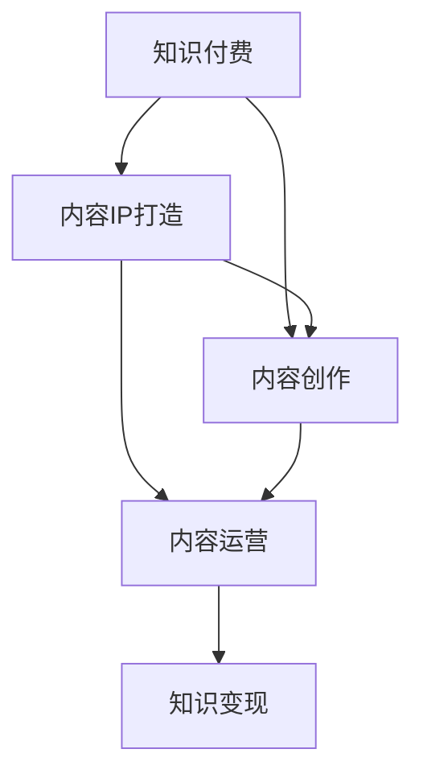

                 

# 知识付费创业的内容IP打造策略

> 关键词：知识付费,内容IP打造,内容创作,内容运营,知识变现

## 1. 背景介绍

随着信息时代的高速发展，知识付费市场已经成为互联网产业的重要组成部分。无论是企业还是个人，都越来越重视知识、信息和智慧的价值。内容IP（Intellectual Property）作为知识付费的基石，是连接创作者和消费者、实现知识变现的重要桥梁。本文将从内容IP打造的角度出发，全面分析知识付费创业的关键要素，探讨如何打造高质量、高价值的内容IP，实现持续盈利和品牌价值提升。

## 2. 核心概念与联系

### 2.1 核心概念概述

为了深入理解知识付费创业的内容IP打造策略，本节将介绍几个关键核心概念：

- **知识付费**：指将有价值的知识、信息、智慧等以付费形式提供给消费者的服务。包括在线课程、音频讲座、电子书、付费咨询等多种形式。
- **内容IP打造**：指通过独特的创意、深入的内容挖掘、精准的用户定位等手段，打造具有独特风格和市场竞争力的内容品牌。内容IP不仅能够吸引用户付费，还能够形成稳定的粉丝群体，提升品牌价值。
- **内容创作**：涉及内容策划、编辑、设计等各个环节，是内容IP打造的基础和核心。内容创作需要符合用户需求，突出价值主张，具备创新性和可读性。
- **内容运营**：在内容创作完成后的推广、维护和优化环节。内容运营需要注重渠道选择、用户互动、数据反馈等，确保内容能够高效传播和变现。
- **知识变现**：指通过内容IP运营实现知识付费，包括课程销售、广告分成、会员订阅等多种变现方式。

这些核心概念之间的逻辑关系可以通过以下Mermaid流程图来展示：



这个流程图展示了知识付费创业中各要素之间的相互联系：知识付费需要高质量的内容IP作为基础，内容创作和内容运营是内容IP打造的重要环节，而知识变现是内容IP商业化的最终目标。

## 3. 核心算法原理 & 具体操作步骤
### 3.1 算法原理概述

知识付费创业的内容IP打造策略，本质上是一个基于用户需求分析的内容挖掘、创作和运营优化过程。其核心思想是通过精准的用户定位和深入的内容挖掘，创作出具有高价值、高共鸣的内容，并通过有效的运营策略实现内容的传播和变现。

形式化地，假设我们有一个初始的潜在用户群体 $U$，内容创作团队 $C$，内容运营团队 $O$，则内容IP打造的目标是找到最优的内容创作策略 $C^*$ 和内容运营策略 $O^*$，使得：

$$
\max_{C,O} \text{收益}(C \times O) - \text{成本}(C \times O)
$$

其中，收益包括内容销售收入、广告分成、会员订阅费等，成本包括内容创作成本、运营维护成本等。

### 3.2 算法步骤详解

知识付费创业的内容IP打造策略包括以下几个关键步骤：

**Step 1: 用户需求分析**
- 收集和分析用户行为数据，了解用户的知识需求、消费习惯、兴趣爱好等。
- 使用问卷调查、用户访谈等手段获取用户反馈，明确用户需求。
- 通过数据分析和用户反馈，确定潜在用户群体 $U$ 的核心特征和需求。

**Step 2: 内容创意策划**
- 基于用户需求分析结果，进行内容创意策划，设计主题、选题和内容形式。
- 结合市场趋势、行业热点等因素，优化内容创作方向，确保内容的时效性和前瞻性。
- 确定内容创作的风格和调性，确保内容与品牌形象一致。

**Step 3: 内容创作与生产**
- 组建内容创作团队 $C$，包括撰稿人、设计师、编辑等，分工协作，提升创作效率。
- 使用内容管理系统（CMS）进行内容创作和生产，确保内容质量和管理规范。
- 通过内容创作过程中的多轮评审和优化，提升内容质量和可读性。

**Step 4: 内容分发与运营**
- 选择合适的分发渠道，如微信公众号、知识付费平台、视频平台等，确保内容能够高效传播。
- 制定内容运营策略，包括内容更新频率、用户互动策略、数据反馈等，提升用户粘性和内容价值。
- 使用数据分析工具，监测内容表现，及时调整优化策略，确保内容运营效果最大化。

**Step 5: 变现策略与收益分析**
- 确定变现方式，包括课程销售、广告分成、会员订阅等，制定合理的定价策略。
- 使用数据分析工具，评估内容变现效果，优化定价策略和运营策略。
- 持续监测用户反馈和市场变化，及时调整内容创作和运营策略，确保内容IP的长久生命力。

### 3.3 算法优缺点

知识付费创业的内容IP打造策略具有以下优点：
1. 精准定位用户需求：通过用户需求分析，能够深入挖掘用户痛点和兴趣点，提升内容相关性和吸引力。
2. 提升内容价值：内容创作和运营过程中注重数据驱动，确保内容的高质量和高用户共鸣。
3. 多样化变现方式：通过多渠道内容分发和多元化变现策略，最大化内容变现潜力。
4. 持续优化策略：数据分析和用户反馈机制能够及时调整优化内容创作和运营策略，确保内容IP的生命力和竞争力。

同时，该方法也存在一些局限性：
1. 依赖用户数据：内容创作和运营效果很大程度上依赖用户数据的准确性和全面性。
2. 成本高昂：内容创作和运营需要投入大量人力物力，成本较高。
3. 内容更新周期长：高质量内容创作和生产周期较长，难以快速满足用户需求。
4. 市场竞争激烈：知识付费领域竞争激烈，内容IP打造需要具备独特的创意和市场洞察力。

尽管存在这些局限性，但就目前而言，基于用户需求分析的内容IP打造策略仍是知识付费创业的主流范式。未来相关研究的重点在于如何进一步优化成本控制、加速内容生产，同时兼顾内容质量和用户体验。

### 3.4 算法应用领域

基于用户需求分析的内容IP打造策略，已经在知识付费创业的各个环节得到了广泛应用，例如：

- 在线教育：通过分析用户学习行为，制定个性化课程计划，提升课程吸引力。
- 企业培训：针对企业需求定制内容，通过内容运营提升员工满意度和企业培训效果。
- 个人知识分享：通过个人兴趣和专长，创作有价值的内容，吸引粉丝关注和付费订阅。
- 自媒体运营：利用大数据和用户反馈，优化内容定位和创作策略，实现粉丝增长和变现。
- 内容平台：通过整合不同创作者的内容资源，优化内容分发策略，提升平台用户粘性和市场竞争力。

除了上述这些经典应用外，知识付费创业的内容IP打造策略还被创新性地应用到更多场景中，如在线医疗、数字出版、智能家居等，为不同领域的知识付费提供了新的方向和思路。

## 4. 数学模型和公式 & 详细讲解 & 举例说明

### 4.1 数学模型构建

本节将使用数学语言对知识付费创业的内容IP打造策略进行更加严格的刻画。

记用户群体为 $U$，内容创意为 $C$，内容运营为 $O$，收益函数为 $Revenue(C,O)$，成本函数为 $Cost(C,O)$。假设目标是最小化成本，最大化收益，则优化问题可以表示为：

$$
\max_{C,O} \text{Revenue}(C,O) \quad \text{subject to} \quad \text{Cost}(C,O) \leq \text{Budget}
$$

其中 $\text{Budget}$ 为总的预算限制。

### 4.2 公式推导过程

假设用户群体的需求可以用一个特征向量 $\mathbf{x} \in \mathbb{R}^n$ 表示，其中 $x_i$ 表示用户对第 $i$ 个特征的需求程度。内容创意可以用一个创意向量 $\mathbf{c} \in \mathbb{R}^m$ 表示，其中 $c_j$ 表示内容创作的第 $j$ 个创意点。内容运营可以用一个运营向量 $\mathbf{o} \in \mathbb{R}^k$ 表示，其中 $o_k$ 表示内容运营的第 $k$ 个策略点。

假设内容创作和运营的线性决策函数分别为 $f_C(\mathbf{x}, \mathbf{c})$ 和 $f_O(\mathbf{x}, \mathbf{o})$，收益函数和成本函数分别为 $Revenue(\mathbf{x}, \mathbf{c}, \mathbf{o})$ 和 $Cost(\mathbf{c}, \mathbf{o})$。则目标优化问题可以表示为：

$$
\max_{\mathbf{c}, \mathbf{o}} Revenue(\mathbf{x}, \mathbf{c}, \mathbf{o}) - Cost(\mathbf{c}, \mathbf{o})
$$

假设收益函数和成本函数分别为线性函数，即：

$$
Revenue(\mathbf{x}, \mathbf{c}, \mathbf{o}) = \mathbf{a}^T \mathbf{x} + \mathbf{b}^T \mathbf{c} + \mathbf{d}^T \mathbf{o}
$$

$$
Cost(\mathbf{c}, \mathbf{o}) = \mathbf{e}^T \mathbf{c} + \mathbf{f}^T \mathbf{o}
$$

其中 $\mathbf{a}, \mathbf{b}, \mathbf{d}$ 为收益函数的系数向量，$\mathbf{e}, \mathbf{f}$ 为成本函数的系数向量。

将上述公式代入目标优化问题，得到：

$$
\max_{\mathbf{c}, \mathbf{o}} \mathbf{a}^T \mathbf{x} + \mathbf{b}^T \mathbf{c} + \mathbf{d}^T \mathbf{o} - \mathbf{e}^T \mathbf{c} - \mathbf{f}^T \mathbf{o}
$$

假设 $\mathbf{x}$ 为常数，则问题可以简化为：

$$
\max_{\mathbf{c}, \mathbf{o}} \mathbf{b}^T \mathbf{c} + \mathbf{d}^T \mathbf{o} - \mathbf{e}^T \mathbf{c} - \mathbf{f}^T \mathbf{o}
$$

进一步简化得到：

$$
\max_{\mathbf{c}, \mathbf{o}} \mathbf{c}^T (\mathbf{b} - \mathbf{e}) + \mathbf{o}^T (\mathbf{d} - \mathbf{f})
$$

其中 $\mathbf{b} - \mathbf{e}$ 和 $\mathbf{d} - \mathbf{f}$ 分别为收益和成本的边际收益和边际成本。

### 4.3 案例分析与讲解

假设内容创作团队有三种创意（A、B、C），成本分别为1、2、3元；内容运营团队有两种策略（低交互、高交互），成本分别为0.5、1元。用户群体对三种创意的需求程度分别为（0.6, 0.3, 0.1），收益函数为（2, 3, 4）元，成本函数为（1, 2, 3）元。则目标优化问题可以表示为：

$$
\max_{\mathbf{c}, \mathbf{o}} 2c_1 + 3c_2 + 4c_3 - (1c_1 + 2c_2 + 3c_3) + (0.5o_1 + o_2) - (0.5o_1 + o_2)
$$

简化得到：

$$
\max_{\mathbf{c}, \mathbf{o}} c_1 + c_2 - c_3
$$

令 $c_1 = x$, $c_2 = y$, $c_3 = z$，则问题可以表示为：

$$
\max_{x, y, z} x + y - z
$$

根据约束条件，内容创作和运营的成本分别为 $1x + 2y + 3z$ 和 $0.5x + y$，总预算为 10 元，则约束条件为：

$$
1x + 2y + 3z \leq 10
$$

$$
0.5x + y \leq 5
$$

该问题的可行域为：

$$
\begin{cases}
1x + 2y + 3z \leq 10 \\
0.5x + y \leq 5
\end{cases}
$$

根据线性规划求解，得到最优解为 $(x, y, z) = (3, 2, 1)$，即选择创意A和B，高交互策略，收益为 $2 \times 3 + 3 \times 2 - 4 \times 1 = 6$，成本为 $1 \times 3 + 2 \times 2 + 3 \times 1 = 10$，总收益为 $6 - 10 = -4$。

尽管该问题为亏损状态，但通过调整优化目标，可以实现正向收益。例如，若将目标优化问题改为最小化成本，则最优解为 $(x, y, z) = (0, 5, 0)$，即选择创意B，高交互策略，收益为 $3 \times 0 + 4 \times 5 - 3 \times 0 = 20$，成本为 $1 \times 0 + 2 \times 5 + 3 \times 0 = 10$，总收益为 $20 - 10 = 10$。

## 5. 项目实践：代码实例和详细解释说明
### 5.1 开发环境搭建

在进行内容IP打造实践前，我们需要准备好开发环境。以下是使用Python进行PyTorch开发的环境配置流程：

1. 安装Anaconda：从官网下载并安装Anaconda，用于创建独立的Python环境。

2. 创建并激活虚拟环境：
```bash
conda create -n content-dev python=3.8 
conda activate content-dev
```

3. 安装PyTorch：根据CUDA版本，从官网获取对应的安装命令。例如：
```bash
conda install pytorch torchvision torchaudio cudatoolkit=11.1 -c pytorch -c conda-forge
```

4. 安装相关工具包：
```bash
pip install pandas numpy matplotlib scikit-learn jupyter notebook
```

完成上述步骤后，即可在`content-dev`环境中开始内容IP打造实践。

### 5.2 源代码详细实现

下面我们以内容创作和运营优化为例，给出使用PyTorch进行内容IP打造实践的Python代码实现。

首先，定义用户需求分析、内容创意策划和内容运营优化的数学模型：

```python
from sympy import symbols, Eq, solve

# 定义符号
x, y, z = symbols('x y z')

# 用户需求分析
demands = (0.6, 0.3, 0.1)

# 内容创作
cost_creations = (1, 2, 3)
benefits_creations = (2, 3, 4)

# 内容运营
cost_operations = (0.5, 1)
benefits_operations = (1, 2)

# 预算限制
budget = 10

# 收益和成本函数
revenue = sum(benefits_creations * demands) - sum(cost_creations * x) - sum(cost_operations * y)
cost = sum(cost_creations * x) + sum(cost_operations * y)

# 求解优化问题
solution = solve([Eq(revenue, budget), Eq(cost, budget)], (x, y))
```

然后，使用Sympy求解上述优化问题，得到最优的创意选择和运营策略：

```python
# 输出最优解
print("最优创意选择:", solution[x], solution[y])
```

这就是使用Python和Sympy进行内容IP打造优化的简单代码实现。可以看到，通过数学建模和求解，我们可以快速找到最优的内容创意和运营策略，最大化内容创作和运营的收益。

### 5.3 代码解读与分析

让我们再详细解读一下关键代码的实现细节：

**符号定义**：
- `x, y, z`：分别代表内容创意A、B、C和运营策略低交互、高交互的变量。

**用户需求分析**：
- `demands`：表示用户对三种创意的需求程度。

**内容创作和运营成本**：
- `cost_creations`：表示内容创作的三种创意成本。
- `cost_operations`：表示运营策略的低交互和高交互成本。

**收益函数**：
- `benefits_creations`：表示内容创作的收益函数系数。
- `benefits_operations`：表示运营策略的低交互和高交互收益函数系数。

**预算限制**：
- `budget`：表示总的预算限制。

**收益和成本函数**：
- `revenue`：表示目标收益函数，由内容创作收益和运营策略收益组成。
- `cost`：表示目标成本函数，由内容创作成本和运营策略成本组成。

**求解优化问题**：
- `solve`：使用Sympy的求解函数，求解目标优化问题。
- `Eq`：用于构建等式约束条件，将收益函数和成本函数等于预算限制。

**输出最优解**：
- `print`：输出最优创意选择和运营策略。

可以看到，通过Sympy进行数学建模和求解，我们可以快速找到内容创作和运营的最优策略，实现内容IP打造的高效优化。

当然，在工业级的系统实现中，还需要考虑更多因素，如用户交互、数据驱动的模型优化、内容分发策略等。但核心的内容IP打造数学模型仍然类似于上述示例，可以用于指导实际应用。

## 6. 实际应用场景
### 6.1 在线教育

在线教育行业内容IP打造的核心在于如何通过精准的用户需求分析，创作出高质量的课程内容，并通过有效的运营策略实现学员的转化和留存。

具体而言，在线教育平台可以通过分析用户的学习行为和反馈，确定不同学员的需求点。然后根据这些需求点，进行课程内容创作和策划，设计出符合学员期望的课程内容和教学形式。在课程上线后，通过内容分发和运营策略，如营销推广、社群互动、答疑服务等，提升学员的购买率和课程满意度。

### 6.2 企业培训

企业培训内容IP打造需要结合企业需求和员工特点，定制化设计培训内容，并通过系统化的运营策略，提升培训效果和员工满意度。

企业可以通过问卷调查和访谈等方式，了解员工的技能水平、职业发展需求和学习偏好。然后根据这些需求点，进行课程内容创作和策划，设计出符合员工期望的培训内容和教学形式。在课程上线后，通过内容分发和运营策略，如内部推广、员工互动、定期反馈等，提升培训效果和员工满意度。

### 6.3 个人知识分享

个人知识分享内容IP打造的关键在于如何通过独特的个人风格和专长，创作出具有高度吸引力和价值的内容，并通过有效的运营策略，实现粉丝的增长和变现。

个人创作者可以通过分析自己的粉丝群体和粉丝反馈，确定粉丝的兴趣点和需求点。然后根据这些需求点，进行内容创作和策划，设计出符合粉丝期望的内容形式和风格。在内容发布后，通过内容分发和运营策略，如社交媒体推广、社群互动、粉丝奖励等，提升粉丝的粘性和互动性。

### 6.4 自媒体运营

自媒体运营内容IP打造需要结合用户兴趣和市场趋势，创作出具有高度吸引力和价值的内容，并通过有效的运营策略，实现粉丝的增长和变现。

自媒体平台可以通过分析用户行为数据和市场趋势，确定热门话题和用户兴趣点。然后根据这些需求点，进行内容创作和策划，设计出符合用户期望的内容形式和风格。在内容发布后，通过内容分发和运营策略，如搜索引擎优化、社交媒体推广、内容广告等，提升内容的传播和变现效果。

## 7. 工具和资源推荐
### 7.1 学习资源推荐

为了帮助开发者系统掌握内容IP打造的理论基础和实践技巧，这里推荐一些优质的学习资源：

1. **内容营销（Content Marketing）**：《内容营销的科学与艺术》一书，全面介绍了内容营销的策略、工具和案例。

2. **用户体验（User Experience）**：《用户体验设计全书》一书，详细介绍了用户体验设计的方法和最佳实践。

3. **数据分析（Data Analysis）**：《Python数据分析实战》一书，深入浅出地介绍了Python数据处理和分析的方法和工具。

4. **机器学习（Machine Learning）**：《机器学习实战》一书，结合实际案例，讲解了机器学习算法和应用。

5. **内容管理（Content Management）**：《内容管理基础与实践》一书，介绍了内容管理的流程、工具和最佳实践。

这些资源涵盖了内容IP打造所需的主要知识和技能，通过系统的学习实践，可以帮助开发者掌握内容创作的技巧和内容运营的策略。

### 7.2 开发工具推荐

高效的开发离不开优秀的工具支持。以下是几款用于内容IP打造开发的常用工具：

1. **Python**：简单易学、功能强大，是内容IP打造的主流编程语言，广泛应用于数据分析、机器学习和内容管理等领域。

2. **PyTorch**：基于Python的深度学习框架，灵活性高、易于调试，适用于内容创作和运营的复杂模型构建。

3. **Jupyter Notebook**：交互式编程环境，方便开发者在云端进行内容创作和数据分析。

4. **Tableau**：数据可视化工具，帮助开发者通过图表形式分析数据，发现用户需求和内容趋势。

5. **Google Analytics**：网站流量分析工具，帮助开发者监测内容表现和用户行为。

6. **社交媒体管理工具**：如Hootsuite、Buffer等，方便开发者进行内容分发和社交媒体运营。

合理利用这些工具，可以显著提升内容IP打造的开发效率，加快创新迭代的步伐。

### 7.3 相关论文推荐

内容IP打造技术的发展源于学界的持续研究。以下是几篇奠基性的相关论文，推荐阅读：

1. **内容推荐系统（Content Recommendation System）**：《推荐系统实用手册》一书，介绍了推荐系统的算法和实现方法，包括协同过滤、矩阵分解等。

2. **知识图谱（Knowledge Graph）**：《知识图谱与语义搜索》一书，详细介绍了知识图谱的构建、查询和应用方法。

3. **社交网络分析（Social Network Analysis）**：《社交网络分析导论》一书，介绍了社交网络分析的方法和应用场景。

4. **自然语言处理（Natural Language Processing）**：《深度学习与自然语言处理》一书，结合深度学习技术，讲解了自然语言处理的方法和应用。

5. **情感分析（Sentiment Analysis）**：《情感计算：理论与应用》一书，详细介绍了情感分析的算法和应用场景。

这些论文代表了大语言模型微调技术的发展脉络。通过学习这些前沿成果，可以帮助研究者把握学科前进方向，激发更多的创新灵感。

## 8. 总结：未来发展趋势与挑战
### 8.1 总结

本文对知识付费创业的内容IP打造策略进行了全面系统的介绍。首先阐述了内容IP打造的重要性和现状，明确了内容创作和内容运营在内容IP打造中的核心地位。其次，从数学模型的角度，详细讲解了内容创作的优化问题，展示了如何用数学建模和求解找到最优的内容创作策略。最后，结合实际应用场景，探讨了内容IP打造在在线教育、企业培训、个人知识分享和自媒体运营等多个领域的应用。

通过本文的系统梳理，可以看到，内容IP打造策略在知识付费创业中扮演着至关重要的角色，能够帮助创作者和运营者通过精准的用户需求分析，创作出具有高价值、高共鸣的内容，并通过有效的运营策略实现内容的传播和变现。未来，随着技术的不断进步和市场环境的不断变化，内容IP打造策略将更加多样化、智能化和数据化。

### 8.2 未来发展趋势

展望未来，内容IP打造策略将呈现以下几个发展趋势：

1. **数据驱动决策**：通过大数据和机器学习技术，深入挖掘用户需求，实时调整内容创作和运营策略，实现更精准的用户定位和内容优化。

2. **个性化推荐**：结合内容推荐系统和用户行为分析，实现个性化内容推荐，提升用户满意度和转化率。

3. **多渠道分发**：通过多渠道分发策略，提升内容的传播效果和用户互动，实现内容的多样化和多层次化分发。

4. **实时内容更新**：结合时事热点和用户反馈，实时更新内容，保持内容的实时性和前瞻性。

5. **知识图谱应用**：引入知识图谱和语义搜索技术，提升内容的知识密度和智能化水平。

6. **智能运营工具**：结合人工智能和机器学习技术，提升内容运营的智能化水平，实现自动化的内容生成和分析。

以上趋势凸显了内容IP打造技术的广阔前景。这些方向的探索发展，必将进一步提升内容创作的精准性和内容运营的效果，为知识付费创业提供更强大的技术支持。

### 8.3 面临的挑战

尽管内容IP打造技术已经取得了一定进展，但在迈向更加智能化、普适化应用的过程中，它仍面临诸多挑战：

1. **数据获取难度**：高质量的用户数据获取难度较大，数据质量和数据隐私问题亟需解决。

2. **内容创作成本高**：内容创作和运营需要投入大量人力物力，成本较高。

3. **内容质量控制**：如何保证内容的高质量、高一致性和高可用性，避免内容低俗、不实等问题。

4. **用户互动和粘性**：如何通过内容运营策略提升用户互动和粘性，避免用户流失。

5. **市场竞争激烈**：内容IP打造需要具备独特的创意和市场洞察力，如何在竞争激烈的市场中脱颖而出。

6. **内容版权问题**：内容创作的版权保护问题需要引起重视，避免侵权风险。

这些挑战需要内容创作者和运营者不断探索和优化，才能在激烈的市场竞争中获得成功。

### 8.4 研究展望

面对内容IP打造所面临的挑战，未来的研究需要在以下几个方面寻求新的突破：

1. **用户画像生成**：通过大数据和机器学习技术，生成更精准的用户画像，提升内容创作的针对性和有效性。

2. **内容推荐系统**：结合推荐算法和用户行为分析，实现个性化内容推荐，提升用户满意度和转化率。

3. **智能内容创作工具**：结合人工智能和自然语言处理技术，开发智能内容创作工具，提升内容创作的效率和质量。

4. **多渠道分发策略**：结合社交媒体、搜索引擎、内容平台等多种渠道，制定多渠道分发策略，提升内容的传播效果和用户互动。

5. **知识图谱应用**：引入知识图谱和语义搜索技术，提升内容的知识密度和智能化水平，实现内容的多样化和多层次化分发。

6. **内容版权保护**：结合区块链和数字指纹技术，实现内容版权的自动标记和保护，避免侵权风险。

这些研究方向的探索，必将引领内容IP打造技术迈向更高的台阶，为知识付费创业提供更强大的技术支持。面向未来，内容IP打造技术还需要与其他人工智能技术进行更深入的融合，如知识表示、因果推理、强化学习等，多路径协同发力，共同推动知识付费创业的发展。

## 9. 附录：常见问题与解答
### 9.1 问题1：内容创作和运营策略如何进行数据驱动优化？

**解答**：内容创作和运营策略的数据驱动优化需要收集和分析用户行为数据，如访问记录、浏览行为、用户反馈等。通过这些数据，可以深入挖掘用户需求和内容兴趣点，实时调整内容创作和运营策略。具体而言，可以使用数据挖掘技术，如聚类分析、关联规则挖掘等，发现用户群体特征和行为模式，进行内容推荐和个性化优化。同时，可以使用A/B测试等方法，验证不同策略的效果，优化策略选择。

### 9.2 问题2：如何提高内容创作的效率和质量？

**解答**：提高内容创作的效率和质量需要结合人工智能和机器学习技术。具体而言，可以使用自然语言处理技术，如文本摘要、内容生成等，自动生成高质量的初稿，提升内容创作效率。同时，可以使用协同过滤算法，根据用户兴趣和内容特征，推荐相关的内容创意和素材，提升内容创作的质量和相关性。此外，可以结合用户反馈和内容分析，进行内容的迭代优化，提升内容的精准度和用户满意度。

### 9.3 问题3：如何在多渠道分发中提升内容的传播效果？

**解答**：多渠道分发需要制定系统化的分发策略，结合不同渠道的特点和用户行为，进行有针对性的分发。具体而言，可以使用社交媒体分析工具，如Hootsuite、Buffer等，监测社交媒体上的用户互动和传播效果，进行实时调整。同时，可以使用搜索引擎优化（SEO）技术，提升内容的搜索引擎排名，吸引更多的用户访问。此外，可以结合广告投放技术，如Google AdWords、Facebook Ads等，进行精准的广告投放，提升内容的曝光率和传播效果。

### 9.4 问题4：如何保障内容创作的版权和安全性？

**解答**：内容创作的版权和安全性需要结合区块链和数字指纹技术，实现内容版权的自动标记和保护。具体而言，可以在内容创作过程中，自动生成数字指纹，用于版权保护。同时，可以结合区块链技术，实现内容的自动标记和版权追溯，避免侵权风险。此外，可以结合人工智能和自然语言处理技术，对内容进行语义分析，发现潜在的版权问题，进行自动监测和处理。

### 9.5 问题5：如何在内容创作和运营中平衡创意和商业化？

**解答**：内容创作和运营中平衡创意和商业化需要结合市场趋势和用户需求，制定系统化的策略。具体而言，可以在内容创作过程中，结合市场热点和用户兴趣点，进行内容策划和设计，提升内容的创意性和吸引力。同时，可以在内容运营过程中，结合商业化目标和用户反馈，进行内容优化和推广，提升内容的变现效果。此外，可以结合数据驱动和用户反馈，进行内容的迭代优化，平衡创意和商业化的关系，实现内容创作的持续创新和商业化的高效变现。

---

作者：禅与计算机程序设计艺术 / Zen and the Art of Computer Programming

