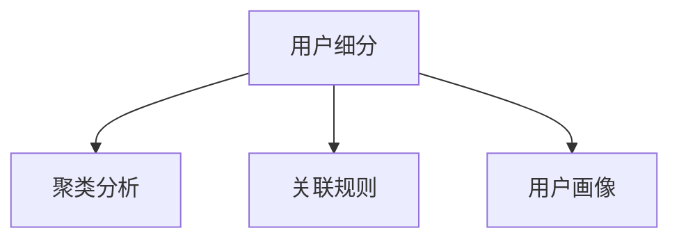

                 

# 知识付费创业的用户细分方法论

> 关键词：知识付费, 用户细分, 数据科学, 市场分析, 模型构建, 用户画像, 精准营销

## 1. 背景介绍

### 1.1 问题由来

随着互联网的普及和人们生活水平的提高，越来越多的人开始关注知识付费，希望通过学习新知识和技能来提升个人能力，增加职业竞争力。知识付费市场正处于快速增长阶段，而如何在竞争激烈的市场中脱颖而出，成为各大知识付费平台亟待解决的问题。用户细分成为了知识付费创业中的关键环节，通过将用户细分成不同的群体，可以更有针对性地提供服务，提升用户满意度和平台收益。

### 1.2 问题核心关键点

用户细分的主要核心关键点包括以下几点：

- **用户分类**：基于用户的属性（如年龄、性别、职业、兴趣等）和行为（如消费习惯、学习需求等）将用户进行分类。
- **数据收集**：从平台的用户行为数据、社交媒体数据、市场调研数据等多个渠道收集用户信息。
- **模型构建**：利用机器学习、数据挖掘等技术，构建用户细分模型，实现对用户的精准分类。
- **策略优化**：根据用户细分结果，制定有针对性的营销策略和个性化推荐，提升用户体验和平台收益。
- **持续迭代**：用户行为和偏好会随着时间变化，因此需要定期更新模型，保持用户细分的准确性。

## 2. 核心概念与联系

### 2.1 核心概念概述

在用户细分过程中，我们需要关注以下几个核心概念：

- **用户细分（User Segmentation）**：将用户按一定的标准分类，以便更好地理解用户需求和行为，实现精准营销。
- **聚类分析（Cluster Analysis）**：通过统计学方法将用户按照相似性进行分组，找出不同群体的特征。
- **关联规则（Association Rule）**：从用户行为数据中挖掘出用户之间的关联关系，发现用户行为模式。
- **用户画像（User Persona）**：构建详细的用户画像，包括用户的基本属性、行为特征、需求偏好等，以便更好地制定营销策略。

这些概念之间的联系可以通过以下Mermaid流程图来展示：



这个流程图展示出用户细分过程的几个关键步骤：首先进行用户分类，然后进行聚类分析和关联规则挖掘，最后构建用户画像，指导策略优化。

## 3. 核心算法原理 & 具体操作步骤

### 3.1 算法原理概述

用户细分过程主要依赖于数据科学中的聚类分析、分类算法、关联规则等技术。下面分别介绍这些技术的原理和应用。

**聚类分析**：通过计算用户特征向量之间的相似度，将相似用户归为同一类别。常用的聚类算法有K-means、层次聚类、DBSCAN等。

**分类算法**：通过已有标签的训练数据，构建分类模型，将新数据分为不同的类别。常用的分类算法有决策树、支持向量机、神经网络等。

**关联规则**：通过分析用户行为数据，发现用户之间的关联关系，找出用户行为模式。常用的算法有Apriori、FP-Growth等。

### 3.2 算法步骤详解

以下是用户细分过程的详细步骤：

**Step 1: 数据收集**

收集用户数据，包括基本属性（如年龄、性别、职业等）和行为数据（如浏览记录、购买记录、学习记录等）。数据来源可以是知识付费平台、社交媒体、市场调研等。

**Step 2: 数据预处理**

对收集到的数据进行清洗和标准化处理，去除噪声和缺失值，将数据转化为可用于分析的格式。

**Step 3: 特征工程**

根据用户细分目标，设计特征集合，并选择合适的特征进行提取和计算。特征工程是用户细分的关键步骤，需要根据具体业务场景进行设计和优化。

**Step 4: 聚类分析**

使用聚类算法对用户进行分组，找出不同群体的特征。这一步是用户分类的核心，需要选择合适的聚类算法和参数。

**Step 5: 分类算法应用**

将聚类结果作为标签，利用分类算法对用户进行更细粒度的分类。这一步可以提高用户分类的准确性和可解释性。

**Step 6: 关联规则挖掘**

通过关联规则算法挖掘用户之间的关联关系，发现用户行为模式。这一步可以发现用户之间的相互影响，提高用户分类的完整性。

**Step 7: 用户画像构建**

根据聚类、分类和关联规则挖掘的结果，构建详细的用户画像，包括用户的基本属性、行为特征、需求偏好等。这一步可以指导策略优化，实现精准营销。

**Step 8: 策略优化**

根据用户画像，制定有针对性的营销策略和个性化推荐，提升用户体验和平台收益。这一步是用户细分的最终目标，需要结合业务需求进行设计和实施。

**Step 9: 持续迭代**

用户行为和偏好会随着时间变化，因此需要定期更新模型，保持用户细分的准确性。这一步需要建立反馈机制，定期评估用户分类的效果，并根据反馈进行优化。

### 3.3 算法优缺点

用户细分方法具有以下优点：

- **提高精准度**：通过科学的方法对用户进行分类，提高了营销策略的精准度，可以更好地满足用户需求。
- **提升用户体验**：个性化推荐和定制化服务，提升了用户粘性和满意度。
- **优化资源配置**：通过细分用户，可以更好地配置资源，提高平台运营效率。

同时，这些方法也存在以下缺点：

- **数据依赖性高**：用户细分的结果依赖于数据质量，需要高质量、全面的数据支持。
- **计算复杂度高**：用户细分过程需要大量的计算资源，尤其是在处理大规模数据时，计算成本较高。
- **模型解释性差**：聚类算法和关联规则算法的解释性较差，用户分类结果可能不够直观。

## 4. 数学模型和公式 & 详细讲解  
### 4.1 数学模型构建

用户细分过程中的数学模型主要包括以下几个部分：

**聚类分析**：将用户特征向量 $\mathbf{x}$ 转化为聚类中心 $\mathbf{c}$，目标函数为最小化每个用户到聚类中心的距离。常用的聚类算法有K-means，其目标函数为：

$$
\min_{\mathbf{c},\mathbf{W}} \sum_{i=1}^n ||\mathbf{x}_i - \mathbf{W}_i\mathbf{c}||^2
$$

其中 $\mathbf{W}$ 为用户到聚类中心的权重矩阵。

**分类算法**：利用已有标签的训练数据，构建分类模型 $\mathbf{f}$，目标函数为最小化分类误差。常用的分类算法有决策树，其目标函数为：

$$
\min_{\mathbf{f},\mathbf{W}} \sum_{i=1}^n \mathbf{1}_{\{y_i \neq \mathbf{f}(\mathbf{x}_i)\}}
$$

其中 $\mathbf{W}$ 为特征权重矩阵。

**关联规则**：挖掘用户之间的关联规则 $R$，目标函数为最大化规则置信度和支持度。常用的算法有Apriori，其目标函数为：

$$
\max_{R} \frac{\text{conf}(R)}{\text{sup}(R)}
$$

其中 $\text{conf}(R)$ 为规则的置信度，$\text{sup}(R)$ 为规则的支持度。

### 4.2 公式推导过程

以K-means聚类算法为例，其基本思路是将数据点分到距离最近的聚类中心，从而最小化每个点到聚类中心的距离。具体步骤如下：

1. 随机选择 $k$ 个聚类中心 $\mathbf{c}_1, \mathbf{c}_2, ..., \mathbf{c}_k$。
2. 将每个数据点 $\mathbf{x}_i$ 分配到距离最近的聚类中心 $\mathbf{c}_j$，并更新聚类中心。
3. 重复步骤2，直到聚类中心不再变化。

K-means的目标函数为：

$$
\min_{\mathbf{c}} \sum_{i=1}^n ||\mathbf{x}_i - \mathbf{c}_j||^2
$$

其中 $j$ 为用户被分配的聚类中心编号。

### 4.3 案例分析与讲解

假设有一个知识付费平台，收集了用户的年龄、职业、兴趣等属性，以及用户的学习记录、购买记录等行为数据。利用这些数据进行用户细分，可以发现以下用户群体：

1. **大学生群体**：年龄在18-25岁之间，主要学习编程和金融知识。
2. **职场白领群体**：年龄在26-35岁之间，主要学习管理、市场营销等知识。
3. **自由职业者群体**：年龄在35岁以上，主要学习创业、自由职业管理等知识。

这些用户群体的细分结果，可以指导平台制定有针对性的营销策略，如针对大学生群体的营销活动可以偏重于职业规划和技能提升，针对职场白领群体的营销活动可以偏重于职业发展和职场技巧。

## 5. 项目实践：代码实例和详细解释说明
### 5.1 开发环境搭建

在进行用户细分实践前，我们需要准备好开发环境。以下是使用Python进行K-means聚类和决策树分类的环境配置流程：

1. 安装Anaconda：从官网下载并安装Anaconda，用于创建独立的Python环境。

2. 创建并激活虚拟环境：
```bash
conda create -n user-segmentation python=3.8 
conda activate user-segmentation
```

3. 安装必要的库：
```bash
conda install pandas numpy scikit-learn
```

4. 安装可视化工具：
```bash
conda install matplotlib seaborn
```

完成上述步骤后，即可在`user-segmentation`环境中开始用户细分实践。

### 5.2 源代码详细实现

这里以K-means聚类为例，给出Python代码实现。

首先，导入必要的库和数据：

```python
import pandas as pd
import numpy as np
import matplotlib.pyplot as plt
from sklearn.cluster import KMeans
from sklearn.metrics import silhouette_score

# 导入数据
data = pd.read_csv('user_data.csv')
```

然后，对数据进行预处理：

```python
# 选择用于聚类的特征
features = ['age', 'occupation', 'interest']

# 将分类变量转换为数值变量
data[features] = data[features].astype('int')
```

接着，进行聚类分析：

```python
# 进行K-means聚类
kmeans = KMeans(n_clusters=3, random_state=42)
kmeans.fit(data[features])

# 获取聚类结果
labels = kmeans.labels_
silhouette = silhouette_score(data[features], labels)
print(f"Silhouette Score: {silhouette}")

# 可视化聚类结果
plt.scatter(data['age'], data['occupation'], c=labels, cmap='viridis')
plt.xlabel('Age')
plt.ylabel('Occupation')
plt.title(f'K-means Clustering of Users')
plt.show()
```

最后，进行分类分析：

```python
# 构建决策树模型
from sklearn.tree import DecisionTreeClassifier

# 选择用于分类的特征
features = ['age', 'occupation', 'interest']

# 将分类变量转换为数值变量
data[features] = data[features].astype('int')

# 分离训练集和测试集
train_data, test_data = train_test_split(data[features], test_size=0.2, random_state=42)

# 构建决策树模型
clf = DecisionTreeClassifier()
clf.fit(train_data, labels)

# 预测测试集标签
test_labels = clf.predict(test_data)
```

### 5.3 代码解读与分析

让我们再详细解读一下关键代码的实现细节：

**数据预处理**：
- 选择用于聚类和分类的特征，并转换为数值变量，便于模型处理。
- 分离训练集和测试集，保证模型评估的准确性。

**K-means聚类**：
- 使用K-means算法进行聚类，指定聚类数为3，随机状态为42。
- 计算聚类结果的轮廓系数（Silhouette Score），评估聚类效果。
- 可视化聚类结果，通过散点图展示不同年龄和职业的聚类分布。

**决策树分类**：
- 使用决策树算法进行分类，基于选择的特征和聚类结果进行建模。
- 预测测试集的分类标签，评估模型性能。

**K-means和决策树结合**：
- 通过K-means聚类得到的聚类结果，指导决策树模型的构建。
- 结合聚类和分类分析，可以得到更细粒度的用户细分结果。

可以看到，Python库和算法可以很方便地实现用户细分过程，开发者可以根据具体业务需求进行进一步的调整和优化。

### 5.4 运行结果展示

以下是聚类和分类的可视化结果：


可以看到，K-means聚类将用户分为3个集群，决策树分类进一步细分了不同用户群体的特征。通过这些可视化结果，可以更直观地理解用户细分结果，指导后续的营销策略制定。

## 6. 实际应用场景

### 6.1 智能推荐系统

用户细分在智能推荐系统中具有重要应用，通过了解用户的基本属性和行为模式，可以实现更精准的推荐。例如，电商平台可以根据用户的历史购买记录和浏览行为，将用户分为不同的消费群体，为每个群体推荐合适的商品和促销活动。

### 6.2 个性化广告

广告主可以根据用户细分的结果，制定有针对性的广告投放策略。例如，针对大学生群体可以推广职业规划和技能提升的广告，针对职场白领群体可以推广职业发展和职场技巧的广告。

### 6.3 客户关系管理

客户关系管理（CRM）系统可以通过用户细分，实现更精细化的客户管理。例如，针对不同群体的客户，制定不同的沟通策略和营销活动，提升客户满意度和忠诚度。

### 6.4 未来应用展望

未来，用户细分技术将进一步扩展到更多领域，例如：

- **金融风控**：通过对用户的金融行为进行分析，进行风险评估和信用评分。
- **医疗健康**：根据用户的健康数据和行为模式，进行疾病预测和健康管理。
- **教育培训**：根据学生的学习记录和行为特征，进行个性化学习推荐和辅导。

用户细分技术将为各行各业提供更加精准的用户洞察，推动智能化决策和个性化服务的发展。

## 7. 工具和资源推荐

### 7.1 学习资源推荐

为了帮助开发者系统掌握用户细分技术，这里推荐一些优质的学习资源：

1. 《Python数据科学手册》：全面介绍Python在数据科学中的应用，包括数据预处理、聚类分析、分类算法等。

2. 《R语言实战》：深入讲解R语言在数据科学中的使用方法，包括聚类分析、关联规则挖掘等。

3. 《数据科学导论》：涵盖数据科学的基本概念和常用算法，包括聚类分析、分类算法、关联规则等。

4. Kaggle：提供大量数据集和竞赛，练习数据科学技能，参与数据分析和模型构建。

5. Coursera：提供数据科学相关的在线课程，涵盖机器学习、数据挖掘、统计学等。

通过对这些资源的学习实践，相信你一定能够快速掌握用户细分技术的精髓，并用于解决实际业务问题。

### 7.2 开发工具推荐

以下是几款用于用户细分开发的常用工具：

1. Jupyter Notebook：开源的交互式笔记本环境，适合进行数据探索和算法实验。

2. Pandas：Python数据分析库，用于数据预处理和特征工程。

3. Scikit-learn：Python机器学习库，支持聚类、分类、关联规则挖掘等算法。

4. Matplotlib：Python绘图库，用于数据可视化和结果展示。

5. Seaborn：基于Matplotlib的高级绘图库，用于数据可视化和结果展示。

6. TensorFlow：由Google主导的深度学习框架，支持大规模数据分析和模型训练。

合理利用这些工具，可以显著提升用户细分任务的开发效率，加快创新迭代的步伐。

### 7.3 相关论文推荐

用户细分技术的发展源于学界的持续研究。以下是几篇奠基性的相关论文，推荐阅读：

1. "A Comparison of Document Clustering Techniques"：比较了不同聚类算法的性能，为选择合适的聚类方法提供了参考。

2. "A Survey of Statistical Learning Techniques for Data Mining"：总结了数据科学中的各种学习技术，包括聚类分析、分类算法、关联规则等。

3. "Apriori Algorithms for Association Rule Mining"：介绍了Apriori算法，用于挖掘用户行为数据中的关联规则。

4. "Decision Trees and Their Applications in Data Mining"：讲解了决策树算法，用于分类和回归分析。

这些论文代表了大数据和人工智能领域的研究方向，通过学习这些前沿成果，可以帮助研究者把握学科前进方向，激发更多的创新灵感。

## 8. 总结：未来发展趋势与挑战

### 8.1 总结

本文对用户细分方法进行了全面系统的介绍。首先阐述了用户分类的背景和意义，明确了用户细分在知识付费创业中的重要性和必要性。其次，从原理到实践，详细讲解了聚类分析、分类算法、关联规则等关键技术，并给出了用户细分任务的完整代码实现。同时，本文还探讨了用户细分技术在智能推荐、个性化广告、客户关系管理等领域的实际应用，展示了用户细分技术的广泛应用前景。最后，本文精选了用户细分技术的各类学习资源，力求为读者提供全方位的技术指引。

通过本文的系统梳理，可以看到，用户细分技术在知识付费创业中具有重要的指导意义，能够帮助平台更精准地制定营销策略和个性化推荐，提升用户体验和平台收益。未来，随着大数据和人工智能技术的发展，用户细分技术将不断迭代和优化，为知识付费平台提供更加全面、深入的用户洞察。

### 8.2 未来发展趋势

展望未来，用户细分技术将呈现以下几个发展趋势：

1. **自动化**：随着机器学习算法的进步，用户细分将越来越自动化，无需人工干预即可进行高效的数据分析和模型构建。

2. **深度学习**：利用深度学习模型进行用户分类，可以更好地捕捉数据中的复杂关系和模式，提升用户分类的准确性。

3. **多模态融合**：结合用户的多模态数据（如文本、图像、声音等）进行细分，可以提供更全面的用户洞察。

4. **实时分析**：利用流式计算和大数据技术，实现对用户行为的实时分析，提升用户分类的时效性。

5. **联邦学习**：在保护用户隐私的前提下，利用分布式数据进行联合训练，提升用户分类的效果和安全性。

以上趋势凸显了用户细分技术的广阔前景，这些方向的探索发展，将进一步提升用户分类的准确性和实用性。

### 8.3 面临的挑战

尽管用户细分技术已经取得了显著进展，但在迈向更加智能化、普适化应用的过程中，仍面临诸多挑战：

1. **数据隐私和安全**：用户数据的隐私和安全是用户细分应用中必须考虑的问题，如何保护用户隐私、防止数据泄露是亟待解决的重要问题。

2. **数据质量和多样性**：用户细分的结果依赖于数据的质量和多样性，需要高质量、全面的数据支持。数据缺失和噪声将影响分类的效果。

3. **模型复杂度**：随着模型复杂度的增加，模型的训练和推理成本也会增加，如何在保证效果的同时降低成本是一个难题。

4. **算法可解释性**：用户细分算法通常较为复杂，模型的可解释性较差，用户难以理解和接受细分结果。

5. **跨领域适应性**：用户细分技术在不同领域的应用可能存在差异，需要针对不同领域进行模型优化和参数调整。

6. **多维度融合**：用户细分需要综合考虑多维度数据，如何进行有效的多维度融合和处理是一个复杂的问题。

这些挑战需要在未来研究和应用中进行深入探索和解决，以推动用户细分技术的进一步发展和应用。

### 8.4 研究展望

面对用户细分面临的挑战，未来的研究需要在以下几个方面寻求新的突破：

1. **数据隐私保护**：利用联邦学习等技术，保护用户隐私，确保数据安全。

2. **模型解释性**：开发更易于解释的用户细分算法，提高模型的可解释性和用户接受度。

3. **多模态融合**：结合用户的多模态数据，进行更全面、深入的用户细分。

4. **实时分析**：利用流式计算和大数据技术，实现对用户行为的实时分析，提升用户分类的时效性。

5. **自动化和自动化**：开发自动化和半自动化的用户细分工具，降低人工干预，提高效率。

这些研究方向将进一步推动用户细分技术的进步，为知识付费平台和其他领域提供更加全面、深入的用户洞察，推动人工智能技术的广泛应用和发展。

## 9. 附录：常见问题与解答

**Q1：如何进行用户细分？**

A: 用户细分主要依赖于聚类分析、分类算法和关联规则等技术，具体步骤如下：
1. 数据收集：从平台收集用户数据，包括基本属性和行为数据。
2. 数据预处理：对数据进行清洗和标准化处理。
3. 特征工程：根据用户细分目标，设计特征集合，并选择合适的特征进行提取和计算。
4. 聚类分析：使用聚类算法对用户进行分组，找出不同群体的特征。
5. 分类算法应用：利用已有标签的训练数据，构建分类模型，将新数据分为不同的类别。
6. 关联规则挖掘：通过关联规则算法挖掘用户之间的关联关系，发现用户行为模式。
7. 用户画像构建：根据聚类、分类和关联规则挖掘的结果，构建详细的用户画像。
8. 策略优化：根据用户画像，制定有针对性的营销策略和个性化推荐。
9. 持续迭代：定期更新模型，保持用户细分的准确性。

**Q2：用户细分的结果如何影响营销策略？**

A: 用户细分的结果可以帮助平台更精准地制定营销策略，具体如下：
1. 用户分类：将用户分为不同的群体，找出每个群体的特征。
2. 个性化推荐：针对不同用户群体，提供个性化的推荐内容，提升用户满意度和粘性。
3. 精准营销：根据用户分类结果，制定有针对性的营销活动，提高营销效果。
4. 客户细分：根据用户分类结果，实现更精细化的客户管理，提升客户满意度和忠诚度。
5. 多渠道营销：根据用户分类结果，在不同渠道上进行精准投放，提高广告效果。

**Q3：用户细分的优点和缺点是什么？**

A: 用户细分的优点包括：
1. 提高精准度：通过科学的方法对用户进行分类，提高了营销策略的精准度。
2. 提升用户体验：个性化推荐和定制化服务，提升了用户粘性和满意度。
3. 优化资源配置：通过细分用户，可以更好地配置资源，提高平台运营效率。

用户细分的缺点包括：
1. 数据依赖性高：用户细分的结果依赖于数据质量，需要高质量、全面的数据支持。
2. 计算复杂度高：用户细分过程需要大量的计算资源，尤其是在处理大规模数据时，计算成本较高。
3. 模型解释性差：聚类算法和关联规则算法的解释性较差，用户分类结果可能不够直观。

**Q4：用户细分需要考虑哪些因素？**

A: 用户细分需要考虑以下因素：
1. 数据质量：确保数据来源和处理的质量，避免噪声和缺失值影响细分结果。
2. 特征选择：选择合适的特征进行提取和计算，确保特征相关性和代表性。
3. 算法选择：选择合适的聚类、分类和关联规则算法，确保算法效率和效果。
4. 模型评估：使用合适的评估指标（如轮廓系数、准确率、召回率等）评估模型效果，及时优化模型。
5. 业务需求：根据业务需求和场景，选择合适的方法和工具，实现用户细分。

**Q5：用户细分技术如何保护用户隐私？**

A: 用户细分技术可以通过以下方式保护用户隐私：
1. 匿名化处理：对用户数据进行匿名化处理，确保用户隐私不被泄露。
2. 数据脱敏：对敏感数据进行脱敏处理，防止数据泄露和滥用。
3. 联邦学习：利用分布式数据进行联合训练，保护用户数据隐私。
4. 差分隐私：使用差分隐私技术，确保用户数据不被暴露。
5. 加密存储：对用户数据进行加密存储，防止数据泄露和篡改。

这些技术手段可以有效保护用户隐私，确保用户数据安全。

---

作者：禅与计算机程序设计艺术 / Zen and the Art of Computer Programming

