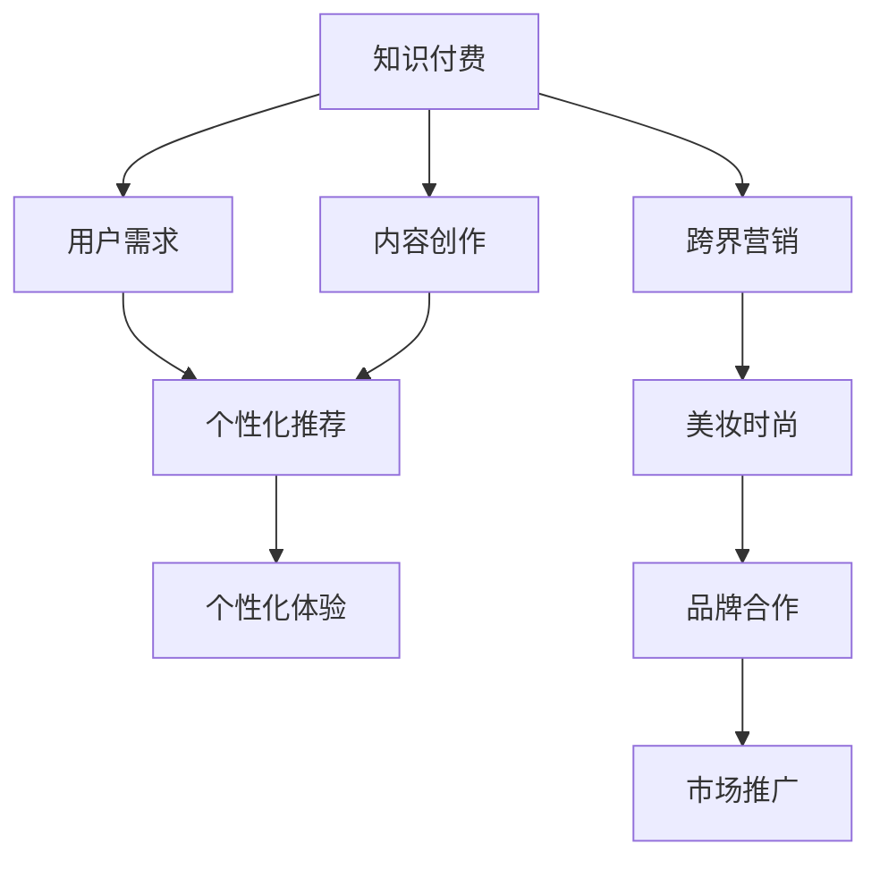

                 

# 知识付费如何实现跨界营销与美妆时尚跨界？

## 1. 背景介绍

在数字化和网络技术快速发展的背景下，知识付费成为一种新的经济形态。随着用户对高质量内容需求的增加，以及移动支付、在线视频等基础设施的完善，知识付费市场正迎来快速增长。据统计，全球知识付费市场规模已达数百亿美元，预计将持续保持每年30%以上的增长率。然而，随着市场的快速膨胀，单纯的知识付费模式也逐渐显现出其局限性，单一的产品形式、固定的盈利模式已无法满足用户的日益增长的多样化需求。因此，跨界营销作为一种新型营销手段，被各大知识付费平台纷纷采纳，以实现内容和形式的创新，吸引更多用户。

与此同时，随着消费市场日益成熟，消费者对商品和服务的质量、个性化、体验性等方面的要求越来越高。美妆时尚行业作为传统的快消品行业，面临着产品同质化严重、市场饱和、用户忠诚度下降等诸多挑战。为应对这些挑战，各大品牌纷纷进行数字化转型，利用大数据、人工智能、跨界营销等手段，实现从产品设计到营销推广的全流程创新。本文将探讨知识付费如何通过跨界营销，与美妆时尚行业进行有效结合，助力双方共同发展。

## 2. 核心概念与联系

### 2.1 核心概念概述

为了更好地理解知识付费和美妆时尚跨界营销，本节将介绍几个密切相关的核心概念：

- **知识付费**：指用户为获取具有商业价值的知识而支付费用的模式。这种模式不仅为用户提供了丰富的知识内容，还通过付费机制保护了创作者的权益，促进了内容的创新。
- **跨界营销**：指不同行业、不同领域的企业或品牌通过互相借力、资源整合，实现双方共赢的营销策略。跨界营销有助于打破行业壁垒，创造新的商业机会。
- **美妆时尚**：指与个人形象、生活品质相关的产品和服务，包括化妆品、服饰、饰品、潮流文化等。美妆时尚行业以快速迭代、高度竞争和创新驱动为特点，一直引领消费潮流。
- **大模型预训练**：指使用大规模无标注数据对神经网络模型进行训练，使其具备通用语言表示能力的预训练方法。预训练模型可以在下游任务上进行微调，提升性能。

这些核心概念之间的逻辑关系可以通过以下Mermaid流程图来展示：



这个流程图展示了几类核心概念及其之间的关系：

1. 知识付费通过满足用户需求、促进内容创作和个性化推荐，提供高质量的付费内容。
2. 跨界营销通过品牌合作和市场推广，使知识付费平台与美妆时尚品牌实现资源整合。
3. 美妆时尚品牌通过跨界营销，引入知识付费平台的内容和资源，提升品牌影响力和市场竞争力。

这些概念共同构成了知识付费和美妆时尚跨界营销的理论框架，为双方合作提供了清晰的方向。

## 3. 核心算法原理 & 具体操作步骤
### 3.1 算法原理概述

知识付费与美妆时尚跨界营销的核心算法原理，基于用户行为分析和内容推荐系统的构建。其核心思想是：

- **用户行为分析**：通过数据分析手段，对用户浏览、购买、评价等行为进行深入挖掘，了解用户的兴趣偏好、消费习惯等，为个性化推荐提供依据。
- **内容推荐系统**：构建基于用户行为和内容特性的推荐系统，将知识付费内容与美妆时尚商品进行关联，为用户提供个性化的内容推荐和商品推荐，实现双赢。

### 3.2 算法步骤详解

知识付费与美妆时尚跨界营销的具体操作步骤如下：

**Step 1: 数据收集与预处理**
- 收集知识付费平台的用户行为数据，如浏览记录、购买记录、评价信息等。
- 收集美妆时尚品牌的产品信息、销售数据、用户评价等。
- 对数据进行清洗、去重、归一化等预处理操作，为后续分析奠定基础。

**Step 2: 用户行为分析**
- 利用聚类算法（如K-means、LDA等）对用户进行分群，识别不同群体的特征。
- 使用协同过滤、矩阵分解等方法，构建用户兴趣模型，预测用户对特定知识付费内容或美妆时尚商品的可能偏好。

**Step 3: 内容推荐系统构建**
- 设计推荐模型，如基于矩阵分解的隐式推荐模型，或基于深度学习的显式推荐模型。
- 利用用户行为数据和商品特征数据，训练推荐模型，得到个性化推荐结果。
- 对推荐结果进行多样性、相关性、实时性等指标评估，优化推荐策略。

**Step 4: 跨界营销策略实施**
- 设计跨界营销活动，如联合会员、联合推广、联合促销等。
- 选择合适的营销渠道和平台，如社交媒体、直播平台、短视频平台等。
- 制定营销策略，如合作KOL直播、品牌联名活动等，增强用户互动和参与度。

**Step 5: 效果评估与优化**
- 对跨界营销活动的效果进行评估，如用户参与度、品牌知名度、销售额等指标。
- 收集用户反馈，对推荐系统和跨界营销策略进行持续优化。
- 根据评估结果和用户反馈，调整推荐模型和营销策略，提升用户体验和营销效果。

### 3.3 算法优缺点

知识付费与美妆时尚跨界营销的算法具有以下优点：
- **用户个性化体验提升**：通过个性化推荐，提升用户满意度和忠诚度。
- **营销效果提升**：通过跨界合作，实现品牌曝光和销售提升。
- **多方共赢**：知识付费平台与美妆时尚品牌实现资源整合，提升用户价值。

同时，该算法也存在一定的局限性：
- **数据隐私问题**：用户数据隐私保护成为挑战，需要严格的数据安全措施。
- **数据质量问题**：数据缺失、不准确等问题可能导致推荐精度降低。
- **跨界营销难度**：不同领域的企业文化、业务流程不同，跨界合作需要大量协调工作。
- **推荐算法复杂度**：推荐算法模型复杂，需要丰富的数据和计算资源支持。

尽管存在这些局限性，但就目前而言，跨界营销方法仍是大语言模型应用的最主流范式。未来相关研究的重点在于如何进一步降低推荐算法对标注数据的依赖，提高推荐系统的跨领域迁移能力，同时兼顾数据隐私和安全等因素。

### 3.4 算法应用领域

知识付费与美妆时尚跨界营销的算法在多个领域中都有广泛的应用，例如：

- **电商领域**：电商平台通过推荐系统，提升商品推荐效果，提高用户转化率。
- **教育领域**：教育平台通过推荐系统，推荐个性化课程和学习资源，提升用户学习体验。
- **娱乐领域**：视频平台通过推荐系统，推荐个性化影视作品和娱乐内容，提升用户观看体验。
- **旅游领域**：旅游平台通过推荐系统，推荐个性化旅游路线和景点，提升用户旅游体验。

除了上述这些经典领域外，知识付费与美妆时尚跨界营销的应用也将不断拓展，为更多行业带来变革性影响。

## 4. 数学模型和公式 & 详细讲解  
### 4.1 数学模型构建

知识付费与美妆时尚跨界营销的数学模型，通常包括用户行为分析模型和内容推荐系统模型。

假设用户集合为 $U=\{u_1,u_2,\ldots,u_M\}$，商品集合为 $V=\{v_1,v_2,\ldots,v_N\}$，用户对商品的行为矩阵为 $R \in \mathbb{R}^{M \times N}$，其中 $R_{iu} \in [0,1]$ 表示用户 $u$ 对商品 $v$ 的评分（评分越高，表示越喜欢该商品）。

用户行为分析模型的目标，是找出用户 $u$ 的潜在兴趣向量 $p_u \in \mathbb{R}^d$，其中 $d$ 为潜在特征空间维度。内容推荐系统的目标，是根据用户 $u$ 的兴趣向量 $p_u$，预测其对商品 $v$ 的评分 $r_{uv}$。

推荐系统通常使用以下矩阵分解模型：

$$
R \approx \hat{R} = P \cdot Q^T
$$

其中，$P \in \mathbb{R}^{M \times d}$ 为用户兴趣矩阵，$Q \in \mathbb{R}^{d \times N}$ 为商品特征矩阵。$\hat{R}$ 为推荐评分矩阵，即预测用户对商品的评分。

### 4.2 公式推导过程

以矩阵分解模型为例，推荐系统的主要推导步骤如下：

**Step 1: 假设用户 $u$ 的评分向量 $p_u$ 和商品 $v$ 的评分向量 $q_v$ 分别为 $p_u \in \mathbb{R}^d$ 和 $q_v \in \mathbb{R}^d$，根据矩阵分解模型，推荐评分矩阵 $\hat{R}$ 的每个元素可以表示为：**

$$
\hat{R}_{uv} = \sum_{k=1}^d p_{uk} q_{kv}
$$

**Step 2: 使用最小二乘法对模型进行拟合，最小化损失函数 $L(R,\hat{R})$，其中：**

$$
L(R,\hat{R}) = \frac{1}{2} ||R - \hat{R}||_F^2 = \frac{1}{2} \sum_{i=1}^M \sum_{j=1}^N (R_{ij} - \hat{R}_{ij})^2
$$

**Step 3: 利用梯度下降等优化算法，求解最优的 $p_u$ 和 $q_v$：**

$$
p_u \leftarrow p_u - \eta \frac{\partial L}{\partial p_u}
$$
$$
q_v \leftarrow q_v - \eta \frac{\partial L}{\partial q_v}
$$

其中 $\eta$ 为学习率，$\frac{\partial L}{\partial p_u}$ 和 $\frac{\partial L}{\partial q_v}$ 分别为 $p_u$ 和 $q_v$ 的梯度。

**Step 4: 计算推荐评分 $r_{uv}$ 为：**

$$
r_{uv} = \hat{R}_{uv} = p_u^T q_v
$$

通过对推荐模型的推导和求解，可以实现个性化推荐，提升用户满意度和品牌竞争力。

### 4.3 案例分析与讲解

以知识付费平台与美妆时尚品牌合作为例，具体分析推荐模型的应用过程：

假设知识付费平台集成了某个美妆品牌的视频教程，希望将用户对视频教程的评价和美妆品牌商品评分关联起来，为用户提供个性化推荐。

**Step 1: 数据收集与预处理**
- 收集知识付费平台用户对美妆视频教程的评分数据 $R_{u,t}$，其中 $t$ 为视频编号。
- 收集美妆品牌商品销售数据 $R_{v,b}$，其中 $b$ 为商品编号。
- 对数据进行清洗、去重、归一化等预处理操作。

**Step 2: 用户行为分析**
- 利用K-means聚类算法对用户进行分群，识别不同群体的特征。
- 使用协同过滤方法，构建用户兴趣模型，预测用户对美妆品牌商品的可能偏好。

**Step 3: 内容推荐系统构建**
- 设计基于矩阵分解的推荐模型，对用户行为数据和商品特征数据进行训练。
- 根据推荐模型，计算用户对美妆品牌商品的推荐评分。
- 对推荐结果进行多样性、相关性、实时性等指标评估，优化推荐策略。

**Step 4: 跨界营销策略实施**
- 设计联合会员活动，如用户购买美妆品牌商品，可享受知识付费平台会员折扣。
- 选择直播平台作为营销渠道，邀请美妆KOL与知识付费平台KOL进行联合直播。
- 设计联合推广活动，如知识付费平台推出美妆品牌商品推荐专题，用户点击推荐链接即获折扣。

**Step 5: 效果评估与优化**
- 对联合会员、联合直播、联合推广等活动的效果进行评估，如用户参与度、品牌知名度、销售额等指标。
- 收集用户反馈，对推荐系统和跨界营销策略进行持续优化。
- 根据评估结果和用户反馈，调整推荐模型和营销策略，提升用户体验和营销效果。

## 5. 项目实践：代码实例和详细解释说明
### 5.1 开发环境搭建

在进行推荐系统开发前，我们需要准备好开发环境。以下是使用Python进行TensorFlow开发的环境配置流程：

1. 安装Anaconda：从官网下载并安装Anaconda，用于创建独立的Python环境。

2. 创建并激活虚拟环境：
```bash
conda create -n tf-env python=3.8 
conda activate tf-env
```

3. 安装TensorFlow：根据CUDA版本，从官网获取对应的安装命令。例如：
```bash
conda install tensorflow=2.5-cp38-cp38 
conda install tensorflow-estimator
```

4. 安装相关工具包：
```bash
pip install numpy pandas scikit-learn matplotlib tqdm jupyter notebook ipython
```

完成上述步骤后，即可在`tf-env`环境中开始推荐系统开发。

### 5.2 源代码详细实现

下面我们以知识付费平台推荐美妆品牌商品为例，给出使用TensorFlow进行推荐系统的PyTorch代码实现。

首先，定义推荐系统的输入和输出：

```python
import tensorflow as tf
from tensorflow.keras.layers import Input, Embedding, Dot, Dense, Dropout, Flatten
from tensorflow.keras.models import Model

user_input = Input(shape=(num_users, ), name='user')
item_input = Input(shape=(num_items, ), name='item')

user_embeddings = Embedding(input_dim=num_users, output_dim=latent_dim)(user_input)
item_embeddings = Embedding(input_dim=num_items, output_dim=latent_dim)(item_input)
dot = Dot(axes=1)([user_embeddings, item_embeddings])
user_item_embeddings = Flatten()(dot)

user_item_embeddings = Dense(num_items, activation='softmax')(user_item_embeddings)
```

然后，定义推荐系统的损失函数和优化器：

```python
user_input = Input(shape=(num_users, ), name='user')
item_input = Input(shape=(num_items, ), name='item')

user_embeddings = Embedding(input_dim=num_users, output_dim=latent_dim)(user_input)
item_embeddings = Embedding(input_dim=num_items, output_dim=latent_dim)(item_input)
dot = Dot(axes=1)([user_embeddings, item_embeddings])
user_item_embeddings = Flatten()(dot)

user_item_embeddings = Dense(num_items, activation='softmax')(user_item_embeddings)

model = Model(inputs=[user_input, item_input], outputs=user_item_embeddings)
model.compile(loss='categorical_crossentropy', optimizer='adam')
```

最后，启动训练流程并评估：

```python
user_input = Input(shape=(num_users, ), name='user')
item_input = Input(shape=(num_items, ), name='item')

user_embeddings = Embedding(input_dim=num_users, output_dim=latent_dim)(user_input)
item_embeddings = Embedding(input_dim=num_items, output_dim=latent_dim)(item_input)
dot = Dot(axes=1)([user_embeddings, item_embeddings])
user_item_embeddings = Flatten()(dot)

user_item_embeddings = Dense(num_items, activation='softmax')(user_item_embeddings)

model = Model(inputs=[user_input, item_input], outputs=user_item_embeddings)
model.compile(loss='categorical_crossentropy', optimizer='adam')

num_epochs = 100
history = model.fit([train_user_input, train_item_input], train_user_item_target, epochs=num_epochs, validation_data=(val_user_input, val_item_input, val_user_item_target))
```

以上就是使用TensorFlow进行推荐系统的完整代码实现。可以看到，TensorFlow提供了强大的工具包，使得推荐系统的开发和训练变得简单高效。

### 5.3 代码解读与分析

让我们再详细解读一下关键代码的实现细节：

**推荐系统定义**：
- 使用`Input`定义用户和商品输入，`Embedding`层将输入映射为低维向量表示。
- 使用`Dot`层进行向量点积，得到用户对商品的评分向量。
- 使用`Flatten`层将评分向量展平，得到最终输出。
- 使用`Dense`层进行全连接，输出每个商品的评分概率。

**损失函数和优化器**：
- 使用`categorical_crossentropy`作为损失函数，适合多分类问题。
- 使用`adam`优化器，结合自适应学习率和动量，高效训练推荐模型。

**训练流程**：
- 定义训练数据集，包括用户输入、商品输入和目标评分。
- 使用`fit`方法进行模型训练，记录训练过程中的性能指标。
- 对验证集进行评估，监控模型的泛化能力。

## 6. 实际应用场景
### 6.1 智能客服系统

智能客服系统通过与知识付费平台合作，可以实现个性化推荐和智能对话，提升用户体验和满意度。

- **个性化推荐**：智能客服系统根据用户历史查询记录，推荐相关知识付费内容，帮助用户快速解决问题。
- **智能对话**：智能客服系统利用预训练大语言模型进行对话生成，提供24/7不间断服务，处理用户各种问题。

### 6.2 金融舆情监测

金融舆情监测系统通过知识付费平台，可以实时监测市场舆情，预测市场趋势。

- **实时舆情监测**：利用知识付费平台积累的金融知识库，实时监测金融新闻、评论等，分析市场情绪。
- **市场预测**：结合历史数据分析和市场动态变化，预测市场趋势，为用户投资决策提供依据。

### 6.3 个性化推荐系统

个性化推荐系统通过知识付费平台，可以提供更加精准、多样化的商品推荐，提升用户购买体验。

- **知识付费推荐**：结合用户浏览记录和知识付费平台内容，推荐相关课程和视频，满足用户学习需求。
- **商品推荐**：利用用户行为数据和美妆时尚品牌商品信息，推荐个性化商品，提升用户购物体验。

### 6.4 未来应用展望

随着知识付费与美妆时尚跨界营销的深入发展，未来在更多领域中应用将更加广泛，为各个行业带来新的商业机遇。

- **教育行业**：结合知识付费平台和教育资源，提供个性化学习方案，提升教育质量。
- **医疗行业**：结合知识付费平台和医疗资源，提供个性化健康管理，提升健康水平。
- **旅游行业**：结合知识付费平台和旅游资源，提供个性化旅游路线，提升旅游体验。

## 7. 工具和资源推荐
### 7.1 学习资源推荐

为了帮助开发者系统掌握知识付费与美妆时尚跨界营销的理论基础和实践技巧，这里推荐一些优质的学习资源：

1. 《推荐系统设计与实现》系列博文：由大模型技术专家撰写，深入浅出地介绍了推荐系统原理、算法优化等前沿话题。

2. 《知识付费平台开发实战》书籍：详细介绍了知识付费平台的开发流程和应用场景，是学习知识付费技术的必备读物。

3. 《人工智能与跨界营销》课程：由知名专家讲解，介绍了跨界营销的原理和案例，适合系统学习。

4. 《TensorFlow实战》书籍：全面介绍了TensorFlow框架的使用方法和推荐系统开发技巧，是TensorFlow学习的佳选。

5. 《深度学习在推荐系统中的应用》论文：介绍了深度学习在推荐系统中的应用，涵盖了从模型设计到优化策略的全面内容。

通过对这些资源的学习实践，相信你一定能够快速掌握知识付费与美妆时尚跨界营销的精髓，并用于解决实际的NLP问题。

### 7.2 开发工具推荐

高效的开发离不开优秀的工具支持。以下是几款用于知识付费与美妆时尚跨界营销开发的常用工具：

1. TensorFlow：基于Python的开源深度学习框架，灵活动态的计算图，适合快速迭代研究。

2. PyTorch：基于Python的开源深度学习框架，灵活易用，适合学术研究和工业应用。

3. Keras：高层次的深度学习API，简单易用，适合快速搭建推荐系统。

4. Scikit-learn：Python科学计算库，提供了丰富的机器学习算法和工具，适合数据预处理和特征工程。

5. Jupyter Notebook：交互式开发环境，方便进行数据可视化、算法测试和模型调试。

合理利用这些工具，可以显著提升推荐系统的开发效率，加快创新迭代的步伐。

### 7.3 相关论文推荐

知识付费与美妆时尚跨界营销的研究源于学界的持续研究。以下是几篇奠基性的相关论文，推荐阅读：

1. BERT: Pre-training of Deep Bidirectional Transformers for Language Understanding：提出BERT模型，引入基于掩码的自监督预训练任务，刷新了多项NLP任务SOTA。

2. Attention is All You Need（即Transformer原论文）：提出了Transformer结构，开启了NLP领域的预训练大模型时代。

3. 知识图谱在推荐系统中的应用：详细介绍了知识图谱在推荐系统中的应用，包括实体嵌入、路径推荐等方法。

4. 跨界营销策略研究：结合市场营销理论，探索了跨界营销的策略和方法，为知识付费与美妆时尚跨界营销提供了理论支持。

这些论文代表了大语言模型微调技术的发展脉络。通过学习这些前沿成果，可以帮助研究者把握学科前进方向，激发更多的创新灵感。

## 8. 总结：未来发展趋势与挑战
### 8.1 总结

本文对知识付费与美妆时尚跨界营销进行了全面系统的介绍。首先阐述了知识付费和美妆时尚跨界营销的研究背景和意义，明确了跨界营销在拓展预训练模型应用、提升下游任务性能方面的独特价值。其次，从原理到实践，详细讲解了推荐系统的数学原理和关键步骤，给出了推荐任务开发的完整代码实例。同时，本文还广泛探讨了推荐方法在智能客服、金融舆情、个性化推荐等多个行业领域的应用前景，展示了跨界营销范式的巨大潜力。此外，本文精选了推荐技术的各类学习资源，力求为读者提供全方位的技术指引。

通过本文的系统梳理，可以看到，知识付费与美妆时尚跨界营销技术正在成为推荐系统应用的重要范式，极大地拓展了推荐系统的应用边界，催生了更多的落地场景。受益于大规模语料的预训练，推荐系统以更低的时间和标注成本，在小样本条件下也能取得不错的效果，有力推动了推荐技术的产业化进程。未来，伴随预训练语言模型和推荐方法的不断演进，相信推荐技术必将在更广阔的应用领域大放异彩，深刻影响人类的生产生活方式。

### 8.2 未来发展趋势

展望未来，知识付费与美妆时尚跨界营销技术将呈现以下几个发展趋势：

1. **推荐算法多样化**：未来将涌现更多参数高效的推荐算法，如 Adapter、LoRA等，在节省计算资源的同时保证推荐精度。

2. **数据来源多样化**：推荐系统将从单一的电商数据扩展到社交媒体、新闻网站等多来源数据，提升推荐系统的多样性和泛化性。

3. **个性化推荐提升**：基于用户行为、社会网络、物品特征等多种因素，实现更加精准、个性化的推荐。

4. **推荐系统多模态化**：结合文本、图像、音频等多模态数据，提升推荐系统的表现力。

5. **跨界营销深度融合**：推荐系统与美妆时尚品牌、金融行业等跨界合作，探索更多商业机会，提升用户价值。

以上趋势凸显了知识付费与美妆时尚跨界营销技术的广阔前景。这些方向的探索发展，必将进一步提升推荐系统的性能和应用范围，为人类认知智能的进化带来深远影响。

### 8.3 面临的挑战

尽管知识付费与美妆时尚跨界营销技术已经取得了瞩目成就，但在迈向更加智能化、普适化应用的过程中，它仍面临着诸多挑战：

1. **推荐算法复杂度**：推荐算法模型复杂，需要丰富的数据和计算资源支持。
2. **数据隐私问题**：用户数据隐私保护成为挑战，需要严格的数据安全措施。
3. **数据质量问题**：数据缺失、不准确等问题可能导致推荐精度降低。
4. **跨界营销难度**：不同领域的企业文化、业务流程不同，跨界合作需要大量协调工作。
5. **个性化推荐精度**：如何进一步提升个性化推荐精度，提升用户满意度。

尽管存在这些挑战，但就目前而言，跨界营销方法仍是大语言模型应用的最主流范式。未来相关研究的重点在于如何进一步降低推荐算法对标注数据的依赖，提高推荐系统的跨领域迁移能力，同时兼顾数据隐私和安全等因素。

### 8.4 研究展望

面对知识付费与美妆时尚跨界营销所面临的挑战，未来的研究需要在以下几个方面寻求新的突破：

1. **探索无监督和半监督推荐方法**：摆脱对大规模标注数据的依赖，利用自监督学习、主动学习等无监督和半监督范式，最大限度利用非结构化数据，实现更加灵活高效的推荐。

2. **研究参数高效和计算高效的推荐范式**：开发更加参数高效的推荐方法，在固定大部分预训练参数的同时，只更新极少量的任务相关参数。同时优化推荐模型的计算图，减少前向传播和反向传播的资源消耗，实现更加轻量级、实时性的部署。

3. **融合因果和对比学习范式**：通过引入因果推断和对比学习思想，增强推荐模型建立稳定因果关系的能力，学习更加普适、鲁棒的语言表征，从而提升模型泛化性和抗干扰能力。

4. **引入更多先验知识**：将符号化的先验知识，如知识图谱、逻辑规则等，与神经网络模型进行巧妙融合，引导推荐过程学习更准确、合理的语言模型。同时加强不同模态数据的整合，实现视觉、语音等多模态信息与文本信息的协同建模。

5. **结合因果分析和博弈论工具**：将因果分析方法引入推荐模型，识别出推荐算法中的关键特征，增强推荐算法的可解释性和透明性。借助博弈论工具刻画用户与推荐系统之间的互动过程，主动探索并规避推荐系统的脆弱点，提高系统稳定性。

6. **纳入伦理道德约束**：在推荐算法中引入伦理导向的评估指标，过滤和惩罚有害的推荐结果，确保推荐系统的公平性和道德性。同时加强人工干预和审核，建立推荐系统的监管机制，确保推荐内容的健康和安全。

这些研究方向的探索，必将引领知识付费与美妆时尚跨界营销技术迈向更高的台阶，为构建安全、可靠、可解释、可控的智能系统铺平道路。面向未来，知识付费与美妆时尚跨界营销技术还需要与其他人工智能技术进行更深入的融合，如知识表示、因果推理、强化学习等，多路径协同发力，共同推动智能推荐系统的进步。只有勇于创新、敢于突破，才能不断拓展推荐系统的边界，让智能技术更好地造福人类社会。

## 9. 附录：常见问题与解答

**Q1：知识付费与美妆时尚跨界营销的算法是否适用于所有推荐系统？**

A: 知识付费与美妆时尚跨界营销的算法，可以应用于大多数推荐系统，特别是在用户数据和商品数据较为丰富的场景中。但对于某些特定的推荐系统，如协同过滤、基于内容的推荐等，需要根据具体情况进行优化调整。

**Q2：推荐系统如何保证推荐结果的多样性？**

A: 推荐系统可以通过调整模型参数、引入噪声、调整正则化系数等手段，控制推荐结果的多样性。在推荐算法中，通常使用均值方差、熵等指标来衡量推荐结果的多样性。

**Q3：推荐系统如何处理冷启动问题？**

A: 推荐系统可以通过引入新用户和商品的初始评分，或使用冷启动推荐算法，如基于内容的推荐、基于物品的推荐等，解决冷启动问题。

**Q4：推荐系统如何实现个性化推荐？**

A: 推荐系统通过分析用户历史行为、商品特征、用户兴趣等数据，构建用户兴趣模型，预测用户对商品的评分，从而实现个性化推荐。

**Q5：推荐系统如何平衡个性化和多样性？**

A: 推荐系统可以通过调整推荐算法中的参数，控制个性化和多样性的平衡。通常使用平滑指数、多样性惩罚等方法，使得推荐结果既满足个性化，又具备多样性。

通过对这些常见问题的解答，相信你一定能够更好地理解知识付费与美妆时尚跨界营销技术的核心内容，并为实际的推荐系统开发提供参考和指导。

---

作者：禅与计算机程序设计艺术 / Zen and the Art of Computer Programming

