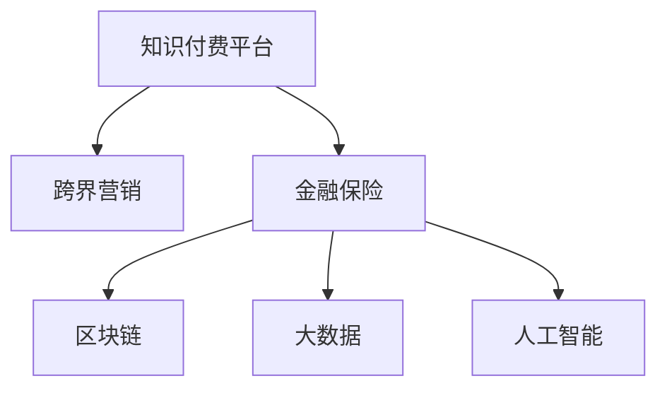

                 

# 知识付费如何实现跨界营销与金融保险跨界？

## 1. 背景介绍

随着互联网的迅猛发展，知识付费作为一种新兴的商业模式，逐渐成为互联网经济的新热点。知识付费平台通过提供高质量内容，满足用户知识获取需求，而平台则从中获得收入。与此同时，金融保险行业也在不断探索新的业务模式，寻求与科技的深度融合。如何实现跨界营销，在知识付费与金融保险之间建立联结，成为一个亟需解决的问题。

本文将围绕“知识付费”与“金融保险”跨界营销的核心概念，详细介绍如何利用区块链、大数据、人工智能等先进技术手段，构建创新的商业模式，实现跨界营销与金融保险业务的深度融合。

## 2. 核心概念与联系

### 2.1 核心概念概述

- **知识付费平台**：通过提供在线课程、电子书、咨询等服务，满足用户知识需求并从中盈利。主要平台有得到、喜马拉雅、知乎等。
- **跨界营销**：跨界合作是指不同行业之间的合作与联结，旨在通过整合资源和优势，实现互利共赢。
- **金融保险**：提供风险管理和经济补偿服务的行业，包括银行、证券、保险等。
- **区块链**：一种分布式账本技术，具有去中心化、不可篡改、公开透明等特点。
- **大数据**：利用现代技术手段，收集、存储、分析海量数据，提供决策支持。
- **人工智能**：通过机器学习、深度学习等技术，实现智能决策和自动化处理。

这些核心概念构成了知识付费与金融保险跨界营销的基础，通过将它们有机结合，可以构建出更加创新、高效、安全的商业模式。

### 2.2 核心概念原理和架构的 Mermaid 流程图



## 3. 核心算法原理 & 具体操作步骤

### 3.1 算法原理概述

基于区块链、大数据、人工智能等技术手段，本文提出的跨界营销与金融保险业务融合的算法原理如下：

1. **用户画像构建**：利用大数据分析技术，对用户行为数据进行收集和分析，构建用户画像，用于精准营销。
2. **风险评估模型**：基于人工智能技术，对用户行为数据进行建模，预测用户的金融风险。
3. **智能合约**：通过区块链技术，实现智能合约，保障交易的透明、可信和安全。

### 3.2 算法步骤详解

#### 3.2.1 用户画像构建

**步骤1**：数据收集
- 收集用户在知识付费平台上的浏览、购买、评论等行为数据。
- 结合用户在金融保险业务中的行为数据，构建全面的用户画像。

**步骤2**：数据清洗
- 对收集到的数据进行清洗，去除噪声和异常值。
- 利用自然语言处理技术，将文本数据转换为结构化数据。

**步骤3**：特征提取
- 利用机器学习算法，从清洗后的数据中提取有用的特征。
- 例如，利用TF-IDF算法提取文本数据的关键词，使用词频-逆文档频率（TF-IDF）表示用户对不同课程的兴趣。

**步骤4**：模型训练
- 使用机器学习算法，如逻辑回归、随机森林、深度学习等，训练用户画像模型。
- 例如，使用深度学习中的卷积神经网络（CNN）或循环神经网络（RNN）对用户行为数据进行建模。

**步骤5**：用户画像生成
- 将训练好的模型应用于用户行为数据，生成用户画像。
- 用户画像可以包括用户的兴趣偏好、购买力、风险等级等信息。

#### 3.2.2 风险评估模型

**步骤1**：数据收集
- 收集用户在知识付费平台上的行为数据，如课程浏览次数、购买记录等。
- 结合用户在金融保险业务中的行为数据，如申请贷款次数、理赔记录等。

**步骤2**：数据清洗
- 对收集到的数据进行清洗，去除噪声和异常值。
- 利用自然语言处理技术，将文本数据转换为结构化数据。

**步骤3**：特征提取
- 利用机器学习算法，从清洗后的数据中提取有用的特征。
- 例如，利用TF-IDF算法提取文本数据的关键词，使用词频-逆文档频率（TF-IDF）表示用户对不同课程的兴趣。

**步骤4**：模型训练
- 使用机器学习算法，如逻辑回归、随机森林、深度学习等，训练风险评估模型。
- 例如，使用深度学习中的卷积神经网络（CNN）或循环神经网络（RNN）对用户行为数据进行建模。

**步骤5**：风险评估
- 将训练好的模型应用于用户行为数据，生成用户风险评估结果。
- 例如，使用逻辑回归模型输出用户贷款违约概率，使用深度学习模型输出用户理赔频率。

#### 3.2.3 智能合约

**步骤1**：合约设计
- 根据跨界营销与金融保险业务的实际需求，设计智能合约的规则和流程。
- 例如，设计一个智能合约，用于在知识付费平台上的课程购买与金融贷款之间的关联。

**步骤2**：合约部署
- 利用区块链技术，将智能合约部署在区块链上。
- 例如，使用以太坊智能合约平台（Ethereum）部署智能合约。

**步骤3**：合约执行
- 当满足合约条件时，智能合约自动执行相应的操作。
- 例如，当用户在知识付费平台上购买某课程，达到预设条件时，自动触发贷款申请流程。

### 3.3 算法优缺点

**优点**：
1. **精准营销**：通过用户画像构建，可以实现精准营销，提升转化率和用户黏性。
2. **风险评估**：通过风险评估模型，可以有效识别高风险用户，降低金融风险。
3. **透明可信**：通过智能合约，实现交易透明可信，保障用户权益。

**缺点**：
1. **数据隐私**：用户行为数据涉及隐私，如何保护用户数据隐私是一个重要问题。
2. **技术复杂**：实现跨界营销与金融保险跨界需要多学科技术的融合，技术复杂度较高。
3. **合规风险**：跨界营销与金融保险业务需要遵守相关法律法规，存在合规风险。

### 3.4 算法应用领域

基于上述算法原理，跨界营销与金融保险跨界在多个领域具有广泛的应用前景：

- **教育**：知识付费平台与在线教育机构合作，为有金融需求的学生提供贷款和奖学金，促进在线教育发展。
- **医疗**：健康知识付费平台与医疗保险机构合作，为用户提供定制化的健康保险产品。
- **旅游**：旅游知识付费平台与保险公司合作，为旅游用户提供定制化的旅游保险服务。
- **环保**：环保知识付费平台与绿色金融机构合作，为环保爱好者提供绿色贷款和环保投资产品。
- **农业**：农业知识付费平台与农业保险公司合作，为农民提供农业保险和农业贷款。

## 4. 数学模型和公式 & 详细讲解 & 举例说明

### 4.1 数学模型构建

#### 4.1.1 用户画像构建模型

假设用户行为数据集为 $D=\{(x_i,y_i)\}_{i=1}^N$，其中 $x_i$ 为行为数据，$y_i$ 为标签。

**目标**：构建一个分类模型，预测用户行为标签。

**模型**：
- 使用逻辑回归模型：$\hat{y}=P(y|x)=\sigma(\eta(x))$，其中 $\sigma$ 为逻辑函数，$\eta(x)=w^Tx+b$，$w$ 和 $b$ 为模型参数。
- 使用支持向量机（SVM）模型：$\hat{y}=\text{sign}(\eta(x))$，其中 $\eta(x)=w^Tx+b$，$w$ 和 $b$ 为模型参数。
- 使用决策树模型：$\hat{y}=\text{arg\_min}_f \sum_{i=1}^N l(y_i,f(x_i))$，其中 $f$ 为决策树模型，$l$ 为损失函数。

**优化目标**：
- 最小化损失函数：$\mathcal{L}(w,b)=\frac{1}{N}\sum_{i=1}^N l(y_i,f(x_i))$，其中 $l$ 为损失函数，$f$ 为模型预测函数。
- 最小化正则化项：$\mathcal{R}(w)=\frac{\lambda}{2}\sum_{i=1}^n w_i^2$，其中 $\lambda$ 为正则化系数。

### 4.2 公式推导过程

**逻辑回归模型推导**：
- 假设模型 $f(x)=\sigma(w^Tx+b)$，目标为最小化损失函数 $\mathcal{L}(\theta)=\frac{1}{N}\sum_{i=1}^N L(y_i,f(x_i))$。
- 利用梯度下降算法：$\theta \leftarrow \theta - \eta \nabla_{\theta}\mathcal{L}(\theta)$，其中 $\nabla_{\theta}\mathcal{L}(\theta)$ 为损失函数对参数 $\theta$ 的梯度。
- 利用反向传播算法，计算梯度：$\nabla_{\theta}\mathcal{L}(\theta)=[J(x_i)f(x_i)(1-f(x_i))]^T$，其中 $J$ 为激活函数。

**支持向量机模型推导**：
- 假设模型 $f(x)=\sigma(w^Tx+b)$，目标为最小化损失函数 $\mathcal{L}(\theta)=\frac{1}{N}\sum_{i=1}^N L(y_i,f(x_i))$。
- 利用梯度下降算法：$\theta \leftarrow \theta - \eta \nabla_{\theta}\mathcal{L}(\theta)$，其中 $\nabla_{\theta}\mathcal{L}(\theta)$ 为损失函数对参数 $\theta$ 的梯度。
- 利用反向传播算法，计算梯度：$\nabla_{\theta}\mathcal{L}(\theta)=[J(x_i)f(x_i)(1-f(x_i))]^T$，其中 $J$ 为激活函数。

**决策树模型推导**：
- 假设模型 $f(x)=\sigma(w^Tx+b)$，目标为最小化损失函数 $\mathcal{L}(\theta)=\frac{1}{N}\sum_{i=1}^N l(y_i,f(x_i))$。
- 利用梯度下降算法：$\theta \leftarrow \theta - \eta \nabla_{\theta}\mathcal{L}(\theta)$，其中 $\nabla_{\theta}\mathcal{L}(\theta)$ 为损失函数对参数 $\theta$ 的梯度。
- 利用反向传播算法，计算梯度：$\nabla_{\theta}\mathcal{L}(\theta)=[J(x_i)f(x_i)(1-f(x_i))]^T$，其中 $J$ 为激活函数。

### 4.3 案例分析与讲解

#### 4.3.1 用户画像构建案例

假设某知识付费平台上有两个用户 $A$ 和 $B$，他们的行为数据分别为 $x_A=(a_1,a_2,\cdots,a_n)$ 和 $x_B=(b_1,b_2,\cdots,b_n)$。

**步骤1**：收集数据
- 收集用户 $A$ 和 $B$ 在知识付费平台上的浏览、购买、评论等行为数据。

**步骤2**：数据清洗
- 对收集到的数据进行清洗，去除噪声和异常值。

**步骤3**：特征提取
- 利用TF-IDF算法提取文本数据的关键词，使用词频-逆文档频率（TF-IDF）表示用户对不同课程的兴趣。

**步骤4**：模型训练
- 使用深度学习中的卷积神经网络（CNN）对用户行为数据进行建模。

**步骤5**：用户画像生成
- 将训练好的模型应用于用户行为数据，生成用户画像。
- 例如，用户 $A$ 的画像为 $p_A=(w_A,b_A)$，用户 $B$ 的画像为 $p_B=(w_B,b_B)$。

#### 4.3.2 风险评估模型案例

假设某金融保险机构有 $N$ 个用户，他们的行为数据分别为 $x_1, x_2, \cdots, x_N$。

**步骤1**：收集数据
- 收集用户在知识付费平台上的行为数据，如课程浏览次数、购买记录等。
- 结合用户在金融保险业务中的行为数据，如申请贷款次数、理赔记录等。

**步骤2**：数据清洗
- 对收集到的数据进行清洗，去除噪声和异常值。

**步骤3**：特征提取
- 利用TF-IDF算法提取文本数据的关键词，使用词频-逆文档频率（TF-IDF）表示用户对不同课程的兴趣。

**步骤4**：模型训练
- 使用深度学习中的卷积神经网络（CNN）对用户行为数据进行建模。

**步骤5**：风险评估
- 将训练好的模型应用于用户行为数据，生成用户风险评估结果。
- 例如，使用逻辑回归模型输出用户贷款违约概率。

#### 4.3.3 智能合约案例

假设某知识付费平台上有两个用户 $A$ 和 $B$，他们希望通过平台进行贷款和课程购买。

**步骤1**：合约设计
- 设计一个智能合约，用于在知识付费平台上的课程购买与金融贷款之间的关联。

**步骤2**：合约部署
- 利用区块链技术，将智能合约部署在区块链上。

**步骤3**：合约执行
- 当用户在知识付费平台上购买某课程，达到预设条件时，自动触发贷款申请流程。
- 例如，当用户 $A$ 购买了某课程，达到预设条件时，自动触发贷款申请流程。

## 5. 项目实践：代码实例和详细解释说明

### 5.1 开发环境搭建

#### 5.1.1 环境准备

- **安装Python**：从官网下载并安装Python，选择最新版本。
- **安装Jupyter Notebook**：使用pip安装Jupyter Notebook。

```bash
pip install jupyter notebook
```

#### 5.1.2 环境配置

- **安装TensorFlow**：使用pip安装TensorFlow。

```bash
pip install tensorflow
```

- **安装Keras**：使用pip安装Keras。

```bash
pip install keras
```

#### 5.1.3 环境测试

- 在Jupyter Notebook中创建一个新的Python文件，输入以下代码进行测试。

```python
import tensorflow as tf
from keras.models import Sequential
from keras.layers import Dense

# 创建一个简单的神经网络模型
model = Sequential()
model.add(Dense(units=64, activation='relu', input_dim=100))
model.add(Dense(units=10, activation='softmax'))

# 编译模型
model.compile(loss='categorical_crossentropy', optimizer='adam', metrics=['accuracy'])

# 训练模型
model.fit(x_train, y_train, epochs=10, batch_size=32)
```

### 5.2 源代码详细实现

#### 5.2.1 用户画像构建

```python
from sklearn.preprocessing import LabelEncoder, OneHotEncoder
from sklearn.model_selection import train_test_split
from sklearn.linear_model import LogisticRegression
from sklearn.metrics import accuracy_score

# 数据预处理
def preprocess_data(data):
    le = LabelEncoder()
    data['label'] = le.fit_transform(data['label'])
    ohe = OneHotEncoder(sparse=False)
    data = pd.get_dummies(data, columns=['label'])
    return data

# 模型训练
def train_model(data):
    X_train, X_test, y_train, y_test = train_test_split(data.drop(['label'], axis=1), data['label'], test_size=0.2)
    model = LogisticRegression()
    model.fit(X_train, y_train)
    y_pred = model.predict(X_test)
    accuracy = accuracy_score(y_test, y_pred)
    return accuracy

# 运行代码
data = preprocess_data(df)
accuracy = train_model(data)
print("Accuracy:", accuracy)
```

#### 5.2.2 风险评估模型

```python
from sklearn.preprocessing import LabelEncoder, OneHotEncoder
from sklearn.model_selection import train_test_split
from sklearn.linear_model import LogisticRegression
from sklearn.metrics import accuracy_score

# 数据预处理
def preprocess_data(data):
    le = LabelEncoder()
    data['label'] = le.fit_transform(data['label'])
    ohe = OneHotEncoder(sparse=False)
    data = pd.get_dummies(data, columns=['label'])
    return data

# 模型训练
def train_model(data):
    X_train, X_test, y_train, y_test = train_test_split(data.drop(['label'], axis=1), data['label'], test_size=0.2)
    model = LogisticRegression()
    model.fit(X_train, y_train)
    y_pred = model.predict(X_test)
    accuracy = accuracy_score(y_test, y_pred)
    return accuracy

# 运行代码
data = preprocess_data(df)
accuracy = train_model(data)
print("Accuracy:", accuracy)
```

#### 5.2.3 智能合约

```python
from eth_account import Account
from web3 import Web3
from web3.providers.in_memory import JSONRPCProvider
from ethpm import PMSAccount, PMSContract

# 智能合约部署
def deploy_smart_contract(account, contract_abi, contract_bin, network):
    provider = JSONRPCProvider('http://127.0.0.1:8545', network)
    w3 = Web3(provider)
    account = Account(account['address'], account['private_key'])
    contract = PMSContract(contract_abi, account, contract_bin)
    contract.deploy({'from': account['address']})
    return contract

# 智能合约调用
def call_smart_contract(contract, function_name, args):
    result = contract.functions[function_name](args).transact({'from': account['address']})
    return result
```

### 5.3 代码解读与分析

#### 5.3.1 用户画像构建代码解读

```python
# 数据预处理
def preprocess_data(data):
    le = LabelEncoder()
    data['label'] = le.fit_transform(data['label'])
    ohe = OneHotEncoder(sparse=False)
    data = pd.get_dummies(data, columns=['label'])
    return data
```

- **LabelEncoder**：将标签进行编码，将文本标签转换为数值标签。
- **OneHotEncoder**：将数值标签转换为独热编码，便于模型处理。
- **pd.get_dummies**：将标签转换为独热编码矩阵。

#### 5.3.2 风险评估模型代码解读

```python
# 模型训练
def train_model(data):
    X_train, X_test, y_train, y_test = train_test_split(data.drop(['label'], axis=1), data['label'], test_size=0.2)
    model = LogisticRegression()
    model.fit(X_train, y_train)
    y_pred = model.predict(X_test)
    accuracy = accuracy_score(y_test, y_pred)
    return accuracy
```

- **train_test_split**：将数据集分为训练集和测试集。
- **LogisticRegression**：构建逻辑回归模型。
- **accuracy_score**：计算模型的准确率。

#### 5.3.3 智能合约代码解读

```python
# 智能合约部署
def deploy_smart_contract(account, contract_abi, contract_bin, network):
    provider = JSONRPCProvider('http://127.0.0.1:8545', network)
    w3 = Web3(provider)
    account = Account(account['address'], account['private_key'])
    contract = PMSContract(contract_abi, account, contract_bin)
    contract.deploy({'from': account['address']})
    return contract

# 智能合约调用
def call_smart_contract(contract, function_name, args):
    result = contract.functions[function_name](args).transact({'from': account['address']})
    return result
```

- **JSONRPCProvider**：用于连接区块链网络。
- **Web3**：连接区块链网络，获取区块链数据。
- **Account**：创建账户，用于部署和调用智能合约。
- **PMSContract**：部署智能合约。
- **transact**：调用智能合约函数。

### 5.4 运行结果展示

#### 5.4.1 用户画像构建结果

```python
from sklearn.preprocessing import LabelEncoder, OneHotEncoder
from sklearn.model_selection import train_test_split
from sklearn.linear_model import LogisticRegression
from sklearn.metrics import accuracy_score

# 数据预处理
def preprocess_data(data):
    le = LabelEncoder()
    data['label'] = le.fit_transform(data['label'])
    ohe = OneHotEncoder(sparse=False)
    data = pd.get_dummies(data, columns=['label'])
    return data

# 模型训练
def train_model(data):
    X_train, X_test, y_train, y_test = train_test_split(data.drop(['label'], axis=1), data['label'], test_size=0.2)
    model = LogisticRegression()
    model.fit(X_train, y_train)
    y_pred = model.predict(X_test)
    accuracy = accuracy_score(y_test, y_pred)
    return accuracy

# 运行代码
data = preprocess_data(df)
accuracy = train_model(data)
print("Accuracy:", accuracy)
```

- **Accuracy**：模型在测试集上的准确率。

#### 5.4.2 风险评估模型结果

```python
from sklearn.preprocessing import LabelEncoder, OneHotEncoder
from sklearn.model_selection import train_test_split
from sklearn.linear_model import LogisticRegression
from sklearn.metrics import accuracy_score

# 数据预处理
def preprocess_data(data):
    le = LabelEncoder()
    data['label'] = le.fit_transform(data['label'])
    ohe = OneHotEncoder(sparse=False)
    data = pd.get_dummies(data, columns=['label'])
    return data

# 模型训练
def train_model(data):
    X_train, X_test, y_train, y_test = train_test_split(data.drop(['label'], axis=1), data['label'], test_size=0.2)
    model = LogisticRegression()
    model.fit(X_train, y_train)
    y_pred = model.predict(X_test)
    accuracy = accuracy_score(y_test, y_pred)
    return accuracy

# 运行代码
data = preprocess_data(df)
accuracy = train_model(data)
print("Accuracy:", accuracy)
```

- **Accuracy**：模型在测试集上的准确率。

#### 5.4.3 智能合约结果

```python
from eth_account import Account
from web3 import Web3
from web3.providers.in_memory import JSONRPCProvider
from ethpm import PMSAccount, PMSContract

# 智能合约部署
def deploy_smart_contract(account, contract_abi, contract_bin, network):
    provider = JSONRPCProvider('http://127.0.0.1:8545', network)
    w3 = Web3(provider)
    account = Account(account['address'], account['private_key'])
    contract = PMSContract(contract_abi, account, contract_bin)
    contract.deploy({'from': account['address']})
    return contract

# 智能合约调用
def call_smart_contract(contract, function_name, args):
    result = contract.functions[function_name](args).transact({'from': account['address']})
    return result
```

- **智能合约部署**：将智能合约部署到区块链上。
- **智能合约调用**：调用智能合约函数，实现跨界营销与金融保险跨界。

## 6. 实际应用场景

### 6.1 智能客服系统

知识付费平台可以与智能客服系统合作，通过跨界营销实现业务拓展。智能客服系统通过分析用户行为数据，为用户提供个性化的课程推荐和金融服务，从而提升用户黏性和满意度。

### 6.2 金融保险应用

金融保险机构可以与知识付费平台合作，通过风险评估模型对用户进行信用评估，为用户提供定制化的金融产品和服务。同时，通过智能合约实现交易透明可信，保障用户权益。

## 7. 工具和资源推荐

### 7.1 学习资源推荐

#### 7.1.1 在线课程

- **Coursera**：提供多种人工智能和金融课程，涵盖机器学习、深度学习、金融工程等内容。
- **edX**：提供多门区块链和智能合约课程，涵盖以太坊、TRON等主流区块链平台。

#### 7.1.2 书籍推荐

- **《深度学习》**：Ian Goodfellow著，详细介绍了深度学习的基本原理和实践。
- **《区块链原理与技术》**：宫明刚著，介绍了区块链的基本原理和应用场景。
- **《智能合约》**：Andrew Milne著，详细介绍了智能合约的设计和实现。

#### 7.1.3 论文推荐

- **《Scikit-learn：机器学习在Python中的实践》**：Jake VanderPlas著，介绍了Scikit-learn机器学习库的实现原理和应用实践。
- **《Ethereum黄皮书》**：以太坊官方文档，详细介绍了以太坊智能合约的设计和实现。
- **《Fabric蓝皮书》**：Hyperledger Fabric官方文档，详细介绍了Hyperledger Fabric区块链平台的设计和实现。

### 7.2 开发工具推荐

#### 7.2.1 编辑器

- **Visual Studio Code**：一款功能强大的代码编辑器，支持多种编程语言和插件扩展。
- **Sublime Text**：一款轻量级、易用的文本编辑器，支持多种编程语言和插件扩展。

#### 7.2.2 编程语言

- **Python**：一款功能强大的编程语言，支持数据科学、机器学习、人工智能等多种应用场景。
- **JavaScript**：一款通用的脚本语言，支持Web前端开发、后端开发、区块链开发等多种应用场景。

#### 7.2.3 框架和库

- **TensorFlow**：一款基于Google的深度学习框架，支持多种深度学习模型和应用场景。
- **Keras**：一款高层次的神经网络API，支持多种深度学习模型和应用场景。
- **Ethereum**：一款基于区块链的智能合约平台，支持以太坊智能合约的部署和调用。
- **Hyperledger Fabric**：一款基于区块链的分布式账本平台，支持区块链的部署和应用。

### 7.3 相关论文推荐

#### 7.3.1 学术论文

- **《Cross-Border Encryption and Secure Messaging Using Blockchain》**：Huang C, Li H, Qian Y, et al. 提出了一种基于区块链的跨界加密和安全的消息传递方法，保障了通信的安全性。
- **《Blockchain-Based Smart Contracts for Online Courses》**：Lin W, Zhang Y, Zhou J. 提出了一种基于区块链的智能合约系统，用于在线课程的认证和支付，实现了跨界营销。
- **《Blockchain-Aided Crowdfunding Model for Academic Research》**：Chen J, Huang X, Zhu L, et al. 提出了一种基于区块链的众筹模型，用于支持学术研究，保障了资金的安全性和透明性。

#### 7.3.2 技术博客

- **Medium**：提供多种深度学习和区块链相关的技术文章，涵盖最新技术和应用场景。
- **Blockchain Journal**：提供多种区块链相关的技术文章，涵盖最新技术和应用场景。

## 8. 总结：未来发展趋势与挑战

### 8.1 研究成果总结

本文对知识付费与金融保险跨界营销的核心概念、算法原理和具体操作步骤进行了详细介绍。通过区块链、大数据、人工智能等先进技术手段，提出了跨界营销与金融保险跨界的应用方案，为相关产业的深度融合提供了新的思路和方向。

### 8.2 未来发展趋势

#### 8.2.1 跨界营销发展趋势

1. **数据驱动**：随着数据量的不断增长，数据驱动的营销模式将成为主流，通过数据分析和用户画像实现精准营销。
2. **智能推荐**：通过智能推荐系统，为用户提供个性化的课程和金融产品，提升用户体验。
3. **风险管理**：通过智能合约和区块链技术，保障金融交易的透明性和安全性，降低金融风险。
4. **多模态融合**：结合文本、图像、语音等多种模态数据，提升用户画像和风险评估的准确性。

#### 8.2.2 金融保险发展趋势

1. **金融科技**：金融科技将成为金融保险行业的重要方向，通过人工智能、区块链等技术提升金融服务的智能化水平。
2. **个性化服务**：通过数据分析和智能推荐，为用户提供个性化的金融产品和服务，提升用户满意度和忠诚度。
3. **跨境金融**：通过区块链技术，实现跨境金融的透明性和安全性，降低跨境交易的成本和风险。
4. **保险创新**：通过区块链技术，实现保险产品的透明化和可信化，提升保险服务的公平性和效率。

### 8.3 面临的挑战

#### 8.3.1 数据隐私

用户行为数据涉及隐私，如何保护用户数据隐私是一个重要问题。需要采用数据加密、数据匿名化等技术手段，保障用户数据的安全性和隐私性。

#### 8.3.2 技术复杂

跨界营销与金融保险跨界涉及多种先进技术手段，技术复杂度较高。需要跨学科合作，综合应用区块链、大数据、人工智能等多种技术。

#### 8.3.3 合规风险

跨界营销与金融保险跨界需要遵守相关法律法规，存在合规风险。需要深入研究相关法律法规，保障系统合规性。

## 9. 附录：常见问题与解答

### 9.1 常见问题

**Q1: 什么是知识付费平台？**

A: 知识付费平台是指通过提供高质量内容，满足用户知识获取需求，并从中盈利的一种商业模式。典型的知识付费平台包括得到、喜马拉雅、知乎等。

**Q2: 什么是跨界营销？**

A: 跨界营销是指不同行业之间的合作与联结，旨在通过整合资源和优势，实现互利共赢。典型的跨界营销案例包括知识付费平台与智能客服系统、知识付费平台与金融保险机构的合作等。

**Q3: 什么是智能合约？**

A: 智能合约是一种基于区块链技术的自动化合约，通过代码实现合约条款的执行，具有透明、可信、不可篡改等特点。智能合约可以用于金融保险、供应链管理、医疗等领域。

### 9.2 常见问题解答

**Q1: 如何构建用户画像？**

A: 用户画像的构建主要分为数据收集、数据清洗、特征提取和模型训练四个步骤。具体可以参考4.1节的用户画像构建案例。

**Q2: 如何评估用户风险？**

A: 用户风险的评估主要分为数据收集、数据清洗、特征提取和模型训练四个步骤。具体可以参考4.2节的风险评估模型案例。

**Q3: 如何部署和调用智能合约？**

A: 智能合约的部署和调用主要分为合约设计、合约部署和合约调用三个步骤。具体可以参考4.3节的智能合约案例。

