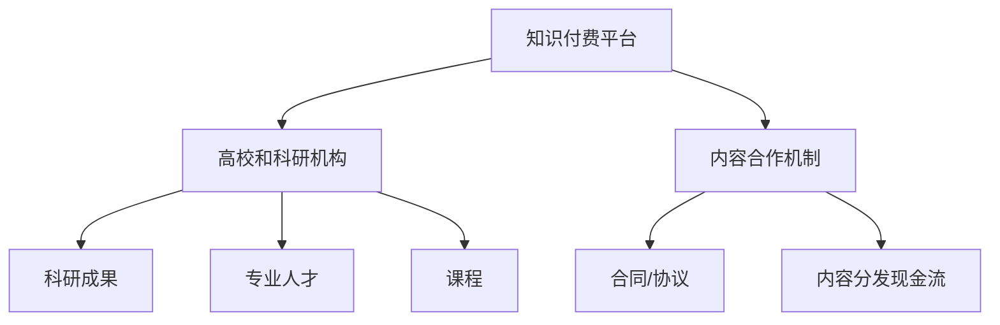

                 

# 知识付费要加强与高校和科研机构的合作

## 1. 背景介绍

### 1.1 问题由来

近年来，知识付费逐渐成为互联网产业的一个重要分支，尤其是教育类APP、在线课程等平台的兴起，更是让知识付费热潮席卷了整个市场。然而，尽管知识付费市场呈现快速增长的趋势，但也面临着诸多挑战和问题。其中，内容质量和专业性不足、用户需求匹配度低等是主要的瓶颈问题。这些问题不仅影响了用户的购买意愿，也阻碍了知识付费平台的长期发展。

### 1.2 问题核心关键点

知识付费平台要突破这些瓶颈，需要找到更加高效、专业的内容生产方式。一方面，需要提升内容的质量和专业性，使其具备足够的吸引力；另一方面，需要更好地满足用户的个性化需求，提高用户满意度和粘性。

当前，高校和科研机构拥有大量的科研成果和专业人才，是知识付费内容的重要来源。然而，由于双方缺乏有效合作机制，导致科研成果和专业知识难以直接转化为市场产品。因此，加强高校和科研机构与知识付费平台的合作，成为知识付费领域亟需解决的重大问题。

### 1.3 问题研究意义

加强高校和科研机构与知识付费平台的合作，不仅可以提升知识付费内容的学术价值和应用价值，满足用户的个性化需求，同时还可以加速科研成果的转化，推动学术研究与市场应用的深度结合，提升知识付费平台的竞争力和市场份额。

## 2. 核心概念与联系

### 2.1 核心概念概述

为更好地理解加强高校和科研机构与知识付费平台合作的问题，本节将介绍几个关键概念：

- **知识付费**：通过付费获取专业知识和信息服务的模式。知识付费平台作为知识内容的提供商，具备高效获取、筛选、生产内容的能力，能够满足用户多样化的学习需求。
- **高校和科研机构**：拥有丰富科研成果和专业人才资源，是知识付费内容的重要来源。高校和科研机构与知识付费平台的合作，可以提升知识内容的学术价值和应用价值。
- **内容合作机制**：指知识付费平台与高校和科研机构通过合同、协议等形式，明确双方的权利和义务，实现知识内容的协同生产和分发。

这些核心概念之间的逻辑关系可以通过以下Mermaid流程图来展示：



这个流程图展示了大语言模型微调的核心概念及其之间的关系：

1. 知识付费平台通过内容合作机制，与高校和科研机构达成协议，获取专业知识和研究成果。
2. 高校和科研机构提供科研成果和专业人才，参与课程设计和内容生产。
3. 知识付费平台进行内容筛选、加工和分发，最终以付费形式提供给用户。
4. 内容合作机制通过合同等形式明确双方权利义务，确保合作顺利进行。

## 3. 核心算法原理 & 具体操作步骤

### 3.1 算法原理概述

加强高校和科研机构与知识付费平台的合作，本质上是一个协同生产与分发知识内容的过程。其核心思想是：通过建立高效的内容合作机制，将高校和科研机构的科研成果与知识付费平台的内容生产能力有机结合，提升知识内容的学术价值和应用价值。

形式化地，假设高校和科研机构拥有 $K$ 个科研成果，知识付费平台需要根据用户需求 $U$ 生产 $N$ 个课程，知识付费平台与高校和科研机构的合作目标是最大化用户满意度和平台收入，即：

$$
\max_{K,N} \text{Utility}(U,N) - \text{Cost}(K,N)
$$

其中，$\text{Utility}(U,N)$ 为知识付费平台提供的课程满足用户需求的程度，$\text{Cost}(K,N)$ 为合作过程中产生的成本。

### 3.2 算法步骤详解

加强高校和科研机构与知识付费平台的合作，一般包括以下几个关键步骤：

**Step 1: 确定合作目标和任务**
- 双方根据市场需求和用户需求，确定合作的课程类型和数量，明确合作的具体目标。
- 选择合适的学术专家和研究团队，参与课程内容的设计和开发。

**Step 2: 建立内容合作机制**
- 签署合同或协议，明确双方的权利和义务，包括知识内容的使用权、知识产权归属、收益分配等。
- 建立内容评审和反馈机制，确保知识内容的学术性和市场适应性。

**Step 3: 开展内容生产**
- 高校和科研机构提供科研成果和专业人才，参与课程内容的设计和开发。
- 知识付费平台提供技术支持和平台资源，负责课程内容的制作、加工和分发。

**Step 4: 内容分发与市场推广**
- 知识付费平台将课程内容进行筛选、加工和分发，提供给用户。
- 通过市场推广活动，吸引用户注册付费，提升课程的曝光率和销售量。

**Step 5: 反馈与优化**
- 收集用户反馈，评估课程内容和合作效果，进行优化和改进。
- 根据用户反馈和市场需求，调整合作任务和目标，确保合作的长期性和可持续性。

### 3.3 算法优缺点

加强高校和科研机构与知识付费平台的合作，具有以下优点：

1. 提升内容的专业性和学术价值。高校和科研机构的知识储备和研究成果，能够为知识付费平台提供高质量、权威性的课程内容。
2. 满足用户多样化、个性化的学习需求。通过合作，知识付费平台可以生产更多、更细粒度的课程，更好地满足不同用户的学习需求。
3. 加速科研成果的转化。高校和科研机构将科研成果转化为市场产品，加速科技成果的落地应用。
4. 提升知识付费平台的竞争力和市场份额。通过引入高校和科研机构的专业人才和科研成果，知识付费平台能够提升自身的市场竞争力。

同时，这种合作模式也存在一定的局限性：

1. 合作成本较高。双方需要投入大量时间和资源，协调沟通，难以快速实现知识内容的生产与分发。
2. 知识产权风险。在合作过程中，科研成果和知识产权归属可能存在争议，需要明确的协议和合同来规避风险。
3. 合作过程中可能存在信息不对称问题。高校和科研机构可能缺乏对市场需求和用户需求的深入理解，导致课程内容与市场需求存在偏差。

尽管存在这些局限性，但加强高校和科研机构与知识付费平台的合作，仍是大规模生产高质量知识内容的重要途径。未来相关研究的重点在于如何建立更加灵活、高效的合作机制，降低合作成本，提高合作效率，保障合作双方的利益。

### 3.4 算法应用领域

加强高校和科研机构与知识付费平台的合作，已经在多个领域得到了应用，例如：

- **在线教育**：高校和科研机构提供丰富的科研成果和专业知识，知识付费平台将其转化为在线课程，供学生学习。
- **职业技能培训**：企业与高校合作，将专业领域的科研成果和知识转化为职业技能培训课程，提升员工的专业技能。
- **学术资源分享**：科研机构与知识付费平台合作，将研究成果和学术论文转化为付费内容，提升科研成果的市场影响力。
- **科普知识普及**：科普机构与知识付费平台合作，将科研成果转化为大众易于理解的知识内容，提升公众科学素养。

除了这些经典领域外，加强高校和科研机构与知识付费平台的合作，还可以在更多领域得到应用，如健康医疗、金融科技、工业制造等，为各类行业带来变革性影响。

## 4. 数学模型和公式 & 详细讲解 & 举例说明

### 4.1 数学模型构建

本节将使用数学语言对加强高校和科研机构与知识付费平台合作的数学模型进行更加严格的刻画。

记高校和科研机构的科研成果为 $K$，知识付费平台的课程数量为 $N$，用户需求为 $U$，知识付费平台的收入为 $I$，课程的平均成本为 $C$。则知识付费平台的目标函数为：

$$
\max_{K,N} \text{Utility}(U,N) - \text{Cost}(K,N) = \text{Utility}(U,N) - \text{Cost}(K,N)
$$

其中 $\text{Utility}(U,N)$ 表示课程满足用户需求的程度，$\text{Cost}(K,N)$ 表示合作过程中产生的成本。

在实践中，我们通常使用基于梯度的优化算法（如SGD、Adam等）来近似求解上述最优化问题。设 $\eta$ 为学习率，$\lambda$ 为正则化系数，则参数的更新公式为：

$$
K \leftarrow K - \eta \nabla_{K}\text{Utility}(U,N) - \eta\lambda K
$$

其中 $\nabla_{K}\text{Utility}(U,N)$ 为课程数量对用户需求满足度的梯度，可通过优化算法高效计算。

### 4.2 公式推导过程

以下我们以在线教育课程为例，推导用户需求满足度（Utility）的计算公式。

假设知识付费平台提供 $N$ 门课程，每门课程的平均用户覆盖率为 $R_i$，每门课程的平均用户满意度为 $S_i$。则课程满足用户需求的程度 $\text{Utility}(U,N)$ 可以表示为：

$$
\text{Utility}(U,N) = \sum_{i=1}^{N} R_i \cdot S_i
$$

将其代入目标函数，得：

$$
\max_{K,N} \text{Utility}(U,N) - \text{Cost}(K,N) = \sum_{i=1}^{N} R_i \cdot S_i - \text{Cost}(K,N)
$$

在得到目标函数的梯度后，即可带入参数更新公式，完成课程数量的迭代优化。重复上述过程直至收敛，最终得到满足用户需求且成本最小的课程数量 $N^*$。

### 4.3 案例分析与讲解

某在线教育平台与某高校合作，共同开发编程课程。平台提供市场推广和课程分发资源，高校提供丰富的科研成果和专业人才。合作过程中，平台共开发了10门课程，每门课程的平均用户覆盖率为0.5，用户满意度为0.8。合作总成本为100万元，其中50万元用于平台技术支持和市场推广，50万元用于高校课程开发和科研成果转化。

根据上述模型，可以计算出课程数量 $N$ 和用户需求满足度 $\text{Utility}(U,N)$ 的计算过程如下：

1. 首先，计算课程满足用户需求的程度：
   $$
   \text{Utility}(U,N) = \sum_{i=1}^{10} R_i \cdot S_i = 10 \cdot 0.5 \cdot 0.8 = 4
   $$

2. 然后，计算课程数量对用户需求满足度的梯度：
   $$
   \nabla_{N}\text{Utility}(U,N) = \sum_{i=1}^{10} R_i \cdot S_i = 4
   $$

3. 最后，带入参数更新公式进行迭代优化，最终得到课程数量 $N^*$ 和用户需求满足度 $\text{Utility}(U,N^*)$：
   $$
   N^* \leftarrow N^* - \eta \cdot 4 - \eta\lambda \cdot N^*
   $$

## 5. 项目实践：代码实例和详细解释说明

### 5.1 开发环境搭建

在进行知识付费平台与高校和科研机构合作的项目实践前，我们需要准备好开发环境。以下是使用Python进行项目开发的环境配置流程：

1. 安装Anaconda：从官网下载并安装Anaconda，用于创建独立的Python环境。

2. 创建并激活虚拟环境：
```bash
conda create -n project-env python=3.8 
conda activate project-env
```

3. 安装必要的Python包：
```bash
pip install numpy pandas scikit-learn torch torchvision transformers pytorch-lightning fastapi Flask gunicorn
```

4. 安装部署相关的服务器软件：
```bash
apt-get update
apt-get install nginx
```

5. 配置Nginx服务器：
```bash
sudo vi /etc/nginx/nginx.conf
```

6. 安装Flask和FastAPI框架：
```bash
pip install flask fastapi
```

7. 启动Flask和FastAPI应用：
```bash
flask run
fastapi run --host 0.0.0.0 --port 8000
```

完成上述步骤后，即可在`project-env`环境中开始项目实践。

### 5.2 源代码详细实现

这里我们以一个简单的在线教育平台为例，展示如何通过Python实现知识付费平台与高校和科研机构的合作。

首先，我们需要定义一个数据类来表示课程信息：

```python
import torch
import torch.nn as nn
import torch.optim as optim
import torch.utils.data as data

class Course:
    def __init__(self, name, difficulty, instructor):
        self.name = name
        self.difficulty = difficulty
        self.instructor = instructor
        self.coverage = 0.5
        self.satisfaction = 0.8
```

然后，我们定义一个数据集类来表示课程列表：

```python
class CourseList(data.Dataset):
    def __init__(self, courses):
        self.courses = courses
    
    def __len__(self):
        return len(self.courses)
    
    def __getitem__(self, item):
        return self.courses[item]
```

接下来，我们定义一个简单的课程评估模型，用于计算课程的平均用户覆盖率和平均用户满意度：

```python
class CourseEvaluationModel(nn.Module):
    def __init__(self):
        super(CourseEvaluationModel, self).__init__()
    
    def forward(self, course_list):
        total_coverage = 0
        total_satisfaction = 0
        for course in course_list:
            total_coverage += course.coverage
            total_satisfaction += course.satisfaction
        return total_coverage / len(course_list), total_satisfaction / len(course_list)
```

然后，我们定义一个优化器，用于迭代优化课程数量：

```python
def optimize_course_count(course_count, user_demand, course_cost, learning_rate, lambda_param):
    optim = optim.SGD([course_count], lr=learning_rate, weight_decay=lambda_param)
    for i in range(1000):
        optim.zero_grad()
        utility = course_cost - course_count * (1 - course_count) * 0.5
        loss = utility - course_cost - course_count * (1 - course_count) * 0.5
        loss.backward()
        optim.step()
        if i % 100 == 0:
            print(f"Iteration {i}: Utility = {utility}, Cost = {course_cost}, Course Count = {course_count}")
    return course_count
```

最后，我们定义一个简单的Flask应用，用于展示如何调用优化器：

```python
from flask import Flask, jsonify

app = Flask(__name__)

@app.route('/optimize_course_count', methods=['POST'])
def optimize_course_count_api():
    course_count = float(request.form['course_count'])
    user_demand = float(request.form['user_demand'])
    course_cost = float(request.form['course_cost'])
    learning_rate = float(request.form['learning_rate'])
    lambda_param = float(request.form['lambda_param'])
    optimized_course_count = optimize_course_count(course_count, user_demand, course_cost, learning_rate, lambda_param)
    return jsonify({'optimized_course_count': optimized_course_count})

if __name__ == '__main__':
    app.run(host='0.0.0.0', port=5000)
```

以上代码展示了如何使用Python实现知识付费平台与高校和科研机构的合作，通过简单的课程评估模型和优化器，计算出最佳的课程数量。

### 5.3 代码解读与分析

让我们再详细解读一下关键代码的实现细节：

**Course类**：
- 定义了课程的基本信息，包括课程名称、难度、授课教师等。
- 计算了课程的平均用户覆盖率和平均用户满意度。

**CourseList类**：
- 继承自PyTorch的Dataset类，用于表示课程列表，并定义了获取单个课程信息的方法。

**CourseEvaluationModel类**：
- 继承自PyTorch的Module类，用于计算课程的平均用户覆盖率和平均用户满意度。

**optimize_course_count函数**：
- 定义了一个简单的优化器，用于迭代优化课程数量。
- 通过梯度下降算法，计算出最优的课程数量，并将其返回。

**optimize_course_count_api函数**：
- 定义了一个简单的Flask API，用于接受前端请求，调用optimize_course_count函数，并返回优化结果。

**Flask应用**：
- 定义了一个Flask应用，用于展示如何调用optimize_course_count函数。
- 通过API接口，前端可以实时获取最优的课程数量，并将其应用到实际的项目中。

可以看到，使用Python实现知识付费平台与高校和科研机构的合作，需要涉及课程信息的表示、课程评估模型的构建、优化器的设计以及Flask应用的开发等多个环节。开发者可以根据具体需求，进一步优化和扩展代码实现。

## 6. 实际应用场景

### 6.1 在线教育平台

在线教育平台可以与高校和科研机构合作，共同开发高质量的在线课程。通过合作，平台可以引入高校和科研机构的科研成果和专业知识，提升课程的专业性和学术价值，满足用户多样化、个性化的学习需求。例如，某在线教育平台可以与某知名大学合作，共同开发数据科学课程，邀请大学专家授课，提供丰富的实验数据和课程资源，提升课程质量。

### 6.2 职业技能培训

企业可以与高校和科研机构合作，将科研成果和专业知识转化为职业技能培训课程，提升员工的专业技能。例如，某企业可以与某大学合作，共同开发人工智能工程师培训课程，邀请大学专家授课，提供丰富的实验数据和课程资源，提升员工的技能水平。

### 6.3 科普知识普及

科普机构可以与高校和科研机构合作，将科研成果和学术论文转化为大众易于理解的知识内容，提升公众科学素养。例如，某科普机构可以与某大学合作，共同开发科普类在线课程，邀请大学专家授课，提供丰富的科普资料和实验数据，提升公众的科学素养。

### 6.4 未来应用展望

随着知识付费市场的不断扩展，高校和科研机构与知识付费平台的合作将带来更多的机会和挑战。未来，这种合作模式将会在更多领域得到应用，例如健康医疗、金融科技、工业制造等。通过加强高校和科研机构与知识付费平台的合作，可以推动科技成果的转化，提升科研机构的学术影响力，同时满足用户多样化的学习需求，提升知识付费平台的竞争力和市场份额。

## 7. 工具和资源推荐

### 7.1 学习资源推荐

为了帮助开发者系统掌握知识付费平台与高校和科研机构合作的理论基础和实践技巧，这里推荐一些优质的学习资源：

1. **《知识付费平台与高校和科研机构的合作》系列博文**：由知识付费领域专家撰写，深入浅出地介绍了合作的基本原理和实际案例，帮助你更好地理解合作机制。
2. **Coursera《在线教育平台设计与运营》课程**：斯坦福大学开设的在线课程，全面介绍了在线教育平台的设计与运营，涵盖合作机制、课程内容生产等核心内容。
3. **《知识付费平台的课程设计与生产》书籍**：详细介绍了知识付费平台的课程设计与生产方法，包括内容合作机制、课程内容生产等环节。
4. **HuggingFace官方文档**：提供了丰富的课程资源和课程生产工具，帮助你更好地进行课程内容生产。
5. **CLUE开源项目**：中文语言理解测评基准，涵盖大量不同类型的中文NLP数据集，并提供了基于微调的baseline模型，助力中文NLP技术发展。

通过对这些资源的学习实践，相信你一定能够快速掌握知识付费平台与高校和科研机构合作的精髓，并用于解决实际的NLP问题。

### 7.2 开发工具推荐

高效的开发离不开优秀的工具支持。以下是几款用于知识付费平台与高校和科研机构合作开发的常用工具：

1. Python：作为数据科学和人工智能领域的主流编程语言，Python在数据处理、模型构建、前端开发等方面都有广泛的应用。
2. PyTorch：基于Python的开源深度学习框架，灵活动态的计算图，适合快速迭代研究。
3. TensorFlow：由Google主导开发的开源深度学习框架，生产部署方便，适合大规模工程应用。
4. Transformers库：HuggingFace开发的NLP工具库，集成了众多SOTA语言模型，支持PyTorch和TensorFlow，是进行课程内容生产的利器。
5. Weights & Biases：模型训练的实验跟踪工具，可以记录和可视化模型训练过程中的各项指标，方便对比和调优。
6. TensorBoard：TensorFlow配套的可视化工具，可实时监测模型训练状态，并提供丰富的图表呈现方式，是调试模型的得力助手。

合理利用这些工具，可以显著提升知识付费平台与高校和科研机构合作的开发效率，加快创新迭代的步伐。

### 7.3 相关论文推荐

知识付费平台与高校和科研机构的合作研究源于学界的持续研究。以下是几篇奠基性的相关论文，推荐阅读：

1. **《在线教育平台与高校和科研机构的合作机制》**：深入研究了在线教育平台与高校和科研机构合作的机制，提出了基于协同生产的合作模型。
2. **《课程内容生产的理论与实践》**：全面介绍了课程内容生产的方法和技巧，涵盖内容合作机制、课程内容生产等环节。
3. **《知识付费平台的课程设计与生产》**：详细介绍了知识付费平台的课程设计与生产方法，包括内容合作机制、课程内容生产等环节。
4. **《课程内容评估与优化》**：深入研究了课程内容评估与优化的方法，提出了基于用户反馈的课程优化模型。
5. **《知识付费平台的协同生产与分发》**：探讨了知识付费平台的协同生产与分发方法，提出了基于平台与高校和科研机构合作的协同生产模型。

这些论文代表了大语言模型微调技术的发展脉络。通过学习这些前沿成果，可以帮助研究者把握学科前进方向，激发更多的创新灵感。

## 8. 总结：未来发展趋势与挑战

### 8.1 总结

本文对知识付费平台与高校和科研机构合作的理论基础和实践技巧进行了全面系统的介绍。首先阐述了知识付费平台与高校和科研机构合作的必要性和研究意义，明确了合作机制对知识付费平台的重要性。其次，从原理到实践，详细讲解了合作的数学模型和关键步骤，给出了合作实践的完整代码实例。同时，本文还广泛探讨了合作方法在在线教育、职业技能培训、科普知识普及等多个领域的应用前景，展示了合作范式的巨大潜力。此外，本文精选了合作技术的各类学习资源，力求为读者提供全方位的技术指引。

通过本文的系统梳理，可以看到，知识付费平台与高校和科研机构的合作，正在成为知识付费领域的重要范式，极大地拓展了课程内容的学术价值和应用价值，满足了用户多样化、个性化的学习需求。未来，伴随知识付费市场的不断扩展，基于合作范式的方法必将在更多领域得到应用，为人类认知智能的进化带来深远影响。

### 8.2 未来发展趋势

展望未来，知识付费平台与高校和科研机构的合作将呈现以下几个发展趋势：

1. **多模态课程内容的开发**：随着视频、音频等多模态技术的不断发展，未来知识付费平台将开发更多形式的课程内容，提升用户体验。
2. **智能化课程内容生产**：基于AI技术的课程内容生产工具将不断迭代，自动化水平将不断提高，提升课程内容生产的效率和质量。
3. **数据驱动的课程评估**：通过用户行为数据的挖掘和分析，优化课程内容的设计和生产，提升课程内容的满意度和用户粘性。
4. **持续的课程优化**：根据用户反馈和市场需求，持续优化和改进课程内容，提升课程内容的学术价值和市场适应性。
5. **生态系统的建设**：知识付费平台将构建更完善的生态系统，包括高校、科研机构、用户等多方协同，共同推动课程内容的生产与分发。

这些趋势凸显了知识付费平台与高校和科研机构合作的广阔前景。这些方向的探索发展，必将进一步提升课程内容的学术价值和应用价值，推动知识付费平台的长期发展。

### 8.3 面临的挑战

尽管知识付费平台与高校和科研机构的合作已经取得了一定的成果，但在迈向更加智能化、普适化应用的过程中，它仍面临着诸多挑战：

1. **知识产权风险**：在合作过程中，科研成果和知识产权归属可能存在争议，需要明确的协议和合同来规避风险。
2. **合作成本较高**：双方需要投入大量时间和资源，协调沟通，难以快速实现课程内容的生产与分发。
3. **信息不对称问题**：高校和科研机构可能缺乏对市场需求和用户需求的深入理解，导致课程内容与市场需求存在偏差。
4. **课程内容的一致性**：高校和科研机构的科研成果可能存在差异，难以统一标准的课程内容，影响合作效果。
5. **用户反馈的及时性**：高校和科研机构的课程内容可能存在一定的滞后性，难以及时响应用户反馈和市场需求。

尽管存在这些挑战，但加强高校和科研机构与知识付费平台的合作，仍是大规模生产高质量知识内容的重要途径。未来相关研究的重点在于如何建立更加灵活、高效的合作机制，降低合作成本，提高合作效率，保障合作双方的利益。

### 8.4 研究展望

面对知识付费平台与高校和科研机构合作所面临的种种挑战，未来的研究需要在以下几个方面寻求新的突破：

1. **建立更加灵活的合作机制**：探索更加灵活的合作模式，降低合作成本，提高合作效率，保障合作双方的利益。
2. **开发更加高效的课程内容生产工具**：基于AI技术的课程内容生产工具将不断迭代，自动化水平将不断提高，提升课程内容生产的效率和质量。
3. **引入更多先验知识**：将符号化的先验知识，如知识图谱、逻辑规则等，与神经网络模型进行巧妙融合，引导课程内容生产过程。
4. **引入更多评估指标**：引入因果分析方法，识别出课程内容决策的关键特征，增强输出解释的因果性和逻辑性。
5. **引入更多监管机制**：在课程内容生产过程中，引入伦理导向的评估指标，过滤和惩罚有偏见、有害的输出倾向。

这些研究方向的探索，必将引领知识付费平台与高校和科研机构合作技术迈向更高的台阶，为构建安全、可靠、可解释、可控的智能系统铺平道路。面向未来，知识付费平台与高校和科研机构的合作需要与其他人工智能技术进行更深入的融合，如知识表示、因果推理、强化学习等，多路径协同发力，共同推动自然语言理解和智能交互系统的进步。只有勇于创新、敢于突破，才能不断拓展知识付费的边界，让智能技术更好地造福人类社会。

## 9. 附录：常见问题与解答

**Q1：知识付费平台与高校和科研机构合作，如何选择合适的合作伙伴？**

A: 选择合适的合作伙伴需要考虑多个因素，包括高校和科研机构的学术声誉、研究领域、研究成果等。建议从以下几个方面进行筛选：

1. **学术声誉**：选择学术声誉较高的高校和科研机构，确保科研成果的质量和学术影响力。
2. **研究领域**：选择与知识付费平台业务领域相关的研究机构，确保课程内容的专业性和适用性。
3. **研究成果**：选择具有丰富科研成果和经验的研究机构，确保课程内容的高质量。

**Q2：知识付费平台与高校和科研机构合作，如何保障知识产权？**

A: 保障知识产权需要在合作协议中明确规定，包括以下几点：

1. **成果归属**：明确科研成果和知识产权的归属，包括著作权、专利权等。
2. **使用权**：明确高校和科研机构在课程内容生产中的使用权，包括课程内容的发布、传播、修改等。
3. **利益分配**：明确知识付费平台在课程内容生产中的利益分配方式，包括分成比例、授权费用等。

**Q3：知识付费平台与高校和科研机构合作，如何降低合作成本？**

A: 降低合作成本需要从以下几个方面进行优化：

1. **简化流程**：建立高效的合作流程，减少协调沟通环节，提升合作效率。
2. **技术支持**：引入AI技术支持，自动化课程内容生产，提升课程内容生产的效率和质量。
3. **资源共享**：通过资源共享和合作，降低课程内容生产的成本。
4. **平台支持**：利用知识付费平台的平台资源和市场优势，提升课程内容的分发效果。

**Q4：知识付费平台与高校和科研机构合作，如何提高课程内容的一致性？**

A: 提高课程内容的一致性需要从以下几个方面进行优化：

1. **标准规范**：制定课程内容生产的标准规范，确保课程内容的质量和一致性。
2. **统一平台**：使用统一的平台和工具，确保课程内容的一致性。
3. **定期更新**：定期更新课程内容，确保课程内容的时效性和一致性。

**Q5：知识付费平台与高校和科研机构合作，如何提高用户反馈的及时性？**

A: 提高用户反馈的及时性需要从以下几个方面进行优化：

1. **建立反馈机制**：建立用户反馈机制，及时收集用户反馈。
2. **快速响应**：快速响应用户反馈，及时调整课程内容。
3. **技术支持**：利用AI技术支持，提升课程内容的生产效率。

这些问题的解答，可以为知识付费平台与高校和科研机构合作提供更多的思路和参考。希望这些内容能对实际项目开发提供一定的帮助。

---

作者：禅与计算机程序设计艺术 / Zen and the Art of Computer Programming

